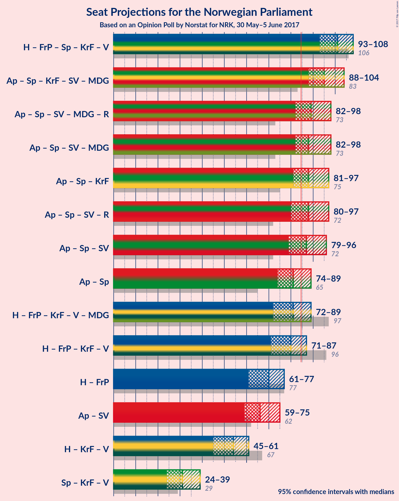

# Opinion Poll by Norstat for NRK, 30 May–5 June 2017

<a href="#voting-intentions">Voting Intentions</a> | <a href="#seats">Seats</a> | <a href="#coalitions">Coalitions</a> | <a href="#technical-information">Technical Information</a>

## Voting Intentions

### Confidence Intervals

| Party | Last Result | Poll Result | 80% Confidence Interval | 90% Confidence Interval | 95% Confidence Interval | 99% Confidence Interval |
|:-----:|:-----------:|:-----------:|:-----------------------:|:-----------------------:|:-----------------------:|:-----------------------:|
| Arbeiderpartiet | 30.8% | 32.9% | 31.0–35.0% |30.5–35.5% |30.0–36.0% |29.1–37.0% |
| Høyre | 26.8% | 23.7% | 22.0–25.5% |21.5–26.1% |21.0–26.5% |20.3–27.4% |
| Fremskrittspartiet | 16.3% | 14.0% | 12.6–15.5% |12.2–16.0% |11.9–16.4% |11.3–17.1% |
| Senterpartiet | 5.5% | 11.6% | 10.4–13.1% |10.0–13.5% |9.7–13.9% |9.1–14.6% |
| Kristelig Folkeparti | 5.6% | 4.4% | 3.7–5.4% |3.4–5.7% |3.3–5.9% |2.9–6.4% |
| Sosialistisk Venstreparti | 4.1% | 4.3% | 3.6–5.3% |3.4–5.6% |3.2–5.8% |2.9–6.3% |
| Venstre | 5.2% | 3.4% | 2.8–4.3% |2.6–4.6% |2.5–4.8% |2.2–5.3% |
| Miljøpartiet de Grønne | 2.8% | 2.8% | 2.2–3.6% |2.0–3.9% |1.9–4.1% |1.7–4.5% |
| Rødt | 1.1% | 1.2% | 0.8–1.8% |0.7–2.0% |0.7–2.1% |0.5–2.4% |

*Note:* The poll result column reflects the actual value used in the calculations. Published results may vary slightly, and in addition be rounded to fewer digits.

## Seats

### Confidence Intervals

| Party | Last Result | Median | 80% Confidence Interval | 90% Confidence Interval | 95% Confidence Interval | 99% Confidence Interval |
|:-----:|:-----------:|:------:|:-----------------------:|:-----------------------:|:-----------------------:|:-----------------------:|
| <a href="#arbeiderpartiet">Arbeiderpartiet</a> | 55 | 60 | 55–65 |55–66 |54–67 |52–69 |
| <a href="#høyre">Høyre</a> | 48 | 43 | 39–47 |38–47 |37–48 |37–50 |
| <a href="#fremskrittspartiet">Fremskrittspartiet</a> | 29 | 25 | 22–28 |21–30 |21–31 |20–32 |
| <a href="#senterpartiet">Senterpartiet</a> | 10 | 21 | 19–25 |19–25 |18–26 |16–26 |
| <a href="#kristelig-folkeparti">Kristelig Folkeparti</a> | 10 | 8 | 2–10 |2–10 |2–11 |1–11 |
| <a href="#sosialistisk-venstreparti">Sosialistisk Venstreparti</a> | 7 | 8 | 2–11 |1–11 |1–11 |1–11 |
| <a href="#venstre">Venstre</a> | 9 | 2 | 1–8 |1–8 |1–9 |0–9 |
| <a href="#miljøpartiet-de-grønne">Miljøpartiet de Grønne</a> | 1 | 1 | 1–3 |1–4 |1–7 |0–8 |
| <a href="#rødt">Rødt</a> | 0 | 1 | 0–1 |0–1 |0–1 |0–1 |

### Arbeiderpartiet

| Number of Seats | Probability | Accumulated |
|:---------------:|:-----------:|:-----------:|
| 51 | 0.2% | 100% |
| 52 | 0.3% | 99.7% |
| 53 | 0.5% | 99.4% |
| 54 | 2% | 98.9% |
| 55 | 13% | 97% |
| 56 | 2% | 84% |
| 57 | 8% | 82% |
| 58 | 16% | 74% |
| 59 | 3% | 58% |
| 60 | 6% | 55% |
| 61 | 13% | 49% |
| 62 | 15% | 36% |
| 63 | 2% | 21% |
| 64 | 9% | 19% |
| 65 | 3% | 10% |
| 66 | 4% | 7% |
| 67 | 2% | 4% |
| 68 | 2% | 2% |
| 69 | 0.2% | 0.5% |
| 70 | 0.1% | 0.3% |
| 71 | 0.1% | 0.2% |
| 72 | 0% | 0% |

### Høyre

| Number of Seats | Probability | Accumulated |
|:---------------:|:-----------:|:-----------:|
| 34 | 0% | 100% |
| 35 | 0.1% | 99.9% |
| 36 | 0.3% | 99.9% |
| 37 | 4% | 99.5% |
| 38 | 3% | 96% |
| 39 | 6% | 93% |
| 40 | 6% | 88% |
| 41 | 19% | 81% |
| 42 | 9% | 62% |
| 43 | 11% | 54% |
| 44 | 10% | 43% |
| 45 | 13% | 33% |
| 46 | 7% | 20% |
| 47 | 8% | 12% |
| 48 | 2% | 4% |
| 49 | 2% | 2% |
| 50 | 0.3% | 0.5% |
| 51 | 0.1% | 0.2% |
| 52 | 0.1% | 0.1% |
| 53 | 0.1% | 0.1% |
| 54 | 0% | 0% |

### Fremskrittspartiet

| Number of Seats | Probability | Accumulated |
|:---------------:|:-----------:|:-----------:|
| 19 | 0.1% | 100% |
| 20 | 1.4% | 99.9% |
| 21 | 8% | 98% |
| 22 | 3% | 90% |
| 23 | 8% | 88% |
| 24 | 18% | 79% |
| 25 | 20% | 62% |
| 26 | 15% | 42% |
| 27 | 10% | 27% |
| 28 | 10% | 17% |
| 29 | 2% | 7% |
| 30 | 3% | 5% |
| 31 | 2% | 3% |
| 32 | 0.6% | 0.7% |
| 33 | 0% | 0.1% |
| 34 | 0% | 0% |

### Senterpartiet

| Number of Seats | Probability | Accumulated |
|:---------------:|:-----------:|:-----------:|
| 15 | 0.3% | 100% |
| 16 | 0.3% | 99.7% |
| 17 | 0.4% | 99.4% |
| 18 | 4% | 99.0% |
| 19 | 15% | 95% |
| 20 | 19% | 80% |
| 21 | 21% | 61% |
| 22 | 8% | 40% |
| 23 | 8% | 32% |
| 24 | 13% | 24% |
| 25 | 7% | 11% |
| 26 | 4% | 4% |
| 27 | 0.1% | 0.3% |
| 28 | 0.1% | 0.1% |
| 29 | 0% | 0% |

### Kristelig Folkeparti

| Number of Seats | Probability | Accumulated |
|:---------------:|:-----------:|:-----------:|
| 1 | 1.4% | 100% |
| 2 | 33% | 98.6% |
| 3 | 0.1% | 66% |
| 4 | 0% | 65% |
| 5 | 0% | 65% |
| 6 | 0% | 65% |
| 7 | 7% | 65% |
| 8 | 27% | 58% |
| 9 | 21% | 31% |
| 10 | 7% | 10% |
| 11 | 3% | 3% |
| 12 | 0.3% | 0.5% |
| 13 | 0.1% | 0.2% |
| 14 | 0% | 0% |

### Sosialistisk Venstreparti

| Number of Seats | Probability | Accumulated |
|:---------------:|:-----------:|:-----------:|
| 1 | 9% | 100% |
| 2 | 15% | 91% |
| 3 | 0% | 77% |
| 4 | 0% | 77% |
| 5 | 0% | 77% |
| 6 | 0% | 77% |
| 7 | 4% | 77% |
| 8 | 28% | 72% |
| 9 | 28% | 44% |
| 10 | 5% | 16% |
| 11 | 11% | 12% |
| 12 | 0.1% | 0.4% |
| 13 | 0.2% | 0.2% |
| 14 | 0% | 0% |

### Venstre

| Number of Seats | Probability | Accumulated |
|:---------------:|:-----------:|:-----------:|
| 0 | 0.6% | 100% |
| 1 | 21% | 99.4% |
| 2 | 38% | 78% |
| 3 | 6% | 40% |
| 4 | 0% | 35% |
| 5 | 0% | 35% |
| 6 | 0% | 35% |
| 7 | 9% | 35% |
| 8 | 21% | 26% |
| 9 | 4% | 5% |
| 10 | 0.3% | 0.4% |
| 11 | 0.1% | 0.1% |
| 12 | 0% | 0% |

### Miljøpartiet de Grønne

| Number of Seats | Probability | Accumulated |
|:---------------:|:-----------:|:-----------:|
| 0 | 0.6% | 100% |
| 1 | 85% | 99.4% |
| 2 | 2% | 14% |
| 3 | 5% | 12% |
| 4 | 4% | 8% |
| 5 | 0% | 4% |
| 6 | 0% | 4% |
| 7 | 2% | 4% |
| 8 | 2% | 2% |
| 9 | 0.1% | 0.1% |
| 10 | 0% | 0% |

### Rødt

| Number of Seats | Probability | Accumulated |
|:---------------:|:-----------:|:-----------:|
| 0 | 32% | 100% |
| 1 | 67% | 68% |
| 2 | 0.4% | 0.4% |
| 3 | 0% | 0% |

## Coalitions

### Confidence Intervals

| Coalition | Last Result | Median | 80% Confidence Interval | 90% Confidence Interval | 95% Confidence Interval | 99% Confidence Interval |
|:---------:|:-----------:|:------:|:-----------------------:|:-----------------------:|:-----------------------:|:-----------------------:|
| Høyre – Fremskrittspartiet – Senterpartiet – Kristelig Folkeparti – Venstre | 106 | 99 | 96–105 | 94–106 | 92–108 | 90–110 |
| Arbeiderpartiet – Senterpartiet – Kristelig Folkeparti – Sosialistisk Venstreparti – Miljøpartiet de Grønne | 83 | 96 | 92–100 | 90–102 | 88–104 | 86–107 |
| Arbeiderpartiet – Senterpartiet – Sosialistisk Venstreparti – Miljøpartiet de Grønne – Rødt | 73 | 92 | 86–96 | 83–97 | 82–98 | 79–99 |
| Arbeiderpartiet – Senterpartiet – Sosialistisk Venstreparti – Miljøpartiet de Grønne | 73 | 91 | 85–95 | 83–97 | 82–98 | 79–99 |
| Arbeiderpartiet – Senterpartiet – Kristelig Folkeparti | 75 | 87 | 83–93 | 83–95 | 81–97 | 79–97 |
| Arbeiderpartiet – Senterpartiet – Sosialistisk Venstreparti – Rødt | 72 | 90 | 84–94 | 82–95 | 79–97 | 78–97 |
| Arbeiderpartiet – Senterpartiet – Sosialistisk Venstreparti | 72 | 89 | 83–94 | 82–95 | 79–97 | 77–97 |
| Arbeiderpartiet – Senterpartiet | 65 | 81 | 76–88 | 76–88 | 75–90 | 73–92 |
| Høyre – Fremskrittspartiet – Kristelig Folkeparti – Venstre – Miljøpartiet de Grønne | 97 | 79 | 75–85 | 74–87 | 72–90 | 72–91 |
| Høyre – Fremskrittspartiet – Kristelig Folkeparti – Venstre | 96 | 77 | 73–83 | 72–86 | 71–87 | 70–90 |
| Høyre – Fremskrittspartiet | 77 | 67 | 62–73 | 62–75 | 61–75 | 60–78 |
| Arbeiderpartiet – Sosialistisk Venstreparti | 62 | 68 | 62–72 | 60–73 | 59–75 | 56–76 |
| Høyre – Kristelig Folkeparti – Venstre | 67 | 53 | 48–59 | 46–60 | 45–61 | 45–64 |
| Senterpartiet – Kristelig Folkeparti – Venstre | 29 | 31 | 27–36 | 25–39 | 25–39 | 23–41 |

### Høyre – Fremskrittspartiet – Senterpartiet – Kristelig Folkeparti – Venstre

| Number of Seats | Probability | Accumulated |
|:---------------:|:-----------:|:-----------:|
| 88 | 0.1% | 100% |
| 89 | 0.1% | 99.9% |
| 90 | 1.5% | 99.8% |
| 91 | 0.3% | 98% |
| 92 | 0.7% | 98% |
| 93 | 2% | 97% |
| 94 | 2% | 96% |
| 95 | 3% | 94% |
| 96 | 15% | 91% |
| 97 | 8% | 76% |
| 98 | 15% | 69% |
| 99 | 7% | 53% |
| 100 | 3% | 46% |
| 101 | 13% | 43% |
| 102 | 6% | 31% |
| 103 | 3% | 25% |
| 104 | 9% | 22% |
| 105 | 4% | 12% |
| 106 | 4% | 8% |
| 107 | 0.6% | 3% |
| 108 | 1.4% | 3% |
| 109 | 0.9% | 2% |
| 110 | 0.2% | 0.6% |
| 111 | 0.3% | 0.4% |
| 112 | 0.1% | 0.2% |
| 113 | 0% | 0% |

### Arbeiderpartiet – Senterpartiet – Kristelig Folkeparti – Sosialistisk Venstreparti – Miljøpartiet de Grønne

| Number of Seats | Probability | Accumulated |
|:---------------:|:-----------:|:-----------:|
| 84 | 0.1% | 100% |
| 85 | 0% | 99.9% |
| 86 | 0.4% | 99.8% |
| 87 | 1.4% | 99.4% |
| 88 | 0.9% | 98% |
| 89 | 2% | 97% |
| 90 | 1.3% | 95% |
| 91 | 1.3% | 94% |
| 92 | 6% | 93% |
| 93 | 6% | 87% |
| 94 | 11% | 81% |
| 95 | 12% | 70% |
| 96 | 14% | 58% |
| 97 | 6% | 44% |
| 98 | 3% | 38% |
| 99 | 15% | 35% |
| 100 | 11% | 20% |
| 101 | 4% | 9% |
| 102 | 1.4% | 6% |
| 103 | 0.3% | 4% |
| 104 | 1.4% | 4% |
| 105 | 0.7% | 2% |
| 106 | 0.2% | 2% |
| 107 | 1.4% | 1.5% |
| 108 | 0.1% | 0.1% |
| 109 | 0% | 0% |

### Arbeiderpartiet – Senterpartiet – Sosialistisk Venstreparti – Miljøpartiet de Grønne – Rødt

| Number of Seats | Probability | Accumulated |
|:---------------:|:-----------:|:-----------:|
| 76 | 0.1% | 100% |
| 77 | 0% | 99.9% |
| 78 | 0% | 99.9% |
| 79 | 0.4% | 99.8% |
| 80 | 0.7% | 99.5% |
| 81 | 0.5% | 98.7% |
| 82 | 1.2% | 98% |
| 83 | 3% | 97% |
| 84 | 3% | 95% |
| 85 | 1.4% | 92% |
| 86 | 3% | 90% |
| 87 | 10% | 87% |
| 88 | 5% | 77% |
| 89 | 8% | 72% |
| 90 | 5% | 64% |
| 91 | 9% | 59% |
| 92 | 12% | 50% |
| 93 | 16% | 38% |
| 94 | 9% | 23% |
| 95 | 3% | 14% |
| 96 | 5% | 11% |
| 97 | 1.0% | 6% |
| 98 | 3% | 5% |
| 99 | 1.5% | 2% |
| 100 | 0.2% | 0.4% |
| 101 | 0.1% | 0.2% |
| 102 | 0.1% | 0.1% |
| 103 | 0.1% | 0.1% |
| 104 | 0% | 0% |

### Arbeiderpartiet – Senterpartiet – Sosialistisk Venstreparti – Miljøpartiet de Grønne

| Number of Seats | Probability | Accumulated |
|:---------------:|:-----------:|:-----------:|
| 75 | 0.1% | 100% |
| 76 | 0.1% | 99.9% |
| 77 | 0% | 99.9% |
| 78 | 0.2% | 99.8% |
| 79 | 0.2% | 99.6% |
| 80 | 1.0% | 99.4% |
| 81 | 0.2% | 98% |
| 82 | 2% | 98% |
| 83 | 3% | 96% |
| 84 | 2% | 93% |
| 85 | 3% | 91% |
| 86 | 9% | 88% |
| 87 | 4% | 79% |
| 88 | 10% | 75% |
| 89 | 4% | 65% |
| 90 | 9% | 61% |
| 91 | 13% | 53% |
| 92 | 14% | 40% |
| 93 | 8% | 26% |
| 94 | 6% | 18% |
| 95 | 6% | 12% |
| 96 | 0.8% | 6% |
| 97 | 1.0% | 5% |
| 98 | 2% | 4% |
| 99 | 1.5% | 2% |
| 100 | 0.2% | 0.3% |
| 101 | 0.1% | 0.1% |
| 102 | 0% | 0.1% |
| 103 | 0% | 0.1% |
| 104 | 0% | 0% |

### Arbeiderpartiet – Senterpartiet – Kristelig Folkeparti

| Number of Seats | Probability | Accumulated |
|:---------------:|:-----------:|:-----------:|
| 77 | 0.1% | 100% |
| 78 | 0.2% | 99.8% |
| 79 | 0.8% | 99.7% |
| 80 | 0.7% | 98.9% |
| 81 | 2% | 98% |
| 82 | 1.4% | 97% |
| 83 | 6% | 95% |
| 84 | 13% | 89% |
| 85 | 3% | 76% |
| 86 | 8% | 74% |
| 87 | 20% | 65% |
| 88 | 8% | 45% |
| 89 | 9% | 38% |
| 90 | 9% | 29% |
| 91 | 5% | 20% |
| 92 | 4% | 15% |
| 93 | 2% | 10% |
| 94 | 2% | 8% |
| 95 | 2% | 6% |
| 96 | 1.5% | 4% |
| 97 | 2% | 3% |
| 98 | 0.1% | 0.4% |
| 99 | 0.1% | 0.4% |
| 100 | 0.1% | 0.2% |
| 101 | 0.1% | 0.1% |
| 102 | 0% | 0% |

### Arbeiderpartiet – Senterpartiet – Sosialistisk Venstreparti – Rødt

| Number of Seats | Probability | Accumulated |
|:---------------:|:-----------:|:-----------:|
| 75 | 0.1% | 100% |
| 76 | 0% | 99.9% |
| 77 | 0.3% | 99.8% |
| 78 | 2% | 99.5% |
| 79 | 0.9% | 98% |
| 80 | 0.5% | 97% |
| 81 | 0.6% | 97% |
| 82 | 3% | 96% |
| 83 | 3% | 93% |
| 84 | 1.3% | 90% |
| 85 | 3% | 89% |
| 86 | 12% | 85% |
| 87 | 5% | 73% |
| 88 | 8% | 68% |
| 89 | 3% | 60% |
| 90 | 8% | 56% |
| 91 | 16% | 48% |
| 92 | 15% | 33% |
| 93 | 5% | 18% |
| 94 | 3% | 13% |
| 95 | 6% | 10% |
| 96 | 0.7% | 4% |
| 97 | 3% | 3% |
| 98 | 0.1% | 0.3% |
| 99 | 0.1% | 0.2% |
| 100 | 0% | 0.1% |
| 101 | 0% | 0.1% |
| 102 | 0% | 0% |

### Arbeiderpartiet – Senterpartiet – Sosialistisk Venstreparti

| Number of Seats | Probability | Accumulated |
|:---------------:|:-----------:|:-----------:|
| 74 | 0.1% | 100% |
| 75 | 0.1% | 99.9% |
| 76 | 0% | 99.9% |
| 77 | 0.5% | 99.8% |
| 78 | 2% | 99.3% |
| 79 | 1.1% | 98% |
| 80 | 0.5% | 97% |
| 81 | 1.1% | 96% |
| 82 | 4% | 95% |
| 83 | 3% | 92% |
| 84 | 3% | 89% |
| 85 | 9% | 86% |
| 86 | 6% | 77% |
| 87 | 10% | 71% |
| 88 | 4% | 61% |
| 89 | 7% | 57% |
| 90 | 16% | 50% |
| 91 | 14% | 34% |
| 92 | 4% | 21% |
| 93 | 6% | 17% |
| 94 | 5% | 11% |
| 95 | 2% | 5% |
| 96 | 0.9% | 4% |
| 97 | 2% | 3% |
| 98 | 0.2% | 0.3% |
| 99 | 0.1% | 0.1% |
| 100 | 0% | 0.1% |
| 101 | 0% | 0% |

### Arbeiderpartiet – Senterpartiet

| Number of Seats | Probability | Accumulated |
|:---------------:|:-----------:|:-----------:|
| 70 | 0.1% | 100% |
| 71 | 0% | 99.9% |
| 72 | 0.1% | 99.9% |
| 73 | 0.5% | 99.8% |
| 74 | 1.2% | 99.2% |
| 75 | 3% | 98% |
| 76 | 6% | 95% |
| 77 | 8% | 89% |
| 78 | 6% | 82% |
| 79 | 16% | 76% |
| 80 | 7% | 60% |
| 81 | 6% | 53% |
| 82 | 13% | 47% |
| 83 | 6% | 34% |
| 84 | 3% | 29% |
| 85 | 7% | 26% |
| 86 | 5% | 19% |
| 87 | 3% | 14% |
| 88 | 7% | 11% |
| 89 | 0.2% | 3% |
| 90 | 2% | 3% |
| 91 | 0.1% | 2% |
| 92 | 1.4% | 2% |
| 93 | 0.1% | 0.2% |
| 94 | 0.1% | 0.1% |
| 95 | 0% | 0% |

### Høyre – Fremskrittspartiet – Kristelig Folkeparti – Venstre – Miljøpartiet de Grønne

| Number of Seats | Probability | Accumulated |
|:---------------:|:-----------:|:-----------:|
| 68 | 0% | 100% |
| 69 | 0% | 99.9% |
| 70 | 0.1% | 99.9% |
| 71 | 0.1% | 99.8% |
| 72 | 3% | 99.7% |
| 73 | 0.7% | 97% |
| 74 | 6% | 96% |
| 75 | 3% | 90% |
| 76 | 5% | 87% |
| 77 | 15% | 82% |
| 78 | 16% | 67% |
| 79 | 8% | 52% |
| 80 | 3% | 44% |
| 81 | 8% | 40% |
| 82 | 5% | 32% |
| 83 | 12% | 27% |
| 84 | 3% | 15% |
| 85 | 1.3% | 11% |
| 86 | 3% | 10% |
| 87 | 3% | 7% |
| 88 | 0.6% | 4% |
| 89 | 0.5% | 3% |
| 90 | 0.9% | 3% |
| 91 | 2% | 2% |
| 92 | 0.3% | 0.5% |
| 93 | 0% | 0.2% |
| 94 | 0.1% | 0.1% |
| 95 | 0% | 0% |

### Høyre – Fremskrittspartiet – Kristelig Folkeparti – Venstre

| Number of Seats | Probability | Accumulated |
|:---------------:|:-----------:|:-----------:|
| 66 | 0.1% | 100% |
| 67 | 0.1% | 99.9% |
| 68 | 0.1% | 99.9% |
| 69 | 0.2% | 99.8% |
| 70 | 1.5% | 99.6% |
| 71 | 3% | 98% |
| 72 | 1.0% | 95% |
| 73 | 5% | 94% |
| 74 | 3% | 89% |
| 75 | 9% | 86% |
| 76 | 16% | 77% |
| 77 | 12% | 62% |
| 78 | 9% | 50% |
| 79 | 5% | 41% |
| 80 | 8% | 36% |
| 81 | 5% | 28% |
| 82 | 10% | 23% |
| 83 | 3% | 13% |
| 84 | 1.4% | 10% |
| 85 | 3% | 8% |
| 86 | 3% | 5% |
| 87 | 1.2% | 3% |
| 88 | 0.5% | 2% |
| 89 | 0.7% | 1.3% |
| 90 | 0.4% | 0.5% |
| 91 | 0% | 0.2% |
| 92 | 0% | 0.1% |
| 93 | 0.1% | 0.1% |
| 94 | 0% | 0% |

### Høyre – Fremskrittspartiet

| Number of Seats | Probability | Accumulated |
|:---------------:|:-----------:|:-----------:|
| 58 | 0.2% | 100% |
| 59 | 0.2% | 99.8% |
| 60 | 0.6% | 99.6% |
| 61 | 2% | 99.0% |
| 62 | 8% | 97% |
| 63 | 2% | 90% |
| 64 | 2% | 88% |
| 65 | 7% | 86% |
| 66 | 16% | 79% |
| 67 | 13% | 63% |
| 68 | 7% | 50% |
| 69 | 5% | 43% |
| 70 | 12% | 38% |
| 71 | 7% | 26% |
| 72 | 10% | 20% |
| 73 | 3% | 10% |
| 74 | 2% | 7% |
| 75 | 3% | 5% |
| 76 | 0.5% | 2% |
| 77 | 0.8% | 2% |
| 78 | 0.2% | 0.7% |
| 79 | 0.3% | 0.5% |
| 80 | 0.1% | 0.2% |
| 81 | 0% | 0% |

### Arbeiderpartiet – Sosialistisk Venstreparti

| Number of Seats | Probability | Accumulated |
|:---------------:|:-----------:|:-----------:|
| 55 | 0.1% | 100% |
| 56 | 0.6% | 99.9% |
| 57 | 0.2% | 99.3% |
| 58 | 0.5% | 99.0% |
| 59 | 3% | 98.6% |
| 60 | 0.9% | 95% |
| 61 | 2% | 94% |
| 62 | 5% | 93% |
| 63 | 10% | 88% |
| 64 | 6% | 77% |
| 65 | 4% | 72% |
| 66 | 12% | 67% |
| 67 | 5% | 55% |
| 68 | 4% | 51% |
| 69 | 15% | 46% |
| 70 | 9% | 32% |
| 71 | 10% | 23% |
| 72 | 5% | 12% |
| 73 | 4% | 8% |
| 74 | 0.8% | 4% |
| 75 | 2% | 3% |
| 76 | 0.7% | 0.9% |
| 77 | 0% | 0.2% |
| 78 | 0.1% | 0.2% |
| 79 | 0% | 0% |

### Høyre – Kristelig Folkeparti – Venstre

| Number of Seats | Probability | Accumulated |
|:---------------:|:-----------:|:-----------:|
| 42 | 0.2% | 100% |
| 43 | 0% | 99.8% |
| 44 | 0.2% | 99.7% |
| 45 | 3% | 99.6% |
| 46 | 4% | 97% |
| 47 | 1.4% | 93% |
| 48 | 4% | 91% |
| 49 | 6% | 88% |
| 50 | 4% | 82% |
| 51 | 17% | 77% |
| 52 | 6% | 60% |
| 53 | 13% | 55% |
| 54 | 3% | 41% |
| 55 | 12% | 38% |
| 56 | 6% | 26% |
| 57 | 8% | 21% |
| 58 | 2% | 13% |
| 59 | 5% | 10% |
| 60 | 2% | 5% |
| 61 | 0.6% | 3% |
| 62 | 2% | 2% |
| 63 | 0.1% | 0.7% |
| 64 | 0.5% | 0.6% |
| 65 | 0% | 0.1% |
| 66 | 0% | 0% |

### Senterpartiet – Kristelig Folkeparti – Venstre

| Number of Seats | Probability | Accumulated |
|:---------------:|:-----------:|:-----------:|
| 21 | 0.1% | 100% |
| 22 | 0.3% | 99.9% |
| 23 | 0.9% | 99.5% |
| 24 | 1.1% | 98.7% |
| 25 | 5% | 98% |
| 26 | 0.6% | 93% |
| 27 | 3% | 92% |
| 28 | 5% | 89% |
| 29 | 11% | 84% |
| 30 | 16% | 73% |
| 31 | 13% | 57% |
| 32 | 4% | 44% |
| 33 | 6% | 40% |
| 34 | 14% | 34% |
| 35 | 8% | 21% |
| 36 | 3% | 12% |
| 37 | 3% | 10% |
| 38 | 0.6% | 7% |
| 39 | 4% | 6% |
| 40 | 1.1% | 2% |
| 41 | 0.9% | 1.1% |
| 42 | 0.1% | 0.3% |
| 43 | 0.1% | 0.2% |
| 44 | 0% | 0% |

## Technical Information

### Opinion Poll

+ **Pollster:** Norstat
+ **Media:** NRK
+ **Fieldwork period:** 30 May–5 June 2017

### Calculations

+ **Sample size:** 929
+ **Simulations done:** 524,288
+ **Error estimate:** 3.58%

