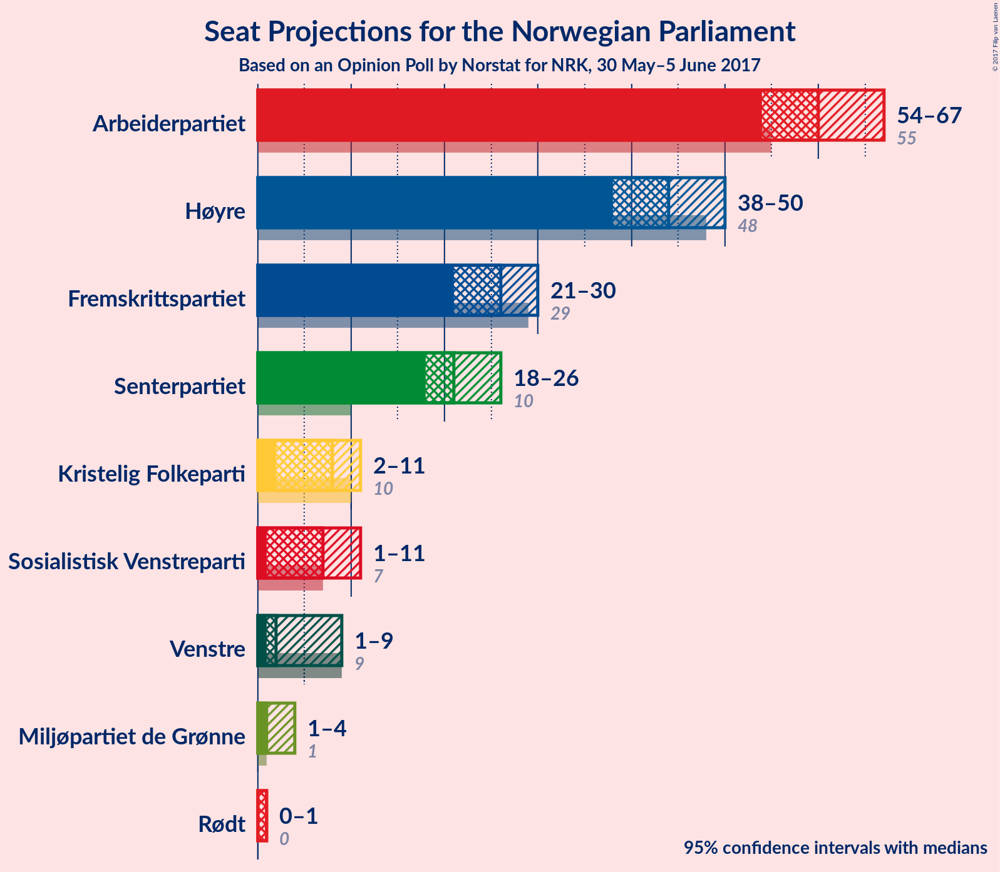

# Opinion Poll by Norstat for NRK, 30 May–5 June 2017

<a href="#voting-intentions">Voting Intentions</a> | <a href="#seats">Seats</a> | <a href="#coalitions">Coalitions</a> | <a href="#technical-information">Technical Information</a>

## Voting Intentions

### Confidence Intervals

| Party | Last Result | Poll Result | 80% Confidence Interval | 90% Confidence Interval | 95% Confidence Interval | 99% Confidence Interval |
|:-----:|:-----------:|:-----------:|:-----------------------:|:-----------------------:|:-----------------------:|:-----------------------:|
| Arbeiderpartiet | 30.8% | 32.9% | 31.0–35.0% |30.5–35.5% |30.0–36.0% |29.1–37.0% |
| Høyre | 26.8% | 23.7% | 22.0–25.5% |21.5–26.1% |21.0–26.5% |20.3–27.4% |
| Fremskrittspartiet | 16.3% | 14.0% | 12.6–15.5% |12.2–16.0% |11.9–16.4% |11.3–17.1% |
| Senterpartiet | 5.5% | 11.6% | 10.4–13.1% |10.0–13.5% |9.7–13.9% |9.1–14.6% |
| Kristelig Folkeparti | 5.6% | 4.4% | 3.7–5.4% |3.4–5.7% |3.3–5.9% |2.9–6.4% |
| Sosialistisk Venstreparti | 4.1% | 4.3% | 3.6–5.3% |3.4–5.6% |3.2–5.8% |2.9–6.3% |
| Venstre | 5.2% | 3.4% | 2.8–4.3% |2.6–4.6% |2.5–4.8% |2.2–5.3% |
| Miljøpartiet de Grønne | 2.8% | 2.8% | 2.2–3.6% |2.0–3.9% |1.9–4.1% |1.7–4.5% |
| Rødt | 1.1% | 1.2% | 0.8–1.8% |0.7–2.0% |0.7–2.1% |0.5–2.4% |

*Note:* The poll result column reflects the actual value used in the calculations. Published results may vary slightly, and in addition be rounded to fewer digits.

## Seats

### Confidence Intervals

| Party | Last Result | Median | 80% Confidence Interval | 90% Confidence Interval | 95% Confidence Interval | 99% Confidence Interval |
|:-----:|:-----------:|:------:|:-----------------------:|:-----------------------:|:-----------------------:|:-----------------------:|
| <a href="#arbeiderpartiet">Arbeiderpartiet</a> | 55 | 58 | 55–64 |55–64 |55–65 |53–68 |
| <a href="#høyre">Høyre</a> | 48 | 40 | 38–46 |38–47 |37–49 |37–50 |
| <a href="#fremskrittspartiet">Fremskrittspartiet</a> | 29 | 26 | 24–26 |22–28 |22–29 |20–31 |
| <a href="#senterpartiet">Senterpartiet</a> | 10 | 22 | 20–24 |19–24 |19–24 |16–26 |
| <a href="#kristelig-folkeparti">Kristelig Folkeparti</a> | 10 | 9 | 2–9 |2–10 |2–10 |1–11 |
| <a href="#sosialistisk-venstreparti">Sosialistisk Venstreparti</a> | 7 | 9 | 2–11 |2–11 |1–11 |1–13 |
| <a href="#venstre">Venstre</a> | 9 | 8 | 1–9 |1–9 |1–9 |0–9 |
| <a href="#miljøpartiet-de-grønne">Miljøpartiet de Grønne</a> | 1 | 1 | 1 |1–3 |1–3 |1–7 |
| <a href="#rødt">Rødt</a> | 0 | 0 | 0–1 |0–1 |0–1 |0–2 |

### Arbeiderpartiet

| Number of Seats | Probability | Accumulated |
|:---------------:|:-----------:|:-----------:|
| 51 | 0.2% | 100% |
| 52 | 0.3% | 99.8% |
| 53 | 1.2% | 99.5% |
| 54 | 0.1% | 98% |
| 55 | 36% | 98% |
| 56 | 2% | 62% |
| 57 | 0.4% | 60% |
| 58 | 13% | 60% |
| 59 | 5% | 47% |
| 60 | 8% | 42% |
| 61 | 0.8% | 34% |
| 62 | 3% | 33% |
| 63 | 0.8% | 30% |
| 64 | 26% | 29% |
| 65 | 0.4% | 3% |
| 66 | 0.7% | 2% |
| 67 | 0.4% | 1.4% |
| 68 | 0.6% | 1.0% |
| 69 | 0.3% | 0.3% |
| 70 | 0% | 0% |

### Høyre

| Number of Seats | Probability | Accumulated |
|:---------------:|:-----------:|:-----------:|
| 35 | 0.1% | 100% |
| 36 | 0.1% | 99.9% |
| 37 | 3% | 99.7% |
| 38 | 15% | 97% |
| 39 | 31% | 82% |
| 40 | 2% | 51% |
| 41 | 7% | 49% |
| 42 | 26% | 42% |
| 43 | 0.8% | 16% |
| 44 | 1.0% | 15% |
| 45 | 4% | 14% |
| 46 | 5% | 11% |
| 47 | 1.3% | 6% |
| 48 | 1.0% | 4% |
| 49 | 3% | 3% |
| 50 | 0.4% | 0.5% |
| 51 | 0% | 0.2% |
| 52 | 0.1% | 0.1% |
| 53 | 0% | 0% |

### Fremskrittspartiet

| Number of Seats | Probability | Accumulated |
|:---------------:|:-----------:|:-----------:|
| 19 | 0.2% | 100% |
| 20 | 0.4% | 99.8% |
| 21 | 1.1% | 99.4% |
| 22 | 4% | 98% |
| 23 | 3% | 95% |
| 24 | 21% | 92% |
| 25 | 3% | 71% |
| 26 | 58% | 68% |
| 27 | 3% | 10% |
| 28 | 4% | 7% |
| 29 | 1.0% | 3% |
| 30 | 1.0% | 2% |
| 31 | 0.3% | 0.5% |
| 32 | 0.1% | 0.2% |
| 33 | 0.1% | 0.2% |
| 34 | 0% | 0% |

### Senterpartiet

| Number of Seats | Probability | Accumulated |
|:---------------:|:-----------:|:-----------:|
| 14 | 0.2% | 100% |
| 15 | 0% | 99.8% |
| 16 | 0.5% | 99.8% |
| 17 | 0.2% | 99.3% |
| 18 | 0.3% | 99.1% |
| 19 | 4% | 98.8% |
| 20 | 4% | 94% |
| 21 | 17% | 90% |
| 22 | 42% | 72% |
| 23 | 1.4% | 30% |
| 24 | 27% | 29% |
| 25 | 0.7% | 2% |
| 26 | 0.6% | 1.0% |
| 27 | 0.2% | 0.4% |
| 28 | 0.2% | 0.2% |
| 29 | 0% | 0.1% |
| 30 | 0% | 0% |

### Kristelig Folkeparti

| Number of Seats | Probability | Accumulated |
|:---------------:|:-----------:|:-----------:|
| 0 | 0.3% | 100% |
| 1 | 0.6% | 99.7% |
| 2 | 38% | 99.1% |
| 3 | 0% | 61% |
| 4 | 0% | 61% |
| 5 | 0% | 61% |
| 6 | 0% | 61% |
| 7 | 3% | 61% |
| 8 | 7% | 58% |
| 9 | 45% | 51% |
| 10 | 5% | 6% |
| 11 | 0.8% | 1.1% |
| 12 | 0.2% | 0.3% |
| 13 | 0% | 0% |

### Sosialistisk Venstreparti

| Number of Seats | Probability | Accumulated |
|:---------------:|:-----------:|:-----------:|
| 1 | 3% | 100% |
| 2 | 9% | 97% |
| 3 | 0% | 88% |
| 4 | 0% | 88% |
| 5 | 0% | 88% |
| 6 | 0% | 88% |
| 7 | 0.3% | 88% |
| 8 | 33% | 88% |
| 9 | 32% | 55% |
| 10 | 2% | 23% |
| 11 | 19% | 21% |
| 12 | 0.2% | 1.4% |
| 13 | 1.2% | 1.2% |
| 14 | 0% | 0% |

### Venstre

| Number of Seats | Probability | Accumulated |
|:---------------:|:-----------:|:-----------:|
| 0 | 1.0% | 100% |
| 1 | 32% | 99.0% |
| 2 | 5% | 67% |
| 3 | 0.6% | 62% |
| 4 | 0% | 62% |
| 5 | 0% | 62% |
| 6 | 0% | 62% |
| 7 | 11% | 62% |
| 8 | 40% | 50% |
| 9 | 10% | 10% |
| 10 | 0.1% | 0.1% |
| 11 | 0% | 0% |

### Miljøpartiet de Grønne

| Number of Seats | Probability | Accumulated |
|:---------------:|:-----------:|:-----------:|
| 0 | 0.3% | 100% |
| 1 | 93% | 99.7% |
| 2 | 0.6% | 6% |
| 3 | 4% | 6% |
| 4 | 1.1% | 2% |
| 5 | 0% | 1.0% |
| 6 | 0% | 1.0% |
| 7 | 0.6% | 1.0% |
| 8 | 0.3% | 0.4% |
| 9 | 0.1% | 0.1% |
| 10 | 0% | 0% |

### Rødt

| Number of Seats | Probability | Accumulated |
|:---------------:|:-----------:|:-----------:|
| 0 | 54% | 100% |
| 1 | 45% | 46% |
| 2 | 0.6% | 0.6% |
| 3 | 0% | 0% |

## Coalitions

### Confidence Intervals

| Coalition | Last Result | Median | 80% Confidence Interval | 90% Confidence Interval | 95% Confidence Interval | 99% Confidence Interval |
|:---------:|:-----------:|:------:|:-----------------------:|:-----------------------:|:-----------------------:|:-----------------------:|
| Høyre – Fremskrittspartiet – Senterpartiet – Kristelig Folkeparti – Venstre | 106 | 99 | 95–104 | 95–106 | 95–106 | 91–109 |
| Arbeiderpartiet – Senterpartiet – Kristelig Folkeparti – Sosialistisk Venstreparti – Miljøpartiet de Grønne | 83 | 95 | 93–100 | 91–100 | 91–103 | 89–106 |
| Arbeiderpartiet – Senterpartiet – Sosialistisk Venstreparti – Miljøpartiet de Grønne – Rødt | 73 | 91 | 87–98 | 85–98 | 84–98 | 83–100 |
| Arbeiderpartiet – Senterpartiet – Sosialistisk Venstreparti – Miljøpartiet de Grønne | 73 | 91 | 86–98 | 84–98 | 83–98 | 82–99 |
| Arbeiderpartiet – Senterpartiet – Sosialistisk Venstreparti – Rødt | 72 | 90 | 86–97 | 84–97 | 81–97 | 79–99 |
| Arbeiderpartiet – Senterpartiet – Sosialistisk Venstreparti | 72 | 89 | 85–97 | 83–97 | 80–97 | 78–98 |
| Arbeiderpartiet – Senterpartiet | 65 | 79 | 77–88 | 77–88 | 77–88 | 74–92 |
| Høyre – Fremskrittspartiet – Kristelig Folkeparti – Venstre – Miljøpartiet de Grønne | 97 | 79 | 72–83 | 72–85 | 72–88 | 70–90 |
| Høyre – Fremskrittspartiet – Kristelig Folkeparti – Venstre | 96 | 78 | 71–82 | 71–84 | 71–85 | 69–86 |
| Høyre – Fremskrittspartiet | 77 | 65 | 62–70 | 62–72 | 62–75 | 60–78 |
| Arbeiderpartiet – Sosialistisk Venstreparti | 62 | 68 | 63–73 | 61–73 | 60–73 | 58–76 |
| Høyre – Kristelig Folkeparti – Venstre | 67 | 54 | 45–56 | 45–60 | 45–60 | 45–61 |
| Senterpartiet – Kristelig Folkeparti – Venstre | 29 | 35 | 27–39 | 27–39 | 27–41 | 23–41 |

### Høyre – Fremskrittspartiet – Senterpartiet – Kristelig Folkeparti – Venstre

| Number of Seats | Probability | Accumulated |
|:---------------:|:-----------:|:-----------:|
| 90 | 0% | 100% |
| 91 | 0.6% | 99.9% |
| 92 | 0.4% | 99.3% |
| 93 | 0.5% | 98.9% |
| 94 | 0.1% | 98% |
| 95 | 25% | 98% |
| 96 | 0.4% | 73% |
| 97 | 6% | 73% |
| 98 | 2% | 66% |
| 99 | 18% | 65% |
| 100 | 0.5% | 47% |
| 101 | 1.3% | 47% |
| 102 | 5% | 45% |
| 103 | 0.4% | 40% |
| 104 | 31% | 40% |
| 105 | 2% | 8% |
| 106 | 5% | 6% |
| 107 | 0% | 0.7% |
| 108 | 0.1% | 0.7% |
| 109 | 0.2% | 0.5% |
| 110 | 0.1% | 0.3% |
| 111 | 0% | 0.2% |
| 112 | 0.2% | 0.2% |
| 113 | 0% | 0% |

### Arbeiderpartiet – Senterpartiet – Kristelig Folkeparti – Sosialistisk Venstreparti – Miljøpartiet de Grønne

| Number of Seats | Probability | Accumulated |
|:---------------:|:-----------:|:-----------:|
| 82 | 0.1% | 100% |
| 83 | 0% | 99.9% |
| 84 | 0% | 99.9% |
| 85 | 0.1% | 99.9% |
| 86 | 0% | 99.8% |
| 87 | 0% | 99.8% |
| 88 | 0.2% | 99.8% |
| 89 | 0.7% | 99.5% |
| 90 | 0% | 98.9% |
| 91 | 5% | 98.8% |
| 92 | 2% | 94% |
| 93 | 5% | 92% |
| 94 | 5% | 87% |
| 95 | 34% | 82% |
| 96 | 2% | 48% |
| 97 | 1.4% | 46% |
| 98 | 4% | 44% |
| 99 | 0.6% | 41% |
| 100 | 36% | 40% |
| 101 | 0.5% | 4% |
| 102 | 0.5% | 3% |
| 103 | 1.0% | 3% |
| 104 | 0.5% | 2% |
| 105 | 0.6% | 1.3% |
| 106 | 0.5% | 0.6% |
| 107 | 0% | 0.2% |
| 108 | 0.1% | 0.1% |
| 109 | 0% | 0% |

### Arbeiderpartiet – Senterpartiet – Sosialistisk Venstreparti – Miljøpartiet de Grønne – Rødt

| Number of Seats | Probability | Accumulated |
|:---------------:|:-----------:|:-----------:|
| 78 | 0% | 100% |
| 79 | 0.2% | 99.9% |
| 80 | 0.1% | 99.7% |
| 81 | 0.1% | 99.7% |
| 82 | 0% | 99.6% |
| 83 | 0.1% | 99.5% |
| 84 | 2% | 99.4% |
| 85 | 5% | 97% |
| 86 | 1.1% | 93% |
| 87 | 32% | 91% |
| 88 | 0.5% | 60% |
| 89 | 6% | 59% |
| 90 | 2% | 53% |
| 91 | 16% | 51% |
| 92 | 2% | 35% |
| 93 | 4% | 33% |
| 94 | 0.6% | 29% |
| 95 | 1.0% | 28% |
| 96 | 0.8% | 27% |
| 97 | 0.7% | 26% |
| 98 | 25% | 26% |
| 99 | 0% | 0.8% |
| 100 | 0.5% | 0.7% |
| 101 | 0.2% | 0.2% |
| 102 | 0% | 0.1% |
| 103 | 0% | 0.1% |
| 104 | 0% | 0% |

### Arbeiderpartiet – Senterpartiet – Sosialistisk Venstreparti – Miljøpartiet de Grønne

| Number of Seats | Probability | Accumulated |
|:---------------:|:-----------:|:-----------:|
| 77 | 0% | 100% |
| 78 | 0% | 99.9% |
| 79 | 0.2% | 99.9% |
| 80 | 0.2% | 99.7% |
| 81 | 0% | 99.6% |
| 82 | 0.1% | 99.5% |
| 83 | 2% | 99.5% |
| 84 | 5% | 97% |
| 85 | 1.1% | 93% |
| 86 | 31% | 92% |
| 87 | 1.1% | 60% |
| 88 | 1.1% | 59% |
| 89 | 6% | 58% |
| 90 | 1.2% | 52% |
| 91 | 17% | 50% |
| 92 | 1.5% | 34% |
| 93 | 4% | 32% |
| 94 | 0.8% | 29% |
| 95 | 0.8% | 28% |
| 96 | 1.3% | 27% |
| 97 | 0.1% | 26% |
| 98 | 25% | 26% |
| 99 | 0.5% | 0.7% |
| 100 | 0.2% | 0.2% |
| 101 | 0% | 0.1% |
| 102 | 0% | 0.1% |
| 103 | 0% | 0% |

### Arbeiderpartiet – Senterpartiet – Sosialistisk Venstreparti – Rødt

| Number of Seats | Probability | Accumulated |
|:---------------:|:-----------:|:-----------:|
| 77 | 0% | 100% |
| 78 | 0.4% | 99.9% |
| 79 | 0.1% | 99.5% |
| 80 | 0.1% | 99.4% |
| 81 | 2% | 99.3% |
| 82 | 0.1% | 97% |
| 83 | 1.1% | 97% |
| 84 | 5% | 96% |
| 85 | 0.8% | 91% |
| 86 | 32% | 90% |
| 87 | 1.5% | 59% |
| 88 | 6% | 57% |
| 89 | 0.4% | 51% |
| 90 | 17% | 51% |
| 91 | 2% | 34% |
| 92 | 4% | 32% |
| 93 | 0.5% | 28% |
| 94 | 1.0% | 28% |
| 95 | 0.9% | 27% |
| 96 | 0.5% | 26% |
| 97 | 25% | 26% |
| 98 | 0% | 0.7% |
| 99 | 0.5% | 0.7% |
| 100 | 0.2% | 0.2% |
| 101 | 0% | 0.1% |
| 102 | 0% | 0.1% |
| 103 | 0% | 0% |

### Arbeiderpartiet – Senterpartiet – Sosialistisk Venstreparti

| Number of Seats | Probability | Accumulated |
|:---------------:|:-----------:|:-----------:|
| 76 | 0% | 100% |
| 77 | 0.2% | 99.9% |
| 78 | 0.3% | 99.8% |
| 79 | 0.2% | 99.5% |
| 80 | 2% | 99.3% |
| 81 | 0.1% | 97% |
| 82 | 1.1% | 97% |
| 83 | 5% | 96% |
| 84 | 0.8% | 91% |
| 85 | 31% | 90% |
| 86 | 2% | 59% |
| 87 | 1.2% | 57% |
| 88 | 5% | 56% |
| 89 | 1.3% | 51% |
| 90 | 17% | 50% |
| 91 | 1.3% | 33% |
| 92 | 4% | 32% |
| 93 | 0.8% | 28% |
| 94 | 0.7% | 28% |
| 95 | 1.2% | 27% |
| 96 | 0.1% | 26% |
| 97 | 25% | 25% |
| 98 | 0.5% | 0.7% |
| 99 | 0.2% | 0.2% |
| 100 | 0% | 0.1% |
| 101 | 0% | 0.1% |
| 102 | 0% | 0% |

### Arbeiderpartiet – Senterpartiet

| Number of Seats | Probability | Accumulated |
|:---------------:|:-----------:|:-----------:|
| 70 | 0.1% | 100% |
| 71 | 0.2% | 99.9% |
| 72 | 0% | 99.7% |
| 73 | 0.1% | 99.6% |
| 74 | 0.2% | 99.5% |
| 75 | 0.5% | 99.3% |
| 76 | 0.7% | 98.9% |
| 77 | 36% | 98% |
| 78 | 3% | 62% |
| 79 | 11% | 58% |
| 80 | 0.9% | 48% |
| 81 | 15% | 47% |
| 82 | 0.7% | 32% |
| 83 | 0.8% | 31% |
| 84 | 2% | 31% |
| 85 | 1.4% | 29% |
| 86 | 0.6% | 27% |
| 87 | 0.6% | 27% |
| 88 | 25% | 26% |
| 89 | 0.3% | 1.5% |
| 90 | 0.2% | 1.2% |
| 91 | 0% | 1.0% |
| 92 | 0.8% | 0.9% |
| 93 | 0% | 0.1% |
| 94 | 0% | 0% |

### Høyre – Fremskrittspartiet – Kristelig Folkeparti – Venstre – Miljøpartiet de Grønne

| Number of Seats | Probability | Accumulated |
|:---------------:|:-----------:|:-----------:|
| 67 | 0% | 100% |
| 68 | 0% | 99.9% |
| 69 | 0.2% | 99.9% |
| 70 | 0.5% | 99.8% |
| 71 | 0% | 99.3% |
| 72 | 25% | 99.3% |
| 73 | 0.5% | 74% |
| 74 | 0.9% | 74% |
| 75 | 1.0% | 73% |
| 76 | 0.5% | 72% |
| 77 | 4% | 72% |
| 78 | 2% | 68% |
| 79 | 17% | 66% |
| 80 | 0.4% | 49% |
| 81 | 6% | 49% |
| 82 | 1.5% | 43% |
| 83 | 32% | 41% |
| 84 | 0.8% | 10% |
| 85 | 5% | 9% |
| 86 | 1.1% | 4% |
| 87 | 0.1% | 3% |
| 88 | 2% | 3% |
| 89 | 0.1% | 0.7% |
| 90 | 0.1% | 0.6% |
| 91 | 0.4% | 0.5% |
| 92 | 0% | 0.1% |
| 93 | 0% | 0% |

### Høyre – Fremskrittspartiet – Kristelig Folkeparti – Venstre

| Number of Seats | Probability | Accumulated |
|:---------------:|:-----------:|:-----------:|
| 66 | 0% | 100% |
| 67 | 0% | 99.9% |
| 68 | 0.2% | 99.9% |
| 69 | 0.5% | 99.8% |
| 70 | 0% | 99.3% |
| 71 | 25% | 99.2% |
| 72 | 0.7% | 74% |
| 73 | 0.8% | 74% |
| 74 | 1.0% | 73% |
| 75 | 0.6% | 72% |
| 76 | 4% | 71% |
| 77 | 2% | 67% |
| 78 | 16% | 65% |
| 79 | 2% | 49% |
| 80 | 6% | 47% |
| 81 | 0.5% | 41% |
| 82 | 32% | 40% |
| 83 | 1.1% | 9% |
| 84 | 5% | 7% |
| 85 | 2% | 3% |
| 86 | 0.1% | 0.6% |
| 87 | 0% | 0.5% |
| 88 | 0.1% | 0.4% |
| 89 | 0.1% | 0.3% |
| 90 | 0.2% | 0.3% |
| 91 | 0% | 0.1% |
| 92 | 0% | 0% |

### Høyre – Fremskrittspartiet

| Number of Seats | Probability | Accumulated |
|:---------------:|:-----------:|:-----------:|
| 58 | 0.4% | 100% |
| 59 | 0.1% | 99.6% |
| 60 | 0.7% | 99.5% |
| 61 | 0.2% | 98.9% |
| 62 | 13% | 98.7% |
| 63 | 0.1% | 85% |
| 64 | 2% | 85% |
| 65 | 35% | 83% |
| 66 | 3% | 48% |
| 67 | 5% | 45% |
| 68 | 26% | 40% |
| 69 | 0.6% | 14% |
| 70 | 8% | 13% |
| 71 | 0.1% | 6% |
| 72 | 1.5% | 6% |
| 73 | 0.5% | 4% |
| 74 | 1.0% | 4% |
| 75 | 2% | 3% |
| 76 | 0.1% | 0.6% |
| 77 | 0% | 0.6% |
| 78 | 0.1% | 0.5% |
| 79 | 0.4% | 0.4% |
| 80 | 0% | 0.1% |
| 81 | 0% | 0.1% |
| 82 | 0% | 0% |

### Arbeiderpartiet – Sosialistisk Venstreparti

| Number of Seats | Probability | Accumulated |
|:---------------:|:-----------:|:-----------:|
| 56 | 0.2% | 100% |
| 57 | 0.1% | 99.8% |
| 58 | 0.2% | 99.6% |
| 59 | 0.2% | 99.4% |
| 60 | 2% | 99.2% |
| 61 | 5% | 97% |
| 62 | 0.1% | 92% |
| 63 | 33% | 92% |
| 64 | 0.6% | 59% |
| 65 | 0.4% | 58% |
| 66 | 7% | 58% |
| 67 | 0.9% | 51% |
| 68 | 1.1% | 50% |
| 69 | 15% | 49% |
| 70 | 2% | 34% |
| 71 | 6% | 33% |
| 72 | 0.2% | 27% |
| 73 | 25% | 27% |
| 74 | 0.6% | 1.5% |
| 75 | 0% | 0.9% |
| 76 | 0.9% | 0.9% |
| 77 | 0% | 0% |

### Høyre – Kristelig Folkeparti – Venstre

| Number of Seats | Probability | Accumulated |
|:---------------:|:-----------:|:-----------:|
| 41 | 0.1% | 100% |
| 42 | 0.3% | 99.9% |
| 43 | 0% | 99.6% |
| 44 | 0% | 99.6% |
| 45 | 25% | 99.6% |
| 46 | 0.2% | 75% |
| 47 | 0.9% | 75% |
| 48 | 4% | 74% |
| 49 | 0.1% | 69% |
| 50 | 2% | 69% |
| 51 | 2% | 67% |
| 52 | 0.7% | 65% |
| 53 | 4% | 65% |
| 54 | 11% | 61% |
| 55 | 0.7% | 50% |
| 56 | 41% | 49% |
| 57 | 0.3% | 9% |
| 58 | 0.1% | 8% |
| 59 | 3% | 8% |
| 60 | 5% | 6% |
| 61 | 0.3% | 0.7% |
| 62 | 0.1% | 0.4% |
| 63 | 0.1% | 0.3% |
| 64 | 0.1% | 0.2% |
| 65 | 0% | 0% |

### Senterpartiet – Kristelig Folkeparti – Venstre

| Number of Seats | Probability | Accumulated |
|:---------------:|:-----------:|:-----------:|
| 22 | 0.3% | 100% |
| 23 | 0.3% | 99.6% |
| 24 | 0.1% | 99.4% |
| 25 | 1.0% | 99.2% |
| 26 | 0.3% | 98% |
| 27 | 26% | 98% |
| 28 | 0.4% | 72% |
| 29 | 2% | 72% |
| 30 | 3% | 70% |
| 31 | 4% | 67% |
| 32 | 9% | 63% |
| 33 | 0.8% | 53% |
| 34 | 2% | 53% |
| 35 | 3% | 51% |
| 36 | 1.0% | 48% |
| 37 | 11% | 47% |
| 38 | 0.2% | 36% |
| 39 | 31% | 36% |
| 40 | 0% | 5% |
| 41 | 4% | 5% |
| 42 | 0.4% | 0.5% |
| 43 | 0% | 0% |

## Technical Information

### Opinion Poll

+ **Pollster:** Norstat
+ **Media:** NRK
+ **Fieldwork period:** 30 May–5 June 2017

### Calculations

+ **Sample size:** 929
+ **Simulations done:** 65,536
+ **Error estimate:** 3.92%

