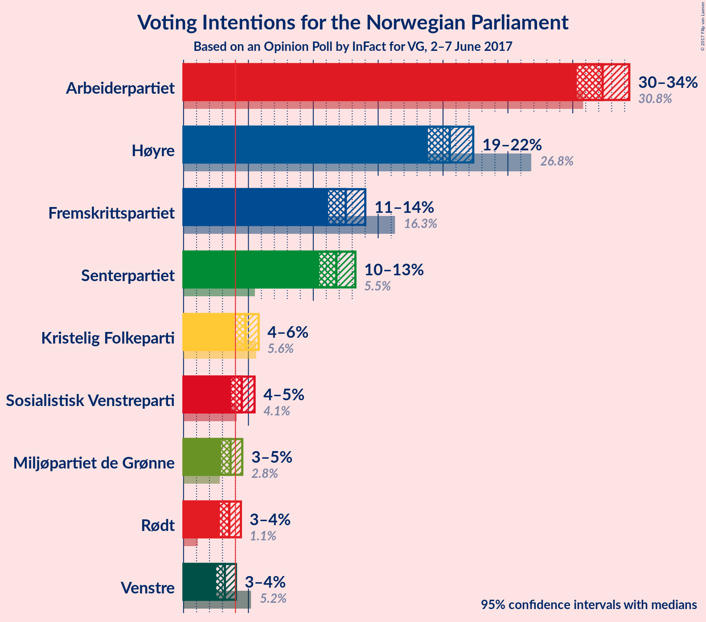
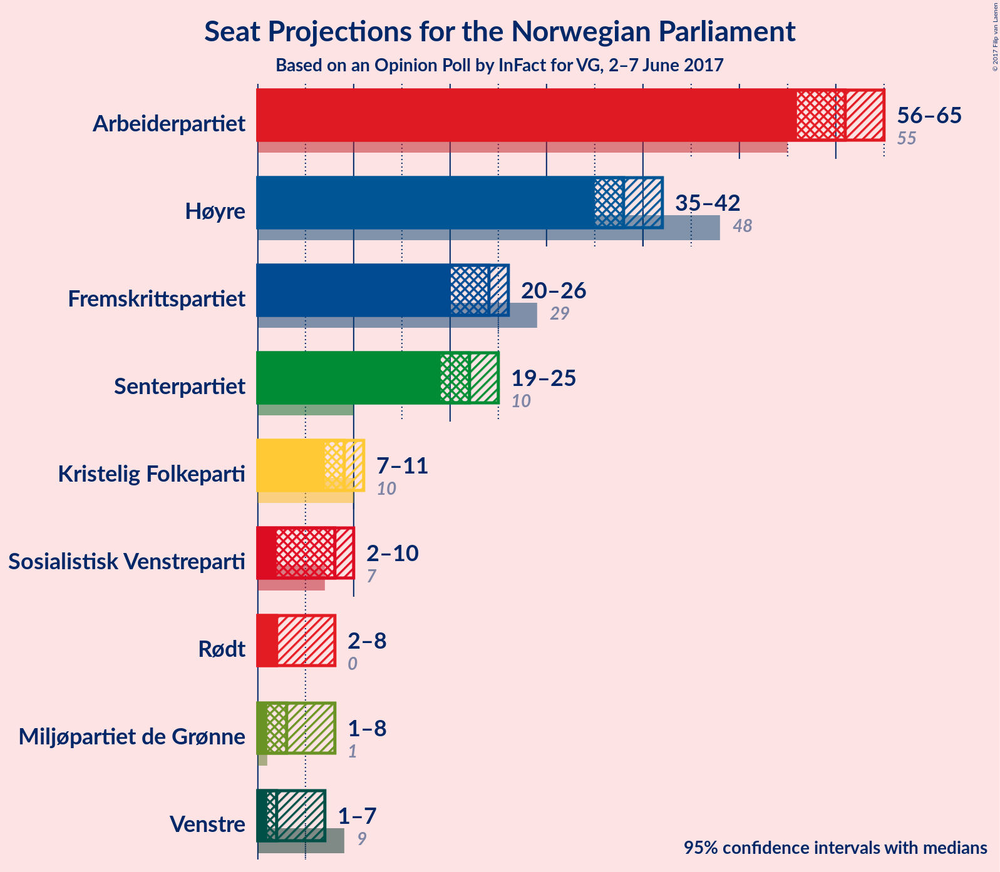
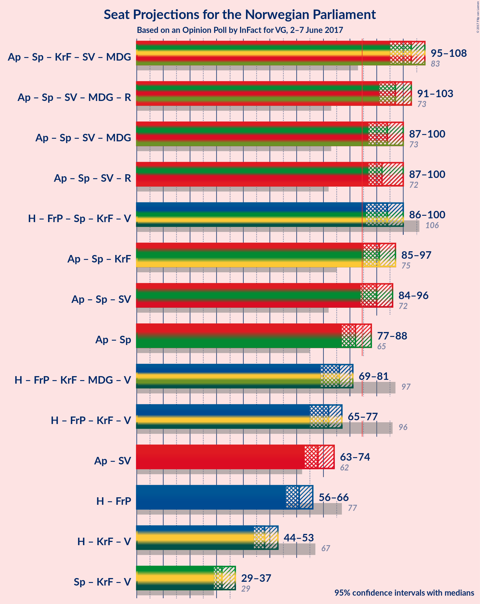

# Opinion Poll by InFact for VG, 2–7 June 2017

<a href="#voting-intentions">Voting Intentions</a> | <a href="#seats">Seats</a> | <a href="#coalitions">Coalitions</a> | <a href="#technical-information">Technical Information</a>

## Voting Intentions

### Confidence Intervals

| Party | Last Result | Poll Result | 80% Confidence Interval | 90% Confidence Interval | 95% Confidence Interval | 99% Confidence Interval |
|:-----:|:-----------:|:-----------:|:-----------------------:|:-----------------------:|:-----------------------:|:-----------------------:|
| Arbeiderpartiet | 30.8% | 32.3% | 31.0–33.7% |30.6–34.0% |30.3–34.4% |29.7–35.0% |
| Høyre | 26.8% | 20.5% | 19.4–21.7% |19.1–22.0% |18.8–22.3% |18.3–22.9% |
| Fremskrittspartiet | 16.3% | 12.5% | 11.6–13.5% |11.4–13.8% |11.1–14.0% |10.7–14.5% |
| Senterpartiet | 5.5% | 11.8% | 10.9–12.7% |10.7–13.0% |10.5–13.2% |10.1–13.7% |
| Kristelig Folkeparti | 5.6% | 4.8% | 4.2–5.4% |4.1–5.6% |3.9–5.8% |3.7–6.1% |
| Sosialistisk Venstreparti | 4.1% | 4.5% | 3.9–5.1% |3.8–5.3% |3.7–5.5% |3.4–5.8% |
| Miljøpartiet de Grønne | 2.8% | 3.6% | 3.1–4.2% |3.0–4.4% |2.9–4.5% |2.7–4.8% |
| Rødt | 1.1% | 3.5% | 3.0–4.1% |2.9–4.3% |2.8–4.4% |2.6–4.7% |
| Venstre | 5.2% | 3.2% | 2.7–3.7% |2.6–3.9% |2.5–4.0% |2.3–4.3% |

*Note:* The poll result column reflects the actual value used in the calculations. Published results may vary slightly, and in addition be rounded to fewer digits.

## Seats

### Confidence Intervals

| Party | Last Result | Median | 80% Confidence Interval | 90% Confidence Interval | 95% Confidence Interval | 99% Confidence Interval |
|:-----:|:-----------:|:------:|:-----------------------:|:-----------------------:|:-----------------------:|:-----------------------:|
| <a href="#arbeiderpartiet">Arbeiderpartiet</a> | 55 | 61 | 58–64 |57–65 |56–65 |55–67 |
| <a href="#høyre">Høyre</a> | 48 | 38 | 36–41 |35–42 |35–42 |33–43 |
| <a href="#fremskrittspartiet">Fremskrittspartiet</a> | 29 | 23 | 21–25 |20–26 |20–26 |19–27 |
| <a href="#senterpartiet">Senterpartiet</a> | 10 | 22 | 20–24 |20–24 |19–25 |18–26 |
| <a href="#kristelig-folkeparti">Kristelig Folkeparti</a> | 10 | 9 | 8–10 |7–10 |3–11 |2–11 |
| <a href="#sosialistisk-venstreparti">Sosialistisk Venstreparti</a> | 7 | 8 | 2–9 |2–10 |2–10 |2–11 |
| <a href="#miljøpartiet-de-grønne">Miljøpartiet de Grønne</a> | 1 | 2 | 1–8 |1–8 |1–8 |1–9 |
| <a href="#rødt">Rødt</a> | 0 | 2 | 2–7 |2–8 |2–8 |2–9 |
| <a href="#venstre">Venstre</a> | 9 | 2 | 1–2 |1–3 |1–3 |1–8 |

### Arbeiderpartiet

| Number of Seats | Probability | Accumulated | Special Marks |
|:---------------:|:-----------:|:-----------:|:-------------:|
| 54 | 0.2% | 100% |  |
| 55 | 1.0% | 99.8% | Last Result |
| 56 | 3% | 98.8% |  |
| 57 | 6% | 96% |  |
| 58 | 6% | 90% |  |
| 59 | 13% | 84% |  |
| 60 | 8% | 71% |  |
| 61 | 14% | 63% | Median |
| 62 | 17% | 48% |  |
| 63 | 12% | 32% |  |
| 64 | 11% | 20% |  |
| 65 | 6% | 9% |  |
| 66 | 2% | 2% |  |
| 67 | 0.4% | 0.7% |  |
| 68 | 0.3% | 0.3% |  |
| 69 | 0% | 0.1% |  |
| 70 | 0% | 0% |  |

### Høyre

| Number of Seats | Probability | Accumulated | Special Marks |
|:---------------:|:-----------:|:-----------:|:-------------:|
| 33 | 0.6% | 100% |  |
| 34 | 1.4% | 99.4% |  |
| 35 | 5% | 98% |  |
| 36 | 13% | 93% |  |
| 37 | 22% | 80% |  |
| 38 | 23% | 58% | Median |
| 39 | 9% | 35% |  |
| 40 | 10% | 25% |  |
| 41 | 8% | 15% |  |
| 42 | 5% | 7% |  |
| 43 | 1.3% | 2% |  |
| 44 | 0.4% | 0.5% |  |
| 45 | 0.1% | 0.1% |  |
| 46 | 0% | 0% |  |
| 47 | 0% | 0% |  |
| 48 | 0% | 0% | Last Result |

### Fremskrittspartiet

| Number of Seats | Probability | Accumulated | Special Marks |
|:---------------:|:-----------:|:-----------:|:-------------:|
| 17 | 0.1% | 100% |  |
| 18 | 0.2% | 99.9% |  |
| 19 | 0.8% | 99.8% |  |
| 20 | 4% | 99.0% |  |
| 21 | 11% | 95% |  |
| 22 | 13% | 84% |  |
| 23 | 29% | 71% | Median |
| 24 | 22% | 42% |  |
| 25 | 12% | 20% |  |
| 26 | 6% | 8% |  |
| 27 | 1.4% | 2% |  |
| 28 | 0.4% | 0.5% |  |
| 29 | 0% | 0.1% | Last Result |
| 30 | 0% | 0% |  |

### Senterpartiet

| Number of Seats | Probability | Accumulated | Special Marks |
|:---------------:|:-----------:|:-----------:|:-------------:|
| 10 | 0% | 100% | Last Result |
| 11 | 0% | 100% |  |
| 12 | 0% | 100% |  |
| 13 | 0% | 100% |  |
| 14 | 0% | 100% |  |
| 15 | 0% | 100% |  |
| 16 | 0% | 100% |  |
| 17 | 0.1% | 100% |  |
| 18 | 0.7% | 99.9% |  |
| 19 | 4% | 99.2% |  |
| 20 | 12% | 96% |  |
| 21 | 25% | 84% |  |
| 22 | 25% | 58% | Median |
| 23 | 21% | 34% |  |
| 24 | 8% | 13% |  |
| 25 | 3% | 4% |  |
| 26 | 0.8% | 0.9% |  |
| 27 | 0.1% | 0.1% |  |
| 28 | 0% | 0% |  |

### Kristelig Folkeparti

| Number of Seats | Probability | Accumulated | Special Marks |
|:---------------:|:-----------:|:-----------:|:-------------:|
| 2 | 2% | 100% |  |
| 3 | 0.8% | 98% |  |
| 4 | 0% | 97% |  |
| 5 | 0% | 97% |  |
| 6 | 0% | 97% |  |
| 7 | 2% | 97% |  |
| 8 | 25% | 95% |  |
| 9 | 44% | 70% | Median |
| 10 | 21% | 25% | Last Result |
| 11 | 4% | 4% |  |
| 12 | 0.4% | 0.4% |  |
| 13 | 0% | 0% |  |

### Sosialistisk Venstreparti

| Number of Seats | Probability | Accumulated | Special Marks |
|:---------------:|:-----------:|:-----------:|:-------------:|
| 1 | 0.3% | 100% |  |
| 2 | 13% | 99.7% |  |
| 3 | 0.1% | 87% |  |
| 4 | 0% | 87% |  |
| 5 | 0% | 87% |  |
| 6 | 0.1% | 87% |  |
| 7 | 3% | 87% | Last Result |
| 8 | 35% | 84% | Median |
| 9 | 42% | 48% |  |
| 10 | 6% | 7% |  |
| 11 | 0.8% | 0.9% |  |
| 12 | 0% | 0% |  |

### Miljøpartiet de Grønne

| Number of Seats | Probability | Accumulated | Special Marks |
|:---------------:|:-----------:|:-----------:|:-------------:|
| 1 | 24% | 100% | Last Result |
| 2 | 27% | 76% | Median |
| 3 | 20% | 50% |  |
| 4 | 9% | 30% |  |
| 5 | 0% | 20% |  |
| 6 | 0.1% | 20% |  |
| 7 | 7% | 20% |  |
| 8 | 12% | 13% |  |
| 9 | 1.2% | 1.2% |  |
| 10 | 0% | 0% |  |

### Rødt

| Number of Seats | Probability | Accumulated | Special Marks |
|:---------------:|:-----------:|:-----------:|:-------------:|
| 0 | 0% | 100% | Last Result |
| 1 | 0.3% | 100% |  |
| 2 | 87% | 99.7% | Median |
| 3 | 0% | 13% |  |
| 4 | 0% | 13% |  |
| 5 | 0% | 13% |  |
| 6 | 0.2% | 13% |  |
| 7 | 5% | 13% |  |
| 8 | 7% | 7% |  |
| 9 | 0.5% | 0.5% |  |
| 10 | 0% | 0% |  |

### Venstre

| Number of Seats | Probability | Accumulated | Special Marks |
|:---------------:|:-----------:|:-----------:|:-------------:|
| 0 | 0.4% | 100% |  |
| 1 | 43% | 99.6% |  |
| 2 | 48% | 57% | Median |
| 3 | 7% | 9% |  |
| 4 | 0% | 2% |  |
| 5 | 0% | 2% |  |
| 6 | 0.1% | 2% |  |
| 7 | 1.3% | 2% |  |
| 8 | 1.0% | 1.0% |  |
| 9 | 0% | 0% | Last Result |

## Coalitions

### Confidence Intervals

| Coalition | Last Result | Median | 80% Confidence Interval | 90% Confidence Interval | 95% Confidence Interval | 99% Confidence Interval |
|:---------:|:-----------:|:------:|:-----------------------:|:-----------------------:|:-----------------------:|:-----------------------:|
| Arbeiderpartiet – Senterpartiet – Kristelig Folkeparti – Sosialistisk Venstreparti – Miljøpartiet de Grønne | 83 | 103 | 99–107 | 97–108 | 96–108 | 94–109 |
| Arbeiderpartiet – Senterpartiet – Sosialistisk Venstreparti – Miljøpartiet de Grønne – Rødt | 73 | 97 | 93–101 | 92–102 | 90–103 | 89–104 |
| Arbeiderpartiet – Senterpartiet – Sosialistisk Venstreparti – Miljøpartiet de Grønne | 73 | 94 | 90–98 | 88–99 | 88–100 | 86–101 |
| Høyre – Fremskrittspartiet – Senterpartiet – Kristelig Folkeparti – Venstre | 106 | 94 | 89–98 | 87–99 | 87–100 | 85–102 |
| Arbeiderpartiet – Senterpartiet – Sosialistisk Venstreparti – Rødt | 72 | 94 | 89–97 | 88–98 | 87–99 | 85–102 |
| Arbeiderpartiet – Senterpartiet – Kristelig Folkeparti | 75 | 92 | 88–95 | 86–96 | 85–97 | 83–99 |
| Arbeiderpartiet – Senterpartiet – Sosialistisk Venstreparti | 72 | 91 | 87–94 | 85–95 | 84–96 | 83–98 |
| Arbeiderpartiet – Senterpartiet | 65 | 83 | 79–86 | 78–88 | 77–88 | 76–90 |
| Høyre – Fremskrittspartiet – Kristelig Folkeparti – Miljøpartiet de Grønne – Venstre | 97 | 75 | 71–80 | 70–80 | 69–81 | 67–83 |
| Høyre – Fremskrittspartiet – Kristelig Folkeparti – Venstre | 96 | 72 | 68–76 | 67–77 | 66–78 | 64–80 |
| Arbeiderpartiet – Sosialistisk Venstreparti | 62 | 69 | 65–73 | 64–73 | 63–74 | 60–75 |
| Høyre – Fremskrittspartiet | 77 | 61 | 58–65 | 57–66 | 56–67 | 54–68 |
| Høyre – Kristelig Folkeparti – Venstre | 67 | 48 | 46–52 | 45–53 | 44–54 | 42–55 |
| Senterpartiet – Kristelig Folkeparti – Venstre | 29 | 32 | 30–35 | 29–36 | 28–37 | 26–38 |

### Arbeiderpartiet – Senterpartiet – Kristelig Folkeparti – Sosialistisk Venstreparti – Miljøpartiet de Grønne

| Number of Seats | Probability | Accumulated | Special Marks |
|:---------------:|:-----------:|:-----------:|:-------------:|
| 83 | 0% | 100% | Last Result |
| 84 | 0% | 100% |  |
| 85 | 0% | 100% | Majority |
| 86 | 0% | 100% |  |
| 87 | 0% | 100% |  |
| 88 | 0% | 100% |  |
| 89 | 0% | 100% |  |
| 90 | 0% | 100% |  |
| 91 | 0% | 100% |  |
| 92 | 0.1% | 99.9% |  |
| 93 | 0.1% | 99.8% |  |
| 94 | 0.5% | 99.7% |  |
| 95 | 0.9% | 99.2% |  |
| 96 | 1.2% | 98% |  |
| 97 | 2% | 97% |  |
| 98 | 3% | 95% |  |
| 99 | 5% | 91% |  |
| 100 | 9% | 86% |  |
| 101 | 8% | 78% |  |
| 102 | 11% | 70% | Median |
| 103 | 13% | 59% |  |
| 104 | 13% | 46% |  |
| 105 | 15% | 33% |  |
| 106 | 7% | 18% |  |
| 107 | 5% | 11% |  |
| 108 | 4% | 6% |  |
| 109 | 1.3% | 2% |  |
| 110 | 0.4% | 0.5% |  |
| 111 | 0.1% | 0.1% |  |
| 112 | 0% | 0% |  |

### Arbeiderpartiet – Senterpartiet – Sosialistisk Venstreparti – Miljøpartiet de Grønne – Rødt

| Number of Seats | Probability | Accumulated | Special Marks |
|:---------------:|:-----------:|:-----------:|:-------------:|
| 73 | 0% | 100% | Last Result |
| 74 | 0% | 100% |  |
| 75 | 0% | 100% |  |
| 76 | 0% | 100% |  |
| 77 | 0% | 100% |  |
| 78 | 0% | 100% |  |
| 79 | 0% | 100% |  |
| 80 | 0% | 100% |  |
| 81 | 0% | 100% |  |
| 82 | 0% | 100% |  |
| 83 | 0% | 100% |  |
| 84 | 0% | 100% |  |
| 85 | 0% | 100% | Majority |
| 86 | 0.1% | 100% |  |
| 87 | 0.1% | 99.9% |  |
| 88 | 0.2% | 99.7% |  |
| 89 | 0.5% | 99.5% |  |
| 90 | 2% | 99.1% |  |
| 91 | 1.5% | 97% |  |
| 92 | 4% | 96% |  |
| 93 | 7% | 91% |  |
| 94 | 6% | 84% |  |
| 95 | 8% | 78% | Median |
| 96 | 15% | 70% |  |
| 97 | 12% | 55% |  |
| 98 | 18% | 43% |  |
| 99 | 8% | 25% |  |
| 100 | 6% | 18% |  |
| 101 | 5% | 12% |  |
| 102 | 3% | 7% |  |
| 103 | 2% | 3% |  |
| 104 | 1.1% | 2% |  |
| 105 | 0.3% | 0.4% |  |
| 106 | 0.1% | 0.1% |  |
| 107 | 0% | 0.1% |  |
| 108 | 0% | 0% |  |

### Arbeiderpartiet – Senterpartiet – Sosialistisk Venstreparti – Miljøpartiet de Grønne

| Number of Seats | Probability | Accumulated | Special Marks |
|:---------------:|:-----------:|:-----------:|:-------------:|
| 73 | 0% | 100% | Last Result |
| 74 | 0% | 100% |  |
| 75 | 0% | 100% |  |
| 76 | 0% | 100% |  |
| 77 | 0% | 100% |  |
| 78 | 0% | 100% |  |
| 79 | 0% | 100% |  |
| 80 | 0% | 100% |  |
| 81 | 0% | 100% |  |
| 82 | 0% | 100% |  |
| 83 | 0.1% | 100% |  |
| 84 | 0.1% | 99.9% |  |
| 85 | 0.3% | 99.8% | Majority |
| 86 | 0.8% | 99.5% |  |
| 87 | 0.9% | 98.7% |  |
| 88 | 3% | 98% |  |
| 89 | 3% | 95% |  |
| 90 | 5% | 92% |  |
| 91 | 9% | 87% |  |
| 92 | 8% | 79% |  |
| 93 | 9% | 71% | Median |
| 94 | 16% | 62% |  |
| 95 | 11% | 46% |  |
| 96 | 17% | 36% |  |
| 97 | 7% | 19% |  |
| 98 | 5% | 12% |  |
| 99 | 4% | 7% |  |
| 100 | 2% | 4% |  |
| 101 | 1.1% | 2% |  |
| 102 | 0.4% | 0.4% |  |
| 103 | 0% | 0.1% |  |
| 104 | 0% | 0% |  |

### Høyre – Fremskrittspartiet – Senterpartiet – Kristelig Folkeparti – Venstre

| Number of Seats | Probability | Accumulated | Special Marks |
|:---------------:|:-----------:|:-----------:|:-------------:|
| 82 | 0.1% | 100% |  |
| 83 | 0.1% | 99.9% |  |
| 84 | 0.2% | 99.8% |  |
| 85 | 0.8% | 99.5% | Majority |
| 86 | 1.1% | 98.7% |  |
| 87 | 3% | 98% |  |
| 88 | 3% | 95% |  |
| 89 | 3% | 92% |  |
| 90 | 7% | 89% |  |
| 91 | 6% | 81% |  |
| 92 | 8% | 76% |  |
| 93 | 10% | 68% |  |
| 94 | 17% | 58% | Median |
| 95 | 10% | 41% |  |
| 96 | 9% | 31% |  |
| 97 | 7% | 22% |  |
| 98 | 6% | 15% |  |
| 99 | 4% | 8% |  |
| 100 | 2% | 4% |  |
| 101 | 1.4% | 2% |  |
| 102 | 0.3% | 0.8% |  |
| 103 | 0.3% | 0.5% |  |
| 104 | 0.1% | 0.2% |  |
| 105 | 0.1% | 0.1% |  |
| 106 | 0% | 0% | Last Result |

### Arbeiderpartiet – Senterpartiet – Sosialistisk Venstreparti – Rødt

| Number of Seats | Probability | Accumulated | Special Marks |
|:---------------:|:-----------:|:-----------:|:-------------:|
| 72 | 0% | 100% | Last Result |
| 73 | 0% | 100% |  |
| 74 | 0% | 100% |  |
| 75 | 0% | 100% |  |
| 76 | 0% | 100% |  |
| 77 | 0% | 100% |  |
| 78 | 0% | 100% |  |
| 79 | 0% | 100% |  |
| 80 | 0% | 100% |  |
| 81 | 0% | 100% |  |
| 82 | 0% | 100% |  |
| 83 | 0.1% | 100% |  |
| 84 | 0.1% | 99.9% |  |
| 85 | 0.4% | 99.8% | Majority |
| 86 | 0.7% | 99.4% |  |
| 87 | 2% | 98.7% |  |
| 88 | 3% | 97% |  |
| 89 | 6% | 94% |  |
| 90 | 4% | 88% |  |
| 91 | 8% | 84% |  |
| 92 | 16% | 76% |  |
| 93 | 9% | 60% | Median |
| 94 | 10% | 51% |  |
| 95 | 9% | 41% |  |
| 96 | 20% | 31% |  |
| 97 | 3% | 12% |  |
| 98 | 4% | 8% |  |
| 99 | 2% | 4% |  |
| 100 | 0.8% | 2% |  |
| 101 | 0.4% | 1.0% |  |
| 102 | 0.5% | 0.5% |  |
| 103 | 0% | 0.1% |  |
| 104 | 0% | 0% |  |

### Arbeiderpartiet – Senterpartiet – Kristelig Folkeparti

| Number of Seats | Probability | Accumulated | Special Marks |
|:---------------:|:-----------:|:-----------:|:-------------:|
| 75 | 0% | 100% | Last Result |
| 76 | 0% | 100% |  |
| 77 | 0% | 100% |  |
| 78 | 0% | 100% |  |
| 79 | 0% | 100% |  |
| 80 | 0% | 100% |  |
| 81 | 0.1% | 100% |  |
| 82 | 0.1% | 99.9% |  |
| 83 | 0.3% | 99.8% |  |
| 84 | 1.3% | 99.5% |  |
| 85 | 0.7% | 98% | Majority |
| 86 | 3% | 97% |  |
| 87 | 4% | 95% |  |
| 88 | 5% | 91% |  |
| 89 | 6% | 86% |  |
| 90 | 11% | 80% |  |
| 91 | 10% | 69% |  |
| 92 | 14% | 59% | Median |
| 93 | 9% | 44% |  |
| 94 | 20% | 36% |  |
| 95 | 8% | 16% |  |
| 96 | 5% | 8% |  |
| 97 | 0.9% | 3% |  |
| 98 | 0.7% | 2% |  |
| 99 | 0.8% | 1.2% |  |
| 100 | 0.4% | 0.4% |  |
| 101 | 0% | 0% |  |

### Arbeiderpartiet – Senterpartiet – Sosialistisk Venstreparti

| Number of Seats | Probability | Accumulated | Special Marks |
|:---------------:|:-----------:|:-----------:|:-------------:|
| 72 | 0% | 100% | Last Result |
| 73 | 0% | 100% |  |
| 74 | 0% | 100% |  |
| 75 | 0% | 100% |  |
| 76 | 0% | 100% |  |
| 77 | 0% | 100% |  |
| 78 | 0% | 100% |  |
| 79 | 0.1% | 100% |  |
| 80 | 0.1% | 99.9% |  |
| 81 | 0.1% | 99.9% |  |
| 82 | 0.2% | 99.7% |  |
| 83 | 0.9% | 99.6% |  |
| 84 | 2% | 98.7% |  |
| 85 | 2% | 97% | Majority |
| 86 | 4% | 95% |  |
| 87 | 7% | 90% |  |
| 88 | 4% | 83% |  |
| 89 | 8% | 78% |  |
| 90 | 18% | 71% |  |
| 91 | 10% | 53% | Median |
| 92 | 9% | 42% |  |
| 93 | 8% | 33% |  |
| 94 | 19% | 25% |  |
| 95 | 2% | 6% |  |
| 96 | 2% | 4% |  |
| 97 | 1.1% | 2% |  |
| 98 | 0.4% | 0.5% |  |
| 99 | 0.1% | 0.1% |  |
| 100 | 0.1% | 0.1% |  |
| 101 | 0% | 0% |  |

### Arbeiderpartiet – Senterpartiet

| Number of Seats | Probability | Accumulated | Special Marks |
|:---------------:|:-----------:|:-----------:|:-------------:|
| 65 | 0% | 100% | Last Result |
| 66 | 0% | 100% |  |
| 67 | 0% | 100% |  |
| 68 | 0% | 100% |  |
| 69 | 0% | 100% |  |
| 70 | 0% | 100% |  |
| 71 | 0% | 100% |  |
| 72 | 0% | 100% |  |
| 73 | 0% | 100% |  |
| 74 | 0.1% | 100% |  |
| 75 | 0.3% | 99.9% |  |
| 76 | 1.3% | 99.6% |  |
| 77 | 2% | 98% |  |
| 78 | 4% | 96% |  |
| 79 | 4% | 92% |  |
| 80 | 5% | 88% |  |
| 81 | 10% | 83% |  |
| 82 | 15% | 73% |  |
| 83 | 10% | 58% | Median |
| 84 | 12% | 48% |  |
| 85 | 23% | 36% | Majority |
| 86 | 4% | 13% |  |
| 87 | 3% | 9% |  |
| 88 | 3% | 5% |  |
| 89 | 1.3% | 2% |  |
| 90 | 0.5% | 0.8% |  |
| 91 | 0.2% | 0.4% |  |
| 92 | 0.1% | 0.1% |  |
| 93 | 0% | 0% |  |

### Høyre – Fremskrittspartiet – Kristelig Folkeparti – Miljøpartiet de Grønne – Venstre

| Number of Seats | Probability | Accumulated | Special Marks |
|:---------------:|:-----------:|:-----------:|:-------------:|
| 65 | 0.1% | 100% |  |
| 66 | 0.2% | 99.9% |  |
| 67 | 0.6% | 99.7% |  |
| 68 | 1.0% | 99.1% |  |
| 69 | 1.0% | 98% |  |
| 70 | 3% | 97% |  |
| 71 | 5% | 94% |  |
| 72 | 3% | 89% |  |
| 73 | 20% | 86% |  |
| 74 | 10% | 65% | Median |
| 75 | 10% | 56% |  |
| 76 | 9% | 46% |  |
| 77 | 16% | 37% |  |
| 78 | 7% | 21% |  |
| 79 | 3% | 14% |  |
| 80 | 6% | 11% |  |
| 81 | 3% | 5% |  |
| 82 | 1.3% | 2% |  |
| 83 | 0.5% | 1.0% |  |
| 84 | 0.4% | 0.5% |  |
| 85 | 0.1% | 0.1% | Majority |
| 86 | 0% | 0% |  |
| 87 | 0% | 0% |  |
| 88 | 0% | 0% |  |
| 89 | 0% | 0% |  |
| 90 | 0% | 0% |  |
| 91 | 0% | 0% |  |
| 92 | 0% | 0% |  |
| 93 | 0% | 0% |  |
| 94 | 0% | 0% |  |
| 95 | 0% | 0% |  |
| 96 | 0% | 0% |  |
| 97 | 0% | 0% | Last Result |

### Høyre – Fremskrittspartiet – Kristelig Folkeparti – Venstre

| Number of Seats | Probability | Accumulated | Special Marks |
|:---------------:|:-----------:|:-----------:|:-------------:|
| 61 | 0% | 100% |  |
| 62 | 0.1% | 99.9% |  |
| 63 | 0.2% | 99.9% |  |
| 64 | 0.4% | 99.6% |  |
| 65 | 1.4% | 99.2% |  |
| 66 | 2% | 98% |  |
| 67 | 4% | 95% |  |
| 68 | 6% | 92% |  |
| 69 | 6% | 86% |  |
| 70 | 8% | 80% |  |
| 71 | 18% | 72% |  |
| 72 | 12% | 53% | Median |
| 73 | 14% | 42% |  |
| 74 | 8% | 28% |  |
| 75 | 6% | 20% |  |
| 76 | 7% | 14% |  |
| 77 | 4% | 7% |  |
| 78 | 1.2% | 3% |  |
| 79 | 1.4% | 2% |  |
| 80 | 0.3% | 0.6% |  |
| 81 | 0.1% | 0.2% |  |
| 82 | 0.1% | 0.1% |  |
| 83 | 0% | 0% |  |
| 84 | 0% | 0% |  |
| 85 | 0% | 0% | Majority |
| 86 | 0% | 0% |  |
| 87 | 0% | 0% |  |
| 88 | 0% | 0% |  |
| 89 | 0% | 0% |  |
| 90 | 0% | 0% |  |
| 91 | 0% | 0% |  |
| 92 | 0% | 0% |  |
| 93 | 0% | 0% |  |
| 94 | 0% | 0% |  |
| 95 | 0% | 0% |  |
| 96 | 0% | 0% | Last Result |

### Arbeiderpartiet – Sosialistisk Venstreparti

| Number of Seats | Probability | Accumulated | Special Marks |
|:---------------:|:-----------:|:-----------:|:-------------:|
| 58 | 0.1% | 100% |  |
| 59 | 0.1% | 99.9% |  |
| 60 | 0.4% | 99.8% |  |
| 61 | 0.6% | 99.4% |  |
| 62 | 0.7% | 98.9% | Last Result |
| 63 | 2% | 98% |  |
| 64 | 4% | 96% |  |
| 65 | 7% | 92% |  |
| 66 | 7% | 85% |  |
| 67 | 11% | 78% |  |
| 68 | 11% | 67% |  |
| 69 | 11% | 56% | Median |
| 70 | 8% | 45% |  |
| 71 | 16% | 36% |  |
| 72 | 9% | 20% |  |
| 73 | 8% | 11% |  |
| 74 | 2% | 3% |  |
| 75 | 0.7% | 0.9% |  |
| 76 | 0.1% | 0.2% |  |
| 77 | 0% | 0% |  |

### Høyre – Fremskrittspartiet

| Number of Seats | Probability | Accumulated | Special Marks |
|:---------------:|:-----------:|:-----------:|:-------------:|
| 53 | 0.1% | 100% |  |
| 54 | 0.4% | 99.9% |  |
| 55 | 0.7% | 99.5% |  |
| 56 | 3% | 98.7% |  |
| 57 | 5% | 96% |  |
| 58 | 7% | 91% |  |
| 59 | 7% | 84% |  |
| 60 | 13% | 77% |  |
| 61 | 21% | 64% | Median |
| 62 | 12% | 43% |  |
| 63 | 10% | 31% |  |
| 64 | 7% | 21% |  |
| 65 | 7% | 14% |  |
| 66 | 4% | 8% |  |
| 67 | 2% | 3% |  |
| 68 | 1.2% | 2% |  |
| 69 | 0.2% | 0.5% |  |
| 70 | 0.2% | 0.2% |  |
| 71 | 0% | 0.1% |  |
| 72 | 0% | 0% |  |
| 73 | 0% | 0% |  |
| 74 | 0% | 0% |  |
| 75 | 0% | 0% |  |
| 76 | 0% | 0% |  |
| 77 | 0% | 0% | Last Result |

### Høyre – Kristelig Folkeparti – Venstre

| Number of Seats | Probability | Accumulated | Special Marks |
|:---------------:|:-----------:|:-----------:|:-------------:|
| 40 | 0.1% | 100% |  |
| 41 | 0.2% | 99.9% |  |
| 42 | 0.6% | 99.6% |  |
| 43 | 1.2% | 99.1% |  |
| 44 | 2% | 98% |  |
| 45 | 5% | 96% |  |
| 46 | 10% | 92% |  |
| 47 | 11% | 82% |  |
| 48 | 24% | 71% |  |
| 49 | 14% | 47% | Median |
| 50 | 8% | 32% |  |
| 51 | 6% | 24% |  |
| 52 | 12% | 18% |  |
| 53 | 3% | 6% |  |
| 54 | 2% | 3% |  |
| 55 | 0.8% | 1.3% |  |
| 56 | 0.3% | 0.4% |  |
| 57 | 0.1% | 0.2% |  |
| 58 | 0% | 0% |  |
| 59 | 0% | 0% |  |
| 60 | 0% | 0% |  |
| 61 | 0% | 0% |  |
| 62 | 0% | 0% |  |
| 63 | 0% | 0% |  |
| 64 | 0% | 0% |  |
| 65 | 0% | 0% |  |
| 66 | 0% | 0% |  |
| 67 | 0% | 0% | Last Result |

### Senterpartiet – Kristelig Folkeparti – Venstre

| Number of Seats | Probability | Accumulated | Special Marks |
|:---------------:|:-----------:|:-----------:|:-------------:|
| 23 | 0.1% | 100% |  |
| 24 | 0.1% | 99.9% |  |
| 25 | 0.3% | 99.8% |  |
| 26 | 0.7% | 99.5% |  |
| 27 | 1.2% | 98.8% |  |
| 28 | 0.9% | 98% |  |
| 29 | 3% | 97% | Last Result |
| 30 | 6% | 93% |  |
| 31 | 15% | 87% |  |
| 32 | 26% | 72% |  |
| 33 | 18% | 46% | Median |
| 34 | 13% | 28% |  |
| 35 | 9% | 15% |  |
| 36 | 4% | 6% |  |
| 37 | 2% | 3% |  |
| 38 | 0.5% | 1.0% |  |
| 39 | 0.2% | 0.5% |  |
| 40 | 0.1% | 0.2% |  |
| 41 | 0.1% | 0.1% |  |
| 42 | 0% | 0% |  |

## Technical Information

### Opinion Poll

+ **Pollster:** InFact
+ **Media:** VG
+ **Fieldwork period:** 2–7 June 2017

### Calculations

+ **Sample size:** 2071
+ **Simulations done:** 4,194,304
+ **Error estimate:** 0.72%

