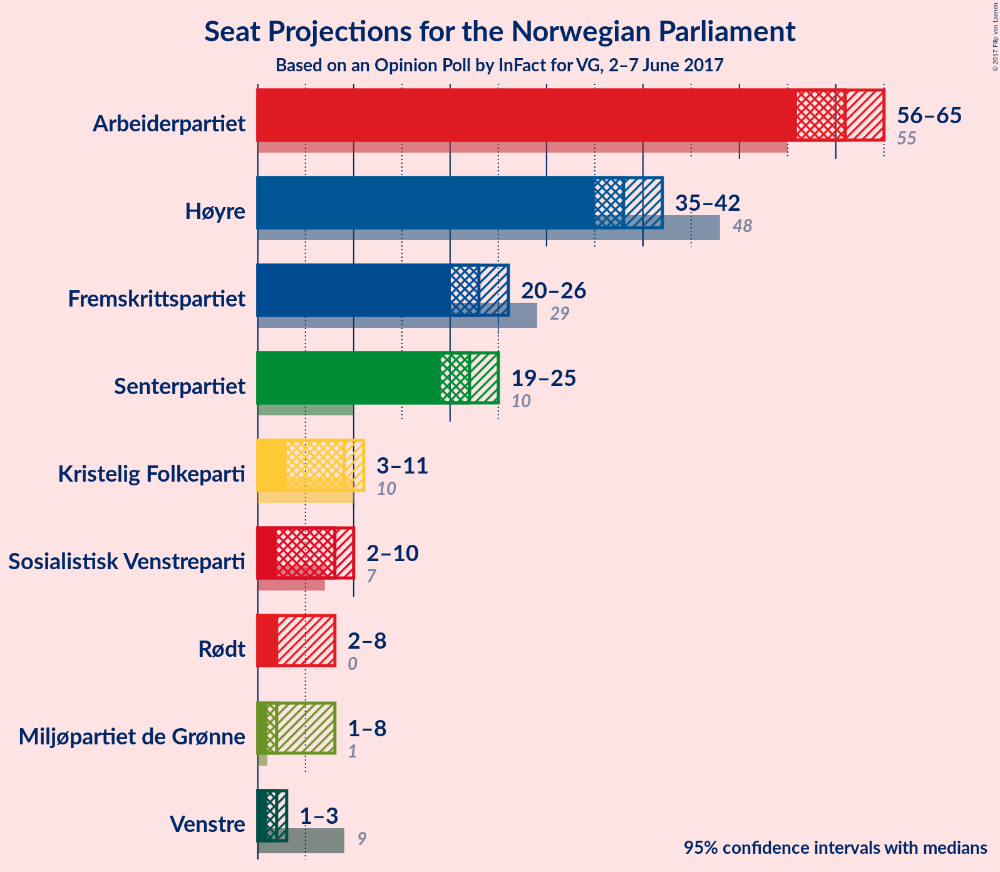
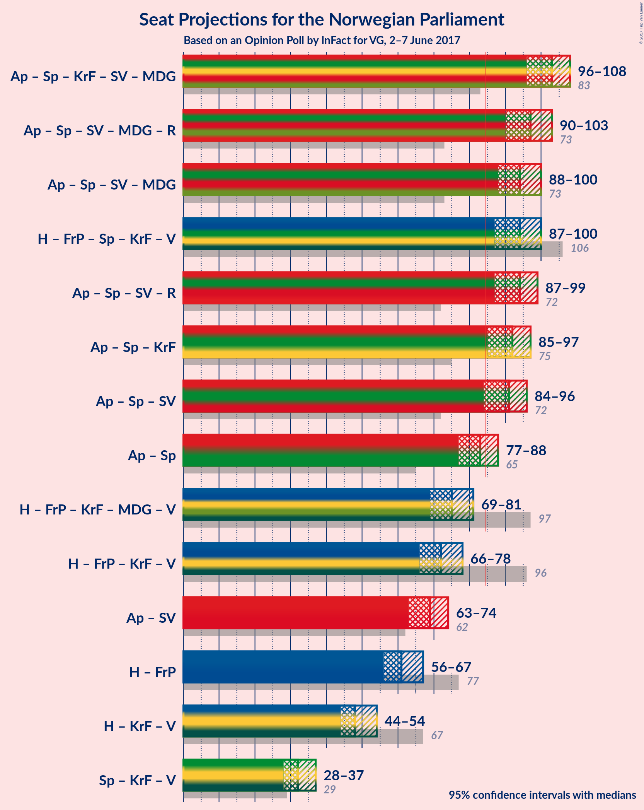

# Opinion Poll by InFact for VG, 2–7 June 2017

<a href="#voting-intentions">Voting Intentions</a> | <a href="#seats">Seats</a> | <a href="#coalitions">Coalitions</a> | <a href="#technical-information">Technical Information</a>

## Voting Intentions

### Confidence Intervals

| Party | Last Result | Poll Result | 80% Confidence Interval | 90% Confidence Interval | 95% Confidence Interval | 99% Confidence Interval |
|:-----:|:-----------:|:-----------:|:-----------------------:|:-----------------------:|:-----------------------:|:-----------------------:|
| Arbeiderpartiet | 30.8% | 32.3% | 31.0–33.7% |30.6–34.0% |30.3–34.4% |29.7–35.0% |
| Høyre | 26.8% | 20.5% | 19.4–21.7% |19.1–22.0% |18.8–22.3% |18.3–22.9% |
| Fremskrittspartiet | 16.3% | 12.5% | 11.6–13.5% |11.4–13.8% |11.1–14.0% |10.7–14.5% |
| Senterpartiet | 5.5% | 11.8% | 10.9–12.7% |10.7–13.0% |10.5–13.2% |10.1–13.7% |
| Kristelig Folkeparti | 5.6% | 4.8% | 4.2–5.4% |4.1–5.6% |3.9–5.8% |3.7–6.1% |
| Sosialistisk Venstreparti | 4.1% | 4.5% | 3.9–5.1% |3.8–5.3% |3.7–5.5% |3.4–5.8% |
| Miljøpartiet de Grønne | 2.8% | 3.6% | 3.1–4.2% |3.0–4.4% |2.9–4.5% |2.7–4.8% |
| Rødt | 1.1% | 3.5% | 3.0–4.1% |2.9–4.3% |2.8–4.4% |2.6–4.7% |
| Venstre | 5.2% | 3.2% | 2.7–3.7% |2.6–3.9% |2.5–4.0% |2.3–4.3% |

*Note:* The poll result column reflects the actual value used in the calculations. Published results may vary slightly, and in addition be rounded to fewer digits.

## Seats

### Confidence Intervals

| Party | Last Result | Median | 80% Confidence Interval | 90% Confidence Interval | 95% Confidence Interval | 99% Confidence Interval |
|:-----:|:-----------:|:------:|:-----------------------:|:-----------------------:|:-----------------------:|:-----------------------:|
| <a href="#arbeiderpartiet">Arbeiderpartiet</a> | 55 | 61 | 57–65 |57–65 |56–65 |55–67 |
| <a href="#høyre">Høyre</a> | 48 | 38 | 36–41 |35–41 |35–42 |34–44 |
| <a href="#fremskrittspartiet">Fremskrittspartiet</a> | 29 | 23 | 21–25 |21–26 |20–26 |19–27 |
| <a href="#senterpartiet">Senterpartiet</a> | 10 | 21 | 20–23 |19–24 |19–25 |18–26 |
| <a href="#kristelig-folkeparti">Kristelig Folkeparti</a> | 10 | 9 | 8–10 |7–10 |7–11 |2–12 |
| <a href="#sosialistisk-venstreparti">Sosialistisk Venstreparti</a> | 7 | 8 | 2–9 |2–10 |2–10 |2–11 |
| <a href="#miljøpartiet-de-grønne">Miljøpartiet de Grønne</a> | 1 | 3 | 1–8 |1–8 |1–8 |1–9 |
| <a href="#rødt">Rødt</a> | 0 | 2 | 2–6 |2–8 |2–8 |2–8 |
| <a href="#venstre">Venstre</a> | 9 | 1 | 1–2 |1–3 |1–3 |0–8 |

### Arbeiderpartiet

| Number of Seats | Probability | Accumulated |
|:---------------:|:-----------:|:-----------:|
| 54 | 0.1% | 100% |
| 55 | 0.4% | 99.8% |
| 56 | 4% | 99.5% |
| 57 | 9% | 96% |
| 58 | 5% | 87% |
| 59 | 5% | 82% |
| 60 | 5% | 78% |
| 61 | 23% | 73% |
| 62 | 8% | 50% |
| 63 | 11% | 42% |
| 64 | 18% | 31% |
| 65 | 11% | 13% |
| 66 | 1.4% | 2% |
| 67 | 0.7% | 0.8% |
| 68 | 0% | 0% |

### Høyre

| Number of Seats | Probability | Accumulated |
|:---------------:|:-----------:|:-----------:|
| 33 | 0.2% | 100% |
| 34 | 0.4% | 99.7% |
| 35 | 7% | 99.3% |
| 36 | 25% | 92% |
| 37 | 17% | 68% |
| 38 | 14% | 50% |
| 39 | 8% | 37% |
| 40 | 11% | 28% |
| 41 | 13% | 17% |
| 42 | 3% | 4% |
| 43 | 0.4% | 1.2% |
| 44 | 0.5% | 0.7% |
| 45 | 0.2% | 0.2% |
| 46 | 0% | 0% |

### Fremskrittspartiet

| Number of Seats | Probability | Accumulated |
|:---------------:|:-----------:|:-----------:|
| 18 | 0.1% | 100% |
| 19 | 0.4% | 99.9% |
| 20 | 4% | 99.5% |
| 21 | 8% | 95% |
| 22 | 17% | 87% |
| 23 | 25% | 70% |
| 24 | 16% | 46% |
| 25 | 23% | 30% |
| 26 | 5% | 7% |
| 27 | 1.1% | 1.3% |
| 28 | 0.2% | 0.2% |
| 29 | 0% | 0% |

### Senterpartiet

| Number of Seats | Probability | Accumulated |
|:---------------:|:-----------:|:-----------:|
| 17 | 0.2% | 100% |
| 18 | 0.9% | 99.8% |
| 19 | 5% | 98.9% |
| 20 | 13% | 93% |
| 21 | 35% | 80% |
| 22 | 29% | 45% |
| 23 | 9% | 16% |
| 24 | 3% | 7% |
| 25 | 2% | 4% |
| 26 | 2% | 2% |
| 27 | 0% | 0% |

### Kristelig Folkeparti

| Number of Seats | Probability | Accumulated |
|:---------------:|:-----------:|:-----------:|
| 2 | 2% | 100% |
| 3 | 0.3% | 98% |
| 4 | 0% | 98% |
| 5 | 0% | 98% |
| 6 | 0% | 98% |
| 7 | 4% | 98% |
| 8 | 25% | 94% |
| 9 | 51% | 68% |
| 10 | 14% | 17% |
| 11 | 3% | 4% |
| 12 | 0.6% | 0.6% |
| 13 | 0% | 0% |

### Sosialistisk Venstreparti

| Number of Seats | Probability | Accumulated |
|:---------------:|:-----------:|:-----------:|
| 1 | 0.2% | 100% |
| 2 | 19% | 99.8% |
| 3 | 0.1% | 81% |
| 4 | 0% | 81% |
| 5 | 0% | 81% |
| 6 | 0.1% | 81% |
| 7 | 3% | 81% |
| 8 | 53% | 78% |
| 9 | 20% | 25% |
| 10 | 5% | 5% |
| 11 | 0.5% | 0.5% |
| 12 | 0% | 0% |

### Miljøpartiet de Grønne

| Number of Seats | Probability | Accumulated |
|:---------------:|:-----------:|:-----------:|
| 1 | 15% | 100% |
| 2 | 26% | 85% |
| 3 | 20% | 59% |
| 4 | 4% | 40% |
| 5 | 0% | 35% |
| 6 | 0.1% | 35% |
| 7 | 2% | 35% |
| 8 | 32% | 34% |
| 9 | 2% | 2% |
| 10 | 0% | 0% |

### Rødt

| Number of Seats | Probability | Accumulated |
|:---------------:|:-----------:|:-----------:|
| 1 | 0.3% | 100% |
| 2 | 90% | 99.7% |
| 3 | 0% | 10% |
| 4 | 0% | 10% |
| 5 | 0% | 10% |
| 6 | 0.2% | 10% |
| 7 | 5% | 10% |
| 8 | 5% | 5% |
| 9 | 0.3% | 0.3% |
| 10 | 0% | 0% |

### Venstre

| Number of Seats | Probability | Accumulated |
|:---------------:|:-----------:|:-----------:|
| 0 | 0.5% | 100% |
| 1 | 51% | 99.5% |
| 2 | 43% | 49% |
| 3 | 5% | 6% |
| 4 | 0% | 1.0% |
| 5 | 0% | 1.0% |
| 6 | 0% | 1.0% |
| 7 | 0.4% | 1.0% |
| 8 | 0.6% | 0.6% |
| 9 | 0% | 0% |

## Coalitions

### Confidence Intervals

| Coalition | Last Result | Median | 80% Confidence Interval | 90% Confidence Interval | 95% Confidence Interval | 99% Confidence Interval |
|:---------:|:-----------:|:------:|:-----------------------:|:-----------------------:|:-----------------------:|:-----------------------:|
| Arbeiderpartiet – Senterpartiet – Kristelig Folkeparti – Sosialistisk Venstreparti – Miljøpartiet de Grønne | 83 | 103 | 99–107 | 97–108 | 95–108 | 94–109 |
| Arbeiderpartiet – Senterpartiet – Sosialistisk Venstreparti – Miljøpartiet de Grønne – Rødt | 73 | 97 | 93–101 | 92–102 | 91–102 | 87–103 |
| Arbeiderpartiet – Senterpartiet – Sosialistisk Venstreparti – Miljøpartiet de Grønne | 73 | 94 | 90–98 | 88–100 | 87–100 | 85–101 |
| Høyre – Fremskrittspartiet – Senterpartiet – Kristelig Folkeparti – Venstre | 106 | 93 | 87–99 | 87–99 | 86–100 | 85–102 |
| Arbeiderpartiet – Senterpartiet – Sosialistisk Venstreparti – Rødt | 72 | 92 | 89–96 | 89–98 | 87–99 | 85–101 |
| Arbeiderpartiet – Senterpartiet – Kristelig Folkeparti | 75 | 91 | 88–96 | 86–96 | 85–97 | 84–99 |
| Arbeiderpartiet – Senterpartiet – Sosialistisk Venstreparti | 72 | 90 | 87–93 | 86–95 | 85–96 | 82–97 |
| Arbeiderpartiet – Senterpartiet | 65 | 82 | 79–87 | 78–87 | 77–88 | 75–90 |
| Høyre – Fremskrittspartiet – Kristelig Folkeparti – Miljøpartiet de Grønne – Venstre | 97 | 77 | 71–80 | 70–80 | 70–81 | 68–84 |
| Høyre – Fremskrittspartiet – Kristelig Folkeparti – Venstre | 96 | 72 | 67–76 | 67–77 | 66–77 | 65–79 |
| Arbeiderpartiet – Sosialistisk Venstreparti | 62 | 69 | 65–72 | 64–74 | 63–74 | 60–75 |
| Høyre – Fremskrittspartiet | 77 | 62 | 57–65 | 57–65 | 57–67 | 56–70 |
| Høyre – Kristelig Folkeparti – Venstre | 67 | 48 | 46–52 | 45–52 | 45–54 | 43–56 |
| Senterpartiet – Kristelig Folkeparti – Venstre | 29 | 31 | 30–34 | 29–36 | 29–37 | 25–38 |

### Arbeiderpartiet – Senterpartiet – Kristelig Folkeparti – Sosialistisk Venstreparti – Miljøpartiet de Grønne

| Number of Seats | Probability | Accumulated |
|:---------------:|:-----------:|:-----------:|
| 92 | 0.2% | 100% |
| 93 | 0.2% | 99.8% |
| 94 | 1.3% | 99.6% |
| 95 | 2% | 98% |
| 96 | 1.0% | 97% |
| 97 | 0.9% | 96% |
| 98 | 3% | 95% |
| 99 | 4% | 92% |
| 100 | 14% | 88% |
| 101 | 9% | 74% |
| 102 | 5% | 64% |
| 103 | 14% | 59% |
| 104 | 11% | 45% |
| 105 | 3% | 34% |
| 106 | 4% | 32% |
| 107 | 19% | 28% |
| 108 | 7% | 8% |
| 109 | 1.1% | 1.3% |
| 110 | 0.1% | 0.2% |
| 111 | 0% | 0% |

### Arbeiderpartiet – Senterpartiet – Sosialistisk Venstreparti – Miljøpartiet de Grønne – Rødt

| Number of Seats | Probability | Accumulated |
|:---------------:|:-----------:|:-----------:|
| 86 | 0.1% | 100% |
| 87 | 0.5% | 99.9% |
| 88 | 0.2% | 99.4% |
| 89 | 0.1% | 99.2% |
| 90 | 0.9% | 99.0% |
| 91 | 0.8% | 98% |
| 92 | 7% | 97% |
| 93 | 9% | 90% |
| 94 | 5% | 81% |
| 95 | 11% | 76% |
| 96 | 10% | 65% |
| 97 | 15% | 56% |
| 98 | 3% | 40% |
| 99 | 4% | 37% |
| 100 | 21% | 33% |
| 101 | 5% | 13% |
| 102 | 7% | 8% |
| 103 | 1.0% | 1.4% |
| 104 | 0.3% | 0.4% |
| 105 | 0.1% | 0.1% |
| 106 | 0% | 0% |

### Arbeiderpartiet – Senterpartiet – Sosialistisk Venstreparti – Miljøpartiet de Grønne

| Number of Seats | Probability | Accumulated |
|:---------------:|:-----------:|:-----------:|
| 83 | 0% | 100% |
| 84 | 0.2% | 99.9% |
| 85 | 0.6% | 99.7% |
| 86 | 1.1% | 99.1% |
| 87 | 1.3% | 98% |
| 88 | 2% | 97% |
| 89 | 1.3% | 94% |
| 90 | 8% | 93% |
| 91 | 9% | 85% |
| 92 | 4% | 76% |
| 93 | 10% | 71% |
| 94 | 11% | 61% |
| 95 | 13% | 50% |
| 96 | 3% | 36% |
| 97 | 4% | 33% |
| 98 | 20% | 29% |
| 99 | 2% | 9% |
| 100 | 6% | 7% |
| 101 | 0.6% | 0.8% |
| 102 | 0.2% | 0.2% |
| 103 | 0% | 0% |

### Høyre – Fremskrittspartiet – Senterpartiet – Kristelig Folkeparti – Venstre

| Number of Seats | Probability | Accumulated |
|:---------------:|:-----------:|:-----------:|
| 82 | 0% | 100% |
| 83 | 0.1% | 99.9% |
| 84 | 0.1% | 99.8% |
| 85 | 0.3% | 99.7% |
| 86 | 3% | 99.5% |
| 87 | 9% | 97% |
| 88 | 0.8% | 88% |
| 89 | 3% | 87% |
| 90 | 20% | 85% |
| 91 | 5% | 65% |
| 92 | 3% | 60% |
| 93 | 10% | 57% |
| 94 | 12% | 47% |
| 95 | 7% | 35% |
| 96 | 4% | 29% |
| 97 | 3% | 25% |
| 98 | 10% | 22% |
| 99 | 9% | 11% |
| 100 | 2% | 3% |
| 101 | 0.4% | 1.2% |
| 102 | 0.5% | 0.9% |
| 103 | 0.2% | 0.4% |
| 104 | 0.1% | 0.2% |
| 105 | 0% | 0.1% |
| 106 | 0% | 0% |

### Arbeiderpartiet – Senterpartiet – Sosialistisk Venstreparti – Rødt

| Number of Seats | Probability | Accumulated |
|:---------------:|:-----------:|:-----------:|
| 84 | 0.1% | 100% |
| 85 | 0.5% | 99.9% |
| 86 | 0.8% | 99.4% |
| 87 | 1.4% | 98.6% |
| 88 | 2% | 97% |
| 89 | 9% | 95% |
| 90 | 4% | 86% |
| 91 | 12% | 82% |
| 92 | 26% | 70% |
| 93 | 4% | 44% |
| 94 | 13% | 40% |
| 95 | 16% | 27% |
| 96 | 2% | 11% |
| 97 | 2% | 9% |
| 98 | 4% | 7% |
| 99 | 2% | 3% |
| 100 | 0.3% | 0.9% |
| 101 | 0.6% | 0.7% |
| 102 | 0.1% | 0.1% |
| 103 | 0% | 0% |

### Arbeiderpartiet – Senterpartiet – Kristelig Folkeparti

| Number of Seats | Probability | Accumulated |
|:---------------:|:-----------:|:-----------:|
| 81 | 0.2% | 100% |
| 82 | 0.1% | 99.8% |
| 83 | 0.1% | 99.7% |
| 84 | 1.4% | 99.6% |
| 85 | 1.4% | 98% |
| 86 | 3% | 97% |
| 87 | 1.1% | 94% |
| 88 | 5% | 93% |
| 89 | 9% | 88% |
| 90 | 8% | 80% |
| 91 | 23% | 72% |
| 92 | 13% | 49% |
| 93 | 9% | 37% |
| 94 | 11% | 27% |
| 95 | 3% | 16% |
| 96 | 10% | 13% |
| 97 | 1.3% | 4% |
| 98 | 1.0% | 2% |
| 99 | 1.2% | 1.4% |
| 100 | 0.3% | 0.3% |
| 101 | 0% | 0% |

### Arbeiderpartiet – Senterpartiet – Sosialistisk Venstreparti

| Number of Seats | Probability | Accumulated |
|:---------------:|:-----------:|:-----------:|
| 79 | 0.2% | 100% |
| 80 | 0% | 99.8% |
| 81 | 0.2% | 99.7% |
| 82 | 0.2% | 99.6% |
| 83 | 0.6% | 99.3% |
| 84 | 1.0% | 98.7% |
| 85 | 3% | 98% |
| 86 | 4% | 95% |
| 87 | 9% | 91% |
| 88 | 5% | 82% |
| 89 | 13% | 77% |
| 90 | 26% | 64% |
| 91 | 5% | 38% |
| 92 | 11% | 33% |
| 93 | 15% | 22% |
| 94 | 1.3% | 7% |
| 95 | 2% | 6% |
| 96 | 2% | 4% |
| 97 | 2% | 2% |
| 98 | 0.2% | 0.4% |
| 99 | 0.2% | 0.2% |
| 100 | 0% | 0% |

### Arbeiderpartiet – Senterpartiet

| Number of Seats | Probability | Accumulated |
|:---------------:|:-----------:|:-----------:|
| 73 | 0.1% | 100% |
| 74 | 0% | 99.9% |
| 75 | 0.5% | 99.9% |
| 76 | 0.6% | 99.4% |
| 77 | 3% | 98.8% |
| 78 | 3% | 96% |
| 79 | 7% | 93% |
| 80 | 3% | 86% |
| 81 | 8% | 83% |
| 82 | 25% | 75% |
| 83 | 3% | 50% |
| 84 | 15% | 47% |
| 85 | 14% | 32% |
| 86 | 3% | 18% |
| 87 | 11% | 15% |
| 88 | 2% | 4% |
| 89 | 1.4% | 2% |
| 90 | 1.0% | 1.0% |
| 91 | 0% | 0% |

### Høyre – Fremskrittspartiet – Kristelig Folkeparti – Miljøpartiet de Grønne – Venstre

| Number of Seats | Probability | Accumulated |
|:---------------:|:-----------:|:-----------:|
| 64 | 0% | 100% |
| 65 | 0% | 99.9% |
| 66 | 0% | 99.9% |
| 67 | 0.1% | 99.9% |
| 68 | 1.0% | 99.8% |
| 69 | 0.3% | 98.8% |
| 70 | 4% | 98.5% |
| 71 | 6% | 94% |
| 72 | 2% | 89% |
| 73 | 2% | 86% |
| 74 | 16% | 84% |
| 75 | 13% | 68% |
| 76 | 4% | 55% |
| 77 | 24% | 51% |
| 78 | 11% | 27% |
| 79 | 4% | 17% |
| 80 | 9% | 13% |
| 81 | 2% | 4% |
| 82 | 1.4% | 2% |
| 83 | 0.2% | 0.8% |
| 84 | 0.5% | 0.5% |
| 85 | 0% | 0.1% |
| 86 | 0% | 0% |

### Høyre – Fremskrittspartiet – Kristelig Folkeparti – Venstre

| Number of Seats | Probability | Accumulated |
|:---------------:|:-----------:|:-----------:|
| 62 | 0% | 100% |
| 63 | 0% | 99.9% |
| 64 | 0.1% | 99.9% |
| 65 | 0.6% | 99.8% |
| 66 | 3% | 99.2% |
| 67 | 7% | 96% |
| 68 | 6% | 89% |
| 69 | 21% | 82% |
| 70 | 4% | 62% |
| 71 | 3% | 58% |
| 72 | 15% | 55% |
| 73 | 8% | 40% |
| 74 | 11% | 32% |
| 75 | 3% | 21% |
| 76 | 9% | 18% |
| 77 | 7% | 9% |
| 78 | 0.7% | 2% |
| 79 | 0.8% | 1.2% |
| 80 | 0% | 0.4% |
| 81 | 0.2% | 0.4% |
| 82 | 0% | 0.2% |
| 83 | 0.1% | 0.1% |
| 84 | 0% | 0% |

### Arbeiderpartiet – Sosialistisk Venstreparti

| Number of Seats | Probability | Accumulated |
|:---------------:|:-----------:|:-----------:|
| 58 | 0.2% | 100% |
| 59 | 0% | 99.8% |
| 60 | 0.3% | 99.7% |
| 61 | 0.4% | 99.5% |
| 62 | 1.4% | 99.1% |
| 63 | 0.7% | 98% |
| 64 | 2% | 97% |
| 65 | 14% | 95% |
| 66 | 7% | 81% |
| 67 | 12% | 74% |
| 68 | 4% | 61% |
| 69 | 21% | 58% |
| 70 | 5% | 37% |
| 71 | 5% | 31% |
| 72 | 19% | 26% |
| 73 | 2% | 7% |
| 74 | 4% | 5% |
| 75 | 0.6% | 0.9% |
| 76 | 0.3% | 0.3% |
| 77 | 0.1% | 0.1% |
| 78 | 0% | 0% |

### Høyre – Fremskrittspartiet

| Number of Seats | Probability | Accumulated |
|:---------------:|:-----------:|:-----------:|
| 54 | 0.1% | 100% |
| 55 | 0.3% | 99.9% |
| 56 | 1.4% | 99.6% |
| 57 | 9% | 98% |
| 58 | 5% | 89% |
| 59 | 22% | 84% |
| 60 | 5% | 62% |
| 61 | 4% | 57% |
| 62 | 19% | 53% |
| 63 | 8% | 34% |
| 64 | 5% | 26% |
| 65 | 17% | 22% |
| 66 | 2% | 5% |
| 67 | 2% | 3% |
| 68 | 0.1% | 0.8% |
| 69 | 0.1% | 0.7% |
| 70 | 0.5% | 0.6% |
| 71 | 0.1% | 0.2% |
| 72 | 0% | 0% |

### Høyre – Kristelig Folkeparti – Venstre

| Number of Seats | Probability | Accumulated |
|:---------------:|:-----------:|:-----------:|
| 40 | 0.1% | 100% |
| 41 | 0.2% | 99.9% |
| 42 | 0.1% | 99.7% |
| 43 | 0.7% | 99.6% |
| 44 | 0.3% | 98.9% |
| 45 | 9% | 98.6% |
| 46 | 24% | 90% |
| 47 | 15% | 66% |
| 48 | 12% | 51% |
| 49 | 7% | 39% |
| 50 | 8% | 32% |
| 51 | 5% | 25% |
| 52 | 15% | 20% |
| 53 | 2% | 4% |
| 54 | 2% | 3% |
| 55 | 0.1% | 0.7% |
| 56 | 0.5% | 0.6% |
| 57 | 0.1% | 0.2% |
| 58 | 0% | 0% |

### Senterpartiet – Kristelig Folkeparti – Venstre

| Number of Seats | Probability | Accumulated |
|:---------------:|:-----------:|:-----------:|
| 24 | 0.2% | 100% |
| 25 | 0.6% | 99.8% |
| 26 | 0.9% | 99.2% |
| 27 | 0.4% | 98% |
| 28 | 0.4% | 98% |
| 29 | 6% | 98% |
| 30 | 11% | 91% |
| 31 | 35% | 80% |
| 32 | 15% | 45% |
| 33 | 12% | 30% |
| 34 | 9% | 18% |
| 35 | 4% | 10% |
| 36 | 2% | 6% |
| 37 | 2% | 3% |
| 38 | 0.6% | 1.0% |
| 39 | 0.2% | 0.4% |
| 40 | 0.2% | 0.2% |
| 41 | 0% | 0% |

## Technical Information

### Opinion Poll

+ **Pollster:** InFact
+ **Media:** VG
+ **Fieldwork period:** 2–7 June 2017

### Calculations

+ **Sample size:** 2071
+ **Simulations done:** 524,288
+ **Error estimate:** 2.76%

