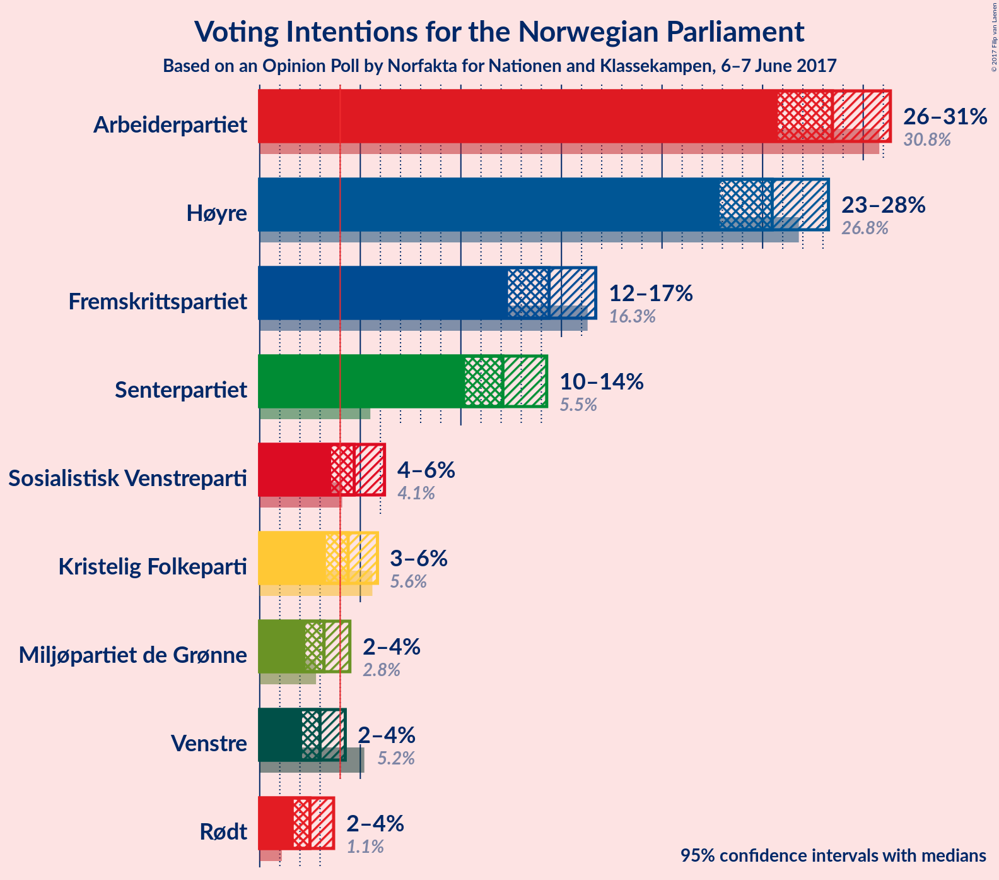
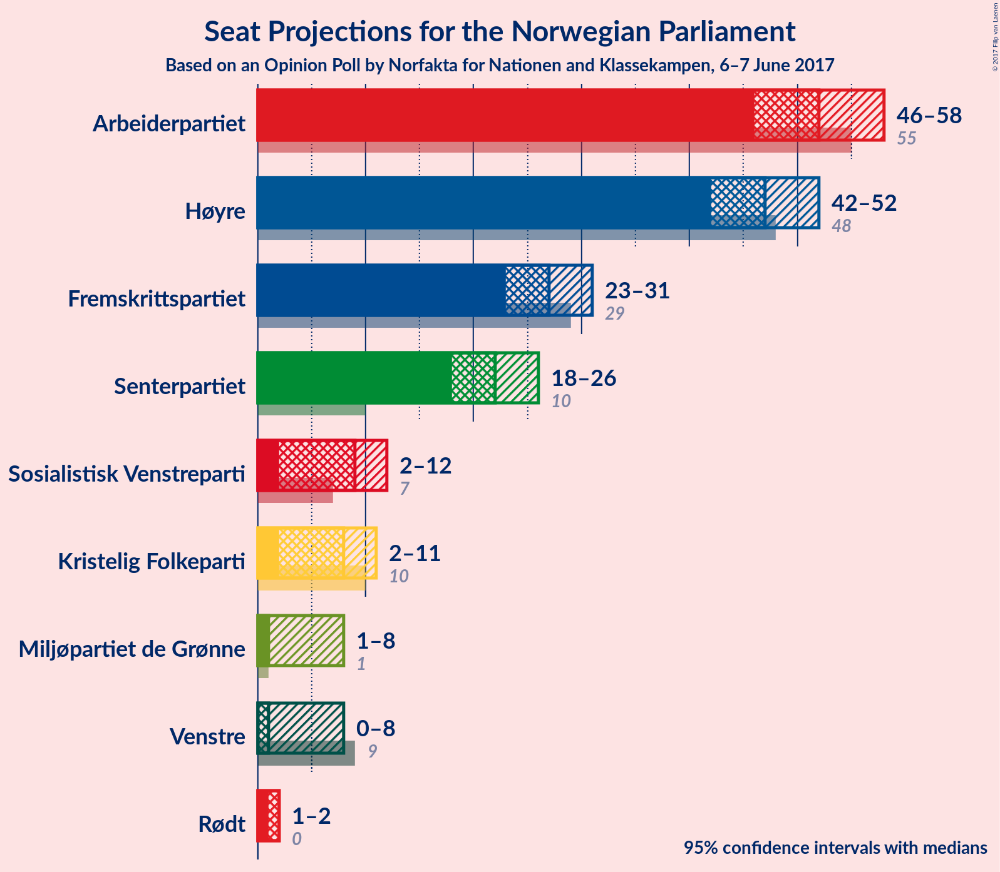
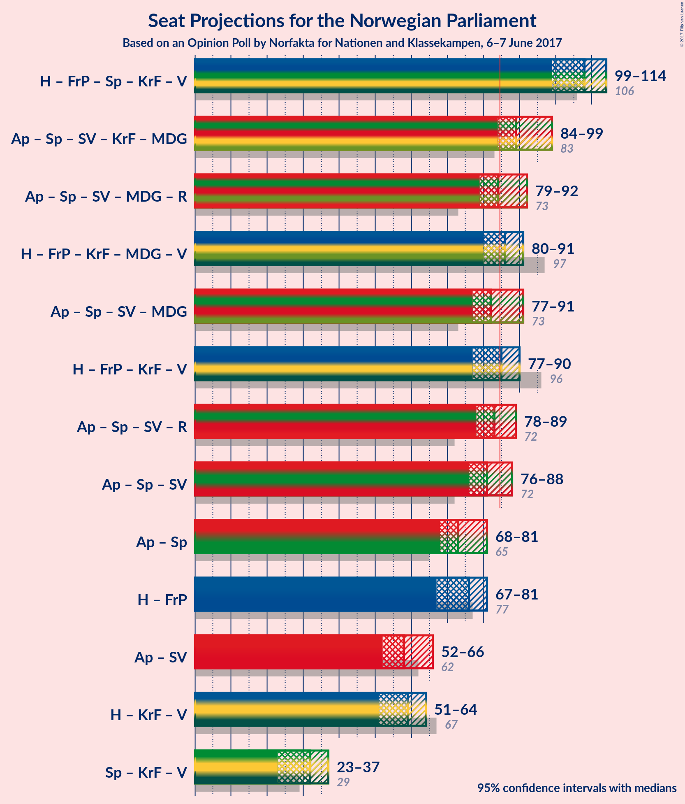

# Opinion Poll by Norfakta for Nationen and Klassekampen, 6–7 June 2017

<a href="#voting-intentions">Voting Intentions</a> | <a href="#seats">Seats</a> | <a href="#coalitions">Coalitions</a> | <a href="#technical-information">Technical Information</a>

## Voting Intentions

### Confidence Intervals

| Party | Last Result | Poll Result | 80% Confidence Interval | 90% Confidence Interval | 95% Confidence Interval | 99% Confidence Interval |
|:-----:|:-----------:|:-----------:|:-----------------------:|:-----------------------:|:-----------------------:|:-----------------------:|
| Arbeiderpartiet | 30.8% | 28.5% | 26.7–30.4% |26.2–30.9% |25.8–31.4% |24.9–32.3% |
| Høyre | 26.8% | 25.5% | 23.8–27.3% |23.3–27.8% |22.9–28.3% |22.1–29.2% |
| Fremskrittspartiet | 16.3% | 14.4% | 13.0–15.9% |12.7–16.3% |12.3–16.7% |11.7–17.5% |
| Senterpartiet | 5.5% | 12.1% | 10.9–13.5% |10.5–13.9% |10.2–14.3% |9.6–15.0% |
| Sosialistisk Venstreparti | 4.1% | 4.7% | 3.9–5.7% |3.7–5.9% |3.6–6.2% |3.2–6.7% |
| Kristelig Folkeparti | 5.6% | 4.4% | 3.7–5.3% |3.5–5.6% |3.3–5.9% |3.0–6.3% |
| Miljøpartiet de Grønne | 2.8% | 3.2% | 2.6–4.0% |2.4–4.3% |2.3–4.5% |2.0–4.9% |
| Venstre | 5.2% | 3.0% | 2.4–3.8% |2.2–4.0% |2.1–4.3% |1.9–4.7% |
| Rødt | 1.1% | 2.5% | 2.0–3.3% |1.8–3.5% |1.7–3.7% |1.5–4.1% |

*Note:* The poll result column reflects the actual value used in the calculations. Published results may vary slightly, and in addition be rounded to fewer digits.

## Seats

### Confidence Intervals

| Party | Last Result | Median | 80% Confidence Interval | 90% Confidence Interval | 95% Confidence Interval | 99% Confidence Interval |
|:-----:|:-----------:|:------:|:-----------------------:|:-----------------------:|:-----------------------:|:-----------------------:|
| <a href="#arbeiderpartiet">Arbeiderpartiet</a> | 55 | 52 | 49–57 |48–58 |46–58 |46–61 |
| <a href="#høyre">Høyre</a> | 48 | 47 | 43–51 |42–52 |42–52 |40–55 |
| <a href="#fremskrittspartiet">Fremskrittspartiet</a> | 29 | 27 | 24–29 |23–30 |23–31 |21–32 |
| <a href="#senterpartiet">Senterpartiet</a> | 10 | 22 | 20–25 |19–26 |18–26 |18–28 |
| <a href="#sosialistisk-venstreparti">Sosialistisk Venstreparti</a> | 7 | 9 | 2–10 |2–11 |2–12 |1–12 |
| <a href="#kristelig-folkeparti">Kristelig Folkeparti</a> | 10 | 8 | 2–10 |2–10 |2–11 |1–12 |
| <a href="#miljøpartiet-de-grønne">Miljøpartiet de Grønne</a> | 1 | 1 | 1–7 |1–8 |1–8 |1–9 |
| <a href="#venstre">Venstre</a> | 9 | 1 | 1–2 |1–7 |0–8 |0–8 |
| <a href="#rødt">Rødt</a> | 0 | 2 | 1–2 |1–2 |1–2 |1–7 |

### Arbeiderpartiet

| Number of Seats | Probability | Accumulated | Special Marks |
|:---------------:|:-----------:|:-----------:|:-------------:|
| 44 | 0.1% | 100% |  |
| 45 | 0.4% | 99.9% |  |
| 46 | 2% | 99.5% |  |
| 47 | 2% | 97% |  |
| 48 | 6% | 96% |  |
| 49 | 6% | 90% |  |
| 50 | 10% | 85% |  |
| 51 | 22% | 75% |  |
| 52 | 10% | 53% | Median |
| 53 | 7% | 42% |  |
| 54 | 7% | 35% |  |
| 55 | 12% | 29% | Last Result |
| 56 | 7% | 17% |  |
| 57 | 5% | 10% |  |
| 58 | 3% | 5% |  |
| 59 | 0.8% | 2% |  |
| 60 | 0.5% | 1.2% |  |
| 61 | 0.6% | 0.7% |  |
| 62 | 0% | 0.1% |  |
| 63 | 0% | 0.1% |  |
| 64 | 0% | 0.1% |  |
| 65 | 0% | 0% |  |

### Høyre

| Number of Seats | Probability | Accumulated | Special Marks |
|:---------------:|:-----------:|:-----------:|:-------------:|
| 38 | 0.1% | 100% |  |
| 39 | 0.1% | 99.9% |  |
| 40 | 0.4% | 99.8% |  |
| 41 | 2% | 99.4% |  |
| 42 | 5% | 98% |  |
| 43 | 13% | 93% |  |
| 44 | 10% | 80% |  |
| 45 | 5% | 70% |  |
| 46 | 8% | 65% |  |
| 47 | 10% | 57% | Median |
| 48 | 13% | 46% | Last Result |
| 49 | 15% | 33% |  |
| 50 | 7% | 18% |  |
| 51 | 5% | 10% |  |
| 52 | 3% | 6% |  |
| 53 | 1.3% | 2% |  |
| 54 | 0.5% | 1.1% |  |
| 55 | 0.5% | 0.6% |  |
| 56 | 0.1% | 0.2% |  |
| 57 | 0% | 0.1% |  |
| 58 | 0% | 0% |  |

### Fremskrittspartiet

| Number of Seats | Probability | Accumulated | Special Marks |
|:---------------:|:-----------:|:-----------:|:-------------:|
| 20 | 0.1% | 100% |  |
| 21 | 0.5% | 99.8% |  |
| 22 | 2% | 99.3% |  |
| 23 | 5% | 98% |  |
| 24 | 7% | 93% |  |
| 25 | 9% | 86% |  |
| 26 | 19% | 77% |  |
| 27 | 13% | 58% | Median |
| 28 | 26% | 44% |  |
| 29 | 10% | 18% | Last Result |
| 30 | 4% | 8% |  |
| 31 | 3% | 4% |  |
| 32 | 0.9% | 1.3% |  |
| 33 | 0.2% | 0.4% |  |
| 34 | 0.1% | 0.2% |  |
| 35 | 0.1% | 0.1% |  |
| 36 | 0% | 0% |  |

### Senterpartiet

| Number of Seats | Probability | Accumulated | Special Marks |
|:---------------:|:-----------:|:-----------:|:-------------:|
| 10 | 0% | 100% | Last Result |
| 11 | 0% | 100% |  |
| 12 | 0% | 100% |  |
| 13 | 0% | 100% |  |
| 14 | 0% | 100% |  |
| 15 | 0% | 100% |  |
| 16 | 0.1% | 100% |  |
| 17 | 0.4% | 99.9% |  |
| 18 | 3% | 99.5% |  |
| 19 | 4% | 97% |  |
| 20 | 17% | 93% |  |
| 21 | 8% | 76% |  |
| 22 | 25% | 68% | Median |
| 23 | 16% | 43% |  |
| 24 | 12% | 27% |  |
| 25 | 8% | 15% |  |
| 26 | 5% | 7% |  |
| 27 | 1.0% | 2% |  |
| 28 | 0.6% | 0.8% |  |
| 29 | 0.2% | 0.2% |  |
| 30 | 0% | 0.1% |  |
| 31 | 0% | 0% |  |

### Sosialistisk Venstreparti

| Number of Seats | Probability | Accumulated | Special Marks |
|:---------------:|:-----------:|:-----------:|:-------------:|
| 1 | 2% | 100% |  |
| 2 | 15% | 98% |  |
| 3 | 0% | 83% |  |
| 4 | 0% | 83% |  |
| 5 | 0% | 83% |  |
| 6 | 0% | 83% |  |
| 7 | 3% | 83% | Last Result |
| 8 | 24% | 79% |  |
| 9 | 27% | 55% | Median |
| 10 | 18% | 28% |  |
| 11 | 7% | 10% |  |
| 12 | 2% | 3% |  |
| 13 | 0.3% | 0.4% |  |
| 14 | 0% | 0% |  |

### Kristelig Folkeparti

| Number of Seats | Probability | Accumulated | Special Marks |
|:---------------:|:-----------:|:-----------:|:-------------:|
| 1 | 0.7% | 100% |  |
| 2 | 19% | 99.3% |  |
| 3 | 1.3% | 80% |  |
| 4 | 0% | 79% |  |
| 5 | 0% | 79% |  |
| 6 | 0% | 79% |  |
| 7 | 7% | 79% |  |
| 8 | 32% | 71% | Median |
| 9 | 24% | 40% |  |
| 10 | 11% | 16% | Last Result |
| 11 | 4% | 4% |  |
| 12 | 0.5% | 0.6% |  |
| 13 | 0.1% | 0.1% |  |
| 14 | 0% | 0% |  |

### Miljøpartiet de Grønne

| Number of Seats | Probability | Accumulated | Special Marks |
|:---------------:|:-----------:|:-----------:|:-------------:|
| 0 | 0.1% | 100% |  |
| 1 | 63% | 99.9% | Last Result, Median |
| 2 | 13% | 37% |  |
| 3 | 4% | 24% |  |
| 4 | 8% | 19% |  |
| 5 | 0% | 11% |  |
| 6 | 0% | 11% |  |
| 7 | 5% | 11% |  |
| 8 | 5% | 6% |  |
| 9 | 1.2% | 1.3% |  |
| 10 | 0.1% | 0.1% |  |
| 11 | 0% | 0% |  |

### Venstre

| Number of Seats | Probability | Accumulated | Special Marks |
|:---------------:|:-----------:|:-----------:|:-------------:|
| 0 | 4% | 100% |  |
| 1 | 50% | 96% | Median |
| 2 | 37% | 47% |  |
| 3 | 3% | 9% |  |
| 4 | 0% | 6% |  |
| 5 | 0% | 6% |  |
| 6 | 0% | 6% |  |
| 7 | 3% | 6% |  |
| 8 | 3% | 4% |  |
| 9 | 0.3% | 0.3% | Last Result |
| 10 | 0% | 0% |  |

### Rødt

| Number of Seats | Probability | Accumulated | Special Marks |
|:---------------:|:-----------:|:-----------:|:-------------:|
| 0 | 0% | 100% | Last Result |
| 1 | 49% | 100% |  |
| 2 | 50% | 51% | Median |
| 3 | 0% | 0.7% |  |
| 4 | 0% | 0.7% |  |
| 5 | 0% | 0.7% |  |
| 6 | 0% | 0.7% |  |
| 7 | 0.4% | 0.7% |  |
| 8 | 0.2% | 0.2% |  |
| 9 | 0% | 0% |  |

## Coalitions

### Confidence Intervals

| Coalition | Last Result | Median | 80% Confidence Interval | 90% Confidence Interval | 95% Confidence Interval | 99% Confidence Interval |
|:---------:|:-----------:|:------:|:-----------------------:|:-----------------------:|:-----------------------:|:-----------------------:|
| Høyre – Fremskrittspartiet – Senterpartiet – Kristelig Folkeparti – Venstre | 106 | 105 | 100–110 | 99–111 | 98–113 | 96–114 |
| Arbeiderpartiet – Senterpartiet – Sosialistisk Venstreparti – Kristelig Folkeparti – Miljøpartiet de Grønne | 83 | 92 | 87–96 | 86–98 | 85–99 | 83–101 |
| Arbeiderpartiet – Senterpartiet – Sosialistisk Venstreparti – Miljøpartiet de Grønne – Rødt | 73 | 86 | 82–92 | 80–93 | 79–94 | 76–96 |
| Arbeiderpartiet – Senterpartiet – Sosialistisk Venstreparti – Miljøpartiet de Grønne | 73 | 85 | 80–90 | 78–91 | 78–92 | 75–94 |
| Høyre – Fremskrittspartiet – Kristelig Folkeparti – Miljøpartiet de Grønne – Venstre | 97 | 85 | 80–90 | 78–91 | 78–92 | 75–94 |
| Arbeiderpartiet – Senterpartiet – Sosialistisk Venstreparti – Rødt | 72 | 84 | 79–89 | 78–91 | 77–91 | 75–94 |
| Arbeiderpartiet – Senterpartiet – Sosialistisk Venstreparti | 72 | 82 | 77–88 | 76–89 | 76–90 | 73–92 |
| Høyre – Fremskrittspartiet – Kristelig Folkeparti – Venstre | 96 | 83 | 77–87 | 76–89 | 75–90 | 73–93 |
| Arbeiderpartiet – Senterpartiet – Kristelig Folkeparti | 75 | 82 | 77–87 | 76–89 | 74–90 | 73–91 |
| Arbeiderpartiet – Senterpartiet | 65 | 74 | 70–80 | 69–81 | 68–81 | 67–84 |
| Høyre – Fremskrittspartiet | 77 | 73 | 69–78 | 68–80 | 67–80 | 65–82 |
| Arbeiderpartiet – Sosialistisk Venstreparti | 62 | 60 | 56–65 | 54–66 | 53–67 | 51–69 |
| Høyre – Kristelig Folkeparti – Venstre | 67 | 56 | 52–61 | 50–61 | 49–63 | 47–65 |
| Senterpartiet – Kristelig Folkeparti – Venstre | 29 | 32 | 26–36 | 25–36 | 23–38 | 22–39 |

### Høyre – Fremskrittspartiet – Senterpartiet – Kristelig Folkeparti – Venstre

| Number of Seats | Probability | Accumulated | Special Marks |
|:---------------:|:-----------:|:-----------:|:-------------:|
| 93 | 0.1% | 100% |  |
| 94 | 0.1% | 99.9% |  |
| 95 | 0.2% | 99.8% |  |
| 96 | 0.9% | 99.6% |  |
| 97 | 0.7% | 98.7% |  |
| 98 | 2% | 98% |  |
| 99 | 2% | 96% |  |
| 100 | 8% | 94% |  |
| 101 | 5% | 86% |  |
| 102 | 5% | 80% |  |
| 103 | 13% | 76% |  |
| 104 | 8% | 63% |  |
| 105 | 11% | 55% | Median |
| 106 | 8% | 44% | Last Result |
| 107 | 8% | 36% |  |
| 108 | 10% | 28% |  |
| 109 | 7% | 19% |  |
| 110 | 6% | 11% |  |
| 111 | 1.2% | 6% |  |
| 112 | 0.7% | 4% |  |
| 113 | 1.5% | 4% |  |
| 114 | 2% | 2% |  |
| 115 | 0.2% | 0.4% |  |
| 116 | 0.3% | 0.3% |  |
| 117 | 0% | 0% |  |

### Arbeiderpartiet – Senterpartiet – Sosialistisk Venstreparti – Kristelig Folkeparti – Miljøpartiet de Grønne

| Number of Seats | Probability | Accumulated | Special Marks |
|:---------------:|:-----------:|:-----------:|:-------------:|
| 79 | 0.1% | 100% |  |
| 80 | 0% | 99.8% |  |
| 81 | 0.1% | 99.8% |  |
| 82 | 0.2% | 99.7% |  |
| 83 | 0.8% | 99.5% | Last Result |
| 84 | 0.5% | 98.7% |  |
| 85 | 2% | 98% | Majority |
| 86 | 3% | 96% |  |
| 87 | 4% | 93% |  |
| 88 | 5% | 89% |  |
| 89 | 9% | 84% |  |
| 90 | 6% | 75% |  |
| 91 | 15% | 69% |  |
| 92 | 9% | 54% | Median |
| 93 | 9% | 45% |  |
| 94 | 10% | 36% |  |
| 95 | 11% | 26% |  |
| 96 | 7% | 15% |  |
| 97 | 2% | 8% |  |
| 98 | 3% | 6% |  |
| 99 | 1.4% | 3% |  |
| 100 | 1.0% | 2% |  |
| 101 | 0.5% | 0.7% |  |
| 102 | 0.2% | 0.2% |  |
| 103 | 0.1% | 0.1% |  |
| 104 | 0% | 0% |  |

### Arbeiderpartiet – Senterpartiet – Sosialistisk Venstreparti – Miljøpartiet de Grønne – Rødt

| Number of Seats | Probability | Accumulated | Special Marks |
|:---------------:|:-----------:|:-----------:|:-------------:|
| 73 | 0% | 100% | Last Result |
| 74 | 0% | 100% |  |
| 75 | 0% | 100% |  |
| 76 | 0.6% | 99.9% |  |
| 77 | 0.2% | 99.4% |  |
| 78 | 0.5% | 99.2% |  |
| 79 | 3% | 98.7% |  |
| 80 | 2% | 96% |  |
| 81 | 3% | 94% |  |
| 82 | 8% | 91% |  |
| 83 | 6% | 83% |  |
| 84 | 16% | 77% |  |
| 85 | 5% | 61% | Majority |
| 86 | 6% | 56% | Median |
| 87 | 10% | 49% |  |
| 88 | 7% | 39% |  |
| 89 | 13% | 32% |  |
| 90 | 7% | 19% |  |
| 91 | 2% | 12% |  |
| 92 | 4% | 10% |  |
| 93 | 3% | 6% |  |
| 94 | 1.1% | 3% |  |
| 95 | 0.8% | 2% |  |
| 96 | 0.4% | 0.7% |  |
| 97 | 0.2% | 0.3% |  |
| 98 | 0.1% | 0.1% |  |
| 99 | 0% | 0% |  |

### Arbeiderpartiet – Senterpartiet – Sosialistisk Venstreparti – Miljøpartiet de Grønne

| Number of Seats | Probability | Accumulated | Special Marks |
|:---------------:|:-----------:|:-----------:|:-------------:|
| 73 | 0% | 100% | Last Result |
| 74 | 0.1% | 100% |  |
| 75 | 0.6% | 99.9% |  |
| 76 | 0.3% | 99.2% |  |
| 77 | 1.4% | 99.0% |  |
| 78 | 3% | 98% |  |
| 79 | 1.4% | 94% |  |
| 80 | 8% | 93% |  |
| 81 | 6% | 85% |  |
| 82 | 8% | 78% |  |
| 83 | 14% | 71% |  |
| 84 | 4% | 57% | Median |
| 85 | 9% | 53% | Majority |
| 86 | 9% | 44% |  |
| 87 | 14% | 36% |  |
| 88 | 4% | 21% |  |
| 89 | 6% | 18% |  |
| 90 | 3% | 12% |  |
| 91 | 5% | 8% |  |
| 92 | 2% | 4% |  |
| 93 | 1.3% | 2% |  |
| 94 | 0.4% | 0.8% |  |
| 95 | 0.1% | 0.4% |  |
| 96 | 0.2% | 0.3% |  |
| 97 | 0.1% | 0.1% |  |
| 98 | 0% | 0% |  |

### Høyre – Fremskrittspartiet – Kristelig Folkeparti – Miljøpartiet de Grønne – Venstre

| Number of Seats | Probability | Accumulated | Special Marks |
|:---------------:|:-----------:|:-----------:|:-------------:|
| 73 | 0.1% | 100% |  |
| 74 | 0.2% | 99.9% |  |
| 75 | 0.1% | 99.6% |  |
| 76 | 0.9% | 99.5% |  |
| 77 | 1.0% | 98.5% |  |
| 78 | 3% | 98% |  |
| 79 | 3% | 94% |  |
| 80 | 4% | 91% |  |
| 81 | 6% | 87% |  |
| 82 | 5% | 81% |  |
| 83 | 11% | 76% |  |
| 84 | 10% | 65% | Median |
| 85 | 6% | 55% | Majority |
| 86 | 15% | 49% |  |
| 87 | 12% | 34% |  |
| 88 | 8% | 23% |  |
| 89 | 3% | 14% |  |
| 90 | 3% | 11% |  |
| 91 | 3% | 8% |  |
| 92 | 3% | 5% |  |
| 93 | 0.5% | 2% |  |
| 94 | 1.0% | 1.5% |  |
| 95 | 0.3% | 0.4% |  |
| 96 | 0% | 0.1% |  |
| 97 | 0% | 0.1% | Last Result |
| 98 | 0% | 0.1% |  |
| 99 | 0% | 0% |  |

### Arbeiderpartiet – Senterpartiet – Sosialistisk Venstreparti – Rødt

| Number of Seats | Probability | Accumulated | Special Marks |
|:---------------:|:-----------:|:-----------:|:-------------:|
| 71 | 0% | 100% |  |
| 72 | 0% | 99.9% | Last Result |
| 73 | 0% | 99.9% |  |
| 74 | 0.3% | 99.9% |  |
| 75 | 1.0% | 99.6% |  |
| 76 | 0.5% | 98.5% |  |
| 77 | 3% | 98% |  |
| 78 | 3% | 95% |  |
| 79 | 3% | 92% |  |
| 80 | 3% | 89% |  |
| 81 | 8% | 86% |  |
| 82 | 12% | 77% |  |
| 83 | 15% | 66% |  |
| 84 | 6% | 51% |  |
| 85 | 10% | 45% | Median, Majority |
| 86 | 11% | 35% |  |
| 87 | 5% | 24% |  |
| 88 | 6% | 19% |  |
| 89 | 4% | 13% |  |
| 90 | 3% | 9% |  |
| 91 | 3% | 6% |  |
| 92 | 1.0% | 2% |  |
| 93 | 0.9% | 1.5% |  |
| 94 | 0.1% | 0.5% |  |
| 95 | 0.2% | 0.4% |  |
| 96 | 0.1% | 0.1% |  |
| 97 | 0% | 0% |  |

### Arbeiderpartiet – Senterpartiet – Sosialistisk Venstreparti

| Number of Seats | Probability | Accumulated | Special Marks |
|:---------------:|:-----------:|:-----------:|:-------------:|
| 70 | 0.1% | 100% |  |
| 71 | 0% | 99.9% |  |
| 72 | 0.1% | 99.9% | Last Result |
| 73 | 0.5% | 99.8% |  |
| 74 | 1.1% | 99.3% |  |
| 75 | 0.6% | 98% |  |
| 76 | 4% | 98% |  |
| 77 | 4% | 94% |  |
| 78 | 2% | 90% |  |
| 79 | 9% | 88% |  |
| 80 | 9% | 79% |  |
| 81 | 8% | 69% |  |
| 82 | 14% | 61% |  |
| 83 | 9% | 47% | Median |
| 84 | 7% | 38% |  |
| 85 | 10% | 31% | Majority |
| 86 | 6% | 21% |  |
| 87 | 2% | 15% |  |
| 88 | 4% | 12% |  |
| 89 | 5% | 8% |  |
| 90 | 1.2% | 3% |  |
| 91 | 0.9% | 2% |  |
| 92 | 0.3% | 0.7% |  |
| 93 | 0.2% | 0.4% |  |
| 94 | 0.1% | 0.2% |  |
| 95 | 0.1% | 0.1% |  |
| 96 | 0% | 0% |  |

### Høyre – Fremskrittspartiet – Kristelig Folkeparti – Venstre

| Number of Seats | Probability | Accumulated | Special Marks |
|:---------------:|:-----------:|:-----------:|:-------------:|
| 71 | 0.1% | 100% |  |
| 72 | 0.2% | 99.9% |  |
| 73 | 0.4% | 99.7% |  |
| 74 | 0.8% | 99.3% |  |
| 75 | 1.1% | 98% |  |
| 76 | 3% | 97% |  |
| 77 | 4% | 94% |  |
| 78 | 2% | 90% |  |
| 79 | 7% | 88% |  |
| 80 | 13% | 81% |  |
| 81 | 7% | 68% |  |
| 82 | 10% | 61% |  |
| 83 | 6% | 51% | Median |
| 84 | 5% | 44% |  |
| 85 | 16% | 39% | Majority |
| 86 | 6% | 23% |  |
| 87 | 8% | 17% |  |
| 88 | 3% | 9% |  |
| 89 | 2% | 6% |  |
| 90 | 3% | 4% |  |
| 91 | 0.5% | 1.3% |  |
| 92 | 0.2% | 0.8% |  |
| 93 | 0.6% | 0.6% |  |
| 94 | 0% | 0.1% |  |
| 95 | 0% | 0% |  |
| 96 | 0% | 0% | Last Result |

### Arbeiderpartiet – Senterpartiet – Kristelig Folkeparti

| Number of Seats | Probability | Accumulated | Special Marks |
|:---------------:|:-----------:|:-----------:|:-------------:|
| 70 | 0% | 100% |  |
| 71 | 0.1% | 99.9% |  |
| 72 | 0.3% | 99.8% |  |
| 73 | 0.3% | 99.6% |  |
| 74 | 2% | 99.2% |  |
| 75 | 2% | 97% | Last Result |
| 76 | 3% | 95% |  |
| 77 | 4% | 92% |  |
| 78 | 7% | 88% |  |
| 79 | 5% | 81% |  |
| 80 | 13% | 76% |  |
| 81 | 10% | 63% |  |
| 82 | 15% | 53% | Median |
| 83 | 6% | 38% |  |
| 84 | 8% | 32% |  |
| 85 | 5% | 23% | Majority |
| 86 | 5% | 18% |  |
| 87 | 4% | 14% |  |
| 88 | 3% | 10% |  |
| 89 | 3% | 7% |  |
| 90 | 3% | 4% |  |
| 91 | 0.5% | 0.6% |  |
| 92 | 0.1% | 0.2% |  |
| 93 | 0.1% | 0.1% |  |
| 94 | 0% | 0% |  |

### Arbeiderpartiet – Senterpartiet

| Number of Seats | Probability | Accumulated | Special Marks |
|:---------------:|:-----------:|:-----------:|:-------------:|
| 65 | 0.1% | 100% | Last Result |
| 66 | 0.3% | 99.9% |  |
| 67 | 0.6% | 99.6% |  |
| 68 | 2% | 99.0% |  |
| 69 | 3% | 97% |  |
| 70 | 5% | 94% |  |
| 71 | 6% | 89% |  |
| 72 | 14% | 82% |  |
| 73 | 10% | 68% |  |
| 74 | 10% | 57% | Median |
| 75 | 11% | 47% |  |
| 76 | 5% | 36% |  |
| 77 | 6% | 31% |  |
| 78 | 5% | 25% |  |
| 79 | 6% | 19% |  |
| 80 | 8% | 14% |  |
| 81 | 3% | 6% |  |
| 82 | 0.7% | 2% |  |
| 83 | 0.7% | 1.5% |  |
| 84 | 0.4% | 0.7% |  |
| 85 | 0.2% | 0.3% | Majority |
| 86 | 0% | 0.1% |  |
| 87 | 0% | 0.1% |  |
| 88 | 0% | 0.1% |  |
| 89 | 0% | 0% |  |

### Høyre – Fremskrittspartiet

| Number of Seats | Probability | Accumulated | Special Marks |
|:---------------:|:-----------:|:-----------:|:-------------:|
| 63 | 0.1% | 100% |  |
| 64 | 0.2% | 99.9% |  |
| 65 | 0.5% | 99.7% |  |
| 66 | 0.7% | 99.2% |  |
| 67 | 2% | 98.5% |  |
| 68 | 2% | 97% |  |
| 69 | 5% | 94% |  |
| 70 | 6% | 90% |  |
| 71 | 14% | 84% |  |
| 72 | 8% | 69% |  |
| 73 | 11% | 61% |  |
| 74 | 10% | 50% | Median |
| 75 | 8% | 40% |  |
| 76 | 13% | 32% |  |
| 77 | 6% | 19% | Last Result |
| 78 | 4% | 12% |  |
| 79 | 3% | 9% |  |
| 80 | 4% | 6% |  |
| 81 | 0.8% | 2% |  |
| 82 | 0.4% | 0.8% |  |
| 83 | 0.3% | 0.4% |  |
| 84 | 0.1% | 0.1% |  |
| 85 | 0% | 0.1% | Majority |
| 86 | 0% | 0.1% |  |
| 87 | 0% | 0% |  |

### Arbeiderpartiet – Sosialistisk Venstreparti

| Number of Seats | Probability | Accumulated | Special Marks |
|:---------------:|:-----------:|:-----------:|:-------------:|
| 49 | 0.1% | 100% |  |
| 50 | 0.2% | 99.8% |  |
| 51 | 0.3% | 99.7% |  |
| 52 | 2% | 99.4% |  |
| 53 | 2% | 98% |  |
| 54 | 2% | 95% |  |
| 55 | 1.2% | 93% |  |
| 56 | 3% | 92% |  |
| 57 | 12% | 89% |  |
| 58 | 8% | 77% |  |
| 59 | 11% | 69% |  |
| 60 | 12% | 58% |  |
| 61 | 8% | 46% | Median |
| 62 | 12% | 38% | Last Result |
| 63 | 7% | 26% |  |
| 64 | 7% | 19% |  |
| 65 | 4% | 12% |  |
| 66 | 5% | 8% |  |
| 67 | 1.4% | 3% |  |
| 68 | 0.5% | 2% |  |
| 69 | 0.9% | 1.2% |  |
| 70 | 0.2% | 0.3% |  |
| 71 | 0.1% | 0.1% |  |
| 72 | 0% | 0% |  |

### Høyre – Kristelig Folkeparti – Venstre

| Number of Seats | Probability | Accumulated | Special Marks |
|:---------------:|:-----------:|:-----------:|:-------------:|
| 44 | 0% | 100% |  |
| 45 | 0.1% | 99.9% |  |
| 46 | 0.3% | 99.9% |  |
| 47 | 1.0% | 99.6% |  |
| 48 | 0.6% | 98.7% |  |
| 49 | 2% | 98% |  |
| 50 | 4% | 96% |  |
| 51 | 2% | 93% |  |
| 52 | 16% | 91% |  |
| 53 | 8% | 75% |  |
| 54 | 7% | 67% |  |
| 55 | 7% | 59% |  |
| 56 | 5% | 52% | Median |
| 57 | 10% | 47% |  |
| 58 | 8% | 37% |  |
| 59 | 8% | 29% |  |
| 60 | 7% | 21% |  |
| 61 | 9% | 14% |  |
| 62 | 1.2% | 4% |  |
| 63 | 1.1% | 3% |  |
| 64 | 1.4% | 2% |  |
| 65 | 0.5% | 0.7% |  |
| 66 | 0.1% | 0.2% |  |
| 67 | 0% | 0.1% | Last Result |
| 68 | 0% | 0% |  |

### Senterpartiet – Kristelig Folkeparti – Venstre

| Number of Seats | Probability | Accumulated | Special Marks |
|:---------------:|:-----------:|:-----------:|:-------------:|
| 21 | 0% | 100% |  |
| 22 | 2% | 99.9% |  |
| 23 | 2% | 98% |  |
| 24 | 0.7% | 96% |  |
| 25 | 3% | 96% |  |
| 26 | 3% | 92% |  |
| 27 | 4% | 89% |  |
| 28 | 3% | 85% |  |
| 29 | 8% | 82% | Last Result |
| 30 | 9% | 74% |  |
| 31 | 8% | 65% | Median |
| 32 | 20% | 57% |  |
| 33 | 12% | 37% |  |
| 34 | 7% | 26% |  |
| 35 | 9% | 19% |  |
| 36 | 5% | 10% |  |
| 37 | 2% | 5% |  |
| 38 | 1.3% | 3% |  |
| 39 | 1.2% | 2% |  |
| 40 | 0.2% | 0.5% |  |
| 41 | 0.1% | 0.2% |  |
| 42 | 0.1% | 0.1% |  |
| 43 | 0% | 0.1% |  |
| 44 | 0% | 0% |  |

## Technical Information

### Opinion Poll

+ **Pollster:** Norfakta
+ **Media:** Nationen and Klassekampen
+ **Fieldwork period:** 6–7 June 2017

### Calculations

+ **Sample size:** 1001
+ **Simulations done:** 2,097,152
+ **Error estimate:** 2.71%

