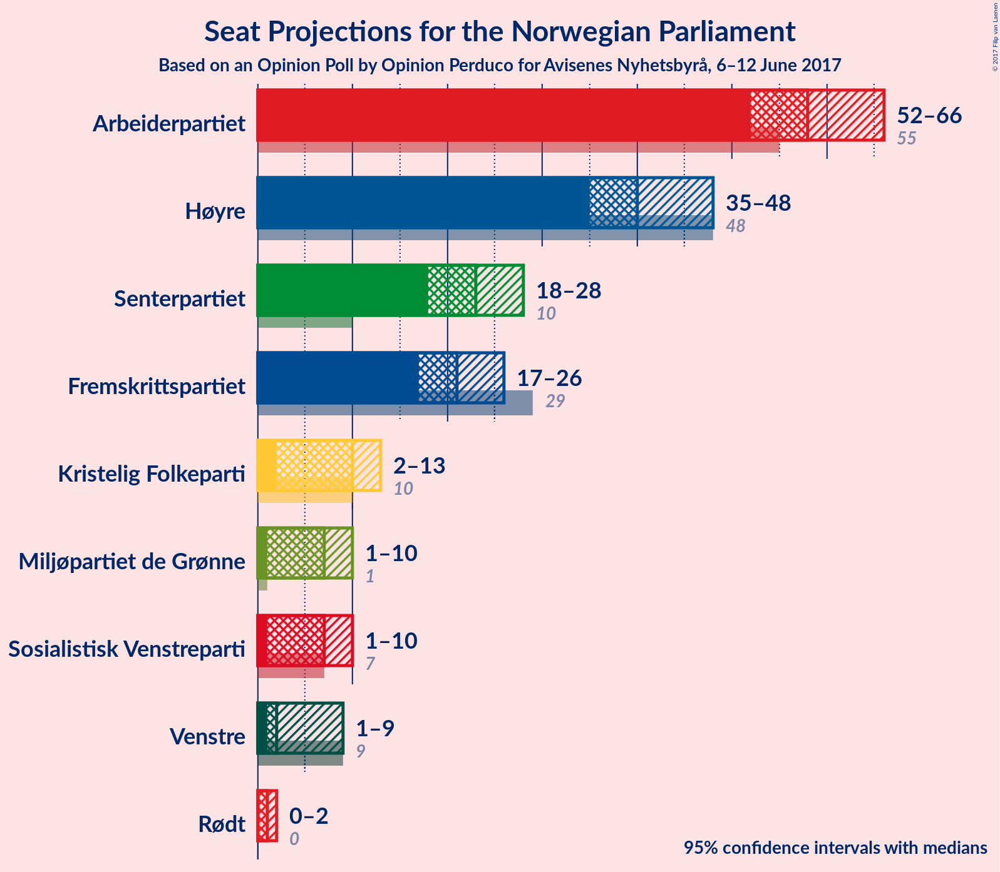

# Opinion Poll by Opinion Perduco for Avisenes Nyhetsbyrå, 6–12 June 2017

<a href="#voting-intentions">Voting Intentions</a> | <a href="#seats">Seats</a> | <a href="#coalitions">Coalitions</a> | <a href="#technical-information">Technical Information</a>

## Voting Intentions

### Confidence Intervals

| Party | Last Result | Poll Result | 80% Confidence Interval | 90% Confidence Interval | 95% Confidence Interval | 99% Confidence Interval |
|:-----:|:-----------:|:-----------:|:-----------------------:|:-----------------------:|:-----------------------:|:-----------------------:|
| Arbeiderpartiet | 30.8% | 32.4% | 30.2–34.8% |29.6–35.5% |29.0–36.1% |28.0–37.2% |
| Høyre | 26.8% | 23.0% | 21.0–25.1% |20.4–25.8% |19.9–26.3% |19.0–27.4% |
| Senterpartiet | 5.5% | 12.7% | 11.2–14.5% |10.8–15.0% |10.4–15.5% |9.7–16.4% |
| Fremskrittspartiet | 16.3% | 12.0% | 10.5–13.7% |10.1–14.2% |9.8–14.7% |9.1–15.5% |
| Kristelig Folkeparti | 5.6% | 5.3% | 4.4–6.6% |4.1–7.0% |3.9–7.3% |3.5–8.0% |
| Sosialistisk Venstreparti | 4.1% | 4.1% | 3.3–5.3% |3.1–5.6% |2.9–5.9% |2.5–6.5% |
| Miljøpartiet de Grønne | 2.8% | 3.9% | 3.0–5.0% |2.8–5.3% |2.6–5.6% |2.3–6.2% |
| Venstre | 5.2% | 3.6% | 2.8–4.6% |2.6–5.0% |2.4–5.2% |2.1–5.8% |
| Rødt | 1.1% | 1.6% | 1.2–2.5% |1.0–2.7% |0.9–2.9% |0.7–3.4% |

*Note:* The poll result column reflects the actual value used in the calculations. Published results may vary slightly, and in addition be rounded to fewer digits.

## Seats

### Confidence Intervals

| Party | Last Result | Median | 80% Confidence Interval | 90% Confidence Interval | 95% Confidence Interval | 99% Confidence Interval |
|:-----:|:-----------:|:------:|:-----------------------:|:-----------------------:|:-----------------------:|:-----------------------:|
| <a href="#arbeiderpartiet">Arbeiderpartiet</a> | 55 | 58 | 54–64 |53–65 |52–66 |50–69 |
| <a href="#høyre">Høyre</a> | 48 | 40 | 37–45 |36–46 |35–48 |33–50 |
| <a href="#senterpartiet">Senterpartiet</a> | 10 | 23 | 20–26 |19–27 |18–28 |17–30 |
| <a href="#fremskrittspartiet">Fremskrittspartiet</a> | 29 | 21 | 19–25 |18–25 |17–26 |16–28 |
| <a href="#kristelig-folkeparti">Kristelig Folkeparti</a> | 10 | 10 | 8–12 |7–12 |2–13 |2–14 |
| <a href="#sosialistisk-venstreparti">Sosialistisk Venstreparti</a> | 7 | 7 | 1–9 |1–10 |1–10 |1–11 |
| <a href="#miljøpartiet-de-grønne">Miljøpartiet de Grønne</a> | 1 | 7 | 1–9 |1–9 |1–10 |1–11 |
| <a href="#venstre">Venstre</a> | 9 | 2 | 1–8 |1–8 |1–9 |0–10 |
| <a href="#rødt">Rødt</a> | 0 | 1 | 0–1 |0–2 |0–2 |0–2 |

### Arbeiderpartiet

| Number of Seats | Probability | Accumulated | Special Marks |
|:---------------:|:-----------:|:-----------:|:-------------:|
| 48 | 0.1% | 100% |  |
| 49 | 0.2% | 99.9% |  |
| 50 | 0.4% | 99.7% |  |
| 51 | 0.6% | 99.3% |  |
| 52 | 2% | 98.7% |  |
| 53 | 3% | 97% |  |
| 54 | 4% | 94% |  |
| 55 | 6% | 90% | Last Result |
| 56 | 11% | 83% |  |
| 57 | 12% | 72% |  |
| 58 | 10% | 60% | Median |
| 59 | 9% | 50% |  |
| 60 | 10% | 41% |  |
| 61 | 8% | 31% |  |
| 62 | 6% | 23% |  |
| 63 | 5% | 17% |  |
| 64 | 5% | 12% |  |
| 65 | 3% | 7% |  |
| 66 | 2% | 4% |  |
| 67 | 0.9% | 2% |  |
| 68 | 0.5% | 1.3% |  |
| 69 | 0.5% | 0.7% |  |
| 70 | 0.2% | 0.2% |  |
| 71 | 0% | 0.1% |  |
| 72 | 0% | 0% |  |

### Høyre

| Number of Seats | Probability | Accumulated | Special Marks |
|:---------------:|:-----------:|:-----------:|:-------------:|
| 32 | 0.1% | 100% |  |
| 33 | 0.4% | 99.8% |  |
| 34 | 1.0% | 99.5% |  |
| 35 | 2% | 98% |  |
| 36 | 4% | 97% |  |
| 37 | 8% | 93% |  |
| 38 | 10% | 85% |  |
| 39 | 12% | 75% |  |
| 40 | 13% | 63% | Median |
| 41 | 8% | 50% |  |
| 42 | 11% | 42% |  |
| 43 | 10% | 31% |  |
| 44 | 8% | 21% |  |
| 45 | 5% | 14% |  |
| 46 | 4% | 9% |  |
| 47 | 2% | 5% |  |
| 48 | 1.1% | 3% | Last Result |
| 49 | 0.9% | 2% |  |
| 50 | 0.4% | 0.8% |  |
| 51 | 0.2% | 0.4% |  |
| 52 | 0.1% | 0.1% |  |
| 53 | 0% | 0.1% |  |
| 54 | 0% | 0% |  |

### Senterpartiet

| Number of Seats | Probability | Accumulated | Special Marks |
|:---------------:|:-----------:|:-----------:|:-------------:|
| 10 | 0% | 100% | Last Result |
| 11 | 0% | 100% |  |
| 12 | 0% | 100% |  |
| 13 | 0% | 100% |  |
| 14 | 0% | 100% |  |
| 15 | 0% | 100% |  |
| 16 | 0.2% | 99.9% |  |
| 17 | 0.6% | 99.7% |  |
| 18 | 3% | 99.1% |  |
| 19 | 3% | 96% |  |
| 20 | 9% | 93% |  |
| 21 | 10% | 84% |  |
| 22 | 14% | 74% |  |
| 23 | 20% | 60% | Median |
| 24 | 14% | 40% |  |
| 25 | 12% | 26% |  |
| 26 | 6% | 14% |  |
| 27 | 5% | 8% |  |
| 28 | 1.4% | 3% |  |
| 29 | 0.9% | 1.4% |  |
| 30 | 0.4% | 0.5% |  |
| 31 | 0.1% | 0.2% |  |
| 32 | 0% | 0% |  |

### Fremskrittspartiet

| Number of Seats | Probability | Accumulated | Special Marks |
|:---------------:|:-----------:|:-----------:|:-------------:|
| 14 | 0% | 100% |  |
| 15 | 0.2% | 99.9% |  |
| 16 | 0.8% | 99.7% |  |
| 17 | 2% | 99.0% |  |
| 18 | 6% | 97% |  |
| 19 | 9% | 90% |  |
| 20 | 18% | 82% |  |
| 21 | 17% | 64% | Median |
| 22 | 16% | 47% |  |
| 23 | 12% | 31% |  |
| 24 | 8% | 19% |  |
| 25 | 5% | 10% |  |
| 26 | 2% | 5% |  |
| 27 | 1.2% | 2% |  |
| 28 | 0.9% | 1.2% |  |
| 29 | 0.2% | 0.3% | Last Result |
| 30 | 0.1% | 0.1% |  |
| 31 | 0% | 0% |  |

### Kristelig Folkeparti

| Number of Seats | Probability | Accumulated | Special Marks |
|:---------------:|:-----------:|:-----------:|:-------------:|
| 1 | 0.1% | 100% |  |
| 2 | 4% | 99.9% |  |
| 3 | 0.1% | 96% |  |
| 4 | 0% | 96% |  |
| 5 | 0% | 96% |  |
| 6 | 0% | 96% |  |
| 7 | 3% | 96% |  |
| 8 | 15% | 93% |  |
| 9 | 27% | 78% |  |
| 10 | 18% | 51% | Last Result, Median |
| 11 | 18% | 33% |  |
| 12 | 11% | 15% |  |
| 13 | 3% | 4% |  |
| 14 | 1.2% | 2% |  |
| 15 | 0.3% | 0.4% |  |
| 16 | 0.1% | 0.1% |  |
| 17 | 0% | 0% |  |

### Sosialistisk Venstreparti

| Number of Seats | Probability | Accumulated | Special Marks |
|:---------------:|:-----------:|:-----------:|:-------------:|
| 0 | 0.1% | 100% |  |
| 1 | 21% | 99.9% |  |
| 2 | 17% | 79% |  |
| 3 | 0% | 61% |  |
| 4 | 0% | 61% |  |
| 5 | 0% | 61% |  |
| 6 | 0% | 61% |  |
| 7 | 12% | 61% | Last Result, Median |
| 8 | 26% | 49% |  |
| 9 | 16% | 23% |  |
| 10 | 5% | 8% |  |
| 11 | 2% | 2% |  |
| 12 | 0.4% | 0.5% |  |
| 13 | 0.1% | 0.1% |  |
| 14 | 0% | 0% |  |

### Miljøpartiet de Grønne

| Number of Seats | Probability | Accumulated | Special Marks |
|:---------------:|:-----------:|:-----------:|:-------------:|
| 1 | 28% | 100% | Last Result |
| 2 | 5% | 72% |  |
| 3 | 9% | 67% |  |
| 4 | 8% | 58% |  |
| 5 | 0% | 51% |  |
| 6 | 0% | 51% |  |
| 7 | 20% | 51% | Median |
| 8 | 19% | 31% |  |
| 9 | 9% | 12% |  |
| 10 | 2% | 3% |  |
| 11 | 0.6% | 0.8% |  |
| 12 | 0.2% | 0.2% |  |
| 13 | 0% | 0% |  |

### Venstre

| Number of Seats | Probability | Accumulated | Special Marks |
|:---------------:|:-----------:|:-----------:|:-------------:|
| 0 | 1.1% | 100% |  |
| 1 | 19% | 98.9% |  |
| 2 | 41% | 80% | Median |
| 3 | 7% | 39% |  |
| 4 | 0% | 32% |  |
| 5 | 0% | 32% |  |
| 6 | 0% | 32% |  |
| 7 | 16% | 32% |  |
| 8 | 12% | 16% |  |
| 9 | 3% | 4% | Last Result |
| 10 | 0.8% | 1.1% |  |
| 11 | 0.2% | 0.2% |  |
| 12 | 0% | 0% |  |

### Rødt

| Number of Seats | Probability | Accumulated | Special Marks |
|:---------------:|:-----------:|:-----------:|:-------------:|
| 0 | 12% | 100% | Last Result |
| 1 | 81% | 88% | Median |
| 2 | 7% | 7% |  |
| 3 | 0% | 0% |  |

## Coalitions

### Confidence Intervals

| Coalition | Last Result | Median | 80% Confidence Interval | 90% Confidence Interval | 95% Confidence Interval | 99% Confidence Interval |
|:---------:|:-----------:|:------:|:-----------------------:|:-----------------------:|:-----------------------:|:-----------------------:|
| Arbeiderpartiet – Senterpartiet – Kristelig Folkeparti – Sosialistisk Venstreparti – Miljøpartiet de Grønne | 83 | 102 | 96–108 | 95–109 | 93–110 | 90–112 |
| Høyre – Senterpartiet – Fremskrittspartiet – Kristelig Folkeparti – Venstre | 106 | 99 | 92–105 | 90–106 | 89–107 | 86–111 |
| Arbeiderpartiet – Senterpartiet – Sosialistisk Venstreparti – Miljøpartiet de Grønne – Rødt | 73 | 93 | 88–99 | 85–101 | 85–102 | 82–105 |
| Arbeiderpartiet – Senterpartiet – Sosialistisk Venstreparti – Miljøpartiet de Grønne | 73 | 92 | 87–98 | 84–100 | 84–101 | 81–104 |
| Arbeiderpartiet – Senterpartiet – Sosialistisk Venstreparti – Rødt | 72 | 88 | 82–95 | 81–96 | 79–97 | 77–99 |
| Arbeiderpartiet – Senterpartiet – Sosialistisk Venstreparti | 72 | 88 | 81–94 | 80–95 | 78–96 | 76–98 |
| Arbeiderpartiet – Senterpartiet | 65 | 82 | 76–87 | 75–89 | 74–90 | 72–93 |
| Høyre – Fremskrittspartiet – Kristelig Folkeparti – Miljøpartiet de Grønne – Venstre | 97 | 81 | 74–87 | 73–88 | 72–90 | 70–92 |
| Høyre – Fremskrittspartiet – Kristelig Folkeparti – Venstre | 96 | 76 | 70–81 | 68–84 | 67–84 | 64–87 |
| Arbeiderpartiet – Sosialistisk Venstreparti | 62 | 64 | 58–71 | 57–72 | 56–74 | 54–75 |
| Høyre – Fremskrittspartiet | 77 | 62 | 57–68 | 56–69 | 55–71 | 53–73 |
| Høyre – Kristelig Folkeparti – Venstre | 67 | 54 | 49–60 | 48–61 | 47–62 | 43–65 |
| Senterpartiet – Kristelig Folkeparti – Venstre | 29 | 36 | 31–40 | 30–42 | 29–43 | 25–46 |

### Arbeiderpartiet – Senterpartiet – Kristelig Folkeparti – Sosialistisk Venstreparti – Miljøpartiet de Grønne

| Number of Seats | Probability | Accumulated | Special Marks |
|:---------------:|:-----------:|:-----------:|:-------------:|
| 83 | 0% | 100% | Last Result |
| 84 | 0% | 100% |  |
| 85 | 0% | 100% | Majority |
| 86 | 0% | 100% |  |
| 87 | 0% | 100% |  |
| 88 | 0.1% | 99.9% |  |
| 89 | 0.3% | 99.9% |  |
| 90 | 0.1% | 99.6% |  |
| 91 | 0.4% | 99.5% |  |
| 92 | 0.6% | 99.1% |  |
| 93 | 2% | 98.5% |  |
| 94 | 1.0% | 96% |  |
| 95 | 2% | 95% |  |
| 96 | 4% | 93% |  |
| 97 | 6% | 88% |  |
| 98 | 5% | 83% |  |
| 99 | 6% | 77% |  |
| 100 | 6% | 72% |  |
| 101 | 10% | 66% |  |
| 102 | 7% | 56% |  |
| 103 | 9% | 49% |  |
| 104 | 11% | 40% |  |
| 105 | 5% | 29% | Median |
| 106 | 9% | 24% |  |
| 107 | 4% | 14% |  |
| 108 | 5% | 10% |  |
| 109 | 3% | 6% |  |
| 110 | 0.9% | 3% |  |
| 111 | 0.5% | 2% |  |
| 112 | 0.8% | 1.2% |  |
| 113 | 0.2% | 0.4% |  |
| 114 | 0.1% | 0.1% |  |
| 115 | 0% | 0.1% |  |
| 116 | 0% | 0% |  |

### Høyre – Senterpartiet – Fremskrittspartiet – Kristelig Folkeparti – Venstre

| Number of Seats | Probability | Accumulated | Special Marks |
|:---------------:|:-----------:|:-----------:|:-------------:|
| 85 | 0.1% | 100% | Majority |
| 86 | 0.6% | 99.9% |  |
| 87 | 0.7% | 99.2% |  |
| 88 | 1.0% | 98.6% |  |
| 89 | 1.0% | 98% |  |
| 90 | 2% | 97% |  |
| 91 | 2% | 95% |  |
| 92 | 3% | 92% |  |
| 93 | 2% | 89% |  |
| 94 | 5% | 87% |  |
| 95 | 6% | 82% |  |
| 96 | 5% | 76% | Median |
| 97 | 9% | 70% |  |
| 98 | 8% | 61% |  |
| 99 | 12% | 53% |  |
| 100 | 10% | 41% |  |
| 101 | 6% | 31% |  |
| 102 | 4% | 25% |  |
| 103 | 7% | 21% |  |
| 104 | 4% | 14% |  |
| 105 | 2% | 10% |  |
| 106 | 3% | 8% | Last Result |
| 107 | 2% | 5% |  |
| 108 | 0.7% | 2% |  |
| 109 | 0.4% | 2% |  |
| 110 | 0.5% | 1.2% |  |
| 111 | 0.4% | 0.7% |  |
| 112 | 0.1% | 0.3% |  |
| 113 | 0.1% | 0.2% |  |
| 114 | 0.1% | 0.1% |  |
| 115 | 0% | 0% |  |

### Arbeiderpartiet – Senterpartiet – Sosialistisk Venstreparti – Miljøpartiet de Grønne – Rødt

| Number of Seats | Probability | Accumulated | Special Marks |
|:---------------:|:-----------:|:-----------:|:-------------:|
| 73 | 0% | 100% | Last Result |
| 74 | 0% | 100% |  |
| 75 | 0% | 100% |  |
| 76 | 0% | 100% |  |
| 77 | 0% | 100% |  |
| 78 | 0% | 100% |  |
| 79 | 0.2% | 100% |  |
| 80 | 0.1% | 99.8% |  |
| 81 | 0.2% | 99.7% |  |
| 82 | 0.4% | 99.6% |  |
| 83 | 0.3% | 99.2% |  |
| 84 | 1.2% | 98.8% |  |
| 85 | 3% | 98% | Majority |
| 86 | 2% | 94% |  |
| 87 | 2% | 92% |  |
| 88 | 4% | 90% |  |
| 89 | 7% | 87% |  |
| 90 | 4% | 79% |  |
| 91 | 8% | 75% |  |
| 92 | 11% | 67% |  |
| 93 | 9% | 57% |  |
| 94 | 8% | 48% |  |
| 95 | 7% | 40% |  |
| 96 | 6% | 33% | Median |
| 97 | 8% | 28% |  |
| 98 | 5% | 19% |  |
| 99 | 6% | 14% |  |
| 100 | 3% | 8% |  |
| 101 | 3% | 5% |  |
| 102 | 0.5% | 3% |  |
| 103 | 0.7% | 2% |  |
| 104 | 0.8% | 1.3% |  |
| 105 | 0.2% | 0.6% |  |
| 106 | 0.2% | 0.3% |  |
| 107 | 0.1% | 0.2% |  |
| 108 | 0% | 0% |  |

### Arbeiderpartiet – Senterpartiet – Sosialistisk Venstreparti – Miljøpartiet de Grønne

| Number of Seats | Probability | Accumulated | Special Marks |
|:---------------:|:-----------:|:-----------:|:-------------:|
| 73 | 0% | 100% | Last Result |
| 74 | 0% | 100% |  |
| 75 | 0% | 100% |  |
| 76 | 0% | 100% |  |
| 77 | 0% | 100% |  |
| 78 | 0.1% | 99.9% |  |
| 79 | 0.1% | 99.8% |  |
| 80 | 0.1% | 99.7% |  |
| 81 | 0.4% | 99.6% |  |
| 82 | 0.2% | 99.2% |  |
| 83 | 1.3% | 98.9% |  |
| 84 | 3% | 98% |  |
| 85 | 2% | 95% | Majority |
| 86 | 2% | 92% |  |
| 87 | 4% | 91% |  |
| 88 | 7% | 87% |  |
| 89 | 5% | 79% |  |
| 90 | 8% | 75% |  |
| 91 | 8% | 67% |  |
| 92 | 11% | 59% |  |
| 93 | 8% | 48% |  |
| 94 | 6% | 40% |  |
| 95 | 6% | 34% | Median |
| 96 | 8% | 27% |  |
| 97 | 6% | 20% |  |
| 98 | 5% | 14% |  |
| 99 | 3% | 9% |  |
| 100 | 3% | 5% |  |
| 101 | 0.8% | 3% |  |
| 102 | 0.7% | 2% |  |
| 103 | 0.8% | 1.3% |  |
| 104 | 0.2% | 0.6% |  |
| 105 | 0.2% | 0.4% |  |
| 106 | 0.1% | 0.2% |  |
| 107 | 0% | 0% |  |

### Arbeiderpartiet – Senterpartiet – Sosialistisk Venstreparti – Rødt

| Number of Seats | Probability | Accumulated | Special Marks |
|:---------------:|:-----------:|:-----------:|:-------------:|
| 72 | 0% | 100% | Last Result |
| 73 | 0% | 100% |  |
| 74 | 0% | 100% |  |
| 75 | 0.1% | 99.9% |  |
| 76 | 0.2% | 99.8% |  |
| 77 | 0.2% | 99.6% |  |
| 78 | 2% | 99.4% |  |
| 79 | 0.5% | 98% |  |
| 80 | 0.8% | 97% |  |
| 81 | 2% | 96% |  |
| 82 | 5% | 94% |  |
| 83 | 4% | 89% |  |
| 84 | 4% | 85% |  |
| 85 | 9% | 80% | Majority |
| 86 | 6% | 71% |  |
| 87 | 6% | 65% |  |
| 88 | 9% | 59% |  |
| 89 | 7% | 50% | Median |
| 90 | 8% | 43% |  |
| 91 | 8% | 34% |  |
| 92 | 7% | 26% |  |
| 93 | 5% | 19% |  |
| 94 | 3% | 14% |  |
| 95 | 3% | 10% |  |
| 96 | 4% | 7% |  |
| 97 | 2% | 3% |  |
| 98 | 1.0% | 2% |  |
| 99 | 0.4% | 0.7% |  |
| 100 | 0.2% | 0.4% |  |
| 101 | 0.1% | 0.2% |  |
| 102 | 0.1% | 0.1% |  |
| 103 | 0% | 0.1% |  |
| 104 | 0% | 0% |  |

### Arbeiderpartiet – Senterpartiet – Sosialistisk Venstreparti

| Number of Seats | Probability | Accumulated | Special Marks |
|:---------------:|:-----------:|:-----------:|:-------------:|
| 72 | 0% | 100% | Last Result |
| 73 | 0% | 100% |  |
| 74 | 0.1% | 99.9% |  |
| 75 | 0.1% | 99.8% |  |
| 76 | 0.3% | 99.7% |  |
| 77 | 2% | 99.4% |  |
| 78 | 0.5% | 98% |  |
| 79 | 0.8% | 97% |  |
| 80 | 2% | 96% |  |
| 81 | 5% | 94% |  |
| 82 | 5% | 90% |  |
| 83 | 4% | 84% |  |
| 84 | 7% | 80% |  |
| 85 | 8% | 74% | Majority |
| 86 | 6% | 65% |  |
| 87 | 9% | 59% |  |
| 88 | 7% | 50% | Median |
| 89 | 10% | 43% |  |
| 90 | 7% | 34% |  |
| 91 | 7% | 26% |  |
| 92 | 6% | 19% |  |
| 93 | 2% | 13% |  |
| 94 | 4% | 11% |  |
| 95 | 4% | 7% |  |
| 96 | 2% | 4% |  |
| 97 | 1.0% | 2% |  |
| 98 | 0.3% | 0.7% |  |
| 99 | 0.2% | 0.4% |  |
| 100 | 0.1% | 0.2% |  |
| 101 | 0.1% | 0.1% |  |
| 102 | 0% | 0.1% |  |
| 103 | 0% | 0% |  |

### Arbeiderpartiet – Senterpartiet

| Number of Seats | Probability | Accumulated | Special Marks |
|:---------------:|:-----------:|:-----------:|:-------------:|
| 65 | 0% | 100% | Last Result |
| 66 | 0% | 100% |  |
| 67 | 0% | 100% |  |
| 68 | 0% | 100% |  |
| 69 | 0% | 100% |  |
| 70 | 0.1% | 99.9% |  |
| 71 | 0.2% | 99.9% |  |
| 72 | 0.4% | 99.7% |  |
| 73 | 1.1% | 99.3% |  |
| 74 | 2% | 98% |  |
| 75 | 2% | 97% |  |
| 76 | 4% | 94% |  |
| 77 | 4% | 90% |  |
| 78 | 7% | 86% |  |
| 79 | 7% | 80% |  |
| 80 | 12% | 72% |  |
| 81 | 7% | 61% | Median |
| 82 | 10% | 53% |  |
| 83 | 13% | 43% |  |
| 84 | 6% | 31% |  |
| 85 | 6% | 24% | Majority |
| 86 | 5% | 19% |  |
| 87 | 6% | 14% |  |
| 88 | 2% | 7% |  |
| 89 | 2% | 6% |  |
| 90 | 1.1% | 3% |  |
| 91 | 0.9% | 2% |  |
| 92 | 0.3% | 1.0% |  |
| 93 | 0.5% | 0.7% |  |
| 94 | 0.1% | 0.2% |  |
| 95 | 0% | 0.1% |  |
| 96 | 0% | 0.1% |  |
| 97 | 0% | 0% |  |

### Høyre – Fremskrittspartiet – Kristelig Folkeparti – Miljøpartiet de Grønne – Venstre

| Number of Seats | Probability | Accumulated | Special Marks |
|:---------------:|:-----------:|:-----------:|:-------------:|
| 66 | 0% | 100% |  |
| 67 | 0.1% | 99.9% |  |
| 68 | 0.1% | 99.9% |  |
| 69 | 0.2% | 99.8% |  |
| 70 | 0.4% | 99.6% |  |
| 71 | 1.0% | 99.3% |  |
| 72 | 2% | 98% |  |
| 73 | 4% | 97% |  |
| 74 | 3% | 93% |  |
| 75 | 3% | 90% |  |
| 76 | 5% | 86% |  |
| 77 | 7% | 81% |  |
| 78 | 8% | 74% |  |
| 79 | 8% | 66% |  |
| 80 | 7% | 57% | Median |
| 81 | 9% | 50% |  |
| 82 | 6% | 41% |  |
| 83 | 6% | 35% |  |
| 84 | 9% | 29% |  |
| 85 | 4% | 20% | Majority |
| 86 | 4% | 15% |  |
| 87 | 5% | 11% |  |
| 88 | 2% | 6% |  |
| 89 | 0.8% | 4% |  |
| 90 | 0.5% | 3% |  |
| 91 | 2% | 2% |  |
| 92 | 0.2% | 0.6% |  |
| 93 | 0.2% | 0.4% |  |
| 94 | 0.1% | 0.2% |  |
| 95 | 0% | 0.1% |  |
| 96 | 0% | 0% |  |
| 97 | 0% | 0% | Last Result |

### Høyre – Fremskrittspartiet – Kristelig Folkeparti – Venstre

| Number of Seats | Probability | Accumulated | Special Marks |
|:---------------:|:-----------:|:-----------:|:-------------:|
| 62 | 0.1% | 100% |  |
| 63 | 0.2% | 99.8% |  |
| 64 | 0.2% | 99.7% |  |
| 65 | 0.8% | 99.4% |  |
| 66 | 0.7% | 98.7% |  |
| 67 | 0.5% | 98% |  |
| 68 | 3% | 97% |  |
| 69 | 3% | 95% |  |
| 70 | 6% | 92% |  |
| 71 | 5% | 86% |  |
| 72 | 8% | 81% |  |
| 73 | 6% | 72% | Median |
| 74 | 7% | 67% |  |
| 75 | 8% | 60% |  |
| 76 | 9% | 52% |  |
| 77 | 11% | 43% |  |
| 78 | 8% | 33% |  |
| 79 | 4% | 25% |  |
| 80 | 7% | 21% |  |
| 81 | 4% | 13% |  |
| 82 | 2% | 10% |  |
| 83 | 2% | 8% |  |
| 84 | 3% | 6% |  |
| 85 | 1.2% | 2% | Majority |
| 86 | 0.3% | 1.1% |  |
| 87 | 0.4% | 0.8% |  |
| 88 | 0.2% | 0.4% |  |
| 89 | 0.1% | 0.3% |  |
| 90 | 0.2% | 0.2% |  |
| 91 | 0% | 0% |  |
| 92 | 0% | 0% |  |
| 93 | 0% | 0% |  |
| 94 | 0% | 0% |  |
| 95 | 0% | 0% |  |
| 96 | 0% | 0% | Last Result |

### Arbeiderpartiet – Sosialistisk Venstreparti

| Number of Seats | Probability | Accumulated | Special Marks |
|:---------------:|:-----------:|:-----------:|:-------------:|
| 51 | 0.1% | 100% |  |
| 52 | 0.1% | 99.8% |  |
| 53 | 0.3% | 99.8% |  |
| 54 | 0.2% | 99.5% |  |
| 55 | 0.4% | 99.3% |  |
| 56 | 2% | 98.8% |  |
| 57 | 3% | 97% |  |
| 58 | 5% | 95% |  |
| 59 | 4% | 89% |  |
| 60 | 6% | 85% |  |
| 61 | 6% | 79% |  |
| 62 | 6% | 73% | Last Result |
| 63 | 9% | 67% |  |
| 64 | 10% | 58% |  |
| 65 | 6% | 49% | Median |
| 66 | 9% | 42% |  |
| 67 | 9% | 34% |  |
| 68 | 6% | 25% |  |
| 69 | 5% | 19% |  |
| 70 | 3% | 14% |  |
| 71 | 3% | 10% |  |
| 72 | 3% | 7% |  |
| 73 | 2% | 5% |  |
| 74 | 2% | 3% |  |
| 75 | 0.7% | 1.1% |  |
| 76 | 0.2% | 0.4% |  |
| 77 | 0.1% | 0.2% |  |
| 78 | 0% | 0.1% |  |
| 79 | 0% | 0% |  |

### Høyre – Fremskrittspartiet

| Number of Seats | Probability | Accumulated | Special Marks |
|:---------------:|:-----------:|:-----------:|:-------------:|
| 50 | 0% | 100% |  |
| 51 | 0.1% | 99.9% |  |
| 52 | 0.2% | 99.8% |  |
| 53 | 0.4% | 99.7% |  |
| 54 | 0.9% | 99.2% |  |
| 55 | 3% | 98% |  |
| 56 | 2% | 96% |  |
| 57 | 5% | 94% |  |
| 58 | 5% | 89% |  |
| 59 | 6% | 84% |  |
| 60 | 12% | 78% |  |
| 61 | 9% | 66% | Median |
| 62 | 9% | 57% |  |
| 63 | 11% | 49% |  |
| 64 | 12% | 38% |  |
| 65 | 8% | 26% |  |
| 66 | 4% | 19% |  |
| 67 | 4% | 15% |  |
| 68 | 4% | 11% |  |
| 69 | 2% | 7% |  |
| 70 | 2% | 5% |  |
| 71 | 1.4% | 3% |  |
| 72 | 0.8% | 1.3% |  |
| 73 | 0.2% | 0.6% |  |
| 74 | 0.1% | 0.4% |  |
| 75 | 0.1% | 0.2% |  |
| 76 | 0.1% | 0.2% |  |
| 77 | 0% | 0.1% | Last Result |
| 78 | 0% | 0% |  |

### Høyre – Kristelig Folkeparti – Venstre

| Number of Seats | Probability | Accumulated | Special Marks |
|:---------------:|:-----------:|:-----------:|:-------------:|
| 41 | 0.2% | 100% |  |
| 42 | 0.1% | 99.8% |  |
| 43 | 0.2% | 99.7% |  |
| 44 | 0.3% | 99.5% |  |
| 45 | 0.5% | 99.2% |  |
| 46 | 0.9% | 98.7% |  |
| 47 | 2% | 98% |  |
| 48 | 5% | 96% |  |
| 49 | 7% | 91% |  |
| 50 | 7% | 84% |  |
| 51 | 4% | 77% |  |
| 52 | 9% | 74% | Median |
| 53 | 9% | 65% |  |
| 54 | 11% | 56% |  |
| 55 | 7% | 45% |  |
| 56 | 7% | 38% |  |
| 57 | 9% | 31% |  |
| 58 | 7% | 22% |  |
| 59 | 4% | 15% |  |
| 60 | 3% | 11% |  |
| 61 | 4% | 8% |  |
| 62 | 1.5% | 4% |  |
| 63 | 1.1% | 2% |  |
| 64 | 0.4% | 1.1% |  |
| 65 | 0.3% | 0.7% |  |
| 66 | 0.3% | 0.4% |  |
| 67 | 0.1% | 0.1% | Last Result |
| 68 | 0% | 0.1% |  |
| 69 | 0% | 0% |  |

### Senterpartiet – Kristelig Folkeparti – Venstre

| Number of Seats | Probability | Accumulated | Special Marks |
|:---------------:|:-----------:|:-----------:|:-------------:|
| 23 | 0.1% | 100% |  |
| 24 | 0.1% | 99.9% |  |
| 25 | 0.3% | 99.8% |  |
| 26 | 0.6% | 99.5% |  |
| 27 | 0.4% | 98.9% |  |
| 28 | 1.0% | 98.5% |  |
| 29 | 2% | 98% | Last Result |
| 30 | 2% | 95% |  |
| 31 | 4% | 94% |  |
| 32 | 5% | 89% |  |
| 33 | 5% | 85% |  |
| 34 | 8% | 80% |  |
| 35 | 11% | 71% | Median |
| 36 | 11% | 60% |  |
| 37 | 12% | 49% |  |
| 38 | 10% | 37% |  |
| 39 | 12% | 27% |  |
| 40 | 5% | 15% |  |
| 41 | 2% | 10% |  |
| 42 | 4% | 7% |  |
| 43 | 1.2% | 3% |  |
| 44 | 0.6% | 2% |  |
| 45 | 0.4% | 1.4% |  |
| 46 | 0.5% | 1.0% |  |
| 47 | 0.3% | 0.5% |  |
| 48 | 0.2% | 0.2% |  |
| 49 | 0% | 0% |  |

## Technical Information

### Opinion Poll

+ **Pollster:** Opinion Perduco
+ **Media:** Avisenes Nyhetsbyrå
+ **Fieldwork period:** 6–12 June 2017

### Calculations

+ **Sample size:** 675
+ **Simulations done:** 4,194,304
+ **Error estimate:** 1.34%

