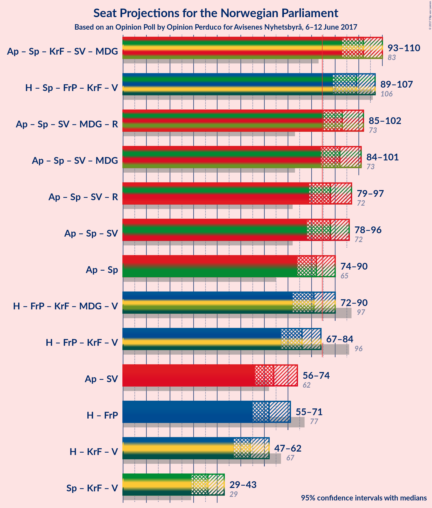

# Opinion Poll by Opinion Perduco for Avisenes Nyhetsbyrå, 6–12 June 2017

<a href="#voting-intentions">Voting Intentions</a> | <a href="#seats">Seats</a> | <a href="#coalitions">Coalitions</a> | <a href="#technical-information">Technical Information</a>

## Voting Intentions

### Confidence Intervals

| Party | Last Result | Poll Result | 80% Confidence Interval | 90% Confidence Interval | 95% Confidence Interval | 99% Confidence Interval |
|:-----:|:-----------:|:-----------:|:-----------------------:|:-----------------------:|:-----------------------:|:-----------------------:|
| Arbeiderpartiet | 30.8% | 32.4% | 30.2–34.8% |29.6–35.5% |29.0–36.1% |28.0–37.2% |
| Høyre | 26.8% | 23.0% | 21.0–25.1% |20.4–25.8% |19.9–26.3% |19.0–27.4% |
| Senterpartiet | 5.5% | 12.7% | 11.2–14.5% |10.8–15.0% |10.4–15.5% |9.7–16.4% |
| Fremskrittspartiet | 16.3% | 12.0% | 10.5–13.7% |10.1–14.2% |9.8–14.7% |9.1–15.5% |
| Kristelig Folkeparti | 5.6% | 5.3% | 4.4–6.6% |4.1–7.0% |3.9–7.3% |3.5–8.0% |
| Sosialistisk Venstreparti | 4.1% | 4.1% | 3.3–5.3% |3.1–5.6% |2.9–5.9% |2.5–6.5% |
| Miljøpartiet de Grønne | 2.8% | 3.9% | 3.0–5.0% |2.8–5.3% |2.6–5.6% |2.3–6.2% |
| Venstre | 5.2% | 3.6% | 2.8–4.6% |2.6–5.0% |2.4–5.2% |2.1–5.8% |
| Rødt | 1.1% | 1.6% | 1.2–2.5% |1.0–2.7% |0.9–2.9% |0.7–3.4% |

*Note:* The poll result column reflects the actual value used in the calculations. Published results may vary slightly, and in addition be rounded to fewer digits.

## Seats

### Confidence Intervals

| Party | Last Result | Median | 80% Confidence Interval | 90% Confidence Interval | 95% Confidence Interval | 99% Confidence Interval |
|:-----:|:-----------:|:------:|:-----------------------:|:-----------------------:|:-----------------------:|:-----------------------:|
| <a href="#arbeiderpartiet">Arbeiderpartiet</a> | 55 | 59 | 54–64 |53–65 |52–66 |50–69 |
| <a href="#høyre">Høyre</a> | 48 | 41 | 37–46 |37–47 |36–49 |33–50 |
| <a href="#senterpartiet">Senterpartiet</a> | 10 | 23 | 20–26 |19–27 |18–28 |17–30 |
| <a href="#fremskrittspartiet">Fremskrittspartiet</a> | 29 | 22 | 19–25 |18–26 |17–26 |16–28 |
| <a href="#kristelig-folkeparti">Kristelig Folkeparti</a> | 10 | 10 | 8–12 |3–12 |2–13 |2–14 |
| <a href="#sosialistisk-venstreparti">Sosialistisk Venstreparti</a> | 7 | 7 | 1–9 |1–10 |1–10 |1–12 |
| <a href="#miljøpartiet-de-grønne">Miljøpartiet de Grønne</a> | 1 | 4 | 1–8 |1–9 |1–9 |1–11 |
| <a href="#venstre">Venstre</a> | 9 | 2 | 1–8 |1–8 |1–9 |0–10 |
| <a href="#rødt">Rødt</a> | 0 | 1 | 0–1 |0–1 |0–2 |0–2 |

### Arbeiderpartiet

| Number of Seats | Probability | Accumulated |
|:---------------:|:-----------:|:-----------:|
| 48 | 0.1% | 100% |
| 49 | 0.1% | 99.9% |
| 50 | 0.5% | 99.8% |
| 51 | 0.7% | 99.3% |
| 52 | 3% | 98.6% |
| 53 | 2% | 96% |
| 54 | 6% | 94% |
| 55 | 7% | 88% |
| 56 | 11% | 80% |
| 57 | 10% | 69% |
| 58 | 8% | 60% |
| 59 | 9% | 51% |
| 60 | 12% | 42% |
| 61 | 7% | 30% |
| 62 | 6% | 23% |
| 63 | 4% | 17% |
| 64 | 6% | 13% |
| 65 | 2% | 7% |
| 66 | 3% | 5% |
| 67 | 0.6% | 2% |
| 68 | 0.5% | 1.4% |
| 69 | 0.8% | 0.9% |
| 70 | 0% | 0.1% |
| 71 | 0% | 0% |

### Høyre

| Number of Seats | Probability | Accumulated |
|:---------------:|:-----------:|:-----------:|
| 32 | 0.2% | 100% |
| 33 | 0.4% | 99.8% |
| 34 | 0.7% | 99.4% |
| 35 | 1.2% | 98.7% |
| 36 | 3% | 98% |
| 37 | 6% | 95% |
| 38 | 9% | 89% |
| 39 | 12% | 80% |
| 40 | 15% | 68% |
| 41 | 8% | 54% |
| 42 | 10% | 45% |
| 43 | 8% | 35% |
| 44 | 8% | 27% |
| 45 | 7% | 19% |
| 46 | 5% | 12% |
| 47 | 3% | 7% |
| 48 | 2% | 5% |
| 49 | 1.5% | 3% |
| 50 | 0.6% | 1.0% |
| 51 | 0.3% | 0.4% |
| 52 | 0% | 0.1% |
| 53 | 0% | 0.1% |
| 54 | 0% | 0% |

### Senterpartiet

| Number of Seats | Probability | Accumulated |
|:---------------:|:-----------:|:-----------:|
| 15 | 0.1% | 100% |
| 16 | 0.2% | 99.9% |
| 17 | 0.8% | 99.7% |
| 18 | 3% | 98.9% |
| 19 | 4% | 96% |
| 20 | 11% | 92% |
| 21 | 8% | 81% |
| 22 | 16% | 73% |
| 23 | 19% | 58% |
| 24 | 14% | 39% |
| 25 | 11% | 25% |
| 26 | 4% | 14% |
| 27 | 7% | 10% |
| 28 | 1.4% | 3% |
| 29 | 0.7% | 1.4% |
| 30 | 0.5% | 0.7% |
| 31 | 0.2% | 0.2% |
| 32 | 0% | 0% |

### Fremskrittspartiet

| Number of Seats | Probability | Accumulated |
|:---------------:|:-----------:|:-----------:|
| 14 | 0.1% | 100% |
| 15 | 0.3% | 99.9% |
| 16 | 0.9% | 99.7% |
| 17 | 2% | 98.8% |
| 18 | 3% | 97% |
| 19 | 5% | 94% |
| 20 | 11% | 89% |
| 21 | 15% | 78% |
| 22 | 19% | 63% |
| 23 | 18% | 44% |
| 24 | 14% | 26% |
| 25 | 6% | 12% |
| 26 | 4% | 5% |
| 27 | 1.2% | 2% |
| 28 | 0.5% | 0.7% |
| 29 | 0.2% | 0.3% |
| 30 | 0.1% | 0.1% |
| 31 | 0% | 0% |

### Kristelig Folkeparti

| Number of Seats | Probability | Accumulated |
|:---------------:|:-----------:|:-----------:|
| 1 | 0.1% | 100% |
| 2 | 5% | 99.9% |
| 3 | 0.2% | 95% |
| 4 | 0% | 95% |
| 5 | 0% | 95% |
| 6 | 0% | 95% |
| 7 | 3% | 95% |
| 8 | 16% | 92% |
| 9 | 23% | 75% |
| 10 | 20% | 52% |
| 11 | 17% | 32% |
| 12 | 11% | 15% |
| 13 | 2% | 4% |
| 14 | 1.0% | 1.3% |
| 15 | 0.3% | 0.3% |
| 16 | 0% | 0% |

### Sosialistisk Venstreparti

| Number of Seats | Probability | Accumulated |
|:---------------:|:-----------:|:-----------:|
| 0 | 0.1% | 100% |
| 1 | 22% | 99.9% |
| 2 | 18% | 78% |
| 3 | 0% | 60% |
| 4 | 0% | 60% |
| 5 | 0% | 60% |
| 6 | 0% | 60% |
| 7 | 12% | 60% |
| 8 | 23% | 48% |
| 9 | 16% | 25% |
| 10 | 7% | 10% |
| 11 | 2% | 2% |
| 12 | 0.5% | 0.6% |
| 13 | 0.1% | 0.1% |
| 14 | 0% | 0% |

### Miljøpartiet de Grønne

| Number of Seats | Probability | Accumulated |
|:---------------:|:-----------:|:-----------:|
| 1 | 30% | 100% |
| 2 | 5% | 70% |
| 3 | 7% | 65% |
| 4 | 8% | 57% |
| 5 | 0% | 49% |
| 6 | 0% | 49% |
| 7 | 18% | 49% |
| 8 | 22% | 31% |
| 9 | 6% | 8% |
| 10 | 2% | 2% |
| 11 | 0.5% | 0.6% |
| 12 | 0.1% | 0.1% |
| 13 | 0% | 0% |

### Venstre

| Number of Seats | Probability | Accumulated |
|:---------------:|:-----------:|:-----------:|
| 0 | 1.4% | 100% |
| 1 | 22% | 98.6% |
| 2 | 50% | 77% |
| 3 | 5% | 27% |
| 4 | 0% | 21% |
| 5 | 0% | 21% |
| 6 | 0% | 21% |
| 7 | 8% | 21% |
| 8 | 9% | 13% |
| 9 | 3% | 4% |
| 10 | 0.8% | 1.1% |
| 11 | 0.2% | 0.3% |
| 12 | 0% | 0.1% |
| 13 | 0% | 0% |

### Rødt

| Number of Seats | Probability | Accumulated |
|:---------------:|:-----------:|:-----------:|
| 0 | 15% | 100% |
| 1 | 80% | 85% |
| 2 | 5% | 5% |
| 3 | 0% | 0% |

## Coalitions

### Confidence Intervals

| Coalition | Last Result | Median | 80% Confidence Interval | 90% Confidence Interval | 95% Confidence Interval | 99% Confidence Interval |
|:---------:|:-----------:|:------:|:-----------------------:|:-----------------------:|:-----------------------:|:-----------------------:|
| Arbeiderpartiet – Senterpartiet – Kristelig Folkeparti – Sosialistisk Venstreparti – Miljøpartiet de Grønne | 83 | 102 | 95–106 | 93–108 | 93–109 | 89–111 |
| Høyre – Senterpartiet – Fremskrittspartiet – Kristelig Folkeparti – Venstre | 106 | 99 | 93–105 | 91–107 | 90–108 | 87–111 |
| Arbeiderpartiet – Senterpartiet – Sosialistisk Venstreparti – Miljøpartiet de Grønne – Rødt | 73 | 93 | 86–99 | 85–100 | 84–101 | 81–105 |
| Arbeiderpartiet – Senterpartiet – Sosialistisk Venstreparti – Miljøpartiet de Grønne | 73 | 92 | 85–98 | 84–99 | 83–100 | 80–104 |
| Arbeiderpartiet – Senterpartiet – Sosialistisk Venstreparti – Rødt | 72 | 88 | 82–95 | 80–96 | 78–97 | 77–100 |
| Arbeiderpartiet – Senterpartiet – Sosialistisk Venstreparti | 72 | 87 | 81–94 | 79–95 | 77–96 | 76–99 |
| Høyre – Fremskrittspartiet – Kristelig Folkeparti – Miljøpartiet de Grønne – Venstre | 97 | 81 | 74–87 | 73–89 | 72–91 | 69–92 |
| Arbeiderpartiet – Senterpartiet | 65 | 82 | 76–87 | 74–89 | 74–90 | 72–93 |
| Høyre – Fremskrittspartiet – Kristelig Folkeparti – Venstre | 96 | 76 | 70–83 | 69–84 | 68–85 | 64–88 |
| Arbeiderpartiet – Sosialistisk Venstreparti | 62 | 64 | 58–71 | 57–72 | 56–74 | 53–75 |
| Høyre – Fremskrittspartiet | 77 | 63 | 59–68 | 57–70 | 55–71 | 53–72 |
| Høyre – Kristelig Folkeparti – Venstre | 67 | 54 | 48–60 | 48–61 | 46–63 | 42–65 |
| Senterpartiet – Kristelig Folkeparti – Venstre | 29 | 35 | 31–39 | 29–41 | 28–43 | 26–46 |

### Arbeiderpartiet – Senterpartiet – Kristelig Folkeparti – Sosialistisk Venstreparti – Miljøpartiet de Grønne

| Number of Seats | Probability | Accumulated |
|:---------------:|:-----------:|:-----------:|
| 87 | 0% | 100% |
| 88 | 0.1% | 99.9% |
| 89 | 0.4% | 99.8% |
| 90 | 0.2% | 99.5% |
| 91 | 0.4% | 99.3% |
| 92 | 0.8% | 98.9% |
| 93 | 4% | 98% |
| 94 | 1.0% | 94% |
| 95 | 3% | 93% |
| 96 | 3% | 90% |
| 97 | 3% | 86% |
| 98 | 5% | 83% |
| 99 | 7% | 78% |
| 100 | 6% | 72% |
| 101 | 12% | 65% |
| 102 | 8% | 54% |
| 103 | 7% | 46% |
| 104 | 12% | 38% |
| 105 | 7% | 26% |
| 106 | 9% | 19% |
| 107 | 3% | 10% |
| 108 | 4% | 6% |
| 109 | 2% | 3% |
| 110 | 0.4% | 1.3% |
| 111 | 0.5% | 0.9% |
| 112 | 0.2% | 0.4% |
| 113 | 0.1% | 0.2% |
| 114 | 0.1% | 0.1% |
| 115 | 0.1% | 0.1% |
| 116 | 0% | 0% |

### Høyre – Senterpartiet – Fremskrittspartiet – Kristelig Folkeparti – Venstre

| Number of Seats | Probability | Accumulated |
|:---------------:|:-----------:|:-----------:|
| 85 | 0.1% | 100% |
| 86 | 0.3% | 99.9% |
| 87 | 0.5% | 99.6% |
| 88 | 0.6% | 99.2% |
| 89 | 0.7% | 98.6% |
| 90 | 1.2% | 98% |
| 91 | 2% | 97% |
| 92 | 3% | 95% |
| 93 | 2% | 92% |
| 94 | 7% | 90% |
| 95 | 5% | 83% |
| 96 | 5% | 78% |
| 97 | 12% | 74% |
| 98 | 8% | 61% |
| 99 | 9% | 53% |
| 100 | 11% | 44% |
| 101 | 7% | 32% |
| 102 | 5% | 25% |
| 103 | 6% | 21% |
| 104 | 4% | 15% |
| 105 | 3% | 11% |
| 106 | 2% | 8% |
| 107 | 3% | 6% |
| 108 | 0.8% | 3% |
| 109 | 0.3% | 2% |
| 110 | 0.4% | 1.5% |
| 111 | 0.7% | 1.1% |
| 112 | 0.1% | 0.3% |
| 113 | 0.1% | 0.2% |
| 114 | 0.1% | 0.1% |
| 115 | 0% | 0% |

### Arbeiderpartiet – Senterpartiet – Sosialistisk Venstreparti – Miljøpartiet de Grønne – Rødt

| Number of Seats | Probability | Accumulated |
|:---------------:|:-----------:|:-----------:|
| 78 | 0% | 100% |
| 79 | 0.2% | 99.9% |
| 80 | 0.1% | 99.7% |
| 81 | 0.2% | 99.6% |
| 82 | 0.4% | 99.4% |
| 83 | 0.3% | 99.1% |
| 84 | 2% | 98.8% |
| 85 | 6% | 97% |
| 86 | 1.3% | 90% |
| 87 | 2% | 89% |
| 88 | 2% | 87% |
| 89 | 5% | 85% |
| 90 | 5% | 80% |
| 91 | 10% | 75% |
| 92 | 12% | 65% |
| 93 | 6% | 53% |
| 94 | 10% | 47% |
| 95 | 6% | 37% |
| 96 | 5% | 30% |
| 97 | 8% | 26% |
| 98 | 5% | 18% |
| 99 | 8% | 13% |
| 100 | 2% | 5% |
| 101 | 2% | 4% |
| 102 | 0.6% | 2% |
| 103 | 0.3% | 1.3% |
| 104 | 0.3% | 1.0% |
| 105 | 0.4% | 0.7% |
| 106 | 0.1% | 0.3% |
| 107 | 0.2% | 0.2% |
| 108 | 0% | 0% |

### Arbeiderpartiet – Senterpartiet – Sosialistisk Venstreparti – Miljøpartiet de Grønne

| Number of Seats | Probability | Accumulated |
|:---------------:|:-----------:|:-----------:|
| 77 | 0% | 100% |
| 78 | 0.1% | 99.9% |
| 79 | 0.2% | 99.8% |
| 80 | 0.2% | 99.7% |
| 81 | 0.4% | 99.5% |
| 82 | 0.3% | 99.1% |
| 83 | 2% | 98.8% |
| 84 | 5% | 97% |
| 85 | 2% | 92% |
| 86 | 2% | 89% |
| 87 | 2% | 87% |
| 88 | 5% | 85% |
| 89 | 5% | 80% |
| 90 | 9% | 75% |
| 91 | 9% | 66% |
| 92 | 10% | 58% |
| 93 | 10% | 47% |
| 94 | 6% | 37% |
| 95 | 5% | 31% |
| 96 | 8% | 26% |
| 97 | 6% | 18% |
| 98 | 6% | 13% |
| 99 | 3% | 6% |
| 100 | 2% | 4% |
| 101 | 0.6% | 2% |
| 102 | 0.4% | 1.5% |
| 103 | 0.3% | 1.0% |
| 104 | 0.3% | 0.7% |
| 105 | 0.2% | 0.4% |
| 106 | 0.2% | 0.2% |
| 107 | 0% | 0% |

### Arbeiderpartiet – Senterpartiet – Sosialistisk Venstreparti – Rødt

| Number of Seats | Probability | Accumulated |
|:---------------:|:-----------:|:-----------:|
| 74 | 0% | 100% |
| 75 | 0.2% | 99.9% |
| 76 | 0.2% | 99.8% |
| 77 | 0.2% | 99.5% |
| 78 | 3% | 99.4% |
| 79 | 0.5% | 96% |
| 80 | 0.8% | 96% |
| 81 | 2% | 95% |
| 82 | 5% | 93% |
| 83 | 6% | 87% |
| 84 | 4% | 81% |
| 85 | 11% | 78% |
| 86 | 7% | 67% |
| 87 | 5% | 60% |
| 88 | 8% | 55% |
| 89 | 5% | 47% |
| 90 | 9% | 42% |
| 91 | 5% | 33% |
| 92 | 8% | 29% |
| 93 | 6% | 21% |
| 94 | 3% | 15% |
| 95 | 4% | 12% |
| 96 | 5% | 9% |
| 97 | 1.2% | 4% |
| 98 | 1.5% | 2% |
| 99 | 0.2% | 0.8% |
| 100 | 0.3% | 0.6% |
| 101 | 0.1% | 0.3% |
| 102 | 0.1% | 0.2% |
| 103 | 0.1% | 0.1% |
| 104 | 0% | 0% |

### Arbeiderpartiet – Senterpartiet – Sosialistisk Venstreparti

| Number of Seats | Probability | Accumulated |
|:---------------:|:-----------:|:-----------:|
| 73 | 0.1% | 100% |
| 74 | 0.2% | 99.9% |
| 75 | 0.1% | 99.8% |
| 76 | 0.3% | 99.7% |
| 77 | 3% | 99.4% |
| 78 | 0.5% | 96% |
| 79 | 0.8% | 96% |
| 80 | 2% | 95% |
| 81 | 4% | 93% |
| 82 | 7% | 89% |
| 83 | 3% | 82% |
| 84 | 6% | 78% |
| 85 | 11% | 72% |
| 86 | 5% | 61% |
| 87 | 8% | 56% |
| 88 | 6% | 48% |
| 89 | 9% | 42% |
| 90 | 5% | 33% |
| 91 | 6% | 28% |
| 92 | 7% | 22% |
| 93 | 2% | 15% |
| 94 | 4% | 13% |
| 95 | 5% | 9% |
| 96 | 2% | 4% |
| 97 | 1.5% | 2% |
| 98 | 0.2% | 0.9% |
| 99 | 0.4% | 0.6% |
| 100 | 0.1% | 0.3% |
| 101 | 0.1% | 0.2% |
| 102 | 0.1% | 0.1% |
| 103 | 0% | 0% |

### Høyre – Fremskrittspartiet – Kristelig Folkeparti – Miljøpartiet de Grønne – Venstre

| Number of Seats | Probability | Accumulated |
|:---------------:|:-----------:|:-----------:|
| 66 | 0.1% | 100% |
| 67 | 0.1% | 99.9% |
| 68 | 0.1% | 99.8% |
| 69 | 0.3% | 99.7% |
| 70 | 0.2% | 99.4% |
| 71 | 1.5% | 99.2% |
| 72 | 1.2% | 98% |
| 73 | 5% | 96% |
| 74 | 4% | 91% |
| 75 | 3% | 88% |
| 76 | 6% | 85% |
| 77 | 8% | 79% |
| 78 | 5% | 71% |
| 79 | 9% | 67% |
| 80 | 5% | 58% |
| 81 | 8% | 53% |
| 82 | 5% | 45% |
| 83 | 7% | 40% |
| 84 | 11% | 33% |
| 85 | 4% | 22% |
| 86 | 6% | 19% |
| 87 | 5% | 13% |
| 88 | 2% | 7% |
| 89 | 0.8% | 5% |
| 90 | 0.5% | 4% |
| 91 | 3% | 4% |
| 92 | 0.2% | 0.6% |
| 93 | 0.2% | 0.5% |
| 94 | 0.2% | 0.2% |
| 95 | 0% | 0.1% |
| 96 | 0% | 0% |

### Arbeiderpartiet – Senterpartiet

| Number of Seats | Probability | Accumulated |
|:---------------:|:-----------:|:-----------:|
| 69 | 0.1% | 100% |
| 70 | 0.1% | 99.9% |
| 71 | 0.1% | 99.9% |
| 72 | 0.4% | 99.7% |
| 73 | 2% | 99.3% |
| 74 | 3% | 98% |
| 75 | 3% | 95% |
| 76 | 4% | 92% |
| 77 | 3% | 87% |
| 78 | 9% | 85% |
| 79 | 8% | 75% |
| 80 | 8% | 67% |
| 81 | 6% | 59% |
| 82 | 7% | 53% |
| 83 | 14% | 46% |
| 84 | 7% | 32% |
| 85 | 5% | 25% |
| 86 | 5% | 20% |
| 87 | 8% | 15% |
| 88 | 1.3% | 7% |
| 89 | 2% | 6% |
| 90 | 1.4% | 3% |
| 91 | 1.1% | 2% |
| 92 | 0.2% | 1.1% |
| 93 | 0.6% | 0.9% |
| 94 | 0.2% | 0.3% |
| 95 | 0% | 0.1% |
| 96 | 0% | 0% |

### Høyre – Fremskrittspartiet – Kristelig Folkeparti – Venstre

| Number of Seats | Probability | Accumulated |
|:---------------:|:-----------:|:-----------:|
| 62 | 0.2% | 100% |
| 63 | 0.1% | 99.8% |
| 64 | 0.4% | 99.7% |
| 65 | 0.3% | 99.3% |
| 66 | 0.3% | 99.0% |
| 67 | 0.6% | 98.7% |
| 68 | 2% | 98% |
| 69 | 2% | 96% |
| 70 | 8% | 95% |
| 71 | 5% | 87% |
| 72 | 8% | 82% |
| 73 | 5% | 74% |
| 74 | 6% | 70% |
| 75 | 10% | 63% |
| 76 | 6% | 53% |
| 77 | 12% | 47% |
| 78 | 10% | 35% |
| 79 | 5% | 25% |
| 80 | 5% | 20% |
| 81 | 2% | 15% |
| 82 | 2% | 13% |
| 83 | 1.3% | 11% |
| 84 | 6% | 10% |
| 85 | 2% | 3% |
| 86 | 0.3% | 1.2% |
| 87 | 0.4% | 0.9% |
| 88 | 0.2% | 0.6% |
| 89 | 0.1% | 0.4% |
| 90 | 0.2% | 0.3% |
| 91 | 0% | 0.1% |
| 92 | 0% | 0% |

### Arbeiderpartiet – Sosialistisk Venstreparti

| Number of Seats | Probability | Accumulated |
|:---------------:|:-----------:|:-----------:|
| 51 | 0.2% | 100% |
| 52 | 0.1% | 99.8% |
| 53 | 0.2% | 99.7% |
| 54 | 0.2% | 99.5% |
| 55 | 0.5% | 99.2% |
| 56 | 2% | 98.8% |
| 57 | 4% | 97% |
| 58 | 4% | 93% |
| 59 | 3% | 89% |
| 60 | 6% | 86% |
| 61 | 6% | 80% |
| 62 | 8% | 74% |
| 63 | 11% | 66% |
| 64 | 10% | 55% |
| 65 | 6% | 45% |
| 66 | 6% | 39% |
| 67 | 8% | 34% |
| 68 | 6% | 26% |
| 69 | 5% | 19% |
| 70 | 4% | 14% |
| 71 | 2% | 10% |
| 72 | 4% | 8% |
| 73 | 2% | 4% |
| 74 | 1.4% | 3% |
| 75 | 0.7% | 1.2% |
| 76 | 0.3% | 0.5% |
| 77 | 0.1% | 0.2% |
| 78 | 0% | 0.1% |
| 79 | 0% | 0% |

### Høyre – Fremskrittspartiet

| Number of Seats | Probability | Accumulated |
|:---------------:|:-----------:|:-----------:|
| 50 | 0.1% | 100% |
| 51 | 0.2% | 99.9% |
| 52 | 0.2% | 99.7% |
| 53 | 0.6% | 99.5% |
| 54 | 0.9% | 98.9% |
| 55 | 1.2% | 98% |
| 56 | 1.3% | 97% |
| 57 | 1.3% | 95% |
| 58 | 3% | 94% |
| 59 | 3% | 91% |
| 60 | 9% | 89% |
| 61 | 7% | 80% |
| 62 | 11% | 72% |
| 63 | 11% | 61% |
| 64 | 10% | 49% |
| 65 | 13% | 40% |
| 66 | 6% | 27% |
| 67 | 7% | 21% |
| 68 | 6% | 14% |
| 69 | 2% | 8% |
| 70 | 3% | 6% |
| 71 | 2% | 3% |
| 72 | 0.5% | 0.8% |
| 73 | 0.1% | 0.3% |
| 74 | 0.1% | 0.2% |
| 75 | 0% | 0.2% |
| 76 | 0.1% | 0.1% |
| 77 | 0% | 0% |

### Høyre – Kristelig Folkeparti – Venstre

| Number of Seats | Probability | Accumulated |
|:---------------:|:-----------:|:-----------:|
| 40 | 0.1% | 100% |
| 41 | 0.3% | 99.9% |
| 42 | 0.2% | 99.7% |
| 43 | 0.2% | 99.5% |
| 44 | 0.3% | 99.2% |
| 45 | 0.6% | 98.9% |
| 46 | 1.4% | 98% |
| 47 | 1.2% | 97% |
| 48 | 6% | 96% |
| 49 | 7% | 90% |
| 50 | 9% | 82% |
| 51 | 4% | 73% |
| 52 | 6% | 69% |
| 53 | 8% | 63% |
| 54 | 16% | 55% |
| 55 | 5% | 39% |
| 56 | 5% | 33% |
| 57 | 6% | 28% |
| 58 | 6% | 22% |
| 59 | 4% | 16% |
| 60 | 5% | 12% |
| 61 | 3% | 8% |
| 62 | 2% | 5% |
| 63 | 2% | 3% |
| 64 | 0.5% | 1.1% |
| 65 | 0.3% | 0.6% |
| 66 | 0.3% | 0.4% |
| 67 | 0.1% | 0.1% |
| 68 | 0% | 0.1% |
| 69 | 0% | 0% |

### Senterpartiet – Kristelig Folkeparti – Venstre

| Number of Seats | Probability | Accumulated |
|:---------------:|:-----------:|:-----------:|
| 23 | 0.1% | 100% |
| 24 | 0.1% | 99.8% |
| 25 | 0.1% | 99.8% |
| 26 | 0.8% | 99.6% |
| 27 | 0.3% | 98.9% |
| 28 | 1.1% | 98.5% |
| 29 | 3% | 97% |
| 30 | 3% | 94% |
| 31 | 4% | 92% |
| 32 | 4% | 87% |
| 33 | 6% | 83% |
| 34 | 13% | 78% |
| 35 | 15% | 64% |
| 36 | 13% | 50% |
| 37 | 13% | 36% |
| 38 | 9% | 23% |
| 39 | 6% | 15% |
| 40 | 2% | 9% |
| 41 | 2% | 6% |
| 42 | 1.3% | 4% |
| 43 | 0.8% | 3% |
| 44 | 0.5% | 2% |
| 45 | 0.4% | 1.4% |
| 46 | 0.7% | 1.0% |
| 47 | 0.2% | 0.3% |
| 48 | 0% | 0.1% |
| 49 | 0% | 0.1% |
| 50 | 0% | 0% |

## Technical Information

### Opinion Poll

+ **Pollster:** Opinion Perduco
+ **Media:** Avisenes Nyhetsbyrå
+ **Fieldwork period:** 6–12 June 2017

### Calculations

+ **Sample size:** 675
+ **Simulations done:** 2,097,152
+ **Error estimate:** 2.67%

