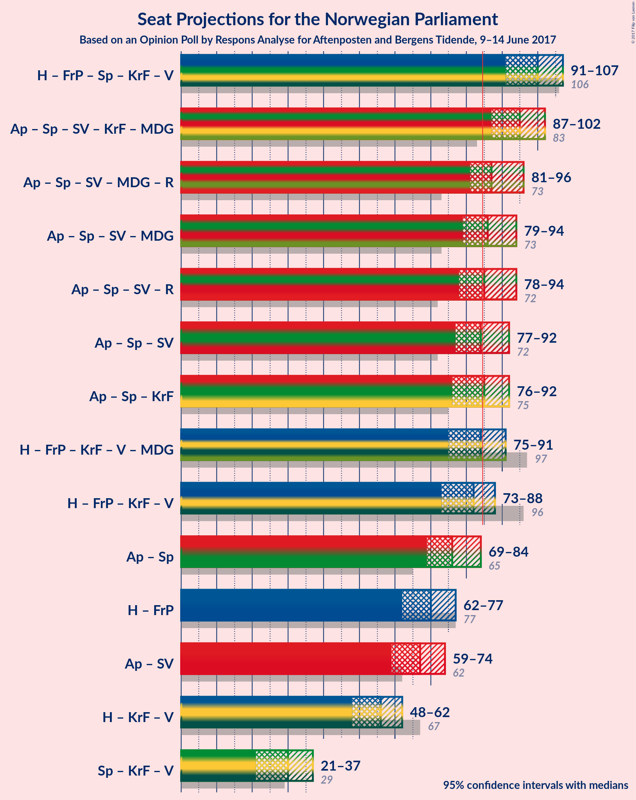

# Opinion Poll by Respons Analyse for Aftenposten and Bergens Tidende, 9–14 June 2017

<a href="#voting-intentions">Voting Intentions</a> | <a href="#seats">Seats</a> | <a href="#coalitions">Coalitions</a> | <a href="#technical-information">Technical Information</a>

## Voting Intentions

### Confidence Intervals

| Party | Last Result | Poll Result | 80% Confidence Interval | 90% Confidence Interval | 95% Confidence Interval | 99% Confidence Interval |
|:-----:|:-----------:|:-----------:|:-----------------------:|:-----------------------:|:-----------------------:|:-----------------------:|
| Arbeiderpartiet | 30.8% | 31.6% | 29.5–33.9% |28.9–34.5% |28.4–35.1% |27.4–36.2% |
| Høyre | 26.8% | 24.1% | 22.2–26.2% |21.6–26.8% |21.2–27.3% |20.3–28.3% |
| Fremskrittspartiet | 16.3% | 14.0% | 12.5–15.8% |12.0–16.2% |11.7–16.7% |11.0–17.6% |
| Senterpartiet | 5.5% | 9.8% | 8.6–11.4% |8.2–11.8% |7.9–12.2% |7.3–13.0% |
| Sosialistisk Venstreparti | 4.1% | 4.8% | 4.0–6.0% |3.7–6.3% |3.5–6.6% |3.1–7.2% |
| Kristelig Folkeparti | 5.6% | 4.7% | 3.8–5.9% |3.6–6.2% |3.4–6.5% |3.0–7.1% |
| Venstre | 5.2% | 3.5% | 2.8–4.5% |2.6–4.8% |2.4–5.1% |2.1–5.6% |
| Miljøpartiet de Grønne | 2.8% | 3.1% | 2.4–4.1% |2.2–4.4% |2.1–4.6% |1.8–5.1% |
| Rødt | 1.1% | 2.3% | 1.7–3.2% |1.6–3.4% |1.4–3.6% |1.2–4.1% |

*Note:* The poll result column reflects the actual value used in the calculations. Published results may vary slightly, and in addition be rounded to fewer digits.

## Seats

### Confidence Intervals

| Party | Last Result | Median | 80% Confidence Interval | 90% Confidence Interval | 95% Confidence Interval | 99% Confidence Interval |
|:-----:|:-----------:|:------:|:-----------------------:|:-----------------------:|:-----------------------:|:-----------------------:|
| <a href="#arbeiderpartiet">Arbeiderpartiet</a> | 55 | 58 | 53–62 |50–63 |50–65 |50–68 |
| <a href="#høyre">Høyre</a> | 48 | 45 | 41–48 |40–48 |38–49 |37–51 |
| <a href="#fremskrittspartiet">Fremskrittspartiet</a> | 29 | 27 | 23–29 |21–29 |20–29 |20–32 |
| <a href="#senterpartiet">Senterpartiet</a> | 10 | 18 | 15–19 |14–21 |14–22 |13–24 |
| <a href="#sosialistisk-venstreparti">Sosialistisk Venstreparti</a> | 7 | 9 | 1–11 |1–12 |1–12 |1–15 |
| <a href="#kristelig-folkeparti">Kristelig Folkeparti</a> | 10 | 9 | 2–11 |2–11 |2–11 |2–14 |
| <a href="#venstre">Venstre</a> | 9 | 1 | 1–9 |1–9 |0–9 |0–9 |
| <a href="#miljøpartiet-de-grønne">Miljøpartiet de Grønne</a> | 1 | 1 | 1–8 |1–8 |1–8 |0–9 |
| <a href="#rødt">Rødt</a> | 0 | 1 | 1–2 |1–2 |1–2 |0–8 |

### Arbeiderpartiet

| Number of Seats | Probability | Accumulated |
|:---------------:|:-----------:|:-----------:|
| 48 | 0% | 100% |
| 49 | 0% | 99.9% |
| 50 | 7% | 99.9% |
| 51 | 0.7% | 93% |
| 52 | 0.3% | 92% |
| 53 | 4% | 92% |
| 54 | 3% | 88% |
| 55 | 3% | 85% |
| 56 | 9% | 82% |
| 57 | 0.1% | 73% |
| 58 | 44% | 73% |
| 59 | 13% | 29% |
| 60 | 2% | 16% |
| 61 | 3% | 14% |
| 62 | 2% | 12% |
| 63 | 5% | 9% |
| 64 | 0.7% | 5% |
| 65 | 3% | 4% |
| 66 | 0.1% | 1.5% |
| 67 | 0.2% | 1.3% |
| 68 | 1.1% | 1.1% |
| 69 | 0% | 0% |

### Høyre

| Number of Seats | Probability | Accumulated |
|:---------------:|:-----------:|:-----------:|
| 35 | 0.1% | 100% |
| 36 | 0.2% | 99.9% |
| 37 | 0.9% | 99.7% |
| 38 | 1.4% | 98.8% |
| 39 | 2% | 97% |
| 40 | 1.2% | 95% |
| 41 | 6% | 94% |
| 42 | 32% | 89% |
| 43 | 3% | 57% |
| 44 | 3% | 54% |
| 45 | 11% | 50% |
| 46 | 18% | 39% |
| 47 | 2% | 21% |
| 48 | 15% | 19% |
| 49 | 2% | 4% |
| 50 | 1.2% | 2% |
| 51 | 0.2% | 0.5% |
| 52 | 0.1% | 0.3% |
| 53 | 0% | 0.1% |
| 54 | 0% | 0.1% |
| 55 | 0% | 0% |

### Fremskrittspartiet

| Number of Seats | Probability | Accumulated |
|:---------------:|:-----------:|:-----------:|
| 18 | 0.4% | 100% |
| 19 | 0% | 99.6% |
| 20 | 2% | 99.5% |
| 21 | 2% | 97% |
| 22 | 4% | 95% |
| 23 | 2% | 91% |
| 24 | 9% | 89% |
| 25 | 4% | 81% |
| 26 | 15% | 77% |
| 27 | 18% | 62% |
| 28 | 13% | 44% |
| 29 | 29% | 31% |
| 30 | 0.4% | 2% |
| 31 | 1.1% | 2% |
| 32 | 0.5% | 0.6% |
| 33 | 0% | 0.1% |
| 34 | 0% | 0.1% |
| 35 | 0% | 0% |

### Senterpartiet

| Number of Seats | Probability | Accumulated |
|:---------------:|:-----------:|:-----------:|
| 12 | 0.4% | 100% |
| 13 | 0.2% | 99.6% |
| 14 | 5% | 99.4% |
| 15 | 10% | 94% |
| 16 | 18% | 84% |
| 17 | 12% | 66% |
| 18 | 42% | 54% |
| 19 | 4% | 12% |
| 20 | 3% | 8% |
| 21 | 1.3% | 5% |
| 22 | 3% | 4% |
| 23 | 0.3% | 0.9% |
| 24 | 0.4% | 0.6% |
| 25 | 0.2% | 0.2% |
| 26 | 0% | 0.1% |
| 27 | 0% | 0.1% |
| 28 | 0% | 0% |

### Sosialistisk Venstreparti

| Number of Seats | Probability | Accumulated |
|:---------------:|:-----------:|:-----------:|
| 1 | 11% | 100% |
| 2 | 4% | 89% |
| 3 | 0% | 86% |
| 4 | 0% | 86% |
| 5 | 0% | 86% |
| 6 | 0% | 86% |
| 7 | 3% | 86% |
| 8 | 13% | 83% |
| 9 | 21% | 69% |
| 10 | 30% | 48% |
| 11 | 10% | 18% |
| 12 | 7% | 8% |
| 13 | 0.9% | 1.4% |
| 14 | 0% | 0.5% |
| 15 | 0.5% | 0.5% |
| 16 | 0% | 0% |

### Kristelig Folkeparti

| Number of Seats | Probability | Accumulated |
|:---------------:|:-----------:|:-----------:|
| 1 | 0.2% | 100% |
| 2 | 34% | 99.8% |
| 3 | 0.2% | 66% |
| 4 | 0% | 66% |
| 5 | 0% | 66% |
| 6 | 0% | 66% |
| 7 | 0.9% | 66% |
| 8 | 7% | 65% |
| 9 | 32% | 58% |
| 10 | 7% | 25% |
| 11 | 17% | 18% |
| 12 | 0.5% | 1.5% |
| 13 | 0.4% | 1.0% |
| 14 | 0.6% | 0.6% |
| 15 | 0% | 0% |

### Venstre

| Number of Seats | Probability | Accumulated |
|:---------------:|:-----------:|:-----------:|
| 0 | 5% | 100% |
| 1 | 47% | 95% |
| 2 | 18% | 48% |
| 3 | 3% | 31% |
| 4 | 0% | 28% |
| 5 | 0% | 28% |
| 6 | 0% | 28% |
| 7 | 9% | 28% |
| 8 | 5% | 19% |
| 9 | 14% | 14% |
| 10 | 0.1% | 0.3% |
| 11 | 0% | 0.1% |
| 12 | 0.1% | 0.1% |
| 13 | 0% | 0% |

### Miljøpartiet de Grønne

| Number of Seats | Probability | Accumulated |
|:---------------:|:-----------:|:-----------:|
| 0 | 2% | 100% |
| 1 | 55% | 98% |
| 2 | 8% | 44% |
| 3 | 5% | 35% |
| 4 | 0.2% | 31% |
| 5 | 0% | 30% |
| 6 | 0% | 30% |
| 7 | 11% | 30% |
| 8 | 18% | 19% |
| 9 | 1.2% | 1.3% |
| 10 | 0.1% | 0.1% |
| 11 | 0% | 0% |

### Rødt

| Number of Seats | Probability | Accumulated |
|:---------------:|:-----------:|:-----------:|
| 0 | 2% | 100% |
| 1 | 80% | 98% |
| 2 | 17% | 19% |
| 3 | 0% | 1.3% |
| 4 | 0% | 1.3% |
| 5 | 0% | 1.3% |
| 6 | 0% | 1.3% |
| 7 | 0.4% | 1.3% |
| 8 | 0.8% | 0.9% |
| 9 | 0.1% | 0.1% |
| 10 | 0% | 0% |

## Coalitions

### Confidence Intervals

| Coalition | Last Result | Median | 80% Confidence Interval | 90% Confidence Interval | 95% Confidence Interval | 99% Confidence Interval |
|:---------:|:-----------:|:------:|:-----------------------:|:-----------------------:|:-----------------------:|:-----------------------:|
| Høyre – Fremskrittspartiet – Senterpartiet – Kristelig Folkeparti – Venstre | 106 | 99 | 93–103 | 92–109 | 92–109 | 90–109 |
| Arbeiderpartiet – Senterpartiet – Sosialistisk Venstreparti – Kristelig Folkeparti – Miljøpartiet de Grønne | 83 | 95 | 86–98 | 86–101 | 86–102 | 86–103 |
| Arbeiderpartiet – Senterpartiet – Sosialistisk Venstreparti – Miljøpartiet de Grønne – Rødt | 73 | 88 | 82–92 | 78–94 | 78–95 | 78–95 |
| Arbeiderpartiet – Senterpartiet – Sosialistisk Venstreparti – Miljøpartiet de Grønne | 73 | 87 | 81–91 | 77–92 | 77–94 | 77–95 |
| Arbeiderpartiet – Senterpartiet – Sosialistisk Venstreparti – Rødt | 72 | 84 | 78–90 | 77–92 | 77–92 | 77–94 |
| Høyre – Fremskrittspartiet – Kristelig Folkeparti – Venstre – Miljøpartiet de Grønne | 97 | 85 | 79–91 | 77–92 | 77–92 | 75–92 |
| Arbeiderpartiet – Senterpartiet – Sosialistisk Venstreparti | 72 | 83 | 77–89 | 76–91 | 76–92 | 76–93 |
| Høyre – Fremskrittspartiet – Kristelig Folkeparti – Venstre | 96 | 81 | 77–87 | 75–91 | 74–91 | 74–91 |
| Arbeiderpartiet – Senterpartiet | 65 | 76 | 70–79 | 68–82 | 68–83 | 67–87 |
| Høyre – Fremskrittspartiet | 77 | 71 | 67–74 | 63–74 | 62–76 | 59–80 |
| Arbeiderpartiet – Sosialistisk Venstreparti | 62 | 67 | 60–71 | 58–75 | 58–75 | 57–75 |
| Høyre – Kristelig Folkeparti – Venstre | 67 | 52 | 51–62 | 49–63 | 47–63 | 46–63 |
| Senterpartiet – Kristelig Folkeparti – Venstre | 29 | 28 | 19–34 | 19–36 | 19–36 | 18–39 |

### Høyre – Fremskrittspartiet – Senterpartiet – Kristelig Folkeparti – Venstre

| Number of Seats | Probability | Accumulated |
|:---------------:|:-----------:|:-----------:|
| 87 | 0.1% | 100% |
| 88 | 0% | 99.9% |
| 89 | 0% | 99.9% |
| 90 | 0.8% | 99.8% |
| 91 | 0.1% | 99.0% |
| 92 | 7% | 98.9% |
| 93 | 15% | 92% |
| 94 | 0.2% | 77% |
| 95 | 5% | 77% |
| 96 | 4% | 72% |
| 97 | 1.1% | 68% |
| 98 | 11% | 67% |
| 99 | 28% | 57% |
| 100 | 2% | 28% |
| 101 | 12% | 26% |
| 102 | 4% | 15% |
| 103 | 0.8% | 11% |
| 104 | 0.9% | 10% |
| 105 | 0.3% | 9% |
| 106 | 0.5% | 9% |
| 107 | 0.6% | 8% |
| 108 | 0.1% | 8% |
| 109 | 7% | 8% |
| 110 | 0.1% | 0.2% |
| 111 | 0% | 0.1% |
| 112 | 0.1% | 0.1% |
| 113 | 0% | 0% |

### Arbeiderpartiet – Senterpartiet – Sosialistisk Venstreparti – Kristelig Folkeparti – Miljøpartiet de Grønne

| Number of Seats | Probability | Accumulated |
|:---------------:|:-----------:|:-----------:|
| 82 | 0.1% | 100% |
| 83 | 0% | 99.9% |
| 84 | 0.1% | 99.9% |
| 85 | 0.1% | 99.8% |
| 86 | 11% | 99.8% |
| 87 | 1.3% | 89% |
| 88 | 8% | 88% |
| 89 | 2% | 80% |
| 90 | 2% | 79% |
| 91 | 4% | 76% |
| 92 | 4% | 73% |
| 93 | 15% | 69% |
| 94 | 1.1% | 55% |
| 95 | 8% | 53% |
| 96 | 29% | 46% |
| 97 | 3% | 16% |
| 98 | 5% | 13% |
| 99 | 0.3% | 8% |
| 100 | 2% | 8% |
| 101 | 1.3% | 6% |
| 102 | 3% | 5% |
| 103 | 1.4% | 2% |
| 104 | 0.1% | 0.4% |
| 105 | 0.2% | 0.2% |
| 106 | 0% | 0% |

### Arbeiderpartiet – Senterpartiet – Sosialistisk Venstreparti – Miljøpartiet de Grønne – Rødt

| Number of Seats | Probability | Accumulated |
|:---------------:|:-----------:|:-----------:|
| 74 | 0% | 100% |
| 75 | 0% | 99.9% |
| 76 | 0.1% | 99.9% |
| 77 | 0.1% | 99.9% |
| 78 | 7% | 99.8% |
| 79 | 0.4% | 92% |
| 80 | 0.2% | 92% |
| 81 | 0.1% | 92% |
| 82 | 3% | 92% |
| 83 | 2% | 89% |
| 84 | 0.3% | 86% |
| 85 | 10% | 86% |
| 86 | 8% | 76% |
| 87 | 1.3% | 68% |
| 88 | 28% | 67% |
| 89 | 2% | 38% |
| 90 | 4% | 36% |
| 91 | 5% | 32% |
| 92 | 19% | 27% |
| 93 | 3% | 8% |
| 94 | 0.6% | 5% |
| 95 | 4% | 5% |
| 96 | 0.1% | 0.5% |
| 97 | 0% | 0.3% |
| 98 | 0% | 0.3% |
| 99 | 0.1% | 0.3% |
| 100 | 0.2% | 0.2% |
| 101 | 0% | 0% |

### Arbeiderpartiet – Senterpartiet – Sosialistisk Venstreparti – Miljøpartiet de Grønne

| Number of Seats | Probability | Accumulated |
|:---------------:|:-----------:|:-----------:|
| 73 | 0% | 100% |
| 74 | 0.1% | 99.9% |
| 75 | 0% | 99.9% |
| 76 | 0.1% | 99.9% |
| 77 | 7% | 99.8% |
| 78 | 0.5% | 92% |
| 79 | 0.2% | 92% |
| 80 | 2% | 92% |
| 81 | 3% | 90% |
| 82 | 0.7% | 87% |
| 83 | 0.3% | 86% |
| 84 | 18% | 86% |
| 85 | 1.3% | 68% |
| 86 | 0.8% | 66% |
| 87 | 29% | 66% |
| 88 | 2% | 37% |
| 89 | 5% | 35% |
| 90 | 8% | 31% |
| 91 | 16% | 22% |
| 92 | 2% | 7% |
| 93 | 1.0% | 4% |
| 94 | 2% | 3% |
| 95 | 1.5% | 2% |
| 96 | 0% | 0.3% |
| 97 | 0% | 0.3% |
| 98 | 0.2% | 0.3% |
| 99 | 0% | 0% |

### Arbeiderpartiet – Senterpartiet – Sosialistisk Venstreparti – Rødt

| Number of Seats | Probability | Accumulated |
|:---------------:|:-----------:|:-----------:|
| 72 | 0% | 100% |
| 73 | 0% | 99.9% |
| 74 | 0% | 99.9% |
| 75 | 0.1% | 99.9% |
| 76 | 0.1% | 99.8% |
| 77 | 7% | 99.7% |
| 78 | 11% | 92% |
| 79 | 0.5% | 82% |
| 80 | 1.4% | 81% |
| 81 | 3% | 80% |
| 82 | 4% | 77% |
| 83 | 1.4% | 73% |
| 84 | 22% | 72% |
| 85 | 0.2% | 50% |
| 86 | 0.3% | 49% |
| 87 | 30% | 49% |
| 88 | 2% | 19% |
| 89 | 4% | 17% |
| 90 | 5% | 13% |
| 91 | 2% | 8% |
| 92 | 4% | 6% |
| 93 | 0.6% | 2% |
| 94 | 1.2% | 2% |
| 95 | 0.1% | 0.3% |
| 96 | 0.2% | 0.2% |
| 97 | 0% | 0% |

### Høyre – Fremskrittspartiet – Kristelig Folkeparti – Venstre – Miljøpartiet de Grønne

| Number of Seats | Probability | Accumulated |
|:---------------:|:-----------:|:-----------:|
| 73 | 0.2% | 100% |
| 74 | 0.1% | 99.8% |
| 75 | 1.2% | 99.7% |
| 76 | 0.6% | 98% |
| 77 | 4% | 98% |
| 78 | 2% | 94% |
| 79 | 5% | 92% |
| 80 | 4% | 87% |
| 81 | 2% | 83% |
| 82 | 30% | 81% |
| 83 | 0.3% | 51% |
| 84 | 0.2% | 51% |
| 85 | 22% | 50% |
| 86 | 1.4% | 28% |
| 87 | 4% | 27% |
| 88 | 3% | 23% |
| 89 | 1.4% | 20% |
| 90 | 0.5% | 19% |
| 91 | 11% | 18% |
| 92 | 7% | 8% |
| 93 | 0.1% | 0.3% |
| 94 | 0.1% | 0.2% |
| 95 | 0% | 0.1% |
| 96 | 0% | 0.1% |
| 97 | 0% | 0.1% |
| 98 | 0% | 0% |

### Arbeiderpartiet – Senterpartiet – Sosialistisk Venstreparti

| Number of Seats | Probability | Accumulated |
|:---------------:|:-----------:|:-----------:|
| 70 | 0% | 100% |
| 71 | 0% | 99.9% |
| 72 | 0.1% | 99.9% |
| 73 | 0.1% | 99.9% |
| 74 | 0% | 99.8% |
| 75 | 0.1% | 99.8% |
| 76 | 8% | 99.7% |
| 77 | 11% | 92% |
| 78 | 0.2% | 81% |
| 79 | 3% | 81% |
| 80 | 3% | 78% |
| 81 | 2% | 75% |
| 82 | 9% | 73% |
| 83 | 15% | 64% |
| 84 | 0.1% | 49% |
| 85 | 3% | 49% |
| 86 | 29% | 46% |
| 87 | 4% | 18% |
| 88 | 2% | 14% |
| 89 | 6% | 12% |
| 90 | 0.6% | 6% |
| 91 | 2% | 5% |
| 92 | 2% | 3% |
| 93 | 0.7% | 0.9% |
| 94 | 0.2% | 0.2% |
| 95 | 0.1% | 0.1% |
| 96 | 0% | 0% |

### Høyre – Fremskrittspartiet – Kristelig Folkeparti – Venstre

| Number of Seats | Probability | Accumulated |
|:---------------:|:-----------:|:-----------:|
| 69 | 0.2% | 100% |
| 70 | 0.1% | 99.8% |
| 71 | 0% | 99.7% |
| 72 | 0% | 99.7% |
| 73 | 0.1% | 99.7% |
| 74 | 4% | 99.5% |
| 75 | 0.6% | 95% |
| 76 | 3% | 95% |
| 77 | 19% | 92% |
| 78 | 5% | 73% |
| 79 | 4% | 68% |
| 80 | 2% | 64% |
| 81 | 28% | 62% |
| 82 | 1.3% | 33% |
| 83 | 8% | 32% |
| 84 | 10% | 24% |
| 85 | 0.3% | 14% |
| 86 | 2% | 14% |
| 87 | 3% | 11% |
| 88 | 0.1% | 8% |
| 89 | 0.2% | 8% |
| 90 | 0.4% | 8% |
| 91 | 7% | 8% |
| 92 | 0% | 0.2% |
| 93 | 0.1% | 0.1% |
| 94 | 0% | 0.1% |
| 95 | 0% | 0.1% |
| 96 | 0% | 0% |

### Arbeiderpartiet – Senterpartiet

| Number of Seats | Probability | Accumulated |
|:---------------:|:-----------:|:-----------:|
| 67 | 0.5% | 100% |
| 68 | 8% | 99.5% |
| 69 | 2% | 92% |
| 70 | 1.0% | 90% |
| 71 | 8% | 89% |
| 72 | 4% | 81% |
| 73 | 0.9% | 77% |
| 74 | 14% | 76% |
| 75 | 2% | 61% |
| 76 | 40% | 60% |
| 77 | 5% | 20% |
| 78 | 3% | 14% |
| 79 | 4% | 12% |
| 80 | 0.9% | 7% |
| 81 | 1.2% | 6% |
| 82 | 2% | 5% |
| 83 | 2% | 4% |
| 84 | 0.8% | 2% |
| 85 | 0.2% | 1.3% |
| 86 | 0.1% | 1.1% |
| 87 | 1.0% | 1.0% |
| 88 | 0% | 0% |

### Høyre – Fremskrittspartiet

| Number of Seats | Probability | Accumulated |
|:---------------:|:-----------:|:-----------:|
| 57 | 0.1% | 100% |
| 58 | 0.2% | 99.9% |
| 59 | 0.4% | 99.7% |
| 60 | 0% | 99.3% |
| 61 | 1.2% | 99.3% |
| 62 | 0.6% | 98% |
| 63 | 3% | 97% |
| 64 | 0.5% | 94% |
| 65 | 1.4% | 94% |
| 66 | 1.5% | 93% |
| 67 | 4% | 91% |
| 68 | 5% | 87% |
| 69 | 2% | 82% |
| 70 | 13% | 81% |
| 71 | 28% | 67% |
| 72 | 3% | 40% |
| 73 | 19% | 37% |
| 74 | 14% | 18% |
| 75 | 0.2% | 4% |
| 76 | 2% | 4% |
| 77 | 0.7% | 2% |
| 78 | 0% | 0.9% |
| 79 | 0.3% | 0.9% |
| 80 | 0.5% | 0.6% |
| 81 | 0% | 0.1% |
| 82 | 0% | 0.1% |
| 83 | 0% | 0.1% |
| 84 | 0% | 0.1% |
| 85 | 0% | 0% |

### Arbeiderpartiet – Sosialistisk Venstreparti

| Number of Seats | Probability | Accumulated |
|:---------------:|:-----------:|:-----------:|
| 54 | 0% | 100% |
| 55 | 0.1% | 99.9% |
| 56 | 0.1% | 99.9% |
| 57 | 0.4% | 99.8% |
| 58 | 7% | 99.4% |
| 59 | 0.2% | 92% |
| 60 | 10% | 92% |
| 61 | 1.0% | 81% |
| 62 | 3% | 80% |
| 63 | 3% | 78% |
| 64 | 3% | 75% |
| 65 | 2% | 72% |
| 66 | 2% | 70% |
| 67 | 24% | 68% |
| 68 | 28% | 43% |
| 69 | 3% | 16% |
| 70 | 2% | 13% |
| 71 | 2% | 11% |
| 72 | 2% | 9% |
| 73 | 0.2% | 7% |
| 74 | 2% | 7% |
| 75 | 5% | 5% |
| 76 | 0% | 0.1% |
| 77 | 0% | 0% |

### Høyre – Kristelig Folkeparti – Venstre

| Number of Seats | Probability | Accumulated |
|:---------------:|:-----------:|:-----------:|
| 42 | 0.2% | 100% |
| 43 | 0% | 99.8% |
| 44 | 0% | 99.8% |
| 45 | 0% | 99.8% |
| 46 | 1.2% | 99.8% |
| 47 | 2% | 98.6% |
| 48 | 1.2% | 97% |
| 49 | 2% | 96% |
| 50 | 0.3% | 94% |
| 51 | 21% | 93% |
| 52 | 28% | 72% |
| 53 | 2% | 44% |
| 54 | 0.9% | 43% |
| 55 | 4% | 42% |
| 56 | 1.2% | 37% |
| 57 | 12% | 36% |
| 58 | 2% | 24% |
| 59 | 11% | 22% |
| 60 | 0.3% | 11% |
| 61 | 0.2% | 10% |
| 62 | 2% | 10% |
| 63 | 8% | 9% |
| 64 | 0% | 0.4% |
| 65 | 0.2% | 0.4% |
| 66 | 0.1% | 0.2% |
| 67 | 0% | 0.1% |
| 68 | 0% | 0.1% |
| 69 | 0% | 0% |

### Senterpartiet – Kristelig Folkeparti – Venstre

| Number of Seats | Probability | Accumulated |
|:---------------:|:-----------:|:-----------:|
| 18 | 0.7% | 100% |
| 19 | 14% | 99.3% |
| 20 | 0% | 85% |
| 21 | 1.2% | 85% |
| 22 | 2% | 84% |
| 23 | 0.1% | 82% |
| 24 | 4% | 82% |
| 25 | 0.3% | 78% |
| 26 | 4% | 78% |
| 27 | 0.2% | 73% |
| 28 | 50% | 73% |
| 29 | 2% | 23% |
| 30 | 2% | 21% |
| 31 | 2% | 19% |
| 32 | 1.1% | 17% |
| 33 | 4% | 16% |
| 34 | 3% | 12% |
| 35 | 0.9% | 10% |
| 36 | 8% | 9% |
| 37 | 0.2% | 0.9% |
| 38 | 0.1% | 0.8% |
| 39 | 0.5% | 0.6% |
| 40 | 0% | 0.1% |
| 41 | 0.1% | 0.1% |
| 42 | 0% | 0% |

## Technical Information

### Opinion Poll

+ **Pollster:** Respons Analyse
+ **Media:** Aftenposten and Bergens Tidende
+ **Fieldwork period:** 9–14 June 2017

### Calculations

+ **Sample size:** 743
+ **Simulations done:** 65,536
+ **Error estimate:** 2.50%

