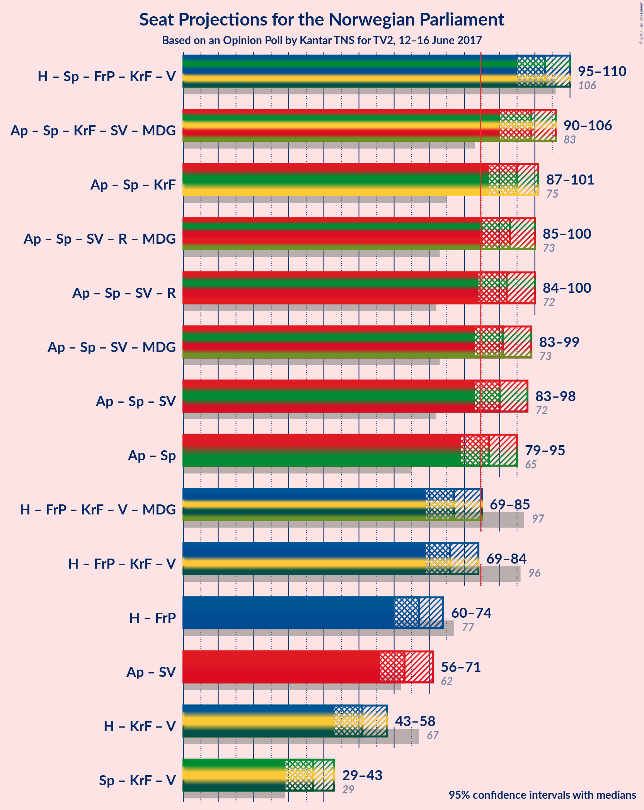

# Opinion Poll by Kantar TNS for TV2, 12–16 June 2017

<a href="#voting-intentions">Voting Intentions</a> | <a href="#seats">Seats</a> | <a href="#coalitions">Coalitions</a> | <a href="#technical-information">Technical Information</a>

## Voting Intentions

### Confidence Intervals

| Party | Last Result | Poll Result | 80% Confidence Interval | 90% Confidence Interval | 95% Confidence Interval | 99% Confidence Interval |
|:-----:|:-----------:|:-----------:|:-----------------------:|:-----------------------:|:-----------------------:|:-----------------------:|
| Arbeiderpartiet | 30.8% | 32.2% | 30.1–34.5% |29.5–35.2% |28.9–35.7% |27.9–36.8% |
| Høyre | 26.8% | 22.3% | 20.4–24.3% |19.8–24.9% |19.4–25.4% |18.5–26.4% |
| Senterpartiet | 5.5% | 14.5% | 12.9–16.3% |12.5–16.8% |12.1–17.2% |11.4–18.1% |
| Fremskrittspartiet | 16.3% | 13.7% | 12.1–15.4% |11.7–15.9% |11.4–16.4% |10.7–17.2% |
| Kristelig Folkeparti | 5.6% | 4.5% | 3.7–5.7% |3.4–6.0% |3.2–6.3% |2.9–6.9% |
| Sosialistisk Venstreparti | 4.1% | 3.6% | 2.8–4.6% |2.6–4.9% |2.4–5.2% |2.1–5.7% |
| Venstre | 5.2% | 2.7% | 2.1–3.7% |1.9–3.9% |1.8–4.2% |1.5–4.7% |
| Rødt | 1.1% | 2.6% | 2.0–3.5% |1.8–3.8% |1.7–4.0% |1.4–4.5% |
| Miljøpartiet de Grønne | 2.8% | 2.0% | 1.5–2.9% |1.4–3.1% |1.2–3.4% |1.0–3.8% |

*Note:* The poll result column reflects the actual value used in the calculations. Published results may vary slightly, and in addition be rounded to fewer digits.

## Seats

### Confidence Intervals

| Party | Last Result | Median | 80% Confidence Interval | 90% Confidence Interval | 95% Confidence Interval | 99% Confidence Interval |
|:-----:|:-----------:|:------:|:-----------------------:|:-----------------------:|:-----------------------:|:-----------------------:|
| <a href="#arbeiderpartiet">Arbeiderpartiet</a> | 55 | 60 | 55–64 |54–66 |53–66 |51–69 |
| <a href="#høyre">Høyre</a> | 48 | 41 | 38–45 |36–47 |35–48 |34–49 |
| <a href="#senterpartiet">Senterpartiet</a> | 10 | 27 | 24–30 |23–31 |22–31 |21–34 |
| <a href="#fremskrittspartiet">Fremskrittspartiet</a> | 29 | 26 | 23–29 |22–30 |21–30 |20–31 |
| <a href="#kristelig-folkeparti">Kristelig Folkeparti</a> | 10 | 9 | 2–11 |2–11 |2–11 |2–13 |
| <a href="#sosialistisk-venstreparti">Sosialistisk Venstreparti</a> | 7 | 2 | 1–8 |1–9 |1–9 |0–10 |
| <a href="#venstre">Venstre</a> | 9 | 1 | 0–3 |0–3 |0–8 |0–8 |
| <a href="#rødt">Rødt</a> | 0 | 2 | 1–2 |1–2 |1–2 |1–8 |
| <a href="#miljøpartiet-de-grønne">Miljøpartiet de Grønne</a> | 1 | 1 | 0–1 |0–1 |0–2 |0–3 |

### Arbeiderpartiet

| Number of Seats | Probability | Accumulated | Special Marks |
|:---------------:|:-----------:|:-----------:|:-------------:|
| 49 | 0.1% | 100% |  |
| 50 | 0.3% | 99.9% |  |
| 51 | 0.2% | 99.6% |  |
| 52 | 2% | 99.4% |  |
| 53 | 2% | 98% |  |
| 54 | 1.2% | 96% |  |
| 55 | 9% | 95% | Last Result |
| 56 | 6% | 86% |  |
| 57 | 6% | 80% |  |
| 58 | 10% | 74% |  |
| 59 | 14% | 64% |  |
| 60 | 14% | 50% | Median |
| 61 | 14% | 36% |  |
| 62 | 5% | 23% |  |
| 63 | 6% | 18% |  |
| 64 | 4% | 12% |  |
| 65 | 2% | 8% |  |
| 66 | 3% | 6% |  |
| 67 | 0.5% | 2% |  |
| 68 | 0.6% | 2% |  |
| 69 | 1.0% | 1.3% |  |
| 70 | 0.2% | 0.3% |  |
| 71 | 0.1% | 0.1% |  |
| 72 | 0% | 0% |  |

### Høyre

| Number of Seats | Probability | Accumulated | Special Marks |
|:---------------:|:-----------:|:-----------:|:-------------:|
| 32 | 0% | 100% |  |
| 33 | 0.2% | 99.9% |  |
| 34 | 0.5% | 99.7% |  |
| 35 | 2% | 99.2% |  |
| 36 | 2% | 97% |  |
| 37 | 4% | 95% |  |
| 38 | 13% | 90% |  |
| 39 | 8% | 77% |  |
| 40 | 11% | 70% |  |
| 41 | 19% | 59% | Median |
| 42 | 12% | 39% |  |
| 43 | 7% | 27% |  |
| 44 | 7% | 20% |  |
| 45 | 4% | 13% |  |
| 46 | 2% | 10% |  |
| 47 | 4% | 7% |  |
| 48 | 2% | 3% | Last Result |
| 49 | 0.6% | 0.9% |  |
| 50 | 0.1% | 0.3% |  |
| 51 | 0.1% | 0.2% |  |
| 52 | 0% | 0% |  |

### Senterpartiet

| Number of Seats | Probability | Accumulated | Special Marks |
|:---------------:|:-----------:|:-----------:|:-------------:|
| 10 | 0% | 100% | Last Result |
| 11 | 0% | 100% |  |
| 12 | 0% | 100% |  |
| 13 | 0% | 100% |  |
| 14 | 0% | 100% |  |
| 15 | 0% | 100% |  |
| 16 | 0% | 100% |  |
| 17 | 0% | 100% |  |
| 18 | 0% | 100% |  |
| 19 | 0% | 100% |  |
| 20 | 0.2% | 99.9% |  |
| 21 | 0.8% | 99.7% |  |
| 22 | 2% | 98.9% |  |
| 23 | 5% | 97% |  |
| 24 | 8% | 92% |  |
| 25 | 11% | 84% |  |
| 26 | 17% | 73% |  |
| 27 | 20% | 57% | Median |
| 28 | 11% | 36% |  |
| 29 | 13% | 25% |  |
| 30 | 6% | 12% |  |
| 31 | 4% | 6% |  |
| 32 | 1.2% | 2% |  |
| 33 | 0.7% | 1.3% |  |
| 34 | 0.3% | 0.5% |  |
| 35 | 0.1% | 0.2% |  |
| 36 | 0.1% | 0.1% |  |
| 37 | 0% | 0% |  |

### Fremskrittspartiet

| Number of Seats | Probability | Accumulated | Special Marks |
|:---------------:|:-----------:|:-----------:|:-------------:|
| 19 | 0.2% | 100% |  |
| 20 | 0.7% | 99.8% |  |
| 21 | 4% | 99.0% |  |
| 22 | 3% | 95% |  |
| 23 | 11% | 92% |  |
| 24 | 18% | 81% |  |
| 25 | 11% | 62% |  |
| 26 | 19% | 51% | Median |
| 27 | 11% | 33% |  |
| 28 | 9% | 21% |  |
| 29 | 7% | 12% | Last Result |
| 30 | 3% | 5% |  |
| 31 | 1.3% | 2% |  |
| 32 | 0.2% | 0.3% |  |
| 33 | 0.1% | 0.1% |  |
| 34 | 0% | 0.1% |  |
| 35 | 0% | 0% |  |

### Kristelig Folkeparti

| Number of Seats | Probability | Accumulated | Special Marks |
|:---------------:|:-----------:|:-----------:|:-------------:|
| 1 | 0.4% | 100% |  |
| 2 | 17% | 99.5% |  |
| 3 | 0.5% | 82% |  |
| 4 | 0% | 82% |  |
| 5 | 0% | 82% |  |
| 6 | 0% | 82% |  |
| 7 | 3% | 82% |  |
| 8 | 27% | 79% |  |
| 9 | 28% | 51% | Median |
| 10 | 12% | 23% | Last Result |
| 11 | 9% | 11% |  |
| 12 | 2% | 2% |  |
| 13 | 0.5% | 0.5% |  |
| 14 | 0% | 0.1% |  |
| 15 | 0% | 0% |  |

### Sosialistisk Venstreparti

| Number of Seats | Probability | Accumulated | Special Marks |
|:---------------:|:-----------:|:-----------:|:-------------:|
| 0 | 1.1% | 100% |  |
| 1 | 21% | 98.9% |  |
| 2 | 39% | 77% | Median |
| 3 | 0% | 38% |  |
| 4 | 0% | 38% |  |
| 5 | 0% | 38% |  |
| 6 | 0% | 38% |  |
| 7 | 2% | 38% | Last Result |
| 8 | 28% | 36% |  |
| 9 | 7% | 8% |  |
| 10 | 1.3% | 2% |  |
| 11 | 0.2% | 0.3% |  |
| 12 | 0% | 0% |  |

### Venstre

| Number of Seats | Probability | Accumulated | Special Marks |
|:---------------:|:-----------:|:-----------:|:-------------:|
| 0 | 15% | 100% |  |
| 1 | 46% | 85% | Median |
| 2 | 27% | 39% |  |
| 3 | 9% | 12% |  |
| 4 | 0% | 3% |  |
| 5 | 0% | 3% |  |
| 6 | 0% | 3% |  |
| 7 | 0.5% | 3% |  |
| 8 | 2% | 3% |  |
| 9 | 0.4% | 0.5% | Last Result |
| 10 | 0.1% | 0.1% |  |
| 11 | 0% | 0% |  |

### Rødt

| Number of Seats | Probability | Accumulated | Special Marks |
|:---------------:|:-----------:|:-----------:|:-------------:|
| 0 | 0% | 100% | Last Result |
| 1 | 26% | 100% |  |
| 2 | 71% | 74% | Median |
| 3 | 0.4% | 2% |  |
| 4 | 0% | 2% |  |
| 5 | 0% | 2% |  |
| 6 | 0% | 2% |  |
| 7 | 0.4% | 2% |  |
| 8 | 1.5% | 2% |  |
| 9 | 0.2% | 0.2% |  |
| 10 | 0% | 0% |  |

### Miljøpartiet de Grønne

| Number of Seats | Probability | Accumulated | Special Marks |
|:---------------:|:-----------:|:-----------:|:-------------:|
| 0 | 34% | 100% |  |
| 1 | 63% | 66% | Last Result, Median |
| 2 | 1.2% | 3% |  |
| 3 | 1.1% | 2% |  |
| 4 | 0.3% | 0.5% |  |
| 5 | 0% | 0.2% |  |
| 6 | 0% | 0.2% |  |
| 7 | 0.1% | 0.2% |  |
| 8 | 0.1% | 0.1% |  |
| 9 | 0% | 0% |  |

## Coalitions

### Confidence Intervals

| Coalition | Last Result | Median | 80% Confidence Interval | 90% Confidence Interval | 95% Confidence Interval | 99% Confidence Interval |
|:---------:|:-----------:|:------:|:-----------------------:|:-----------------------:|:-----------------------:|:-----------------------:|
| Høyre – Senterpartiet – Fremskrittspartiet – Kristelig Folkeparti – Venstre | 106 | 103 | 98–107 | 96–109 | 95–109 | 93–112 |
| Arbeiderpartiet – Senterpartiet – Kristelig Folkeparti – Sosialistisk Venstreparti – Miljøpartiet de Grønne | 83 | 99 | 95–104 | 91–104 | 90–106 | 89–107 |
| Arbeiderpartiet – Senterpartiet – Kristelig Folkeparti | 75 | 94 | 89–99 | 87–100 | 87–102 | 84–104 |
| Arbeiderpartiet – Senterpartiet – Sosialistisk Venstreparti – Rødt – Miljøpartiet de Grønne | 73 | 93 | 88–98 | 87–99 | 86–101 | 84–103 |
| Arbeiderpartiet – Senterpartiet – Sosialistisk Venstreparti – Rødt | 72 | 92 | 87–98 | 86–99 | 85–100 | 83–103 |
| Arbeiderpartiet – Senterpartiet – Sosialistisk Venstreparti – Miljøpartiet de Grønne | 73 | 91 | 87–96 | 85–97 | 84–99 | 81–102 |
| Arbeiderpartiet – Senterpartiet – Sosialistisk Venstreparti | 72 | 90 | 86–96 | 84–97 | 83–98 | 81–101 |
| Arbeiderpartiet – Senterpartiet | 65 | 87 | 81–92 | 80–93 | 79–94 | 77–97 |
| Høyre – Fremskrittspartiet – Kristelig Folkeparti – Venstre – Miljøpartiet de Grønne | 97 | 77 | 71–82 | 70–83 | 69–84 | 66–86 |
| Høyre – Fremskrittspartiet – Kristelig Folkeparti – Venstre | 96 | 76 | 71–81 | 70–82 | 68–83 | 66–85 |
| Høyre – Fremskrittspartiet | 77 | 66 | 62–71 | 61–73 | 60–75 | 58–76 |
| Arbeiderpartiet – Sosialistisk Venstreparti | 62 | 63 | 59–69 | 57–70 | 57–72 | 54–73 |
| Høyre – Kristelig Folkeparti – Venstre | 67 | 51 | 45–55 | 44–57 | 43–57 | 40–60 |
| Senterpartiet – Kristelig Folkeparti – Venstre | 29 | 37 | 30–40 | 29–42 | 29–43 | 26–46 |

### Høyre – Senterpartiet – Fremskrittspartiet – Kristelig Folkeparti – Venstre

| Number of Seats | Probability | Accumulated | Special Marks |
|:---------------:|:-----------:|:-----------:|:-------------:|
| 89 | 0% | 100% |  |
| 90 | 0% | 99.9% |  |
| 91 | 0.1% | 99.9% |  |
| 92 | 0.2% | 99.9% |  |
| 93 | 0.4% | 99.6% |  |
| 94 | 0.6% | 99.2% |  |
| 95 | 2% | 98.6% |  |
| 96 | 2% | 97% |  |
| 97 | 2% | 95% |  |
| 98 | 8% | 93% |  |
| 99 | 3% | 84% |  |
| 100 | 7% | 81% |  |
| 101 | 11% | 74% |  |
| 102 | 7% | 64% |  |
| 103 | 11% | 57% |  |
| 104 | 13% | 46% | Median |
| 105 | 12% | 33% |  |
| 106 | 8% | 21% | Last Result |
| 107 | 5% | 14% |  |
| 108 | 3% | 9% |  |
| 109 | 4% | 6% |  |
| 110 | 1.4% | 2% |  |
| 111 | 0.6% | 1.1% |  |
| 112 | 0.3% | 0.6% |  |
| 113 | 0.1% | 0.3% |  |
| 114 | 0.1% | 0.2% |  |
| 115 | 0.1% | 0.1% |  |
| 116 | 0% | 0% |  |

### Arbeiderpartiet – Senterpartiet – Kristelig Folkeparti – Sosialistisk Venstreparti – Miljøpartiet de Grønne

| Number of Seats | Probability | Accumulated | Special Marks |
|:---------------:|:-----------:|:-----------:|:-------------:|
| 83 | 0% | 100% | Last Result |
| 84 | 0% | 100% |  |
| 85 | 0% | 100% | Majority |
| 86 | 0% | 100% |  |
| 87 | 0.2% | 99.9% |  |
| 88 | 0.2% | 99.8% |  |
| 89 | 0.6% | 99.5% |  |
| 90 | 3% | 99.0% |  |
| 91 | 2% | 96% |  |
| 92 | 1.1% | 95% |  |
| 93 | 0.9% | 94% |  |
| 94 | 3% | 93% |  |
| 95 | 5% | 90% |  |
| 96 | 9% | 85% |  |
| 97 | 7% | 76% |  |
| 98 | 10% | 70% |  |
| 99 | 12% | 60% | Median |
| 100 | 17% | 48% |  |
| 101 | 9% | 31% |  |
| 102 | 4% | 22% |  |
| 103 | 3% | 18% |  |
| 104 | 9% | 14% |  |
| 105 | 1.4% | 5% |  |
| 106 | 3% | 3% |  |
| 107 | 0.4% | 0.9% |  |
| 108 | 0.2% | 0.5% |  |
| 109 | 0.2% | 0.3% |  |
| 110 | 0% | 0.1% |  |
| 111 | 0% | 0% |  |

### Arbeiderpartiet – Senterpartiet – Kristelig Folkeparti

| Number of Seats | Probability | Accumulated | Special Marks |
|:---------------:|:-----------:|:-----------:|:-------------:|
| 75 | 0% | 100% | Last Result |
| 76 | 0% | 100% |  |
| 77 | 0% | 100% |  |
| 78 | 0% | 100% |  |
| 79 | 0% | 100% |  |
| 80 | 0% | 100% |  |
| 81 | 0% | 100% |  |
| 82 | 0.2% | 99.9% |  |
| 83 | 0.2% | 99.7% |  |
| 84 | 0.3% | 99.6% |  |
| 85 | 0.7% | 99.2% | Majority |
| 86 | 1.0% | 98.6% |  |
| 87 | 3% | 98% |  |
| 88 | 3% | 94% |  |
| 89 | 7% | 91% |  |
| 90 | 4% | 84% |  |
| 91 | 4% | 80% |  |
| 92 | 5% | 76% |  |
| 93 | 11% | 71% |  |
| 94 | 11% | 60% |  |
| 95 | 7% | 48% |  |
| 96 | 15% | 42% | Median |
| 97 | 8% | 27% |  |
| 98 | 7% | 19% |  |
| 99 | 4% | 11% |  |
| 100 | 2% | 7% |  |
| 101 | 2% | 5% |  |
| 102 | 0.8% | 3% |  |
| 103 | 1.2% | 2% |  |
| 104 | 0.4% | 0.6% |  |
| 105 | 0.1% | 0.2% |  |
| 106 | 0% | 0.1% |  |
| 107 | 0.1% | 0.1% |  |
| 108 | 0% | 0% |  |

### Arbeiderpartiet – Senterpartiet – Sosialistisk Venstreparti – Rødt – Miljøpartiet de Grønne

| Number of Seats | Probability | Accumulated | Special Marks |
|:---------------:|:-----------:|:-----------:|:-------------:|
| 73 | 0% | 100% | Last Result |
| 74 | 0% | 100% |  |
| 75 | 0% | 100% |  |
| 76 | 0% | 100% |  |
| 77 | 0% | 100% |  |
| 78 | 0% | 100% |  |
| 79 | 0% | 100% |  |
| 80 | 0% | 100% |  |
| 81 | 0% | 100% |  |
| 82 | 0.2% | 99.9% |  |
| 83 | 0.2% | 99.8% |  |
| 84 | 1.0% | 99.6% |  |
| 85 | 0.7% | 98.6% | Majority |
| 86 | 0.7% | 98% |  |
| 87 | 4% | 97% |  |
| 88 | 6% | 93% |  |
| 89 | 3% | 87% |  |
| 90 | 7% | 84% |  |
| 91 | 14% | 77% |  |
| 92 | 9% | 63% | Median |
| 93 | 8% | 54% |  |
| 94 | 16% | 46% |  |
| 95 | 4% | 30% |  |
| 96 | 3% | 25% |  |
| 97 | 7% | 23% |  |
| 98 | 8% | 16% |  |
| 99 | 3% | 8% |  |
| 100 | 2% | 5% |  |
| 101 | 1.2% | 3% |  |
| 102 | 0.7% | 2% |  |
| 103 | 0.7% | 1.2% |  |
| 104 | 0.2% | 0.4% |  |
| 105 | 0.1% | 0.2% |  |
| 106 | 0.1% | 0.1% |  |
| 107 | 0% | 0% |  |

### Arbeiderpartiet – Senterpartiet – Sosialistisk Venstreparti – Rødt

| Number of Seats | Probability | Accumulated | Special Marks |
|:---------------:|:-----------:|:-----------:|:-------------:|
| 72 | 0% | 100% | Last Result |
| 73 | 0% | 100% |  |
| 74 | 0% | 100% |  |
| 75 | 0% | 100% |  |
| 76 | 0% | 100% |  |
| 77 | 0% | 100% |  |
| 78 | 0% | 100% |  |
| 79 | 0% | 100% |  |
| 80 | 0% | 100% |  |
| 81 | 0.1% | 99.9% |  |
| 82 | 0.2% | 99.8% |  |
| 83 | 1.1% | 99.7% |  |
| 84 | 0.5% | 98.6% |  |
| 85 | 0.8% | 98% | Majority |
| 86 | 4% | 97% |  |
| 87 | 5% | 93% |  |
| 88 | 4% | 89% |  |
| 89 | 5% | 84% |  |
| 90 | 12% | 79% |  |
| 91 | 11% | 67% | Median |
| 92 | 9% | 56% |  |
| 93 | 11% | 47% |  |
| 94 | 9% | 36% |  |
| 95 | 4% | 27% |  |
| 96 | 5% | 23% |  |
| 97 | 5% | 18% |  |
| 98 | 8% | 13% |  |
| 99 | 2% | 6% |  |
| 100 | 1.2% | 3% |  |
| 101 | 0.6% | 2% |  |
| 102 | 0.6% | 1.3% |  |
| 103 | 0.6% | 0.8% |  |
| 104 | 0.1% | 0.2% |  |
| 105 | 0.1% | 0.1% |  |
| 106 | 0% | 0% |  |

### Arbeiderpartiet – Senterpartiet – Sosialistisk Venstreparti – Miljøpartiet de Grønne

| Number of Seats | Probability | Accumulated | Special Marks |
|:---------------:|:-----------:|:-----------:|:-------------:|
| 73 | 0% | 100% | Last Result |
| 74 | 0% | 100% |  |
| 75 | 0% | 100% |  |
| 76 | 0% | 100% |  |
| 77 | 0% | 100% |  |
| 78 | 0% | 100% |  |
| 79 | 0.1% | 100% |  |
| 80 | 0.2% | 99.9% |  |
| 81 | 0.3% | 99.7% |  |
| 82 | 0.8% | 99.5% |  |
| 83 | 0.8% | 98.6% |  |
| 84 | 0.7% | 98% |  |
| 85 | 4% | 97% | Majority |
| 86 | 2% | 93% |  |
| 87 | 7% | 91% |  |
| 88 | 7% | 84% |  |
| 89 | 12% | 77% |  |
| 90 | 11% | 65% | Median |
| 91 | 6% | 54% |  |
| 92 | 16% | 47% |  |
| 93 | 5% | 31% |  |
| 94 | 3% | 26% |  |
| 95 | 4% | 23% |  |
| 96 | 11% | 19% |  |
| 97 | 4% | 8% |  |
| 98 | 1.4% | 4% |  |
| 99 | 0.6% | 3% |  |
| 100 | 1.0% | 2% |  |
| 101 | 0.7% | 1.2% |  |
| 102 | 0.2% | 0.5% |  |
| 103 | 0.2% | 0.3% |  |
| 104 | 0.1% | 0.1% |  |
| 105 | 0% | 0% |  |

### Arbeiderpartiet – Senterpartiet – Sosialistisk Venstreparti

| Number of Seats | Probability | Accumulated | Special Marks |
|:---------------:|:-----------:|:-----------:|:-------------:|
| 72 | 0% | 100% | Last Result |
| 73 | 0% | 100% |  |
| 74 | 0% | 100% |  |
| 75 | 0% | 100% |  |
| 76 | 0% | 100% |  |
| 77 | 0% | 100% |  |
| 78 | 0.1% | 100% |  |
| 79 | 0.1% | 99.9% |  |
| 80 | 0.2% | 99.8% |  |
| 81 | 1.0% | 99.6% |  |
| 82 | 0.4% | 98.6% |  |
| 83 | 1.0% | 98% |  |
| 84 | 4% | 97% |  |
| 85 | 2% | 93% | Majority |
| 86 | 6% | 91% |  |
| 87 | 6% | 86% |  |
| 88 | 10% | 79% |  |
| 89 | 13% | 69% | Median |
| 90 | 8% | 56% |  |
| 91 | 10% | 48% |  |
| 92 | 10% | 38% |  |
| 93 | 5% | 28% |  |
| 94 | 4% | 23% |  |
| 95 | 3% | 19% |  |
| 96 | 11% | 16% |  |
| 97 | 2% | 5% |  |
| 98 | 0.6% | 3% |  |
| 99 | 0.9% | 2% |  |
| 100 | 0.5% | 1.4% |  |
| 101 | 0.5% | 0.8% |  |
| 102 | 0.2% | 0.4% |  |
| 103 | 0.1% | 0.1% |  |
| 104 | 0% | 0% |  |

### Arbeiderpartiet – Senterpartiet

| Number of Seats | Probability | Accumulated | Special Marks |
|:---------------:|:-----------:|:-----------:|:-------------:|
| 65 | 0% | 100% | Last Result |
| 66 | 0% | 100% |  |
| 67 | 0% | 100% |  |
| 68 | 0% | 100% |  |
| 69 | 0% | 100% |  |
| 70 | 0% | 100% |  |
| 71 | 0% | 100% |  |
| 72 | 0% | 100% |  |
| 73 | 0% | 100% |  |
| 74 | 0% | 100% |  |
| 75 | 0.1% | 99.9% |  |
| 76 | 0.2% | 99.8% |  |
| 77 | 0.5% | 99.6% |  |
| 78 | 2% | 99.1% |  |
| 79 | 1.0% | 98% |  |
| 80 | 4% | 97% |  |
| 81 | 2% | 92% |  |
| 82 | 9% | 90% |  |
| 83 | 2% | 80% |  |
| 84 | 9% | 78% |  |
| 85 | 9% | 69% | Majority |
| 86 | 8% | 61% |  |
| 87 | 16% | 53% | Median |
| 88 | 11% | 37% |  |
| 89 | 7% | 26% |  |
| 90 | 5% | 19% |  |
| 91 | 3% | 14% |  |
| 92 | 5% | 11% |  |
| 93 | 1.4% | 6% |  |
| 94 | 2% | 4% |  |
| 95 | 1.2% | 2% |  |
| 96 | 0.4% | 1.2% |  |
| 97 | 0.5% | 0.8% |  |
| 98 | 0.1% | 0.4% |  |
| 99 | 0.2% | 0.2% |  |
| 100 | 0% | 0% |  |

### Høyre – Fremskrittspartiet – Kristelig Folkeparti – Venstre – Miljøpartiet de Grønne

| Number of Seats | Probability | Accumulated | Special Marks |
|:---------------:|:-----------:|:-----------:|:-------------:|
| 64 | 0.1% | 100% |  |
| 65 | 0.1% | 99.9% |  |
| 66 | 0.6% | 99.8% |  |
| 67 | 0.6% | 99.2% |  |
| 68 | 0.6% | 98.7% |  |
| 69 | 1.2% | 98% |  |
| 70 | 2% | 97% |  |
| 71 | 8% | 94% |  |
| 72 | 5% | 87% |  |
| 73 | 5% | 82% |  |
| 74 | 4% | 77% |  |
| 75 | 9% | 73% |  |
| 76 | 11% | 64% |  |
| 77 | 9% | 53% |  |
| 78 | 11% | 44% | Median |
| 79 | 12% | 33% |  |
| 80 | 5% | 21% |  |
| 81 | 4% | 16% |  |
| 82 | 5% | 11% |  |
| 83 | 4% | 7% |  |
| 84 | 0.8% | 3% |  |
| 85 | 0.5% | 2% | Majority |
| 86 | 1.1% | 1.4% |  |
| 87 | 0.2% | 0.3% |  |
| 88 | 0.1% | 0.2% |  |
| 89 | 0% | 0.1% |  |
| 90 | 0% | 0% |  |
| 91 | 0% | 0% |  |
| 92 | 0% | 0% |  |
| 93 | 0% | 0% |  |
| 94 | 0% | 0% |  |
| 95 | 0% | 0% |  |
| 96 | 0% | 0% |  |
| 97 | 0% | 0% | Last Result |

### Høyre – Fremskrittspartiet – Kristelig Folkeparti – Venstre

| Number of Seats | Probability | Accumulated | Special Marks |
|:---------------:|:-----------:|:-----------:|:-------------:|
| 63 | 0.1% | 100% |  |
| 64 | 0.1% | 99.9% |  |
| 65 | 0.2% | 99.8% |  |
| 66 | 0.7% | 99.6% |  |
| 67 | 0.7% | 98.8% |  |
| 68 | 1.2% | 98% |  |
| 69 | 2% | 97% |  |
| 70 | 3% | 95% |  |
| 71 | 8% | 92% |  |
| 72 | 7% | 84% |  |
| 73 | 3% | 77% |  |
| 74 | 4% | 75% |  |
| 75 | 16% | 70% |  |
| 76 | 8% | 54% |  |
| 77 | 9% | 46% | Median |
| 78 | 14% | 37% |  |
| 79 | 7% | 23% |  |
| 80 | 3% | 16% |  |
| 81 | 6% | 13% |  |
| 82 | 4% | 7% |  |
| 83 | 0.7% | 3% |  |
| 84 | 0.7% | 2% |  |
| 85 | 1.0% | 1.4% | Majority |
| 86 | 0.2% | 0.4% |  |
| 87 | 0.2% | 0.2% |  |
| 88 | 0% | 0.1% |  |
| 89 | 0% | 0% |  |
| 90 | 0% | 0% |  |
| 91 | 0% | 0% |  |
| 92 | 0% | 0% |  |
| 93 | 0% | 0% |  |
| 94 | 0% | 0% |  |
| 95 | 0% | 0% |  |
| 96 | 0% | 0% | Last Result |

### Høyre – Fremskrittspartiet

| Number of Seats | Probability | Accumulated | Special Marks |
|:---------------:|:-----------:|:-----------:|:-------------:|
| 56 | 0.1% | 100% |  |
| 57 | 0.1% | 99.9% |  |
| 58 | 0.5% | 99.8% |  |
| 59 | 0.4% | 99.3% |  |
| 60 | 2% | 98.8% |  |
| 61 | 2% | 97% |  |
| 62 | 8% | 95% |  |
| 63 | 5% | 87% |  |
| 64 | 9% | 81% |  |
| 65 | 8% | 72% |  |
| 66 | 14% | 64% |  |
| 67 | 14% | 50% | Median |
| 68 | 7% | 36% |  |
| 69 | 11% | 28% |  |
| 70 | 5% | 17% |  |
| 71 | 5% | 13% |  |
| 72 | 2% | 8% |  |
| 73 | 1.2% | 6% |  |
| 74 | 1.4% | 5% |  |
| 75 | 1.0% | 3% |  |
| 76 | 2% | 2% |  |
| 77 | 0.1% | 0.4% | Last Result |
| 78 | 0.1% | 0.2% |  |
| 79 | 0% | 0.1% |  |
| 80 | 0.1% | 0.1% |  |
| 81 | 0% | 0% |  |

### Arbeiderpartiet – Sosialistisk Venstreparti

| Number of Seats | Probability | Accumulated | Special Marks |
|:---------------:|:-----------:|:-----------:|:-------------:|
| 52 | 0.1% | 100% |  |
| 53 | 0.1% | 99.9% |  |
| 54 | 0.3% | 99.8% |  |
| 55 | 0.5% | 99.4% |  |
| 56 | 1.0% | 98.9% |  |
| 57 | 4% | 98% |  |
| 58 | 2% | 94% |  |
| 59 | 4% | 92% |  |
| 60 | 4% | 88% |  |
| 61 | 13% | 84% |  |
| 62 | 12% | 71% | Last Result, Median |
| 63 | 12% | 59% |  |
| 64 | 9% | 47% |  |
| 65 | 5% | 38% |  |
| 66 | 11% | 33% |  |
| 67 | 3% | 22% |  |
| 68 | 6% | 18% |  |
| 69 | 8% | 13% |  |
| 70 | 0.7% | 5% |  |
| 71 | 2% | 4% |  |
| 72 | 2% | 3% |  |
| 73 | 0.5% | 0.9% |  |
| 74 | 0.2% | 0.4% |  |
| 75 | 0.2% | 0.2% |  |
| 76 | 0% | 0.1% |  |
| 77 | 0% | 0.1% |  |
| 78 | 0% | 0% |  |

### Høyre – Kristelig Folkeparti – Venstre

| Number of Seats | Probability | Accumulated | Special Marks |
|:---------------:|:-----------:|:-----------:|:-------------:|
| 38 | 0% | 100% |  |
| 39 | 0.2% | 99.9% |  |
| 40 | 0.7% | 99.8% |  |
| 41 | 0.2% | 99.1% |  |
| 42 | 0.9% | 98.9% |  |
| 43 | 0.9% | 98% |  |
| 44 | 2% | 97% |  |
| 45 | 5% | 95% |  |
| 46 | 5% | 90% |  |
| 47 | 9% | 85% |  |
| 48 | 7% | 76% |  |
| 49 | 11% | 69% |  |
| 50 | 4% | 57% |  |
| 51 | 8% | 53% | Median |
| 52 | 21% | 45% |  |
| 53 | 3% | 24% |  |
| 54 | 11% | 21% |  |
| 55 | 4% | 11% |  |
| 56 | 1.1% | 7% |  |
| 57 | 4% | 5% |  |
| 58 | 0.6% | 2% |  |
| 59 | 0.4% | 1.1% |  |
| 60 | 0.4% | 0.7% |  |
| 61 | 0.1% | 0.3% |  |
| 62 | 0.1% | 0.2% |  |
| 63 | 0.1% | 0.1% |  |
| 64 | 0% | 0% |  |
| 65 | 0% | 0% |  |
| 66 | 0% | 0% |  |
| 67 | 0% | 0% | Last Result |

### Senterpartiet – Kristelig Folkeparti – Venstre

| Number of Seats | Probability | Accumulated | Special Marks |
|:---------------:|:-----------:|:-----------:|:-------------:|
| 25 | 0.2% | 100% |  |
| 26 | 1.1% | 99.8% |  |
| 27 | 0.2% | 98.7% |  |
| 28 | 0.6% | 98% |  |
| 29 | 7% | 98% | Last Result |
| 30 | 2% | 91% |  |
| 31 | 1.5% | 89% |  |
| 32 | 3% | 87% |  |
| 33 | 6% | 84% |  |
| 34 | 7% | 79% |  |
| 35 | 6% | 72% |  |
| 36 | 8% | 66% |  |
| 37 | 25% | 58% | Median |
| 38 | 12% | 34% |  |
| 39 | 6% | 22% |  |
| 40 | 6% | 16% |  |
| 41 | 4% | 10% |  |
| 42 | 3% | 6% |  |
| 43 | 2% | 3% |  |
| 44 | 0.6% | 1.5% |  |
| 45 | 0.2% | 0.9% |  |
| 46 | 0.2% | 0.7% |  |
| 47 | 0.4% | 0.5% |  |
| 48 | 0% | 0.1% |  |
| 49 | 0% | 0% |  |

## Technical Information

### Opinion Poll

+ **Pollster:** Kantar TNS
+ **Media:** TV2
+ **Fieldwork period:** 12–16 June 2017

### Calculations

+ **Sample size:** 732
+ **Simulations done:** 1,048,576
+ **Error estimate:** 1.27%

