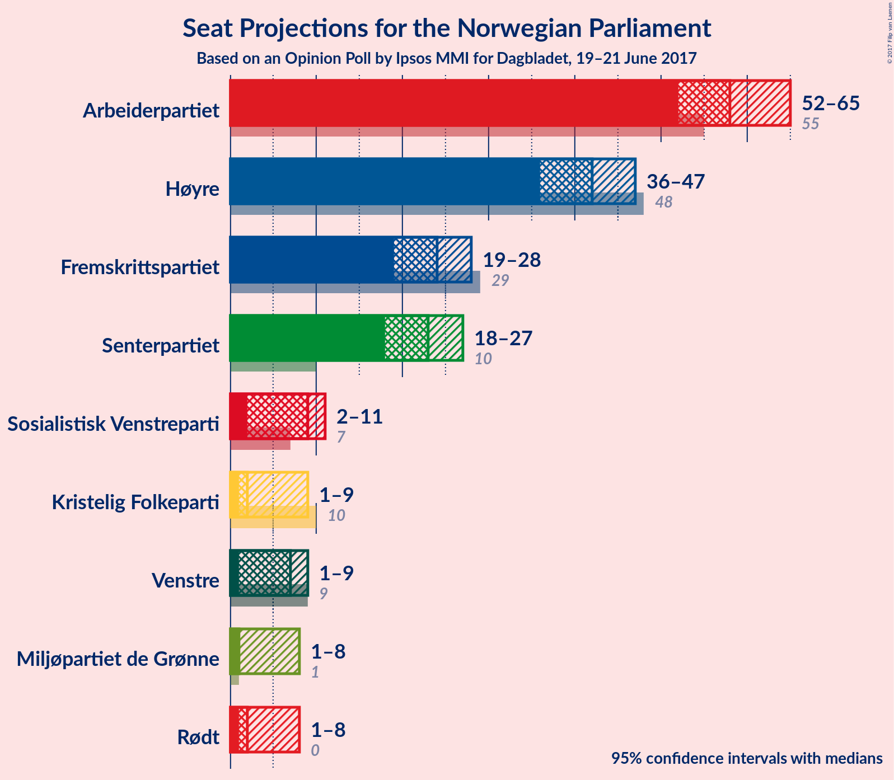

# Opinion Poll by Ipsos MMI for Dagbladet, 19–21 June 2017

<a href="#voting-intentions">Voting Intentions</a> | <a href="#seats">Seats</a> | <a href="#coalitions">Coalitions</a> | <a href="#technical-information">Technical Information</a>

## Voting Intentions

### Confidence Intervals

| Party | Last Result | Poll Result | 80% Confidence Interval | 90% Confidence Interval | 95% Confidence Interval | 99% Confidence Interval |
|:-----:|:-----------:|:-----------:|:-----------------------:|:-----------------------:|:-----------------------:|:-----------------------:|
| Arbeiderpartiet | 30.8% | 32.1% | 29.9–33.7% |29.4–34.2% |28.9–34.7% |28.1–35.6% |
| Høyre | 26.8% | 23.3% | 21.4–24.9% |21.0–25.4% |20.6–25.8% |19.8–26.7% |
| Fremskrittspartiet | 16.3% | 13.0% | 11.6–14.3% |11.2–14.7% |10.9–15.1% |10.3–15.8% |
| Senterpartiet | 5.5% | 12.4% | 11.0–13.7% |10.7–14.1% |10.3–14.4% |9.8–15.1% |
| Sosialistisk Venstreparti | 4.1% | 4.7% | 3.9–5.7% |3.7–5.9% |3.5–6.2% |3.2–6.7% |
| Venstre | 5.2% | 4.0% | 3.3–4.9% |3.1–5.2% |2.9–5.4% |2.6–5.9% |
| Kristelig Folkeparti | 5.6% | 3.9% | 3.2–4.8% |3.0–5.0% |2.9–5.3% |2.6–5.7% |
| Rødt | 1.1% | 3.3% | 2.7–4.1% |2.5–4.4% |2.3–4.6% |2.1–5.0% |
| Miljøpartiet de Grønne | 2.8% | 3.2% | 2.6–4.0% |2.4–4.3% |2.3–4.5% |2.0–4.9% |

*Note:* The poll result column reflects the actual value used in the calculations. Published results may vary slightly, and in addition be rounded to fewer digits.

## Seats

### Confidence Intervals

| Party | Last Result | Median | 80% Confidence Interval | 90% Confidence Interval | 95% Confidence Interval | 99% Confidence Interval |
|:-----:|:-----------:|:------:|:-----------------------:|:-----------------------:|:-----------------------:|:-----------------------:|
| <a href="#arbeiderpartiet">Arbeiderpartiet</a> | 55 | N/A | N/A |N/A |N/A |N/A |
| <a href="#høyre">Høyre</a> | 48 | N/A | N/A |N/A |N/A |N/A |
| <a href="#fremskrittspartiet">Fremskrittspartiet</a> | 29 | N/A | N/A |N/A |N/A |N/A |
| <a href="#senterpartiet">Senterpartiet</a> | 10 | N/A | N/A |N/A |N/A |N/A |
| <a href="#sosialistisk-venstreparti">Sosialistisk Venstreparti</a> | 7 | N/A | N/A |N/A |N/A |N/A |
| <a href="#venstre">Venstre</a> | 9 | N/A | N/A |N/A |N/A |N/A |
| <a href="#kristelig-folkeparti">Kristelig Folkeparti</a> | 10 | N/A | N/A |N/A |N/A |N/A |
| <a href="#rødt">Rødt</a> | 0 | N/A | N/A |N/A |N/A |N/A |
| <a href="#miljøpartiet-de-grønne">Miljøpartiet de Grønne</a> | 1 | N/A | N/A |N/A |N/A |N/A |

## Coalitions

## Technical Information

### Opinion Poll

+ **Pollster:** Ipsos MMI
+ **Media:** Dagbladet
+ **Fieldwork period:** 19–21 June 2017

### Calculations

+ **Sample size:** 994
+ **Simulations done:** 0
+ **Error estimate:** 100.00%

