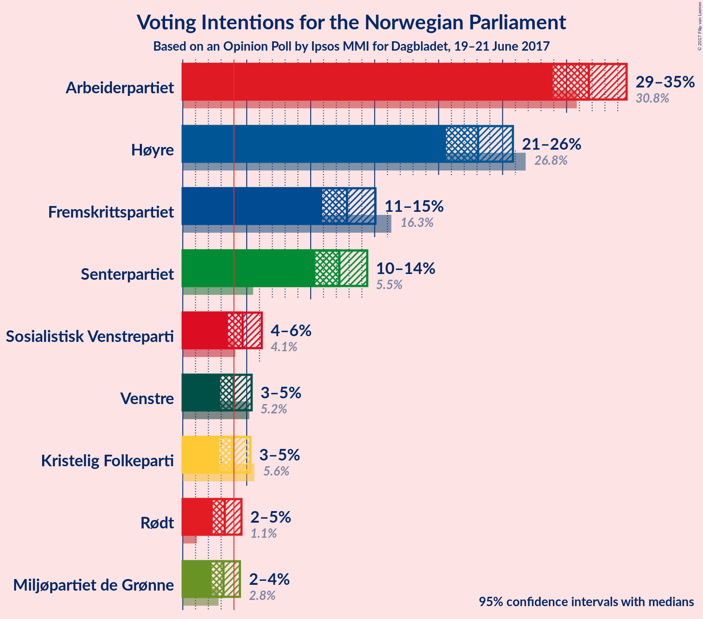

# Opinion Poll by Ipsos MMI for Dagbladet, 19–21 June 2017

<a href="#voting-intentions">Voting Intentions</a> | <a href="#seats">Seats</a> | <a href="#coalitions">Coalitions</a> | <a href="#technical-information">Technical Information</a>

## Voting Intentions

### Confidence Intervals

| Party | Last Result | Poll Result | 80% Confidence Interval | 90% Confidence Interval | 95% Confidence Interval | 99% Confidence Interval |
|:-----:|:-----------:|:-----------:|:-----------------------:|:-----------------------:|:-----------------------:|:-----------------------:|
| Arbeiderpartiet | 30.8% | 31.7% | 29.9–33.7% |29.4–34.2% |28.9–34.7% |28.1–35.6% |
| Høyre | 26.8% | 23.1% | 21.4–24.9% |21.0–25.4% |20.6–25.8% |19.8–26.7% |
| Fremskrittspartiet | 16.3% | 12.8% | 11.6–14.3% |11.2–14.7% |10.9–15.1% |10.3–15.8% |
| Senterpartiet | 5.5% | 12.2% | 11.0–13.7% |10.7–14.1% |10.3–14.4% |9.8–15.1% |
| Sosialistisk Venstreparti | 4.1% | 4.7% | 3.9–5.7% |3.7–5.9% |3.5–6.2% |3.2–6.7% |
| Venstre | 5.2% | 4.0% | 3.3–4.9% |3.1–5.2% |2.9–5.4% |2.6–5.9% |
| Kristelig Folkeparti | 5.6% | 3.9% | 3.2–4.8% |3.0–5.0% |2.9–5.3% |2.6–5.7% |
| Rødt | 1.1% | 3.3% | 2.7–4.1% |2.5–4.4% |2.3–4.6% |2.1–5.0% |
| Miljøpartiet de Grønne | 2.8% | 3.2% | 2.6–4.0% |2.4–4.3% |2.3–4.5% |2.0–4.9% |

*Note:* The poll result column reflects the actual value used in the calculations. Published results may vary slightly, and in addition be rounded to fewer digits.

## Seats

### Confidence Intervals

| Party | Last Result | Median | 80% Confidence Interval | 90% Confidence Interval | 95% Confidence Interval | 99% Confidence Interval |
|:-----:|:-----------:|:------:|:-----------------------:|:-----------------------:|:-----------------------:|:-----------------------:|
| <a href="#arbeiderpartiet">Arbeiderpartiet</a> | 55 | 58 | 55–63 |54–65 |52–65 |51–67 |
| <a href="#høyre">Høyre</a> | 48 | 42 | 39–46 |37–46 |36–47 |36–50 |
| <a href="#fremskrittspartiet">Fremskrittspartiet</a> | 29 | 24 | 21–26 |20–28 |19–28 |18–30 |
| <a href="#senterpartiet">Senterpartiet</a> | 10 | 23 | 20–25 |19–26 |18–27 |18–28 |
| <a href="#sosialistisk-venstreparti">Sosialistisk Venstreparti</a> | 7 | 9 | 2–10 |2–11 |2–11 |1–12 |
| <a href="#venstre">Venstre</a> | 9 | 7 | 2–8 |1–9 |1–9 |1–11 |
| <a href="#kristelig-folkeparti">Kristelig Folkeparti</a> | 10 | 2 | 2–8 |1–9 |1–9 |1–10 |
| <a href="#rødt">Rødt</a> | 0 | 2 | 1–7 |1–8 |1–8 |1–9 |
| <a href="#miljøpartiet-de-grønne">Miljøpartiet de Grønne</a> | 1 | 1 | 1–3 |1–7 |1–8 |1–9 |

### Arbeiderpartiet

| Number of Seats | Probability | Accumulated | Special Marks |
|:---------------:|:-----------:|:-----------:|:-------------:|
| 49 | 0.1% | 100% |  |
| 50 | 0.2% | 99.9% |  |
| 51 | 0.5% | 99.7% |  |
| 52 | 2% | 99.1% |  |
| 53 | 2% | 97% |  |
| 54 | 5% | 95% |  |
| 55 | 7% | 90% | Last Result |
| 56 | 7% | 83% |  |
| 57 | 17% | 77% |  |
| 58 | 13% | 60% | Median |
| 59 | 6% | 47% |  |
| 60 | 14% | 41% |  |
| 61 | 12% | 26% |  |
| 62 | 3% | 14% |  |
| 63 | 2% | 11% |  |
| 64 | 3% | 9% |  |
| 65 | 4% | 6% |  |
| 66 | 2% | 2% |  |
| 67 | 0.3% | 0.6% |  |
| 68 | 0.2% | 0.3% |  |
| 69 | 0.1% | 0.1% |  |
| 70 | 0% | 0% |  |

### Høyre

| Number of Seats | Probability | Accumulated | Special Marks |
|:---------------:|:-----------:|:-----------:|:-------------:|
| 33 | 0% | 100% |  |
| 34 | 0.1% | 99.9% |  |
| 35 | 0.3% | 99.9% |  |
| 36 | 3% | 99.5% |  |
| 37 | 2% | 97% |  |
| 38 | 3% | 94% |  |
| 39 | 12% | 91% |  |
| 40 | 9% | 79% |  |
| 41 | 12% | 70% |  |
| 42 | 9% | 58% | Median |
| 43 | 10% | 48% |  |
| 44 | 18% | 38% |  |
| 45 | 10% | 21% |  |
| 46 | 7% | 11% |  |
| 47 | 2% | 4% |  |
| 48 | 1.0% | 2% | Last Result |
| 49 | 0.6% | 1.2% |  |
| 50 | 0.4% | 0.6% |  |
| 51 | 0.1% | 0.2% |  |
| 52 | 0.1% | 0.1% |  |
| 53 | 0% | 0% |  |

### Fremskrittspartiet

| Number of Seats | Probability | Accumulated | Special Marks |
|:---------------:|:-----------:|:-----------:|:-------------:|
| 17 | 0.2% | 100% |  |
| 18 | 0.4% | 99.8% |  |
| 19 | 2% | 99.4% |  |
| 20 | 5% | 97% |  |
| 21 | 7% | 92% |  |
| 22 | 22% | 85% |  |
| 23 | 11% | 62% |  |
| 24 | 21% | 52% | Median |
| 25 | 12% | 30% |  |
| 26 | 9% | 19% |  |
| 27 | 5% | 10% |  |
| 28 | 4% | 5% |  |
| 29 | 0.4% | 1.0% | Last Result |
| 30 | 0.5% | 0.6% |  |
| 31 | 0.1% | 0.1% |  |
| 32 | 0% | 0% |  |

### Senterpartiet

| Number of Seats | Probability | Accumulated | Special Marks |
|:---------------:|:-----------:|:-----------:|:-------------:|
| 10 | 0% | 100% | Last Result |
| 11 | 0% | 100% |  |
| 12 | 0% | 100% |  |
| 13 | 0% | 100% |  |
| 14 | 0% | 100% |  |
| 15 | 0% | 100% |  |
| 16 | 0.1% | 100% |  |
| 17 | 0.3% | 99.9% |  |
| 18 | 4% | 99.6% |  |
| 19 | 4% | 96% |  |
| 20 | 14% | 92% |  |
| 21 | 10% | 78% |  |
| 22 | 16% | 68% |  |
| 23 | 18% | 52% | Median |
| 24 | 24% | 34% |  |
| 25 | 5% | 10% |  |
| 26 | 2% | 5% |  |
| 27 | 1.5% | 3% |  |
| 28 | 1.1% | 1.3% |  |
| 29 | 0.2% | 0.2% |  |
| 30 | 0% | 0% |  |

### Sosialistisk Venstreparti

| Number of Seats | Probability | Accumulated | Special Marks |
|:---------------:|:-----------:|:-----------:|:-------------:|
| 1 | 2% | 100% |  |
| 2 | 8% | 98% |  |
| 3 | 0% | 89% |  |
| 4 | 0% | 89% |  |
| 5 | 0% | 89% |  |
| 6 | 0% | 89% |  |
| 7 | 5% | 89% | Last Result |
| 8 | 25% | 84% |  |
| 9 | 37% | 59% | Median |
| 10 | 15% | 23% |  |
| 11 | 5% | 7% |  |
| 12 | 2% | 2% |  |
| 13 | 0.2% | 0.2% |  |
| 14 | 0% | 0% |  |

### Venstre

| Number of Seats | Probability | Accumulated | Special Marks |
|:---------------:|:-----------:|:-----------:|:-------------:|
| 0 | 0.1% | 100% |  |
| 1 | 5% | 99.9% |  |
| 2 | 38% | 94% |  |
| 3 | 6% | 56% |  |
| 4 | 0% | 50% |  |
| 5 | 0% | 50% |  |
| 6 | 0% | 50% |  |
| 7 | 8% | 50% | Median |
| 8 | 32% | 42% |  |
| 9 | 7% | 9% | Last Result |
| 10 | 2% | 2% |  |
| 11 | 0.5% | 0.5% |  |
| 12 | 0.1% | 0.1% |  |
| 13 | 0% | 0% |  |

### Kristelig Folkeparti

| Number of Seats | Probability | Accumulated | Special Marks |
|:---------------:|:-----------:|:-----------:|:-------------:|
| 0 | 0.1% | 100% |  |
| 1 | 7% | 99.9% |  |
| 2 | 47% | 93% | Median |
| 3 | 0.2% | 46% |  |
| 4 | 0% | 46% |  |
| 5 | 0% | 46% |  |
| 6 | 0% | 46% |  |
| 7 | 12% | 46% |  |
| 8 | 25% | 34% |  |
| 9 | 6% | 8% |  |
| 10 | 2% | 2% | Last Result |
| 11 | 0.3% | 0.4% |  |
| 12 | 0% | 0% |  |

### Rødt

| Number of Seats | Probability | Accumulated | Special Marks |
|:---------------:|:-----------:|:-----------:|:-------------:|
| 0 | 0% | 100% | Last Result |
| 1 | 11% | 100% |  |
| 2 | 78% | 89% | Median |
| 3 | 0% | 11% |  |
| 4 | 0% | 11% |  |
| 5 | 0% | 11% |  |
| 6 | 0.1% | 11% |  |
| 7 | 5% | 11% |  |
| 8 | 5% | 6% |  |
| 9 | 1.1% | 1.2% |  |
| 10 | 0.1% | 0.2% |  |
| 11 | 0% | 0% |  |

### Miljøpartiet de Grønne

| Number of Seats | Probability | Accumulated | Special Marks |
|:---------------:|:-----------:|:-----------:|:-------------:|
| 0 | 0.1% | 100% |  |
| 1 | 71% | 99.9% | Last Result, Median |
| 2 | 12% | 29% |  |
| 3 | 7% | 17% |  |
| 4 | 0.1% | 10% |  |
| 5 | 0% | 10% |  |
| 6 | 0% | 10% |  |
| 7 | 5% | 10% |  |
| 8 | 4% | 5% |  |
| 9 | 0.6% | 0.6% |  |
| 10 | 0% | 0.1% |  |
| 11 | 0% | 0% |  |

## Coalitions

### Confidence Intervals

| Coalition | Last Result | Median | Majority? | 80% Confidence Interval | 90% Confidence Interval | 95% Confidence Interval | 99% Confidence Interval |
|:---------:|:-----------:|:------:|:---------:|:-----------------------:|:-----------------------:|:-----------------------:|:-----------------------:|
| Høyre – Fremskrittspartiet – Senterpartiet – Venstre – Kristelig Folkeparti | 106 | 98 | 99.9% | 92–103 | 90–105 | 90–107 | 87–107 |
| Arbeiderpartiet – Senterpartiet – Sosialistisk Venstreparti – Kristelig Folkeparti – Miljøpartiet de Grønne | 83 | 96 | 99.7% | 90–101 | 89–102 | 88–104 | 86–106 |
| Arbeiderpartiet – Senterpartiet – Sosialistisk Venstreparti – Rødt – Miljøpartiet de Grønne | 73 | 94 | 98% | 88–99 | 86–100 | 85–101 | 84–104 |
| Arbeiderpartiet – Senterpartiet – Sosialistisk Venstreparti – Rødt | 72 | 92 | 95% | 86–97 | 84–98 | 83–99 | 81–102 |
| Arbeiderpartiet – Senterpartiet – Sosialistisk Venstreparti – Miljøpartiet de Grønne | 73 | 91 | 93% | 86–96 | 84–97 | 82–98 | 80–102 |
| Arbeiderpartiet – Senterpartiet – Sosialistisk Venstreparti | 72 | 90 | 88% | 84–94 | 82–95 | 81–96 | 78–98 |
| Arbeiderpartiet – Senterpartiet | 65 | 81 | 14% | 77–85 | 74–87 | 74–88 | 72–92 |
| Høyre – Fremskrittspartiet – Venstre – Kristelig Folkeparti – Miljøpartiet de Grønne | 97 | 77 | 5% | 72–83 | 71–85 | 70–86 | 67–88 |
| Høyre – Fremskrittspartiet – Venstre – Kristelig Folkeparti | 96 | 75 | 2% | 70–81 | 69–83 | 68–84 | 65–85 |
| Arbeiderpartiet – Sosialistisk Venstreparti | 62 | 66 | 0% | 62–71 | 60–73 | 59–74 | 56–75 |
| Høyre – Fremskrittspartiet | 77 | 66 | 0% | 61–70 | 59–71 | 58–72 | 56–75 |
| Høyre – Venstre – Kristelig Folkeparti | 67 | 52 | 0% | 47–57 | 45–58 | 44–60 | 42–62 |
| Senterpartiet – Venstre – Kristelig Folkeparti | 29 | 32 | 0% | 27–37 | 26–38 | 24–39 | 23–42 |

### Høyre – Fremskrittspartiet – Senterpartiet – Venstre – Kristelig Folkeparti

| Number of Seats | Probability | Accumulated | Special Marks |
|:---------------:|:-----------:|:-----------:|:-------------:|
| 84 | 0% | 100% |  |
| 85 | 0.1% | 99.9% | Majority |
| 86 | 0.2% | 99.8% |  |
| 87 | 0.5% | 99.7% |  |
| 88 | 0.5% | 99.1% |  |
| 89 | 0.6% | 98.6% |  |
| 90 | 3% | 98% |  |
| 91 | 2% | 95% |  |
| 92 | 3% | 92% |  |
| 93 | 4% | 89% |  |
| 94 | 5% | 85% |  |
| 95 | 10% | 80% |  |
| 96 | 6% | 71% |  |
| 97 | 13% | 64% |  |
| 98 | 6% | 51% | Median |
| 99 | 9% | 46% |  |
| 100 | 14% | 37% |  |
| 101 | 8% | 23% |  |
| 102 | 3% | 15% |  |
| 103 | 3% | 12% |  |
| 104 | 2% | 9% |  |
| 105 | 2% | 7% |  |
| 106 | 2% | 4% | Last Result |
| 107 | 2% | 3% |  |
| 108 | 0.2% | 0.5% |  |
| 109 | 0.2% | 0.3% |  |
| 110 | 0.1% | 0.1% |  |
| 111 | 0% | 0% |  |

### Arbeiderpartiet – Senterpartiet – Sosialistisk Venstreparti – Kristelig Folkeparti – Miljøpartiet de Grønne

| Number of Seats | Probability | Accumulated | Special Marks |
|:---------------:|:-----------:|:-----------:|:-------------:|
| 83 | 0.1% | 100% | Last Result |
| 84 | 0.2% | 99.9% |  |
| 85 | 0.2% | 99.7% | Majority |
| 86 | 0.4% | 99.6% |  |
| 87 | 1.1% | 99.1% |  |
| 88 | 1.5% | 98% |  |
| 89 | 2% | 97% |  |
| 90 | 7% | 94% |  |
| 91 | 6% | 87% |  |
| 92 | 6% | 82% |  |
| 93 | 2% | 76% | Median |
| 94 | 9% | 73% |  |
| 95 | 12% | 65% |  |
| 96 | 11% | 53% |  |
| 97 | 7% | 43% |  |
| 98 | 8% | 35% |  |
| 99 | 14% | 28% |  |
| 100 | 2% | 14% |  |
| 101 | 5% | 12% |  |
| 102 | 2% | 7% |  |
| 103 | 1.0% | 4% |  |
| 104 | 1.0% | 3% |  |
| 105 | 0.4% | 2% |  |
| 106 | 2% | 2% |  |
| 107 | 0% | 0.1% |  |
| 108 | 0.1% | 0.1% |  |
| 109 | 0% | 0% |  |

### Arbeiderpartiet – Senterpartiet – Sosialistisk Venstreparti – Rødt – Miljøpartiet de Grønne

| Number of Seats | Probability | Accumulated | Special Marks |
|:---------------:|:-----------:|:-----------:|:-------------:|
| 73 | 0% | 100% | Last Result |
| 74 | 0% | 100% |  |
| 75 | 0% | 100% |  |
| 76 | 0% | 100% |  |
| 77 | 0% | 100% |  |
| 78 | 0% | 100% |  |
| 79 | 0% | 100% |  |
| 80 | 0% | 100% |  |
| 81 | 0% | 100% |  |
| 82 | 0.2% | 99.9% |  |
| 83 | 0.2% | 99.8% |  |
| 84 | 2% | 99.6% |  |
| 85 | 2% | 98% | Majority |
| 86 | 2% | 96% |  |
| 87 | 1.2% | 94% |  |
| 88 | 3% | 93% |  |
| 89 | 8% | 90% |  |
| 90 | 3% | 82% |  |
| 91 | 11% | 79% |  |
| 92 | 7% | 68% |  |
| 93 | 10% | 61% | Median |
| 94 | 8% | 52% |  |
| 95 | 7% | 44% |  |
| 96 | 15% | 37% |  |
| 97 | 5% | 22% |  |
| 98 | 4% | 18% |  |
| 99 | 7% | 14% |  |
| 100 | 3% | 6% |  |
| 101 | 1.2% | 4% |  |
| 102 | 1.0% | 2% |  |
| 103 | 0.8% | 1.3% |  |
| 104 | 0.2% | 0.5% |  |
| 105 | 0.2% | 0.4% |  |
| 106 | 0.2% | 0.2% |  |
| 107 | 0% | 0% |  |

### Arbeiderpartiet – Senterpartiet – Sosialistisk Venstreparti – Rødt

| Number of Seats | Probability | Accumulated | Special Marks |
|:---------------:|:-----------:|:-----------:|:-------------:|
| 72 | 0% | 100% | Last Result |
| 73 | 0% | 100% |  |
| 74 | 0% | 100% |  |
| 75 | 0% | 100% |  |
| 76 | 0% | 100% |  |
| 77 | 0% | 100% |  |
| 78 | 0% | 100% |  |
| 79 | 0.1% | 99.9% |  |
| 80 | 0.1% | 99.9% |  |
| 81 | 0.3% | 99.8% |  |
| 82 | 0.4% | 99.5% |  |
| 83 | 2% | 99.1% |  |
| 84 | 2% | 97% |  |
| 85 | 3% | 95% | Majority |
| 86 | 2% | 92% |  |
| 87 | 4% | 90% |  |
| 88 | 10% | 86% |  |
| 89 | 6% | 77% |  |
| 90 | 9% | 71% |  |
| 91 | 7% | 62% |  |
| 92 | 14% | 55% | Median |
| 93 | 7% | 42% |  |
| 94 | 5% | 34% |  |
| 95 | 14% | 30% |  |
| 96 | 4% | 16% |  |
| 97 | 5% | 12% |  |
| 98 | 4% | 8% |  |
| 99 | 1.3% | 3% |  |
| 100 | 0.9% | 2% |  |
| 101 | 0.4% | 1.0% |  |
| 102 | 0.4% | 0.6% |  |
| 103 | 0.1% | 0.2% |  |
| 104 | 0% | 0.1% |  |
| 105 | 0% | 0% |  |

### Arbeiderpartiet – Senterpartiet – Sosialistisk Venstreparti – Miljøpartiet de Grønne

| Number of Seats | Probability | Accumulated | Special Marks |
|:---------------:|:-----------:|:-----------:|:-------------:|
| 73 | 0% | 100% | Last Result |
| 74 | 0% | 100% |  |
| 75 | 0% | 100% |  |
| 76 | 0% | 100% |  |
| 77 | 0% | 100% |  |
| 78 | 0.2% | 100% |  |
| 79 | 0.1% | 99.8% |  |
| 80 | 0.3% | 99.7% |  |
| 81 | 0.3% | 99.4% |  |
| 82 | 2% | 99.0% |  |
| 83 | 2% | 97% |  |
| 84 | 2% | 95% |  |
| 85 | 2% | 93% | Majority |
| 86 | 3% | 91% |  |
| 87 | 8% | 88% |  |
| 88 | 4% | 80% |  |
| 89 | 12% | 76% |  |
| 90 | 7% | 64% |  |
| 91 | 11% | 57% | Median |
| 92 | 6% | 45% |  |
| 93 | 9% | 39% |  |
| 94 | 12% | 30% |  |
| 95 | 4% | 18% |  |
| 96 | 5% | 15% |  |
| 97 | 5% | 10% |  |
| 98 | 3% | 5% |  |
| 99 | 0.4% | 2% |  |
| 100 | 0.8% | 2% |  |
| 101 | 0.2% | 0.8% |  |
| 102 | 0.4% | 0.6% |  |
| 103 | 0.1% | 0.2% |  |
| 104 | 0.2% | 0.2% |  |
| 105 | 0% | 0% |  |

### Arbeiderpartiet – Senterpartiet – Sosialistisk Venstreparti

| Number of Seats | Probability | Accumulated | Special Marks |
|:---------------:|:-----------:|:-----------:|:-------------:|
| 72 | 0% | 100% | Last Result |
| 73 | 0% | 100% |  |
| 74 | 0% | 100% |  |
| 75 | 0% | 100% |  |
| 76 | 0.1% | 100% |  |
| 77 | 0.2% | 99.9% |  |
| 78 | 0.2% | 99.7% |  |
| 79 | 0.4% | 99.4% |  |
| 80 | 0.6% | 99.0% |  |
| 81 | 2% | 98% |  |
| 82 | 2% | 96% |  |
| 83 | 3% | 94% |  |
| 84 | 3% | 91% |  |
| 85 | 4% | 88% | Majority |
| 86 | 9% | 83% |  |
| 87 | 6% | 74% |  |
| 88 | 11% | 68% |  |
| 89 | 7% | 58% |  |
| 90 | 15% | 51% | Median |
| 91 | 6% | 35% |  |
| 92 | 6% | 29% |  |
| 93 | 11% | 23% |  |
| 94 | 3% | 12% |  |
| 95 | 5% | 9% |  |
| 96 | 2% | 4% |  |
| 97 | 1.0% | 2% |  |
| 98 | 0.5% | 0.9% |  |
| 99 | 0.1% | 0.5% |  |
| 100 | 0.1% | 0.3% |  |
| 101 | 0.3% | 0.3% |  |
| 102 | 0% | 0% |  |

### Arbeiderpartiet – Senterpartiet

| Number of Seats | Probability | Accumulated | Special Marks |
|:---------------:|:-----------:|:-----------:|:-------------:|
| 65 | 0% | 100% | Last Result |
| 66 | 0% | 100% |  |
| 67 | 0% | 100% |  |
| 68 | 0% | 100% |  |
| 69 | 0% | 100% |  |
| 70 | 0.1% | 100% |  |
| 71 | 0.2% | 99.9% |  |
| 72 | 0.3% | 99.6% |  |
| 73 | 1.3% | 99.4% |  |
| 74 | 3% | 98% |  |
| 75 | 2% | 95% |  |
| 76 | 3% | 93% |  |
| 77 | 8% | 90% |  |
| 78 | 8% | 82% |  |
| 79 | 10% | 75% |  |
| 80 | 8% | 65% |  |
| 81 | 13% | 57% | Median |
| 82 | 11% | 43% |  |
| 83 | 7% | 33% |  |
| 84 | 12% | 26% |  |
| 85 | 5% | 14% | Majority |
| 86 | 2% | 9% |  |
| 87 | 3% | 7% |  |
| 88 | 3% | 4% |  |
| 89 | 0.7% | 2% |  |
| 90 | 0.3% | 1.1% |  |
| 91 | 0.1% | 0.8% |  |
| 92 | 0.4% | 0.7% |  |
| 93 | 0.2% | 0.3% |  |
| 94 | 0.1% | 0.1% |  |
| 95 | 0% | 0% |  |

### Høyre – Fremskrittspartiet – Venstre – Kristelig Folkeparti – Miljøpartiet de Grønne

| Number of Seats | Probability | Accumulated | Special Marks |
|:---------------:|:-----------:|:-----------:|:-------------:|
| 65 | 0% | 100% |  |
| 66 | 0.1% | 99.9% |  |
| 67 | 0.4% | 99.8% |  |
| 68 | 0.4% | 99.4% |  |
| 69 | 0.9% | 99.0% |  |
| 70 | 1.3% | 98% |  |
| 71 | 4% | 97% |  |
| 72 | 5% | 92% |  |
| 73 | 4% | 88% |  |
| 74 | 14% | 84% |  |
| 75 | 5% | 70% |  |
| 76 | 7% | 66% | Median |
| 77 | 14% | 58% |  |
| 78 | 7% | 45% |  |
| 79 | 9% | 38% |  |
| 80 | 6% | 29% |  |
| 81 | 10% | 23% |  |
| 82 | 4% | 14% |  |
| 83 | 2% | 10% |  |
| 84 | 3% | 8% |  |
| 85 | 2% | 5% | Majority |
| 86 | 2% | 3% |  |
| 87 | 0.4% | 0.9% |  |
| 88 | 0.3% | 0.5% |  |
| 89 | 0.1% | 0.2% |  |
| 90 | 0.1% | 0.1% |  |
| 91 | 0% | 0.1% |  |
| 92 | 0% | 0% |  |
| 93 | 0% | 0% |  |
| 94 | 0% | 0% |  |
| 95 | 0% | 0% |  |
| 96 | 0% | 0% |  |
| 97 | 0% | 0% | Last Result |

### Høyre – Fremskrittspartiet – Venstre – Kristelig Folkeparti

| Number of Seats | Probability | Accumulated | Special Marks |
|:---------------:|:-----------:|:-----------:|:-------------:|
| 63 | 0.2% | 100% |  |
| 64 | 0.2% | 99.8% |  |
| 65 | 0.2% | 99.6% |  |
| 66 | 0.8% | 99.5% |  |
| 67 | 1.0% | 98.7% |  |
| 68 | 1.2% | 98% |  |
| 69 | 3% | 96% |  |
| 70 | 7% | 94% |  |
| 71 | 4% | 86% |  |
| 72 | 5% | 82% |  |
| 73 | 15% | 78% |  |
| 74 | 7% | 63% |  |
| 75 | 8% | 56% | Median |
| 76 | 10% | 48% |  |
| 77 | 7% | 39% |  |
| 78 | 11% | 32% |  |
| 79 | 3% | 21% |  |
| 80 | 8% | 18% |  |
| 81 | 3% | 10% |  |
| 82 | 1.2% | 7% |  |
| 83 | 2% | 6% |  |
| 84 | 2% | 4% |  |
| 85 | 2% | 2% | Majority |
| 86 | 0.2% | 0.4% |  |
| 87 | 0.2% | 0.2% |  |
| 88 | 0% | 0.1% |  |
| 89 | 0% | 0% |  |
| 90 | 0% | 0% |  |
| 91 | 0% | 0% |  |
| 92 | 0% | 0% |  |
| 93 | 0% | 0% |  |
| 94 | 0% | 0% |  |
| 95 | 0% | 0% |  |
| 96 | 0% | 0% | Last Result |

### Arbeiderpartiet – Sosialistisk Venstreparti

| Number of Seats | Probability | Accumulated | Special Marks |
|:---------------:|:-----------:|:-----------:|:-------------:|
| 54 | 0% | 100% |  |
| 55 | 0.1% | 99.9% |  |
| 56 | 0.4% | 99.8% |  |
| 57 | 0.4% | 99.4% |  |
| 58 | 0.4% | 99.0% |  |
| 59 | 3% | 98.6% |  |
| 60 | 3% | 96% |  |
| 61 | 2% | 93% |  |
| 62 | 4% | 91% | Last Result |
| 63 | 3% | 86% |  |
| 64 | 5% | 83% |  |
| 65 | 8% | 78% |  |
| 66 | 20% | 69% |  |
| 67 | 7% | 50% | Median |
| 68 | 7% | 42% |  |
| 69 | 13% | 35% |  |
| 70 | 7% | 22% |  |
| 71 | 6% | 15% |  |
| 72 | 2% | 9% |  |
| 73 | 4% | 7% |  |
| 74 | 2% | 3% |  |
| 75 | 0.9% | 1.1% |  |
| 76 | 0.1% | 0.3% |  |
| 77 | 0.1% | 0.2% |  |
| 78 | 0.1% | 0.1% |  |
| 79 | 0% | 0% |  |

### Høyre – Fremskrittspartiet

| Number of Seats | Probability | Accumulated | Special Marks |
|:---------------:|:-----------:|:-----------:|:-------------:|
| 54 | 0% | 100% |  |
| 55 | 0.2% | 99.9% |  |
| 56 | 0.3% | 99.7% |  |
| 57 | 0.6% | 99.4% |  |
| 58 | 3% | 98.8% |  |
| 59 | 3% | 96% |  |
| 60 | 2% | 93% |  |
| 61 | 5% | 92% |  |
| 62 | 4% | 86% |  |
| 63 | 6% | 82% |  |
| 64 | 14% | 76% |  |
| 65 | 9% | 62% |  |
| 66 | 12% | 53% | Median |
| 67 | 8% | 41% |  |
| 68 | 9% | 33% |  |
| 69 | 11% | 24% |  |
| 70 | 4% | 13% |  |
| 71 | 5% | 9% |  |
| 72 | 2% | 4% |  |
| 73 | 0.5% | 2% |  |
| 74 | 1.0% | 2% |  |
| 75 | 0.6% | 1.0% |  |
| 76 | 0.2% | 0.4% |  |
| 77 | 0.1% | 0.2% | Last Result |
| 78 | 0.1% | 0.1% |  |
| 79 | 0% | 0% |  |

### Høyre – Venstre – Kristelig Folkeparti

| Number of Seats | Probability | Accumulated | Special Marks |
|:---------------:|:-----------:|:-----------:|:-------------:|
| 40 | 0.1% | 100% |  |
| 41 | 0.2% | 99.9% |  |
| 42 | 0.3% | 99.7% |  |
| 43 | 0.9% | 99.4% |  |
| 44 | 1.4% | 98% |  |
| 45 | 3% | 97% |  |
| 46 | 1.5% | 94% |  |
| 47 | 6% | 93% |  |
| 48 | 5% | 87% |  |
| 49 | 14% | 82% |  |
| 50 | 8% | 68% |  |
| 51 | 8% | 60% | Median |
| 52 | 7% | 52% |  |
| 53 | 5% | 45% |  |
| 54 | 14% | 41% |  |
| 55 | 9% | 27% |  |
| 56 | 7% | 17% |  |
| 57 | 3% | 10% |  |
| 58 | 3% | 7% |  |
| 59 | 1.3% | 4% |  |
| 60 | 0.6% | 3% |  |
| 61 | 2% | 2% |  |
| 62 | 0.3% | 0.5% |  |
| 63 | 0.1% | 0.2% |  |
| 64 | 0.1% | 0.2% |  |
| 65 | 0% | 0% |  |
| 66 | 0% | 0% |  |
| 67 | 0% | 0% | Last Result |

### Senterpartiet – Venstre – Kristelig Folkeparti

| Number of Seats | Probability | Accumulated | Special Marks |
|:---------------:|:-----------:|:-----------:|:-------------:|
| 22 | 0.2% | 100% |  |
| 23 | 0.5% | 99.7% |  |
| 24 | 2% | 99.2% |  |
| 25 | 1.3% | 97% |  |
| 26 | 4% | 96% |  |
| 27 | 3% | 92% |  |
| 28 | 13% | 89% |  |
| 29 | 6% | 76% | Last Result |
| 30 | 5% | 71% |  |
| 31 | 10% | 66% |  |
| 32 | 7% | 56% | Median |
| 33 | 11% | 49% |  |
| 34 | 12% | 38% |  |
| 35 | 2% | 26% |  |
| 36 | 9% | 23% |  |
| 37 | 5% | 14% |  |
| 38 | 5% | 9% |  |
| 39 | 2% | 4% |  |
| 40 | 1.2% | 2% |  |
| 41 | 0.6% | 1.2% |  |
| 42 | 0.4% | 0.6% |  |
| 43 | 0.1% | 0.2% |  |
| 44 | 0% | 0.1% |  |
| 45 | 0% | 0% |  |

## Technical Information

### Opinion Poll

+ **Pollster:** Ipsos MMI
+ **Media:** Dagbladet
+ **Fieldwork period:** 19–21 June 2017

### Calculations

+ **Sample size:** 1005
+ **Simulations done:** 2,097,152
+ **Error estimate:** 2.09%

