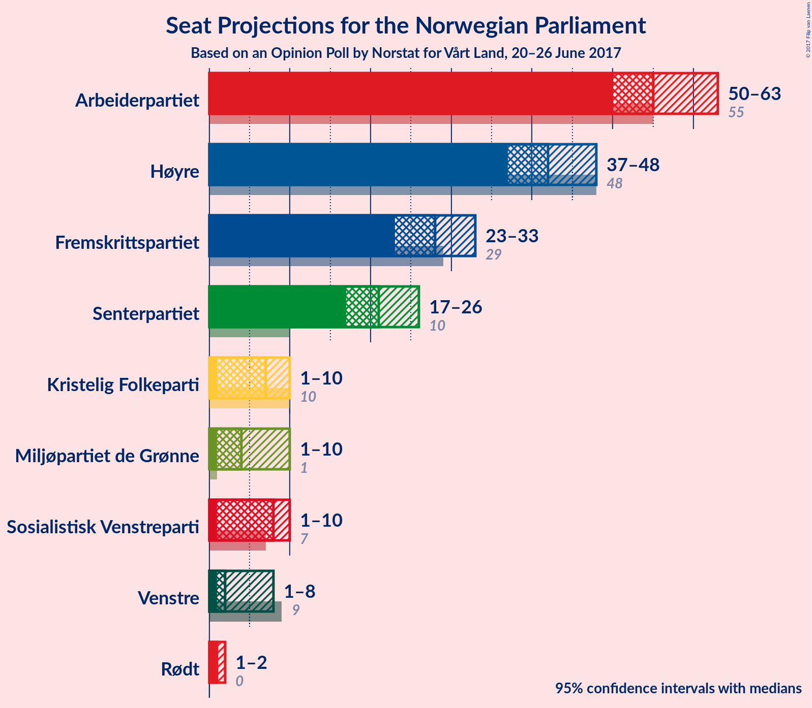

# Opinion Poll by Norstat for Vårt Land, 20–26 June 2017

<a href="#voting-intentions">Voting Intentions</a> | <a href="#seats">Seats</a> | <a href="#coalitions">Coalitions</a> | <a href="#technical-information">Technical Information</a>

## Voting Intentions

### Confidence Intervals

| Party | Last Result | Poll Result | 80% Confidence Interval | 90% Confidence Interval | 95% Confidence Interval | 99% Confidence Interval |
|:-----:|:-----------:|:-----------:|:-----------------------:|:-----------------------:|:-----------------------:|:-----------------------:|
| Arbeiderpartiet | 30.8% | 30.6% | 28.7–32.6% |28.2–33.2% |27.7–33.7% |26.9–34.6% |
| Høyre | 26.8% | 23.3% | 21.6–25.2% |21.2–25.7% |20.7–26.2% |19.9–27.1% |
| Fremskrittspartiet | 16.3% | 15.2% | 13.8–16.8% |13.4–17.3% |13.0–17.7% |12.4–18.4% |
| Senterpartiet | 5.5% | 11.7% | 10.4–13.1% |10.1–13.5% |9.8–13.9% |9.2–14.6% |
| Sosialistisk Venstreparti | 4.1% | 4.3% | 3.5–5.3% |3.3–5.5% |3.2–5.8% |2.8–6.3% |
| Kristelig Folkeparti | 5.6% | 4.1% | 3.4–5.0% |3.1–5.3% |3.0–5.5% |2.7–6.0% |
| Miljøpartiet de Grønne | 2.8% | 3.9% | 3.2–4.8% |3.0–5.1% |2.8–5.3% |2.5–5.8% |
| Venstre | 5.2% | 3.4% | 2.8–4.3% |2.6–4.6% |2.4–4.8% |2.1–5.3% |
| Rødt | 1.1% | 1.8% | 1.4–2.5% |1.2–2.7% |1.1–2.9% |1.0–3.3% |

*Note:* The poll result column reflects the actual value used in the calculations. Published results may vary slightly, and in addition be rounded to fewer digits.

## Seats

### Confidence Intervals

| Party | Last Result | Median | 80% Confidence Interval | 90% Confidence Interval | 95% Confidence Interval | 99% Confidence Interval |
|:-----:|:-----------:|:------:|:-----------------------:|:-----------------------:|:-----------------------:|:-----------------------:|
| <a href="#arbeiderpartiet">Arbeiderpartiet</a> | 55 | 55 | 52–61 |51–61 |50–63 |49–66 |
| <a href="#høyre">Høyre</a> | 48 | 42 | 39–46 |38–47 |37–48 |36–50 |
| <a href="#fremskrittspartiet">Fremskrittspartiet</a> | 29 | 28 | 25–31 |24–32 |23–33 |22–34 |
| <a href="#senterpartiet">Senterpartiet</a> | 10 | 21 | 19–24 |18–25 |17–26 |16–27 |
| <a href="#sosialistisk-venstreparti">Sosialistisk Venstreparti</a> | 7 | 8 | 1–10 |1–10 |1–10 |1–11 |
| <a href="#kristelig-folkeparti">Kristelig Folkeparti</a> | 10 | 7 | 2–9 |2–10 |1–10 |1–11 |
| <a href="#miljøpartiet-de-grønne">Miljøpartiet de Grønne</a> | 1 | 4 | 1–9 |1–9 |1–10 |1–10 |
| <a href="#venstre">Venstre</a> | 9 | 2 | 1–8 |1–8 |1–8 |0–10 |
| <a href="#rødt">Rødt</a> | 0 | 1 | 1 |1–2 |1–2 |0–2 |

### Arbeiderpartiet

| Number of Seats | Probability | Accumulated |
|:---------------:|:-----------:|:-----------:|
| 46 | 0.1% | 100% |
| 47 | 0.1% | 99.9% |
| 48 | 0.3% | 99.8% |
| 49 | 1.0% | 99.5% |
| 50 | 3% | 98.5% |
| 51 | 3% | 95% |
| 52 | 5% | 92% |
| 53 | 11% | 87% |
| 54 | 8% | 76% |
| 55 | 24% | 68% |
| 56 | 14% | 45% |
| 57 | 7% | 30% |
| 58 | 5% | 24% |
| 59 | 6% | 19% |
| 60 | 3% | 13% |
| 61 | 6% | 10% |
| 62 | 2% | 4% |
| 63 | 1.0% | 3% |
| 64 | 0.4% | 2% |
| 65 | 0.6% | 1.2% |
| 66 | 0.4% | 0.5% |
| 67 | 0% | 0.2% |
| 68 | 0.1% | 0.2% |
| 69 | 0% | 0% |

### Høyre

| Number of Seats | Probability | Accumulated |
|:---------------:|:-----------:|:-----------:|
| 33 | 0.1% | 100% |
| 34 | 0.1% | 99.9% |
| 35 | 0.3% | 99.9% |
| 36 | 0.6% | 99.6% |
| 37 | 2% | 99.0% |
| 38 | 5% | 97% |
| 39 | 5% | 92% |
| 40 | 10% | 87% |
| 41 | 21% | 77% |
| 42 | 7% | 56% |
| 43 | 9% | 49% |
| 44 | 15% | 41% |
| 45 | 13% | 26% |
| 46 | 4% | 12% |
| 47 | 4% | 8% |
| 48 | 2% | 4% |
| 49 | 1.4% | 2% |
| 50 | 0.7% | 1.0% |
| 51 | 0.1% | 0.3% |
| 52 | 0.1% | 0.2% |
| 53 | 0.1% | 0.1% |
| 54 | 0% | 0% |

### Fremskrittspartiet

| Number of Seats | Probability | Accumulated |
|:---------------:|:-----------:|:-----------:|
| 21 | 0.1% | 100% |
| 22 | 0.7% | 99.9% |
| 23 | 3% | 99.1% |
| 24 | 3% | 96% |
| 25 | 5% | 93% |
| 26 | 11% | 88% |
| 27 | 10% | 78% |
| 28 | 29% | 67% |
| 29 | 15% | 38% |
| 30 | 10% | 24% |
| 31 | 7% | 14% |
| 32 | 3% | 6% |
| 33 | 1.4% | 3% |
| 34 | 1.1% | 2% |
| 35 | 0.1% | 0.5% |
| 36 | 0.3% | 0.3% |
| 37 | 0% | 0% |

### Senterpartiet

| Number of Seats | Probability | Accumulated |
|:---------------:|:-----------:|:-----------:|
| 15 | 0.5% | 100% |
| 16 | 0.3% | 99.5% |
| 17 | 3% | 99.3% |
| 18 | 4% | 96% |
| 19 | 7% | 92% |
| 20 | 18% | 85% |
| 21 | 24% | 66% |
| 22 | 14% | 43% |
| 23 | 15% | 29% |
| 24 | 7% | 14% |
| 25 | 3% | 7% |
| 26 | 3% | 3% |
| 27 | 0.6% | 0.9% |
| 28 | 0.1% | 0.3% |
| 29 | 0.1% | 0.1% |
| 30 | 0% | 0% |

### Sosialistisk Venstreparti

| Number of Seats | Probability | Accumulated |
|:---------------:|:-----------:|:-----------:|
| 1 | 11% | 100% |
| 2 | 15% | 89% |
| 3 | 0% | 74% |
| 4 | 0% | 74% |
| 5 | 0% | 74% |
| 6 | 0% | 74% |
| 7 | 11% | 74% |
| 8 | 33% | 63% |
| 9 | 20% | 31% |
| 10 | 9% | 11% |
| 11 | 2% | 2% |
| 12 | 0.3% | 0.3% |
| 13 | 0% | 0.1% |
| 14 | 0% | 0% |

### Kristelig Folkeparti

| Number of Seats | Probability | Accumulated |
|:---------------:|:-----------:|:-----------:|
| 0 | 0.1% | 100% |
| 1 | 3% | 99.9% |
| 2 | 39% | 97% |
| 3 | 0.3% | 58% |
| 4 | 0% | 58% |
| 5 | 0% | 58% |
| 6 | 0% | 58% |
| 7 | 8% | 58% |
| 8 | 29% | 50% |
| 9 | 15% | 21% |
| 10 | 5% | 6% |
| 11 | 0.8% | 1.0% |
| 12 | 0.1% | 0.1% |
| 13 | 0% | 0% |

### Miljøpartiet de Grønne

| Number of Seats | Probability | Accumulated |
|:---------------:|:-----------:|:-----------:|
| 1 | 22% | 100% |
| 2 | 9% | 78% |
| 3 | 11% | 69% |
| 4 | 13% | 58% |
| 5 | 0% | 45% |
| 6 | 0% | 45% |
| 7 | 7% | 45% |
| 8 | 24% | 38% |
| 9 | 11% | 15% |
| 10 | 3% | 3% |
| 11 | 0.4% | 0.5% |
| 12 | 0% | 0% |

### Venstre

| Number of Seats | Probability | Accumulated |
|:---------------:|:-----------:|:-----------:|
| 0 | 0.8% | 100% |
| 1 | 30% | 99.2% |
| 2 | 42% | 69% |
| 3 | 5% | 27% |
| 4 | 0% | 22% |
| 5 | 0% | 22% |
| 6 | 0.4% | 22% |
| 7 | 7% | 21% |
| 8 | 12% | 14% |
| 9 | 2% | 2% |
| 10 | 0.5% | 0.5% |
| 11 | 0.1% | 0.1% |
| 12 | 0% | 0% |

### Rødt

| Number of Seats | Probability | Accumulated |
|:---------------:|:-----------:|:-----------:|
| 0 | 2% | 100% |
| 1 | 91% | 98% |
| 2 | 6% | 6% |
| 3 | 0% | 0% |

## Coalitions

### Confidence Intervals

| Coalition | Last Result | Median | 80% Confidence Interval | 90% Confidence Interval | 95% Confidence Interval | 99% Confidence Interval |
|:---------:|:-----------:|:------:|:-----------------------:|:-----------------------:|:-----------------------:|:-----------------------:|
| Høyre – Fremskrittspartiet – Senterpartiet – Kristelig Folkeparti – Venstre | 106 | 101 | 95–108 | 94–108 | 92–109 | 90–112 |
| Arbeiderpartiet – Senterpartiet – Sosialistisk Venstreparti – Kristelig Folkeparti – Miljøpartiet de Grønne | 83 | 94 | 89–100 | 88–101 | 86–102 | 83–103 |
| Arbeiderpartiet – Senterpartiet – Sosialistisk Venstreparti – Miljøpartiet de Grønne – Rødt | 73 | 90 | 84–95 | 82–96 | 81–98 | 79–101 |
| Arbeiderpartiet – Senterpartiet – Sosialistisk Venstreparti – Miljøpartiet de Grønne | 73 | 89 | 83–94 | 81–95 | 80–97 | 78–100 |
| Arbeiderpartiet – Senterpartiet – Sosialistisk Venstreparti – Rødt | 72 | 85 | 80–90 | 78–93 | 77–93 | 75–96 |
| Arbeiderpartiet – Senterpartiet – Sosialistisk Venstreparti | 72 | 84 | 79–89 | 77–92 | 76–92 | 74–95 |
| Høyre – Fremskrittspartiet – Kristelig Folkeparti – Miljøpartiet de Grønne – Venstre | 97 | 84 | 79–89 | 76–91 | 76–92 | 73–94 |
| Arbeiderpartiet – Senterpartiet – Kristelig Folkeparti | 75 | 83 | 78–88 | 76–90 | 74–90 | 73–93 |
| Høyre – Fremskrittspartiet – Kristelig Folkeparti – Venstre | 96 | 79 | 74–85 | 73–87 | 71–88 | 68–90 |
| Arbeiderpartiet – Senterpartiet | 65 | 77 | 72–82 | 72–84 | 71–86 | 68–91 |
| Høyre – Fremskrittspartiet | 77 | 70 | 66–75 | 64–77 | 64–78 | 61–81 |
| Arbeiderpartiet – Sosialistisk Venstreparti | 62 | 63 | 57–67 | 56–69 | 55–70 | 52–72 |
| Høyre – Kristelig Folkeparti – Venstre | 67 | 51 | 45–57 | 44–58 | 44–60 | 41–61 |
| Senterpartiet – Kristelig Folkeparti – Venstre | 29 | 30 | 25–36 | 24–37 | 22–39 | 21–40 |

### Høyre – Fremskrittspartiet – Senterpartiet – Kristelig Folkeparti – Venstre

| Number of Seats | Probability | Accumulated |
|:---------------:|:-----------:|:-----------:|
| 88 | 0.1% | 100% |
| 89 | 0% | 99.9% |
| 90 | 0.7% | 99.9% |
| 91 | 0.7% | 99.2% |
| 92 | 1.0% | 98% |
| 93 | 1.1% | 97% |
| 94 | 2% | 96% |
| 95 | 8% | 95% |
| 96 | 5% | 87% |
| 97 | 11% | 82% |
| 98 | 6% | 71% |
| 99 | 8% | 65% |
| 100 | 7% | 57% |
| 101 | 7% | 50% |
| 102 | 12% | 43% |
| 103 | 8% | 31% |
| 104 | 4% | 22% |
| 105 | 2% | 18% |
| 106 | 2% | 16% |
| 107 | 3% | 14% |
| 108 | 8% | 11% |
| 109 | 1.1% | 3% |
| 110 | 0.7% | 2% |
| 111 | 0.3% | 1.0% |
| 112 | 0.5% | 0.7% |
| 113 | 0.2% | 0.3% |
| 114 | 0.1% | 0.1% |
| 115 | 0% | 0% |

### Arbeiderpartiet – Senterpartiet – Sosialistisk Venstreparti – Kristelig Folkeparti – Miljøpartiet de Grønne

| Number of Seats | Probability | Accumulated |
|:---------------:|:-----------:|:-----------:|
| 81 | 0% | 100% |
| 82 | 0.1% | 99.9% |
| 83 | 0.9% | 99.9% |
| 84 | 0.6% | 98.9% |
| 85 | 0.6% | 98% |
| 86 | 1.0% | 98% |
| 87 | 1.1% | 97% |
| 88 | 2% | 96% |
| 89 | 6% | 93% |
| 90 | 4% | 87% |
| 91 | 7% | 83% |
| 92 | 7% | 76% |
| 93 | 5% | 70% |
| 94 | 15% | 65% |
| 95 | 9% | 50% |
| 96 | 10% | 40% |
| 97 | 13% | 30% |
| 98 | 3% | 17% |
| 99 | 4% | 14% |
| 100 | 4% | 10% |
| 101 | 2% | 6% |
| 102 | 3% | 4% |
| 103 | 0.6% | 1.0% |
| 104 | 0.2% | 0.5% |
| 105 | 0.2% | 0.3% |
| 106 | 0.1% | 0.1% |
| 107 | 0% | 0% |

### Arbeiderpartiet – Senterpartiet – Sosialistisk Venstreparti – Miljøpartiet de Grønne – Rødt

| Number of Seats | Probability | Accumulated |
|:---------------:|:-----------:|:-----------:|
| 76 | 0% | 100% |
| 77 | 0.1% | 99.9% |
| 78 | 0.1% | 99.9% |
| 79 | 0.6% | 99.8% |
| 80 | 0.3% | 99.2% |
| 81 | 3% | 98.8% |
| 82 | 3% | 96% |
| 83 | 2% | 93% |
| 84 | 5% | 91% |
| 85 | 5% | 86% |
| 86 | 3% | 82% |
| 87 | 8% | 79% |
| 88 | 8% | 71% |
| 89 | 11% | 63% |
| 90 | 10% | 52% |
| 91 | 7% | 42% |
| 92 | 3% | 35% |
| 93 | 12% | 32% |
| 94 | 5% | 20% |
| 95 | 8% | 16% |
| 96 | 4% | 8% |
| 97 | 0.9% | 4% |
| 98 | 2% | 3% |
| 99 | 0.6% | 1.4% |
| 100 | 0.2% | 0.8% |
| 101 | 0.4% | 0.6% |
| 102 | 0.1% | 0.2% |
| 103 | 0.1% | 0.1% |
| 104 | 0% | 0% |

### Arbeiderpartiet – Senterpartiet – Sosialistisk Venstreparti – Miljøpartiet de Grønne

| Number of Seats | Probability | Accumulated |
|:---------------:|:-----------:|:-----------:|
| 75 | 0% | 100% |
| 76 | 0.1% | 99.9% |
| 77 | 0.2% | 99.9% |
| 78 | 0.6% | 99.7% |
| 79 | 0.3% | 99.2% |
| 80 | 3% | 98.8% |
| 81 | 3% | 96% |
| 82 | 2% | 93% |
| 83 | 5% | 91% |
| 84 | 4% | 86% |
| 85 | 2% | 81% |
| 86 | 8% | 79% |
| 87 | 8% | 71% |
| 88 | 11% | 63% |
| 89 | 11% | 52% |
| 90 | 7% | 42% |
| 91 | 3% | 35% |
| 92 | 12% | 32% |
| 93 | 5% | 20% |
| 94 | 7% | 15% |
| 95 | 4% | 8% |
| 96 | 1.0% | 4% |
| 97 | 1.5% | 3% |
| 98 | 0.7% | 1.5% |
| 99 | 0.2% | 0.8% |
| 100 | 0.4% | 0.6% |
| 101 | 0.1% | 0.2% |
| 102 | 0.1% | 0.1% |
| 103 | 0% | 0% |

### Arbeiderpartiet – Senterpartiet – Sosialistisk Venstreparti – Rødt

| Number of Seats | Probability | Accumulated |
|:---------------:|:-----------:|:-----------:|
| 72 | 0.1% | 100% |
| 73 | 0.1% | 99.9% |
| 74 | 0.3% | 99.9% |
| 75 | 0.2% | 99.6% |
| 76 | 0.5% | 99.4% |
| 77 | 2% | 98.9% |
| 78 | 3% | 97% |
| 79 | 2% | 94% |
| 80 | 5% | 92% |
| 81 | 13% | 87% |
| 82 | 6% | 74% |
| 83 | 5% | 68% |
| 84 | 8% | 63% |
| 85 | 17% | 55% |
| 86 | 8% | 39% |
| 87 | 6% | 30% |
| 88 | 7% | 24% |
| 89 | 4% | 17% |
| 90 | 4% | 13% |
| 91 | 2% | 9% |
| 92 | 2% | 7% |
| 93 | 4% | 5% |
| 94 | 1.0% | 2% |
| 95 | 0.5% | 1.0% |
| 96 | 0.3% | 0.5% |
| 97 | 0.2% | 0.2% |
| 98 | 0% | 0% |

### Arbeiderpartiet – Senterpartiet – Sosialistisk Venstreparti

| Number of Seats | Probability | Accumulated |
|:---------------:|:-----------:|:-----------:|
| 71 | 0.1% | 100% |
| 72 | 0.2% | 99.9% |
| 73 | 0.2% | 99.8% |
| 74 | 0.2% | 99.6% |
| 75 | 0.6% | 99.4% |
| 76 | 2% | 98.8% |
| 77 | 3% | 97% |
| 78 | 2% | 94% |
| 79 | 5% | 92% |
| 80 | 13% | 87% |
| 81 | 6% | 74% |
| 82 | 5% | 68% |
| 83 | 8% | 63% |
| 84 | 16% | 55% |
| 85 | 8% | 38% |
| 86 | 6% | 30% |
| 87 | 7% | 24% |
| 88 | 5% | 17% |
| 89 | 3% | 12% |
| 90 | 2% | 9% |
| 91 | 1.0% | 6% |
| 92 | 4% | 6% |
| 93 | 1.0% | 2% |
| 94 | 0.5% | 1.0% |
| 95 | 0.3% | 0.5% |
| 96 | 0.1% | 0.2% |
| 97 | 0.1% | 0.1% |
| 98 | 0% | 0% |

### Høyre – Fremskrittspartiet – Kristelig Folkeparti – Miljøpartiet de Grønne – Venstre

| Number of Seats | Probability | Accumulated |
|:---------------:|:-----------:|:-----------:|
| 72 | 0.2% | 100% |
| 73 | 0.3% | 99.8% |
| 74 | 0.5% | 99.5% |
| 75 | 1.0% | 99.0% |
| 76 | 4% | 98% |
| 77 | 2% | 95% |
| 78 | 2% | 93% |
| 79 | 4% | 91% |
| 80 | 4% | 87% |
| 81 | 7% | 83% |
| 82 | 6% | 76% |
| 83 | 8% | 70% |
| 84 | 17% | 61% |
| 85 | 8% | 45% |
| 86 | 5% | 37% |
| 87 | 6% | 32% |
| 88 | 13% | 26% |
| 89 | 5% | 13% |
| 90 | 2% | 8% |
| 91 | 3% | 6% |
| 92 | 2% | 3% |
| 93 | 0.5% | 1.1% |
| 94 | 0.2% | 0.6% |
| 95 | 0.3% | 0.4% |
| 96 | 0.1% | 0.1% |
| 97 | 0.1% | 0.1% |
| 98 | 0% | 0% |

### Arbeiderpartiet – Senterpartiet – Kristelig Folkeparti

| Number of Seats | Probability | Accumulated |
|:---------------:|:-----------:|:-----------:|
| 71 | 0.1% | 100% |
| 72 | 0.2% | 99.9% |
| 73 | 0.5% | 99.8% |
| 74 | 3% | 99.3% |
| 75 | 0.9% | 96% |
| 76 | 2% | 96% |
| 77 | 2% | 94% |
| 78 | 10% | 91% |
| 79 | 5% | 81% |
| 80 | 8% | 76% |
| 81 | 10% | 68% |
| 82 | 4% | 58% |
| 83 | 11% | 54% |
| 84 | 9% | 43% |
| 85 | 6% | 34% |
| 86 | 9% | 28% |
| 87 | 7% | 19% |
| 88 | 5% | 13% |
| 89 | 2% | 8% |
| 90 | 3% | 5% |
| 91 | 0.8% | 2% |
| 92 | 0.3% | 2% |
| 93 | 0.8% | 1.2% |
| 94 | 0.2% | 0.4% |
| 95 | 0.1% | 0.3% |
| 96 | 0.1% | 0.2% |
| 97 | 0% | 0% |

### Høyre – Fremskrittspartiet – Kristelig Folkeparti – Venstre

| Number of Seats | Probability | Accumulated |
|:---------------:|:-----------:|:-----------:|
| 66 | 0.1% | 100% |
| 67 | 0.1% | 99.9% |
| 68 | 0.4% | 99.8% |
| 69 | 0.2% | 99.4% |
| 70 | 0.6% | 99.2% |
| 71 | 2% | 98.6% |
| 72 | 0.9% | 97% |
| 73 | 4% | 96% |
| 74 | 8% | 92% |
| 75 | 5% | 84% |
| 76 | 12% | 80% |
| 77 | 3% | 68% |
| 78 | 7% | 65% |
| 79 | 10% | 58% |
| 80 | 11% | 48% |
| 81 | 8% | 37% |
| 82 | 8% | 29% |
| 83 | 3% | 21% |
| 84 | 5% | 18% |
| 85 | 5% | 14% |
| 86 | 2% | 9% |
| 87 | 3% | 7% |
| 88 | 3% | 4% |
| 89 | 0.3% | 1.2% |
| 90 | 0.6% | 0.8% |
| 91 | 0.1% | 0.2% |
| 92 | 0.1% | 0.1% |
| 93 | 0% | 0.1% |
| 94 | 0% | 0% |

### Arbeiderpartiet – Senterpartiet

| Number of Seats | Probability | Accumulated |
|:---------------:|:-----------:|:-----------:|
| 66 | 0% | 100% |
| 67 | 0.1% | 99.9% |
| 68 | 0.8% | 99.8% |
| 69 | 0.4% | 99.0% |
| 70 | 0.7% | 98.6% |
| 71 | 2% | 98% |
| 72 | 8% | 96% |
| 73 | 7% | 88% |
| 74 | 4% | 81% |
| 75 | 14% | 77% |
| 76 | 12% | 63% |
| 77 | 9% | 51% |
| 78 | 13% | 42% |
| 79 | 7% | 30% |
| 80 | 4% | 22% |
| 81 | 4% | 18% |
| 82 | 4% | 13% |
| 83 | 2% | 9% |
| 84 | 3% | 7% |
| 85 | 1.2% | 4% |
| 86 | 1.3% | 3% |
| 87 | 0.6% | 1.5% |
| 88 | 0.2% | 0.8% |
| 89 | 0.1% | 0.6% |
| 90 | 0% | 0.6% |
| 91 | 0.5% | 0.6% |
| 92 | 0.1% | 0.1% |
| 93 | 0% | 0% |

### Høyre – Fremskrittspartiet

| Number of Seats | Probability | Accumulated |
|:---------------:|:-----------:|:-----------:|
| 59 | 0.1% | 100% |
| 60 | 0.1% | 99.9% |
| 61 | 0.5% | 99.8% |
| 62 | 0.5% | 99.4% |
| 63 | 0.8% | 98.9% |
| 64 | 4% | 98% |
| 65 | 2% | 94% |
| 66 | 5% | 92% |
| 67 | 4% | 87% |
| 68 | 6% | 83% |
| 69 | 12% | 77% |
| 70 | 15% | 65% |
| 71 | 9% | 50% |
| 72 | 14% | 41% |
| 73 | 9% | 26% |
| 74 | 5% | 17% |
| 75 | 4% | 12% |
| 76 | 2% | 8% |
| 77 | 3% | 6% |
| 78 | 1.0% | 3% |
| 79 | 2% | 2% |
| 80 | 0.2% | 0.7% |
| 81 | 0.1% | 0.5% |
| 82 | 0.4% | 0.5% |
| 83 | 0% | 0.1% |
| 84 | 0.1% | 0.1% |
| 85 | 0% | 0% |

### Arbeiderpartiet – Sosialistisk Venstreparti

| Number of Seats | Probability | Accumulated |
|:---------------:|:-----------:|:-----------:|
| 50 | 0.1% | 100% |
| 51 | 0.1% | 99.9% |
| 52 | 0.4% | 99.8% |
| 53 | 0.3% | 99.5% |
| 54 | 2% | 99.2% |
| 55 | 1.2% | 98% |
| 56 | 4% | 96% |
| 57 | 4% | 93% |
| 58 | 5% | 88% |
| 59 | 6% | 83% |
| 60 | 9% | 77% |
| 61 | 6% | 68% |
| 62 | 6% | 62% |
| 63 | 20% | 56% |
| 64 | 10% | 36% |
| 65 | 7% | 26% |
| 66 | 6% | 19% |
| 67 | 4% | 13% |
| 68 | 3% | 9% |
| 69 | 3% | 6% |
| 70 | 1.1% | 3% |
| 71 | 2% | 2% |
| 72 | 0.2% | 0.7% |
| 73 | 0.3% | 0.5% |
| 74 | 0% | 0.2% |
| 75 | 0.1% | 0.1% |
| 76 | 0% | 0% |

### Høyre – Kristelig Folkeparti – Venstre

| Number of Seats | Probability | Accumulated |
|:---------------:|:-----------:|:-----------:|
| 40 | 0% | 100% |
| 41 | 0.5% | 99.9% |
| 42 | 0.3% | 99.5% |
| 43 | 0.4% | 99.1% |
| 44 | 7% | 98.7% |
| 45 | 2% | 91% |
| 46 | 2% | 90% |
| 47 | 7% | 88% |
| 48 | 12% | 80% |
| 49 | 6% | 69% |
| 50 | 5% | 63% |
| 51 | 13% | 58% |
| 52 | 6% | 45% |
| 53 | 7% | 38% |
| 54 | 11% | 31% |
| 55 | 4% | 20% |
| 56 | 2% | 16% |
| 57 | 5% | 13% |
| 58 | 3% | 8% |
| 59 | 2% | 5% |
| 60 | 0.6% | 3% |
| 61 | 2% | 2% |
| 62 | 0.1% | 0.4% |
| 63 | 0.1% | 0.2% |
| 64 | 0.1% | 0.1% |
| 65 | 0% | 0% |

### Senterpartiet – Kristelig Folkeparti – Venstre

| Number of Seats | Probability | Accumulated |
|:---------------:|:-----------:|:-----------:|
| 20 | 0.2% | 100% |
| 21 | 1.0% | 99.8% |
| 22 | 2% | 98.8% |
| 23 | 1.3% | 97% |
| 24 | 3% | 96% |
| 25 | 15% | 93% |
| 26 | 4% | 78% |
| 27 | 5% | 75% |
| 28 | 4% | 70% |
| 29 | 10% | 66% |
| 30 | 10% | 56% |
| 31 | 9% | 46% |
| 32 | 9% | 37% |
| 33 | 8% | 28% |
| 34 | 6% | 20% |
| 35 | 3% | 14% |
| 36 | 6% | 11% |
| 37 | 0.8% | 5% |
| 38 | 0.6% | 4% |
| 39 | 3% | 4% |
| 40 | 0.3% | 0.6% |
| 41 | 0.2% | 0.3% |
| 42 | 0% | 0.1% |
| 43 | 0% | 0% |

## Technical Information

### Opinion Poll

+ **Pollster:** Norstat
+ **Media:** Vårt Land
+ **Fieldwork period:** 20–26 June 2017

### Calculations

+ **Sample size:** 934
+ **Simulations done:** 2,097,152
+ **Error estimate:** 1.05%

