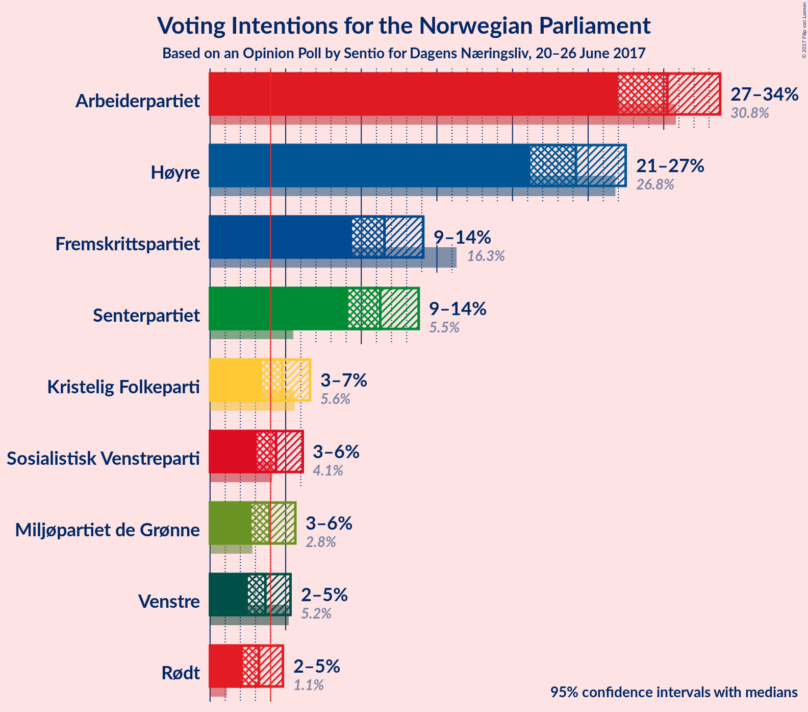

# Opinion Poll by Sentio for Dagens Nærinsliv, 20–26 June 2017

<a href="#voting-intentions">Voting Intentions</a> | <a href="#seats">Seats</a> | <a href="#coalitions">Coalitions</a> | <a href="#technical-information">Technical Information</a>

## Voting Intentions

### Confidence Intervals

| Party | Last Result | Poll Result | 80% Confidence Interval | 90% Confidence Interval | 95% Confidence Interval | 99% Confidence Interval |
|:-----:|:-----------:|:-----------:|:-----------------------:|:-----------------------:|:-----------------------:|:-----------------------:|
| Arbeiderpartiet | 30.8% | 30.2% | 28.1–32.5% |27.5–33.2% |27.0–33.7% |26.0–34.8% |
| Høyre | 26.8% | 24.2% | 22.2–26.3% |21.7–26.9% |21.2–27.5% |20.3–28.5% |
| Fremskrittspartiet | 16.3% | 11.5% | 10.1–13.2% |9.7–13.7% |9.4–14.1% |8.7–14.9% |
| Senterpartiet | 5.5% | 11.3% | 9.9–12.9% |9.5–13.4% |9.1–13.8% |8.5–14.6% |
| Kristelig Folkeparti | 5.6% | 4.8% | 3.9–6.0% |3.6–6.3% |3.4–6.6% |3.1–7.2% |
| Sosialistisk Venstreparti | 4.1% | 4.4% | 3.5–5.5% |3.3–5.8% |3.1–6.1% |2.7–6.7% |
| Miljøpartiet de Grønne | 2.8% | 3.9% | 3.1–5.0% |2.9–5.4% |2.7–5.6% |2.4–6.2% |
| Venstre | 5.2% | 3.7% | 2.9–4.7% |2.7–5.0% |2.5–5.3% |2.2–5.9% |
| Rødt | 1.1% | 3.2% | 2.5–4.3% |2.3–4.6% |2.2–4.8% |1.9–5.3% |

*Note:* The poll result column reflects the actual value used in the calculations. Published results may vary slightly, and in addition be rounded to fewer digits.

## Seats

### Confidence Intervals

| Party | Last Result | Median | 80% Confidence Interval | 90% Confidence Interval | 95% Confidence Interval | 99% Confidence Interval |
|:-----:|:-----------:|:------:|:-----------------------:|:-----------------------:|:-----------------------:|:-----------------------:|
| <a href="#arbeiderpartiet">Arbeiderpartiet</a> | 55 | 56 | 51–62 |50–63 |50–65 |48–67 |
| <a href="#høyre">Høyre</a> | 48 | 43 | 39–48 |38–50 |38–52 |36–53 |
| <a href="#fremskrittspartiet">Fremskrittspartiet</a> | 29 | 21 | 18–25 |17–26 |16–27 |15–28 |
| <a href="#senterpartiet">Senterpartiet</a> | 10 | 20 | 18–23 |17–24 |16–25 |14–27 |
| <a href="#kristelig-folkeparti">Kristelig Folkeparti</a> | 10 | 9 | 2–10 |2–11 |2–12 |2–13 |
| <a href="#sosialistisk-venstreparti">Sosialistisk Venstreparti</a> | 7 | 8 | 2–10 |1–10 |1–11 |1–12 |
| <a href="#miljøpartiet-de-grønne">Miljøpartiet de Grønne</a> | 1 | 7 | 1–9 |1–9 |1–10 |1–11 |
| <a href="#venstre">Venstre</a> | 9 | 2 | 1–8 |1–9 |1–9 |0–10 |
| <a href="#rødt">Rødt</a> | 0 | 2 | 1–7 |1–8 |1–8 |1–10 |

### Arbeiderpartiet

| Number of Seats | Probability | Accumulated |
|:---------------:|:-----------:|:-----------:|
| 46 | 0.1% | 100% |
| 47 | 0.2% | 99.8% |
| 48 | 0.9% | 99.6% |
| 49 | 1.1% | 98.7% |
| 50 | 4% | 98% |
| 51 | 4% | 94% |
| 52 | 3% | 89% |
| 53 | 10% | 87% |
| 54 | 16% | 77% |
| 55 | 4% | 60% |
| 56 | 10% | 56% |
| 57 | 8% | 46% |
| 58 | 7% | 38% |
| 59 | 5% | 31% |
| 60 | 9% | 26% |
| 61 | 4% | 17% |
| 62 | 7% | 13% |
| 63 | 2% | 5% |
| 64 | 1.4% | 4% |
| 65 | 1.0% | 3% |
| 66 | 0.8% | 2% |
| 67 | 0.6% | 0.8% |
| 68 | 0.2% | 0.2% |
| 69 | 0% | 0% |

### Høyre

| Number of Seats | Probability | Accumulated |
|:---------------:|:-----------:|:-----------:|
| 34 | 0% | 100% |
| 35 | 0.2% | 99.9% |
| 36 | 1.0% | 99.8% |
| 37 | 1.1% | 98.8% |
| 38 | 4% | 98% |
| 39 | 5% | 94% |
| 40 | 6% | 89% |
| 41 | 6% | 83% |
| 42 | 12% | 78% |
| 43 | 17% | 65% |
| 44 | 7% | 49% |
| 45 | 6% | 41% |
| 46 | 7% | 36% |
| 47 | 16% | 29% |
| 48 | 5% | 13% |
| 49 | 1.4% | 7% |
| 50 | 2% | 6% |
| 51 | 2% | 4% |
| 52 | 2% | 3% |
| 53 | 0.6% | 0.9% |
| 54 | 0.1% | 0.4% |
| 55 | 0.1% | 0.3% |
| 56 | 0.1% | 0.2% |
| 57 | 0.1% | 0.1% |
| 58 | 0% | 0% |

### Fremskrittspartiet

| Number of Seats | Probability | Accumulated |
|:---------------:|:-----------:|:-----------:|
| 14 | 0.2% | 100% |
| 15 | 0.7% | 99.8% |
| 16 | 2% | 99.1% |
| 17 | 3% | 97% |
| 18 | 8% | 94% |
| 19 | 17% | 85% |
| 20 | 10% | 68% |
| 21 | 16% | 58% |
| 22 | 8% | 42% |
| 23 | 16% | 34% |
| 24 | 6% | 17% |
| 25 | 6% | 11% |
| 26 | 2% | 5% |
| 27 | 2% | 3% |
| 28 | 1.1% | 1.3% |
| 29 | 0.2% | 0.2% |
| 30 | 0% | 0% |

### Senterpartiet

| Number of Seats | Probability | Accumulated |
|:---------------:|:-----------:|:-----------:|
| 13 | 0.1% | 100% |
| 14 | 0.4% | 99.9% |
| 15 | 1.0% | 99.4% |
| 16 | 2% | 98% |
| 17 | 4% | 97% |
| 18 | 9% | 93% |
| 19 | 17% | 84% |
| 20 | 23% | 67% |
| 21 | 13% | 45% |
| 22 | 11% | 32% |
| 23 | 11% | 21% |
| 24 | 7% | 10% |
| 25 | 1.4% | 3% |
| 26 | 1.1% | 2% |
| 27 | 0.3% | 0.7% |
| 28 | 0.4% | 0.5% |
| 29 | 0.1% | 0.1% |
| 30 | 0% | 0% |

### Kristelig Folkeparti

| Number of Seats | Probability | Accumulated |
|:---------------:|:-----------:|:-----------:|
| 1 | 0.4% | 100% |
| 2 | 12% | 99.6% |
| 3 | 0.2% | 88% |
| 4 | 0% | 87% |
| 5 | 0% | 87% |
| 6 | 0.3% | 87% |
| 7 | 8% | 87% |
| 8 | 24% | 80% |
| 9 | 23% | 55% |
| 10 | 24% | 32% |
| 11 | 5% | 8% |
| 12 | 2% | 3% |
| 13 | 0.7% | 1.0% |
| 14 | 0.3% | 0.3% |
| 15 | 0% | 0.1% |
| 16 | 0% | 0% |

### Sosialistisk Venstreparti

| Number of Seats | Probability | Accumulated |
|:---------------:|:-----------:|:-----------:|
| 0 | 0.1% | 100% |
| 1 | 9% | 99.9% |
| 2 | 16% | 91% |
| 3 | 0% | 75% |
| 4 | 0% | 75% |
| 5 | 0% | 75% |
| 6 | 0.3% | 75% |
| 7 | 7% | 75% |
| 8 | 31% | 68% |
| 9 | 25% | 37% |
| 10 | 8% | 12% |
| 11 | 2% | 3% |
| 12 | 0.9% | 1.3% |
| 13 | 0.3% | 0.4% |
| 14 | 0% | 0.1% |
| 15 | 0% | 0% |

### Miljøpartiet de Grønne

| Number of Seats | Probability | Accumulated |
|:---------------:|:-----------:|:-----------:|
| 1 | 21% | 100% |
| 2 | 9% | 79% |
| 3 | 16% | 70% |
| 4 | 2% | 55% |
| 5 | 0% | 52% |
| 6 | 0.4% | 52% |
| 7 | 12% | 52% |
| 8 | 24% | 40% |
| 9 | 11% | 16% |
| 10 | 3% | 4% |
| 11 | 0.8% | 1.0% |
| 12 | 0.2% | 0.2% |
| 13 | 0% | 0% |

### Venstre

| Number of Seats | Probability | Accumulated |
|:---------------:|:-----------:|:-----------:|
| 0 | 1.1% | 100% |
| 1 | 19% | 98.9% |
| 2 | 40% | 80% |
| 3 | 8% | 40% |
| 4 | 0% | 32% |
| 5 | 0% | 32% |
| 6 | 0.7% | 32% |
| 7 | 10% | 32% |
| 8 | 14% | 21% |
| 9 | 6% | 8% |
| 10 | 1.4% | 2% |
| 11 | 0.3% | 0.4% |
| 12 | 0.1% | 0.1% |
| 13 | 0% | 0% |

### Rødt

| Number of Seats | Probability | Accumulated |
|:---------------:|:-----------:|:-----------:|
| 1 | 13% | 100% |
| 2 | 73% | 87% |
| 3 | 0% | 14% |
| 4 | 0% | 14% |
| 5 | 0% | 14% |
| 6 | 1.0% | 14% |
| 7 | 5% | 13% |
| 8 | 6% | 8% |
| 9 | 2% | 2% |
| 10 | 0.5% | 0.5% |
| 11 | 0% | 0.1% |
| 12 | 0% | 0% |

## Coalitions

### Confidence Intervals

| Coalition | Last Result | Median | 80% Confidence Interval | 90% Confidence Interval | 95% Confidence Interval | 99% Confidence Interval |
|:---------:|:-----------:|:------:|:-----------------------:|:-----------------------:|:-----------------------:|:-----------------------:|
| Høyre – Fremskrittspartiet – Senterpartiet – Kristelig Folkeparti – Venstre | 106 | 98 | 91–104 | 90–106 | 88–108 | 83–110 |
| Arbeiderpartiet – Senterpartiet – Kristelig Folkeparti – Sosialistisk Venstreparti – Miljøpartiet de Grønne | 83 | 97 | 91–104 | 89–104 | 87–105 | 84–107 |
| Arbeiderpartiet – Senterpartiet – Sosialistisk Venstreparti – Miljøpartiet de Grønne – Rødt | 73 | 93 | 85–99 | 83–100 | 83–100 | 79–103 |
| Arbeiderpartiet – Senterpartiet – Sosialistisk Venstreparti – Miljøpartiet de Grønne | 73 | 89 | 82–95 | 81–96 | 79–98 | 76–100 |
| Arbeiderpartiet – Senterpartiet – Sosialistisk Venstreparti – Rødt | 72 | 87 | 80–93 | 78–95 | 78–97 | 75–98 |
| Arbeiderpartiet – Senterpartiet – Sosialistisk Venstreparti | 72 | 84 | 77–90 | 76–91 | 75–92 | 72–94 |
| Høyre – Fremskrittspartiet – Kristelig Folkeparti – Miljøpartiet de Grønne – Venstre | 97 | 82 | 76–89 | 74–91 | 72–91 | 70–94 |
| Høyre – Fremskrittspartiet – Kristelig Folkeparti – Venstre | 96 | 76 | 70–84 | 69–86 | 68–86 | 65–90 |
| Høyre – Fremskrittspartiet | 77 | 65 | 59–71 | 57–72 | 56–74 | 54–76 |
| Høyre – Kristelig Folkeparti – Venstre | 67 | 56 | 50–62 | 49–65 | 47–65 | 45–70 |
| Senterpartiet – Kristelig Folkeparti – Venstre | 29 | 32 | 27–38 | 25–39 | 24–41 | 22–43 |

### Høyre – Fremskrittspartiet – Senterpartiet – Kristelig Folkeparti – Venstre

| Number of Seats | Probability | Accumulated |
|:---------------:|:-----------:|:-----------:|
| 80 | 0% | 100% |
| 81 | 0% | 99.9% |
| 82 | 0.2% | 99.9% |
| 83 | 0.5% | 99.7% |
| 84 | 0.3% | 99.3% |
| 85 | 0.3% | 99.0% |
| 86 | 0.5% | 98.7% |
| 87 | 0.6% | 98% |
| 88 | 1.2% | 98% |
| 89 | 1.4% | 96% |
| 90 | 3% | 95% |
| 91 | 8% | 92% |
| 92 | 3% | 84% |
| 93 | 8% | 81% |
| 94 | 6% | 73% |
| 95 | 4% | 67% |
| 96 | 7% | 63% |
| 97 | 6% | 56% |
| 98 | 7% | 51% |
| 99 | 8% | 43% |
| 100 | 3% | 36% |
| 101 | 4% | 33% |
| 102 | 6% | 29% |
| 103 | 8% | 23% |
| 104 | 5% | 15% |
| 105 | 2% | 10% |
| 106 | 4% | 8% |
| 107 | 1.4% | 4% |
| 108 | 0.9% | 3% |
| 109 | 0.9% | 2% |
| 110 | 0.6% | 0.9% |
| 111 | 0.1% | 0.3% |
| 112 | 0.1% | 0.2% |
| 113 | 0% | 0.1% |
| 114 | 0% | 0.1% |
| 115 | 0% | 0% |

### Arbeiderpartiet – Senterpartiet – Kristelig Folkeparti – Sosialistisk Venstreparti – Miljøpartiet de Grønne

| Number of Seats | Probability | Accumulated |
|:---------------:|:-----------:|:-----------:|
| 80 | 0.1% | 100% |
| 81 | 0% | 99.9% |
| 82 | 0.1% | 99.9% |
| 83 | 0.1% | 99.8% |
| 84 | 0.4% | 99.7% |
| 85 | 0.3% | 99.3% |
| 86 | 1.3% | 99.0% |
| 87 | 1.1% | 98% |
| 88 | 0.9% | 97% |
| 89 | 2% | 96% |
| 90 | 2% | 94% |
| 91 | 4% | 92% |
| 92 | 3% | 88% |
| 93 | 9% | 85% |
| 94 | 6% | 76% |
| 95 | 12% | 70% |
| 96 | 5% | 58% |
| 97 | 3% | 53% |
| 98 | 7% | 49% |
| 99 | 5% | 43% |
| 100 | 8% | 38% |
| 101 | 7% | 29% |
| 102 | 3% | 22% |
| 103 | 5% | 19% |
| 104 | 9% | 13% |
| 105 | 3% | 5% |
| 106 | 0.9% | 2% |
| 107 | 0.4% | 0.8% |
| 108 | 0.2% | 0.4% |
| 109 | 0.1% | 0.2% |
| 110 | 0.1% | 0.1% |
| 111 | 0% | 0.1% |
| 112 | 0% | 0% |

### Arbeiderpartiet – Senterpartiet – Sosialistisk Venstreparti – Miljøpartiet de Grønne – Rødt

| Number of Seats | Probability | Accumulated |
|:---------------:|:-----------:|:-----------:|
| 75 | 0% | 100% |
| 76 | 0% | 99.9% |
| 77 | 0.1% | 99.9% |
| 78 | 0.2% | 99.8% |
| 79 | 0.5% | 99.7% |
| 80 | 0.4% | 99.1% |
| 81 | 0.3% | 98.7% |
| 82 | 0.5% | 98% |
| 83 | 4% | 98% |
| 84 | 3% | 94% |
| 85 | 5% | 91% |
| 86 | 3% | 86% |
| 87 | 11% | 83% |
| 88 | 3% | 72% |
| 89 | 8% | 70% |
| 90 | 5% | 62% |
| 91 | 4% | 57% |
| 92 | 3% | 53% |
| 93 | 7% | 50% |
| 94 | 5% | 43% |
| 95 | 9% | 38% |
| 96 | 8% | 28% |
| 97 | 8% | 20% |
| 98 | 2% | 12% |
| 99 | 5% | 10% |
| 100 | 3% | 5% |
| 101 | 0.6% | 2% |
| 102 | 0.4% | 1.4% |
| 103 | 0.5% | 0.9% |
| 104 | 0.2% | 0.4% |
| 105 | 0.1% | 0.2% |
| 106 | 0.1% | 0.2% |
| 107 | 0% | 0% |

### Arbeiderpartiet – Senterpartiet – Sosialistisk Venstreparti – Miljøpartiet de Grønne

| Number of Seats | Probability | Accumulated |
|:---------------:|:-----------:|:-----------:|
| 73 | 0% | 100% |
| 74 | 0% | 99.9% |
| 75 | 0.3% | 99.9% |
| 76 | 0.7% | 99.6% |
| 77 | 0.5% | 99.0% |
| 78 | 0.6% | 98% |
| 79 | 0.6% | 98% |
| 80 | 1.1% | 97% |
| 81 | 4% | 96% |
| 82 | 3% | 92% |
| 83 | 3% | 89% |
| 84 | 5% | 86% |
| 85 | 11% | 81% |
| 86 | 3% | 69% |
| 87 | 7% | 67% |
| 88 | 7% | 60% |
| 89 | 4% | 53% |
| 90 | 3% | 49% |
| 91 | 8% | 46% |
| 92 | 6% | 38% |
| 93 | 9% | 32% |
| 94 | 8% | 23% |
| 95 | 6% | 15% |
| 96 | 4% | 9% |
| 97 | 2% | 5% |
| 98 | 2% | 3% |
| 99 | 0.5% | 1.1% |
| 100 | 0.3% | 0.6% |
| 101 | 0.1% | 0.3% |
| 102 | 0.1% | 0.2% |
| 103 | 0% | 0.1% |
| 104 | 0.1% | 0.1% |
| 105 | 0% | 0% |

### Arbeiderpartiet – Senterpartiet – Sosialistisk Venstreparti – Rødt

| Number of Seats | Probability | Accumulated |
|:---------------:|:-----------:|:-----------:|
| 71 | 0% | 100% |
| 72 | 0.1% | 99.9% |
| 73 | 0.1% | 99.9% |
| 74 | 0.1% | 99.8% |
| 75 | 0.3% | 99.6% |
| 76 | 0.4% | 99.4% |
| 77 | 1.4% | 99.0% |
| 78 | 4% | 98% |
| 79 | 3% | 94% |
| 80 | 6% | 91% |
| 81 | 6% | 85% |
| 82 | 4% | 79% |
| 83 | 5% | 76% |
| 84 | 9% | 71% |
| 85 | 4% | 62% |
| 86 | 5% | 59% |
| 87 | 8% | 54% |
| 88 | 7% | 46% |
| 89 | 9% | 38% |
| 90 | 9% | 29% |
| 91 | 4% | 20% |
| 92 | 6% | 16% |
| 93 | 4% | 10% |
| 94 | 1.2% | 7% |
| 95 | 2% | 6% |
| 96 | 1.0% | 4% |
| 97 | 1.0% | 3% |
| 98 | 2% | 2% |
| 99 | 0.1% | 0.2% |
| 100 | 0% | 0.1% |
| 101 | 0% | 0.1% |
| 102 | 0% | 0% |

### Arbeiderpartiet – Senterpartiet – Sosialistisk Venstreparti

| Number of Seats | Probability | Accumulated |
|:---------------:|:-----------:|:-----------:|
| 69 | 0.1% | 100% |
| 70 | 0.1% | 99.9% |
| 71 | 0.1% | 99.8% |
| 72 | 0.3% | 99.7% |
| 73 | 0.7% | 99.4% |
| 74 | 1.0% | 98.8% |
| 75 | 2% | 98% |
| 76 | 4% | 96% |
| 77 | 4% | 92% |
| 78 | 6% | 89% |
| 79 | 5% | 83% |
| 80 | 5% | 78% |
| 81 | 5% | 73% |
| 82 | 7% | 69% |
| 83 | 5% | 61% |
| 84 | 6% | 56% |
| 85 | 9% | 50% |
| 86 | 7% | 41% |
| 87 | 9% | 34% |
| 88 | 8% | 25% |
| 89 | 5% | 16% |
| 90 | 4% | 11% |
| 91 | 3% | 7% |
| 92 | 1.0% | 3% |
| 93 | 0.4% | 2% |
| 94 | 2% | 2% |
| 95 | 0.2% | 0.5% |
| 96 | 0.1% | 0.2% |
| 97 | 0.1% | 0.1% |
| 98 | 0% | 0% |

### Høyre – Fremskrittspartiet – Kristelig Folkeparti – Miljøpartiet de Grønne – Venstre

| Number of Seats | Probability | Accumulated |
|:---------------:|:-----------:|:-----------:|
| 66 | 0.1% | 100% |
| 67 | 0% | 99.9% |
| 68 | 0% | 99.9% |
| 69 | 0.1% | 99.8% |
| 70 | 0.2% | 99.7% |
| 71 | 2% | 99.5% |
| 72 | 1.2% | 98% |
| 73 | 1.1% | 97% |
| 74 | 2% | 95% |
| 75 | 1.3% | 93% |
| 76 | 4% | 92% |
| 77 | 6% | 88% |
| 78 | 4% | 83% |
| 79 | 9% | 78% |
| 80 | 9% | 69% |
| 81 | 7% | 60% |
| 82 | 9% | 53% |
| 83 | 5% | 44% |
| 84 | 4% | 40% |
| 85 | 8% | 36% |
| 86 | 5% | 28% |
| 87 | 4% | 23% |
| 88 | 6% | 19% |
| 89 | 6% | 14% |
| 90 | 2% | 8% |
| 91 | 4% | 5% |
| 92 | 1.0% | 2% |
| 93 | 0.3% | 0.9% |
| 94 | 0.2% | 0.6% |
| 95 | 0.1% | 0.3% |
| 96 | 0.1% | 0.2% |
| 97 | 0% | 0.1% |
| 98 | 0% | 0.1% |
| 99 | 0% | 0% |

### Høyre – Fremskrittspartiet – Kristelig Folkeparti – Venstre

| Number of Seats | Probability | Accumulated |
|:---------------:|:-----------:|:-----------:|
| 62 | 0.1% | 100% |
| 63 | 0.1% | 99.9% |
| 64 | 0.1% | 99.7% |
| 65 | 0.4% | 99.6% |
| 66 | 0.6% | 99.2% |
| 67 | 0.5% | 98.6% |
| 68 | 0.7% | 98% |
| 69 | 3% | 97% |
| 70 | 5% | 94% |
| 71 | 2% | 89% |
| 72 | 8% | 87% |
| 73 | 8% | 79% |
| 74 | 9% | 71% |
| 75 | 5% | 61% |
| 76 | 7% | 56% |
| 77 | 3% | 48% |
| 78 | 4% | 46% |
| 79 | 5% | 42% |
| 80 | 8% | 37% |
| 81 | 3% | 29% |
| 82 | 11% | 27% |
| 83 | 3% | 16% |
| 84 | 5% | 13% |
| 85 | 3% | 9% |
| 86 | 4% | 6% |
| 87 | 0.5% | 2% |
| 88 | 0.3% | 1.3% |
| 89 | 0.2% | 1.0% |
| 90 | 0.5% | 0.8% |
| 91 | 0.1% | 0.2% |
| 92 | 0.1% | 0.1% |
| 93 | 0% | 0% |

### Høyre – Fremskrittspartiet

| Number of Seats | Probability | Accumulated |
|:---------------:|:-----------:|:-----------:|
| 52 | 0.1% | 100% |
| 53 | 0.2% | 99.9% |
| 54 | 0.7% | 99.7% |
| 55 | 0.9% | 98.9% |
| 56 | 1.0% | 98% |
| 57 | 3% | 97% |
| 58 | 2% | 94% |
| 59 | 3% | 92% |
| 60 | 2% | 89% |
| 61 | 12% | 87% |
| 62 | 8% | 76% |
| 63 | 5% | 67% |
| 64 | 9% | 63% |
| 65 | 10% | 54% |
| 66 | 7% | 44% |
| 67 | 5% | 37% |
| 68 | 7% | 32% |
| 69 | 3% | 25% |
| 70 | 8% | 22% |
| 71 | 4% | 14% |
| 72 | 6% | 10% |
| 73 | 1.3% | 4% |
| 74 | 1.1% | 3% |
| 75 | 0.4% | 1.5% |
| 76 | 0.7% | 1.1% |
| 77 | 0.3% | 0.4% |
| 78 | 0% | 0.1% |
| 79 | 0% | 0.1% |
| 80 | 0% | 0% |

### Høyre – Kristelig Folkeparti – Venstre

| Number of Seats | Probability | Accumulated |
|:---------------:|:-----------:|:-----------:|
| 42 | 0% | 100% |
| 43 | 0.1% | 99.9% |
| 44 | 0.2% | 99.8% |
| 45 | 0.5% | 99.6% |
| 46 | 0.9% | 99.1% |
| 47 | 1.0% | 98% |
| 48 | 2% | 97% |
| 49 | 4% | 95% |
| 50 | 3% | 92% |
| 51 | 7% | 89% |
| 52 | 5% | 83% |
| 53 | 12% | 78% |
| 54 | 8% | 66% |
| 55 | 6% | 58% |
| 56 | 8% | 52% |
| 57 | 7% | 44% |
| 58 | 6% | 37% |
| 59 | 9% | 31% |
| 60 | 7% | 22% |
| 61 | 5% | 15% |
| 62 | 3% | 11% |
| 63 | 1.2% | 8% |
| 64 | 2% | 7% |
| 65 | 3% | 5% |
| 66 | 0.6% | 2% |
| 67 | 0.2% | 1.1% |
| 68 | 0.3% | 0.9% |
| 69 | 0.1% | 0.7% |
| 70 | 0.4% | 0.5% |
| 71 | 0% | 0.1% |
| 72 | 0.1% | 0.1% |
| 73 | 0% | 0% |

### Senterpartiet – Kristelig Folkeparti – Venstre

| Number of Seats | Probability | Accumulated |
|:---------------:|:-----------:|:-----------:|
| 19 | 0.1% | 100% |
| 20 | 0.1% | 99.9% |
| 21 | 0.2% | 99.8% |
| 22 | 0.4% | 99.6% |
| 23 | 1.1% | 99.1% |
| 24 | 2% | 98% |
| 25 | 3% | 96% |
| 26 | 2% | 94% |
| 27 | 2% | 92% |
| 28 | 3% | 90% |
| 29 | 5% | 87% |
| 30 | 11% | 82% |
| 31 | 11% | 71% |
| 32 | 13% | 60% |
| 33 | 12% | 47% |
| 34 | 7% | 34% |
| 35 | 4% | 27% |
| 36 | 4% | 23% |
| 37 | 7% | 19% |
| 38 | 5% | 12% |
| 39 | 2% | 7% |
| 40 | 2% | 5% |
| 41 | 0.9% | 3% |
| 42 | 0.9% | 2% |
| 43 | 0.7% | 1.0% |
| 44 | 0.2% | 0.3% |
| 45 | 0.1% | 0.1% |
| 46 | 0% | 0% |

## Technical Information

### Opinion Poll

+ **Pollster:** Sentio
+ **Media:** Dagens Nærinsliv
+ **Fieldwork period:** 20–26 June 2017

### Calculations

+ **Sample size:** 711
+ **Simulations done:** 2,097,152
+ **Error estimate:** 3.40%

