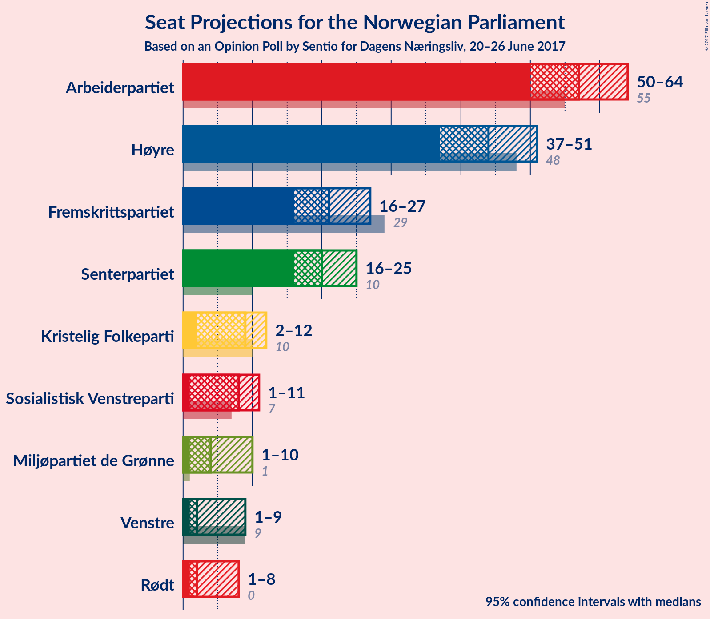

# Opinion Poll by Sentio for Dagens Nærinsliv, 20–26 June 2017

<a href="#voting-intentions">Voting Intentions</a> | <a href="#seats">Seats</a> | <a href="#coalitions">Coalitions</a> | <a href="#technical-information">Technical Information</a>

## Voting Intentions

### Confidence Intervals

| Party | Last Result | Poll Result | 80% Confidence Interval | 90% Confidence Interval | 95% Confidence Interval | 99% Confidence Interval |
|:-----:|:-----------:|:-----------:|:-----------------------:|:-----------------------:|:-----------------------:|:-----------------------:|
| Arbeiderpartiet | 30.8% | 31.1% | 28.1–32.5% |27.5–33.2% |27.0–33.7% |26.0–34.8% |
| Høyre | 26.8% | 24.9% | 22.2–26.3% |21.7–26.9% |21.2–27.5% |20.3–28.5% |
| Fremskrittspartiet | 16.3% | 11.9% | 10.1–13.2% |9.7–13.7% |9.4–14.1% |8.7–14.9% |
| Senterpartiet | 5.5% | 11.6% | 9.9–12.9% |9.5–13.4% |9.1–13.8% |8.5–14.6% |
| Kristelig Folkeparti | 5.6% | 4.9% | 3.9–6.0% |3.6–6.3% |3.4–6.6% |3.1–7.2% |
| Sosialistisk Venstreparti | 4.1% | 4.5% | 3.5–5.5% |3.3–5.8% |3.1–6.1% |2.7–6.7% |
| Miljøpartiet de Grønne | 2.8% | 4.1% | 3.1–5.0% |2.9–5.4% |2.7–5.6% |2.4–6.2% |
| Venstre | 5.2% | 3.8% | 2.9–4.7% |2.7–5.0% |2.5–5.3% |2.2–5.9% |
| Rødt | 1.1% | 3.3% | 2.5–4.3% |2.3–4.6% |2.2–4.8% |1.9–5.3% |

*Note:* The poll result column reflects the actual value used in the calculations. Published results may vary slightly, and in addition be rounded to fewer digits.

## Seats

### Confidence Intervals

| Party | Last Result | Median | 80% Confidence Interval | 90% Confidence Interval | 95% Confidence Interval | 99% Confidence Interval |
|:-----:|:-----------:|:------:|:-----------------------:|:-----------------------:|:-----------------------:|:-----------------------:|
| <a href="#arbeiderpartiet">Arbeiderpartiet</a> | 55 | 57 | 51–62 |50–62 |48–63 |48–65 |
| <a href="#høyre">Høyre</a> | 48 | 45 | 40–52 |37–52 |36–52 |36–57 |
| <a href="#fremskrittspartiet">Fremskrittspartiet</a> | 29 | 22 | 17–25 |16–26 |15–27 |15–29 |
| <a href="#senterpartiet">Senterpartiet</a> | 10 | 20 | 17–25 |17–25 |15–27 |15–29 |
| <a href="#kristelig-folkeparti">Kristelig Folkeparti</a> | 10 | 9 | 2–11 |2–12 |2–12 |1–13 |
| <a href="#sosialistisk-venstreparti">Sosialistisk Venstreparti</a> | 7 | 7 | 1–10 |1–11 |1–11 |0–12 |
| <a href="#miljøpartiet-de-grønne">Miljøpartiet de Grønne</a> | 1 | 2 | 1–9 |1–9 |1–10 |1–11 |
| <a href="#venstre">Venstre</a> | 9 | 2 | 1–9 |1–9 |1–10 |0–11 |
| <a href="#rødt">Rødt</a> | 0 | 2 | 1–2 |1–8 |1–9 |1–9 |

### Arbeiderpartiet

| Number of Seats | Probability | Accumulated |
|:---------------:|:-----------:|:-----------:|
| 45 | 0% | 100% |
| 46 | 0.2% | 99.9% |
| 47 | 0.2% | 99.8% |
| 48 | 3% | 99.5% |
| 49 | 1.1% | 97% |
| 50 | 2% | 96% |
| 51 | 4% | 94% |
| 52 | 10% | 90% |
| 53 | 5% | 80% |
| 54 | 10% | 75% |
| 55 | 8% | 64% |
| 56 | 4% | 57% |
| 57 | 10% | 53% |
| 58 | 6% | 43% |
| 59 | 10% | 37% |
| 60 | 6% | 28% |
| 61 | 9% | 21% |
| 62 | 8% | 12% |
| 63 | 3% | 4% |
| 64 | 0.4% | 1.2% |
| 65 | 0.6% | 0.8% |
| 66 | 0% | 0.2% |
| 67 | 0% | 0.2% |
| 68 | 0.1% | 0.2% |
| 69 | 0% | 0% |

### Høyre

| Number of Seats | Probability | Accumulated |
|:---------------:|:-----------:|:-----------:|
| 34 | 0% | 100% |
| 35 | 0.2% | 99.9% |
| 36 | 4% | 99.8% |
| 37 | 3% | 96% |
| 38 | 0.8% | 93% |
| 39 | 1.0% | 92% |
| 40 | 6% | 91% |
| 41 | 2% | 84% |
| 42 | 11% | 82% |
| 43 | 8% | 71% |
| 44 | 9% | 63% |
| 45 | 12% | 53% |
| 46 | 8% | 42% |
| 47 | 8% | 34% |
| 48 | 2% | 25% |
| 49 | 5% | 24% |
| 50 | 2% | 19% |
| 51 | 5% | 17% |
| 52 | 11% | 12% |
| 53 | 0.6% | 2% |
| 54 | 0.1% | 1.2% |
| 55 | 0% | 1.1% |
| 56 | 0.3% | 1.0% |
| 57 | 0.7% | 0.8% |
| 58 | 0% | 0% |

### Fremskrittspartiet

| Number of Seats | Probability | Accumulated |
|:---------------:|:-----------:|:-----------:|
| 13 | 0.1% | 100% |
| 14 | 0.1% | 99.9% |
| 15 | 2% | 99.8% |
| 16 | 5% | 97% |
| 17 | 3% | 92% |
| 18 | 7% | 90% |
| 19 | 12% | 83% |
| 20 | 6% | 71% |
| 21 | 10% | 64% |
| 22 | 20% | 55% |
| 23 | 3% | 35% |
| 24 | 19% | 33% |
| 25 | 6% | 13% |
| 26 | 3% | 7% |
| 27 | 1.4% | 4% |
| 28 | 2% | 2% |
| 29 | 0.4% | 0.6% |
| 30 | 0.1% | 0.2% |
| 31 | 0.2% | 0.2% |
| 32 | 0% | 0% |

### Senterpartiet

| Number of Seats | Probability | Accumulated |
|:---------------:|:-----------:|:-----------:|
| 12 | 0.1% | 100% |
| 13 | 0% | 99.9% |
| 14 | 0.2% | 99.9% |
| 15 | 3% | 99.7% |
| 16 | 0.3% | 97% |
| 17 | 9% | 96% |
| 18 | 3% | 87% |
| 19 | 22% | 84% |
| 20 | 12% | 61% |
| 21 | 3% | 50% |
| 22 | 3% | 47% |
| 23 | 19% | 44% |
| 24 | 12% | 26% |
| 25 | 11% | 14% |
| 26 | 0.6% | 3% |
| 27 | 2% | 3% |
| 28 | 0.1% | 1.0% |
| 29 | 0.9% | 1.0% |
| 30 | 0.1% | 0.1% |
| 31 | 0% | 0% |

### Kristelig Folkeparti

| Number of Seats | Probability | Accumulated |
|:---------------:|:-----------:|:-----------:|
| 1 | 2% | 100% |
| 2 | 16% | 98% |
| 3 | 0.1% | 83% |
| 4 | 0% | 83% |
| 5 | 0% | 83% |
| 6 | 0% | 83% |
| 7 | 11% | 83% |
| 8 | 12% | 72% |
| 9 | 30% | 60% |
| 10 | 12% | 31% |
| 11 | 11% | 19% |
| 12 | 7% | 8% |
| 13 | 0.5% | 0.6% |
| 14 | 0.1% | 0.1% |
| 15 | 0% | 0.1% |
| 16 | 0% | 0% |

### Sosialistisk Venstreparti

| Number of Seats | Probability | Accumulated |
|:---------------:|:-----------:|:-----------:|
| 0 | 0.9% | 100% |
| 1 | 10% | 99.1% |
| 2 | 27% | 89% |
| 3 | 0% | 62% |
| 4 | 0% | 62% |
| 5 | 0% | 62% |
| 6 | 0.1% | 62% |
| 7 | 15% | 62% |
| 8 | 24% | 47% |
| 9 | 8% | 23% |
| 10 | 8% | 15% |
| 11 | 7% | 7% |
| 12 | 0.3% | 0.5% |
| 13 | 0.1% | 0.2% |
| 14 | 0.1% | 0.1% |
| 15 | 0% | 0% |

### Miljøpartiet de Grønne

| Number of Seats | Probability | Accumulated |
|:---------------:|:-----------:|:-----------:|
| 1 | 49% | 100% |
| 2 | 3% | 51% |
| 3 | 2% | 48% |
| 4 | 2% | 46% |
| 5 | 0% | 44% |
| 6 | 0% | 44% |
| 7 | 15% | 44% |
| 8 | 7% | 29% |
| 9 | 17% | 22% |
| 10 | 3% | 5% |
| 11 | 2% | 2% |
| 12 | 0.1% | 0.1% |
| 13 | 0% | 0% |

### Venstre

| Number of Seats | Probability | Accumulated |
|:---------------:|:-----------:|:-----------:|
| 0 | 1.3% | 100% |
| 1 | 28% | 98.7% |
| 2 | 31% | 70% |
| 3 | 9% | 40% |
| 4 | 0% | 31% |
| 5 | 0% | 31% |
| 6 | 0.1% | 31% |
| 7 | 11% | 31% |
| 8 | 9% | 20% |
| 9 | 6% | 11% |
| 10 | 4% | 5% |
| 11 | 0.8% | 0.9% |
| 12 | 0.1% | 0.1% |
| 13 | 0% | 0% |

### Rødt

| Number of Seats | Probability | Accumulated |
|:---------------:|:-----------:|:-----------:|
| 1 | 15% | 100% |
| 2 | 76% | 85% |
| 3 | 0% | 9% |
| 4 | 0% | 9% |
| 5 | 0% | 9% |
| 6 | 0.3% | 9% |
| 7 | 2% | 9% |
| 8 | 4% | 7% |
| 9 | 2% | 3% |
| 10 | 0.2% | 0.3% |
| 11 | 0.1% | 0.1% |
| 12 | 0% | 0% |

## Coalitions

### Confidence Intervals

| Coalition | Last Result | Median | 80% Confidence Interval | 90% Confidence Interval | 95% Confidence Interval | 99% Confidence Interval |
|:---------:|:-----------:|:------:|:-----------------------:|:-----------------------:|:-----------------------:|:-----------------------:|
| Høyre – Fremskrittspartiet – Senterpartiet – Kristelig Folkeparti – Venstre | 106 | 101 | 89–110 | 88–110 | 82–110 | 82–110 |
| Arbeiderpartiet – Senterpartiet – Kristelig Folkeparti – Sosialistisk Venstreparti – Miljøpartiet de Grønne | 83 | 97 | 90–104 | 88–104 | 85–104 | 82–107 |
| Arbeiderpartiet – Senterpartiet – Sosialistisk Venstreparti – Miljøpartiet de Grønne – Rødt | 73 | 89 | 83–99 | 82–101 | 81–102 | 78–103 |
| Arbeiderpartiet – Senterpartiet – Sosialistisk Venstreparti – Miljøpartiet de Grønne | 73 | 87 | 81–97 | 80–98 | 79–100 | 76–100 |
| Høyre – Fremskrittspartiet – Kristelig Folkeparti – Miljøpartiet de Grønne – Venstre | 97 | 83 | 77–88 | 75–91 | 72–95 | 70–95 |
| Arbeiderpartiet – Senterpartiet – Sosialistisk Venstreparti – Rødt | 72 | 86 | 81–92 | 78–92 | 74–93 | 73–96 |
| Arbeiderpartiet – Senterpartiet – Sosialistisk Venstreparti | 72 | 84 | 78–89 | 76–90 | 72–91 | 69–93 |
| Høyre – Fremskrittspartiet – Kristelig Folkeparti – Venstre | 96 | 80 | 69–86 | 67–87 | 65–87 | 65–91 |
| Høyre – Fremskrittspartiet | 77 | 67 | 59–76 | 54–76 | 53–76 | 53–77 |
| Høyre – Kristelig Folkeparti – Venstre | 67 | 58 | 50–62 | 48–63 | 46–66 | 43–69 |
| Senterpartiet – Kristelig Folkeparti – Venstre | 29 | 34 | 27–40 | 26–40 | 25–41 | 22–42 |

### Høyre – Fremskrittspartiet – Senterpartiet – Kristelig Folkeparti – Venstre

| Number of Seats | Probability | Accumulated |
|:---------------:|:-----------:|:-----------:|
| 80 | 0.1% | 100% |
| 81 | 0% | 99.9% |
| 82 | 3% | 99.9% |
| 83 | 0.1% | 97% |
| 84 | 0.1% | 97% |
| 85 | 0.5% | 97% |
| 86 | 0.4% | 96% |
| 87 | 0.6% | 96% |
| 88 | 0.4% | 95% |
| 89 | 7% | 95% |
| 90 | 3% | 88% |
| 91 | 0.7% | 85% |
| 92 | 4% | 85% |
| 93 | 2% | 81% |
| 94 | 4% | 79% |
| 95 | 3% | 75% |
| 96 | 2% | 72% |
| 97 | 8% | 70% |
| 98 | 8% | 63% |
| 99 | 0.7% | 55% |
| 100 | 2% | 54% |
| 101 | 9% | 53% |
| 102 | 14% | 44% |
| 103 | 3% | 30% |
| 104 | 3% | 28% |
| 105 | 5% | 25% |
| 106 | 4% | 21% |
| 107 | 3% | 17% |
| 108 | 0.9% | 14% |
| 109 | 1.3% | 13% |
| 110 | 11% | 11% |
| 111 | 0.3% | 0.3% |
| 112 | 0% | 0% |

### Arbeiderpartiet – Senterpartiet – Kristelig Folkeparti – Sosialistisk Venstreparti – Miljøpartiet de Grønne

| Number of Seats | Probability | Accumulated |
|:---------------:|:-----------:|:-----------:|
| 81 | 0% | 100% |
| 82 | 0.8% | 99.9% |
| 83 | 0.3% | 99.1% |
| 84 | 0.8% | 98.8% |
| 85 | 0.7% | 98% |
| 86 | 0.4% | 97% |
| 87 | 2% | 97% |
| 88 | 0.8% | 95% |
| 89 | 1.4% | 94% |
| 90 | 15% | 93% |
| 91 | 3% | 78% |
| 92 | 3% | 74% |
| 93 | 9% | 71% |
| 94 | 6% | 62% |
| 95 | 3% | 57% |
| 96 | 3% | 54% |
| 97 | 10% | 51% |
| 98 | 8% | 41% |
| 99 | 2% | 33% |
| 100 | 6% | 31% |
| 101 | 8% | 25% |
| 102 | 1.4% | 17% |
| 103 | 0.4% | 15% |
| 104 | 13% | 15% |
| 105 | 1.0% | 2% |
| 106 | 0.2% | 0.7% |
| 107 | 0% | 0.5% |
| 108 | 0.4% | 0.5% |
| 109 | 0% | 0.1% |
| 110 | 0% | 0.1% |
| 111 | 0% | 0% |

### Arbeiderpartiet – Senterpartiet – Sosialistisk Venstreparti – Miljøpartiet de Grønne – Rødt

| Number of Seats | Probability | Accumulated |
|:---------------:|:-----------:|:-----------:|
| 76 | 0% | 100% |
| 77 | 0.1% | 99.9% |
| 78 | 0.5% | 99.8% |
| 79 | 0.1% | 99.3% |
| 80 | 0.8% | 99.2% |
| 81 | 1.1% | 98% |
| 82 | 4% | 97% |
| 83 | 10% | 94% |
| 84 | 0.8% | 83% |
| 85 | 3% | 83% |
| 86 | 11% | 80% |
| 87 | 9% | 69% |
| 88 | 2% | 61% |
| 89 | 14% | 58% |
| 90 | 2% | 45% |
| 91 | 5% | 42% |
| 92 | 1.2% | 38% |
| 93 | 7% | 37% |
| 94 | 6% | 30% |
| 95 | 0.8% | 24% |
| 96 | 0.3% | 23% |
| 97 | 3% | 23% |
| 98 | 4% | 20% |
| 99 | 7% | 16% |
| 100 | 4% | 9% |
| 101 | 3% | 5% |
| 102 | 2% | 3% |
| 103 | 0.4% | 0.8% |
| 104 | 0.2% | 0.4% |
| 105 | 0% | 0.2% |
| 106 | 0.1% | 0.2% |
| 107 | 0% | 0.1% |
| 108 | 0% | 0.1% |
| 109 | 0% | 0.1% |
| 110 | 0% | 0% |

### Arbeiderpartiet – Senterpartiet – Sosialistisk Venstreparti – Miljøpartiet de Grønne

| Number of Seats | Probability | Accumulated |
|:---------------:|:-----------:|:-----------:|
| 73 | 0% | 100% |
| 74 | 0% | 99.9% |
| 75 | 0.1% | 99.9% |
| 76 | 1.1% | 99.8% |
| 77 | 0.3% | 98.7% |
| 78 | 0.9% | 98% |
| 79 | 1.3% | 98% |
| 80 | 5% | 96% |
| 81 | 12% | 91% |
| 82 | 0.4% | 80% |
| 83 | 2% | 79% |
| 84 | 11% | 77% |
| 85 | 8% | 66% |
| 86 | 4% | 58% |
| 87 | 8% | 55% |
| 88 | 6% | 47% |
| 89 | 3% | 40% |
| 90 | 3% | 37% |
| 91 | 5% | 34% |
| 92 | 5% | 29% |
| 93 | 2% | 24% |
| 94 | 0.4% | 22% |
| 95 | 4% | 21% |
| 96 | 4% | 18% |
| 97 | 7% | 14% |
| 98 | 3% | 7% |
| 99 | 1.1% | 4% |
| 100 | 2% | 3% |
| 101 | 0.3% | 0.5% |
| 102 | 0.1% | 0.2% |
| 103 | 0% | 0.1% |
| 104 | 0.1% | 0.1% |
| 105 | 0% | 0% |

### Høyre – Fremskrittspartiet – Kristelig Folkeparti – Miljøpartiet de Grønne – Venstre

| Number of Seats | Probability | Accumulated |
|:---------------:|:-----------:|:-----------:|
| 66 | 0.1% | 100% |
| 67 | 0.1% | 99.9% |
| 68 | 0% | 99.8% |
| 69 | 0.1% | 99.8% |
| 70 | 0.2% | 99.6% |
| 71 | 0.1% | 99.4% |
| 72 | 3% | 99.4% |
| 73 | 0.5% | 96% |
| 74 | 0.3% | 96% |
| 75 | 0.4% | 95% |
| 76 | 3% | 95% |
| 77 | 8% | 92% |
| 78 | 9% | 85% |
| 79 | 9% | 75% |
| 80 | 3% | 66% |
| 81 | 6% | 63% |
| 82 | 3% | 57% |
| 83 | 9% | 54% |
| 84 | 9% | 44% |
| 85 | 3% | 35% |
| 86 | 4% | 32% |
| 87 | 18% | 28% |
| 88 | 1.3% | 10% |
| 89 | 0.8% | 9% |
| 90 | 2% | 8% |
| 91 | 3% | 6% |
| 92 | 0.3% | 4% |
| 93 | 0.2% | 3% |
| 94 | 0.3% | 3% |
| 95 | 2% | 3% |
| 96 | 0% | 0.5% |
| 97 | 0% | 0.5% |
| 98 | 0.4% | 0.4% |
| 99 | 0% | 0% |

### Arbeiderpartiet – Senterpartiet – Sosialistisk Venstreparti – Rødt

| Number of Seats | Probability | Accumulated |
|:---------------:|:-----------:|:-----------:|
| 71 | 0.4% | 100% |
| 72 | 0% | 99.5% |
| 73 | 0% | 99.5% |
| 74 | 2% | 99.5% |
| 75 | 0.3% | 97% |
| 76 | 0.4% | 97% |
| 77 | 0.4% | 97% |
| 78 | 3% | 96% |
| 79 | 2% | 93% |
| 80 | 1.1% | 91% |
| 81 | 2% | 90% |
| 82 | 19% | 89% |
| 83 | 4% | 70% |
| 84 | 3% | 66% |
| 85 | 9% | 64% |
| 86 | 9% | 54% |
| 87 | 3% | 45% |
| 88 | 6% | 42% |
| 89 | 2% | 36% |
| 90 | 12% | 33% |
| 91 | 9% | 21% |
| 92 | 8% | 12% |
| 93 | 3% | 4% |
| 94 | 0.4% | 1.4% |
| 95 | 0.2% | 1.0% |
| 96 | 0.4% | 0.8% |
| 97 | 0.1% | 0.4% |
| 98 | 0% | 0.3% |
| 99 | 0% | 0.3% |
| 100 | 0% | 0.2% |
| 101 | 0% | 0.2% |
| 102 | 0.1% | 0.2% |
| 103 | 0.1% | 0.1% |
| 104 | 0% | 0% |

### Arbeiderpartiet – Senterpartiet – Sosialistisk Venstreparti

| Number of Seats | Probability | Accumulated |
|:---------------:|:-----------:|:-----------:|
| 68 | 0% | 100% |
| 69 | 0.5% | 99.9% |
| 70 | 0% | 99.4% |
| 71 | 0.1% | 99.4% |
| 72 | 2% | 99.3% |
| 73 | 0.2% | 97% |
| 74 | 0.5% | 97% |
| 75 | 1.0% | 96% |
| 76 | 3% | 95% |
| 77 | 2% | 92% |
| 78 | 2% | 90% |
| 79 | 4% | 88% |
| 80 | 16% | 84% |
| 81 | 4% | 68% |
| 82 | 2% | 64% |
| 83 | 10% | 62% |
| 84 | 11% | 51% |
| 85 | 2% | 40% |
| 86 | 2% | 38% |
| 87 | 6% | 36% |
| 88 | 13% | 30% |
| 89 | 9% | 17% |
| 90 | 5% | 9% |
| 91 | 3% | 4% |
| 92 | 0.4% | 1.0% |
| 93 | 0.1% | 0.6% |
| 94 | 0.3% | 0.5% |
| 95 | 0.1% | 0.2% |
| 96 | 0% | 0.1% |
| 97 | 0% | 0.1% |
| 98 | 0% | 0.1% |
| 99 | 0% | 0.1% |
| 100 | 0% | 0.1% |
| 101 | 0.1% | 0.1% |
| 102 | 0% | 0% |

### Høyre – Fremskrittspartiet – Kristelig Folkeparti – Venstre

| Number of Seats | Probability | Accumulated |
|:---------------:|:-----------:|:-----------:|
| 60 | 0% | 100% |
| 61 | 0% | 99.9% |
| 62 | 0.1% | 99.9% |
| 63 | 0.1% | 99.8% |
| 64 | 0.1% | 99.7% |
| 65 | 3% | 99.6% |
| 66 | 0.4% | 96% |
| 67 | 2% | 96% |
| 68 | 3% | 94% |
| 69 | 4% | 91% |
| 70 | 7% | 87% |
| 71 | 4% | 81% |
| 72 | 0.3% | 77% |
| 73 | 0.7% | 77% |
| 74 | 0.9% | 76% |
| 75 | 6% | 75% |
| 76 | 6% | 69% |
| 77 | 1.4% | 62% |
| 78 | 5% | 61% |
| 79 | 3% | 56% |
| 80 | 13% | 53% |
| 81 | 2% | 40% |
| 82 | 8% | 38% |
| 83 | 11% | 30% |
| 84 | 3% | 19% |
| 85 | 0.5% | 16% |
| 86 | 10% | 16% |
| 87 | 4% | 6% |
| 88 | 0.7% | 2% |
| 89 | 0.8% | 1.4% |
| 90 | 0% | 0.6% |
| 91 | 0.4% | 0.6% |
| 92 | 0.1% | 0.1% |
| 93 | 0% | 0% |

### Høyre – Fremskrittspartiet

| Number of Seats | Probability | Accumulated |
|:---------------:|:-----------:|:-----------:|
| 51 | 0% | 100% |
| 52 | 0.1% | 99.9% |
| 53 | 3% | 99.9% |
| 54 | 4% | 97% |
| 55 | 0.1% | 93% |
| 56 | 0.3% | 93% |
| 57 | 0.4% | 93% |
| 58 | 1.0% | 92% |
| 59 | 3% | 91% |
| 60 | 3% | 88% |
| 61 | 10% | 85% |
| 62 | 2% | 75% |
| 63 | 0.8% | 73% |
| 64 | 7% | 72% |
| 65 | 4% | 65% |
| 66 | 7% | 61% |
| 67 | 10% | 54% |
| 68 | 14% | 44% |
| 69 | 3% | 31% |
| 70 | 2% | 28% |
| 71 | 5% | 25% |
| 72 | 0.7% | 20% |
| 73 | 3% | 20% |
| 74 | 0.1% | 17% |
| 75 | 1.0% | 17% |
| 76 | 14% | 16% |
| 77 | 0.8% | 1.1% |
| 78 | 0.3% | 0.3% |
| 79 | 0% | 0.1% |
| 80 | 0% | 0.1% |
| 81 | 0% | 0% |

### Høyre – Kristelig Folkeparti – Venstre

| Number of Seats | Probability | Accumulated |
|:---------------:|:-----------:|:-----------:|
| 42 | 0.1% | 100% |
| 43 | 1.2% | 99.9% |
| 44 | 0.1% | 98.6% |
| 45 | 0.3% | 98.6% |
| 46 | 1.3% | 98% |
| 47 | 0.8% | 97% |
| 48 | 1.4% | 96% |
| 49 | 4% | 95% |
| 50 | 4% | 91% |
| 51 | 8% | 88% |
| 52 | 2% | 80% |
| 53 | 7% | 78% |
| 54 | 1.0% | 70% |
| 55 | 11% | 69% |
| 56 | 3% | 59% |
| 57 | 3% | 56% |
| 58 | 13% | 53% |
| 59 | 6% | 40% |
| 60 | 2% | 33% |
| 61 | 12% | 31% |
| 62 | 13% | 19% |
| 63 | 2% | 6% |
| 64 | 0.2% | 5% |
| 65 | 0.4% | 4% |
| 66 | 3% | 4% |
| 67 | 0.1% | 1.4% |
| 68 | 0% | 1.3% |
| 69 | 1.2% | 1.3% |
| 70 | 0% | 0% |

### Senterpartiet – Kristelig Folkeparti – Venstre

| Number of Seats | Probability | Accumulated |
|:---------------:|:-----------:|:-----------:|
| 20 | 0.1% | 100% |
| 21 | 0.1% | 99.9% |
| 22 | 0.3% | 99.8% |
| 23 | 0.4% | 99.4% |
| 24 | 1.5% | 99.0% |
| 25 | 2% | 98% |
| 26 | 5% | 96% |
| 27 | 3% | 91% |
| 28 | 7% | 88% |
| 29 | 15% | 81% |
| 30 | 3% | 66% |
| 31 | 2% | 63% |
| 32 | 2% | 61% |
| 33 | 5% | 59% |
| 34 | 18% | 54% |
| 35 | 9% | 36% |
| 36 | 3% | 27% |
| 37 | 9% | 24% |
| 38 | 1.4% | 15% |
| 39 | 3% | 13% |
| 40 | 7% | 10% |
| 41 | 2% | 3% |
| 42 | 0.8% | 1.2% |
| 43 | 0.2% | 0.4% |
| 44 | 0.1% | 0.1% |
| 45 | 0% | 0% |

## Technical Information

### Opinion Poll

+ **Pollster:** Sentio
+ **Media:** Dagens Nærinsliv
+ **Fieldwork period:** 20–26 June 2017

### Calculations

+ **Sample size:** 691
+ **Simulations done:** 131,072
+ **Error estimate:** 2.18%

