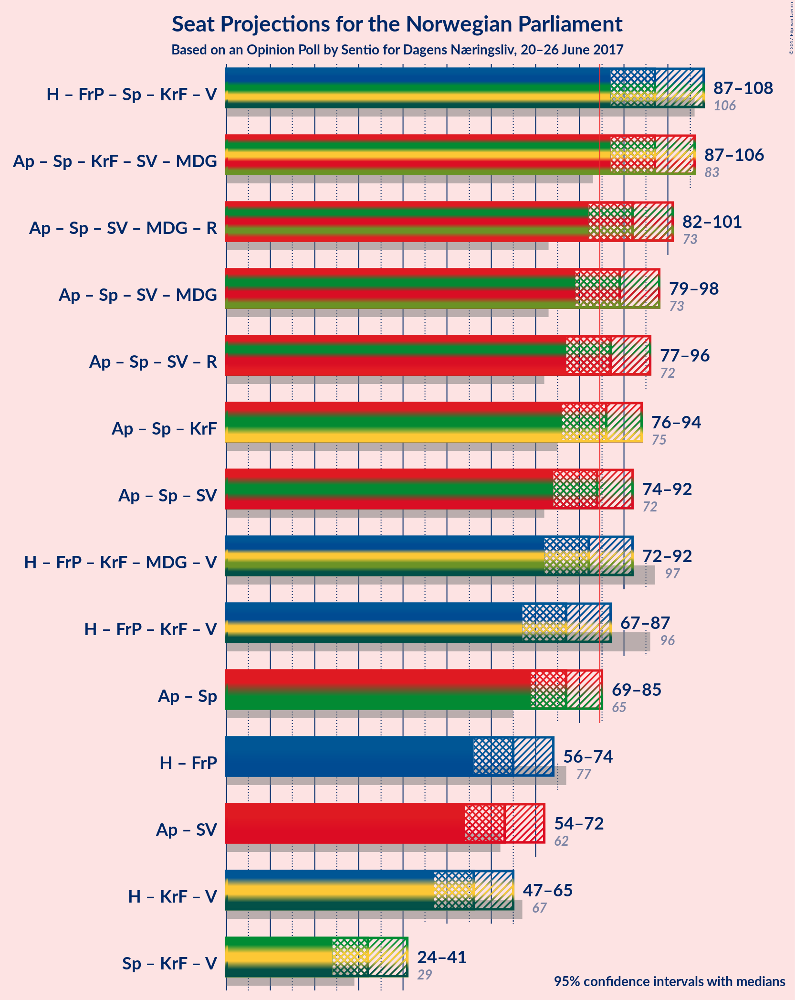

# Opinion Poll by Sentio for Dagens Nærinsliv, 20–26 June 2017

<a href="#voting-intentions">Voting Intentions</a> | <a href="#seats">Seats</a> | <a href="#coalitions">Coalitions</a> | <a href="#technical-information">Technical Information</a>

## Voting Intentions

### Confidence Intervals

| Party | Last Result | Poll Result | 80% Confidence Interval | 90% Confidence Interval | 95% Confidence Interval | 99% Confidence Interval |
|:-----:|:-----------:|:-----------:|:-----------------------:|:-----------------------:|:-----------------------:|:-----------------------:|
| Arbeiderpartiet | 30.8% | 31.1% | 28.1–32.5% |27.5–33.2% |27.0–33.7% |26.0–34.8% |
| Høyre | 26.8% | 24.9% | 22.2–26.3% |21.7–26.9% |21.2–27.5% |20.3–28.5% |
| Fremskrittspartiet | 16.3% | 11.9% | 10.1–13.2% |9.7–13.7% |9.4–14.1% |8.7–14.9% |
| Senterpartiet | 5.5% | 11.6% | 9.9–12.9% |9.5–13.4% |9.1–13.8% |8.5–14.6% |
| Kristelig Folkeparti | 5.6% | 4.9% | 3.9–6.0% |3.6–6.3% |3.4–6.6% |3.1–7.2% |
| Sosialistisk Venstreparti | 4.1% | 4.5% | 3.5–5.5% |3.3–5.8% |3.1–6.1% |2.7–6.7% |
| Miljøpartiet de Grønne | 2.8% | 4.1% | 3.1–5.0% |2.9–5.4% |2.7–5.6% |2.4–6.2% |
| Venstre | 5.2% | 3.8% | 2.9–4.7% |2.7–5.0% |2.5–5.3% |2.2–5.9% |
| Rødt | 1.1% | 3.3% | 2.5–4.3% |2.3–4.6% |2.2–4.8% |1.9–5.3% |

*Note:* The poll result column reflects the actual value used in the calculations. Published results may vary slightly, and in addition be rounded to fewer digits.

## Seats

### Confidence Intervals

| Party | Last Result | Median | 80% Confidence Interval | 90% Confidence Interval | 95% Confidence Interval | 99% Confidence Interval |
|:-----:|:-----------:|:------:|:-----------------------:|:-----------------------:|:-----------------------:|:-----------------------:|
| <a href="#arbeiderpartiet">Arbeiderpartiet</a> | 55 | N/A | N/A |N/A |N/A |N/A |
| <a href="#høyre">Høyre</a> | 48 | N/A | N/A |N/A |N/A |N/A |
| <a href="#fremskrittspartiet">Fremskrittspartiet</a> | 29 | N/A | N/A |N/A |N/A |N/A |
| <a href="#senterpartiet">Senterpartiet</a> | 10 | N/A | N/A |N/A |N/A |N/A |
| <a href="#kristelig-folkeparti">Kristelig Folkeparti</a> | 10 | N/A | N/A |N/A |N/A |N/A |
| <a href="#sosialistisk-venstreparti">Sosialistisk Venstreparti</a> | 7 | N/A | N/A |N/A |N/A |N/A |
| <a href="#miljøpartiet-de-grønne">Miljøpartiet de Grønne</a> | 1 | N/A | N/A |N/A |N/A |N/A |
| <a href="#venstre">Venstre</a> | 9 | N/A | N/A |N/A |N/A |N/A |
| <a href="#rødt">Rødt</a> | 0 | N/A | N/A |N/A |N/A |N/A |

## Coalitions

## Technical Information

### Opinion Poll

+ **Pollster:** Sentio
+ **Media:** Dagens Nærinsliv
+ **Fieldwork period:** 20–26 June 2017

### Calculations

+ **Sample size:** 691
+ **Simulations done:** 0
+ **Error estimate:** 100.00%

