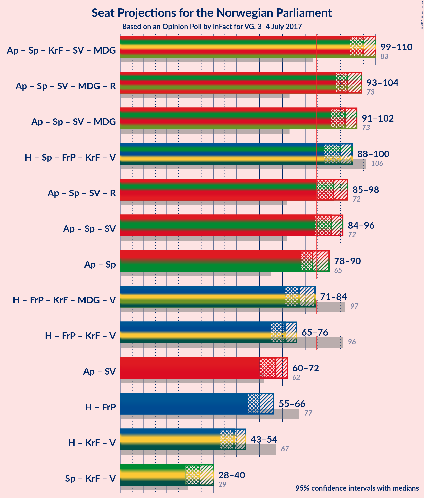

# Opinion Poll by InFact for VG, 3–4 July 2017

<a href="#voting-intentions">Voting Intentions</a> | <a href="#seats">Seats</a> | <a href="#coalitions">Coalitions</a> | <a href="#technical-information">Technical Information</a>

## Voting Intentions

### Confidence Intervals

| Party | Last Result | Poll Result | 80% Confidence Interval | 90% Confidence Interval | 95% Confidence Interval | 99% Confidence Interval |
|:-----:|:-----------:|:-----------:|:-----------------------:|:-----------------------:|:-----------------------:|:-----------------------:|
| Arbeiderpartiet | 30.8% | 31.8% | 30.5–33.2% |30.2–33.6% |29.8–33.9% |29.2–34.6% |
| Høyre | 26.8% | 21.1% | 20.0–22.3% |19.6–22.6% |19.4–22.9% |18.8–23.5% |
| Senterpartiet | 5.5% | 13.0% | 12.1–14.0% |11.8–14.3% |11.6–14.5% |11.2–15.0% |
| Fremskrittspartiet | 16.3% | 11.9% | 11.0–12.9% |10.8–13.2% |10.6–13.4% |10.2–13.9% |
| Kristelig Folkeparti | 5.6% | 4.6% | 4.1–5.3% |3.9–5.5% |3.8–5.6% |3.5–6.0% |
| Sosialistisk Venstreparti | 4.1% | 4.5% | 4.0–5.2% |3.8–5.3% |3.7–5.5% |3.4–5.9% |
| Miljøpartiet de Grønne | 2.8% | 4.1% | 3.6–4.8% |3.4–4.9% |3.3–5.1% |3.1–5.4% |
| Venstre | 5.2% | 3.5% | 3.0–4.1% |2.9–4.2% |2.8–4.4% |2.5–4.7% |
| Rødt | 1.1% | 2.8% | 2.4–3.3% |2.2–3.5% |2.1–3.6% |2.0–3.9% |

*Note:* The poll result column reflects the actual value used in the calculations. Published results may vary slightly, and in addition be rounded to fewer digits.

## Seats

### Confidence Intervals

| Party | Last Result | Median | 80% Confidence Interval | 90% Confidence Interval | 95% Confidence Interval | 99% Confidence Interval |
|:-----:|:-----------:|:------:|:-----------------------:|:-----------------------:|:-----------------------:|:-----------------------:|
| <a href="#arbeiderpartiet">Arbeiderpartiet</a> | 55 | 60 | 58–64 |56–65 |54–65 |54–66 |
| <a href="#høyre">Høyre</a> | 48 | 38 | 36–41 |36–41 |35–41 |34–44 |
| <a href="#senterpartiet">Senterpartiet</a> | 10 | 23 | 22–25 |21–25 |20–26 |20–28 |
| <a href="#fremskrittspartiet">Fremskrittspartiet</a> | 29 | 24 | 20–25 |19–26 |19–26 |18–26 |
| <a href="#kristelig-folkeparti">Kristelig Folkeparti</a> | 10 | 8 | 2–9 |2–9 |2–10 |2–11 |
| <a href="#sosialistisk-venstreparti">Sosialistisk Venstreparti</a> | 7 | 8 | 2–9 |2–9 |2–10 |1–11 |
| <a href="#miljøpartiet-de-grønne">Miljøpartiet de Grønne</a> | 1 | 8 | 3–8 |2–8 |1–9 |1–10 |
| <a href="#venstre">Venstre</a> | 9 | 2 | 2 |2–7 |1–7 |1–8 |
| <a href="#rødt">Rødt</a> | 0 | 2 | 1–2 |1–2 |1–2 |1–2 |

### Arbeiderpartiet

| Number of Seats | Probability | Accumulated |
|:---------------:|:-----------:|:-----------:|
| 52 | 0% | 100% |
| 53 | 0% | 99.9% |
| 54 | 3% | 99.9% |
| 55 | 1.5% | 96% |
| 56 | 0.9% | 95% |
| 57 | 2% | 94% |
| 58 | 4% | 92% |
| 59 | 24% | 88% |
| 60 | 15% | 64% |
| 61 | 6% | 49% |
| 62 | 27% | 43% |
| 63 | 2% | 16% |
| 64 | 4% | 14% |
| 65 | 8% | 10% |
| 66 | 2% | 2% |
| 67 | 0% | 0.1% |
| 68 | 0% | 0.1% |
| 69 | 0% | 0.1% |
| 70 | 0% | 0% |

### Høyre

| Number of Seats | Probability | Accumulated |
|:---------------:|:-----------:|:-----------:|
| 33 | 0.1% | 100% |
| 34 | 0.4% | 99.9% |
| 35 | 4% | 99.4% |
| 36 | 7% | 95% |
| 37 | 11% | 89% |
| 38 | 28% | 78% |
| 39 | 20% | 50% |
| 40 | 5% | 30% |
| 41 | 23% | 25% |
| 42 | 0.6% | 2% |
| 43 | 0.5% | 1.0% |
| 44 | 0.3% | 0.6% |
| 45 | 0.2% | 0.2% |
| 46 | 0% | 0% |

### Senterpartiet

| Number of Seats | Probability | Accumulated |
|:---------------:|:-----------:|:-----------:|
| 18 | 0.1% | 100% |
| 19 | 0.2% | 99.9% |
| 20 | 2% | 99.7% |
| 21 | 5% | 97% |
| 22 | 41% | 93% |
| 23 | 4% | 52% |
| 24 | 13% | 49% |
| 25 | 33% | 36% |
| 26 | 2% | 3% |
| 27 | 0.8% | 1.5% |
| 28 | 0.6% | 0.7% |
| 29 | 0.1% | 0.1% |
| 30 | 0% | 0% |

### Fremskrittspartiet

| Number of Seats | Probability | Accumulated |
|:---------------:|:-----------:|:-----------:|
| 18 | 2% | 100% |
| 19 | 6% | 98% |
| 20 | 3% | 92% |
| 21 | 5% | 90% |
| 22 | 7% | 85% |
| 23 | 24% | 78% |
| 24 | 15% | 54% |
| 25 | 33% | 39% |
| 26 | 5% | 6% |
| 27 | 0.1% | 0.1% |
| 28 | 0% | 0% |

### Kristelig Folkeparti

| Number of Seats | Probability | Accumulated |
|:---------------:|:-----------:|:-----------:|
| 2 | 22% | 100% |
| 3 | 6% | 78% |
| 4 | 0% | 72% |
| 5 | 0% | 72% |
| 6 | 0% | 72% |
| 7 | 4% | 72% |
| 8 | 33% | 68% |
| 9 | 30% | 35% |
| 10 | 4% | 5% |
| 11 | 0.9% | 0.9% |
| 12 | 0% | 0% |

### Sosialistisk Venstreparti

| Number of Seats | Probability | Accumulated |
|:---------------:|:-----------:|:-----------:|
| 1 | 2% | 100% |
| 2 | 42% | 98% |
| 3 | 0% | 56% |
| 4 | 0% | 56% |
| 5 | 0% | 56% |
| 6 | 0% | 56% |
| 7 | 3% | 56% |
| 8 | 41% | 53% |
| 9 | 10% | 13% |
| 10 | 2% | 3% |
| 11 | 0.7% | 0.8% |
| 12 | 0.1% | 0.1% |
| 13 | 0% | 0% |

### Miljøpartiet de Grønne

| Number of Seats | Probability | Accumulated |
|:---------------:|:-----------:|:-----------:|
| 1 | 4% | 100% |
| 2 | 3% | 96% |
| 3 | 7% | 93% |
| 4 | 11% | 85% |
| 5 | 0% | 74% |
| 6 | 0% | 74% |
| 7 | 9% | 74% |
| 8 | 60% | 65% |
| 9 | 3% | 5% |
| 10 | 2% | 2% |
| 11 | 0% | 0% |

### Venstre

| Number of Seats | Probability | Accumulated |
|:---------------:|:-----------:|:-----------:|
| 1 | 4% | 100% |
| 2 | 86% | 96% |
| 3 | 2% | 10% |
| 4 | 0% | 8% |
| 5 | 0% | 8% |
| 6 | 0% | 8% |
| 7 | 7% | 8% |
| 8 | 0.8% | 1.0% |
| 9 | 0.2% | 0.2% |
| 10 | 0% | 0% |

### Rødt

| Number of Seats | Probability | Accumulated |
|:---------------:|:-----------:|:-----------:|
| 1 | 38% | 100% |
| 2 | 62% | 62% |
| 3 | 0% | 0.1% |
| 4 | 0% | 0.1% |
| 5 | 0% | 0.1% |
| 6 | 0% | 0.1% |
| 7 | 0.1% | 0.1% |
| 8 | 0% | 0% |

## Coalitions

### Confidence Intervals

| Coalition | Last Result | Median | 80% Confidence Interval | 90% Confidence Interval | 95% Confidence Interval | 99% Confidence Interval |
|:---------:|:-----------:|:------:|:-----------------------:|:-----------------------:|:-----------------------:|:-----------------------:|
| Arbeiderpartiet – Senterpartiet – Kristelig Folkeparti – Sosialistisk Venstreparti – Miljøpartiet de Grønne | 83 | 104 | 99–106 | 99–109 | 99–109 | 97–110 |
| Arbeiderpartiet – Senterpartiet – Sosialistisk Venstreparti – Miljøpartiet de Grønne – Rødt | 73 | 98 | 94–102 | 92–103 | 91–103 | 91–104 |
| Høyre – Senterpartiet – Fremskrittspartiet – Kristelig Folkeparti – Venstre | 106 | 95 | 91–98 | 89–100 | 88–103 | 88–103 |
| Arbeiderpartiet – Senterpartiet – Sosialistisk Venstreparti – Miljøpartiet de Grønne | 73 | 97 | 92–101 | 91–101 | 90–101 | 89–103 |
| Arbeiderpartiet – Senterpartiet – Sosialistisk Venstreparti – Rødt | 72 | 91 | 86–95 | 86–100 | 86–100 | 85–100 |
| Arbeiderpartiet – Senterpartiet – Sosialistisk Venstreparti | 72 | 89 | 84–94 | 84–98 | 84–98 | 84–98 |
| Høyre – Fremskrittspartiet – Kristelig Folkeparti – Miljøpartiet de Grønne – Venstre | 97 | 78 | 74–83 | 69–83 | 69–83 | 69–84 |
| Høyre – Fremskrittspartiet – Kristelig Folkeparti – Venstre | 96 | 71 | 67–75 | 66–77 | 66–78 | 65–78 |
| Høyre – Fremskrittspartiet | 77 | 61 | 57–66 | 57–66 | 56–67 | 55–68 |
| Høyre – Kristelig Folkeparti – Venstre | 67 | 48 | 45–52 | 42–53 | 42–54 | 42–55 |
| Senterpartiet – Kristelig Folkeparti – Venstre | 29 | 32 | 29–36 | 29–38 | 29–40 | 27–41 |

### Arbeiderpartiet – Senterpartiet – Kristelig Folkeparti – Sosialistisk Venstreparti – Miljøpartiet de Grønne

| Number of Seats | Probability | Accumulated |
|:---------------:|:-----------:|:-----------:|
| 95 | 0.1% | 100% |
| 96 | 0.2% | 99.8% |
| 97 | 0.2% | 99.6% |
| 98 | 0.6% | 99.4% |
| 99 | 25% | 98.8% |
| 100 | 0.7% | 74% |
| 101 | 13% | 73% |
| 102 | 3% | 60% |
| 103 | 6% | 57% |
| 104 | 12% | 52% |
| 105 | 29% | 40% |
| 106 | 3% | 11% |
| 107 | 2% | 9% |
| 108 | 1.2% | 6% |
| 109 | 4% | 5% |
| 110 | 0.8% | 1.0% |
| 111 | 0.2% | 0.2% |
| 112 | 0% | 0% |

### Arbeiderpartiet – Senterpartiet – Sosialistisk Venstreparti – Miljøpartiet de Grønne – Rødt

| Number of Seats | Probability | Accumulated |
|:---------------:|:-----------:|:-----------:|
| 88 | 0% | 100% |
| 89 | 0.2% | 99.9% |
| 90 | 0.1% | 99.8% |
| 91 | 4% | 99.7% |
| 92 | 0.9% | 96% |
| 93 | 2% | 95% |
| 94 | 13% | 93% |
| 95 | 2% | 80% |
| 96 | 6% | 77% |
| 97 | 4% | 71% |
| 98 | 27% | 67% |
| 99 | 23% | 40% |
| 100 | 1.4% | 17% |
| 101 | 2% | 16% |
| 102 | 6% | 13% |
| 103 | 7% | 8% |
| 104 | 0.6% | 1.0% |
| 105 | 0.1% | 0.4% |
| 106 | 0.2% | 0.3% |
| 107 | 0% | 0% |

### Høyre – Senterpartiet – Fremskrittspartiet – Kristelig Folkeparti – Venstre

| Number of Seats | Probability | Accumulated |
|:---------------:|:-----------:|:-----------:|
| 86 | 0.1% | 100% |
| 87 | 0.3% | 99.9% |
| 88 | 4% | 99.6% |
| 89 | 2% | 96% |
| 90 | 0.2% | 94% |
| 91 | 8% | 94% |
| 92 | 4% | 86% |
| 93 | 26% | 82% |
| 94 | 3% | 56% |
| 95 | 22% | 53% |
| 96 | 2% | 30% |
| 97 | 18% | 29% |
| 98 | 2% | 11% |
| 99 | 2% | 9% |
| 100 | 2% | 7% |
| 101 | 0.5% | 5% |
| 102 | 0.7% | 4% |
| 103 | 3% | 3% |
| 104 | 0.1% | 0.2% |
| 105 | 0% | 0% |

### Arbeiderpartiet – Senterpartiet – Sosialistisk Venstreparti – Miljøpartiet de Grønne

| Number of Seats | Probability | Accumulated |
|:---------------:|:-----------:|:-----------:|
| 87 | 0.2% | 100% |
| 88 | 0.1% | 99.8% |
| 89 | 0.3% | 99.7% |
| 90 | 4% | 99.4% |
| 91 | 2% | 96% |
| 92 | 13% | 93% |
| 93 | 2% | 80% |
| 94 | 5% | 78% |
| 95 | 3% | 73% |
| 96 | 10% | 70% |
| 97 | 43% | 61% |
| 98 | 1.1% | 17% |
| 99 | 2% | 16% |
| 100 | 1.4% | 14% |
| 101 | 11% | 12% |
| 102 | 0.2% | 1.0% |
| 103 | 0.5% | 0.8% |
| 104 | 0.1% | 0.3% |
| 105 | 0.2% | 0.2% |
| 106 | 0% | 0% |

### Arbeiderpartiet – Senterpartiet – Sosialistisk Venstreparti – Rødt

| Number of Seats | Probability | Accumulated |
|:---------------:|:-----------:|:-----------:|
| 81 | 0.1% | 100% |
| 82 | 0% | 99.9% |
| 83 | 0.2% | 99.9% |
| 84 | 0.1% | 99.7% |
| 85 | 0.5% | 99.6% |
| 86 | 13% | 99.1% |
| 87 | 4% | 86% |
| 88 | 2% | 82% |
| 89 | 5% | 81% |
| 90 | 22% | 75% |
| 91 | 23% | 54% |
| 92 | 3% | 31% |
| 93 | 3% | 28% |
| 94 | 8% | 24% |
| 95 | 8% | 16% |
| 96 | 2% | 8% |
| 97 | 0.3% | 6% |
| 98 | 0.4% | 6% |
| 99 | 0.3% | 6% |
| 100 | 5% | 5% |
| 101 | 0% | 0% |

### Arbeiderpartiet – Senterpartiet – Sosialistisk Venstreparti

| Number of Seats | Probability | Accumulated |
|:---------------:|:-----------:|:-----------:|
| 80 | 0.1% | 100% |
| 81 | 0% | 99.9% |
| 82 | 0.3% | 99.9% |
| 83 | 0.1% | 99.6% |
| 84 | 13% | 99.5% |
| 85 | 0.8% | 87% |
| 86 | 5% | 86% |
| 87 | 4% | 81% |
| 88 | 2% | 77% |
| 89 | 43% | 75% |
| 90 | 3% | 31% |
| 91 | 4% | 29% |
| 92 | 6% | 25% |
| 93 | 5% | 19% |
| 94 | 6% | 13% |
| 95 | 0.6% | 7% |
| 96 | 0.4% | 6% |
| 97 | 0.5% | 6% |
| 98 | 5% | 5% |
| 99 | 0% | 0% |

### Høyre – Fremskrittspartiet – Kristelig Folkeparti – Miljøpartiet de Grønne – Venstre

| Number of Seats | Probability | Accumulated |
|:---------------:|:-----------:|:-----------:|
| 69 | 5% | 100% |
| 70 | 0.3% | 95% |
| 71 | 0.4% | 94% |
| 72 | 0.3% | 94% |
| 73 | 2% | 94% |
| 74 | 8% | 92% |
| 75 | 8% | 84% |
| 76 | 3% | 75% |
| 77 | 3% | 72% |
| 78 | 23% | 69% |
| 79 | 22% | 46% |
| 80 | 5% | 25% |
| 81 | 2% | 19% |
| 82 | 4% | 18% |
| 83 | 13% | 14% |
| 84 | 0.5% | 0.9% |
| 85 | 0.1% | 0.4% |
| 86 | 0.2% | 0.3% |
| 87 | 0% | 0.1% |
| 88 | 0.1% | 0.1% |
| 89 | 0% | 0% |

### Høyre – Fremskrittspartiet – Kristelig Folkeparti – Venstre

| Number of Seats | Probability | Accumulated |
|:---------------:|:-----------:|:-----------:|
| 63 | 0.2% | 100% |
| 64 | 0.1% | 99.7% |
| 65 | 0.6% | 99.6% |
| 66 | 7% | 99.0% |
| 67 | 6% | 92% |
| 68 | 2% | 87% |
| 69 | 1.4% | 84% |
| 70 | 23% | 83% |
| 71 | 27% | 60% |
| 72 | 4% | 33% |
| 73 | 6% | 28% |
| 74 | 2% | 23% |
| 75 | 13% | 20% |
| 76 | 2% | 7% |
| 77 | 0.9% | 5% |
| 78 | 4% | 4% |
| 79 | 0.1% | 0.3% |
| 80 | 0.2% | 0.2% |
| 81 | 0% | 0.1% |
| 82 | 0% | 0% |

### Høyre – Fremskrittspartiet

| Number of Seats | Probability | Accumulated |
|:---------------:|:-----------:|:-----------:|
| 54 | 0.1% | 100% |
| 55 | 0.7% | 99.8% |
| 56 | 4% | 99.1% |
| 57 | 7% | 95% |
| 58 | 2% | 88% |
| 59 | 3% | 86% |
| 60 | 6% | 83% |
| 61 | 30% | 77% |
| 62 | 5% | 47% |
| 63 | 3% | 42% |
| 64 | 13% | 39% |
| 65 | 0.5% | 26% |
| 66 | 21% | 25% |
| 67 | 4% | 4% |
| 68 | 0.1% | 0.5% |
| 69 | 0.4% | 0.4% |
| 70 | 0% | 0% |

### Høyre – Kristelig Folkeparti – Venstre

| Number of Seats | Probability | Accumulated |
|:---------------:|:-----------:|:-----------:|
| 40 | 0.2% | 100% |
| 41 | 0% | 99.8% |
| 42 | 6% | 99.8% |
| 43 | 2% | 94% |
| 44 | 0.3% | 92% |
| 45 | 23% | 92% |
| 46 | 2% | 69% |
| 47 | 7% | 67% |
| 48 | 24% | 60% |
| 49 | 5% | 36% |
| 50 | 16% | 31% |
| 51 | 2% | 16% |
| 52 | 6% | 13% |
| 53 | 2% | 7% |
| 54 | 4% | 5% |
| 55 | 0.6% | 1.0% |
| 56 | 0.1% | 0.4% |
| 57 | 0.2% | 0.3% |
| 58 | 0% | 0.1% |
| 59 | 0% | 0% |

### Senterpartiet – Kristelig Folkeparti – Venstre

| Number of Seats | Probability | Accumulated |
|:---------------:|:-----------:|:-----------:|
| 26 | 0.4% | 100% |
| 27 | 0.1% | 99.6% |
| 28 | 2% | 99.5% |
| 29 | 20% | 98% |
| 30 | 6% | 78% |
| 31 | 5% | 72% |
| 32 | 20% | 67% |
| 33 | 21% | 47% |
| 34 | 5% | 25% |
| 35 | 6% | 20% |
| 36 | 6% | 15% |
| 37 | 2% | 8% |
| 38 | 2% | 6% |
| 39 | 0.5% | 5% |
| 40 | 3% | 4% |
| 41 | 0.6% | 0.9% |
| 42 | 0.2% | 0.2% |
| 43 | 0% | 0% |

## Technical Information

### Opinion Poll

+ **Pollster:** InFact
+ **Media:** VG
+ **Fieldwork period:** 3–4 July 2017

### Calculations

+ **Sample size:** 2016
+ **Simulations done:** 262,144
+ **Error estimate:** 0.78%

