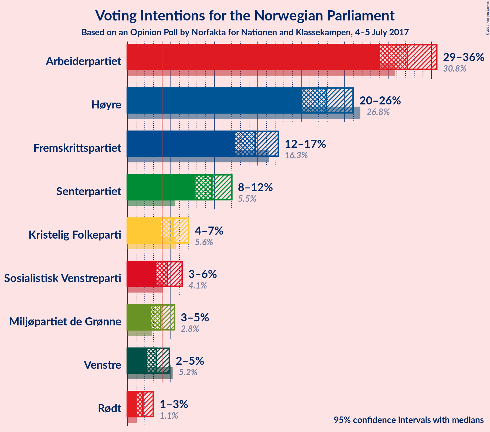

# Opinion Poll by Norfakta for Nationen and Klassekampen, 4–5 July 2017

<a href="#voting-intentions">Voting Intentions</a> | <a href="#seats">Seats</a> | <a href="#coalitions">Coalitions</a> | <a href="#technical-information">Technical Information</a>

## Voting Intentions

### Confidence Intervals

| Party | Last Result | Poll Result | 80% Confidence Interval | 90% Confidence Interval | 95% Confidence Interval | 99% Confidence Interval |
|:-----:|:-----------:|:-----------:|:-----------------------:|:-----------------------:|:-----------------------:|:-----------------------:|
| Arbeiderpartiet | 30.8% | 32.2% | 30.1–34.4% |29.5–35.0% |29.0–35.6% |28.1–36.7% |
| Høyre | 26.8% | 22.9% | 21.0–24.9% |20.5–25.5% |20.1–26.0% |19.2–27.0% |
| Fremskrittspartiet | 16.3% | 14.7% | 13.2–16.4% |12.8–16.9% |12.4–17.4% |11.7–18.2% |
| Senterpartiet | 5.5% | 9.7% | 8.5–11.2% |8.1–11.6% |7.8–12.0% |7.3–12.8% |
| Kristelig Folkeparti | 5.6% | 5.2% | 4.3–6.4% |4.1–6.8% |3.9–7.0% |3.5–7.7% |
| Sosialistisk Venstreparti | 4.1% | 4.6% | 3.8–5.7% |3.5–6.0% |3.3–6.3% |3.0–6.9% |
| Miljøpartiet de Grønne | 2.8% | 3.8% | 3.1–4.9% |2.9–5.2% |2.7–5.4% |2.4–6.0% |
| Venstre | 5.2% | 3.3% | 2.6–4.3% |2.4–4.6% |2.3–4.8% |2.0–5.3% |
| Rødt | 1.1% | 1.8% | 1.3–2.6% |1.2–2.8% |1.1–3.0% |0.9–3.4% |

*Note:* The poll result column reflects the actual value used in the calculations. Published results may vary slightly, and in addition be rounded to fewer digits.

## Seats

### Confidence Intervals

| Party | Last Result | Median | 80% Confidence Interval | 90% Confidence Interval | 95% Confidence Interval | 99% Confidence Interval |
|:-----:|:-----------:|:------:|:-----------------------:|:-----------------------:|:-----------------------:|:-----------------------:|
| <a href="#arbeiderpartiet">Arbeiderpartiet</a> | 55 | 58 | 54–63 |53–64 |53–65 |50–69 |
| <a href="#høyre">Høyre</a> | 48 | 40 | 37–45 |36–46 |35–49 |34–49 |
| <a href="#fremskrittspartiet">Fremskrittspartiet</a> | 29 | 27 | 22–30 |22–32 |22–32 |20–34 |
| <a href="#senterpartiet">Senterpartiet</a> | 10 | 18 | 15–20 |14–21 |13–22 |13–23 |
| <a href="#kristelig-folkeparti">Kristelig Folkeparti</a> | 10 | 10 | 7–13 |2–13 |2–13 |2–13 |
| <a href="#sosialistisk-venstreparti">Sosialistisk Venstreparti</a> | 7 | 9 | 2–10 |2–11 |1–12 |1–12 |
| <a href="#miljøpartiet-de-grønne">Miljøpartiet de Grønne</a> | 1 | 3 | 1–8 |1–9 |1–10 |1–10 |
| <a href="#venstre">Venstre</a> | 9 | 2 | 1–7 |1–8 |1–9 |0–10 |
| <a href="#rødt">Rødt</a> | 0 | 1 | 1 |1–2 |0–2 |0–2 |

### Arbeiderpartiet

| Number of Seats | Probability | Accumulated |
|:---------------:|:-----------:|:-----------:|
| 48 | 0.1% | 100% |
| 49 | 0.2% | 99.9% |
| 50 | 0.3% | 99.8% |
| 51 | 0.8% | 99.4% |
| 52 | 0.9% | 98.6% |
| 53 | 4% | 98% |
| 54 | 13% | 93% |
| 55 | 14% | 80% |
| 56 | 9% | 66% |
| 57 | 3% | 57% |
| 58 | 9% | 54% |
| 59 | 16% | 45% |
| 60 | 6% | 29% |
| 61 | 4% | 23% |
| 62 | 8% | 19% |
| 63 | 5% | 10% |
| 64 | 3% | 6% |
| 65 | 0.8% | 3% |
| 66 | 0.5% | 2% |
| 67 | 0.8% | 2% |
| 68 | 0.3% | 1.1% |
| 69 | 0.6% | 0.8% |
| 70 | 0.1% | 0.2% |
| 71 | 0% | 0.1% |
| 72 | 0% | 0% |

### Høyre

| Number of Seats | Probability | Accumulated |
|:---------------:|:-----------:|:-----------:|
| 33 | 0.2% | 100% |
| 34 | 0.4% | 99.8% |
| 35 | 2% | 99.4% |
| 36 | 5% | 97% |
| 37 | 12% | 92% |
| 38 | 5% | 80% |
| 39 | 7% | 75% |
| 40 | 19% | 68% |
| 41 | 10% | 49% |
| 42 | 10% | 39% |
| 43 | 5% | 28% |
| 44 | 12% | 23% |
| 45 | 3% | 11% |
| 46 | 4% | 8% |
| 47 | 0.7% | 4% |
| 48 | 0.2% | 3% |
| 49 | 3% | 3% |
| 50 | 0.2% | 0.4% |
| 51 | 0.1% | 0.2% |
| 52 | 0.1% | 0.1% |
| 53 | 0% | 0% |

### Fremskrittspartiet

| Number of Seats | Probability | Accumulated |
|:---------------:|:-----------:|:-----------:|
| 19 | 0.2% | 100% |
| 20 | 0.4% | 99.8% |
| 21 | 2% | 99.4% |
| 22 | 9% | 98% |
| 23 | 3% | 89% |
| 24 | 4% | 86% |
| 25 | 7% | 83% |
| 26 | 18% | 75% |
| 27 | 10% | 58% |
| 28 | 19% | 48% |
| 29 | 15% | 29% |
| 30 | 6% | 14% |
| 31 | 3% | 8% |
| 32 | 4% | 5% |
| 33 | 0.3% | 1.0% |
| 34 | 0.6% | 0.7% |
| 35 | 0.1% | 0.1% |
| 36 | 0% | 0% |

### Senterpartiet

| Number of Seats | Probability | Accumulated |
|:---------------:|:-----------:|:-----------:|
| 12 | 0.2% | 100% |
| 13 | 3% | 99.7% |
| 14 | 3% | 97% |
| 15 | 6% | 94% |
| 16 | 10% | 88% |
| 17 | 21% | 78% |
| 18 | 22% | 56% |
| 19 | 10% | 35% |
| 20 | 19% | 25% |
| 21 | 3% | 6% |
| 22 | 1.0% | 3% |
| 23 | 2% | 2% |
| 24 | 0.3% | 0.3% |
| 25 | 0.1% | 0.1% |
| 26 | 0% | 0% |

### Kristelig Folkeparti

| Number of Seats | Probability | Accumulated |
|:---------------:|:-----------:|:-----------:|
| 1 | 0.1% | 100% |
| 2 | 7% | 99.9% |
| 3 | 0.1% | 93% |
| 4 | 0% | 93% |
| 5 | 0% | 93% |
| 6 | 0% | 93% |
| 7 | 3% | 93% |
| 8 | 15% | 89% |
| 9 | 23% | 75% |
| 10 | 22% | 52% |
| 11 | 16% | 30% |
| 12 | 4% | 14% |
| 13 | 10% | 10% |
| 14 | 0.3% | 0.5% |
| 15 | 0.1% | 0.1% |
| 16 | 0% | 0% |

### Sosialistisk Venstreparti

| Number of Seats | Probability | Accumulated |
|:---------------:|:-----------:|:-----------:|
| 1 | 3% | 100% |
| 2 | 12% | 97% |
| 3 | 0% | 85% |
| 4 | 0% | 85% |
| 5 | 0% | 85% |
| 6 | 0% | 85% |
| 7 | 6% | 85% |
| 8 | 21% | 79% |
| 9 | 38% | 57% |
| 10 | 13% | 19% |
| 11 | 3% | 6% |
| 12 | 3% | 3% |
| 13 | 0.2% | 0.3% |
| 14 | 0% | 0.1% |
| 15 | 0% | 0% |

### Miljøpartiet de Grønne

| Number of Seats | Probability | Accumulated |
|:---------------:|:-----------:|:-----------:|
| 1 | 37% | 100% |
| 2 | 4% | 63% |
| 3 | 9% | 59% |
| 4 | 11% | 50% |
| 5 | 0% | 39% |
| 6 | 0% | 39% |
| 7 | 14% | 39% |
| 8 | 15% | 24% |
| 9 | 7% | 9% |
| 10 | 2% | 3% |
| 11 | 0.2% | 0.3% |
| 12 | 0.1% | 0.1% |
| 13 | 0% | 0% |

### Venstre

| Number of Seats | Probability | Accumulated |
|:---------------:|:-----------:|:-----------:|
| 0 | 2% | 100% |
| 1 | 42% | 98% |
| 2 | 24% | 55% |
| 3 | 6% | 32% |
| 4 | 0% | 26% |
| 5 | 0% | 26% |
| 6 | 0% | 26% |
| 7 | 18% | 26% |
| 8 | 5% | 8% |
| 9 | 2% | 3% |
| 10 | 0.4% | 0.5% |
| 11 | 0.1% | 0.1% |
| 12 | 0% | 0% |

### Rødt

| Number of Seats | Probability | Accumulated |
|:---------------:|:-----------:|:-----------:|
| 0 | 3% | 100% |
| 1 | 89% | 97% |
| 2 | 8% | 8% |
| 3 | 0% | 0.1% |
| 4 | 0% | 0.1% |
| 5 | 0% | 0.1% |
| 6 | 0% | 0.1% |
| 7 | 0% | 0.1% |
| 8 | 0% | 0% |

## Coalitions

### Confidence Intervals

| Coalition | Last Result | Median | 80% Confidence Interval | 90% Confidence Interval | 95% Confidence Interval | 99% Confidence Interval |
|:---------:|:-----------:|:------:|:-----------------------:|:-----------------------:|:-----------------------:|:-----------------------:|
| Arbeiderpartiet – Senterpartiet – Kristelig Folkeparti – Sosialistisk Venstreparti – Miljøpartiet de Grønne | 83 | 98 | 93–102 | 91–104 | 90–105 | 87–107 |
| Høyre – Fremskrittspartiet – Senterpartiet – Kristelig Folkeparti – Venstre | 106 | 99 | 92–103 | 90–104 | 89–105 | 86–108 |
| Arbeiderpartiet – Senterpartiet – Sosialistisk Venstreparti – Miljøpartiet de Grønne – Rødt | 73 | 89 | 84–94 | 82–95 | 82–96 | 79–101 |
| Arbeiderpartiet – Senterpartiet – Sosialistisk Venstreparti – Miljøpartiet de Grønne | 73 | 88 | 83–93 | 81–94 | 81–95 | 78–100 |
| Høyre – Fremskrittspartiet – Kristelig Folkeparti – Miljøpartiet de Grønne – Venstre | 97 | 84 | 80–89 | 79–91 | 77–94 | 71–94 |
| Arbeiderpartiet – Senterpartiet – Sosialistisk Venstreparti – Rødt | 72 | 85 | 80–89 | 78–90 | 75–92 | 75–98 |
| Arbeiderpartiet – Senterpartiet – Sosialistisk Venstreparti | 72 | 84 | 79–88 | 77–89 | 74–91 | 73–97 |
| Høyre – Fremskrittspartiet – Kristelig Folkeparti – Venstre | 96 | 80 | 75–85 | 74–87 | 73–87 | 68–90 |
| Høyre – Fremskrittspartiet | 77 | 68 | 63–73 | 62–74 | 61–76 | 59–77 |
| Høyre – Kristelig Folkeparti – Venstre | 67 | 54 | 47–58 | 47–58 | 46–61 | 43–64 |
| Senterpartiet – Kristelig Folkeparti – Venstre | 29 | 30 | 25–35 | 23–37 | 21–37 | 19–38 |

### Arbeiderpartiet – Senterpartiet – Kristelig Folkeparti – Sosialistisk Venstreparti – Miljøpartiet de Grønne

| Number of Seats | Probability | Accumulated |
|:---------------:|:-----------:|:-----------:|
| 84 | 0% | 100% |
| 85 | 0.2% | 99.9% |
| 86 | 0.1% | 99.7% |
| 87 | 0.2% | 99.6% |
| 88 | 0.3% | 99.4% |
| 89 | 0.3% | 99.1% |
| 90 | 3% | 98.8% |
| 91 | 4% | 96% |
| 92 | 1.0% | 92% |
| 93 | 4% | 91% |
| 94 | 6% | 87% |
| 95 | 15% | 81% |
| 96 | 7% | 65% |
| 97 | 4% | 59% |
| 98 | 29% | 55% |
| 99 | 5% | 27% |
| 100 | 2% | 22% |
| 101 | 9% | 20% |
| 102 | 3% | 11% |
| 103 | 2% | 8% |
| 104 | 3% | 6% |
| 105 | 2% | 3% |
| 106 | 0.2% | 0.7% |
| 107 | 0.2% | 0.5% |
| 108 | 0.1% | 0.3% |
| 109 | 0.1% | 0.2% |
| 110 | 0% | 0% |

### Høyre – Fremskrittspartiet – Senterpartiet – Kristelig Folkeparti – Venstre

| Number of Seats | Probability | Accumulated |
|:---------------:|:-----------:|:-----------:|
| 85 | 0.2% | 100% |
| 86 | 0.6% | 99.8% |
| 87 | 0.2% | 99.2% |
| 88 | 0.9% | 98.9% |
| 89 | 1.2% | 98% |
| 90 | 2% | 97% |
| 91 | 3% | 94% |
| 92 | 3% | 92% |
| 93 | 3% | 89% |
| 94 | 6% | 86% |
| 95 | 2% | 80% |
| 96 | 9% | 78% |
| 97 | 12% | 68% |
| 98 | 6% | 57% |
| 99 | 13% | 51% |
| 100 | 12% | 38% |
| 101 | 10% | 26% |
| 102 | 4% | 15% |
| 103 | 4% | 11% |
| 104 | 4% | 7% |
| 105 | 1.2% | 3% |
| 106 | 1.3% | 2% |
| 107 | 0.2% | 0.8% |
| 108 | 0.4% | 0.6% |
| 109 | 0.1% | 0.3% |
| 110 | 0.1% | 0.2% |
| 111 | 0% | 0% |

### Arbeiderpartiet – Senterpartiet – Sosialistisk Venstreparti – Miljøpartiet de Grønne – Rødt

| Number of Seats | Probability | Accumulated |
|:---------------:|:-----------:|:-----------:|
| 75 | 0.1% | 100% |
| 76 | 0% | 99.9% |
| 77 | 0.2% | 99.9% |
| 78 | 0.1% | 99.6% |
| 79 | 0.3% | 99.6% |
| 80 | 0.2% | 99.3% |
| 81 | 1.5% | 99.1% |
| 82 | 4% | 98% |
| 83 | 3% | 94% |
| 84 | 2% | 91% |
| 85 | 9% | 89% |
| 86 | 8% | 81% |
| 87 | 7% | 73% |
| 88 | 4% | 66% |
| 89 | 23% | 61% |
| 90 | 11% | 39% |
| 91 | 5% | 28% |
| 92 | 5% | 23% |
| 93 | 4% | 18% |
| 94 | 4% | 13% |
| 95 | 6% | 9% |
| 96 | 1.5% | 4% |
| 97 | 0.6% | 2% |
| 98 | 0.5% | 2% |
| 99 | 0.3% | 1.2% |
| 100 | 0.2% | 0.9% |
| 101 | 0.7% | 0.7% |
| 102 | 0% | 0% |

### Arbeiderpartiet – Senterpartiet – Sosialistisk Venstreparti – Miljøpartiet de Grønne

| Number of Seats | Probability | Accumulated |
|:---------------:|:-----------:|:-----------:|
| 74 | 0.1% | 100% |
| 75 | 0.1% | 99.9% |
| 76 | 0.2% | 99.9% |
| 77 | 0.1% | 99.6% |
| 78 | 0.3% | 99.5% |
| 79 | 0.3% | 99.3% |
| 80 | 1.3% | 99.0% |
| 81 | 4% | 98% |
| 82 | 3% | 94% |
| 83 | 2% | 91% |
| 84 | 9% | 89% |
| 85 | 10% | 80% |
| 86 | 5% | 71% |
| 87 | 4% | 66% |
| 88 | 23% | 61% |
| 89 | 12% | 38% |
| 90 | 4% | 27% |
| 91 | 5% | 22% |
| 92 | 4% | 17% |
| 93 | 3% | 13% |
| 94 | 7% | 10% |
| 95 | 1.2% | 3% |
| 96 | 0.5% | 2% |
| 97 | 0.5% | 2% |
| 98 | 0.2% | 1.2% |
| 99 | 0.1% | 0.9% |
| 100 | 0.7% | 0.8% |
| 101 | 0% | 0.1% |
| 102 | 0% | 0% |

### Høyre – Fremskrittspartiet – Kristelig Folkeparti – Miljøpartiet de Grønne – Venstre

| Number of Seats | Probability | Accumulated |
|:---------------:|:-----------:|:-----------:|
| 71 | 0.5% | 100% |
| 72 | 0% | 99.5% |
| 73 | 0.1% | 99.4% |
| 74 | 0.2% | 99.3% |
| 75 | 0.5% | 99.1% |
| 76 | 0.7% | 98.6% |
| 77 | 2% | 98% |
| 78 | 0.4% | 96% |
| 79 | 3% | 96% |
| 80 | 12% | 93% |
| 81 | 10% | 80% |
| 82 | 5% | 70% |
| 83 | 9% | 65% |
| 84 | 9% | 55% |
| 85 | 6% | 47% |
| 86 | 3% | 41% |
| 87 | 14% | 37% |
| 88 | 12% | 23% |
| 89 | 3% | 12% |
| 90 | 3% | 9% |
| 91 | 1.1% | 6% |
| 92 | 1.0% | 5% |
| 93 | 0.7% | 4% |
| 94 | 2% | 3% |
| 95 | 0.2% | 0.5% |
| 96 | 0% | 0.3% |
| 97 | 0% | 0.2% |
| 98 | 0.1% | 0.2% |
| 99 | 0% | 0.1% |
| 100 | 0% | 0.1% |
| 101 | 0.1% | 0.1% |
| 102 | 0% | 0% |

### Arbeiderpartiet – Senterpartiet – Sosialistisk Venstreparti – Rødt

| Number of Seats | Probability | Accumulated |
|:---------------:|:-----------:|:-----------:|
| 68 | 0.1% | 100% |
| 69 | 0% | 99.9% |
| 70 | 0% | 99.9% |
| 71 | 0.1% | 99.9% |
| 72 | 0% | 99.8% |
| 73 | 0% | 99.8% |
| 74 | 0.2% | 99.7% |
| 75 | 2% | 99.5% |
| 76 | 0.7% | 97% |
| 77 | 1.0% | 96% |
| 78 | 1.1% | 95% |
| 79 | 3% | 94% |
| 80 | 3% | 91% |
| 81 | 12% | 88% |
| 82 | 14% | 77% |
| 83 | 3% | 62% |
| 84 | 6% | 59% |
| 85 | 9% | 53% |
| 86 | 9% | 45% |
| 87 | 5% | 35% |
| 88 | 10% | 30% |
| 89 | 12% | 20% |
| 90 | 3% | 7% |
| 91 | 0.4% | 4% |
| 92 | 2% | 4% |
| 93 | 0.7% | 2% |
| 94 | 0.5% | 1.4% |
| 95 | 0.2% | 0.9% |
| 96 | 0.1% | 0.7% |
| 97 | 0% | 0.6% |
| 98 | 0.5% | 0.5% |
| 99 | 0% | 0% |

### Arbeiderpartiet – Senterpartiet – Sosialistisk Venstreparti

| Number of Seats | Probability | Accumulated |
|:---------------:|:-----------:|:-----------:|
| 67 | 0.1% | 100% |
| 68 | 0% | 99.9% |
| 69 | 0% | 99.9% |
| 70 | 0.1% | 99.9% |
| 71 | 0% | 99.8% |
| 72 | 0.1% | 99.8% |
| 73 | 0.2% | 99.7% |
| 74 | 2% | 99.5% |
| 75 | 0.8% | 97% |
| 76 | 0.8% | 96% |
| 77 | 1.4% | 95% |
| 78 | 3% | 94% |
| 79 | 3% | 91% |
| 80 | 12% | 88% |
| 81 | 15% | 77% |
| 82 | 4% | 62% |
| 83 | 4% | 58% |
| 84 | 9% | 54% |
| 85 | 9% | 44% |
| 86 | 5% | 35% |
| 87 | 11% | 30% |
| 88 | 12% | 19% |
| 89 | 2% | 7% |
| 90 | 0.9% | 4% |
| 91 | 1.3% | 3% |
| 92 | 0.8% | 2% |
| 93 | 0.5% | 1.3% |
| 94 | 0.1% | 0.8% |
| 95 | 0.1% | 0.7% |
| 96 | 0% | 0.6% |
| 97 | 0.5% | 0.5% |
| 98 | 0% | 0% |

### Høyre – Fremskrittspartiet – Kristelig Folkeparti – Venstre

| Number of Seats | Probability | Accumulated |
|:---------------:|:-----------:|:-----------:|
| 68 | 0.7% | 100% |
| 69 | 0.2% | 99.3% |
| 70 | 0.3% | 99.1% |
| 71 | 0.5% | 98.8% |
| 72 | 0.6% | 98% |
| 73 | 1.5% | 98% |
| 74 | 6% | 96% |
| 75 | 4% | 91% |
| 76 | 4% | 87% |
| 77 | 5% | 82% |
| 78 | 5% | 77% |
| 79 | 11% | 72% |
| 80 | 23% | 61% |
| 81 | 4% | 39% |
| 82 | 7% | 34% |
| 83 | 8% | 27% |
| 84 | 9% | 19% |
| 85 | 2% | 11% |
| 86 | 3% | 8% |
| 87 | 4% | 6% |
| 88 | 1.5% | 2% |
| 89 | 0.2% | 0.9% |
| 90 | 0.3% | 0.7% |
| 91 | 0.1% | 0.4% |
| 92 | 0.2% | 0.4% |
| 93 | 0% | 0.1% |
| 94 | 0.1% | 0.1% |
| 95 | 0% | 0% |

### Høyre – Fremskrittspartiet

| Number of Seats | Probability | Accumulated |
|:---------------:|:-----------:|:-----------:|
| 56 | 0.1% | 100% |
| 57 | 0.1% | 99.9% |
| 58 | 0.1% | 99.7% |
| 59 | 0.2% | 99.6% |
| 60 | 0.7% | 99.4% |
| 61 | 2% | 98.7% |
| 62 | 2% | 97% |
| 63 | 17% | 95% |
| 64 | 4% | 78% |
| 65 | 11% | 74% |
| 66 | 4% | 63% |
| 67 | 5% | 59% |
| 68 | 4% | 54% |
| 69 | 15% | 50% |
| 70 | 8% | 34% |
| 71 | 4% | 26% |
| 72 | 12% | 22% |
| 73 | 4% | 10% |
| 74 | 1.0% | 6% |
| 75 | 0.7% | 5% |
| 76 | 2% | 4% |
| 77 | 2% | 2% |
| 78 | 0% | 0.2% |
| 79 | 0.2% | 0.2% |
| 80 | 0% | 0.1% |
| 81 | 0% | 0% |

### Høyre – Kristelig Folkeparti – Venstre

| Number of Seats | Probability | Accumulated |
|:---------------:|:-----------:|:-----------:|
| 42 | 0% | 100% |
| 43 | 0.7% | 99.9% |
| 44 | 0.1% | 99.2% |
| 45 | 1.2% | 99.1% |
| 46 | 2% | 98% |
| 47 | 7% | 96% |
| 48 | 3% | 90% |
| 49 | 4% | 86% |
| 50 | 15% | 82% |
| 51 | 4% | 67% |
| 52 | 5% | 63% |
| 53 | 4% | 58% |
| 54 | 14% | 54% |
| 55 | 8% | 40% |
| 56 | 12% | 32% |
| 57 | 4% | 20% |
| 58 | 10% | 15% |
| 59 | 2% | 5% |
| 60 | 0.7% | 3% |
| 61 | 0.4% | 3% |
| 62 | 2% | 2% |
| 63 | 0.1% | 0.7% |
| 64 | 0.2% | 0.6% |
| 65 | 0.2% | 0.4% |
| 66 | 0% | 0.2% |
| 67 | 0.1% | 0.2% |
| 68 | 0% | 0% |

### Senterpartiet – Kristelig Folkeparti – Venstre

| Number of Seats | Probability | Accumulated |
|:---------------:|:-----------:|:-----------:|
| 19 | 1.3% | 100% |
| 20 | 0.2% | 98.7% |
| 21 | 1.3% | 98% |
| 22 | 0.4% | 97% |
| 23 | 5% | 97% |
| 24 | 2% | 92% |
| 25 | 0.9% | 90% |
| 26 | 5% | 90% |
| 27 | 9% | 85% |
| 28 | 6% | 76% |
| 29 | 14% | 70% |
| 30 | 15% | 56% |
| 31 | 4% | 42% |
| 32 | 7% | 38% |
| 33 | 9% | 31% |
| 34 | 9% | 22% |
| 35 | 3% | 13% |
| 36 | 2% | 10% |
| 37 | 7% | 8% |
| 38 | 0.6% | 0.8% |
| 39 | 0.1% | 0.3% |
| 40 | 0.1% | 0.1% |
| 41 | 0% | 0.1% |
| 42 | 0% | 0% |

## Technical Information

### Opinion Poll

+ **Pollster:** Norfakta
+ **Media:** Nationen and Klassekampen
+ **Fieldwork period:** 4–5 July 2017

### Calculations

+ **Sample size:** 782
+ **Simulations done:** 524,288
+ **Error estimate:** 1.75%

