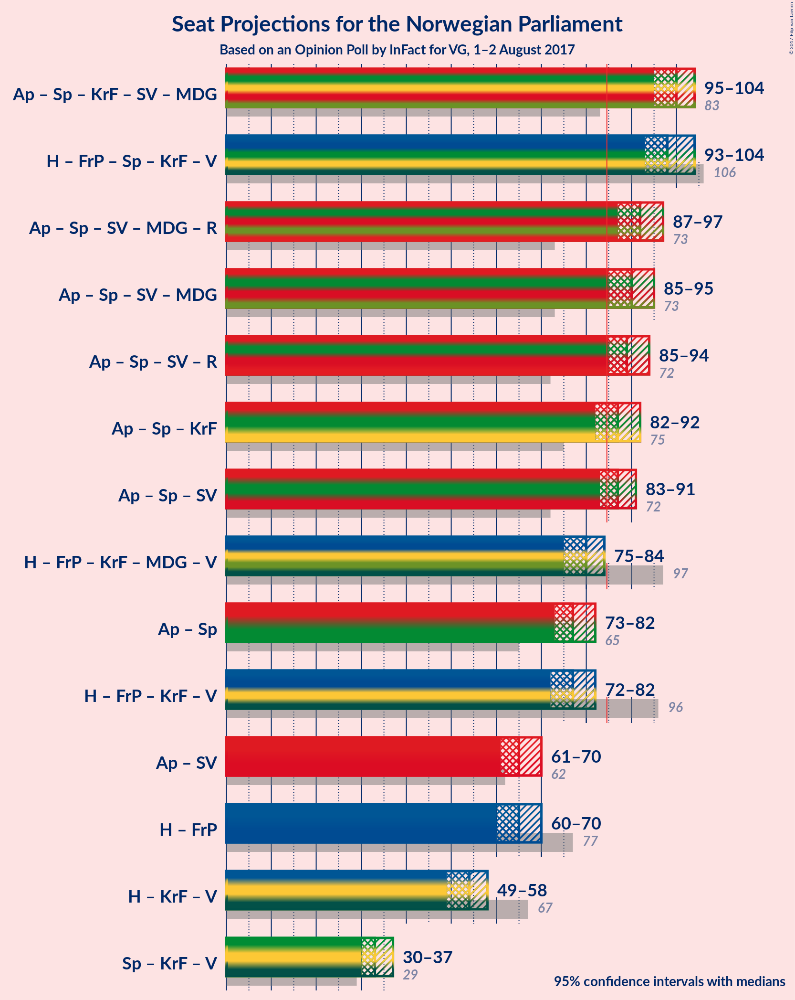

# Opinion Poll by InFact for VG, 1–2 August 2017

<a href="#voting-intentions">Voting Intentions</a> | <a href="#seats">Seats</a> | <a href="#coalitions">Coalitions</a> | <a href="#technical-information">Technical Information</a>

## Voting Intentions

### Confidence Intervals

| Party | Last Result | Poll Result | 80% Confidence Interval | 90% Confidence Interval | 95% Confidence Interval | 99% Confidence Interval |
|:-----:|:-----------:|:-----------:|:-----------------------:|:-----------------------:|:-----------------------:|:-----------------------:|
| Arbeiderpartiet | 30.8% | 30.0% | 28.7–31.4% |28.3–31.7% |28.0–32.1% |27.4–32.7% |
| Høyre | 26.8% | 22.7% | 21.6–24.0% |21.2–24.3% |20.9–24.6% |20.4–25.2% |
| Fremskrittspartiet | 16.3% | 12.6% | 11.7–13.6% |11.4–13.9% |11.2–14.1% |10.8–14.6% |
| Senterpartiet | 5.5% | 11.9% | 11.0–12.9% |10.8–13.2% |10.6–13.4% |10.2–13.9% |
| Kristelig Folkeparti | 5.6% | 5.2% | 4.6–5.9% |4.5–6.1% |4.3–6.3% |4.1–6.6% |
| Sosialistisk Venstreparti | 4.1% | 5.2% | 4.6–5.9% |4.5–6.1% |4.3–6.3% |4.1–6.6% |
| Miljøpartiet de Grønne | 2.8% | 3.6% | 3.1–4.2% |3.0–4.4% |2.9–4.5% |2.7–4.8% |
| Venstre | 5.2% | 3.2% | 2.8–3.8% |2.6–3.9% |2.5–4.1% |2.3–4.4% |
| Rødt | 1.1% | 3.2% | 2.8–3.8% |2.6–3.9% |2.5–4.1% |2.3–4.4% |

*Note:* The poll result column reflects the actual value used in the calculations. Published results may vary slightly, and in addition be rounded to fewer digits.

## Seats

### Confidence Intervals

| Party | Last Result | Median | 80% Confidence Interval | 90% Confidence Interval | 95% Confidence Interval | 99% Confidence Interval |
|:-----:|:-----------:|:------:|:-----------------------:|:-----------------------:|:-----------------------:|:-----------------------:|
| <a href="#arbeiderpartiet">Arbeiderpartiet</a> | 55 | 56 | 53–57 |53–58 |51–60 |50–61 |
| <a href="#høyre">Høyre</a> | 48 | 43 | 39–45 |39–45 |38–47 |37–47 |
| <a href="#fremskrittspartiet">Fremskrittspartiet</a> | 29 | 23 | 22–25 |21–26 |20–26 |19–27 |
| <a href="#senterpartiet">Senterpartiet</a> | 10 | 21 | 20–23 |20–24 |19–24 |19–26 |
| <a href="#kristelig-folkeparti">Kristelig Folkeparti</a> | 10 | 10 | 9–11 |8–11 |8–12 |8–12 |
| <a href="#sosialistisk-venstreparti">Sosialistisk Venstreparti</a> | 7 | 10 | 9–11 |8–11 |8–11 |2–12 |
| <a href="#miljøpartiet-de-grønne">Miljøpartiet de Grønne</a> | 1 | 3 | 1–7 |1–8 |1–8 |1–9 |
| <a href="#venstre">Venstre</a> | 9 | 2 | 1–2 |1–3 |1–3 |0–8 |
| <a href="#rødt">Rødt</a> | 0 | 2 | 2 |1–2 |1–7 |1–8 |

### Arbeiderpartiet

| Number of Seats | Probability | Accumulated |
|:---------------:|:-----------:|:-----------:|
| 49 | 0% | 100% |
| 50 | 0.8% | 99.9% |
| 51 | 2% | 99.2% |
| 52 | 1.2% | 97% |
| 53 | 11% | 96% |
| 54 | 14% | 86% |
| 55 | 10% | 71% |
| 56 | 39% | 61% |
| 57 | 12% | 22% |
| 58 | 6% | 10% |
| 59 | 1.5% | 4% |
| 60 | 2% | 3% |
| 61 | 0.9% | 1.1% |
| 62 | 0.1% | 0.2% |
| 63 | 0.1% | 0.1% |
| 64 | 0.1% | 0.1% |
| 65 | 0% | 0% |

### Høyre

| Number of Seats | Probability | Accumulated |
|:---------------:|:-----------:|:-----------:|
| 35 | 0.1% | 100% |
| 36 | 0.1% | 99.9% |
| 37 | 1.3% | 99.8% |
| 38 | 2% | 98.5% |
| 39 | 7% | 96% |
| 40 | 12% | 90% |
| 41 | 10% | 78% |
| 42 | 8% | 67% |
| 43 | 42% | 59% |
| 44 | 5% | 17% |
| 45 | 7% | 11% |
| 46 | 0.9% | 4% |
| 47 | 3% | 3% |
| 48 | 0.1% | 0.1% |
| 49 | 0% | 0% |

### Fremskrittspartiet

| Number of Seats | Probability | Accumulated |
|:---------------:|:-----------:|:-----------:|
| 19 | 0.6% | 100% |
| 20 | 2% | 99.4% |
| 21 | 6% | 97% |
| 22 | 8% | 91% |
| 23 | 55% | 83% |
| 24 | 16% | 28% |
| 25 | 5% | 13% |
| 26 | 6% | 7% |
| 27 | 0.6% | 1.1% |
| 28 | 0.4% | 0.5% |
| 29 | 0% | 0% |

### Senterpartiet

| Number of Seats | Probability | Accumulated |
|:---------------:|:-----------:|:-----------:|
| 17 | 0.1% | 100% |
| 18 | 0.2% | 99.9% |
| 19 | 2% | 99.7% |
| 20 | 44% | 97% |
| 21 | 8% | 54% |
| 22 | 17% | 46% |
| 23 | 20% | 29% |
| 24 | 6% | 8% |
| 25 | 2% | 2% |
| 26 | 0.5% | 0.9% |
| 27 | 0.3% | 0.3% |
| 28 | 0% | 0% |

### Kristelig Folkeparti

| Number of Seats | Probability | Accumulated |
|:---------------:|:-----------:|:-----------:|
| 2 | 0.2% | 100% |
| 3 | 0% | 99.8% |
| 4 | 0% | 99.8% |
| 5 | 0% | 99.8% |
| 6 | 0% | 99.8% |
| 7 | 0.2% | 99.8% |
| 8 | 8% | 99.5% |
| 9 | 24% | 91% |
| 10 | 49% | 68% |
| 11 | 15% | 18% |
| 12 | 3% | 3% |
| 13 | 0.1% | 0.1% |
| 14 | 0% | 0% |

### Sosialistisk Venstreparti

| Number of Seats | Probability | Accumulated |
|:---------------:|:-----------:|:-----------:|
| 2 | 0.5% | 100% |
| 3 | 0% | 99.5% |
| 4 | 0% | 99.5% |
| 5 | 0% | 99.5% |
| 6 | 0% | 99.5% |
| 7 | 0.2% | 99.5% |
| 8 | 7% | 99.2% |
| 9 | 21% | 92% |
| 10 | 51% | 71% |
| 11 | 17% | 20% |
| 12 | 2% | 2% |
| 13 | 0.1% | 0.1% |
| 14 | 0% | 0% |

### Miljøpartiet de Grønne

| Number of Seats | Probability | Accumulated |
|:---------------:|:-----------:|:-----------:|
| 1 | 26% | 100% |
| 2 | 7% | 74% |
| 3 | 51% | 67% |
| 4 | 0.8% | 16% |
| 5 | 0% | 15% |
| 6 | 0% | 15% |
| 7 | 7% | 15% |
| 8 | 7% | 8% |
| 9 | 0.8% | 0.8% |
| 10 | 0% | 0% |

### Venstre

| Number of Seats | Probability | Accumulated |
|:---------------:|:-----------:|:-----------:|
| 0 | 1.5% | 100% |
| 1 | 25% | 98.5% |
| 2 | 65% | 73% |
| 3 | 6% | 8% |
| 4 | 0% | 2% |
| 5 | 0% | 2% |
| 6 | 0% | 2% |
| 7 | 2% | 2% |
| 8 | 0.8% | 0.8% |
| 9 | 0% | 0% |

### Rødt

| Number of Seats | Probability | Accumulated |
|:---------------:|:-----------:|:-----------:|
| 1 | 8% | 100% |
| 2 | 89% | 92% |
| 3 | 0% | 3% |
| 4 | 0% | 3% |
| 5 | 0% | 3% |
| 6 | 0% | 3% |
| 7 | 2% | 3% |
| 8 | 0.9% | 1.0% |
| 9 | 0% | 0% |

## Coalitions

### Confidence Intervals

| Coalition | Last Result | Median | 80% Confidence Interval | 90% Confidence Interval | 95% Confidence Interval | 99% Confidence Interval |
|:---------:|:-----------:|:------:|:-----------------------:|:-----------------------:|:-----------------------:|:-----------------------:|
| Arbeiderpartiet – Senterpartiet – Kristelig Folkeparti – Sosialistisk Venstreparti – Miljøpartiet de Grønne | 83 | 99 | 97–102 | 95–103 | 95–104 | 94–107 |
| Høyre – Fremskrittspartiet – Senterpartiet – Kristelig Folkeparti – Venstre | 106 | 98 | 95–103 | 95–103 | 93–104 | 90–105 |
| Arbeiderpartiet – Senterpartiet – Sosialistisk Venstreparti – Miljøpartiet de Grønne – Rødt | 73 | 91 | 89–94 | 88–96 | 87–97 | 86–101 |
| Arbeiderpartiet – Senterpartiet – Sosialistisk Venstreparti – Miljøpartiet de Grønne | 73 | 89 | 87–92 | 86–93 | 85–95 | 84–99 |
| Arbeiderpartiet – Senterpartiet – Sosialistisk Venstreparti – Rødt | 72 | 88 | 86–91 | 85–93 | 85–94 | 84–96 |
| Arbeiderpartiet – Senterpartiet – Sosialistisk Venstreparti | 72 | 86 | 84–89 | 83–91 | 83–91 | 81–94 |
| Høyre – Fremskrittspartiet – Kristelig Folkeparti – Miljøpartiet de Grønne – Venstre | 97 | 81 | 78–83 | 76–84 | 75–84 | 73–85 |
| Arbeiderpartiet – Senterpartiet | 65 | 76 | 74–80 | 74–80 | 73–82 | 72–84 |
| Høyre – Fremskrittspartiet – Kristelig Folkeparti – Venstre | 96 | 78 | 75–80 | 73–81 | 72–82 | 68–83 |
| Høyre – Fremskrittspartiet | 77 | 66 | 63–68 | 62–70 | 60–70 | 58–71 |
| Arbeiderpartiet – Sosialistisk Venstreparti | 62 | 66 | 63–68 | 62–69 | 61–69 | 60–71 |
| Høyre – Kristelig Folkeparti – Venstre | 67 | 54 | 51–57 | 50–58 | 49–58 | 48–59 |
| Senterpartiet – Kristelig Folkeparti – Venstre | 29 | 32 | 31–36 | 31–36 | 30–37 | 29–39 |

### Arbeiderpartiet – Senterpartiet – Kristelig Folkeparti – Sosialistisk Venstreparti – Miljøpartiet de Grønne

| Number of Seats | Probability | Accumulated |
|:---------------:|:-----------:|:-----------:|
| 91 | 0.1% | 100% |
| 92 | 0% | 99.9% |
| 93 | 0.4% | 99.9% |
| 94 | 0.5% | 99.5% |
| 95 | 5% | 99.1% |
| 96 | 1.4% | 94% |
| 97 | 6% | 93% |
| 98 | 8% | 87% |
| 99 | 39% | 78% |
| 100 | 9% | 39% |
| 101 | 7% | 30% |
| 102 | 17% | 23% |
| 103 | 3% | 6% |
| 104 | 1.4% | 3% |
| 105 | 0.3% | 2% |
| 106 | 0.5% | 2% |
| 107 | 0.9% | 1.1% |
| 108 | 0% | 0.1% |
| 109 | 0.1% | 0.1% |
| 110 | 0% | 0% |

### Høyre – Fremskrittspartiet – Senterpartiet – Kristelig Folkeparti – Venstre

| Number of Seats | Probability | Accumulated |
|:---------------:|:-----------:|:-----------:|
| 87 | 0.1% | 100% |
| 88 | 0% | 99.9% |
| 89 | 0.1% | 99.9% |
| 90 | 0.5% | 99.8% |
| 91 | 0.3% | 99.3% |
| 92 | 1.0% | 99.0% |
| 93 | 0.6% | 98% |
| 94 | 2% | 97% |
| 95 | 7% | 96% |
| 96 | 11% | 89% |
| 97 | 5% | 77% |
| 98 | 32% | 73% |
| 99 | 11% | 41% |
| 100 | 9% | 30% |
| 101 | 6% | 21% |
| 102 | 5% | 15% |
| 103 | 7% | 10% |
| 104 | 2% | 3% |
| 105 | 1.0% | 1.2% |
| 106 | 0.1% | 0.1% |
| 107 | 0% | 0% |

### Arbeiderpartiet – Senterpartiet – Sosialistisk Venstreparti – Miljøpartiet de Grønne – Rødt

| Number of Seats | Probability | Accumulated |
|:---------------:|:-----------:|:-----------:|
| 85 | 0.1% | 100% |
| 86 | 0.5% | 99.9% |
| 87 | 2% | 99.4% |
| 88 | 5% | 97% |
| 89 | 5% | 92% |
| 90 | 4% | 87% |
| 91 | 36% | 84% |
| 92 | 14% | 48% |
| 93 | 10% | 34% |
| 94 | 14% | 23% |
| 95 | 4% | 10% |
| 96 | 3% | 6% |
| 97 | 0.7% | 3% |
| 98 | 0.6% | 2% |
| 99 | 0.6% | 2% |
| 100 | 0.3% | 1.0% |
| 101 | 0.6% | 0.7% |
| 102 | 0.1% | 0.1% |
| 103 | 0% | 0% |

### Arbeiderpartiet – Senterpartiet – Sosialistisk Venstreparti – Miljøpartiet de Grønne

| Number of Seats | Probability | Accumulated |
|:---------------:|:-----------:|:-----------:|
| 83 | 0.1% | 100% |
| 84 | 0.5% | 99.8% |
| 85 | 2% | 99.3% |
| 86 | 5% | 97% |
| 87 | 5% | 92% |
| 88 | 5% | 87% |
| 89 | 36% | 82% |
| 90 | 13% | 46% |
| 91 | 13% | 33% |
| 92 | 12% | 21% |
| 93 | 5% | 9% |
| 94 | 2% | 4% |
| 95 | 0.8% | 3% |
| 96 | 0.5% | 2% |
| 97 | 0.6% | 1.4% |
| 98 | 0.3% | 0.9% |
| 99 | 0.6% | 0.6% |
| 100 | 0% | 0% |

### Arbeiderpartiet – Senterpartiet – Sosialistisk Venstreparti – Rødt

| Number of Seats | Probability | Accumulated |
|:---------------:|:-----------:|:-----------:|
| 81 | 0.1% | 100% |
| 82 | 0.1% | 99.9% |
| 83 | 0.3% | 99.8% |
| 84 | 0.7% | 99.5% |
| 85 | 4% | 98.9% |
| 86 | 5% | 95% |
| 87 | 9% | 89% |
| 88 | 32% | 80% |
| 89 | 18% | 49% |
| 90 | 16% | 31% |
| 91 | 6% | 15% |
| 92 | 3% | 9% |
| 93 | 4% | 7% |
| 94 | 0.9% | 3% |
| 95 | 1.1% | 2% |
| 96 | 0.5% | 0.7% |
| 97 | 0% | 0.1% |
| 98 | 0.1% | 0.1% |
| 99 | 0% | 0% |

### Arbeiderpartiet – Senterpartiet – Sosialistisk Venstreparti

| Number of Seats | Probability | Accumulated |
|:---------------:|:-----------:|:-----------:|
| 79 | 0.1% | 100% |
| 80 | 0.1% | 99.9% |
| 81 | 0.3% | 99.8% |
| 82 | 0.9% | 99.5% |
| 83 | 5% | 98.6% |
| 84 | 5% | 94% |
| 85 | 10% | 89% |
| 86 | 31% | 79% |
| 87 | 16% | 48% |
| 88 | 17% | 32% |
| 89 | 7% | 15% |
| 90 | 3% | 8% |
| 91 | 4% | 5% |
| 92 | 0.7% | 2% |
| 93 | 0.3% | 0.9% |
| 94 | 0.5% | 0.5% |
| 95 | 0% | 0% |

### Høyre – Fremskrittspartiet – Kristelig Folkeparti – Miljøpartiet de Grønne – Venstre

| Number of Seats | Probability | Accumulated |
|:---------------:|:-----------:|:-----------:|
| 71 | 0.1% | 100% |
| 72 | 0% | 99.9% |
| 73 | 0.5% | 99.9% |
| 74 | 1.1% | 99.3% |
| 75 | 0.9% | 98% |
| 76 | 4% | 97% |
| 77 | 3% | 93% |
| 78 | 6% | 91% |
| 79 | 16% | 85% |
| 80 | 18% | 69% |
| 81 | 32% | 51% |
| 82 | 9% | 20% |
| 83 | 5% | 11% |
| 84 | 4% | 5% |
| 85 | 0.7% | 1.1% |
| 86 | 0.3% | 0.5% |
| 87 | 0.1% | 0.2% |
| 88 | 0.1% | 0.1% |
| 89 | 0% | 0% |

### Arbeiderpartiet – Senterpartiet

| Number of Seats | Probability | Accumulated |
|:---------------:|:-----------:|:-----------:|
| 70 | 0% | 100% |
| 71 | 0.2% | 99.9% |
| 72 | 0.6% | 99.8% |
| 73 | 3% | 99.1% |
| 74 | 7% | 96% |
| 75 | 4% | 89% |
| 76 | 38% | 85% |
| 77 | 12% | 47% |
| 78 | 19% | 36% |
| 79 | 5% | 16% |
| 80 | 6% | 11% |
| 81 | 1.4% | 5% |
| 82 | 2% | 3% |
| 83 | 1.0% | 2% |
| 84 | 0.3% | 0.7% |
| 85 | 0.4% | 0.4% |
| 86 | 0% | 0% |

### Høyre – Fremskrittspartiet – Kristelig Folkeparti – Venstre

| Number of Seats | Probability | Accumulated |
|:---------------:|:-----------:|:-----------:|
| 67 | 0.1% | 100% |
| 68 | 0.6% | 99.9% |
| 69 | 0.3% | 99.3% |
| 70 | 0.6% | 99.0% |
| 71 | 0.6% | 98% |
| 72 | 0.7% | 98% |
| 73 | 3% | 97% |
| 74 | 4% | 94% |
| 75 | 14% | 90% |
| 76 | 10% | 77% |
| 77 | 14% | 66% |
| 78 | 36% | 52% |
| 79 | 4% | 16% |
| 80 | 5% | 13% |
| 81 | 5% | 8% |
| 82 | 2% | 3% |
| 83 | 0.5% | 0.6% |
| 84 | 0.1% | 0.1% |
| 85 | 0% | 0% |

### Høyre – Fremskrittspartiet

| Number of Seats | Probability | Accumulated |
|:---------------:|:-----------:|:-----------:|
| 57 | 0.2% | 100% |
| 58 | 0.6% | 99.8% |
| 59 | 0.9% | 99.2% |
| 60 | 0.8% | 98% |
| 61 | 2% | 97% |
| 62 | 3% | 95% |
| 63 | 10% | 92% |
| 64 | 13% | 82% |
| 65 | 5% | 69% |
| 66 | 46% | 64% |
| 67 | 3% | 18% |
| 68 | 8% | 15% |
| 69 | 1.2% | 7% |
| 70 | 5% | 5% |
| 71 | 0.7% | 0.8% |
| 72 | 0.1% | 0.1% |
| 73 | 0% | 0% |

### Arbeiderpartiet – Sosialistisk Venstreparti

| Number of Seats | Probability | Accumulated |
|:---------------:|:-----------:|:-----------:|
| 58 | 0.1% | 100% |
| 59 | 0.2% | 99.9% |
| 60 | 2% | 99.6% |
| 61 | 1.2% | 98% |
| 62 | 3% | 96% |
| 63 | 11% | 93% |
| 64 | 12% | 82% |
| 65 | 18% | 71% |
| 66 | 32% | 52% |
| 67 | 9% | 21% |
| 68 | 6% | 12% |
| 69 | 4% | 6% |
| 70 | 1.4% | 2% |
| 71 | 0.4% | 0.5% |
| 72 | 0.1% | 0.2% |
| 73 | 0.1% | 0.1% |
| 74 | 0% | 0% |

### Høyre – Kristelig Folkeparti – Venstre

| Number of Seats | Probability | Accumulated |
|:---------------:|:-----------:|:-----------:|
| 45 | 0% | 100% |
| 46 | 0.1% | 99.9% |
| 47 | 0.2% | 99.9% |
| 48 | 1.2% | 99.6% |
| 49 | 2% | 98% |
| 50 | 3% | 97% |
| 51 | 12% | 93% |
| 52 | 6% | 81% |
| 53 | 8% | 75% |
| 54 | 19% | 67% |
| 55 | 34% | 48% |
| 56 | 3% | 14% |
| 57 | 4% | 11% |
| 58 | 7% | 7% |
| 59 | 0.5% | 0.8% |
| 60 | 0.2% | 0.3% |
| 61 | 0.1% | 0.1% |
| 62 | 0% | 0% |

### Senterpartiet – Kristelig Folkeparti – Venstre

| Number of Seats | Probability | Accumulated |
|:---------------:|:-----------:|:-----------:|
| 25 | 0.1% | 100% |
| 26 | 0% | 99.9% |
| 27 | 0% | 99.9% |
| 28 | 0.2% | 99.8% |
| 29 | 1.2% | 99.6% |
| 30 | 3% | 98% |
| 31 | 6% | 95% |
| 32 | 41% | 89% |
| 33 | 15% | 48% |
| 34 | 13% | 33% |
| 35 | 7% | 21% |
| 36 | 8% | 13% |
| 37 | 3% | 5% |
| 38 | 1.0% | 2% |
| 39 | 0.4% | 0.9% |
| 40 | 0.2% | 0.4% |
| 41 | 0.1% | 0.3% |
| 42 | 0.1% | 0.1% |
| 43 | 0% | 0% |

## Technical Information

### Opinion Poll

+ **Pollster:** InFact
+ **Media:** VG
+ **Fieldwork period:** 1–2 August 2017

### Calculations

+ **Sample size:** 2016
+ **Simulations done:** 524,288
+ **Error estimate:** 1.16%

