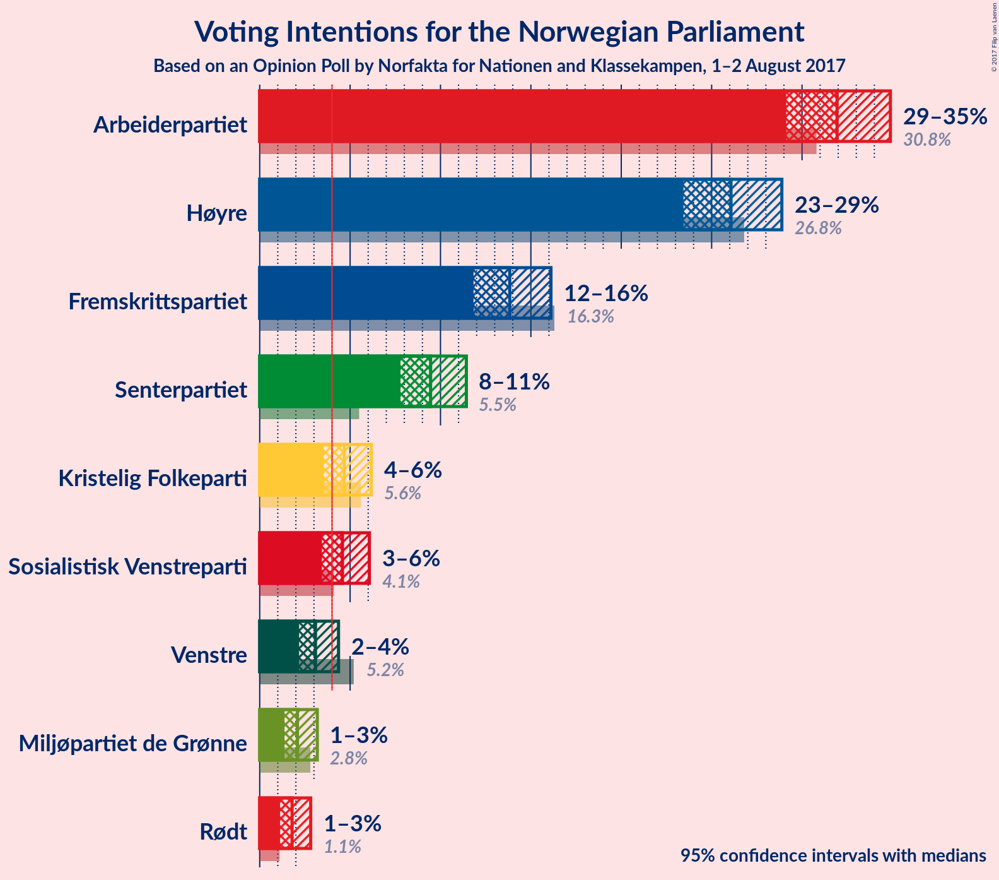
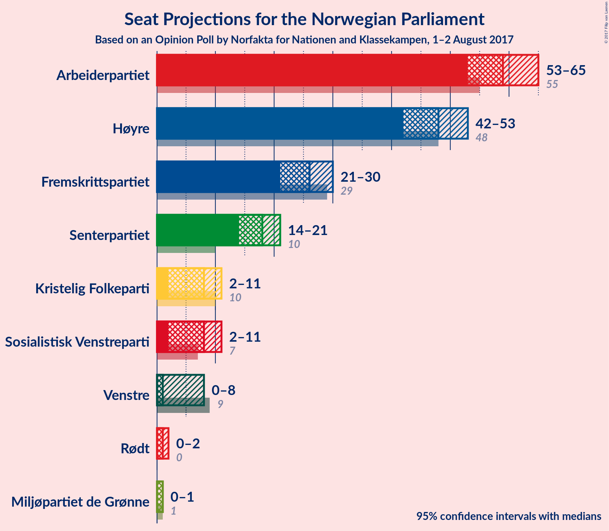
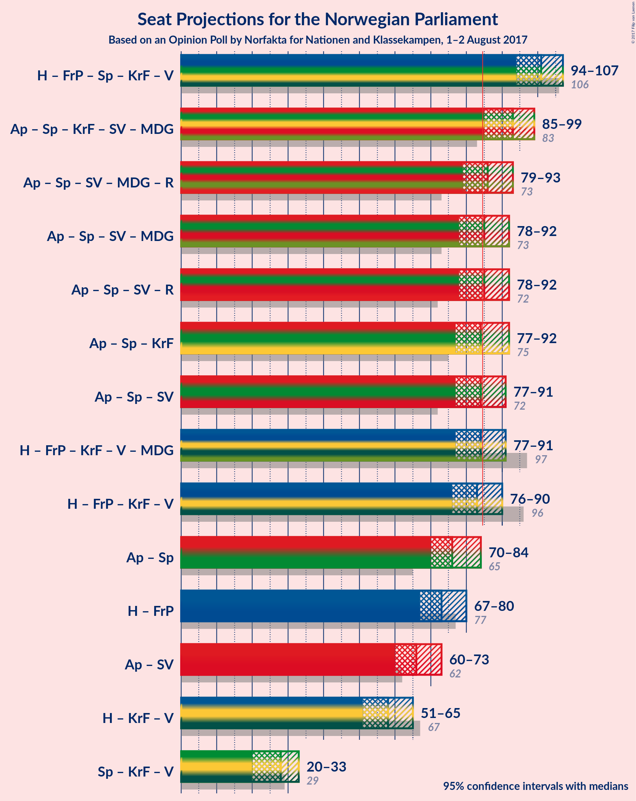

# Opinion Poll by Norfakta for Nationen and Klassekampen, 1–2 August 2017

<a href="#voting-intentions">Voting Intentions</a> | <a href="#seats">Seats</a> | <a href="#coalitions">Coalitions</a> | <a href="#technical-information">Technical Information</a>

## Voting Intentions

### Confidence Intervals

| Party | Last Result | Poll Result | 80% Confidence Interval | 90% Confidence Interval | 95% Confidence Interval | 99% Confidence Interval |
|:-----:|:-----------:|:-----------:|:-----------------------:|:-----------------------:|:-----------------------:|:-----------------------:|
| Arbeiderpartiet | 30.8% | 31.9% | 30.1–33.9% |29.6–34.4% |29.1–34.9% |28.3–35.8% |
| Høyre | 26.8% | 26.1% | 24.3–27.9% |23.9–28.4% |23.4–28.9% |22.6–29.8% |
| Fremskrittspartiet | 16.3% | 13.8% | 12.5–15.3% |12.1–15.7% |11.8–16.1% |11.2–16.8% |
| Senterpartiet | 5.5% | 9.5% | 8.4–10.7% |8.0–11.1% |7.8–11.4% |7.3–12.1% |
| Kristelig Folkeparti | 5.6% | 4.7% | 3.9–5.7% |3.7–5.9% |3.5–6.2% |3.2–6.7% |
| Sosialistisk Venstreparti | 4.1% | 4.6% | 3.8–5.5% |3.6–5.8% |3.4–6.1% |3.1–6.6% |
| Venstre | 5.2% | 3.1% | 2.5–3.9% |2.3–4.1% |2.2–4.4% |1.9–4.8% |
| Miljøpartiet de Grønne | 2.8% | 2.1% | 1.6–2.8% |1.5–3.0% |1.4–3.2% |1.2–3.6% |
| Rødt | 1.1% | 1.8% | 1.4–2.5% |1.2–2.7% |1.1–2.8% |1.0–3.2% |

*Note:* The poll result column reflects the actual value used in the calculations. Published results may vary slightly, and in addition be rounded to fewer digits.

## Seats

### Confidence Intervals

| Party | Last Result | Median | 80% Confidence Interval | 90% Confidence Interval | 95% Confidence Interval | 99% Confidence Interval |
|:-----:|:-----------:|:------:|:-----------------------:|:-----------------------:|:-----------------------:|:-----------------------:|
| <a href="#arbeiderpartiet">Arbeiderpartiet</a> | 55 | 59 | 55–63 |54–64 |53–65 |52–67 |
| <a href="#høyre">Høyre</a> | 48 | 48 | 44–51 |43–52 |42–53 |41–56 |
| <a href="#fremskrittspartiet">Fremskrittspartiet</a> | 29 | 26 | 23–28 |22–29 |21–30 |20–31 |
| <a href="#senterpartiet">Senterpartiet</a> | 10 | 18 | 15–20 |15–21 |14–21 |13–22 |
| <a href="#kristelig-folkeparti">Kristelig Folkeparti</a> | 10 | 8 | 2–10 |2–11 |2–11 |2–12 |
| <a href="#sosialistisk-venstreparti">Sosialistisk Venstreparti</a> | 7 | 8 | 2–10 |2–11 |2–11 |1–12 |
| <a href="#venstre">Venstre</a> | 9 | 1 | 1–3 |1–8 |0–8 |0–8 |
| <a href="#miljøpartiet-de-grønne">Miljøpartiet de Grønne</a> | 1 | 1 | 0–1 |0–1 |0–1 |0–3 |
| <a href="#rødt">Rødt</a> | 0 | 1 | 1 |1–2 |0–2 |0–2 |

### Arbeiderpartiet

| Number of Seats | Probability | Accumulated |
|:---------------:|:-----------:|:-----------:|
| 49 | 0.1% | 100% |
| 50 | 0.1% | 99.9% |
| 51 | 0.3% | 99.9% |
| 52 | 0.5% | 99.6% |
| 53 | 4% | 99.0% |
| 54 | 2% | 95% |
| 55 | 9% | 93% |
| 56 | 8% | 84% |
| 57 | 6% | 76% |
| 58 | 17% | 71% |
| 59 | 13% | 54% |
| 60 | 13% | 41% |
| 61 | 4% | 28% |
| 62 | 12% | 24% |
| 63 | 3% | 13% |
| 64 | 6% | 10% |
| 65 | 2% | 4% |
| 66 | 1.1% | 2% |
| 67 | 0.4% | 0.9% |
| 68 | 0.2% | 0.4% |
| 69 | 0.2% | 0.3% |
| 70 | 0% | 0% |

### Høyre

| Number of Seats | Probability | Accumulated |
|:---------------:|:-----------:|:-----------:|
| 39 | 0.1% | 100% |
| 40 | 0.3% | 99.9% |
| 41 | 0.8% | 99.7% |
| 42 | 1.5% | 98.9% |
| 43 | 4% | 97% |
| 44 | 5% | 93% |
| 45 | 11% | 89% |
| 46 | 7% | 77% |
| 47 | 15% | 70% |
| 48 | 11% | 55% |
| 49 | 12% | 44% |
| 50 | 9% | 32% |
| 51 | 13% | 22% |
| 52 | 5% | 9% |
| 53 | 2% | 4% |
| 54 | 0.6% | 2% |
| 55 | 0.7% | 1.3% |
| 56 | 0.4% | 0.5% |
| 57 | 0.1% | 0.2% |
| 58 | 0.1% | 0.1% |
| 59 | 0% | 0% |

### Fremskrittspartiet

| Number of Seats | Probability | Accumulated |
|:---------------:|:-----------:|:-----------:|
| 19 | 0.2% | 100% |
| 20 | 0.5% | 99.8% |
| 21 | 3% | 99.3% |
| 22 | 5% | 96% |
| 23 | 6% | 91% |
| 24 | 16% | 85% |
| 25 | 18% | 69% |
| 26 | 15% | 51% |
| 27 | 15% | 36% |
| 28 | 12% | 21% |
| 29 | 5% | 9% |
| 30 | 3% | 3% |
| 31 | 0.4% | 0.7% |
| 32 | 0.2% | 0.3% |
| 33 | 0.1% | 0.1% |
| 34 | 0% | 0% |

### Senterpartiet

| Number of Seats | Probability | Accumulated |
|:---------------:|:-----------:|:-----------:|
| 12 | 0.1% | 100% |
| 13 | 0.5% | 99.9% |
| 14 | 2% | 99.4% |
| 15 | 12% | 97% |
| 16 | 11% | 85% |
| 17 | 21% | 73% |
| 18 | 27% | 52% |
| 19 | 9% | 25% |
| 20 | 8% | 15% |
| 21 | 5% | 7% |
| 22 | 2% | 2% |
| 23 | 0.3% | 0.4% |
| 24 | 0.1% | 0.1% |
| 25 | 0% | 0% |

### Kristelig Folkeparti

| Number of Seats | Probability | Accumulated |
|:---------------:|:-----------:|:-----------:|
| 1 | 0.1% | 100% |
| 2 | 14% | 99.9% |
| 3 | 0% | 86% |
| 4 | 0% | 86% |
| 5 | 0% | 86% |
| 6 | 0% | 86% |
| 7 | 2% | 86% |
| 8 | 35% | 84% |
| 9 | 31% | 48% |
| 10 | 12% | 18% |
| 11 | 5% | 6% |
| 12 | 0.8% | 1.1% |
| 13 | 0.3% | 0.3% |
| 14 | 0.1% | 0.1% |
| 15 | 0% | 0% |

### Sosialistisk Venstreparti

| Number of Seats | Probability | Accumulated |
|:---------------:|:-----------:|:-----------:|
| 1 | 2% | 100% |
| 2 | 23% | 98% |
| 3 | 0% | 74% |
| 4 | 0% | 74% |
| 5 | 0% | 74% |
| 6 | 0% | 74% |
| 7 | 3% | 74% |
| 8 | 29% | 71% |
| 9 | 20% | 42% |
| 10 | 16% | 23% |
| 11 | 6% | 7% |
| 12 | 1.0% | 1.2% |
| 13 | 0.2% | 0.2% |
| 14 | 0% | 0% |

### Venstre

| Number of Seats | Probability | Accumulated |
|:---------------:|:-----------:|:-----------:|
| 0 | 3% | 100% |
| 1 | 51% | 97% |
| 2 | 24% | 45% |
| 3 | 14% | 22% |
| 4 | 0% | 7% |
| 5 | 0% | 7% |
| 6 | 0% | 7% |
| 7 | 2% | 7% |
| 8 | 5% | 6% |
| 9 | 0.3% | 0.4% |
| 10 | 0% | 0% |

### Miljøpartiet de Grønne

| Number of Seats | Probability | Accumulated |
|:---------------:|:-----------:|:-----------:|
| 0 | 16% | 100% |
| 1 | 83% | 84% |
| 2 | 0.1% | 0.8% |
| 3 | 0.6% | 0.7% |
| 4 | 0.1% | 0.2% |
| 5 | 0% | 0% |

### Rødt

| Number of Seats | Probability | Accumulated |
|:---------------:|:-----------:|:-----------:|
| 0 | 4% | 100% |
| 1 | 91% | 96% |
| 2 | 6% | 6% |
| 3 | 0% | 0% |

## Coalitions

### Confidence Intervals

| Coalition | Last Result | Median | 80% Confidence Interval | 90% Confidence Interval | 95% Confidence Interval | 99% Confidence Interval |
|:---------:|:-----------:|:------:|:-----------------------:|:-----------------------:|:-----------------------:|:-----------------------:|
| Høyre – Fremskrittspartiet – Senterpartiet – Kristelig Folkeparti – Venstre | 106 | 101 | 97–105 | 95–106 | 94–107 | 92–109 |
| Arbeiderpartiet – Senterpartiet – Kristelig Folkeparti – Sosialistisk Venstreparti – Miljøpartiet de Grønne | 83 | 93 | 87–97 | 87–99 | 86–99 | 84–101 |
| Arbeiderpartiet – Senterpartiet – Sosialistisk Venstreparti – Miljøpartiet de Grønne – Rødt | 73 | 86 | 80–90 | 79–92 | 79–92 | 77–94 |
| Arbeiderpartiet – Senterpartiet – Kristelig Folkeparti | 75 | 84 | 80–89 | 79–90 | 78–91 | 75–93 |
| Arbeiderpartiet – Senterpartiet – Sosialistisk Venstreparti – Miljøpartiet de Grønne | 73 | 85 | 79–89 | 78–91 | 78–91 | 76–93 |
| Arbeiderpartiet – Senterpartiet – Sosialistisk Venstreparti – Rødt | 72 | 85 | 79–89 | 78–91 | 78–91 | 76–93 |
| Høyre – Fremskrittspartiet – Kristelig Folkeparti – Venstre – Miljøpartiet de Grønne | 97 | 84 | 80–90 | 78–91 | 78–91 | 76–93 |
| Arbeiderpartiet – Senterpartiet – Sosialistisk Venstreparti | 72 | 84 | 78–88 | 77–90 | 77–90 | 75–92 |
| Høyre – Fremskrittspartiet – Kristelig Folkeparti – Venstre | 96 | 83 | 79–89 | 77–90 | 77–90 | 75–92 |
| Arbeiderpartiet – Senterpartiet | 65 | 76 | 72–81 | 71–84 | 70–85 | 68–86 |
| Høyre – Fremskrittspartiet | 77 | 74 | 69–79 | 68–79 | 67–79 | 65–82 |
| Arbeiderpartiet – Sosialistisk Venstreparti | 62 | 66 | 62–70 | 61–72 | 60–72 | 58–75 |
| Høyre – Kristelig Folkeparti – Venstre | 67 | 58 | 53–62 | 52–63 | 51–66 | 48–67 |
| Senterpartiet – Kristelig Folkeparti – Venstre | 29 | 27 | 24–31 | 23–33 | 20–34 | 18–35 |

### Høyre – Fremskrittspartiet – Senterpartiet – Kristelig Folkeparti – Venstre

| Number of Seats | Probability | Accumulated |
|:---------------:|:-----------:|:-----------:|
| 89 | 0% | 100% |
| 90 | 0.2% | 99.9% |
| 91 | 0.1% | 99.8% |
| 92 | 0.5% | 99.7% |
| 93 | 0.5% | 99.2% |
| 94 | 1.3% | 98.8% |
| 95 | 3% | 97% |
| 96 | 4% | 95% |
| 97 | 3% | 90% |
| 98 | 9% | 87% |
| 99 | 8% | 78% |
| 100 | 11% | 71% |
| 101 | 20% | 59% |
| 102 | 6% | 40% |
| 103 | 12% | 34% |
| 104 | 5% | 21% |
| 105 | 9% | 16% |
| 106 | 4% | 7% |
| 107 | 2% | 3% |
| 108 | 0.6% | 1.4% |
| 109 | 0.4% | 0.8% |
| 110 | 0.1% | 0.5% |
| 111 | 0.2% | 0.4% |
| 112 | 0% | 0.1% |
| 113 | 0.1% | 0.1% |
| 114 | 0% | 0% |

### Arbeiderpartiet – Senterpartiet – Kristelig Folkeparti – Sosialistisk Venstreparti – Miljøpartiet de Grønne

| Number of Seats | Probability | Accumulated |
|:---------------:|:-----------:|:-----------:|
| 79 | 0% | 100% |
| 80 | 0% | 99.9% |
| 81 | 0.1% | 99.9% |
| 82 | 0.1% | 99.9% |
| 83 | 0.2% | 99.7% |
| 84 | 0.3% | 99.5% |
| 85 | 1.0% | 99.3% |
| 86 | 2% | 98% |
| 87 | 7% | 97% |
| 88 | 4% | 90% |
| 89 | 5% | 85% |
| 90 | 16% | 80% |
| 91 | 6% | 65% |
| 92 | 7% | 58% |
| 93 | 15% | 51% |
| 94 | 9% | 36% |
| 95 | 6% | 27% |
| 96 | 10% | 22% |
| 97 | 4% | 12% |
| 98 | 2% | 8% |
| 99 | 4% | 5% |
| 100 | 0.5% | 2% |
| 101 | 0.7% | 1.2% |
| 102 | 0.3% | 0.5% |
| 103 | 0.1% | 0.1% |
| 104 | 0% | 0% |

### Arbeiderpartiet – Senterpartiet – Sosialistisk Venstreparti – Miljøpartiet de Grønne – Rødt

| Number of Seats | Probability | Accumulated |
|:---------------:|:-----------:|:-----------:|
| 74 | 0.1% | 100% |
| 75 | 0.1% | 99.9% |
| 76 | 0.1% | 99.8% |
| 77 | 0.3% | 99.7% |
| 78 | 1.5% | 99.4% |
| 79 | 7% | 98% |
| 80 | 3% | 91% |
| 81 | 4% | 88% |
| 82 | 5% | 84% |
| 83 | 12% | 79% |
| 84 | 5% | 67% |
| 85 | 7% | 62% |
| 86 | 13% | 55% |
| 87 | 8% | 42% |
| 88 | 10% | 34% |
| 89 | 11% | 24% |
| 90 | 6% | 14% |
| 91 | 2% | 8% |
| 92 | 4% | 5% |
| 93 | 0.8% | 2% |
| 94 | 0.7% | 1.0% |
| 95 | 0.1% | 0.3% |
| 96 | 0.1% | 0.1% |
| 97 | 0% | 0% |

### Arbeiderpartiet – Senterpartiet – Kristelig Folkeparti

| Number of Seats | Probability | Accumulated |
|:---------------:|:-----------:|:-----------:|
| 73 | 0.1% | 100% |
| 74 | 0.1% | 99.9% |
| 75 | 0.4% | 99.7% |
| 76 | 0.6% | 99.3% |
| 77 | 0.9% | 98.8% |
| 78 | 1.5% | 98% |
| 79 | 4% | 96% |
| 80 | 7% | 93% |
| 81 | 5% | 86% |
| 82 | 10% | 81% |
| 83 | 4% | 71% |
| 84 | 23% | 67% |
| 85 | 6% | 44% |
| 86 | 10% | 38% |
| 87 | 14% | 27% |
| 88 | 3% | 13% |
| 89 | 3% | 11% |
| 90 | 3% | 8% |
| 91 | 2% | 4% |
| 92 | 1.4% | 2% |
| 93 | 0.4% | 0.8% |
| 94 | 0.2% | 0.4% |
| 95 | 0% | 0.2% |
| 96 | 0.2% | 0.2% |
| 97 | 0% | 0% |

### Arbeiderpartiet – Senterpartiet – Sosialistisk Venstreparti – Miljøpartiet de Grønne

| Number of Seats | Probability | Accumulated |
|:---------------:|:-----------:|:-----------:|
| 73 | 0.1% | 100% |
| 74 | 0.1% | 99.9% |
| 75 | 0.1% | 99.8% |
| 76 | 0.5% | 99.7% |
| 77 | 1.5% | 99.2% |
| 78 | 7% | 98% |
| 79 | 3% | 91% |
| 80 | 4% | 88% |
| 81 | 5% | 84% |
| 82 | 12% | 79% |
| 83 | 5% | 68% |
| 84 | 8% | 62% |
| 85 | 14% | 55% |
| 86 | 8% | 41% |
| 87 | 9% | 33% |
| 88 | 12% | 25% |
| 89 | 5% | 13% |
| 90 | 2% | 8% |
| 91 | 4% | 5% |
| 92 | 0.9% | 2% |
| 93 | 0.6% | 0.9% |
| 94 | 0.2% | 0.3% |
| 95 | 0.1% | 0.1% |
| 96 | 0% | 0.1% |
| 97 | 0% | 0% |

### Arbeiderpartiet – Senterpartiet – Sosialistisk Venstreparti – Rødt

| Number of Seats | Probability | Accumulated |
|:---------------:|:-----------:|:-----------:|
| 73 | 0.1% | 100% |
| 74 | 0.1% | 99.9% |
| 75 | 0.1% | 99.8% |
| 76 | 0.3% | 99.7% |
| 77 | 1.3% | 99.4% |
| 78 | 7% | 98% |
| 79 | 3% | 91% |
| 80 | 3% | 88% |
| 81 | 6% | 85% |
| 82 | 12% | 80% |
| 83 | 4% | 67% |
| 84 | 7% | 63% |
| 85 | 14% | 57% |
| 86 | 8% | 43% |
| 87 | 7% | 35% |
| 88 | 15% | 28% |
| 89 | 5% | 14% |
| 90 | 3% | 9% |
| 91 | 4% | 6% |
| 92 | 1.0% | 2% |
| 93 | 0.6% | 1.0% |
| 94 | 0.2% | 0.4% |
| 95 | 0.1% | 0.2% |
| 96 | 0% | 0.1% |
| 97 | 0% | 0% |

### Høyre – Fremskrittspartiet – Kristelig Folkeparti – Venstre – Miljøpartiet de Grønne

| Number of Seats | Probability | Accumulated |
|:---------------:|:-----------:|:-----------:|
| 73 | 0% | 100% |
| 74 | 0.2% | 99.9% |
| 75 | 0.2% | 99.7% |
| 76 | 0.6% | 99.5% |
| 77 | 1.0% | 98.9% |
| 78 | 4% | 98% |
| 79 | 3% | 94% |
| 80 | 5% | 91% |
| 81 | 15% | 86% |
| 82 | 7% | 71% |
| 83 | 8% | 64% |
| 84 | 14% | 57% |
| 85 | 7% | 43% |
| 86 | 4% | 36% |
| 87 | 12% | 32% |
| 88 | 6% | 20% |
| 89 | 3% | 15% |
| 90 | 3% | 12% |
| 91 | 7% | 9% |
| 92 | 1.2% | 2% |
| 93 | 0.3% | 0.6% |
| 94 | 0.1% | 0.3% |
| 95 | 0.1% | 0.2% |
| 96 | 0.1% | 0.1% |
| 97 | 0% | 0% |

### Arbeiderpartiet – Senterpartiet – Sosialistisk Venstreparti

| Number of Seats | Probability | Accumulated |
|:---------------:|:-----------:|:-----------:|
| 72 | 0.1% | 100% |
| 73 | 0.1% | 99.9% |
| 74 | 0.1% | 99.8% |
| 75 | 0.3% | 99.7% |
| 76 | 2% | 99.4% |
| 77 | 7% | 98% |
| 78 | 3% | 91% |
| 79 | 3% | 88% |
| 80 | 5% | 85% |
| 81 | 12% | 80% |
| 82 | 4% | 68% |
| 83 | 7% | 64% |
| 84 | 14% | 57% |
| 85 | 9% | 43% |
| 86 | 5% | 34% |
| 87 | 15% | 29% |
| 88 | 6% | 14% |
| 89 | 2% | 8% |
| 90 | 4% | 6% |
| 91 | 1.0% | 2% |
| 92 | 0.6% | 0.9% |
| 93 | 0.2% | 0.3% |
| 94 | 0.1% | 0.2% |
| 95 | 0% | 0.1% |
| 96 | 0% | 0% |

### Høyre – Fremskrittspartiet – Kristelig Folkeparti – Venstre

| Number of Seats | Probability | Accumulated |
|:---------------:|:-----------:|:-----------:|
| 72 | 0% | 100% |
| 73 | 0.1% | 99.9% |
| 74 | 0.2% | 99.8% |
| 75 | 0.7% | 99.6% |
| 76 | 0.8% | 98.9% |
| 77 | 4% | 98% |
| 78 | 2% | 94% |
| 79 | 6% | 92% |
| 80 | 11% | 86% |
| 81 | 10% | 75% |
| 82 | 8% | 66% |
| 83 | 13% | 57% |
| 84 | 7% | 45% |
| 85 | 5% | 37% |
| 86 | 12% | 33% |
| 87 | 5% | 21% |
| 88 | 4% | 16% |
| 89 | 3% | 12% |
| 90 | 7% | 9% |
| 91 | 1.5% | 2% |
| 92 | 0.3% | 0.6% |
| 93 | 0.1% | 0.3% |
| 94 | 0.1% | 0.2% |
| 95 | 0.1% | 0.1% |
| 96 | 0% | 0% |

### Arbeiderpartiet – Senterpartiet

| Number of Seats | Probability | Accumulated |
|:---------------:|:-----------:|:-----------:|
| 66 | 0.1% | 100% |
| 67 | 0.1% | 99.9% |
| 68 | 0.5% | 99.8% |
| 69 | 0.4% | 99.3% |
| 70 | 3% | 98.9% |
| 71 | 5% | 96% |
| 72 | 6% | 91% |
| 73 | 5% | 85% |
| 74 | 7% | 81% |
| 75 | 15% | 74% |
| 76 | 13% | 59% |
| 77 | 9% | 46% |
| 78 | 9% | 37% |
| 79 | 10% | 28% |
| 80 | 5% | 18% |
| 81 | 5% | 13% |
| 82 | 2% | 8% |
| 83 | 1.1% | 6% |
| 84 | 0.8% | 5% |
| 85 | 4% | 5% |
| 86 | 0.2% | 0.6% |
| 87 | 0.4% | 0.4% |
| 88 | 0% | 0% |

### Høyre – Fremskrittspartiet

| Number of Seats | Probability | Accumulated |
|:---------------:|:-----------:|:-----------:|
| 62 | 0% | 100% |
| 63 | 0.2% | 99.9% |
| 64 | 0.2% | 99.8% |
| 65 | 0.5% | 99.6% |
| 66 | 1.5% | 99.1% |
| 67 | 1.0% | 98% |
| 68 | 6% | 97% |
| 69 | 6% | 90% |
| 70 | 3% | 85% |
| 71 | 11% | 81% |
| 72 | 6% | 70% |
| 73 | 10% | 64% |
| 74 | 16% | 54% |
| 75 | 8% | 38% |
| 76 | 8% | 30% |
| 77 | 9% | 22% |
| 78 | 3% | 13% |
| 79 | 8% | 10% |
| 80 | 1.0% | 2% |
| 81 | 0.4% | 1.0% |
| 82 | 0.3% | 0.6% |
| 83 | 0.2% | 0.3% |
| 84 | 0.1% | 0.1% |
| 85 | 0% | 0% |

### Arbeiderpartiet – Sosialistisk Venstreparti

| Number of Seats | Probability | Accumulated |
|:---------------:|:-----------:|:-----------:|
| 54 | 0.1% | 100% |
| 55 | 0.1% | 99.9% |
| 56 | 0.2% | 99.8% |
| 57 | 0.1% | 99.6% |
| 58 | 0.4% | 99.5% |
| 59 | 0.6% | 99.1% |
| 60 | 1.4% | 98.5% |
| 61 | 4% | 97% |
| 62 | 8% | 93% |
| 63 | 6% | 85% |
| 64 | 11% | 79% |
| 65 | 8% | 68% |
| 66 | 19% | 61% |
| 67 | 12% | 41% |
| 68 | 4% | 29% |
| 69 | 13% | 25% |
| 70 | 3% | 12% |
| 71 | 4% | 9% |
| 72 | 3% | 5% |
| 73 | 1.1% | 2% |
| 74 | 0.4% | 1.3% |
| 75 | 0.6% | 0.8% |
| 76 | 0.1% | 0.3% |
| 77 | 0.1% | 0.1% |
| 78 | 0% | 0.1% |
| 79 | 0% | 0% |

### Høyre – Kristelig Folkeparti – Venstre

| Number of Seats | Probability | Accumulated |
|:---------------:|:-----------:|:-----------:|
| 46 | 0.1% | 100% |
| 47 | 0.1% | 99.9% |
| 48 | 0.9% | 99.8% |
| 49 | 0.1% | 98.8% |
| 50 | 0.3% | 98.7% |
| 51 | 1.0% | 98% |
| 52 | 3% | 97% |
| 53 | 5% | 94% |
| 54 | 12% | 89% |
| 55 | 6% | 78% |
| 56 | 7% | 72% |
| 57 | 10% | 65% |
| 58 | 13% | 55% |
| 59 | 13% | 42% |
| 60 | 4% | 29% |
| 61 | 7% | 25% |
| 62 | 12% | 18% |
| 63 | 2% | 6% |
| 64 | 1.0% | 5% |
| 65 | 0.8% | 4% |
| 66 | 1.1% | 3% |
| 67 | 2% | 2% |
| 68 | 0.2% | 0.3% |
| 69 | 0% | 0.1% |
| 70 | 0% | 0.1% |
| 71 | 0.1% | 0.1% |
| 72 | 0% | 0% |

### Senterpartiet – Kristelig Folkeparti – Venstre

| Number of Seats | Probability | Accumulated |
|:---------------:|:-----------:|:-----------:|
| 17 | 0.1% | 100% |
| 18 | 0.6% | 99.9% |
| 19 | 0.8% | 99.3% |
| 20 | 1.4% | 98.6% |
| 21 | 0.5% | 97% |
| 22 | 2% | 97% |
| 23 | 4% | 95% |
| 24 | 2% | 91% |
| 25 | 6% | 89% |
| 26 | 16% | 83% |
| 27 | 20% | 67% |
| 28 | 18% | 47% |
| 29 | 10% | 29% |
| 30 | 7% | 19% |
| 31 | 3% | 12% |
| 32 | 3% | 9% |
| 33 | 3% | 7% |
| 34 | 3% | 4% |
| 35 | 0.7% | 0.9% |
| 36 | 0.1% | 0.2% |
| 37 | 0% | 0.1% |
| 38 | 0% | 0.1% |
| 39 | 0% | 0.1% |
| 40 | 0% | 0% |

## Technical Information

### Opinion Poll

+ **Pollster:** Norfakta
+ **Media:** Nationen and Klassekampen
+ **Fieldwork period:** 1–2 August 2017

### Calculations

+ **Sample size:** 1005
+ **Simulations done:** 1,048,576
+ **Error estimate:** 1.69%

