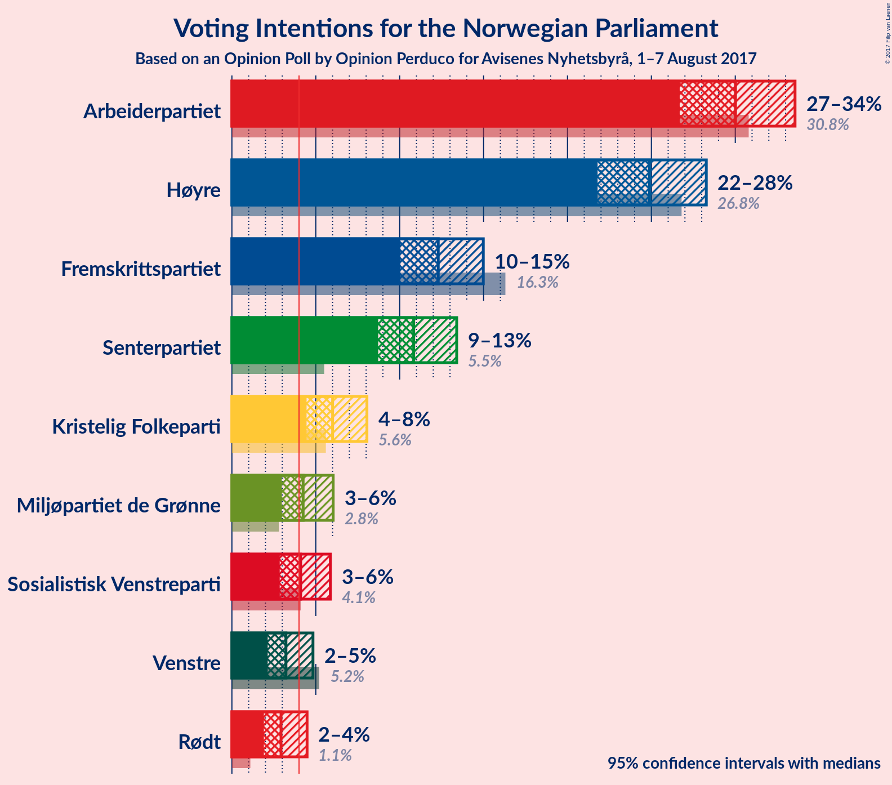
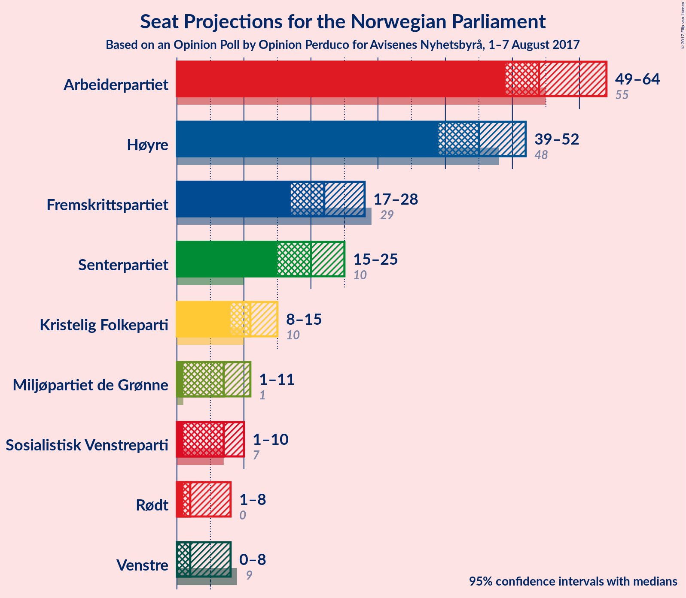
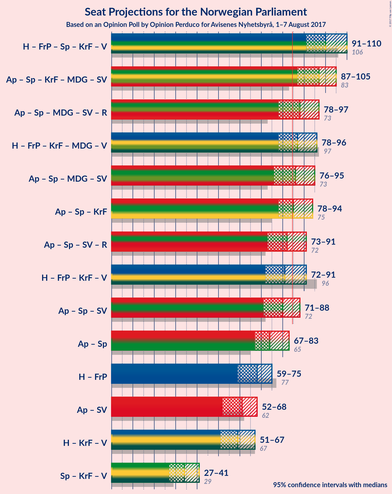

# Opinion Poll by Opinion Perduco for Avisenes Nyhetsbyrå, 1–7 August 2017

<a href="#voting-intentions">Voting Intentions</a> | <a href="#seats">Seats</a> | <a href="#coalitions">Coalitions</a> | <a href="#technical-information">Technical Information</a>

## Voting Intentions

### Confidence Intervals

| Party | Last Result | Poll Result | 80% Confidence Interval | 90% Confidence Interval | 95% Confidence Interval | 99% Confidence Interval |
|:-----:|:-----------:|:-----------:|:-----------------------:|:-----------------------:|:-----------------------:|:-----------------------:|
| Arbeiderpartiet | 30.8% | 30.0% | 27.8–32.3% |27.2–33.0% |26.7–33.6% |25.7–34.7% |
| Høyre | 26.8% | 24.9% | 22.8–27.1% |22.3–27.7% |21.8–28.3% |20.8–29.4% |
| Fremskrittspartiet | 16.3% | 12.3% | 10.8–14.1% |10.4–14.5% |10.0–15.0% |9.4–15.9% |
| Senterpartiet | 5.5% | 10.8% | 9.4–12.5% |9.1–13.0% |8.7–13.4% |8.1–14.2% |
| Kristelig Folkeparti | 5.6% | 6.0% | 5.0–7.3% |4.7–7.7% |4.5–8.0% |4.0–8.7% |
| Miljøpartiet de Grønne | 2.8% | 4.2% | 3.4–5.4% |3.2–5.7% |3.0–6.0% |2.6–6.6% |
| Sosialistisk Venstreparti | 4.1% | 4.1% | 3.3–5.3% |3.0–5.6% |2.9–5.9% |2.5–6.5% |
| Venstre | 5.2% | 3.2% | 2.5–4.3% |2.3–4.6% |2.1–4.8% |1.8–5.4% |
| Rødt | 1.1% | 2.9% | 2.3–3.9% |2.1–4.2% |1.9–4.5% |1.6–5.0% |

*Note:* The poll result column reflects the actual value used in the calculations. Published results may vary slightly, and in addition be rounded to fewer digits.

## Seats

### Confidence Intervals

| Party | Last Result | Median | 80% Confidence Interval | 90% Confidence Interval | 95% Confidence Interval | 99% Confidence Interval |
|:-----:|:-----------:|:------:|:-----------------------:|:-----------------------:|:-----------------------:|:-----------------------:|
| <a href="#arbeiderpartiet">Arbeiderpartiet</a> | 55 | 55 | 50–60 |50–62 |48–63 |46–65 |
| <a href="#høyre">Høyre</a> | 48 | 45 | 40–49 |39–51 |39–52 |36–55 |
| <a href="#fremskrittspartiet">Fremskrittspartiet</a> | 29 | 22 | 19–26 |18–27 |17–28 |16–29 |
| <a href="#senterpartiet">Senterpartiet</a> | 10 | 20 | 16–23 |16–24 |15–24 |14–26 |
| <a href="#kristelig-folkeparti">Kristelig Folkeparti</a> | 10 | 11 | 9–14 |8–14 |8–15 |2–16 |
| <a href="#miljøpartiet-de-grønne">Miljøpartiet de Grønne</a> | 1 | 8 | 1–10 |1–10 |1–11 |1–12 |
| <a href="#sosialistisk-venstreparti">Sosialistisk Venstreparti</a> | 7 | 7 | 1–9 |1–10 |1–10 |1–11 |
| <a href="#venstre">Venstre</a> | 9 | 2 | 1–8 |0–8 |0–8 |0–9 |
| <a href="#rødt">Rødt</a> | 0 | 2 | 1–2 |1–7 |1–8 |1–9 |

### Arbeiderpartiet

| Number of Seats | Probability | Accumulated | Special Marks |
|:---------------:|:-----------:|:-----------:|:-------------:|
| 45 | 0.1% | 100% |  |
| 46 | 0.4% | 99.9% |  |
| 47 | 0.6% | 99.4% |  |
| 48 | 1.5% | 98.8% |  |
| 49 | 2% | 97% |  |
| 50 | 6% | 95% |  |
| 51 | 6% | 89% |  |
| 52 | 9% | 82% |  |
| 53 | 11% | 73% |  |
| 54 | 10% | 62% |  |
| 55 | 13% | 53% | Last Result, Median |
| 56 | 7% | 40% |  |
| 57 | 9% | 33% |  |
| 58 | 7% | 24% |  |
| 59 | 5% | 18% |  |
| 60 | 6% | 13% |  |
| 61 | 2% | 7% |  |
| 62 | 2% | 5% |  |
| 63 | 1.4% | 3% |  |
| 64 | 1.0% | 2% |  |
| 65 | 0.7% | 1.0% |  |
| 66 | 0.1% | 0.3% |  |
| 67 | 0.2% | 0.2% |  |
| 68 | 0% | 0% |  |

### Høyre

| Number of Seats | Probability | Accumulated | Special Marks |
|:---------------:|:-----------:|:-----------:|:-------------:|
| 35 | 0.1% | 100% |  |
| 36 | 0.5% | 99.9% |  |
| 37 | 0.5% | 99.4% |  |
| 38 | 1.2% | 98.8% |  |
| 39 | 3% | 98% |  |
| 40 | 5% | 94% |  |
| 41 | 9% | 90% |  |
| 42 | 7% | 81% |  |
| 43 | 9% | 74% |  |
| 44 | 9% | 65% |  |
| 45 | 11% | 56% | Median |
| 46 | 12% | 45% |  |
| 47 | 12% | 33% |  |
| 48 | 9% | 21% | Last Result |
| 49 | 4% | 12% |  |
| 50 | 3% | 8% |  |
| 51 | 2% | 5% |  |
| 52 | 2% | 3% |  |
| 53 | 0.6% | 2% |  |
| 54 | 0.3% | 0.9% |  |
| 55 | 0.4% | 0.5% |  |
| 56 | 0.1% | 0.2% |  |
| 57 | 0% | 0.1% |  |
| 58 | 0% | 0% |  |

### Fremskrittspartiet

| Number of Seats | Probability | Accumulated | Special Marks |
|:---------------:|:-----------:|:-----------:|:-------------:|
| 15 | 0.1% | 100% |  |
| 16 | 0.9% | 99.8% |  |
| 17 | 2% | 98.9% |  |
| 18 | 3% | 97% |  |
| 19 | 8% | 93% |  |
| 20 | 13% | 86% |  |
| 21 | 14% | 73% |  |
| 22 | 15% | 59% | Median |
| 23 | 12% | 44% |  |
| 24 | 10% | 32% |  |
| 25 | 10% | 22% |  |
| 26 | 6% | 13% |  |
| 27 | 3% | 7% |  |
| 28 | 3% | 4% |  |
| 29 | 0.8% | 1.3% | Last Result |
| 30 | 0.4% | 0.4% |  |
| 31 | 0% | 0.1% |  |
| 32 | 0% | 0% |  |

### Senterpartiet

| Number of Seats | Probability | Accumulated | Special Marks |
|:---------------:|:-----------:|:-----------:|:-------------:|
| 10 | 0% | 100% | Last Result |
| 11 | 0% | 100% |  |
| 12 | 0% | 100% |  |
| 13 | 0.3% | 100% |  |
| 14 | 0.7% | 99.6% |  |
| 15 | 2% | 98.9% |  |
| 16 | 8% | 97% |  |
| 17 | 9% | 89% |  |
| 18 | 12% | 81% |  |
| 19 | 16% | 69% |  |
| 20 | 13% | 52% | Median |
| 21 | 15% | 39% |  |
| 22 | 11% | 25% |  |
| 23 | 7% | 14% |  |
| 24 | 4% | 6% |  |
| 25 | 2% | 2% |  |
| 26 | 0.4% | 0.6% |  |
| 27 | 0.1% | 0.2% |  |
| 28 | 0.1% | 0.1% |  |
| 29 | 0% | 0% |  |

### Kristelig Folkeparti

| Number of Seats | Probability | Accumulated | Special Marks |
|:---------------:|:-----------:|:-----------:|:-------------:|
| 2 | 0.6% | 100% |  |
| 3 | 0% | 99.4% |  |
| 4 | 0% | 99.4% |  |
| 5 | 0% | 99.4% |  |
| 6 | 0% | 99.4% |  |
| 7 | 0.6% | 99.3% |  |
| 8 | 6% | 98.8% |  |
| 9 | 12% | 93% |  |
| 10 | 22% | 81% | Last Result |
| 11 | 21% | 59% | Median |
| 12 | 18% | 38% |  |
| 13 | 9% | 20% |  |
| 14 | 8% | 10% |  |
| 15 | 1.3% | 3% |  |
| 16 | 1.2% | 1.4% |  |
| 17 | 0.2% | 0.2% |  |
| 18 | 0% | 0% |  |

### Miljøpartiet de Grønne

| Number of Seats | Probability | Accumulated | Special Marks |
|:---------------:|:-----------:|:-----------:|:-------------:|
| 1 | 15% | 100% | Last Result |
| 2 | 12% | 85% |  |
| 3 | 8% | 73% |  |
| 4 | 3% | 65% |  |
| 5 | 0% | 62% |  |
| 6 | 0.1% | 62% |  |
| 7 | 10% | 62% |  |
| 8 | 26% | 51% | Median |
| 9 | 15% | 25% |  |
| 10 | 7% | 11% |  |
| 11 | 3% | 4% |  |
| 12 | 0.6% | 0.7% |  |
| 13 | 0.1% | 0.1% |  |
| 14 | 0% | 0% |  |

### Sosialistisk Venstreparti

| Number of Seats | Probability | Accumulated | Special Marks |
|:---------------:|:-----------:|:-----------:|:-------------:|
| 0 | 0.3% | 100% |  |
| 1 | 20% | 99.7% |  |
| 2 | 22% | 79% |  |
| 3 | 0% | 58% |  |
| 4 | 0% | 58% |  |
| 5 | 0% | 58% |  |
| 6 | 0.2% | 58% |  |
| 7 | 15% | 58% | Last Result, Median |
| 8 | 24% | 43% |  |
| 9 | 12% | 19% |  |
| 10 | 5% | 7% |  |
| 11 | 2% | 2% |  |
| 12 | 0.4% | 0.4% |  |
| 13 | 0.1% | 0.1% |  |
| 14 | 0% | 0% |  |

### Venstre

| Number of Seats | Probability | Accumulated | Special Marks |
|:---------------:|:-----------:|:-----------:|:-------------:|
| 0 | 7% | 100% |  |
| 1 | 35% | 93% |  |
| 2 | 35% | 58% | Median |
| 3 | 5% | 23% |  |
| 4 | 0% | 19% |  |
| 5 | 0% | 19% |  |
| 6 | 0.1% | 19% |  |
| 7 | 7% | 18% |  |
| 8 | 10% | 12% |  |
| 9 | 1.5% | 2% | Last Result |
| 10 | 0.4% | 0.5% |  |
| 11 | 0.1% | 0.1% |  |
| 12 | 0% | 0% |  |

### Rødt

| Number of Seats | Probability | Accumulated | Special Marks |
|:---------------:|:-----------:|:-----------:|:-------------:|
| 0 | 0% | 100% | Last Result |
| 1 | 30% | 100% |  |
| 2 | 63% | 70% | Median |
| 3 | 0% | 7% |  |
| 4 | 0% | 7% |  |
| 5 | 0% | 7% |  |
| 6 | 0.2% | 7% |  |
| 7 | 3% | 7% |  |
| 8 | 3% | 4% |  |
| 9 | 0.5% | 0.7% |  |
| 10 | 0.1% | 0.1% |  |
| 11 | 0% | 0% |  |

## Coalitions

### Confidence Intervals

| Coalition | Last Result | Median | Majority? | 80% Confidence Interval | 90% Confidence Interval | 95% Confidence Interval | 99% Confidence Interval |
|:---------:|:-----------:|:------:|:---------:|:-----------------------:|:-----------------------:|:-----------------------:|:-----------------------:|
| Høyre – Fremskrittspartiet – Senterpartiet – Kristelig Folkeparti – Venstre | 106 | 100 | 99.9% | 94–107 | 92–109 | 90–110 | 87–113 |
| Arbeiderpartiet – Senterpartiet – Kristelig Folkeparti – Miljøpartiet de Grønne – Sosialistisk Venstreparti | 83 | 97 | 99.7% | 91–103 | 89–104 | 88–105 | 86–108 |
| Arbeiderpartiet – Senterpartiet – Miljøpartiet de Grønne – Sosialistisk Venstreparti – Rødt | 73 | 88 | 80% | 82–94 | 81–96 | 79–97 | 77–100 |
| Høyre – Fremskrittspartiet – Kristelig Folkeparti – Miljøpartiet de Grønne – Venstre | 97 | 87 | 68% | 81–93 | 79–95 | 78–95 | 75–98 |
| Arbeiderpartiet – Senterpartiet – Miljøpartiet de Grønne – Sosialistisk Venstreparti | 73 | 86 | 65% | 80–92 | 79–94 | 77–95 | 74–98 |
| Arbeiderpartiet – Senterpartiet – Kristelig Folkeparti | 75 | 86 | 61% | 80–92 | 79–93 | 77–94 | 75–96 |
| Arbeiderpartiet – Senterpartiet – Sosialistisk Venstreparti – Rødt | 72 | 82 | 32% | 76–88 | 74–90 | 74–91 | 71–94 |
| Høyre – Fremskrittspartiet – Kristelig Folkeparti – Venstre | 96 | 81 | 20% | 75–87 | 73–88 | 72–90 | 69–92 |
| Arbeiderpartiet – Senterpartiet – Sosialistisk Venstreparti | 72 | 80 | 18% | 74–86 | 72–88 | 71–89 | 69–91 |
| Arbeiderpartiet – Senterpartiet | 65 | 75 | 0.6% | 70–80 | 68–82 | 67–83 | 65–85 |
| Høyre – Fremskrittspartiet | 77 | 68 | 0% | 61–72 | 60–74 | 59–75 | 56–78 |
| Arbeiderpartiet – Sosialistisk Venstreparti | 62 | 60 | 0% | 54–67 | 52–68 | 52–69 | 50–72 |
| Høyre – Kristelig Folkeparti – Venstre | 67 | 59 | 0% | 53–65 | 52–66 | 51–66 | 48–69 |
| Senterpartiet – Kristelig Folkeparti – Venstre | 29 | 34 | 0% | 28–38 | 28–39 | 27–41 | 24–43 |

### Høyre – Fremskrittspartiet – Senterpartiet – Kristelig Folkeparti – Venstre

| Number of Seats | Probability | Accumulated | Special Marks |
|:---------------:|:-----------:|:-----------:|:-------------:|
| 84 | 0% | 100% |  |
| 85 | 0.1% | 99.9% | Majority |
| 86 | 0.2% | 99.8% |  |
| 87 | 0.2% | 99.6% |  |
| 88 | 0.4% | 99.3% |  |
| 89 | 0.6% | 98.9% |  |
| 90 | 1.3% | 98% |  |
| 91 | 2% | 97% |  |
| 92 | 2% | 95% |  |
| 93 | 3% | 93% |  |
| 94 | 2% | 90% |  |
| 95 | 4% | 89% |  |
| 96 | 7% | 85% |  |
| 97 | 5% | 78% |  |
| 98 | 7% | 74% |  |
| 99 | 9% | 66% |  |
| 100 | 8% | 57% | Median |
| 101 | 6% | 49% |  |
| 102 | 6% | 43% |  |
| 103 | 5% | 36% |  |
| 104 | 8% | 31% |  |
| 105 | 7% | 23% |  |
| 106 | 4% | 17% | Last Result |
| 107 | 5% | 13% |  |
| 108 | 2% | 8% |  |
| 109 | 3% | 6% |  |
| 110 | 0.7% | 3% |  |
| 111 | 0.5% | 2% |  |
| 112 | 0.5% | 1.3% |  |
| 113 | 0.6% | 0.8% |  |
| 114 | 0% | 0.1% |  |
| 115 | 0% | 0.1% |  |
| 116 | 0% | 0.1% |  |
| 117 | 0% | 0% |  |

### Arbeiderpartiet – Senterpartiet – Kristelig Folkeparti – Miljøpartiet de Grønne – Sosialistisk Venstreparti

| Number of Seats | Probability | Accumulated | Special Marks |
|:---------------:|:-----------:|:-----------:|:-------------:|
| 81 | 0% | 100% |  |
| 82 | 0.1% | 99.9% |  |
| 83 | 0% | 99.9% | Last Result |
| 84 | 0.1% | 99.8% |  |
| 85 | 0.2% | 99.7% | Majority |
| 86 | 0.5% | 99.5% |  |
| 87 | 1.1% | 99.0% |  |
| 88 | 0.6% | 98% |  |
| 89 | 3% | 97% |  |
| 90 | 3% | 94% |  |
| 91 | 5% | 92% |  |
| 92 | 3% | 87% |  |
| 93 | 5% | 84% |  |
| 94 | 5% | 79% |  |
| 95 | 7% | 74% |  |
| 96 | 9% | 67% |  |
| 97 | 9% | 58% |  |
| 98 | 10% | 49% |  |
| 99 | 9% | 39% |  |
| 100 | 10% | 30% |  |
| 101 | 5% | 21% | Median |
| 102 | 4% | 16% |  |
| 103 | 4% | 12% |  |
| 104 | 3% | 7% |  |
| 105 | 2% | 4% |  |
| 106 | 1.2% | 2% |  |
| 107 | 0.5% | 1.2% |  |
| 108 | 0.4% | 0.7% |  |
| 109 | 0.2% | 0.3% |  |
| 110 | 0.1% | 0.1% |  |
| 111 | 0% | 0% |  |

### Arbeiderpartiet – Senterpartiet – Miljøpartiet de Grønne – Sosialistisk Venstreparti – Rødt

| Number of Seats | Probability | Accumulated | Special Marks |
|:---------------:|:-----------:|:-----------:|:-------------:|
| 73 | 0% | 100% | Last Result |
| 74 | 0% | 99.9% |  |
| 75 | 0.1% | 99.9% |  |
| 76 | 0.2% | 99.8% |  |
| 77 | 0.8% | 99.7% |  |
| 78 | 0.8% | 98.8% |  |
| 79 | 0.7% | 98% |  |
| 80 | 1.3% | 97% |  |
| 81 | 4% | 96% |  |
| 82 | 5% | 92% |  |
| 83 | 4% | 87% |  |
| 84 | 4% | 84% |  |
| 85 | 7% | 80% | Majority |
| 86 | 6% | 73% |  |
| 87 | 9% | 66% |  |
| 88 | 12% | 58% |  |
| 89 | 8% | 46% |  |
| 90 | 8% | 38% |  |
| 91 | 7% | 30% |  |
| 92 | 5% | 22% | Median |
| 93 | 3% | 17% |  |
| 94 | 5% | 14% |  |
| 95 | 2% | 9% |  |
| 96 | 3% | 7% |  |
| 97 | 1.0% | 3% |  |
| 98 | 1.1% | 2% |  |
| 99 | 0.4% | 1.3% |  |
| 100 | 0.5% | 0.9% |  |
| 101 | 0.2% | 0.4% |  |
| 102 | 0.1% | 0.2% |  |
| 103 | 0.1% | 0.1% |  |
| 104 | 0% | 0% |  |

### Høyre – Fremskrittspartiet – Kristelig Folkeparti – Miljøpartiet de Grønne – Venstre

| Number of Seats | Probability | Accumulated | Special Marks |
|:---------------:|:-----------:|:-----------:|:-------------:|
| 72 | 0% | 100% |  |
| 73 | 0.1% | 99.9% |  |
| 74 | 0.3% | 99.9% |  |
| 75 | 0.2% | 99.6% |  |
| 76 | 0.5% | 99.4% |  |
| 77 | 0.7% | 98.9% |  |
| 78 | 2% | 98% |  |
| 79 | 2% | 97% |  |
| 80 | 3% | 95% |  |
| 81 | 3% | 92% |  |
| 82 | 7% | 88% |  |
| 83 | 7% | 81% |  |
| 84 | 6% | 74% |  |
| 85 | 7% | 68% | Majority |
| 86 | 8% | 60% |  |
| 87 | 8% | 52% |  |
| 88 | 9% | 44% | Median |
| 89 | 7% | 34% |  |
| 90 | 5% | 27% |  |
| 91 | 6% | 22% |  |
| 92 | 5% | 16% |  |
| 93 | 3% | 11% |  |
| 94 | 2% | 8% |  |
| 95 | 4% | 6% |  |
| 96 | 0.8% | 2% |  |
| 97 | 0.8% | 2% | Last Result |
| 98 | 0.3% | 0.8% |  |
| 99 | 0.3% | 0.5% |  |
| 100 | 0.1% | 0.2% |  |
| 101 | 0.1% | 0.1% |  |
| 102 | 0% | 0% |  |

### Arbeiderpartiet – Senterpartiet – Miljøpartiet de Grønne – Sosialistisk Venstreparti

| Number of Seats | Probability | Accumulated | Special Marks |
|:---------------:|:-----------:|:-----------:|:-------------:|
| 70 | 0.1% | 100% |  |
| 71 | 0% | 99.9% |  |
| 72 | 0.1% | 99.9% |  |
| 73 | 0.1% | 99.8% | Last Result |
| 74 | 0.3% | 99.8% |  |
| 75 | 0.8% | 99.5% |  |
| 76 | 0.8% | 98.7% |  |
| 77 | 0.9% | 98% |  |
| 78 | 1.4% | 97% |  |
| 79 | 3% | 96% |  |
| 80 | 6% | 92% |  |
| 81 | 4% | 87% |  |
| 82 | 5% | 83% |  |
| 83 | 5% | 78% |  |
| 84 | 8% | 73% |  |
| 85 | 8% | 65% | Majority |
| 86 | 9% | 57% |  |
| 87 | 11% | 47% |  |
| 88 | 7% | 36% |  |
| 89 | 8% | 30% |  |
| 90 | 4% | 21% | Median |
| 91 | 4% | 17% |  |
| 92 | 6% | 14% |  |
| 93 | 2% | 8% |  |
| 94 | 3% | 6% |  |
| 95 | 2% | 4% |  |
| 96 | 0.7% | 2% |  |
| 97 | 0.6% | 1.2% |  |
| 98 | 0.3% | 0.6% |  |
| 99 | 0.2% | 0.3% |  |
| 100 | 0.1% | 0.1% |  |
| 101 | 0% | 0% |  |

### Arbeiderpartiet – Senterpartiet – Kristelig Folkeparti

| Number of Seats | Probability | Accumulated | Special Marks |
|:---------------:|:-----------:|:-----------:|:-------------:|
| 71 | 0% | 100% |  |
| 72 | 0.1% | 99.9% |  |
| 73 | 0.1% | 99.8% |  |
| 74 | 0.1% | 99.7% |  |
| 75 | 0.3% | 99.6% | Last Result |
| 76 | 1.0% | 99.3% |  |
| 77 | 1.2% | 98% |  |
| 78 | 2% | 97% |  |
| 79 | 2% | 95% |  |
| 80 | 3% | 93% |  |
| 81 | 8% | 89% |  |
| 82 | 4% | 82% |  |
| 83 | 7% | 77% |  |
| 84 | 10% | 70% |  |
| 85 | 8% | 61% | Majority |
| 86 | 8% | 52% | Median |
| 87 | 13% | 44% |  |
| 88 | 7% | 31% |  |
| 89 | 6% | 25% |  |
| 90 | 4% | 19% |  |
| 91 | 4% | 14% |  |
| 92 | 3% | 10% |  |
| 93 | 3% | 7% |  |
| 94 | 2% | 4% |  |
| 95 | 1.1% | 2% |  |
| 96 | 0.4% | 0.9% |  |
| 97 | 0.3% | 0.4% |  |
| 98 | 0.1% | 0.1% |  |
| 99 | 0% | 0.1% |  |
| 100 | 0% | 0% |  |

### Arbeiderpartiet – Senterpartiet – Sosialistisk Venstreparti – Rødt

| Number of Seats | Probability | Accumulated | Special Marks |
|:---------------:|:-----------:|:-----------:|:-------------:|
| 68 | 0.1% | 100% |  |
| 69 | 0.1% | 99.9% |  |
| 70 | 0.3% | 99.8% |  |
| 71 | 0.3% | 99.5% |  |
| 72 | 0.8% | 99.2% | Last Result |
| 73 | 0.8% | 98% |  |
| 74 | 4% | 98% |  |
| 75 | 2% | 94% |  |
| 76 | 3% | 92% |  |
| 77 | 5% | 89% |  |
| 78 | 6% | 84% |  |
| 79 | 5% | 78% |  |
| 80 | 7% | 73% |  |
| 81 | 9% | 66% |  |
| 82 | 8% | 56% |  |
| 83 | 8% | 48% |  |
| 84 | 7% | 40% | Median |
| 85 | 6% | 32% | Majority |
| 86 | 7% | 26% |  |
| 87 | 7% | 19% |  |
| 88 | 3% | 12% |  |
| 89 | 3% | 8% |  |
| 90 | 2% | 5% |  |
| 91 | 2% | 3% |  |
| 92 | 0.7% | 2% |  |
| 93 | 0.5% | 1.1% |  |
| 94 | 0.2% | 0.6% |  |
| 95 | 0.3% | 0.4% |  |
| 96 | 0.1% | 0.1% |  |
| 97 | 0% | 0.1% |  |
| 98 | 0% | 0% |  |

### Høyre – Fremskrittspartiet – Kristelig Folkeparti – Venstre

| Number of Seats | Probability | Accumulated | Special Marks |
|:---------------:|:-----------:|:-----------:|:-------------:|
| 66 | 0.1% | 100% |  |
| 67 | 0.1% | 99.9% |  |
| 68 | 0.2% | 99.8% |  |
| 69 | 0.5% | 99.6% |  |
| 70 | 0.4% | 99.1% |  |
| 71 | 1.1% | 98.7% |  |
| 72 | 1.0% | 98% |  |
| 73 | 3% | 97% |  |
| 74 | 2% | 93% |  |
| 75 | 5% | 91% |  |
| 76 | 3% | 86% |  |
| 77 | 5% | 83% |  |
| 78 | 7% | 78% |  |
| 79 | 8% | 70% |  |
| 80 | 8% | 62% | Median |
| 81 | 12% | 54% |  |
| 82 | 9% | 42% |  |
| 83 | 6% | 34% |  |
| 84 | 7% | 27% |  |
| 85 | 4% | 20% | Majority |
| 86 | 4% | 16% |  |
| 87 | 5% | 13% |  |
| 88 | 4% | 8% |  |
| 89 | 1.3% | 4% |  |
| 90 | 0.7% | 3% |  |
| 91 | 0.8% | 2% |  |
| 92 | 0.8% | 1.2% |  |
| 93 | 0.2% | 0.3% |  |
| 94 | 0.1% | 0.2% |  |
| 95 | 0% | 0.1% |  |
| 96 | 0% | 0.1% | Last Result |
| 97 | 0% | 0% |  |

### Arbeiderpartiet – Senterpartiet – Sosialistisk Venstreparti

| Number of Seats | Probability | Accumulated | Special Marks |
|:---------------:|:-----------:|:-----------:|:-------------:|
| 66 | 0% | 100% |  |
| 67 | 0.2% | 99.9% |  |
| 68 | 0.2% | 99.8% |  |
| 69 | 0.5% | 99.5% |  |
| 70 | 0.6% | 99.0% |  |
| 71 | 1.2% | 98% |  |
| 72 | 4% | 97% | Last Result |
| 73 | 2% | 93% |  |
| 74 | 2% | 91% |  |
| 75 | 6% | 89% |  |
| 76 | 6% | 83% |  |
| 77 | 6% | 78% |  |
| 78 | 6% | 72% |  |
| 79 | 10% | 66% |  |
| 80 | 9% | 56% |  |
| 81 | 7% | 47% |  |
| 82 | 9% | 39% | Median |
| 83 | 5% | 31% |  |
| 84 | 8% | 26% |  |
| 85 | 7% | 18% | Majority |
| 86 | 3% | 11% |  |
| 87 | 2% | 7% |  |
| 88 | 2% | 5% |  |
| 89 | 1.2% | 3% |  |
| 90 | 0.5% | 1.3% |  |
| 91 | 0.4% | 0.8% |  |
| 92 | 0.2% | 0.4% |  |
| 93 | 0.1% | 0.2% |  |
| 94 | 0% | 0.1% |  |
| 95 | 0% | 0% |  |

### Arbeiderpartiet – Senterpartiet

| Number of Seats | Probability | Accumulated | Special Marks |
|:---------------:|:-----------:|:-----------:|:-------------:|
| 62 | 0% | 100% |  |
| 63 | 0.1% | 99.9% |  |
| 64 | 0.2% | 99.8% |  |
| 65 | 0.4% | 99.6% | Last Result |
| 66 | 1.0% | 99.2% |  |
| 67 | 2% | 98% |  |
| 68 | 2% | 96% |  |
| 69 | 4% | 94% |  |
| 70 | 6% | 90% |  |
| 71 | 6% | 85% |  |
| 72 | 10% | 79% |  |
| 73 | 9% | 69% |  |
| 74 | 10% | 60% |  |
| 75 | 8% | 50% | Median |
| 76 | 8% | 42% |  |
| 77 | 10% | 34% |  |
| 78 | 6% | 24% |  |
| 79 | 5% | 18% |  |
| 80 | 5% | 13% |  |
| 81 | 2% | 8% |  |
| 82 | 2% | 6% |  |
| 83 | 2% | 3% |  |
| 84 | 0.6% | 1.2% |  |
| 85 | 0.3% | 0.6% | Majority |
| 86 | 0.1% | 0.3% |  |
| 87 | 0.1% | 0.2% |  |
| 88 | 0% | 0% |  |

### Høyre – Fremskrittspartiet

| Number of Seats | Probability | Accumulated | Special Marks |
|:---------------:|:-----------:|:-----------:|:-------------:|
| 54 | 0.1% | 100% |  |
| 55 | 0.2% | 99.9% |  |
| 56 | 0.3% | 99.7% |  |
| 57 | 0.6% | 99.3% |  |
| 58 | 0.8% | 98.7% |  |
| 59 | 2% | 98% |  |
| 60 | 3% | 96% |  |
| 61 | 3% | 93% |  |
| 62 | 4% | 90% |  |
| 63 | 3% | 85% |  |
| 64 | 6% | 82% |  |
| 65 | 8% | 75% |  |
| 66 | 8% | 68% |  |
| 67 | 9% | 60% | Median |
| 68 | 11% | 51% |  |
| 69 | 14% | 41% |  |
| 70 | 8% | 27% |  |
| 71 | 7% | 19% |  |
| 72 | 4% | 12% |  |
| 73 | 3% | 9% |  |
| 74 | 3% | 6% |  |
| 75 | 0.9% | 3% |  |
| 76 | 0.9% | 2% |  |
| 77 | 0.6% | 1.2% | Last Result |
| 78 | 0.4% | 0.6% |  |
| 79 | 0.1% | 0.2% |  |
| 80 | 0.1% | 0.1% |  |
| 81 | 0% | 0% |  |

### Arbeiderpartiet – Sosialistisk Venstreparti

| Number of Seats | Probability | Accumulated | Special Marks |
|:---------------:|:-----------:|:-----------:|:-------------:|
| 48 | 0.1% | 100% |  |
| 49 | 0.2% | 99.8% |  |
| 50 | 0.5% | 99.6% |  |
| 51 | 0.9% | 99.1% |  |
| 52 | 4% | 98% |  |
| 53 | 3% | 94% |  |
| 54 | 4% | 91% |  |
| 55 | 5% | 87% |  |
| 56 | 4% | 82% |  |
| 57 | 3% | 78% |  |
| 58 | 6% | 75% |  |
| 59 | 10% | 69% |  |
| 60 | 10% | 59% |  |
| 61 | 9% | 48% |  |
| 62 | 7% | 39% | Last Result, Median |
| 63 | 8% | 33% |  |
| 64 | 6% | 25% |  |
| 65 | 5% | 19% |  |
| 66 | 3% | 14% |  |
| 67 | 4% | 11% |  |
| 68 | 3% | 7% |  |
| 69 | 2% | 4% |  |
| 70 | 0.6% | 2% |  |
| 71 | 0.7% | 1.3% |  |
| 72 | 0.2% | 0.6% |  |
| 73 | 0.2% | 0.4% |  |
| 74 | 0.1% | 0.2% |  |
| 75 | 0.1% | 0.1% |  |
| 76 | 0% | 0% |  |

### Høyre – Kristelig Folkeparti – Venstre

| Number of Seats | Probability | Accumulated | Special Marks |
|:---------------:|:-----------:|:-----------:|:-------------:|
| 46 | 0.1% | 100% |  |
| 47 | 0.1% | 99.9% |  |
| 48 | 0.3% | 99.7% |  |
| 49 | 0.6% | 99.4% |  |
| 50 | 1.2% | 98.8% |  |
| 51 | 2% | 98% |  |
| 52 | 5% | 96% |  |
| 53 | 5% | 91% |  |
| 54 | 7% | 86% |  |
| 55 | 5% | 79% |  |
| 56 | 9% | 74% |  |
| 57 | 8% | 65% |  |
| 58 | 5% | 57% | Median |
| 59 | 11% | 52% |  |
| 60 | 9% | 42% |  |
| 61 | 9% | 32% |  |
| 62 | 6% | 24% |  |
| 63 | 3% | 18% |  |
| 64 | 3% | 15% |  |
| 65 | 5% | 11% |  |
| 66 | 4% | 7% |  |
| 67 | 1.0% | 2% | Last Result |
| 68 | 0.7% | 1.3% |  |
| 69 | 0.4% | 0.7% |  |
| 70 | 0.1% | 0.3% |  |
| 71 | 0.1% | 0.2% |  |
| 72 | 0% | 0.1% |  |
| 73 | 0% | 0% |  |

### Senterpartiet – Kristelig Folkeparti – Venstre

| Number of Seats | Probability | Accumulated | Special Marks |
|:---------------:|:-----------:|:-----------:|:-------------:|
| 21 | 0% | 100% |  |
| 22 | 0.1% | 99.9% |  |
| 23 | 0.1% | 99.9% |  |
| 24 | 0.5% | 99.8% |  |
| 25 | 0.5% | 99.3% |  |
| 26 | 0.8% | 98.8% |  |
| 27 | 3% | 98% |  |
| 28 | 6% | 95% |  |
| 29 | 8% | 89% | Last Result |
| 30 | 7% | 80% |  |
| 31 | 7% | 74% |  |
| 32 | 6% | 67% |  |
| 33 | 8% | 60% | Median |
| 34 | 12% | 52% |  |
| 35 | 12% | 40% |  |
| 36 | 6% | 28% |  |
| 37 | 4% | 22% |  |
| 38 | 8% | 17% |  |
| 39 | 5% | 9% |  |
| 40 | 2% | 4% |  |
| 41 | 1.3% | 3% |  |
| 42 | 0.7% | 1.3% |  |
| 43 | 0.3% | 0.6% |  |
| 44 | 0.2% | 0.3% |  |
| 45 | 0.1% | 0.1% |  |
| 46 | 0% | 0% |  |

## Technical Information

### Opinion Poll

+ **Pollster:** Opinion Perduco
+ **Media:** Avisenes Nyhetsbyrå
+ **Fieldwork period:** 1–7 August 2017

### Calculations

+ **Sample size:** 683
+ **Simulations done:** 4,194,304
+ **Error estimate:** 1.23%

