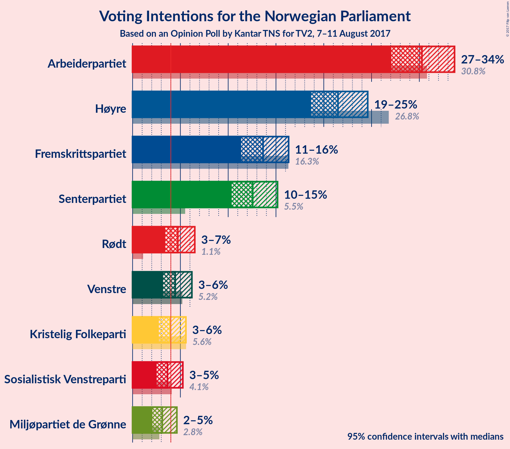
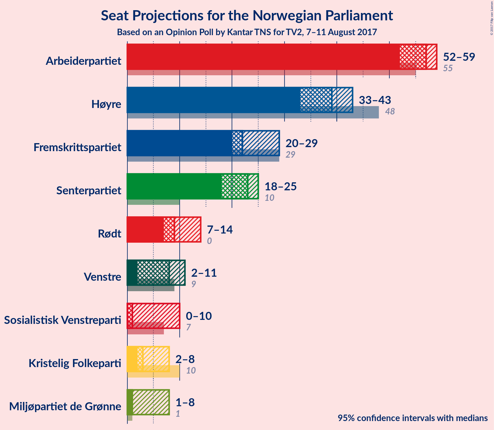
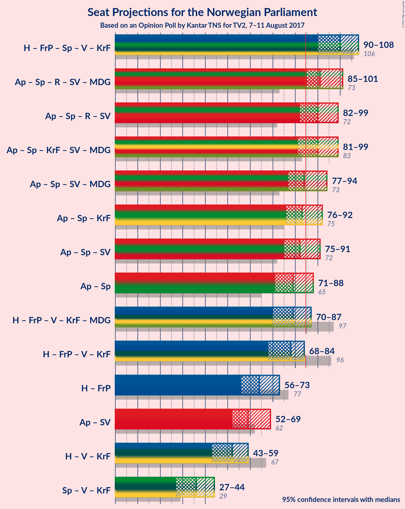

# Opinion Poll by Kantar TNS for TV2, 7–11 August 2017

<a href="#voting-intentions">Voting Intentions</a> | <a href="#seats">Seats</a> | <a href="#coalitions">Coalitions</a> | <a href="#technical-information">Technical Information</a>

## Voting Intentions

### Confidence Intervals

| Party | Last Result | Poll Result | 80% Confidence Interval | 90% Confidence Interval | 95% Confidence Interval | 99% Confidence Interval |
|:-----:|:-----------:|:-----------:|:-----------------------:|:-----------------------:|:-----------------------:|:-----------------------:|
| Arbeiderpartiet | 30.8% | 30.3% | 28.2–32.5% |27.6–33.1% |27.1–33.7% |26.1–34.8% |
| Høyre | 26.8% | 21.5% | 19.6–23.5% |19.1–24.1% |18.7–24.6% |17.8–25.6% |
| Fremskrittspartiet | 16.3% | 13.6% | 12.1–15.4% |11.7–15.9% |11.4–16.3% |10.7–17.2% |
| Senterpartiet | 5.5% | 12.6% | 11.1–14.3% |10.7–14.7% |10.4–15.2% |9.7–16.0% |
| Rødt | 1.1% | 4.7% | 3.9–5.9% |3.6–6.2% |3.4–6.5% |3.0–7.1% |
| Venstre | 5.2% | 4.5% | 3.6–5.6% |3.4–5.9% |3.2–6.2% |2.8–6.8% |
| Kristelig Folkeparti | 5.6% | 3.9% | 3.1–5.0% |2.9–5.3% |2.7–5.6% |2.4–6.1% |
| Sosialistisk Venstreparti | 4.1% | 3.6% | 2.9–4.7% |2.7–5.0% |2.5–5.3% |2.2–5.8% |
| Miljøpartiet de Grønne | 2.8% | 3.1% | 2.4–4.1% |2.2–4.4% |2.1–4.6% |1.8–5.2% |

*Note:* The poll result column reflects the actual value used in the calculations. Published results may vary slightly, and in addition be rounded to fewer digits.

## Seats

### Confidence Intervals

| Party | Last Result | Median | 80% Confidence Interval | 90% Confidence Interval | 95% Confidence Interval | 99% Confidence Interval |
|:-----:|:-----------:|:------:|:-----------------------:|:-----------------------:|:-----------------------:|:-----------------------:|
| <a href="#arbeiderpartiet">Arbeiderpartiet</a> | 55 | 57 | 55–59 |54–59 |52–59 |49–61 |
| <a href="#høyre">Høyre</a> | 48 | 39 | 37–41 |35–41 |33–43 |33–46 |
| <a href="#fremskrittspartiet">Fremskrittspartiet</a> | 29 | 22 | 22–27 |22–28 |20–29 |18–31 |
| <a href="#senterpartiet">Senterpartiet</a> | 10 | 23 | 20–24 |18–24 |18–25 |15–27 |
| <a href="#rødt">Rødt</a> | 0 | 9 | 7–12 |7–14 |7–14 |2–14 |
| <a href="#venstre">Venstre</a> | 9 | 8 | 2–9 |2–11 |2–11 |1–11 |
| <a href="#kristelig-folkeparti">Kristelig Folkeparti</a> | 10 | 3 | 3–8 |3–8 |2–8 |1–10 |
| <a href="#sosialistisk-venstreparti">Sosialistisk Venstreparti</a> | 7 | 1 | 1–9 |1–9 |0–10 |0–10 |
| <a href="#miljøpartiet-de-grønne">Miljøpartiet de Grønne</a> | 1 | 1 | 1–4 |1–4 |1–8 |1–10 |

### Arbeiderpartiet

| Number of Seats | Probability | Accumulated | Special Marks |
|:---------------:|:-----------:|:-----------:|:-------------:|
| 45 | 0.1% | 100% |  |
| 46 | 0.1% | 99.9% |  |
| 47 | 0.1% | 99.8% |  |
| 48 | 0.2% | 99.8% |  |
| 49 | 0.3% | 99.6% |  |
| 50 | 0.3% | 99.4% |  |
| 51 | 0.4% | 99.0% |  |
| 52 | 1.3% | 98.6% |  |
| 53 | 1.1% | 97% |  |
| 54 | 6% | 96% |  |
| 55 | 10% | 91% | Last Result |
| 56 | 0.8% | 80% |  |
| 57 | 32% | 80% | Median |
| 58 | 36% | 47% |  |
| 59 | 9% | 11% |  |
| 60 | 0% | 2% |  |
| 61 | 2% | 2% |  |
| 62 | 0% | 0.1% |  |
| 63 | 0% | 0.1% |  |
| 64 | 0% | 0.1% |  |
| 65 | 0% | 0.1% |  |
| 66 | 0% | 0% |  |

### Høyre

| Number of Seats | Probability | Accumulated | Special Marks |
|:---------------:|:-----------:|:-----------:|:-------------:|
| 31 | 0.1% | 100% |  |
| 32 | 0.1% | 99.9% |  |
| 33 | 4% | 99.9% |  |
| 34 | 0.6% | 96% |  |
| 35 | 0.5% | 95% |  |
| 36 | 2% | 95% |  |
| 37 | 7% | 93% |  |
| 38 | 9% | 85% |  |
| 39 | 36% | 77% | Median |
| 40 | 7% | 41% |  |
| 41 | 31% | 34% |  |
| 42 | 0.1% | 3% |  |
| 43 | 0.3% | 3% |  |
| 44 | 0.1% | 2% |  |
| 45 | 1.1% | 2% |  |
| 46 | 0.9% | 1.1% |  |
| 47 | 0.1% | 0.2% |  |
| 48 | 0.1% | 0.1% | Last Result |
| 49 | 0% | 0.1% |  |
| 50 | 0% | 0.1% |  |
| 51 | 0.1% | 0.1% |  |
| 52 | 0% | 0% |  |

### Fremskrittspartiet

| Number of Seats | Probability | Accumulated | Special Marks |
|:---------------:|:-----------:|:-----------:|:-------------:|
| 18 | 2% | 100% |  |
| 19 | 0.2% | 98% |  |
| 20 | 1.2% | 98% |  |
| 21 | 0.3% | 97% |  |
| 22 | 66% | 96% | Median |
| 23 | 0.2% | 30% |  |
| 24 | 6% | 30% |  |
| 25 | 2% | 25% |  |
| 26 | 1.5% | 23% |  |
| 27 | 13% | 21% |  |
| 28 | 5% | 8% |  |
| 29 | 1.4% | 3% | Last Result |
| 30 | 0.1% | 2% |  |
| 31 | 1.4% | 1.4% |  |
| 32 | 0% | 0.1% |  |
| 33 | 0% | 0.1% |  |
| 34 | 0% | 0.1% |  |
| 35 | 0.1% | 0.1% |  |
| 36 | 0% | 0% |  |

### Senterpartiet

| Number of Seats | Probability | Accumulated | Special Marks |
|:---------------:|:-----------:|:-----------:|:-------------:|
| 10 | 0% | 100% | Last Result |
| 11 | 0% | 100% |  |
| 12 | 0% | 100% |  |
| 13 | 0% | 100% |  |
| 14 | 0% | 100% |  |
| 15 | 0.9% | 100% |  |
| 16 | 0% | 99.0% |  |
| 17 | 0.1% | 99.0% |  |
| 18 | 6% | 98.9% |  |
| 19 | 0.1% | 93% |  |
| 20 | 36% | 93% |  |
| 21 | 3% | 57% |  |
| 22 | 3% | 55% |  |
| 23 | 11% | 52% | Median |
| 24 | 37% | 40% |  |
| 25 | 1.0% | 3% |  |
| 26 | 1.4% | 2% |  |
| 27 | 0.1% | 0.6% |  |
| 28 | 0.2% | 0.4% |  |
| 29 | 0.3% | 0.3% |  |
| 30 | 0% | 0% |  |

### Rødt

| Number of Seats | Probability | Accumulated | Special Marks |
|:---------------:|:-----------:|:-----------:|:-------------:|
| 0 | 0% | 100% | Last Result |
| 1 | 0% | 100% |  |
| 2 | 2% | 100% |  |
| 3 | 0% | 98% |  |
| 4 | 0% | 98% |  |
| 5 | 0% | 98% |  |
| 6 | 0% | 98% |  |
| 7 | 13% | 98% |  |
| 8 | 34% | 85% |  |
| 9 | 4% | 50% | Median |
| 10 | 1.1% | 46% |  |
| 11 | 1.1% | 45% |  |
| 12 | 36% | 44% |  |
| 13 | 0.1% | 9% |  |
| 14 | 8% | 8% |  |
| 15 | 0.1% | 0.1% |  |
| 16 | 0% | 0% |  |

### Venstre

| Number of Seats | Probability | Accumulated | Special Marks |
|:---------------:|:-----------:|:-----------:|:-------------:|
| 1 | 0.5% | 100% |  |
| 2 | 33% | 99.5% |  |
| 3 | 11% | 66% |  |
| 4 | 0% | 56% |  |
| 5 | 0% | 56% |  |
| 6 | 0% | 56% |  |
| 7 | 3% | 56% |  |
| 8 | 7% | 53% | Median |
| 9 | 38% | 45% | Last Result |
| 10 | 2% | 8% |  |
| 11 | 5% | 6% |  |
| 12 | 0.1% | 0.2% |  |
| 13 | 0.1% | 0.1% |  |
| 14 | 0% | 0% |  |

### Kristelig Folkeparti

| Number of Seats | Probability | Accumulated | Special Marks |
|:---------------:|:-----------:|:-----------:|:-------------:|
| 1 | 1.5% | 100% |  |
| 2 | 2% | 98% |  |
| 3 | 48% | 96% | Median |
| 4 | 0% | 48% |  |
| 5 | 0% | 48% |  |
| 6 | 0% | 48% |  |
| 7 | 8% | 48% |  |
| 8 | 39% | 40% |  |
| 9 | 0.6% | 1.1% |  |
| 10 | 0.2% | 0.5% | Last Result |
| 11 | 0.1% | 0.3% |  |
| 12 | 0.3% | 0.3% |  |
| 13 | 0% | 0% |  |

### Sosialistisk Venstreparti

| Number of Seats | Probability | Accumulated | Special Marks |
|:---------------:|:-----------:|:-----------:|:-------------:|
| 0 | 5% | 100% |  |
| 1 | 48% | 95% | Median |
| 2 | 2% | 47% |  |
| 3 | 0% | 45% |  |
| 4 | 0% | 45% |  |
| 5 | 0% | 45% |  |
| 6 | 0.9% | 45% |  |
| 7 | 1.3% | 44% | Last Result |
| 8 | 7% | 42% |  |
| 9 | 33% | 36% |  |
| 10 | 3% | 3% |  |
| 11 | 0% | 0% |  |

### Miljøpartiet de Grønne

| Number of Seats | Probability | Accumulated | Special Marks |
|:---------------:|:-----------:|:-----------:|:-------------:|
| 0 | 0.3% | 100% |  |
| 1 | 54% | 99.7% | Last Result, Median |
| 2 | 31% | 46% |  |
| 3 | 4% | 15% |  |
| 4 | 6% | 11% |  |
| 5 | 0% | 5% |  |
| 6 | 0% | 5% |  |
| 7 | 2% | 5% |  |
| 8 | 2% | 3% |  |
| 9 | 0.1% | 0.6% |  |
| 10 | 0.4% | 0.6% |  |
| 11 | 0.1% | 0.1% |  |
| 12 | 0% | 0% |  |

## Coalitions

### Confidence Intervals

| Coalition | Last Result | Median | 80% Confidence Interval | 90% Confidence Interval | 95% Confidence Interval | 99% Confidence Interval |
|:---------:|:-----------:|:------:|:-----------------------:|:-----------------------:|:-----------------------:|:-----------------------:|
| Høyre – Fremskrittspartiet – Senterpartiet – Venstre – Kristelig Folkeparti | 106 | 97 | 93–100 | 93–103 | 93–103 | 86–107 |
| Arbeiderpartiet – Senterpartiet – Rødt – Sosialistisk Venstreparti – Miljøpartiet de Grønne | 73 | 96 | 90–98 | 86–98 | 86–99 | 82–104 |
| Arbeiderpartiet – Senterpartiet – Kristelig Folkeparti – Sosialistisk Venstreparti – Miljøpartiet de Grønne | 83 | 87 | 87–96 | 87–96 | 84–99 | 82–104 |
| Arbeiderpartiet – Senterpartiet – Rødt – Sosialistisk Venstreparti | 72 | 94 | 87–97 | 82–97 | 82–97 | 81–98 |
| Arbeiderpartiet – Senterpartiet – Sosialistisk Venstreparti – Miljøpartiet de Grønne | 73 | 84 | 81–88 | 79–89 | 79–92 | 75–97 |
| Arbeiderpartiet – Senterpartiet – Sosialistisk Venstreparti | 72 | 83 | 79–86 | 75–88 | 75–90 | 73–90 |
| Arbeiderpartiet – Senterpartiet – Kristelig Folkeparti | 75 | 85 | 81–85 | 79–85 | 77–89 | 72–92 |
| Høyre – Fremskrittspartiet – Venstre – Kristelig Folkeparti – Miljøpartiet de Grønne | 97 | 75 | 72–82 | 72–87 | 72–87 | 71–88 |
| Høyre – Fremskrittspartiet – Venstre – Kristelig Folkeparti | 96 | 73 | 71–79 | 71–83 | 70–83 | 65–87 |
| Arbeiderpartiet – Senterpartiet | 65 | 78 | 75–82 | 72–82 | 72–82 | 68–85 |
| Høyre – Fremskrittspartiet | 77 | 63 | 61–66 | 61–67 | 58–69 | 51–72 |
| Arbeiderpartiet – Sosialistisk Venstreparti | 62 | 60 | 58–66 | 55–66 | 55–66 | 51–69 |
| Høyre – Venstre – Kristelig Folkeparti | 67 | 51 | 44–55 | 44–56 | 43–56 | 43–61 |
| Senterpartiet – Venstre – Kristelig Folkeparti | 29 | 35 | 29–36 | 29–36 | 29–38 | 25–42 |

### Høyre – Fremskrittspartiet – Senterpartiet – Venstre – Kristelig Folkeparti

| Number of Seats | Probability | Accumulated | Special Marks |
|:---------------:|:-----------:|:-----------:|:-------------:|
| 86 | 2% | 100% |  |
| 87 | 0% | 98% |  |
| 88 | 0% | 98% |  |
| 89 | 0.1% | 98% |  |
| 90 | 0% | 98% |  |
| 91 | 0% | 98% |  |
| 92 | 0.2% | 98% |  |
| 93 | 30% | 98% |  |
| 94 | 11% | 68% |  |
| 95 | 0.8% | 56% | Median |
| 96 | 2% | 56% |  |
| 97 | 41% | 53% |  |
| 98 | 1.4% | 12% |  |
| 99 | 0.7% | 11% |  |
| 100 | 0.8% | 10% |  |
| 101 | 1.2% | 10% |  |
| 102 | 2% | 8% |  |
| 103 | 5% | 7% |  |
| 104 | 0.4% | 2% |  |
| 105 | 0.2% | 1.2% |  |
| 106 | 0.1% | 1.0% | Last Result |
| 107 | 0.6% | 0.9% |  |
| 108 | 0.1% | 0.3% |  |
| 109 | 0.1% | 0.2% |  |
| 110 | 0% | 0.2% |  |
| 111 | 0.1% | 0.2% |  |
| 112 | 0% | 0.1% |  |
| 113 | 0% | 0.1% |  |
| 114 | 0% | 0% |  |

### Arbeiderpartiet – Senterpartiet – Rødt – Sosialistisk Venstreparti – Miljøpartiet de Grønne

| Number of Seats | Probability | Accumulated | Special Marks |
|:---------------:|:-----------:|:-----------:|:-------------:|
| 73 | 0% | 100% | Last Result |
| 74 | 0% | 100% |  |
| 75 | 0% | 100% |  |
| 76 | 0% | 100% |  |
| 77 | 0% | 100% |  |
| 78 | 0% | 100% |  |
| 79 | 0% | 100% |  |
| 80 | 0.1% | 100% |  |
| 81 | 0.1% | 99.9% |  |
| 82 | 0.9% | 99.8% |  |
| 83 | 0% | 98.9% |  |
| 84 | 0% | 98.9% |  |
| 85 | 0.1% | 98.9% | Majority |
| 86 | 5% | 98.8% |  |
| 87 | 0.8% | 94% |  |
| 88 | 0.2% | 93% |  |
| 89 | 2% | 93% |  |
| 90 | 5% | 91% |  |
| 91 | 0.7% | 86% | Median |
| 92 | 0.2% | 85% |  |
| 93 | 2% | 85% |  |
| 94 | 0.4% | 83% |  |
| 95 | 1.3% | 82% |  |
| 96 | 66% | 81% |  |
| 97 | 0.3% | 15% |  |
| 98 | 12% | 15% |  |
| 99 | 1.1% | 3% |  |
| 100 | 0% | 2% |  |
| 101 | 0.1% | 2% |  |
| 102 | 0% | 2% |  |
| 103 | 0% | 2% |  |
| 104 | 2% | 2% |  |
| 105 | 0% | 0% |  |

### Arbeiderpartiet – Senterpartiet – Kristelig Folkeparti – Sosialistisk Venstreparti – Miljøpartiet de Grønne

| Number of Seats | Probability | Accumulated | Special Marks |
|:---------------:|:-----------:|:-----------:|:-------------:|
| 77 | 0% | 100% |  |
| 78 | 0% | 99.9% |  |
| 79 | 0% | 99.9% |  |
| 80 | 0.1% | 99.9% |  |
| 81 | 0.1% | 99.8% |  |
| 82 | 2% | 99.7% |  |
| 83 | 0.2% | 98% | Last Result |
| 84 | 0.9% | 98% |  |
| 85 | 0.1% | 97% | Median, Majority |
| 86 | 0.2% | 97% |  |
| 87 | 50% | 96% |  |
| 88 | 0.2% | 47% |  |
| 89 | 0.8% | 47% |  |
| 90 | 5% | 46% |  |
| 91 | 1.5% | 41% |  |
| 92 | 4% | 40% |  |
| 93 | 1.3% | 36% |  |
| 94 | 0.5% | 35% |  |
| 95 | 0.2% | 34% |  |
| 96 | 30% | 34% |  |
| 97 | 0.1% | 4% |  |
| 98 | 0.9% | 3% |  |
| 99 | 0.2% | 3% |  |
| 100 | 0% | 2% |  |
| 101 | 0.2% | 2% |  |
| 102 | 0% | 2% |  |
| 103 | 0.3% | 2% |  |
| 104 | 2% | 2% |  |
| 105 | 0% | 0% |  |

### Arbeiderpartiet – Senterpartiet – Rødt – Sosialistisk Venstreparti

| Number of Seats | Probability | Accumulated | Special Marks |
|:---------------:|:-----------:|:-----------:|:-------------:|
| 72 | 0% | 100% | Last Result |
| 73 | 0% | 100% |  |
| 74 | 0% | 100% |  |
| 75 | 0% | 100% |  |
| 76 | 0% | 100% |  |
| 77 | 0.1% | 100% |  |
| 78 | 0% | 99.9% |  |
| 79 | 0% | 99.9% |  |
| 80 | 0.1% | 99.9% |  |
| 81 | 0.9% | 99.8% |  |
| 82 | 5% | 98.9% |  |
| 83 | 0.5% | 94% |  |
| 84 | 0.2% | 93% |  |
| 85 | 2% | 93% | Majority |
| 86 | 1.1% | 92% |  |
| 87 | 4% | 90% |  |
| 88 | 1.5% | 86% |  |
| 89 | 1.2% | 85% |  |
| 90 | 2% | 84% | Median |
| 91 | 0.1% | 82% |  |
| 92 | 0.9% | 82% |  |
| 93 | 0.7% | 81% |  |
| 94 | 31% | 80% |  |
| 95 | 36% | 50% |  |
| 96 | 0.3% | 14% |  |
| 97 | 12% | 14% |  |
| 98 | 1.3% | 1.4% |  |
| 99 | 0.1% | 0.1% |  |
| 100 | 0% | 0.1% |  |
| 101 | 0% | 0% |  |

### Arbeiderpartiet – Senterpartiet – Sosialistisk Venstreparti – Miljøpartiet de Grønne

| Number of Seats | Probability | Accumulated | Special Marks |
|:---------------:|:-----------:|:-----------:|:-------------:|
| 72 | 0.1% | 100% |  |
| 73 | 0% | 99.9% | Last Result |
| 74 | 0% | 99.9% |  |
| 75 | 0.9% | 99.9% |  |
| 76 | 0% | 98.9% |  |
| 77 | 0.3% | 98.9% |  |
| 78 | 0.1% | 98.6% |  |
| 79 | 6% | 98.6% |  |
| 80 | 1.2% | 93% |  |
| 81 | 2% | 92% |  |
| 82 | 0.2% | 90% | Median |
| 83 | 5% | 90% |  |
| 84 | 44% | 85% |  |
| 85 | 1.1% | 41% | Majority |
| 86 | 1.0% | 40% |  |
| 87 | 0.2% | 39% |  |
| 88 | 31% | 39% |  |
| 89 | 3% | 8% |  |
| 90 | 0.8% | 5% |  |
| 91 | 2% | 4% |  |
| 92 | 0.2% | 3% |  |
| 93 | 0.1% | 2% |  |
| 94 | 0% | 2% |  |
| 95 | 0.3% | 2% |  |
| 96 | 0% | 2% |  |
| 97 | 2% | 2% |  |
| 98 | 0% | 0% |  |

### Arbeiderpartiet – Senterpartiet – Sosialistisk Venstreparti

| Number of Seats | Probability | Accumulated | Special Marks |
|:---------------:|:-----------:|:-----------:|:-------------:|
| 69 | 0.1% | 100% |  |
| 70 | 0% | 99.9% |  |
| 71 | 0% | 99.9% |  |
| 72 | 0% | 99.9% | Last Result |
| 73 | 0.5% | 99.9% |  |
| 74 | 1.2% | 99.4% |  |
| 75 | 5% | 98% |  |
| 76 | 0.3% | 93% |  |
| 77 | 0.9% | 93% |  |
| 78 | 2% | 92% |  |
| 79 | 2% | 90% |  |
| 80 | 4% | 89% |  |
| 81 | 0.2% | 84% | Median |
| 82 | 1.2% | 84% |  |
| 83 | 44% | 83% |  |
| 84 | 1.3% | 39% |  |
| 85 | 0.2% | 38% | Majority |
| 86 | 30% | 38% |  |
| 87 | 0.8% | 7% |  |
| 88 | 3% | 6% |  |
| 89 | 0.2% | 4% |  |
| 90 | 3% | 4% |  |
| 91 | 0% | 0.4% |  |
| 92 | 0% | 0.3% |  |
| 93 | 0% | 0.3% |  |
| 94 | 0.3% | 0.3% |  |
| 95 | 0% | 0% |  |

### Arbeiderpartiet – Senterpartiet – Kristelig Folkeparti

| Number of Seats | Probability | Accumulated | Special Marks |
|:---------------:|:-----------:|:-----------:|:-------------:|
| 72 | 1.0% | 100% |  |
| 73 | 0% | 98.9% |  |
| 74 | 0.1% | 98.9% |  |
| 75 | 1.1% | 98.8% | Last Result |
| 76 | 0.1% | 98% |  |
| 77 | 0.1% | 98% |  |
| 78 | 0.5% | 97% |  |
| 79 | 6% | 97% |  |
| 80 | 0.5% | 91% |  |
| 81 | 4% | 91% |  |
| 82 | 0.2% | 87% |  |
| 83 | 5% | 87% | Median |
| 84 | 2% | 82% |  |
| 85 | 75% | 80% | Majority |
| 86 | 0.1% | 5% |  |
| 87 | 0.3% | 5% |  |
| 88 | 1.0% | 5% |  |
| 89 | 2% | 4% |  |
| 90 | 0.3% | 2% |  |
| 91 | 0.8% | 1.4% |  |
| 92 | 0.2% | 0.6% |  |
| 93 | 0.3% | 0.4% |  |
| 94 | 0% | 0.1% |  |
| 95 | 0% | 0.1% |  |
| 96 | 0% | 0% |  |

### Høyre – Fremskrittspartiet – Venstre – Kristelig Folkeparti – Miljøpartiet de Grønne

| Number of Seats | Probability | Accumulated | Special Marks |
|:---------------:|:-----------:|:-----------:|:-------------:|
| 68 | 0.1% | 100% |  |
| 69 | 0% | 99.9% |  |
| 70 | 0.1% | 99.9% |  |
| 71 | 1.3% | 99.8% |  |
| 72 | 12% | 98.5% |  |
| 73 | 0.3% | 86% | Median |
| 74 | 36% | 86% |  |
| 75 | 31% | 50% |  |
| 76 | 0.7% | 20% |  |
| 77 | 0.9% | 19% |  |
| 78 | 0.1% | 18% |  |
| 79 | 2% | 18% |  |
| 80 | 1.2% | 16% |  |
| 81 | 1.5% | 15% |  |
| 82 | 4% | 14% |  |
| 83 | 1.1% | 10% |  |
| 84 | 2% | 8% |  |
| 85 | 0.2% | 7% | Majority |
| 86 | 0.5% | 7% |  |
| 87 | 5% | 6% |  |
| 88 | 0.9% | 1.1% |  |
| 89 | 0.1% | 0.2% |  |
| 90 | 0% | 0.1% |  |
| 91 | 0% | 0.1% |  |
| 92 | 0.1% | 0.1% |  |
| 93 | 0% | 0% |  |
| 94 | 0% | 0% |  |
| 95 | 0% | 0% |  |
| 96 | 0% | 0% |  |
| 97 | 0% | 0% | Last Result |

### Høyre – Fremskrittspartiet – Venstre – Kristelig Folkeparti

| Number of Seats | Probability | Accumulated | Special Marks |
|:---------------:|:-----------:|:-----------:|:-------------:|
| 65 | 2% | 100% |  |
| 66 | 0% | 98% |  |
| 67 | 0.1% | 98% |  |
| 68 | 0.1% | 98% |  |
| 69 | 0% | 98% |  |
| 70 | 1.1% | 98% |  |
| 71 | 12% | 97% |  |
| 72 | 0.3% | 85% | Median |
| 73 | 66% | 85% |  |
| 74 | 1.3% | 19% |  |
| 75 | 0.4% | 18% |  |
| 76 | 2% | 17% |  |
| 77 | 0.2% | 15% |  |
| 78 | 0.7% | 15% |  |
| 79 | 5% | 14% |  |
| 80 | 2% | 9% |  |
| 81 | 0.2% | 7% |  |
| 82 | 0.8% | 7% |  |
| 83 | 5% | 6% |  |
| 84 | 0.1% | 1.2% |  |
| 85 | 0% | 1.1% | Majority |
| 86 | 0% | 1.1% |  |
| 87 | 0.9% | 1.1% |  |
| 88 | 0% | 0.1% |  |
| 89 | 0.1% | 0.1% |  |
| 90 | 0% | 0% |  |
| 91 | 0% | 0% |  |
| 92 | 0% | 0% |  |
| 93 | 0% | 0% |  |
| 94 | 0% | 0% |  |
| 95 | 0% | 0% |  |
| 96 | 0% | 0% | Last Result |

### Arbeiderpartiet – Senterpartiet

| Number of Seats | Probability | Accumulated | Special Marks |
|:---------------:|:-----------:|:-----------:|:-------------:|
| 65 | 0% | 100% | Last Result |
| 66 | 0% | 100% |  |
| 67 | 0.1% | 100% |  |
| 68 | 1.0% | 99.9% |  |
| 69 | 0% | 98.9% |  |
| 70 | 1.0% | 98.9% |  |
| 71 | 0.1% | 98% |  |
| 72 | 5% | 98% |  |
| 73 | 0.1% | 93% |  |
| 74 | 0.5% | 93% |  |
| 75 | 5% | 92% |  |
| 76 | 1.4% | 87% |  |
| 77 | 33% | 86% |  |
| 78 | 4% | 53% |  |
| 79 | 0.1% | 50% |  |
| 80 | 0.9% | 49% | Median |
| 81 | 0.4% | 48% |  |
| 82 | 46% | 48% |  |
| 83 | 2% | 2% |  |
| 84 | 0% | 0.7% |  |
| 85 | 0.3% | 0.7% | Majority |
| 86 | 0% | 0.4% |  |
| 87 | 0% | 0.3% |  |
| 88 | 0.2% | 0.3% |  |
| 89 | 0% | 0.1% |  |
| 90 | 0% | 0% |  |

### Høyre – Fremskrittspartiet

| Number of Seats | Probability | Accumulated | Special Marks |
|:---------------:|:-----------:|:-----------:|:-------------:|
| 51 | 2% | 100% |  |
| 52 | 0% | 98% |  |
| 53 | 0% | 98% |  |
| 54 | 0.1% | 98% |  |
| 55 | 0% | 98% |  |
| 56 | 0% | 98% |  |
| 57 | 0.2% | 98% |  |
| 58 | 1.0% | 98% |  |
| 59 | 0.2% | 97% |  |
| 60 | 1.5% | 97% |  |
| 61 | 41% | 95% | Median |
| 62 | 2% | 54% |  |
| 63 | 31% | 53% |  |
| 64 | 1.0% | 22% |  |
| 65 | 10% | 21% |  |
| 66 | 0.8% | 11% |  |
| 67 | 6% | 10% |  |
| 68 | 1.2% | 4% |  |
| 69 | 1.1% | 3% |  |
| 70 | 0.2% | 2% |  |
| 71 | 0.1% | 2% |  |
| 72 | 1.4% | 2% |  |
| 73 | 0.1% | 0.2% |  |
| 74 | 0.1% | 0.1% |  |
| 75 | 0% | 0% |  |
| 76 | 0% | 0% |  |
| 77 | 0% | 0% | Last Result |

### Arbeiderpartiet – Sosialistisk Venstreparti

| Number of Seats | Probability | Accumulated | Special Marks |
|:---------------:|:-----------:|:-----------:|:-------------:|
| 47 | 0.1% | 100% |  |
| 48 | 0% | 99.9% |  |
| 49 | 0.1% | 99.9% |  |
| 50 | 0.3% | 99.8% |  |
| 51 | 0.1% | 99.5% |  |
| 52 | 0.1% | 99.5% |  |
| 53 | 0.3% | 99.4% |  |
| 54 | 0.1% | 99.1% |  |
| 55 | 6% | 99.0% |  |
| 56 | 1.4% | 93% |  |
| 57 | 0.5% | 92% |  |
| 58 | 2% | 91% | Median |
| 59 | 37% | 89% |  |
| 60 | 9% | 52% |  |
| 61 | 1.5% | 44% |  |
| 62 | 4% | 42% | Last Result |
| 63 | 0.7% | 38% |  |
| 64 | 2% | 37% |  |
| 65 | 3% | 35% |  |
| 66 | 31% | 33% |  |
| 67 | 0% | 2% |  |
| 68 | 0.3% | 2% |  |
| 69 | 2% | 2% |  |
| 70 | 0% | 0.1% |  |
| 71 | 0% | 0% |  |

### Høyre – Venstre – Kristelig Folkeparti

| Number of Seats | Probability | Accumulated | Special Marks |
|:---------------:|:-----------:|:-----------:|:-------------:|
| 41 | 0.1% | 100% |  |
| 42 | 0% | 99.9% |  |
| 43 | 3% | 99.9% |  |
| 44 | 8% | 97% |  |
| 45 | 1.3% | 89% |  |
| 46 | 0.5% | 87% |  |
| 47 | 2% | 87% |  |
| 48 | 0% | 85% |  |
| 49 | 1.4% | 85% |  |
| 50 | 2% | 83% | Median |
| 51 | 67% | 81% |  |
| 52 | 1.2% | 14% |  |
| 53 | 0.8% | 13% |  |
| 54 | 0.1% | 12% |  |
| 55 | 6% | 12% |  |
| 56 | 5% | 6% |  |
| 57 | 0.3% | 2% |  |
| 58 | 0.1% | 1.4% |  |
| 59 | 0.3% | 1.4% |  |
| 60 | 0% | 1.1% |  |
| 61 | 0.9% | 1.1% |  |
| 62 | 0.1% | 0.1% |  |
| 63 | 0% | 0.1% |  |
| 64 | 0% | 0.1% |  |
| 65 | 0% | 0.1% |  |
| 66 | 0% | 0.1% |  |
| 67 | 0% | 0% | Last Result |

### Senterpartiet – Venstre – Kristelig Folkeparti

| Number of Seats | Probability | Accumulated | Special Marks |
|:---------------:|:-----------:|:-----------:|:-------------:|
| 24 | 0% | 100% |  |
| 25 | 0.5% | 99.9% |  |
| 26 | 0% | 99.5% |  |
| 27 | 0.1% | 99.5% |  |
| 28 | 0.2% | 99.3% |  |
| 29 | 10% | 99.1% | Last Result |
| 30 | 32% | 89% |  |
| 31 | 0% | 57% |  |
| 32 | 2% | 57% |  |
| 33 | 0.7% | 55% |  |
| 34 | 0.9% | 54% | Median |
| 35 | 4% | 53% |  |
| 36 | 45% | 49% |  |
| 37 | 0.3% | 4% |  |
| 38 | 1.4% | 3% |  |
| 39 | 0% | 2% |  |
| 40 | 0.3% | 2% |  |
| 41 | 1.0% | 2% |  |
| 42 | 0.2% | 0.6% |  |
| 43 | 0% | 0.4% |  |
| 44 | 0.2% | 0.4% |  |
| 45 | 0% | 0.2% |  |
| 46 | 0% | 0.1% |  |
| 47 | 0.1% | 0.1% |  |
| 48 | 0.1% | 0.1% |  |
| 49 | 0% | 0% |  |

## Technical Information

### Opinion Poll

+ **Pollster:** Kantar TNS
+ **Media:** TV2
+ **Fieldwork period:** 7–11 August 2017

### Calculations

+ **Sample size:** 740
+ **Simulations done:** 32,768
+ **Error estimate:** 1.95%

