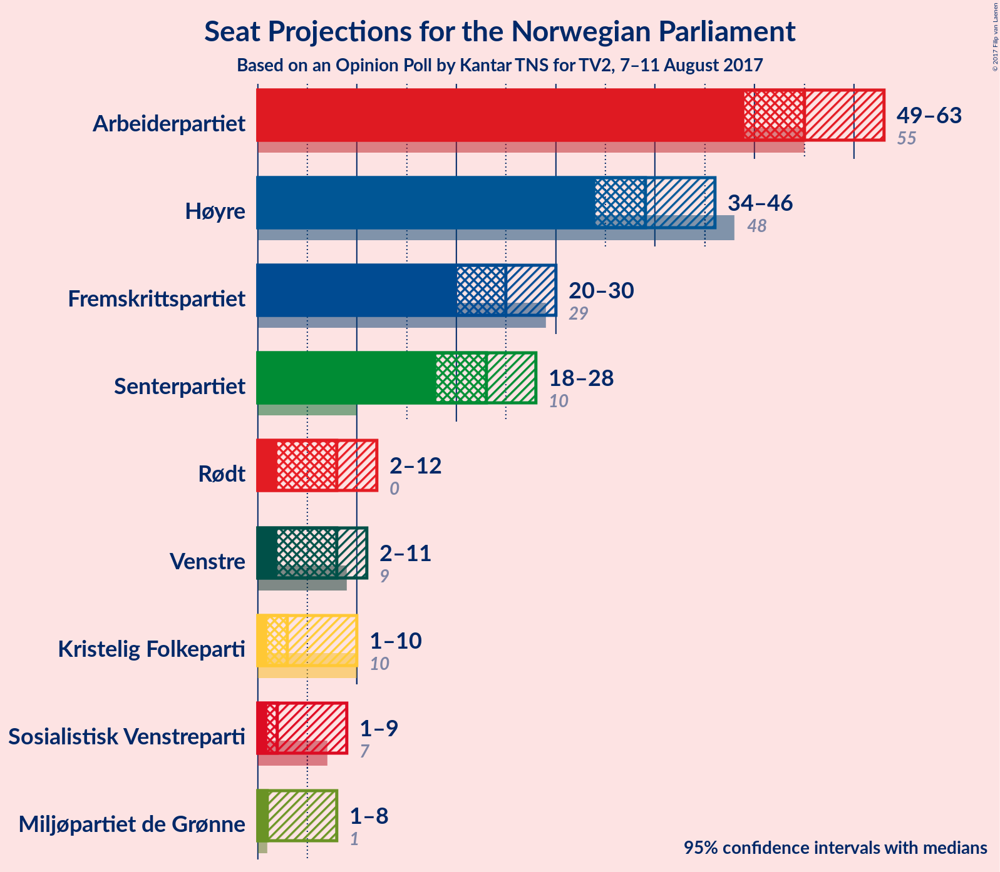

# Opinion Poll by Kantar TNS for TV2, 7–11 August 2017

<a href="#voting-intentions">Voting Intentions</a> | <a href="#seats">Seats</a> | <a href="#coalitions">Coalitions</a> | <a href="#technical-information">Technical Information</a>

## Voting Intentions

### Confidence Intervals

| Party | Last Result | Poll Result | 80% Confidence Interval | 90% Confidence Interval | 95% Confidence Interval | 99% Confidence Interval |
|:-----:|:-----------:|:-----------:|:-----------------------:|:-----------------------:|:-----------------------:|:-----------------------:|
| Arbeiderpartiet | 30.8% | 30.3% | 28.2–32.5% |27.6–33.1% |27.1–33.7% |26.1–34.8% |
| Høyre | 26.8% | 21.5% | 19.6–23.5% |19.1–24.1% |18.7–24.6% |17.8–25.6% |
| Fremskrittspartiet | 16.3% | 13.6% | 12.1–15.4% |11.7–15.9% |11.4–16.3% |10.7–17.2% |
| Senterpartiet | 5.5% | 12.6% | 11.1–14.3% |10.7–14.7% |10.4–15.2% |9.7–16.0% |
| Rødt | 1.1% | 4.7% | 3.9–5.9% |3.6–6.2% |3.4–6.5% |3.0–7.1% |
| Venstre | 5.2% | 4.5% | 3.6–5.6% |3.4–5.9% |3.2–6.2% |2.8–6.8% |
| Kristelig Folkeparti | 5.6% | 3.9% | 3.1–5.0% |2.9–5.3% |2.7–5.6% |2.4–6.1% |
| Sosialistisk Venstreparti | 4.1% | 3.6% | 2.9–4.7% |2.7–5.0% |2.5–5.3% |2.2–5.8% |
| Miljøpartiet de Grønne | 2.8% | 3.1% | 2.4–4.1% |2.2–4.4% |2.1–4.6% |1.8–5.2% |

*Note:* The poll result column reflects the actual value used in the calculations. Published results may vary slightly, and in addition be rounded to fewer digits.

## Seats

### Confidence Intervals

| Party | Last Result | Median | 80% Confidence Interval | 90% Confidence Interval | 95% Confidence Interval | 99% Confidence Interval |
|:-----:|:-----------:|:------:|:-----------------------:|:-----------------------:|:-----------------------:|:-----------------------:|
| <a href="#arbeiderpartiet">Arbeiderpartiet</a> | 55 | 56 | 52–59 |50–62 |49–63 |47–65 |
| <a href="#høyre">Høyre</a> | 48 | 39 | 36–44 |35–45 |34–46 |33–47 |
| <a href="#fremskrittspartiet">Fremskrittspartiet</a> | 29 | 25 | 21–29 |21–29 |20–30 |18–32 |
| <a href="#senterpartiet">Senterpartiet</a> | 10 | 24 | 20–26 |19–28 |18–29 |17–30 |
| <a href="#rødt">Rødt</a> | 0 | 9 | 2–11 |2–12 |2–13 |2–14 |
| <a href="#venstre">Venstre</a> | 9 | 8 | 2–10 |2–11 |2–11 |1–12 |
| <a href="#kristelig-folkeparti">Kristelig Folkeparti</a> | 10 | 2 | 2–9 |1–9 |1–10 |1–11 |
| <a href="#sosialistisk-venstreparti">Sosialistisk Venstreparti</a> | 7 | 1 | 1–9 |1–9 |1–10 |0–10 |
| <a href="#miljøpartiet-de-grønne">Miljøpartiet de Grønne</a> | 1 | 1 | 1–3 |1–7 |1–8 |0–9 |

### Arbeiderpartiet

| Number of Seats | Probability | Accumulated | Special Marks |
|:---------------:|:-----------:|:-----------:|:-------------:|
| 46 | 0.1% | 100% |  |
| 47 | 0.3% | 99.8% |  |
| 48 | 1.0% | 99.5% |  |
| 49 | 3% | 98% |  |
| 50 | 0.8% | 96% |  |
| 51 | 2% | 95% |  |
| 52 | 4% | 93% |  |
| 53 | 13% | 89% |  |
| 54 | 5% | 76% |  |
| 55 | 16% | 70% | Last Result |
| 56 | 7% | 54% | Median |
| 57 | 13% | 46% |  |
| 58 | 17% | 33% |  |
| 59 | 6% | 16% |  |
| 60 | 1.1% | 10% |  |
| 61 | 3% | 9% |  |
| 62 | 3% | 6% |  |
| 63 | 2% | 4% |  |
| 64 | 0.8% | 2% |  |
| 65 | 0.5% | 0.9% |  |
| 66 | 0.3% | 0.4% |  |
| 67 | 0% | 0.2% |  |
| 68 | 0.1% | 0.2% |  |
| 69 | 0% | 0% |  |

### Høyre

| Number of Seats | Probability | Accumulated | Special Marks |
|:---------------:|:-----------:|:-----------:|:-------------:|
| 31 | 0.1% | 100% |  |
| 32 | 0.3% | 99.9% |  |
| 33 | 0.6% | 99.5% |  |
| 34 | 3% | 98.9% |  |
| 35 | 3% | 96% |  |
| 36 | 4% | 93% |  |
| 37 | 8% | 89% |  |
| 38 | 24% | 81% |  |
| 39 | 20% | 57% | Median |
| 40 | 5% | 37% |  |
| 41 | 13% | 33% |  |
| 42 | 6% | 20% |  |
| 43 | 2% | 14% |  |
| 44 | 7% | 12% |  |
| 45 | 2% | 5% |  |
| 46 | 3% | 4% |  |
| 47 | 0.4% | 0.9% |  |
| 48 | 0.3% | 0.4% | Last Result |
| 49 | 0% | 0.2% |  |
| 50 | 0% | 0.1% |  |
| 51 | 0.1% | 0.1% |  |
| 52 | 0% | 0% |  |

### Fremskrittspartiet

| Number of Seats | Probability | Accumulated | Special Marks |
|:---------------:|:-----------:|:-----------:|:-------------:|
| 17 | 0.1% | 100% |  |
| 18 | 1.1% | 99.9% |  |
| 19 | 0.6% | 98.8% |  |
| 20 | 2% | 98% |  |
| 21 | 11% | 96% |  |
| 22 | 10% | 84% |  |
| 23 | 15% | 75% |  |
| 24 | 8% | 60% |  |
| 25 | 16% | 52% | Median |
| 26 | 2% | 35% |  |
| 27 | 7% | 33% |  |
| 28 | 13% | 26% |  |
| 29 | 10% | 13% | Last Result |
| 30 | 1.1% | 3% |  |
| 31 | 1.3% | 2% |  |
| 32 | 0.2% | 0.5% |  |
| 33 | 0.3% | 0.4% |  |
| 34 | 0% | 0.1% |  |
| 35 | 0% | 0% |  |

### Senterpartiet

| Number of Seats | Probability | Accumulated | Special Marks |
|:---------------:|:-----------:|:-----------:|:-------------:|
| 10 | 0% | 100% | Last Result |
| 11 | 0% | 100% |  |
| 12 | 0% | 100% |  |
| 13 | 0% | 100% |  |
| 14 | 0% | 100% |  |
| 15 | 0.1% | 100% |  |
| 16 | 0.2% | 99.9% |  |
| 17 | 1.0% | 99.7% |  |
| 18 | 2% | 98.7% |  |
| 19 | 3% | 97% |  |
| 20 | 8% | 94% |  |
| 21 | 4% | 86% |  |
| 22 | 11% | 83% |  |
| 23 | 18% | 72% |  |
| 24 | 34% | 54% | Median |
| 25 | 9% | 20% |  |
| 26 | 3% | 12% |  |
| 27 | 3% | 9% |  |
| 28 | 3% | 6% |  |
| 29 | 3% | 3% |  |
| 30 | 0.8% | 0.8% |  |
| 31 | 0% | 0% |  |

### Rødt

| Number of Seats | Probability | Accumulated | Special Marks |
|:---------------:|:-----------:|:-----------:|:-------------:|
| 0 | 0% | 100% | Last Result |
| 1 | 0% | 100% |  |
| 2 | 13% | 100% |  |
| 3 | 0% | 87% |  |
| 4 | 0% | 87% |  |
| 5 | 0% | 87% |  |
| 6 | 0% | 87% |  |
| 7 | 3% | 87% |  |
| 8 | 27% | 83% |  |
| 9 | 24% | 57% | Median |
| 10 | 16% | 33% |  |
| 11 | 10% | 17% |  |
| 12 | 4% | 7% |  |
| 13 | 3% | 3% |  |
| 14 | 0.6% | 0.6% |  |
| 15 | 0% | 0% |  |

### Venstre

| Number of Seats | Probability | Accumulated | Special Marks |
|:---------------:|:-----------:|:-----------:|:-------------:|
| 1 | 1.2% | 100% |  |
| 2 | 11% | 98.8% |  |
| 3 | 11% | 87% |  |
| 4 | 0% | 76% |  |
| 5 | 0% | 76% |  |
| 6 | 0% | 76% |  |
| 7 | 4% | 76% |  |
| 8 | 24% | 73% | Median |
| 9 | 17% | 49% | Last Result |
| 10 | 24% | 32% |  |
| 11 | 5% | 7% |  |
| 12 | 1.4% | 2% |  |
| 13 | 0.3% | 0.3% |  |
| 14 | 0% | 0% |  |

### Kristelig Folkeparti

| Number of Seats | Probability | Accumulated | Special Marks |
|:---------------:|:-----------:|:-----------:|:-------------:|
| 0 | 0.3% | 100% |  |
| 1 | 6% | 99.7% |  |
| 2 | 45% | 94% | Median |
| 3 | 4% | 48% |  |
| 4 | 0% | 44% |  |
| 5 | 0% | 44% |  |
| 6 | 0% | 44% |  |
| 7 | 5% | 44% |  |
| 8 | 27% | 39% |  |
| 9 | 8% | 12% |  |
| 10 | 3% | 4% | Last Result |
| 11 | 0.4% | 0.7% |  |
| 12 | 0.2% | 0.3% |  |
| 13 | 0% | 0% |  |

### Sosialistisk Venstreparti

| Number of Seats | Probability | Accumulated | Special Marks |
|:---------------:|:-----------:|:-----------:|:-------------:|
| 0 | 2% | 100% |  |
| 1 | 60% | 98% | Median |
| 2 | 12% | 38% |  |
| 3 | 0.1% | 26% |  |
| 4 | 0% | 26% |  |
| 5 | 0% | 26% |  |
| 6 | 0.1% | 26% |  |
| 7 | 5% | 26% | Last Result |
| 8 | 6% | 21% |  |
| 9 | 11% | 15% |  |
| 10 | 4% | 4% |  |
| 11 | 0.2% | 0.2% |  |
| 12 | 0% | 0% |  |

### Miljøpartiet de Grønne

| Number of Seats | Probability | Accumulated | Special Marks |
|:---------------:|:-----------:|:-----------:|:-------------:|
| 0 | 1.0% | 100% |  |
| 1 | 65% | 99.0% | Last Result, Median |
| 2 | 19% | 34% |  |
| 3 | 8% | 14% |  |
| 4 | 0.6% | 7% |  |
| 5 | 0% | 6% |  |
| 6 | 0% | 6% |  |
| 7 | 2% | 6% |  |
| 8 | 3% | 4% |  |
| 9 | 0.9% | 1.1% |  |
| 10 | 0.1% | 0.2% |  |
| 11 | 0% | 0% |  |

## Coalitions

### Confidence Intervals

| Coalition | Last Result | Median | 80% Confidence Interval | 90% Confidence Interval | 95% Confidence Interval | 99% Confidence Interval |
|:---------:|:-----------:|:------:|:-----------------------:|:-----------------------:|:-----------------------:|:-----------------------:|
| Høyre – Fremskrittspartiet – Senterpartiet – Venstre – Kristelig Folkeparti | 106 | 100 | 94–105 | 93–106 | 90–108 | 87–110 |
| Arbeiderpartiet – Senterpartiet – Rødt – Sosialistisk Venstreparti – Miljøpartiet de Grønne | 73 | 92 | 88–98 | 86–100 | 85–102 | 82–105 |
| Arbeiderpartiet – Senterpartiet – Rødt – Sosialistisk Venstreparti | 72 | 90 | 86–95 | 84–99 | 82–100 | 80–104 |
| Arbeiderpartiet – Senterpartiet – Kristelig Folkeparti – Sosialistisk Venstreparti – Miljøpartiet de Grønne | 83 | 87 | 83–96 | 82–98 | 81–99 | 78–103 |
| Arbeiderpartiet – Senterpartiet – Sosialistisk Venstreparti – Miljøpartiet de Grønne | 73 | 84 | 79–91 | 77–92 | 77–94 | 74–97 |
| Arbeiderpartiet – Senterpartiet – Kristelig Folkeparti | 75 | 84 | 78–90 | 77–91 | 76–92 | 71–95 |
| Arbeiderpartiet – Senterpartiet – Sosialistisk Venstreparti | 72 | 82 | 78–89 | 76–91 | 75–91 | 72–96 |
| Arbeiderpartiet – Senterpartiet | 65 | 79 | 74–84 | 73–87 | 71–89 | 69–92 |
| Høyre – Fremskrittspartiet – Venstre – Kristelig Folkeparti – Miljøpartiet de Grønne | 97 | 79 | 74–83 | 70–85 | 69–87 | 65–89 |
| Høyre – Fremskrittspartiet – Venstre – Kristelig Folkeparti | 96 | 77 | 71–81 | 69–83 | 67–84 | 64–87 |
| Høyre – Fremskrittspartiet | 77 | 64 | 59–69 | 58–69 | 56–72 | 53–75 |
| Arbeiderpartiet – Sosialistisk Venstreparti | 62 | 59 | 54–66 | 53–68 | 51–68 | 50–73 |
| Høyre – Venstre – Kristelig Folkeparti | 67 | 52 | 47–56 | 44–57 | 43–58 | 40–61 |
| Senterpartiet – Venstre – Kristelig Folkeparti | 29 | 35 | 30–41 | 29–42 | 27–44 | 25–46 |

### Høyre – Fremskrittspartiet – Senterpartiet – Venstre – Kristelig Folkeparti

| Number of Seats | Probability | Accumulated | Special Marks |
|:---------------:|:-----------:|:-----------:|:-------------:|
| 85 | 0% | 100% | Majority |
| 86 | 0.3% | 99.9% |  |
| 87 | 0.6% | 99.7% |  |
| 88 | 0.1% | 99.0% |  |
| 89 | 1.0% | 98.9% |  |
| 90 | 0.4% | 98% |  |
| 91 | 1.3% | 97% |  |
| 92 | 1.1% | 96% |  |
| 93 | 4% | 95% |  |
| 94 | 5% | 91% |  |
| 95 | 6% | 86% |  |
| 96 | 5% | 79% |  |
| 97 | 9% | 75% |  |
| 98 | 2% | 66% | Median |
| 99 | 11% | 64% |  |
| 100 | 5% | 53% |  |
| 101 | 7% | 49% |  |
| 102 | 8% | 42% |  |
| 103 | 7% | 33% |  |
| 104 | 15% | 26% |  |
| 105 | 2% | 11% |  |
| 106 | 4% | 9% | Last Result |
| 107 | 2% | 5% |  |
| 108 | 0.8% | 3% |  |
| 109 | 2% | 2% |  |
| 110 | 0.4% | 0.5% |  |
| 111 | 0% | 0.1% |  |
| 112 | 0% | 0.1% |  |
| 113 | 0% | 0.1% |  |
| 114 | 0.1% | 0.1% |  |
| 115 | 0% | 0% |  |

### Arbeiderpartiet – Senterpartiet – Rødt – Sosialistisk Venstreparti – Miljøpartiet de Grønne

| Number of Seats | Probability | Accumulated | Special Marks |
|:---------------:|:-----------:|:-----------:|:-------------:|
| 73 | 0% | 100% | Last Result |
| 74 | 0% | 100% |  |
| 75 | 0% | 100% |  |
| 76 | 0% | 100% |  |
| 77 | 0% | 100% |  |
| 78 | 0% | 100% |  |
| 79 | 0% | 100% |  |
| 80 | 0.1% | 99.9% |  |
| 81 | 0.1% | 99.9% |  |
| 82 | 0.3% | 99.8% |  |
| 83 | 0.7% | 99.5% |  |
| 84 | 0.5% | 98.7% |  |
| 85 | 2% | 98% | Majority |
| 86 | 3% | 96% |  |
| 87 | 2% | 93% |  |
| 88 | 2% | 91% |  |
| 89 | 17% | 89% |  |
| 90 | 10% | 72% |  |
| 91 | 10% | 62% | Median |
| 92 | 5% | 52% |  |
| 93 | 2% | 47% |  |
| 94 | 15% | 45% |  |
| 95 | 4% | 30% |  |
| 96 | 12% | 25% |  |
| 97 | 2% | 14% |  |
| 98 | 2% | 12% |  |
| 99 | 3% | 9% |  |
| 100 | 3% | 7% |  |
| 101 | 0.7% | 4% |  |
| 102 | 1.3% | 4% |  |
| 103 | 1.2% | 2% |  |
| 104 | 0.2% | 1.2% |  |
| 105 | 0.8% | 0.9% |  |
| 106 | 0% | 0.2% |  |
| 107 | 0.1% | 0.1% |  |
| 108 | 0% | 0% |  |

### Arbeiderpartiet – Senterpartiet – Rødt – Sosialistisk Venstreparti

| Number of Seats | Probability | Accumulated | Special Marks |
|:---------------:|:-----------:|:-----------:|:-------------:|
| 72 | 0% | 100% | Last Result |
| 73 | 0% | 100% |  |
| 74 | 0% | 100% |  |
| 75 | 0.1% | 100% |  |
| 76 | 0% | 99.9% |  |
| 77 | 0.1% | 99.9% |  |
| 78 | 0.1% | 99.8% |  |
| 79 | 0.1% | 99.7% |  |
| 80 | 0.5% | 99.6% |  |
| 81 | 0.4% | 99.1% |  |
| 82 | 1.3% | 98.7% |  |
| 83 | 1.0% | 97% |  |
| 84 | 3% | 96% |  |
| 85 | 2% | 94% | Majority |
| 86 | 4% | 91% |  |
| 87 | 3% | 88% |  |
| 88 | 16% | 85% |  |
| 89 | 11% | 69% |  |
| 90 | 10% | 58% | Median |
| 91 | 6% | 48% |  |
| 92 | 12% | 42% |  |
| 93 | 5% | 30% |  |
| 94 | 9% | 25% |  |
| 95 | 6% | 16% |  |
| 96 | 0.7% | 10% |  |
| 97 | 2% | 9% |  |
| 98 | 2% | 7% |  |
| 99 | 2% | 6% |  |
| 100 | 1.0% | 3% |  |
| 101 | 1.4% | 2% |  |
| 102 | 0.1% | 1.0% |  |
| 103 | 0.3% | 0.8% |  |
| 104 | 0.5% | 0.5% |  |
| 105 | 0% | 0% |  |

### Arbeiderpartiet – Senterpartiet – Kristelig Folkeparti – Sosialistisk Venstreparti – Miljøpartiet de Grønne

| Number of Seats | Probability | Accumulated | Special Marks |
|:---------------:|:-----------:|:-----------:|:-------------:|
| 77 | 0% | 100% |  |
| 78 | 1.0% | 99.9% |  |
| 79 | 0.2% | 98.9% |  |
| 80 | 0.2% | 98.7% |  |
| 81 | 3% | 98% |  |
| 82 | 4% | 96% |  |
| 83 | 10% | 92% | Last Result |
| 84 | 6% | 82% | Median |
| 85 | 6% | 75% | Majority |
| 86 | 3% | 69% |  |
| 87 | 17% | 67% |  |
| 88 | 2% | 50% |  |
| 89 | 2% | 47% |  |
| 90 | 7% | 45% |  |
| 91 | 2% | 38% |  |
| 92 | 5% | 36% |  |
| 93 | 10% | 31% |  |
| 94 | 6% | 21% |  |
| 95 | 1.0% | 15% |  |
| 96 | 8% | 14% |  |
| 97 | 0.9% | 6% |  |
| 98 | 2% | 5% |  |
| 99 | 2% | 4% |  |
| 100 | 0.7% | 2% |  |
| 101 | 0.3% | 1.3% |  |
| 102 | 0.3% | 0.9% |  |
| 103 | 0.2% | 0.6% |  |
| 104 | 0.2% | 0.4% |  |
| 105 | 0% | 0.3% |  |
| 106 | 0% | 0.3% |  |
| 107 | 0.3% | 0.3% |  |
| 108 | 0% | 0% |  |

### Arbeiderpartiet – Senterpartiet – Sosialistisk Venstreparti – Miljøpartiet de Grønne

| Number of Seats | Probability | Accumulated | Special Marks |
|:---------------:|:-----------:|:-----------:|:-------------:|
| 71 | 0.1% | 100% |  |
| 72 | 0.1% | 99.9% |  |
| 73 | 0.2% | 99.9% | Last Result |
| 74 | 0.2% | 99.7% |  |
| 75 | 0.2% | 99.5% |  |
| 76 | 1.2% | 99.2% |  |
| 77 | 3% | 98% |  |
| 78 | 1.5% | 95% |  |
| 79 | 10% | 93% |  |
| 80 | 3% | 83% |  |
| 81 | 13% | 80% |  |
| 82 | 9% | 66% | Median |
| 83 | 5% | 57% |  |
| 84 | 6% | 53% |  |
| 85 | 16% | 47% | Majority |
| 86 | 3% | 31% |  |
| 87 | 3% | 27% |  |
| 88 | 8% | 24% |  |
| 89 | 0.9% | 17% |  |
| 90 | 4% | 16% |  |
| 91 | 2% | 12% |  |
| 92 | 5% | 10% |  |
| 93 | 0.2% | 4% |  |
| 94 | 2% | 4% |  |
| 95 | 0.2% | 2% |  |
| 96 | 0.2% | 1.4% |  |
| 97 | 1.0% | 1.2% |  |
| 98 | 0.1% | 0.2% |  |
| 99 | 0.1% | 0.1% |  |
| 100 | 0% | 0% |  |

### Arbeiderpartiet – Senterpartiet – Kristelig Folkeparti

| Number of Seats | Probability | Accumulated | Special Marks |
|:---------------:|:-----------:|:-----------:|:-------------:|
| 71 | 0.5% | 100% |  |
| 72 | 0.1% | 99.5% |  |
| 73 | 0.3% | 99.4% |  |
| 74 | 0.4% | 99.1% |  |
| 75 | 1.0% | 98.7% | Last Result |
| 76 | 2% | 98% |  |
| 77 | 5% | 96% |  |
| 78 | 1.2% | 91% |  |
| 79 | 4% | 90% |  |
| 80 | 6% | 86% |  |
| 81 | 11% | 80% |  |
| 82 | 11% | 69% | Median |
| 83 | 6% | 58% |  |
| 84 | 5% | 52% |  |
| 85 | 16% | 47% | Majority |
| 86 | 4% | 32% |  |
| 87 | 2% | 28% |  |
| 88 | 5% | 26% |  |
| 89 | 4% | 21% |  |
| 90 | 10% | 17% |  |
| 91 | 2% | 7% |  |
| 92 | 3% | 5% |  |
| 93 | 0.3% | 2% |  |
| 94 | 1.0% | 2% |  |
| 95 | 0.4% | 0.8% |  |
| 96 | 0% | 0.4% |  |
| 97 | 0.2% | 0.4% |  |
| 98 | 0.1% | 0.1% |  |
| 99 | 0% | 0% |  |

### Arbeiderpartiet – Senterpartiet – Sosialistisk Venstreparti

| Number of Seats | Probability | Accumulated | Special Marks |
|:---------------:|:-----------:|:-----------:|:-------------:|
| 69 | 0.1% | 100% |  |
| 70 | 0.1% | 99.9% |  |
| 71 | 0.2% | 99.8% |  |
| 72 | 0.2% | 99.6% | Last Result |
| 73 | 0.4% | 99.4% |  |
| 74 | 0.3% | 99.0% |  |
| 75 | 2% | 98.6% |  |
| 76 | 3% | 97% |  |
| 77 | 3% | 93% |  |
| 78 | 10% | 91% |  |
| 79 | 4% | 80% |  |
| 80 | 15% | 76% |  |
| 81 | 11% | 61% | Median |
| 82 | 2% | 51% |  |
| 83 | 15% | 48% |  |
| 84 | 7% | 33% |  |
| 85 | 4% | 26% | Majority |
| 86 | 3% | 22% |  |
| 87 | 4% | 19% |  |
| 88 | 0.9% | 14% |  |
| 89 | 4% | 14% |  |
| 90 | 4% | 10% |  |
| 91 | 4% | 6% |  |
| 92 | 0.5% | 2% |  |
| 93 | 0.9% | 2% |  |
| 94 | 0.2% | 0.8% |  |
| 95 | 0.1% | 0.6% |  |
| 96 | 0.5% | 0.6% |  |
| 97 | 0% | 0% |  |

### Arbeiderpartiet – Senterpartiet

| Number of Seats | Probability | Accumulated | Special Marks |
|:---------------:|:-----------:|:-----------:|:-------------:|
| 65 | 0% | 100% | Last Result |
| 66 | 0% | 100% |  |
| 67 | 0% | 100% |  |
| 68 | 0.4% | 99.9% |  |
| 69 | 0.2% | 99.5% |  |
| 70 | 1.4% | 99.4% |  |
| 71 | 0.8% | 98% |  |
| 72 | 2% | 97% |  |
| 73 | 2% | 96% |  |
| 74 | 4% | 94% |  |
| 75 | 6% | 90% |  |
| 76 | 3% | 83% |  |
| 77 | 15% | 80% |  |
| 78 | 4% | 65% |  |
| 79 | 15% | 61% |  |
| 80 | 10% | 45% | Median |
| 81 | 5% | 36% |  |
| 82 | 16% | 30% |  |
| 83 | 3% | 15% |  |
| 84 | 3% | 12% |  |
| 85 | 1.5% | 9% | Majority |
| 86 | 0.9% | 7% |  |
| 87 | 2% | 6% |  |
| 88 | 1.2% | 4% |  |
| 89 | 1.2% | 3% |  |
| 90 | 1.1% | 2% |  |
| 91 | 0% | 0.6% |  |
| 92 | 0.5% | 0.5% |  |
| 93 | 0% | 0% |  |

### Høyre – Fremskrittspartiet – Venstre – Kristelig Folkeparti – Miljøpartiet de Grønne

| Number of Seats | Probability | Accumulated | Special Marks |
|:---------------:|:-----------:|:-----------:|:-------------:|
| 65 | 0.5% | 100% |  |
| 66 | 0.3% | 99.5% |  |
| 67 | 0.1% | 99.2% |  |
| 68 | 1.4% | 99.0% |  |
| 69 | 1.0% | 98% |  |
| 70 | 2% | 97% |  |
| 71 | 2% | 94% |  |
| 72 | 2% | 93% |  |
| 73 | 0.7% | 91% |  |
| 74 | 6% | 90% |  |
| 75 | 9% | 84% | Median |
| 76 | 5% | 75% |  |
| 77 | 12% | 70% |  |
| 78 | 6% | 58% |  |
| 79 | 10% | 52% |  |
| 80 | 11% | 42% |  |
| 81 | 16% | 31% |  |
| 82 | 3% | 15% |  |
| 83 | 4% | 12% |  |
| 84 | 2% | 9% |  |
| 85 | 3% | 6% | Majority |
| 86 | 1.0% | 4% |  |
| 87 | 1.3% | 3% |  |
| 88 | 0.3% | 1.3% |  |
| 89 | 0.5% | 0.9% |  |
| 90 | 0.1% | 0.4% |  |
| 91 | 0.1% | 0.3% |  |
| 92 | 0.1% | 0.2% |  |
| 93 | 0% | 0.1% |  |
| 94 | 0.1% | 0.1% |  |
| 95 | 0% | 0% |  |
| 96 | 0% | 0% |  |
| 97 | 0% | 0% | Last Result |

### Høyre – Fremskrittspartiet – Venstre – Kristelig Folkeparti

| Number of Seats | Probability | Accumulated | Special Marks |
|:---------------:|:-----------:|:-----------:|:-------------:|
| 62 | 0.1% | 100% |  |
| 63 | 0% | 99.9% |  |
| 64 | 0.8% | 99.8% |  |
| 65 | 0.2% | 99.1% |  |
| 66 | 1.2% | 98.8% |  |
| 67 | 1.3% | 98% |  |
| 68 | 0.7% | 96% |  |
| 69 | 3% | 96% |  |
| 70 | 3% | 93% |  |
| 71 | 2% | 90% |  |
| 72 | 2% | 88% |  |
| 73 | 12% | 86% |  |
| 74 | 4% | 74% | Median |
| 75 | 15% | 70% |  |
| 76 | 2% | 55% |  |
| 77 | 5% | 53% |  |
| 78 | 10% | 48% |  |
| 79 | 10% | 38% |  |
| 80 | 17% | 27% |  |
| 81 | 2% | 10% |  |
| 82 | 2% | 9% |  |
| 83 | 3% | 7% |  |
| 84 | 2% | 4% |  |
| 85 | 0.5% | 2% | Majority |
| 86 | 0.7% | 1.2% |  |
| 87 | 0.3% | 0.5% |  |
| 88 | 0.1% | 0.2% |  |
| 89 | 0% | 0.1% |  |
| 90 | 0% | 0.1% |  |
| 91 | 0% | 0% |  |
| 92 | 0% | 0% |  |
| 93 | 0% | 0% |  |
| 94 | 0% | 0% |  |
| 95 | 0% | 0% |  |
| 96 | 0% | 0% | Last Result |

### Høyre – Fremskrittspartiet

| Number of Seats | Probability | Accumulated | Special Marks |
|:---------------:|:-----------:|:-----------:|:-------------:|
| 51 | 0.1% | 100% |  |
| 52 | 0% | 99.8% |  |
| 53 | 0.3% | 99.8% |  |
| 54 | 1.1% | 99.5% |  |
| 55 | 0.3% | 98% |  |
| 56 | 0.7% | 98% |  |
| 57 | 0.9% | 97% |  |
| 58 | 2% | 96% |  |
| 59 | 11% | 95% |  |
| 60 | 4% | 84% |  |
| 61 | 12% | 80% |  |
| 62 | 3% | 69% |  |
| 63 | 13% | 66% |  |
| 64 | 7% | 53% | Median |
| 65 | 4% | 46% |  |
| 66 | 5% | 42% |  |
| 67 | 9% | 36% |  |
| 68 | 13% | 28% |  |
| 69 | 9% | 14% |  |
| 70 | 0.8% | 5% |  |
| 71 | 0.9% | 4% |  |
| 72 | 0.6% | 3% |  |
| 73 | 1.3% | 2% |  |
| 74 | 0.6% | 1.1% |  |
| 75 | 0.1% | 0.5% |  |
| 76 | 0.1% | 0.4% |  |
| 77 | 0.2% | 0.3% | Last Result |
| 78 | 0.1% | 0.1% |  |
| 79 | 0% | 0% |  |

### Arbeiderpartiet – Sosialistisk Venstreparti

| Number of Seats | Probability | Accumulated | Special Marks |
|:---------------:|:-----------:|:-----------:|:-------------:|
| 47 | 0.1% | 100% |  |
| 48 | 0% | 99.9% |  |
| 49 | 0.1% | 99.9% |  |
| 50 | 0.7% | 99.8% |  |
| 51 | 2% | 99.1% |  |
| 52 | 0.8% | 97% |  |
| 53 | 2% | 96% |  |
| 54 | 10% | 94% |  |
| 55 | 3% | 84% |  |
| 56 | 12% | 80% |  |
| 57 | 5% | 68% | Median |
| 58 | 11% | 63% |  |
| 59 | 16% | 51% |  |
| 60 | 7% | 36% |  |
| 61 | 2% | 29% |  |
| 62 | 4% | 27% | Last Result |
| 63 | 4% | 23% |  |
| 64 | 7% | 19% |  |
| 65 | 2% | 12% |  |
| 66 | 4% | 11% |  |
| 67 | 1.0% | 6% |  |
| 68 | 3% | 5% |  |
| 69 | 0.5% | 2% |  |
| 70 | 0.9% | 2% |  |
| 71 | 0.1% | 0.8% |  |
| 72 | 0.1% | 0.7% |  |
| 73 | 0.6% | 0.6% |  |
| 74 | 0% | 0% |  |

### Høyre – Venstre – Kristelig Folkeparti

| Number of Seats | Probability | Accumulated | Special Marks |
|:---------------:|:-----------:|:-----------:|:-------------:|
| 39 | 0.1% | 100% |  |
| 40 | 0.4% | 99.8% |  |
| 41 | 0.7% | 99.4% |  |
| 42 | 0.4% | 98.7% |  |
| 43 | 1.2% | 98% |  |
| 44 | 3% | 97% |  |
| 45 | 0.8% | 94% |  |
| 46 | 2% | 93% |  |
| 47 | 4% | 91% |  |
| 48 | 6% | 88% |  |
| 49 | 3% | 82% | Median |
| 50 | 12% | 79% |  |
| 51 | 16% | 68% |  |
| 52 | 13% | 51% |  |
| 53 | 5% | 39% |  |
| 54 | 11% | 34% |  |
| 55 | 4% | 23% |  |
| 56 | 13% | 19% |  |
| 57 | 2% | 6% |  |
| 58 | 2% | 4% |  |
| 59 | 0.6% | 2% |  |
| 60 | 1.1% | 2% |  |
| 61 | 0.2% | 0.7% |  |
| 62 | 0.4% | 0.5% |  |
| 63 | 0% | 0.1% |  |
| 64 | 0% | 0.1% |  |
| 65 | 0% | 0% |  |
| 66 | 0% | 0% |  |
| 67 | 0% | 0% | Last Result |

### Senterpartiet – Venstre – Kristelig Folkeparti

| Number of Seats | Probability | Accumulated | Special Marks |
|:---------------:|:-----------:|:-----------:|:-------------:|
| 22 | 0.1% | 100% |  |
| 23 | 0.2% | 99.9% |  |
| 24 | 0.2% | 99.7% |  |
| 25 | 0.3% | 99.5% |  |
| 26 | 0.8% | 99.2% |  |
| 27 | 1.3% | 98% |  |
| 28 | 0.8% | 97% |  |
| 29 | 2% | 96% | Last Result |
| 30 | 5% | 94% |  |
| 31 | 4% | 89% |  |
| 32 | 9% | 85% |  |
| 33 | 9% | 77% |  |
| 34 | 4% | 68% | Median |
| 35 | 16% | 64% |  |
| 36 | 14% | 48% |  |
| 37 | 2% | 33% |  |
| 38 | 2% | 31% |  |
| 39 | 6% | 29% |  |
| 40 | 13% | 24% |  |
| 41 | 2% | 11% |  |
| 42 | 4% | 8% |  |
| 43 | 1.1% | 5% |  |
| 44 | 3% | 4% |  |
| 45 | 0.2% | 0.9% |  |
| 46 | 0.6% | 0.7% |  |
| 47 | 0% | 0.1% |  |
| 48 | 0% | 0.1% |  |
| 49 | 0% | 0% |  |

## Technical Information

### Opinion Poll

+ **Pollster:** Kantar TNS
+ **Media:** TV2
+ **Fieldwork period:** 7–11 August 2017

### Calculations

+ **Sample size:** 740
+ **Simulations done:** 524,288
+ **Error estimate:** 2.73%

