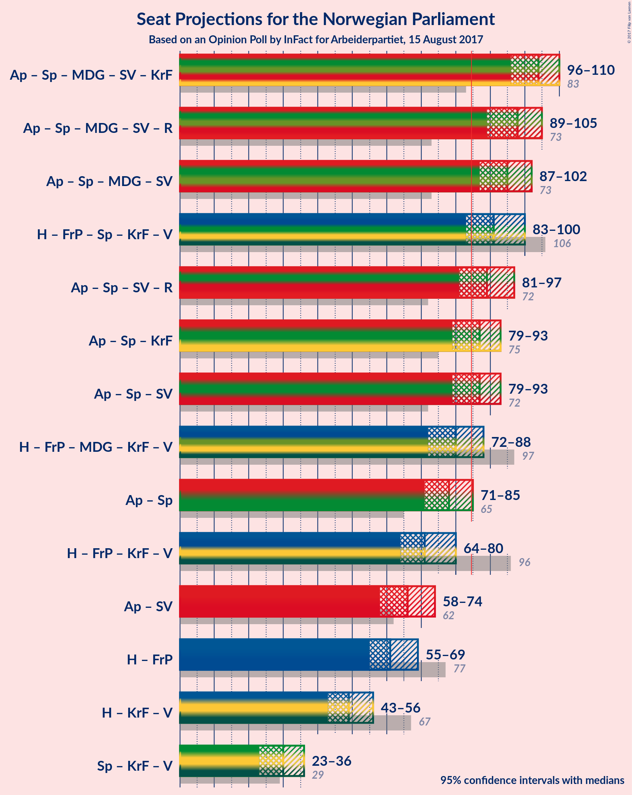

# Opinion Poll by InFact for Arbeiderpartiet, 15 August 2017

<a href="#voting-intentions">Voting Intentions</a> | <a href="#seats">Seats</a> | <a href="#coalitions">Coalitions</a> | <a href="#technical-information">Technical Information</a>

## Voting Intentions

### Confidence Intervals

| Party | Last Result | Poll Result | 80% Confidence Interval | 90% Confidence Interval | 95% Confidence Interval | 99% Confidence Interval |
|:-----:|:-----------:|:-----------:|:-----------------------:|:-----------------------:|:-----------------------:|:-----------------------:|
| Arbeiderpartiet | 30.8% | 31.3% | 29.4–33.2% |28.9–33.7% |28.5–34.2% |27.6–35.1% |
| Høyre | 26.8% | 21.9% | 20.3–23.6% |19.8–24.1% |19.4–24.6% |18.7–25.4% |
| Fremskrittspartiet | 16.3% | 12.2% | 10.9–13.6% |10.6–14.0% |10.3–14.4% |9.7–15.1% |
| Senterpartiet | 5.5% | 11.0% | 9.8–12.4% |9.5–12.7% |9.2–13.1% |8.7–13.8% |
| Sosialistisk Venstreparti | 4.1% | 4.9% | 4.1–5.9% |3.9–6.2% |3.7–6.4% |3.4–6.9% |
| Miljøpartiet de Grønne | 2.8% | 4.9% | 4.1–5.9% |3.9–6.2% |3.7–6.4% |3.4–6.9% |
| Kristelig Folkeparti | 5.6% | 4.8% | 4.0–5.8% |3.8–6.1% |3.6–6.3% |3.3–6.8% |
| Rødt | 1.1% | 3.2% | 2.6–4.0% |2.4–4.3% |2.3–4.5% |2.0–4.9% |
| Venstre | 5.2% | 3.1% | 2.5–3.9% |2.3–4.2% |2.2–4.4% |1.9–4.8% |

*Note:* The poll result column reflects the actual value used in the calculations. Published results may vary slightly, and in addition be rounded to fewer digits.

## Seats

### Confidence Intervals

| Party | Last Result | Median | 80% Confidence Interval | 90% Confidence Interval | 95% Confidence Interval | 99% Confidence Interval |
|:-----:|:-----------:|:------:|:-----------------------:|:-----------------------:|:-----------------------:|:-----------------------:|
| <a href="#arbeiderpartiet">Arbeiderpartiet</a> | 55 | 58 | 53–64 |53–64 |53–64 |50–65 |
| <a href="#høyre">Høyre</a> | 48 | 39 | 36–43 |36–44 |35–44 |34–46 |
| <a href="#fremskrittspartiet">Fremskrittspartiet</a> | 29 | 22 | 19–25 |18–26 |18–27 |17–28 |
| <a href="#senterpartiet">Senterpartiet</a> | 10 | 20 | 17–22 |17–23 |16–24 |15–25 |
| <a href="#sosialistisk-venstreparti">Sosialistisk Venstreparti</a> | 7 | 9 | 2–11 |2–11 |2–12 |1–12 |
| <a href="#miljøpartiet-de-grønne">Miljøpartiet de Grønne</a> | 1 | 9 | 7–11 |4–11 |3–11 |2–12 |
| <a href="#kristelig-folkeparti">Kristelig Folkeparti</a> | 10 | 9 | 7–10 |2–11 |2–11 |2–12 |
| <a href="#rødt">Rødt</a> | 0 | 2 | 1–2 |1–7 |1–8 |1–9 |
| <a href="#venstre">Venstre</a> | 9 | 1 | 1–3 |0–7 |0–8 |0–8 |

### Arbeiderpartiet

| Number of Seats | Probability | Accumulated | Special Marks |
|:---------------:|:-----------:|:-----------:|:-------------:|
| 47 | 0.1% | 100% |  |
| 48 | 0.1% | 99.9% |  |
| 49 | 0.3% | 99.9% |  |
| 50 | 0.1% | 99.6% |  |
| 51 | 0.6% | 99.5% |  |
| 52 | 0.9% | 98.8% |  |
| 53 | 8% | 98% |  |
| 54 | 6% | 90% |  |
| 55 | 5% | 83% | Last Result |
| 56 | 3% | 78% |  |
| 57 | 24% | 75% |  |
| 58 | 7% | 51% | Median |
| 59 | 8% | 44% |  |
| 60 | 8% | 36% |  |
| 61 | 5% | 28% |  |
| 62 | 6% | 23% |  |
| 63 | 5% | 17% |  |
| 64 | 11% | 12% |  |
| 65 | 0.8% | 1.1% |  |
| 66 | 0.2% | 0.4% |  |
| 67 | 0.1% | 0.1% |  |
| 68 | 0% | 0.1% |  |
| 69 | 0% | 0% |  |

### Høyre

| Number of Seats | Probability | Accumulated | Special Marks |
|:---------------:|:-----------:|:-----------:|:-------------:|
| 32 | 0.1% | 100% |  |
| 33 | 0.4% | 99.9% |  |
| 34 | 2% | 99.5% |  |
| 35 | 3% | 98% |  |
| 36 | 12% | 95% |  |
| 37 | 11% | 83% |  |
| 38 | 16% | 73% |  |
| 39 | 9% | 57% | Median |
| 40 | 11% | 48% |  |
| 41 | 10% | 36% |  |
| 42 | 11% | 26% |  |
| 43 | 9% | 15% |  |
| 44 | 5% | 7% |  |
| 45 | 0.9% | 2% |  |
| 46 | 0.3% | 0.7% |  |
| 47 | 0.2% | 0.4% |  |
| 48 | 0.1% | 0.2% | Last Result |
| 49 | 0% | 0% |  |

### Fremskrittspartiet

| Number of Seats | Probability | Accumulated | Special Marks |
|:---------------:|:-----------:|:-----------:|:-------------:|
| 16 | 0.5% | 100% |  |
| 17 | 0.7% | 99.5% |  |
| 18 | 6% | 98.8% |  |
| 19 | 7% | 93% |  |
| 20 | 16% | 86% |  |
| 21 | 8% | 70% |  |
| 22 | 18% | 62% | Median |
| 23 | 14% | 44% |  |
| 24 | 14% | 30% |  |
| 25 | 10% | 16% |  |
| 26 | 2% | 6% |  |
| 27 | 3% | 5% |  |
| 28 | 2% | 2% |  |
| 29 | 0.2% | 0.3% | Last Result |
| 30 | 0.1% | 0.1% |  |
| 31 | 0% | 0% |  |

### Senterpartiet

| Number of Seats | Probability | Accumulated | Special Marks |
|:---------------:|:-----------:|:-----------:|:-------------:|
| 10 | 0% | 100% | Last Result |
| 11 | 0% | 100% |  |
| 12 | 0% | 100% |  |
| 13 | 0% | 100% |  |
| 14 | 0.1% | 100% |  |
| 15 | 0.6% | 99.9% |  |
| 16 | 2% | 99.3% |  |
| 17 | 13% | 97% |  |
| 18 | 10% | 84% |  |
| 19 | 20% | 75% |  |
| 20 | 16% | 55% | Median |
| 21 | 10% | 38% |  |
| 22 | 21% | 28% |  |
| 23 | 5% | 8% |  |
| 24 | 1.2% | 3% |  |
| 25 | 1.4% | 2% |  |
| 26 | 0.1% | 0.2% |  |
| 27 | 0.2% | 0.2% |  |
| 28 | 0% | 0% |  |

### Sosialistisk Venstreparti

| Number of Seats | Probability | Accumulated | Special Marks |
|:---------------:|:-----------:|:-----------:|:-------------:|
| 1 | 0.8% | 100% |  |
| 2 | 11% | 99.2% |  |
| 3 | 0% | 88% |  |
| 4 | 0% | 88% |  |
| 5 | 0% | 88% |  |
| 6 | 0% | 88% |  |
| 7 | 2% | 88% | Last Result |
| 8 | 24% | 86% |  |
| 9 | 27% | 62% | Median |
| 10 | 25% | 35% |  |
| 11 | 6% | 10% |  |
| 12 | 4% | 4% |  |
| 13 | 0.1% | 0.2% |  |
| 14 | 0.1% | 0.1% |  |
| 15 | 0% | 0% |  |

### Miljøpartiet de Grønne

| Number of Seats | Probability | Accumulated | Special Marks |
|:---------------:|:-----------:|:-----------:|:-------------:|
| 1 | 0.4% | 100% | Last Result |
| 2 | 2% | 99.6% |  |
| 3 | 2% | 98% |  |
| 4 | 2% | 95% |  |
| 5 | 0% | 94% |  |
| 6 | 0.1% | 94% |  |
| 7 | 4% | 94% |  |
| 8 | 37% | 89% |  |
| 9 | 27% | 52% | Median |
| 10 | 11% | 25% |  |
| 11 | 13% | 14% |  |
| 12 | 1.1% | 1.4% |  |
| 13 | 0.2% | 0.3% |  |
| 14 | 0.1% | 0.1% |  |
| 15 | 0% | 0% |  |

### Kristelig Folkeparti

| Number of Seats | Probability | Accumulated | Special Marks |
|:---------------:|:-----------:|:-----------:|:-------------:|
| 1 | 0.1% | 100% |  |
| 2 | 9% | 99.9% |  |
| 3 | 0.3% | 91% |  |
| 4 | 0% | 90% |  |
| 5 | 0% | 90% |  |
| 6 | 0.1% | 90% |  |
| 7 | 14% | 90% |  |
| 8 | 20% | 77% |  |
| 9 | 30% | 57% | Median |
| 10 | 20% | 27% | Last Result |
| 11 | 5% | 7% |  |
| 12 | 2% | 2% |  |
| 13 | 0.2% | 0.3% |  |
| 14 | 0% | 0% |  |

### Rødt

| Number of Seats | Probability | Accumulated | Special Marks |
|:---------------:|:-----------:|:-----------:|:-------------:|
| 0 | 0% | 100% | Last Result |
| 1 | 16% | 100% |  |
| 2 | 78% | 84% | Median |
| 3 | 0% | 6% |  |
| 4 | 0% | 6% |  |
| 5 | 0% | 6% |  |
| 6 | 0.7% | 6% |  |
| 7 | 3% | 6% |  |
| 8 | 2% | 3% |  |
| 9 | 0.6% | 0.6% |  |
| 10 | 0.1% | 0.1% |  |
| 11 | 0% | 0% |  |

### Venstre

| Number of Seats | Probability | Accumulated | Special Marks |
|:---------------:|:-----------:|:-----------:|:-------------:|
| 0 | 7% | 100% |  |
| 1 | 50% | 93% | Median |
| 2 | 33% | 44% |  |
| 3 | 4% | 11% |  |
| 4 | 0% | 7% |  |
| 5 | 0% | 7% |  |
| 6 | 0.1% | 7% |  |
| 7 | 4% | 7% |  |
| 8 | 2% | 3% |  |
| 9 | 0.1% | 0.2% | Last Result |
| 10 | 0% | 0% |  |

## Coalitions

### Confidence Intervals

| Coalition | Last Result | Median | 80% Confidence Interval | 90% Confidence Interval | 95% Confidence Interval | 99% Confidence Interval |
|:---------:|:-----------:|:------:|:-----------------------:|:-----------------------:|:-----------------------:|:-----------------------:|
| Arbeiderpartiet – Senterpartiet – Miljøpartiet de Grønne – Sosialistisk Venstreparti – Kristelig Folkeparti | 83 | 103 | 99–109 | 98–110 | 97–110 | 93–112 |
| Arbeiderpartiet – Senterpartiet – Miljøpartiet de Grønne – Sosialistisk Venstreparti – Rødt | 73 | 97 | 92–103 | 91–104 | 90–105 | 87–106 |
| Arbeiderpartiet – Senterpartiet – Miljøpartiet de Grønne – Sosialistisk Venstreparti | 73 | 95 | 90–100 | 89–101 | 88–102 | 85–103 |
| Høyre – Fremskrittspartiet – Senterpartiet – Kristelig Folkeparti – Venstre | 106 | 92 | 85–97 | 84–100 | 84–100 | 82–102 |
| Arbeiderpartiet – Senterpartiet – Sosialistisk Venstreparti – Rødt | 72 | 89 | 83–95 | 83–95 | 81–96 | 79–102 |
| Arbeiderpartiet – Senterpartiet – Sosialistisk Venstreparti | 72 | 87 | 81–92 | 81–93 | 79–94 | 77–94 |
| Arbeiderpartiet – Senterpartiet – Kristelig Folkeparti | 75 | 87 | 81–91 | 81–92 | 79–92 | 76–95 |
| Høyre – Fremskrittspartiet – Miljøpartiet de Grønne – Kristelig Folkeparti – Venstre | 97 | 80 | 74–86 | 74–86 | 73–88 | 67–89 |
| Arbeiderpartiet – Senterpartiet | 65 | 79 | 73–83 | 72–83 | 71–84 | 70–86 |
| Høyre – Fremskrittspartiet – Kristelig Folkeparti – Venstre | 96 | 72 | 66–77 | 65–78 | 64–79 | 63–81 |
| Arbeiderpartiet – Sosialistisk Venstreparti | 62 | 67 | 61–73 | 59–74 | 59–74 | 57–74 |
| Høyre – Fremskrittspartiet | 77 | 61 | 56–67 | 56–67 | 54–68 | 53–71 |
| Høyre – Kristelig Folkeparti – Venstre | 67 | 49 | 46–54 | 45–55 | 43–56 | 40–58 |
| Senterpartiet – Kristelig Folkeparti – Venstre | 29 | 30 | 26–34 | 23–35 | 23–36 | 22–37 |

### Arbeiderpartiet – Senterpartiet – Miljøpartiet de Grønne – Sosialistisk Venstreparti – Kristelig Folkeparti

| Number of Seats | Probability | Accumulated | Special Marks |
|:---------------:|:-----------:|:-----------:|:-------------:|
| 83 | 0% | 100% | Last Result |
| 84 | 0% | 100% |  |
| 85 | 0% | 100% | Majority |
| 86 | 0% | 100% |  |
| 87 | 0% | 100% |  |
| 88 | 0% | 100% |  |
| 89 | 0.1% | 100% |  |
| 90 | 0.1% | 99.9% |  |
| 91 | 0.1% | 99.9% |  |
| 92 | 0.2% | 99.8% |  |
| 93 | 0.3% | 99.6% |  |
| 94 | 0.4% | 99.3% |  |
| 95 | 0.6% | 98.9% |  |
| 96 | 0.7% | 98% |  |
| 97 | 0.8% | 98% |  |
| 98 | 2% | 97% |  |
| 99 | 15% | 95% |  |
| 100 | 8% | 80% |  |
| 101 | 7% | 72% |  |
| 102 | 12% | 65% |  |
| 103 | 8% | 53% |  |
| 104 | 5% | 45% |  |
| 105 | 8% | 40% | Median |
| 106 | 5% | 32% |  |
| 107 | 10% | 27% |  |
| 108 | 6% | 17% |  |
| 109 | 2% | 11% |  |
| 110 | 7% | 9% |  |
| 111 | 1.1% | 2% |  |
| 112 | 1.1% | 1.3% |  |
| 113 | 0.1% | 0.1% |  |
| 114 | 0% | 0% |  |

### Arbeiderpartiet – Senterpartiet – Miljøpartiet de Grønne – Sosialistisk Venstreparti – Rødt

| Number of Seats | Probability | Accumulated | Special Marks |
|:---------------:|:-----------:|:-----------:|:-------------:|
| 73 | 0% | 100% | Last Result |
| 74 | 0% | 100% |  |
| 75 | 0% | 100% |  |
| 76 | 0% | 100% |  |
| 77 | 0% | 100% |  |
| 78 | 0% | 100% |  |
| 79 | 0% | 100% |  |
| 80 | 0% | 100% |  |
| 81 | 0% | 100% |  |
| 82 | 0% | 100% |  |
| 83 | 0% | 100% |  |
| 84 | 0% | 100% |  |
| 85 | 0% | 99.9% | Majority |
| 86 | 0.1% | 99.9% |  |
| 87 | 0.3% | 99.8% |  |
| 88 | 0.5% | 99.5% |  |
| 89 | 0.8% | 99.0% |  |
| 90 | 0.9% | 98% |  |
| 91 | 6% | 97% |  |
| 92 | 8% | 91% |  |
| 93 | 4% | 83% |  |
| 94 | 7% | 80% |  |
| 95 | 5% | 73% |  |
| 96 | 6% | 68% |  |
| 97 | 14% | 62% |  |
| 98 | 3% | 48% | Median |
| 99 | 17% | 46% |  |
| 100 | 6% | 28% |  |
| 101 | 3% | 22% |  |
| 102 | 7% | 19% |  |
| 103 | 7% | 12% |  |
| 104 | 1.0% | 5% |  |
| 105 | 3% | 4% |  |
| 106 | 0.8% | 1.2% |  |
| 107 | 0.3% | 0.3% |  |
| 108 | 0% | 0.1% |  |
| 109 | 0% | 0% |  |

### Arbeiderpartiet – Senterpartiet – Miljøpartiet de Grønne – Sosialistisk Venstreparti

| Number of Seats | Probability | Accumulated | Special Marks |
|:---------------:|:-----------:|:-----------:|:-------------:|
| 73 | 0% | 100% | Last Result |
| 74 | 0% | 100% |  |
| 75 | 0% | 100% |  |
| 76 | 0% | 100% |  |
| 77 | 0% | 100% |  |
| 78 | 0% | 100% |  |
| 79 | 0% | 100% |  |
| 80 | 0.1% | 100% |  |
| 81 | 0% | 99.9% |  |
| 82 | 0.1% | 99.9% |  |
| 83 | 0% | 99.9% |  |
| 84 | 0.1% | 99.8% |  |
| 85 | 0.3% | 99.7% | Majority |
| 86 | 0.5% | 99.4% |  |
| 87 | 0.4% | 98.9% |  |
| 88 | 2% | 98% |  |
| 89 | 6% | 97% |  |
| 90 | 8% | 90% |  |
| 91 | 2% | 82% |  |
| 92 | 10% | 80% |  |
| 93 | 5% | 70% |  |
| 94 | 4% | 65% |  |
| 95 | 15% | 61% |  |
| 96 | 2% | 46% | Median |
| 97 | 12% | 44% |  |
| 98 | 12% | 32% |  |
| 99 | 3% | 20% |  |
| 100 | 8% | 17% |  |
| 101 | 7% | 10% |  |
| 102 | 1.1% | 3% |  |
| 103 | 2% | 2% |  |
| 104 | 0.1% | 0.4% |  |
| 105 | 0.2% | 0.3% |  |
| 106 | 0% | 0% |  |

### Høyre – Fremskrittspartiet – Senterpartiet – Kristelig Folkeparti – Venstre

| Number of Seats | Probability | Accumulated | Special Marks |
|:---------------:|:-----------:|:-----------:|:-------------:|
| 79 | 0.1% | 100% |  |
| 80 | 0.1% | 99.9% |  |
| 81 | 0.2% | 99.8% |  |
| 82 | 0.3% | 99.6% |  |
| 83 | 2% | 99.3% |  |
| 84 | 5% | 98% |  |
| 85 | 6% | 93% | Majority |
| 86 | 6% | 87% |  |
| 87 | 7% | 82% |  |
| 88 | 2% | 75% |  |
| 89 | 8% | 73% |  |
| 90 | 5% | 65% |  |
| 91 | 8% | 60% | Median |
| 92 | 9% | 51% |  |
| 93 | 5% | 42% |  |
| 94 | 10% | 37% |  |
| 95 | 9% | 27% |  |
| 96 | 7% | 18% |  |
| 97 | 2% | 11% |  |
| 98 | 1.4% | 9% |  |
| 99 | 2% | 8% |  |
| 100 | 6% | 6% |  |
| 101 | 0.2% | 0.8% |  |
| 102 | 0.2% | 0.6% |  |
| 103 | 0.3% | 0.4% |  |
| 104 | 0% | 0.1% |  |
| 105 | 0% | 0% |  |
| 106 | 0% | 0% | Last Result |

### Arbeiderpartiet – Senterpartiet – Sosialistisk Venstreparti – Rødt

| Number of Seats | Probability | Accumulated | Special Marks |
|:---------------:|:-----------:|:-----------:|:-------------:|
| 72 | 0% | 100% | Last Result |
| 73 | 0% | 100% |  |
| 74 | 0% | 100% |  |
| 75 | 0% | 100% |  |
| 76 | 0% | 100% |  |
| 77 | 0.1% | 100% |  |
| 78 | 0.1% | 99.8% |  |
| 79 | 0.2% | 99.7% |  |
| 80 | 0.5% | 99.5% |  |
| 81 | 2% | 99.0% |  |
| 82 | 0.5% | 97% |  |
| 83 | 15% | 96% |  |
| 84 | 1.2% | 82% |  |
| 85 | 4% | 80% | Majority |
| 86 | 6% | 77% |  |
| 87 | 6% | 71% |  |
| 88 | 7% | 65% |  |
| 89 | 14% | 58% | Median |
| 90 | 13% | 45% |  |
| 91 | 5% | 31% |  |
| 92 | 8% | 27% |  |
| 93 | 6% | 19% |  |
| 94 | 3% | 13% |  |
| 95 | 6% | 10% |  |
| 96 | 2% | 4% |  |
| 97 | 0.6% | 2% |  |
| 98 | 0.2% | 1.3% |  |
| 99 | 0.1% | 1.1% |  |
| 100 | 0% | 1.0% |  |
| 101 | 0% | 1.0% |  |
| 102 | 0.9% | 0.9% |  |
| 103 | 0% | 0% |  |

### Arbeiderpartiet – Senterpartiet – Sosialistisk Venstreparti

| Number of Seats | Probability | Accumulated | Special Marks |
|:---------------:|:-----------:|:-----------:|:-------------:|
| 72 | 0% | 100% | Last Result |
| 73 | 0.1% | 100% |  |
| 74 | 0% | 99.9% |  |
| 75 | 0.1% | 99.9% |  |
| 76 | 0.2% | 99.8% |  |
| 77 | 0.3% | 99.6% |  |
| 78 | 0.4% | 99.3% |  |
| 79 | 2% | 98.9% |  |
| 80 | 2% | 97% |  |
| 81 | 15% | 95% |  |
| 82 | 1.1% | 81% |  |
| 83 | 2% | 80% |  |
| 84 | 8% | 77% |  |
| 85 | 5% | 69% | Majority |
| 86 | 8% | 64% |  |
| 87 | 13% | 56% | Median |
| 88 | 9% | 43% |  |
| 89 | 7% | 34% |  |
| 90 | 10% | 27% |  |
| 91 | 5% | 17% |  |
| 92 | 3% | 12% |  |
| 93 | 6% | 9% |  |
| 94 | 2% | 3% |  |
| 95 | 0.3% | 0.5% |  |
| 96 | 0.2% | 0.2% |  |
| 97 | 0% | 0.1% |  |
| 98 | 0% | 0% |  |

### Arbeiderpartiet – Senterpartiet – Kristelig Folkeparti

| Number of Seats | Probability | Accumulated | Special Marks |
|:---------------:|:-----------:|:-----------:|:-------------:|
| 74 | 0.1% | 100% |  |
| 75 | 0.4% | 99.9% | Last Result |
| 76 | 0.2% | 99.6% |  |
| 77 | 0.2% | 99.4% |  |
| 78 | 1.0% | 99.2% |  |
| 79 | 0.8% | 98% |  |
| 80 | 1.1% | 97% |  |
| 81 | 10% | 96% |  |
| 82 | 8% | 86% |  |
| 83 | 3% | 79% |  |
| 84 | 4% | 75% |  |
| 85 | 5% | 71% | Majority |
| 86 | 13% | 66% |  |
| 87 | 4% | 53% | Median |
| 88 | 15% | 49% |  |
| 89 | 18% | 35% |  |
| 90 | 5% | 17% |  |
| 91 | 4% | 11% |  |
| 92 | 5% | 8% |  |
| 93 | 0.3% | 2% |  |
| 94 | 0.7% | 2% |  |
| 95 | 1.3% | 2% |  |
| 96 | 0.1% | 0.2% |  |
| 97 | 0% | 0.1% |  |
| 98 | 0% | 0% |  |

### Høyre – Fremskrittspartiet – Miljøpartiet de Grønne – Kristelig Folkeparti – Venstre

| Number of Seats | Probability | Accumulated | Special Marks |
|:---------------:|:-----------:|:-----------:|:-------------:|
| 67 | 0.9% | 100% |  |
| 68 | 0.1% | 99.0% |  |
| 69 | 0.1% | 99.0% |  |
| 70 | 0.1% | 98.8% |  |
| 71 | 0.2% | 98.7% |  |
| 72 | 0.7% | 98.6% |  |
| 73 | 2% | 98% |  |
| 74 | 6% | 95% |  |
| 75 | 3% | 89% |  |
| 76 | 6% | 86% |  |
| 77 | 8% | 80% |  |
| 78 | 5% | 72% |  |
| 79 | 13% | 68% |  |
| 80 | 14% | 54% | Median |
| 81 | 7% | 41% |  |
| 82 | 5% | 34% |  |
| 83 | 6% | 29% |  |
| 84 | 3% | 23% |  |
| 85 | 1.2% | 19% | Majority |
| 86 | 15% | 18% |  |
| 87 | 0.4% | 3% |  |
| 88 | 2% | 3% |  |
| 89 | 0.4% | 0.9% |  |
| 90 | 0.2% | 0.4% |  |
| 91 | 0.1% | 0.2% |  |
| 92 | 0.1% | 0.1% |  |
| 93 | 0% | 0% |  |
| 94 | 0% | 0% |  |
| 95 | 0% | 0% |  |
| 96 | 0% | 0% |  |
| 97 | 0% | 0% | Last Result |

### Arbeiderpartiet – Senterpartiet

| Number of Seats | Probability | Accumulated | Special Marks |
|:---------------:|:-----------:|:-----------:|:-------------:|
| 65 | 0% | 100% | Last Result |
| 66 | 0% | 100% |  |
| 67 | 0% | 100% |  |
| 68 | 0.2% | 99.9% |  |
| 69 | 0.2% | 99.8% |  |
| 70 | 0.5% | 99.6% |  |
| 71 | 2% | 99.1% |  |
| 72 | 6% | 97% |  |
| 73 | 2% | 91% |  |
| 74 | 5% | 89% |  |
| 75 | 7% | 84% |  |
| 76 | 4% | 76% |  |
| 77 | 5% | 72% |  |
| 78 | 10% | 67% | Median |
| 79 | 25% | 58% |  |
| 80 | 9% | 33% |  |
| 81 | 9% | 24% |  |
| 82 | 4% | 16% |  |
| 83 | 7% | 11% |  |
| 84 | 2% | 4% |  |
| 85 | 1.3% | 2% | Majority |
| 86 | 0.4% | 0.7% |  |
| 87 | 0.1% | 0.3% |  |
| 88 | 0.1% | 0.2% |  |
| 89 | 0% | 0% |  |

### Høyre – Fremskrittspartiet – Kristelig Folkeparti – Venstre

| Number of Seats | Probability | Accumulated | Special Marks |
|:---------------:|:-----------:|:-----------:|:-------------:|
| 60 | 0% | 100% |  |
| 61 | 0.1% | 99.9% |  |
| 62 | 0.3% | 99.9% |  |
| 63 | 0.9% | 99.6% |  |
| 64 | 3% | 98.7% |  |
| 65 | 1.1% | 96% |  |
| 66 | 7% | 94% |  |
| 67 | 7% | 87% |  |
| 68 | 3% | 80% |  |
| 69 | 6% | 77% |  |
| 70 | 17% | 71% |  |
| 71 | 3% | 53% | Median |
| 72 | 14% | 51% |  |
| 73 | 6% | 37% |  |
| 74 | 4% | 31% |  |
| 75 | 7% | 27% |  |
| 76 | 4% | 20% |  |
| 77 | 8% | 16% |  |
| 78 | 6% | 8% |  |
| 79 | 0.9% | 3% |  |
| 80 | 0.8% | 2% |  |
| 81 | 0.4% | 0.9% |  |
| 82 | 0.3% | 0.4% |  |
| 83 | 0.1% | 0.1% |  |
| 84 | 0% | 0% |  |
| 85 | 0% | 0% | Majority |
| 86 | 0% | 0% |  |
| 87 | 0% | 0% |  |
| 88 | 0% | 0% |  |
| 89 | 0% | 0% |  |
| 90 | 0% | 0% |  |
| 91 | 0% | 0% |  |
| 92 | 0% | 0% |  |
| 93 | 0% | 0% |  |
| 94 | 0% | 0% |  |
| 95 | 0% | 0% |  |
| 96 | 0% | 0% | Last Result |

### Arbeiderpartiet – Sosialistisk Venstreparti

| Number of Seats | Probability | Accumulated | Special Marks |
|:---------------:|:-----------:|:-----------:|:-------------:|
| 55 | 0.3% | 100% |  |
| 56 | 0.1% | 99.7% |  |
| 57 | 1.1% | 99.5% |  |
| 58 | 0.4% | 98% |  |
| 59 | 5% | 98% |  |
| 60 | 0.7% | 93% |  |
| 61 | 4% | 92% |  |
| 62 | 10% | 87% | Last Result |
| 63 | 2% | 78% |  |
| 64 | 4% | 75% |  |
| 65 | 12% | 71% |  |
| 66 | 10% | 60% |  |
| 67 | 7% | 50% | Median |
| 68 | 8% | 43% |  |
| 69 | 3% | 35% |  |
| 70 | 10% | 33% |  |
| 71 | 8% | 22% |  |
| 72 | 2% | 14% |  |
| 73 | 3% | 12% |  |
| 74 | 9% | 9% |  |
| 75 | 0.2% | 0.4% |  |
| 76 | 0.1% | 0.2% |  |
| 77 | 0% | 0.1% |  |
| 78 | 0% | 0% |  |

### Høyre – Fremskrittspartiet

| Number of Seats | Probability | Accumulated | Special Marks |
|:---------------:|:-----------:|:-----------:|:-------------:|
| 52 | 0.1% | 100% |  |
| 53 | 1.3% | 99.8% |  |
| 54 | 1.2% | 98.5% |  |
| 55 | 2% | 97% |  |
| 56 | 8% | 95% |  |
| 57 | 4% | 87% |  |
| 58 | 7% | 83% |  |
| 59 | 9% | 76% |  |
| 60 | 11% | 67% |  |
| 61 | 8% | 56% | Median |
| 62 | 8% | 48% |  |
| 63 | 1.2% | 40% |  |
| 64 | 14% | 39% |  |
| 65 | 4% | 25% |  |
| 66 | 7% | 21% |  |
| 67 | 11% | 14% |  |
| 68 | 2% | 3% |  |
| 69 | 0.3% | 1.2% |  |
| 70 | 0.2% | 0.9% |  |
| 71 | 0.3% | 0.7% |  |
| 72 | 0.2% | 0.3% |  |
| 73 | 0% | 0.1% |  |
| 74 | 0.1% | 0.1% |  |
| 75 | 0% | 0% |  |
| 76 | 0% | 0% |  |
| 77 | 0% | 0% | Last Result |

### Høyre – Kristelig Folkeparti – Venstre

| Number of Seats | Probability | Accumulated | Special Marks |
|:---------------:|:-----------:|:-----------:|:-------------:|
| 38 | 0.1% | 100% |  |
| 39 | 0.2% | 99.9% |  |
| 40 | 0.3% | 99.7% |  |
| 41 | 0.1% | 99.5% |  |
| 42 | 2% | 99.3% |  |
| 43 | 0.3% | 98% |  |
| 44 | 0.7% | 97% |  |
| 45 | 4% | 97% |  |
| 46 | 12% | 93% |  |
| 47 | 6% | 81% |  |
| 48 | 21% | 75% |  |
| 49 | 14% | 54% | Median |
| 50 | 4% | 40% |  |
| 51 | 10% | 36% |  |
| 52 | 8% | 26% |  |
| 53 | 2% | 18% |  |
| 54 | 10% | 16% |  |
| 55 | 3% | 6% |  |
| 56 | 1.1% | 3% |  |
| 57 | 0.4% | 2% |  |
| 58 | 0.9% | 1.1% |  |
| 59 | 0.1% | 0.3% |  |
| 60 | 0.1% | 0.2% |  |
| 61 | 0% | 0% |  |
| 62 | 0% | 0% |  |
| 63 | 0% | 0% |  |
| 64 | 0% | 0% |  |
| 65 | 0% | 0% |  |
| 66 | 0% | 0% |  |
| 67 | 0% | 0% | Last Result |

### Senterpartiet – Kristelig Folkeparti – Venstre

| Number of Seats | Probability | Accumulated | Special Marks |
|:---------------:|:-----------:|:-----------:|:-------------:|
| 19 | 0.2% | 100% |  |
| 20 | 0% | 99.8% |  |
| 21 | 0.3% | 99.8% |  |
| 22 | 0.7% | 99.5% |  |
| 23 | 5% | 98.8% |  |
| 24 | 0.5% | 93% |  |
| 25 | 1.2% | 93% |  |
| 26 | 5% | 92% |  |
| 27 | 4% | 86% |  |
| 28 | 10% | 82% |  |
| 29 | 18% | 72% | Last Result |
| 30 | 12% | 54% | Median |
| 31 | 14% | 42% |  |
| 32 | 6% | 28% |  |
| 33 | 10% | 21% |  |
| 34 | 3% | 12% |  |
| 35 | 5% | 9% |  |
| 36 | 3% | 4% |  |
| 37 | 0.8% | 1.3% |  |
| 38 | 0.2% | 0.5% |  |
| 39 | 0.1% | 0.3% |  |
| 40 | 0.1% | 0.2% |  |
| 41 | 0% | 0.1% |  |
| 42 | 0% | 0% |  |

## Technical Information

### Opinion Poll

+ **Pollster:** InFact
+ **Media:** Arbeiderpartiet
+ **Fieldwork period:** 15 August 2017

### Calculations

+ **Sample size:** 1001
+ **Simulations done:** 524,288
+ **Error estimate:** 2.07%

