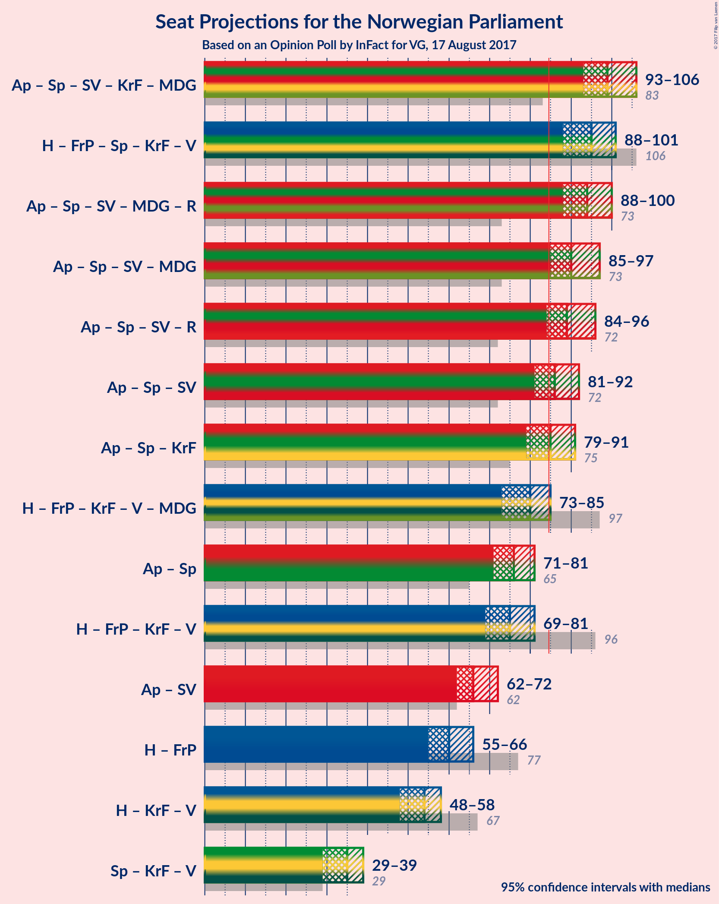

# Opinion Poll by InFact for VG, 17 August 2017

<a href="#voting-intentions">Voting Intentions</a> | <a href="#seats">Seats</a> | <a href="#coalitions">Coalitions</a> | <a href="#technical-information">Technical Information</a>

## Voting Intentions

### Confidence Intervals

| Party | Last Result | Poll Result | 80% Confidence Interval | 90% Confidence Interval | 95% Confidence Interval | 99% Confidence Interval |
|:-----:|:-----------:|:-----------:|:-----------------------:|:-----------------------:|:-----------------------:|:-----------------------:|
| Arbeiderpartiet | 30.8% | 30.4% | 29.2–31.8% |28.8–32.2% |28.5–32.5% |27.9–33.1% |
| Høyre | 26.8% | 21.9% | 20.7–23.1% |20.4–23.4% |20.1–23.7% |19.6–24.3% |
| Fremskrittspartiet | 16.3% | 12.1% | 11.2–13.0% |10.9–13.3% |10.7–13.6% |10.3–14.1% |
| Senterpartiet | 5.5% | 10.9% | 10.0–11.8% |9.8–12.1% |9.6–12.3% |9.2–12.8% |
| Sosialistisk Venstreparti | 4.1% | 5.6% | 5.0–6.3% |4.8–6.5% |4.6–6.7% |4.4–7.0% |
| Kristelig Folkeparti | 5.6% | 5.1% | 4.5–5.8% |4.3–6.0% |4.2–6.1% |3.9–6.5% |
| Venstre | 5.2% | 4.1% | 3.6–4.7% |3.4–4.9% |3.3–5.0% |3.1–5.4% |
| Miljøpartiet de Grønne | 2.8% | 3.9% | 3.4–4.5% |3.2–4.7% |3.1–4.8% |2.9–5.1% |
| Rødt | 1.1% | 3.7% | 3.2–4.3% |3.1–4.5% |3.0–4.6% |2.7–4.9% |

*Note:* The poll result column reflects the actual value used in the calculations. Published results may vary slightly, and in addition be rounded to fewer digits.

## Seats

### Confidence Intervals

| Party | Last Result | Median | 80% Confidence Interval | 90% Confidence Interval | 95% Confidence Interval | 99% Confidence Interval |
|:-----:|:-----------:|:------:|:-----------------------:|:-----------------------:|:-----------------------:|:-----------------------:|
| <a href="#arbeiderpartiet">Arbeiderpartiet</a> | 55 | 57 | 53–57 |53–60 |53–61 |51–63 |
| <a href="#høyre">Høyre</a> | 48 | 39 | 37–42 |36–43 |36–43 |35–43 |
| <a href="#fremskrittspartiet">Fremskrittspartiet</a> | 29 | 21 | 19–24 |18–24 |18–26 |18–27 |
| <a href="#senterpartiet">Senterpartiet</a> | 10 | 20 | 18–21 |17–22 |17–22 |16–23 |
| <a href="#sosialistisk-venstreparti">Sosialistisk Venstreparti</a> | 7 | 10 | 8–11 |8–11 |8–11 |7–12 |
| <a href="#kristelig-folkeparti">Kristelig Folkeparti</a> | 10 | 10 | 7–10 |7–10 |7–11 |7–11 |
| <a href="#venstre">Venstre</a> | 9 | 8 | 3–8 |3–8 |2–9 |2–9 |
| <a href="#miljøpartiet-de-grønne">Miljøpartiet de Grønne</a> | 1 | 3 | 1–8 |1–9 |1–9 |1–9 |
| <a href="#rødt">Rødt</a> | 0 | 2 | 2–7 |2–7 |2–8 |2–8 |

### Arbeiderpartiet

| Number of Seats | Probability | Accumulated | Special Marks |
|:---------------:|:-----------:|:-----------:|:-------------:|
| 49 | 0.1% | 100% |  |
| 50 | 0.2% | 99.9% |  |
| 51 | 0.7% | 99.6% |  |
| 52 | 1.3% | 98.9% |  |
| 53 | 19% | 98% |  |
| 54 | 4% | 78% |  |
| 55 | 15% | 75% | Last Result |
| 56 | 6% | 60% |  |
| 57 | 45% | 54% | Median |
| 58 | 3% | 10% |  |
| 59 | 2% | 7% |  |
| 60 | 0.9% | 5% |  |
| 61 | 3% | 4% |  |
| 62 | 0.2% | 0.9% |  |
| 63 | 0.5% | 0.6% |  |
| 64 | 0.1% | 0.2% |  |
| 65 | 0% | 0% |  |

### Høyre

| Number of Seats | Probability | Accumulated | Special Marks |
|:---------------:|:-----------:|:-----------:|:-------------:|
| 33 | 0.1% | 100% |  |
| 34 | 0.1% | 99.9% |  |
| 35 | 2% | 99.8% |  |
| 36 | 6% | 98% |  |
| 37 | 15% | 92% |  |
| 38 | 1.3% | 78% |  |
| 39 | 53% | 76% | Median |
| 40 | 8% | 23% |  |
| 41 | 4% | 15% |  |
| 42 | 4% | 10% |  |
| 43 | 7% | 7% |  |
| 44 | 0% | 0.1% |  |
| 45 | 0% | 0% |  |
| 46 | 0% | 0% |  |
| 47 | 0% | 0% |  |
| 48 | 0% | 0% | Last Result |

### Fremskrittspartiet

| Number of Seats | Probability | Accumulated | Special Marks |
|:---------------:|:-----------:|:-----------:|:-------------:|
| 16 | 0.1% | 100% |  |
| 17 | 0.2% | 99.9% |  |
| 18 | 9% | 99.7% |  |
| 19 | 5% | 91% |  |
| 20 | 6% | 86% |  |
| 21 | 41% | 80% | Median |
| 22 | 10% | 39% |  |
| 23 | 11% | 29% |  |
| 24 | 15% | 19% |  |
| 25 | 0.9% | 4% |  |
| 26 | 0.6% | 3% |  |
| 27 | 2% | 2% |  |
| 28 | 0.1% | 0.1% |  |
| 29 | 0% | 0% | Last Result |

### Senterpartiet

| Number of Seats | Probability | Accumulated | Special Marks |
|:---------------:|:-----------:|:-----------:|:-------------:|
| 10 | 0% | 100% | Last Result |
| 11 | 0% | 100% |  |
| 12 | 0% | 100% |  |
| 13 | 0% | 100% |  |
| 14 | 0% | 100% |  |
| 15 | 0.3% | 100% |  |
| 16 | 1.3% | 99.6% |  |
| 17 | 6% | 98% |  |
| 18 | 24% | 92% |  |
| 19 | 18% | 69% |  |
| 20 | 38% | 50% | Median |
| 21 | 5% | 12% |  |
| 22 | 5% | 7% |  |
| 23 | 2% | 2% |  |
| 24 | 0.3% | 0.3% |  |
| 25 | 0% | 0% |  |

### Sosialistisk Venstreparti

| Number of Seats | Probability | Accumulated | Special Marks |
|:---------------:|:-----------:|:-----------:|:-------------:|
| 2 | 0.1% | 100% |  |
| 3 | 0% | 99.9% |  |
| 4 | 0% | 99.9% |  |
| 5 | 0% | 99.9% |  |
| 6 | 0% | 99.9% |  |
| 7 | 0.9% | 99.9% | Last Result |
| 8 | 20% | 99.0% |  |
| 9 | 23% | 79% |  |
| 10 | 21% | 56% | Median |
| 11 | 34% | 35% |  |
| 12 | 0.7% | 1.0% |  |
| 13 | 0.3% | 0.3% |  |
| 14 | 0% | 0% |  |

### Kristelig Folkeparti

| Number of Seats | Probability | Accumulated | Special Marks |
|:---------------:|:-----------:|:-----------:|:-------------:|
| 2 | 0.2% | 100% |  |
| 3 | 0% | 99.8% |  |
| 4 | 0% | 99.8% |  |
| 5 | 0% | 99.8% |  |
| 6 | 0% | 99.8% |  |
| 7 | 11% | 99.8% |  |
| 8 | 23% | 89% |  |
| 9 | 16% | 66% |  |
| 10 | 48% | 51% | Last Result, Median |
| 11 | 2% | 3% |  |
| 12 | 0.2% | 0.2% |  |
| 13 | 0% | 0% |  |

### Venstre

| Number of Seats | Probability | Accumulated | Special Marks |
|:---------------:|:-----------:|:-----------:|:-------------:|
| 1 | 0.3% | 100% |  |
| 2 | 3% | 99.7% |  |
| 3 | 15% | 97% |  |
| 4 | 0% | 82% |  |
| 5 | 0% | 82% |  |
| 6 | 0% | 82% |  |
| 7 | 19% | 82% |  |
| 8 | 61% | 64% | Median |
| 9 | 3% | 3% | Last Result |
| 10 | 0% | 0% |  |

### Miljøpartiet de Grønne

| Number of Seats | Probability | Accumulated | Special Marks |
|:---------------:|:-----------:|:-----------:|:-------------:|
| 1 | 38% | 100% | Last Result |
| 2 | 2% | 62% |  |
| 3 | 18% | 60% | Median |
| 4 | 0.2% | 42% |  |
| 5 | 0% | 42% |  |
| 6 | 0.8% | 42% |  |
| 7 | 26% | 41% |  |
| 8 | 5% | 15% |  |
| 9 | 10% | 10% |  |
| 10 | 0% | 0% |  |

### Rødt

| Number of Seats | Probability | Accumulated | Special Marks |
|:---------------:|:-----------:|:-----------:|:-------------:|
| 0 | 0% | 100% | Last Result |
| 1 | 0.1% | 100% |  |
| 2 | 71% | 99.9% | Median |
| 3 | 0% | 28% |  |
| 4 | 0% | 28% |  |
| 5 | 0% | 28% |  |
| 6 | 2% | 28% |  |
| 7 | 21% | 26% |  |
| 8 | 4% | 5% |  |
| 9 | 0.4% | 0.4% |  |
| 10 | 0% | 0% |  |

## Coalitions

### Confidence Intervals

| Coalition | Last Result | Median | Majority? | 80% Confidence Interval | 90% Confidence Interval | 95% Confidence Interval | 99% Confidence Interval |
|:---------:|:-----------:|:------:|:---------:|:-----------------------:|:-----------------------:|:-----------------------:|:-----------------------:|
| Arbeiderpartiet – Senterpartiet – Sosialistisk Venstreparti – Kristelig Folkeparti – Miljøpartiet de Grønne | 83 | 99 | 100% | 95–101 | 93–101 | 93–102 | 92–104 |
| Høyre – Fremskrittspartiet – Senterpartiet – Kristelig Folkeparti – Venstre | 106 | 97 | 99.9% | 90–101 | 90–102 | 90–102 | 86–102 |
| Arbeiderpartiet – Senterpartiet – Sosialistisk Venstreparti – Miljøpartiet de Grønne – Rødt | 73 | 92 | 100% | 88–97 | 87–97 | 87–97 | 85–101 |
| Arbeiderpartiet – Senterpartiet – Sosialistisk Venstreparti – Rødt | 72 | 90 | 80% | 84–91 | 84–93 | 84–94 | 81–95 |
| Arbeiderpartiet – Senterpartiet – Sosialistisk Venstreparti – Miljøpartiet de Grønne | 73 | 89 | 97% | 85–91 | 85–92 | 84–93 | 83–96 |
| Arbeiderpartiet – Senterpartiet – Sosialistisk Venstreparti | 72 | 84 | 47% | 82–88 | 81–89 | 80–91 | 79–92 |
| Arbeiderpartiet – Senterpartiet – Kristelig Folkeparti | 75 | 84 | 45% | 81–87 | 81–88 | 80–90 | 78–90 |
| Høyre – Fremskrittspartiet – Kristelig Folkeparti – Venstre – Miljøpartiet de Grønne | 97 | 79 | 20% | 78–85 | 76–85 | 75–85 | 74–88 |
| Høyre – Fremskrittspartiet – Kristelig Folkeparti – Venstre | 96 | 77 | 0% | 72–81 | 72–82 | 72–82 | 68–84 |
| Arbeiderpartiet – Senterpartiet | 65 | 75 | 0% | 72–78 | 72–79 | 71–81 | 69–82 |
| Arbeiderpartiet – Sosialistisk Venstreparti | 62 | 65 | 0% | 62–68 | 62–70 | 61–70 | 60–72 |
| Høyre – Fremskrittspartiet | 77 | 60 | 0% | 57–66 | 57–66 | 56–66 | 54–67 |
| Høyre – Kristelig Folkeparti – Venstre | 67 | 55 | 0% | 51–59 | 51–59 | 50–59 | 49–60 |
| Senterpartiet – Kristelig Folkeparti – Venstre | 29 | 36 | 0% | 32–38 | 32–38 | 32–39 | 28–41 |

### Arbeiderpartiet – Senterpartiet – Sosialistisk Venstreparti – Kristelig Folkeparti – Miljøpartiet de Grønne

| Number of Seats | Probability | Accumulated | Special Marks |
|:---------------:|:-----------:|:-----------:|:-------------:|
| 83 | 0% | 100% | Last Result |
| 84 | 0% | 100% |  |
| 85 | 0% | 100% | Majority |
| 86 | 0% | 100% |  |
| 87 | 0% | 100% |  |
| 88 | 0% | 100% |  |
| 89 | 0% | 100% |  |
| 90 | 0.2% | 100% |  |
| 91 | 0.1% | 99.7% |  |
| 92 | 0.9% | 99.7% |  |
| 93 | 8% | 98.8% |  |
| 94 | 0.4% | 91% |  |
| 95 | 5% | 90% |  |
| 96 | 3% | 85% |  |
| 97 | 24% | 83% |  |
| 98 | 5% | 59% |  |
| 99 | 29% | 54% |  |
| 100 | 8% | 26% | Median |
| 101 | 13% | 17% |  |
| 102 | 1.5% | 4% |  |
| 103 | 0.7% | 2% |  |
| 104 | 1.4% | 2% |  |
| 105 | 0.1% | 0.2% |  |
| 106 | 0.1% | 0.2% |  |
| 107 | 0% | 0.1% |  |
| 108 | 0% | 0.1% |  |
| 109 | 0% | 0% |  |

### Høyre – Fremskrittspartiet – Senterpartiet – Kristelig Folkeparti – Venstre

| Number of Seats | Probability | Accumulated | Special Marks |
|:---------------:|:-----------:|:-----------:|:-------------:|
| 84 | 0.1% | 100% |  |
| 85 | 0% | 99.9% | Majority |
| 86 | 0.4% | 99.9% |  |
| 87 | 0.1% | 99.5% |  |
| 88 | 0.4% | 99.3% |  |
| 89 | 0.2% | 99.0% |  |
| 90 | 12% | 98.8% |  |
| 91 | 8% | 87% |  |
| 92 | 3% | 79% |  |
| 93 | 3% | 76% |  |
| 94 | 5% | 73% |  |
| 95 | 14% | 67% |  |
| 96 | 3% | 54% |  |
| 97 | 3% | 50% |  |
| 98 | 29% | 47% | Median |
| 99 | 4% | 18% |  |
| 100 | 3% | 14% |  |
| 101 | 2% | 11% |  |
| 102 | 8% | 8% |  |
| 103 | 0.2% | 0.4% |  |
| 104 | 0% | 0.2% |  |
| 105 | 0% | 0.2% |  |
| 106 | 0.2% | 0.2% | Last Result |
| 107 | 0% | 0% |  |

### Arbeiderpartiet – Senterpartiet – Sosialistisk Venstreparti – Miljøpartiet de Grønne – Rødt

| Number of Seats | Probability | Accumulated | Special Marks |
|:---------------:|:-----------:|:-----------:|:-------------:|
| 73 | 0% | 100% | Last Result |
| 74 | 0% | 100% |  |
| 75 | 0% | 100% |  |
| 76 | 0% | 100% |  |
| 77 | 0% | 100% |  |
| 78 | 0% | 100% |  |
| 79 | 0% | 100% |  |
| 80 | 0% | 100% |  |
| 81 | 0% | 100% |  |
| 82 | 0% | 100% |  |
| 83 | 0% | 100% |  |
| 84 | 0% | 100% |  |
| 85 | 0.8% | 100% | Majority |
| 86 | 0.2% | 99.2% |  |
| 87 | 6% | 99.0% |  |
| 88 | 3% | 93% |  |
| 89 | 6% | 90% |  |
| 90 | 0.9% | 83% |  |
| 91 | 29% | 82% |  |
| 92 | 5% | 53% | Median |
| 93 | 14% | 48% |  |
| 94 | 10% | 35% |  |
| 95 | 1.3% | 25% |  |
| 96 | 10% | 23% |  |
| 97 | 11% | 14% |  |
| 98 | 1.3% | 2% |  |
| 99 | 0.2% | 1.1% |  |
| 100 | 0.3% | 0.9% |  |
| 101 | 0.4% | 0.6% |  |
| 102 | 0.1% | 0.2% |  |
| 103 | 0% | 0.1% |  |
| 104 | 0% | 0.1% |  |
| 105 | 0% | 0.1% |  |
| 106 | 0.1% | 0.1% |  |
| 107 | 0% | 0% |  |

### Arbeiderpartiet – Senterpartiet – Sosialistisk Venstreparti – Rødt

| Number of Seats | Probability | Accumulated | Special Marks |
|:---------------:|:-----------:|:-----------:|:-------------:|
| 72 | 0% | 100% | Last Result |
| 73 | 0% | 100% |  |
| 74 | 0% | 100% |  |
| 75 | 0% | 100% |  |
| 76 | 0% | 100% |  |
| 77 | 0% | 100% |  |
| 78 | 0% | 100% |  |
| 79 | 0% | 100% |  |
| 80 | 0.2% | 100% |  |
| 81 | 0.6% | 99.8% |  |
| 82 | 1.1% | 99.2% |  |
| 83 | 0.3% | 98% |  |
| 84 | 18% | 98% |  |
| 85 | 3% | 80% | Majority |
| 86 | 5% | 77% |  |
| 87 | 5% | 72% |  |
| 88 | 5% | 67% |  |
| 89 | 10% | 62% | Median |
| 90 | 40% | 52% |  |
| 91 | 5% | 13% |  |
| 92 | 2% | 8% |  |
| 93 | 3% | 6% |  |
| 94 | 1.3% | 3% |  |
| 95 | 1.1% | 1.4% |  |
| 96 | 0.1% | 0.3% |  |
| 97 | 0.1% | 0.2% |  |
| 98 | 0% | 0.1% |  |
| 99 | 0.1% | 0.1% |  |
| 100 | 0% | 0% |  |

### Arbeiderpartiet – Senterpartiet – Sosialistisk Venstreparti – Miljøpartiet de Grønne

| Number of Seats | Probability | Accumulated | Special Marks |
|:---------------:|:-----------:|:-----------:|:-------------:|
| 73 | 0% | 100% | Last Result |
| 74 | 0% | 100% |  |
| 75 | 0% | 100% |  |
| 76 | 0% | 100% |  |
| 77 | 0% | 100% |  |
| 78 | 0% | 100% |  |
| 79 | 0% | 100% |  |
| 80 | 0% | 100% |  |
| 81 | 0% | 100% |  |
| 82 | 0.3% | 100% |  |
| 83 | 1.2% | 99.7% |  |
| 84 | 1.0% | 98.5% |  |
| 85 | 8% | 97% | Majority |
| 86 | 4% | 90% |  |
| 87 | 7% | 86% |  |
| 88 | 4% | 79% |  |
| 89 | 37% | 74% |  |
| 90 | 14% | 37% | Median |
| 91 | 13% | 23% |  |
| 92 | 7% | 10% |  |
| 93 | 0.7% | 3% |  |
| 94 | 0.1% | 2% |  |
| 95 | 1.2% | 2% |  |
| 96 | 0.9% | 1.1% |  |
| 97 | 0% | 0.2% |  |
| 98 | 0.1% | 0.2% |  |
| 99 | 0.1% | 0.1% |  |
| 100 | 0% | 0.1% |  |
| 101 | 0% | 0% |  |

### Arbeiderpartiet – Senterpartiet – Sosialistisk Venstreparti

| Number of Seats | Probability | Accumulated | Special Marks |
|:---------------:|:-----------:|:-----------:|:-------------:|
| 72 | 0% | 100% | Last Result |
| 73 | 0% | 100% |  |
| 74 | 0% | 100% |  |
| 75 | 0% | 100% |  |
| 76 | 0% | 100% |  |
| 77 | 0% | 100% |  |
| 78 | 0.2% | 99.9% |  |
| 79 | 0.7% | 99.7% |  |
| 80 | 2% | 99.0% |  |
| 81 | 3% | 97% |  |
| 82 | 27% | 93% |  |
| 83 | 14% | 66% |  |
| 84 | 6% | 52% |  |
| 85 | 3% | 47% | Majority |
| 86 | 5% | 44% |  |
| 87 | 3% | 39% | Median |
| 88 | 29% | 37% |  |
| 89 | 4% | 8% |  |
| 90 | 2% | 4% |  |
| 91 | 2% | 3% |  |
| 92 | 0.5% | 0.6% |  |
| 93 | 0% | 0.1% |  |
| 94 | 0% | 0% |  |

### Arbeiderpartiet – Senterpartiet – Kristelig Folkeparti

| Number of Seats | Probability | Accumulated | Special Marks |
|:---------------:|:-----------:|:-----------:|:-------------:|
| 75 | 0% | 100% | Last Result |
| 76 | 0% | 100% |  |
| 77 | 0.2% | 100% |  |
| 78 | 0.3% | 99.8% |  |
| 79 | 1.3% | 99.5% |  |
| 80 | 1.4% | 98% |  |
| 81 | 16% | 97% |  |
| 82 | 23% | 81% |  |
| 83 | 6% | 57% |  |
| 84 | 7% | 52% |  |
| 85 | 1.5% | 45% | Majority |
| 86 | 1.4% | 43% |  |
| 87 | 35% | 42% | Median |
| 88 | 3% | 7% |  |
| 89 | 2% | 4% |  |
| 90 | 3% | 3% |  |
| 91 | 0.1% | 0.4% |  |
| 92 | 0.3% | 0.3% |  |
| 93 | 0% | 0% |  |

### Høyre – Fremskrittspartiet – Kristelig Folkeparti – Venstre – Miljøpartiet de Grønne

| Number of Seats | Probability | Accumulated | Special Marks |
|:---------------:|:-----------:|:-----------:|:-------------:|
| 70 | 0.1% | 100% |  |
| 71 | 0% | 99.9% |  |
| 72 | 0.1% | 99.9% |  |
| 73 | 0.1% | 99.8% |  |
| 74 | 1.1% | 99.7% |  |
| 75 | 1.3% | 98.6% |  |
| 76 | 3% | 97% |  |
| 77 | 2% | 94% |  |
| 78 | 5% | 92% |  |
| 79 | 40% | 87% |  |
| 80 | 10% | 47% |  |
| 81 | 5% | 38% | Median |
| 82 | 5% | 33% |  |
| 83 | 5% | 28% |  |
| 84 | 3% | 23% |  |
| 85 | 18% | 20% | Majority |
| 86 | 0.3% | 2% |  |
| 87 | 1.1% | 2% |  |
| 88 | 0.6% | 0.8% |  |
| 89 | 0.2% | 0.2% |  |
| 90 | 0% | 0% |  |
| 91 | 0% | 0% |  |
| 92 | 0% | 0% |  |
| 93 | 0% | 0% |  |
| 94 | 0% | 0% |  |
| 95 | 0% | 0% |  |
| 96 | 0% | 0% |  |
| 97 | 0% | 0% | Last Result |

### Høyre – Fremskrittspartiet – Kristelig Folkeparti – Venstre

| Number of Seats | Probability | Accumulated | Special Marks |
|:---------------:|:-----------:|:-----------:|:-------------:|
| 63 | 0.1% | 100% |  |
| 64 | 0% | 99.9% |  |
| 65 | 0% | 99.9% |  |
| 66 | 0% | 99.9% |  |
| 67 | 0.1% | 99.9% |  |
| 68 | 0.4% | 99.8% |  |
| 69 | 0.3% | 99.4% |  |
| 70 | 0.2% | 99.1% |  |
| 71 | 1.3% | 98.9% |  |
| 72 | 11% | 98% |  |
| 73 | 10% | 86% |  |
| 74 | 1.3% | 77% |  |
| 75 | 10% | 75% |  |
| 76 | 14% | 65% |  |
| 77 | 5% | 52% |  |
| 78 | 29% | 47% | Median |
| 79 | 0.9% | 18% |  |
| 80 | 6% | 17% |  |
| 81 | 3% | 10% |  |
| 82 | 6% | 7% |  |
| 83 | 0.2% | 1.0% |  |
| 84 | 0.8% | 0.8% |  |
| 85 | 0% | 0% | Majority |
| 86 | 0% | 0% |  |
| 87 | 0% | 0% |  |
| 88 | 0% | 0% |  |
| 89 | 0% | 0% |  |
| 90 | 0% | 0% |  |
| 91 | 0% | 0% |  |
| 92 | 0% | 0% |  |
| 93 | 0% | 0% |  |
| 94 | 0% | 0% |  |
| 95 | 0% | 0% |  |
| 96 | 0% | 0% | Last Result |

### Arbeiderpartiet – Senterpartiet

| Number of Seats | Probability | Accumulated | Special Marks |
|:---------------:|:-----------:|:-----------:|:-------------:|
| 65 | 0% | 100% | Last Result |
| 66 | 0% | 100% |  |
| 67 | 0% | 100% |  |
| 68 | 0.2% | 100% |  |
| 69 | 0.6% | 99.8% |  |
| 70 | 0.7% | 99.3% |  |
| 71 | 3% | 98.6% |  |
| 72 | 11% | 96% |  |
| 73 | 19% | 85% |  |
| 74 | 6% | 66% |  |
| 75 | 15% | 60% |  |
| 76 | 3% | 45% |  |
| 77 | 32% | 43% | Median |
| 78 | 3% | 11% |  |
| 79 | 4% | 8% |  |
| 80 | 2% | 5% |  |
| 81 | 0.4% | 3% |  |
| 82 | 2% | 2% |  |
| 83 | 0.3% | 0.3% |  |
| 84 | 0% | 0% |  |

### Arbeiderpartiet – Sosialistisk Venstreparti

| Number of Seats | Probability | Accumulated | Special Marks |
|:---------------:|:-----------:|:-----------:|:-------------:|
| 58 | 0% | 100% |  |
| 59 | 0.4% | 99.9% |  |
| 60 | 1.0% | 99.6% |  |
| 61 | 1.5% | 98.6% |  |
| 62 | 7% | 97% | Last Result |
| 63 | 13% | 90% |  |
| 64 | 14% | 77% |  |
| 65 | 18% | 63% |  |
| 66 | 3% | 45% |  |
| 67 | 5% | 42% | Median |
| 68 | 31% | 37% |  |
| 69 | 0.7% | 6% |  |
| 70 | 4% | 5% |  |
| 71 | 0.2% | 0.9% |  |
| 72 | 0.6% | 0.8% |  |
| 73 | 0.1% | 0.2% |  |
| 74 | 0.1% | 0.2% |  |
| 75 | 0% | 0% |  |

### Høyre – Fremskrittspartiet

| Number of Seats | Probability | Accumulated | Special Marks |
|:---------------:|:-----------:|:-----------:|:-------------:|
| 52 | 0.1% | 100% |  |
| 53 | 0.4% | 99.9% |  |
| 54 | 0.4% | 99.5% |  |
| 55 | 0.9% | 99.2% |  |
| 56 | 2% | 98% |  |
| 57 | 10% | 96% |  |
| 58 | 14% | 86% |  |
| 59 | 6% | 72% |  |
| 60 | 31% | 66% | Median |
| 61 | 4% | 35% |  |
| 62 | 2% | 31% |  |
| 63 | 13% | 29% |  |
| 64 | 5% | 16% |  |
| 65 | 0.3% | 10% |  |
| 66 | 8% | 10% |  |
| 67 | 2% | 2% |  |
| 68 | 0% | 0.1% |  |
| 69 | 0% | 0.1% |  |
| 70 | 0% | 0% |  |
| 71 | 0% | 0% |  |
| 72 | 0% | 0% |  |
| 73 | 0% | 0% |  |
| 74 | 0% | 0% |  |
| 75 | 0% | 0% |  |
| 76 | 0% | 0% |  |
| 77 | 0% | 0% | Last Result |

### Høyre – Kristelig Folkeparti – Venstre

| Number of Seats | Probability | Accumulated | Special Marks |
|:---------------:|:-----------:|:-----------:|:-------------:|
| 42 | 0.1% | 100% |  |
| 43 | 0% | 99.9% |  |
| 44 | 0% | 99.9% |  |
| 45 | 0% | 99.9% |  |
| 46 | 0.1% | 99.9% |  |
| 47 | 0.1% | 99.8% |  |
| 48 | 0.2% | 99.7% |  |
| 49 | 0.8% | 99.5% |  |
| 50 | 1.4% | 98.7% |  |
| 51 | 13% | 97% |  |
| 52 | 12% | 84% |  |
| 53 | 6% | 72% |  |
| 54 | 5% | 66% |  |
| 55 | 13% | 62% |  |
| 56 | 4% | 49% |  |
| 57 | 30% | 45% | Median |
| 58 | 5% | 15% |  |
| 59 | 9% | 10% |  |
| 60 | 0.7% | 0.9% |  |
| 61 | 0.2% | 0.2% |  |
| 62 | 0% | 0% |  |
| 63 | 0% | 0% |  |
| 64 | 0% | 0% |  |
| 65 | 0% | 0% |  |
| 66 | 0% | 0% |  |
| 67 | 0% | 0% | Last Result |

### Senterpartiet – Kristelig Folkeparti – Venstre

| Number of Seats | Probability | Accumulated | Special Marks |
|:---------------:|:-----------:|:-----------:|:-------------:|
| 25 | 0.1% | 100% |  |
| 26 | 0% | 99.9% |  |
| 27 | 0.1% | 99.9% |  |
| 28 | 0.4% | 99.8% |  |
| 29 | 0.2% | 99.4% | Last Result |
| 30 | 0.2% | 99.2% |  |
| 31 | 1.1% | 99.0% |  |
| 32 | 22% | 98% |  |
| 33 | 6% | 76% |  |
| 34 | 13% | 69% |  |
| 35 | 3% | 56% |  |
| 36 | 15% | 53% |  |
| 37 | 2% | 38% |  |
| 38 | 32% | 36% | Median |
| 39 | 2% | 4% |  |
| 40 | 0.4% | 2% |  |
| 41 | 2% | 2% |  |
| 42 | 0% | 0% |  |

## Technical Information

### Opinion Poll

+ **Pollster:** InFact
+ **Media:** VG
+ **Fieldwork period:** 17 August 2017

### Calculations

+ **Sample size:** 2030
+ **Simulations done:** 131,072
+ **Error estimate:** 1.51%

