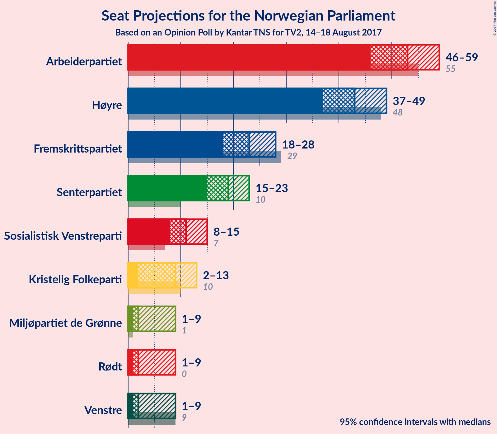

# Opinion Poll by Kantar TNS for TV2, 14–18 August 2017

<a href="#voting-intentions">Voting Intentions</a> | <a href="#seats">Seats</a> | <a href="#coalitions">Coalitions</a> | <a href="#technical-information">Technical Information</a>

## Voting Intentions

### Confidence Intervals

| Party | Last Result | Poll Result | 80% Confidence Interval | 90% Confidence Interval | 95% Confidence Interval | 99% Confidence Interval |
|:-----:|:-----------:|:-----------:|:-----------------------:|:-----------------------:|:-----------------------:|:-----------------------:|
| Arbeiderpartiet | 30.8% | 28.5% | 26.4–30.7% |25.8–31.3% |25.3–31.8% |24.4–32.9% |
| Høyre | 26.8% | 23.8% | 21.9–26.0% |21.4–26.6% |20.9–27.1% |20.0–28.1% |
| Fremskrittspartiet | 16.3% | 12.7% | 11.3–14.4% |10.9–14.9% |10.5–15.3% |9.9–16.2% |
| Senterpartiet | 5.5% | 10.4% | 9.1–12.0% |8.7–12.5% |8.4–12.9% |7.8–13.7% |
| Sosialistisk Venstreparti | 4.1% | 6.4% | 5.3–7.7% |5.1–8.0% |4.8–8.4% |4.4–9.0% |
| Kristelig Folkeparti | 5.6% | 5.3% | 4.4–6.5% |4.1–6.8% |3.9–7.1% |3.5–7.8% |
| Rødt | 1.1% | 3.8% | 3.0–4.9% |2.8–5.2% |2.6–5.4% |2.3–6.0% |
| Venstre | 5.2% | 3.5% | 2.8–4.6% |2.6–4.9% |2.4–5.1% |2.1–5.7% |
| Miljøpartiet de Grønne | 2.8% | 3.4% | 2.7–4.4% |2.5–4.7% |2.3–5.0% |2.0–5.5% |

*Note:* The poll result column reflects the actual value used in the calculations. Published results may vary slightly, and in addition be rounded to fewer digits.

## Seats

### Confidence Intervals

| Party | Last Result | Median | 80% Confidence Interval | 90% Confidence Interval | 95% Confidence Interval | 99% Confidence Interval |
|:-----:|:-----------:|:------:|:-----------------------:|:-----------------------:|:-----------------------:|:-----------------------:|
| <a href="#arbeiderpartiet">Arbeiderpartiet</a> | 55 | 53 | 49–57 |47–58 |46–59 |45–61 |
| <a href="#høyre">Høyre</a> | 48 | 43 | 39–47 |38–48 |37–49 |35–52 |
| <a href="#fremskrittspartiet">Fremskrittspartiet</a> | 29 | 23 | 20–27 |19–27 |18–28 |17–29 |
| <a href="#senterpartiet">Senterpartiet</a> | 10 | 19 | 16–22 |15–23 |15–23 |13–25 |
| <a href="#sosialistisk-venstreparti">Sosialistisk Venstreparti</a> | 7 | 11 | 10–14 |9–14 |8–15 |8–16 |
| <a href="#kristelig-folkeparti">Kristelig Folkeparti</a> | 10 | 9 | 8–11 |7–12 |2–13 |2–14 |
| <a href="#rødt">Rødt</a> | 0 | 2 | 2–8 |2–9 |1–9 |1–10 |
| <a href="#venstre">Venstre</a> | 9 | 2 | 1–8 |1–8 |1–9 |0–10 |
| <a href="#miljøpartiet-de-grønne">Miljøpartiet de Grønne</a> | 1 | 2 | 1–8 |1–8 |1–9 |1–9 |

### Arbeiderpartiet

| Number of Seats | Probability | Accumulated | Special Marks |
|:---------------:|:-----------:|:-----------:|:-------------:|
| 43 | 0.2% | 100% |  |
| 44 | 0.3% | 99.8% |  |
| 45 | 0.5% | 99.5% |  |
| 46 | 3% | 99.1% |  |
| 47 | 2% | 96% |  |
| 48 | 3% | 94% |  |
| 49 | 6% | 90% |  |
| 50 | 8% | 85% |  |
| 51 | 12% | 77% |  |
| 52 | 6% | 64% |  |
| 53 | 26% | 58% | Median |
| 54 | 13% | 32% |  |
| 55 | 3% | 19% | Last Result |
| 56 | 4% | 16% |  |
| 57 | 5% | 11% |  |
| 58 | 3% | 6% |  |
| 59 | 1.4% | 4% |  |
| 60 | 1.1% | 2% |  |
| 61 | 0.8% | 1.3% |  |
| 62 | 0.1% | 0.5% |  |
| 63 | 0.2% | 0.3% |  |
| 64 | 0% | 0.1% |  |
| 65 | 0% | 0.1% |  |
| 66 | 0% | 0% |  |

### Høyre

| Number of Seats | Probability | Accumulated | Special Marks |
|:---------------:|:-----------:|:-----------:|:-------------:|
| 34 | 0.2% | 100% |  |
| 35 | 0.4% | 99.8% |  |
| 36 | 0.8% | 99.3% |  |
| 37 | 3% | 98.6% |  |
| 38 | 4% | 96% |  |
| 39 | 5% | 92% |  |
| 40 | 11% | 87% |  |
| 41 | 15% | 76% |  |
| 42 | 11% | 61% |  |
| 43 | 9% | 50% | Median |
| 44 | 15% | 41% |  |
| 45 | 6% | 26% |  |
| 46 | 9% | 21% |  |
| 47 | 4% | 11% |  |
| 48 | 3% | 8% | Last Result |
| 49 | 2% | 4% |  |
| 50 | 1.3% | 2% |  |
| 51 | 0.4% | 1.2% |  |
| 52 | 0.6% | 0.8% |  |
| 53 | 0.1% | 0.2% |  |
| 54 | 0% | 0.1% |  |
| 55 | 0% | 0.1% |  |
| 56 | 0% | 0% |  |

### Fremskrittspartiet

| Number of Seats | Probability | Accumulated | Special Marks |
|:---------------:|:-----------:|:-----------:|:-------------:|
| 15 | 0.1% | 100% |  |
| 16 | 0.1% | 99.9% |  |
| 17 | 0.6% | 99.7% |  |
| 18 | 2% | 99.2% |  |
| 19 | 4% | 97% |  |
| 20 | 11% | 93% |  |
| 21 | 10% | 83% |  |
| 22 | 19% | 73% |  |
| 23 | 12% | 54% | Median |
| 24 | 13% | 42% |  |
| 25 | 5% | 28% |  |
| 26 | 12% | 24% |  |
| 27 | 7% | 12% |  |
| 28 | 4% | 5% |  |
| 29 | 0.6% | 1.0% | Last Result |
| 30 | 0.2% | 0.4% |  |
| 31 | 0.1% | 0.1% |  |
| 32 | 0% | 0.1% |  |
| 33 | 0% | 0% |  |

### Senterpartiet

| Number of Seats | Probability | Accumulated | Special Marks |
|:---------------:|:-----------:|:-----------:|:-------------:|
| 10 | 0% | 100% | Last Result |
| 11 | 0% | 100% |  |
| 12 | 0.1% | 100% |  |
| 13 | 0.4% | 99.9% |  |
| 14 | 2% | 99.4% |  |
| 15 | 3% | 98% |  |
| 16 | 5% | 94% |  |
| 17 | 13% | 89% |  |
| 18 | 22% | 77% |  |
| 19 | 16% | 55% | Median |
| 20 | 19% | 39% |  |
| 21 | 9% | 20% |  |
| 22 | 5% | 11% |  |
| 23 | 5% | 6% |  |
| 24 | 0.8% | 1.3% |  |
| 25 | 0.3% | 0.5% |  |
| 26 | 0.1% | 0.2% |  |
| 27 | 0% | 0.1% |  |
| 28 | 0% | 0% |  |

### Sosialistisk Venstreparti

| Number of Seats | Probability | Accumulated | Special Marks |
|:---------------:|:-----------:|:-----------:|:-------------:|
| 2 | 0.1% | 100% |  |
| 3 | 0% | 99.9% |  |
| 4 | 0% | 99.9% |  |
| 5 | 0% | 99.9% |  |
| 6 | 0% | 99.9% |  |
| 7 | 0.3% | 99.9% | Last Result |
| 8 | 3% | 99.6% |  |
| 9 | 6% | 97% |  |
| 10 | 15% | 91% |  |
| 11 | 28% | 76% | Median |
| 12 | 24% | 48% |  |
| 13 | 10% | 24% |  |
| 14 | 9% | 13% |  |
| 15 | 3% | 5% |  |
| 16 | 2% | 2% |  |
| 17 | 0.2% | 0.3% |  |
| 18 | 0% | 0.1% |  |
| 19 | 0% | 0% |  |

### Kristelig Folkeparti

| Number of Seats | Probability | Accumulated | Special Marks |
|:---------------:|:-----------:|:-----------:|:-------------:|
| 2 | 2% | 100% |  |
| 3 | 0.2% | 97% |  |
| 4 | 0% | 97% |  |
| 5 | 0% | 97% |  |
| 6 | 0% | 97% |  |
| 7 | 3% | 97% |  |
| 8 | 25% | 94% |  |
| 9 | 22% | 69% | Median |
| 10 | 14% | 48% | Last Result |
| 11 | 25% | 33% |  |
| 12 | 5% | 8% |  |
| 13 | 2% | 3% |  |
| 14 | 0.7% | 0.9% |  |
| 15 | 0.2% | 0.2% |  |
| 16 | 0% | 0% |  |

### Rødt

| Number of Seats | Probability | Accumulated | Special Marks |
|:---------------:|:-----------:|:-----------:|:-------------:|
| 0 | 0% | 100% | Last Result |
| 1 | 4% | 100% |  |
| 2 | 53% | 96% | Median |
| 3 | 0% | 43% |  |
| 4 | 0% | 43% |  |
| 5 | 0% | 43% |  |
| 6 | 0.4% | 43% |  |
| 7 | 14% | 42% |  |
| 8 | 20% | 28% |  |
| 9 | 6% | 8% |  |
| 10 | 2% | 2% |  |
| 11 | 0.3% | 0.4% |  |
| 12 | 0.1% | 0.1% |  |
| 13 | 0% | 0% |  |

### Venstre

| Number of Seats | Probability | Accumulated | Special Marks |
|:---------------:|:-----------:|:-----------:|:-------------:|
| 0 | 2% | 100% |  |
| 1 | 21% | 98% |  |
| 2 | 43% | 77% | Median |
| 3 | 10% | 34% |  |
| 4 | 0% | 24% |  |
| 5 | 0% | 24% |  |
| 6 | 0.3% | 24% |  |
| 7 | 8% | 24% |  |
| 8 | 12% | 16% |  |
| 9 | 3% | 4% | Last Result |
| 10 | 0.4% | 0.6% |  |
| 11 | 0.1% | 0.2% |  |
| 12 | 0% | 0% |  |

### Miljøpartiet de Grønne

| Number of Seats | Probability | Accumulated | Special Marks |
|:---------------:|:-----------:|:-----------:|:-------------:|
| 0 | 0.2% | 100% |  |
| 1 | 49% | 99.8% | Last Result |
| 2 | 8% | 51% | Median |
| 3 | 22% | 43% |  |
| 4 | 0.2% | 21% |  |
| 5 | 0% | 21% |  |
| 6 | 0.5% | 21% |  |
| 7 | 8% | 20% |  |
| 8 | 9% | 13% |  |
| 9 | 3% | 4% |  |
| 10 | 0.3% | 0.4% |  |
| 11 | 0.1% | 0.1% |  |
| 12 | 0% | 0% |  |

## Coalitions

### Confidence Intervals

| Coalition | Last Result | Median | Majority? | 80% Confidence Interval | 90% Confidence Interval | 95% Confidence Interval | 99% Confidence Interval |
|:---------:|:-----------:|:------:|:---------:|:-----------------------:|:-----------------------:|:-----------------------:|:-----------------------:|
| Høyre – Fremskrittspartiet – Senterpartiet – Kristelig Folkeparti – Venstre | 106 | 97 | 99.8% | 93–104 | 90–105 | 89–105 | 85–108 |
| Arbeiderpartiet – Senterpartiet – Sosialistisk Venstreparti – Kristelig Folkeparti – Miljøpartiet de Grønne | 83 | 96 | 99.5% | 90–101 | 89–102 | 87–103 | 85–105 |
| Arbeiderpartiet – Senterpartiet – Sosialistisk Venstreparti – Rødt – Miljøpartiet de Grønne | 73 | 91 | 92% | 85–95 | 83–97 | 83–99 | 80–102 |
| Arbeiderpartiet – Senterpartiet – Sosialistisk Venstreparti – Rødt | 72 | 87 | 75% | 82–92 | 81–94 | 79–95 | 77–98 |
| Arbeiderpartiet – Senterpartiet – Sosialistisk Venstreparti – Miljøpartiet de Grønne | 73 | 86 | 65% | 81–91 | 79–92 | 78–94 | 76–97 |
| Arbeiderpartiet – Senterpartiet – Sosialistisk Venstreparti | 72 | 83 | 30% | 78–87 | 77–89 | 76–90 | 73–94 |
| Høyre – Fremskrittspartiet – Kristelig Folkeparti – Venstre – Miljøpartiet de Grønne | 97 | 82 | 24% | 77–87 | 75–88 | 74–90 | 71–92 |
| Arbeiderpartiet – Senterpartiet – Kristelig Folkeparti | 75 | 81 | 13% | 76–85 | 75–87 | 74–88 | 71–91 |
| Høyre – Fremskrittspartiet – Kristelig Folkeparti – Venstre | 96 | 78 | 8% | 74–84 | 72–86 | 70–86 | 67–89 |
| Arbeiderpartiet – Senterpartiet | 65 | 71 | 0% | 67–76 | 66–77 | 65–78 | 62–82 |
| Høyre – Fremskrittspartiet | 77 | 66 | 0% | 61–71 | 60–73 | 58–73 | 56–77 |
| Arbeiderpartiet – Sosialistisk Venstreparti | 62 | 64 | 0% | 60–69 | 58–70 | 57–72 | 55–73 |
| Høyre – Kristelig Folkeparti – Venstre | 67 | 55 | 0% | 51–60 | 49–62 | 48–64 | 46–66 |
| Senterpartiet – Kristelig Folkeparti – Venstre | 29 | 32 | 0% | 27–36 | 26–37 | 25–38 | 22–41 |

### Høyre – Fremskrittspartiet – Senterpartiet – Kristelig Folkeparti – Venstre

| Number of Seats | Probability | Accumulated | Special Marks |
|:---------------:|:-----------:|:-----------:|:-------------:|
| 83 | 0.1% | 100% |  |
| 84 | 0.1% | 99.9% |  |
| 85 | 0.3% | 99.8% | Majority |
| 86 | 0.1% | 99.5% |  |
| 87 | 0.4% | 99.3% |  |
| 88 | 1.2% | 99.0% |  |
| 89 | 0.8% | 98% |  |
| 90 | 2% | 97% |  |
| 91 | 2% | 95% |  |
| 92 | 2% | 93% |  |
| 93 | 8% | 91% |  |
| 94 | 9% | 83% |  |
| 95 | 8% | 74% |  |
| 96 | 12% | 66% | Median |
| 97 | 9% | 55% |  |
| 98 | 6% | 46% |  |
| 99 | 10% | 39% |  |
| 100 | 4% | 30% |  |
| 101 | 6% | 25% |  |
| 102 | 4% | 20% |  |
| 103 | 5% | 16% |  |
| 104 | 5% | 11% |  |
| 105 | 3% | 6% |  |
| 106 | 0.8% | 2% | Last Result |
| 107 | 0.9% | 2% |  |
| 108 | 0.5% | 0.8% |  |
| 109 | 0.1% | 0.2% |  |
| 110 | 0% | 0.1% |  |
| 111 | 0% | 0.1% |  |
| 112 | 0% | 0% |  |

### Arbeiderpartiet – Senterpartiet – Sosialistisk Venstreparti – Kristelig Folkeparti – Miljøpartiet de Grønne

| Number of Seats | Probability | Accumulated | Special Marks |
|:---------------:|:-----------:|:-----------:|:-------------:|
| 80 | 0% | 100% |  |
| 81 | 0% | 99.9% |  |
| 82 | 0.1% | 99.9% |  |
| 83 | 0.1% | 99.9% | Last Result |
| 84 | 0.3% | 99.8% |  |
| 85 | 0.6% | 99.5% | Majority |
| 86 | 0.8% | 98.9% |  |
| 87 | 1.2% | 98% |  |
| 88 | 1.3% | 97% |  |
| 89 | 2% | 96% |  |
| 90 | 6% | 94% |  |
| 91 | 6% | 88% |  |
| 92 | 7% | 82% |  |
| 93 | 5% | 74% |  |
| 94 | 12% | 70% | Median |
| 95 | 5% | 58% |  |
| 96 | 18% | 53% |  |
| 97 | 5% | 35% |  |
| 98 | 6% | 29% |  |
| 99 | 9% | 23% |  |
| 100 | 2% | 14% |  |
| 101 | 5% | 12% |  |
| 102 | 2% | 7% |  |
| 103 | 3% | 5% |  |
| 104 | 0.8% | 2% |  |
| 105 | 1.0% | 1.5% |  |
| 106 | 0.1% | 0.4% |  |
| 107 | 0.1% | 0.3% |  |
| 108 | 0.1% | 0.2% |  |
| 109 | 0.1% | 0.1% |  |
| 110 | 0% | 0% |  |

### Arbeiderpartiet – Senterpartiet – Sosialistisk Venstreparti – Rødt – Miljøpartiet de Grønne

| Number of Seats | Probability | Accumulated | Special Marks |
|:---------------:|:-----------:|:-----------:|:-------------:|
| 73 | 0% | 100% | Last Result |
| 74 | 0% | 100% |  |
| 75 | 0% | 100% |  |
| 76 | 0% | 100% |  |
| 77 | 0.1% | 100% |  |
| 78 | 0.1% | 99.9% |  |
| 79 | 0.1% | 99.9% |  |
| 80 | 0.6% | 99.7% |  |
| 81 | 0.5% | 99.1% |  |
| 82 | 1.0% | 98.6% |  |
| 83 | 4% | 98% |  |
| 84 | 2% | 93% |  |
| 85 | 3% | 92% | Majority |
| 86 | 7% | 89% |  |
| 87 | 7% | 82% | Median |
| 88 | 10% | 75% |  |
| 89 | 6% | 66% |  |
| 90 | 9% | 60% |  |
| 91 | 7% | 51% |  |
| 92 | 14% | 44% |  |
| 93 | 8% | 30% |  |
| 94 | 6% | 22% |  |
| 95 | 7% | 16% |  |
| 96 | 2% | 8% |  |
| 97 | 3% | 7% |  |
| 98 | 1.0% | 4% |  |
| 99 | 0.7% | 3% |  |
| 100 | 0.9% | 2% |  |
| 101 | 0.4% | 1.0% |  |
| 102 | 0.5% | 0.7% |  |
| 103 | 0.1% | 0.2% |  |
| 104 | 0.1% | 0.1% |  |
| 105 | 0% | 0% |  |

### Arbeiderpartiet – Senterpartiet – Sosialistisk Venstreparti – Rødt

| Number of Seats | Probability | Accumulated | Special Marks |
|:---------------:|:-----------:|:-----------:|:-------------:|
| 72 | 0% | 100% | Last Result |
| 73 | 0% | 100% |  |
| 74 | 0% | 100% |  |
| 75 | 0.1% | 99.9% |  |
| 76 | 0.3% | 99.9% |  |
| 77 | 0.3% | 99.5% |  |
| 78 | 0.5% | 99.3% |  |
| 79 | 1.4% | 98.7% |  |
| 80 | 2% | 97% |  |
| 81 | 2% | 95% |  |
| 82 | 6% | 93% |  |
| 83 | 5% | 87% |  |
| 84 | 7% | 82% |  |
| 85 | 10% | 75% | Median, Majority |
| 86 | 9% | 65% |  |
| 87 | 7% | 56% |  |
| 88 | 6% | 49% |  |
| 89 | 11% | 43% |  |
| 90 | 6% | 33% |  |
| 91 | 7% | 27% |  |
| 92 | 11% | 20% |  |
| 93 | 4% | 10% |  |
| 94 | 2% | 6% |  |
| 95 | 2% | 4% |  |
| 96 | 1.1% | 2% |  |
| 97 | 0.6% | 1.3% |  |
| 98 | 0.3% | 0.7% |  |
| 99 | 0.2% | 0.4% |  |
| 100 | 0.2% | 0.2% |  |
| 101 | 0% | 0% |  |

### Arbeiderpartiet – Senterpartiet – Sosialistisk Venstreparti – Miljøpartiet de Grønne

| Number of Seats | Probability | Accumulated | Special Marks |
|:---------------:|:-----------:|:-----------:|:-------------:|
| 73 | 0.1% | 100% | Last Result |
| 74 | 0.1% | 99.9% |  |
| 75 | 0.1% | 99.8% |  |
| 76 | 0.8% | 99.6% |  |
| 77 | 0.5% | 98.9% |  |
| 78 | 1.5% | 98% |  |
| 79 | 2% | 97% |  |
| 80 | 2% | 95% |  |
| 81 | 6% | 93% |  |
| 82 | 4% | 87% |  |
| 83 | 7% | 82% |  |
| 84 | 10% | 76% |  |
| 85 | 11% | 65% | Median, Majority |
| 86 | 14% | 54% |  |
| 87 | 10% | 41% |  |
| 88 | 8% | 30% |  |
| 89 | 4% | 23% |  |
| 90 | 6% | 19% |  |
| 91 | 5% | 13% |  |
| 92 | 3% | 8% |  |
| 93 | 1.4% | 5% |  |
| 94 | 1.0% | 3% |  |
| 95 | 1.1% | 2% |  |
| 96 | 0.5% | 1.1% |  |
| 97 | 0.2% | 0.6% |  |
| 98 | 0.3% | 0.4% |  |
| 99 | 0.1% | 0.2% |  |
| 100 | 0% | 0% |  |

### Arbeiderpartiet – Senterpartiet – Sosialistisk Venstreparti

| Number of Seats | Probability | Accumulated | Special Marks |
|:---------------:|:-----------:|:-----------:|:-------------:|
| 70 | 0.2% | 100% |  |
| 71 | 0.1% | 99.8% |  |
| 72 | 0.2% | 99.7% | Last Result |
| 73 | 0.3% | 99.5% |  |
| 74 | 0.4% | 99.3% |  |
| 75 | 1.3% | 98.8% |  |
| 76 | 2% | 98% |  |
| 77 | 3% | 96% |  |
| 78 | 4% | 93% |  |
| 79 | 3% | 89% |  |
| 80 | 8% | 86% |  |
| 81 | 10% | 78% |  |
| 82 | 10% | 68% |  |
| 83 | 11% | 58% | Median |
| 84 | 17% | 47% |  |
| 85 | 10% | 30% | Majority |
| 86 | 6% | 20% |  |
| 87 | 5% | 14% |  |
| 88 | 2% | 9% |  |
| 89 | 3% | 7% |  |
| 90 | 2% | 4% |  |
| 91 | 0.8% | 2% |  |
| 92 | 0.5% | 1.3% |  |
| 93 | 0.3% | 0.8% |  |
| 94 | 0.3% | 0.5% |  |
| 95 | 0.1% | 0.2% |  |
| 96 | 0% | 0.1% |  |
| 97 | 0% | 0% |  |

### Høyre – Fremskrittspartiet – Kristelig Folkeparti – Venstre – Miljøpartiet de Grønne

| Number of Seats | Probability | Accumulated | Special Marks |
|:---------------:|:-----------:|:-----------:|:-------------:|
| 68 | 0% | 100% |  |
| 69 | 0.2% | 99.9% |  |
| 70 | 0.2% | 99.8% |  |
| 71 | 0.3% | 99.6% |  |
| 72 | 0.6% | 99.3% |  |
| 73 | 1.1% | 98.7% |  |
| 74 | 2% | 98% |  |
| 75 | 2% | 96% |  |
| 76 | 4% | 94% |  |
| 77 | 11% | 90% |  |
| 78 | 7% | 80% |  |
| 79 | 6% | 73% | Median |
| 80 | 11% | 67% |  |
| 81 | 6% | 56% |  |
| 82 | 7% | 51% |  |
| 83 | 9% | 44% |  |
| 84 | 10% | 35% |  |
| 85 | 7% | 24% | Majority |
| 86 | 5% | 18% |  |
| 87 | 6% | 12% |  |
| 88 | 2% | 7% |  |
| 89 | 2% | 5% |  |
| 90 | 1.4% | 3% |  |
| 91 | 0.5% | 1.2% |  |
| 92 | 0.3% | 0.7% |  |
| 93 | 0.3% | 0.5% |  |
| 94 | 0.1% | 0.1% |  |
| 95 | 0% | 0.1% |  |
| 96 | 0% | 0% |  |
| 97 | 0% | 0% | Last Result |

### Arbeiderpartiet – Senterpartiet – Kristelig Folkeparti

| Number of Seats | Probability | Accumulated | Special Marks |
|:---------------:|:-----------:|:-----------:|:-------------:|
| 68 | 0.1% | 100% |  |
| 69 | 0.1% | 99.9% |  |
| 70 | 0.3% | 99.8% |  |
| 71 | 0.3% | 99.5% |  |
| 72 | 0.4% | 99.2% |  |
| 73 | 1.2% | 98.9% |  |
| 74 | 2% | 98% |  |
| 75 | 2% | 96% | Last Result |
| 76 | 4% | 93% |  |
| 77 | 7% | 89% |  |
| 78 | 7% | 82% |  |
| 79 | 13% | 75% |  |
| 80 | 8% | 62% |  |
| 81 | 9% | 54% | Median |
| 82 | 13% | 45% |  |
| 83 | 6% | 32% |  |
| 84 | 13% | 26% |  |
| 85 | 3% | 13% | Majority |
| 86 | 3% | 10% |  |
| 87 | 4% | 7% |  |
| 88 | 1.0% | 3% |  |
| 89 | 0.8% | 2% |  |
| 90 | 0.2% | 1.1% |  |
| 91 | 0.6% | 0.9% |  |
| 92 | 0.1% | 0.2% |  |
| 93 | 0.1% | 0.1% |  |
| 94 | 0% | 0% |  |

### Høyre – Fremskrittspartiet – Kristelig Folkeparti – Venstre

| Number of Seats | Probability | Accumulated | Special Marks |
|:---------------:|:-----------:|:-----------:|:-------------:|
| 65 | 0.1% | 100% |  |
| 66 | 0.1% | 99.9% |  |
| 67 | 0.5% | 99.8% |  |
| 68 | 0.4% | 99.3% |  |
| 69 | 0.9% | 99.0% |  |
| 70 | 0.7% | 98% |  |
| 71 | 1.0% | 97% |  |
| 72 | 3% | 96% |  |
| 73 | 2% | 93% |  |
| 74 | 7% | 91% |  |
| 75 | 6% | 84% |  |
| 76 | 8% | 78% |  |
| 77 | 14% | 70% | Median |
| 78 | 7% | 56% |  |
| 79 | 9% | 49% |  |
| 80 | 6% | 40% |  |
| 81 | 10% | 34% |  |
| 82 | 7% | 24% |  |
| 83 | 7% | 18% |  |
| 84 | 3% | 11% |  |
| 85 | 2% | 8% | Majority |
| 86 | 4% | 6% |  |
| 87 | 1.0% | 2% |  |
| 88 | 0.5% | 1.3% |  |
| 89 | 0.6% | 0.9% |  |
| 90 | 0.1% | 0.3% |  |
| 91 | 0.1% | 0.1% |  |
| 92 | 0% | 0.1% |  |
| 93 | 0% | 0% |  |
| 94 | 0% | 0% |  |
| 95 | 0% | 0% |  |
| 96 | 0% | 0% | Last Result |

### Arbeiderpartiet – Senterpartiet

| Number of Seats | Probability | Accumulated | Special Marks |
|:---------------:|:-----------:|:-----------:|:-------------:|
| 60 | 0% | 100% |  |
| 61 | 0.3% | 99.9% |  |
| 62 | 0.2% | 99.7% |  |
| 63 | 0.4% | 99.5% |  |
| 64 | 0.9% | 99.1% |  |
| 65 | 2% | 98% | Last Result |
| 66 | 5% | 96% |  |
| 67 | 3% | 91% |  |
| 68 | 7% | 88% |  |
| 69 | 7% | 81% |  |
| 70 | 9% | 75% |  |
| 71 | 18% | 65% |  |
| 72 | 7% | 47% | Median |
| 73 | 20% | 41% |  |
| 74 | 7% | 20% |  |
| 75 | 3% | 13% |  |
| 76 | 4% | 10% |  |
| 77 | 2% | 7% |  |
| 78 | 3% | 5% |  |
| 79 | 0.8% | 2% |  |
| 80 | 0.8% | 2% |  |
| 81 | 0.2% | 0.7% |  |
| 82 | 0.1% | 0.5% |  |
| 83 | 0.4% | 0.4% |  |
| 84 | 0% | 0.1% |  |
| 85 | 0% | 0% | Majority |

### Høyre – Fremskrittspartiet

| Number of Seats | Probability | Accumulated | Special Marks |
|:---------------:|:-----------:|:-----------:|:-------------:|
| 53 | 0% | 100% |  |
| 54 | 0.1% | 99.9% |  |
| 55 | 0.2% | 99.8% |  |
| 56 | 0.4% | 99.6% |  |
| 57 | 0.8% | 99.2% |  |
| 58 | 1.0% | 98% |  |
| 59 | 2% | 97% |  |
| 60 | 3% | 96% |  |
| 61 | 5% | 93% |  |
| 62 | 7% | 88% |  |
| 63 | 11% | 82% |  |
| 64 | 11% | 71% |  |
| 65 | 9% | 60% |  |
| 66 | 8% | 51% | Median |
| 67 | 8% | 43% |  |
| 68 | 11% | 35% |  |
| 69 | 6% | 24% |  |
| 70 | 5% | 18% |  |
| 71 | 6% | 13% |  |
| 72 | 2% | 8% |  |
| 73 | 3% | 5% |  |
| 74 | 0.6% | 2% |  |
| 75 | 0.7% | 2% |  |
| 76 | 0.2% | 0.8% |  |
| 77 | 0.5% | 0.6% | Last Result |
| 78 | 0% | 0.1% |  |
| 79 | 0% | 0% |  |

### Arbeiderpartiet – Sosialistisk Venstreparti

| Number of Seats | Probability | Accumulated | Special Marks |
|:---------------:|:-----------:|:-----------:|:-------------:|
| 53 | 0% | 100% |  |
| 54 | 0.1% | 99.9% |  |
| 55 | 0.8% | 99.8% |  |
| 56 | 0.7% | 99.1% |  |
| 57 | 1.2% | 98% |  |
| 58 | 3% | 97% |  |
| 59 | 2% | 94% |  |
| 60 | 5% | 92% |  |
| 61 | 8% | 87% |  |
| 62 | 8% | 79% | Last Result |
| 63 | 13% | 70% |  |
| 64 | 12% | 58% | Median |
| 65 | 17% | 45% |  |
| 66 | 4% | 28% |  |
| 67 | 9% | 24% |  |
| 68 | 5% | 15% |  |
| 69 | 4% | 10% |  |
| 70 | 2% | 6% |  |
| 71 | 2% | 4% |  |
| 72 | 2% | 3% |  |
| 73 | 0.3% | 0.8% |  |
| 74 | 0.2% | 0.5% |  |
| 75 | 0.1% | 0.3% |  |
| 76 | 0.2% | 0.2% |  |
| 77 | 0% | 0% |  |

### Høyre – Kristelig Folkeparti – Venstre

| Number of Seats | Probability | Accumulated | Special Marks |
|:---------------:|:-----------:|:-----------:|:-------------:|
| 43 | 0.1% | 100% |  |
| 44 | 0.2% | 99.8% |  |
| 45 | 0.1% | 99.6% |  |
| 46 | 0.5% | 99.5% |  |
| 47 | 0.9% | 99.0% |  |
| 48 | 1.1% | 98% |  |
| 49 | 2% | 97% |  |
| 50 | 3% | 95% |  |
| 51 | 4% | 92% |  |
| 52 | 11% | 88% |  |
| 53 | 6% | 77% |  |
| 54 | 10% | 72% | Median |
| 55 | 12% | 62% |  |
| 56 | 12% | 50% |  |
| 57 | 13% | 37% |  |
| 58 | 6% | 25% |  |
| 59 | 7% | 19% |  |
| 60 | 3% | 12% |  |
| 61 | 2% | 9% |  |
| 62 | 2% | 6% |  |
| 63 | 2% | 5% |  |
| 64 | 1.2% | 3% |  |
| 65 | 0.7% | 2% |  |
| 66 | 0.9% | 1.1% |  |
| 67 | 0.1% | 0.2% | Last Result |
| 68 | 0.1% | 0.1% |  |
| 69 | 0.1% | 0.1% |  |
| 70 | 0% | 0% |  |

### Senterpartiet – Kristelig Folkeparti – Venstre

| Number of Seats | Probability | Accumulated | Special Marks |
|:---------------:|:-----------:|:-----------:|:-------------:|
| 19 | 0.1% | 100% |  |
| 20 | 0.1% | 99.9% |  |
| 21 | 0.1% | 99.8% |  |
| 22 | 0.2% | 99.7% |  |
| 23 | 0.4% | 99.5% |  |
| 24 | 0.9% | 99.0% |  |
| 25 | 1.1% | 98% |  |
| 26 | 3% | 97% |  |
| 27 | 5% | 94% |  |
| 28 | 8% | 89% |  |
| 29 | 9% | 81% | Last Result |
| 30 | 7% | 72% | Median |
| 31 | 13% | 64% |  |
| 32 | 13% | 52% |  |
| 33 | 10% | 39% |  |
| 34 | 10% | 29% |  |
| 35 | 6% | 19% |  |
| 36 | 6% | 13% |  |
| 37 | 2% | 6% |  |
| 38 | 2% | 4% |  |
| 39 | 0.7% | 2% |  |
| 40 | 0.6% | 1.4% |  |
| 41 | 0.5% | 0.8% |  |
| 42 | 0.2% | 0.3% |  |
| 43 | 0.1% | 0.1% |  |
| 44 | 0% | 0% |  |

## Technical Information

### Opinion Poll

+ **Pollster:** Kantar TNS
+ **Media:** TV2
+ **Fieldwork period:** 14–18 August 2017

### Calculations

+ **Sample size:** 738
+ **Simulations done:** 2,097,152
+ **Error estimate:** 1.69%

