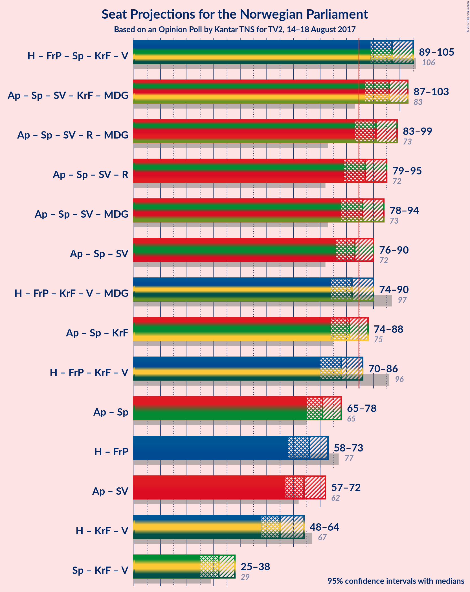

# Opinion Poll by Kantar TNS for TV2, 14–18 August 2017

<a href="#voting-intentions">Voting Intentions</a> | <a href="#seats">Seats</a> | <a href="#coalitions">Coalitions</a> | <a href="#technical-information">Technical Information</a>

## Voting Intentions

### Confidence Intervals

| Party | Last Result | Poll Result | 80% Confidence Interval | 90% Confidence Interval | 95% Confidence Interval | 99% Confidence Interval |
|:-----:|:-----------:|:-----------:|:-----------------------:|:-----------------------:|:-----------------------:|:-----------------------:|
| Arbeiderpartiet | 30.8% | 28.5% | 26.4–30.7% |25.8–31.3% |25.3–31.8% |24.4–32.9% |
| Høyre | 26.8% | 23.8% | 21.9–26.0% |21.4–26.6% |20.9–27.1% |20.0–28.1% |
| Fremskrittspartiet | 16.3% | 12.7% | 11.3–14.4% |10.9–14.9% |10.5–15.3% |9.9–16.2% |
| Senterpartiet | 5.5% | 10.4% | 9.1–12.0% |8.7–12.5% |8.4–12.9% |7.8–13.7% |
| Sosialistisk Venstreparti | 4.1% | 6.4% | 5.3–7.7% |5.1–8.0% |4.8–8.4% |4.4–9.0% |
| Kristelig Folkeparti | 5.6% | 5.3% | 4.4–6.5% |4.1–6.8% |3.9–7.1% |3.5–7.8% |
| Rødt | 1.1% | 3.8% | 3.0–4.9% |2.8–5.2% |2.6–5.4% |2.3–6.0% |
| Venstre | 5.2% | 3.5% | 2.8–4.6% |2.6–4.9% |2.4–5.1% |2.1–5.7% |
| Miljøpartiet de Grønne | 2.8% | 3.4% | 2.7–4.4% |2.5–4.7% |2.3–5.0% |2.0–5.5% |

*Note:* The poll result column reflects the actual value used in the calculations. Published results may vary slightly, and in addition be rounded to fewer digits.

## Seats

### Confidence Intervals

| Party | Last Result | Median | 80% Confidence Interval | 90% Confidence Interval | 95% Confidence Interval | 99% Confidence Interval |
|:-----:|:-----------:|:------:|:-----------------------:|:-----------------------:|:-----------------------:|:-----------------------:|
| <a href="#arbeiderpartiet">Arbeiderpartiet</a> | 55 | 53 | 49–57 |47–57 |46–59 |45–61 |
| <a href="#høyre">Høyre</a> | 48 | 42 | 38–47 |38–48 |37–49 |35–50 |
| <a href="#fremskrittspartiet">Fremskrittspartiet</a> | 29 | 24 | 20–27 |19–27 |19–28 |17–29 |
| <a href="#senterpartiet">Senterpartiet</a> | 10 | 18 | 16–21 |16–22 |15–23 |14–25 |
| <a href="#sosialistisk-venstreparti">Sosialistisk Venstreparti</a> | 7 | 12 | 10–15 |9–15 |9–16 |7–16 |
| <a href="#kristelig-folkeparti">Kristelig Folkeparti</a> | 10 | 9 | 8–11 |8–12 |7–12 |2–13 |
| <a href="#rødt">Rødt</a> | 0 | 2 | 2–9 |1–10 |1–10 |1–11 |
| <a href="#venstre">Venstre</a> | 9 | 7 | 1–8 |1–8 |1–9 |0–10 |
| <a href="#miljøpartiet-de-grønne">Miljøpartiet de Grønne</a> | 1 | 2 | 1–7 |1–8 |1–9 |1–10 |

### Arbeiderpartiet

| Number of Seats | Probability | Accumulated | Special Marks |
|:---------------:|:-----------:|:-----------:|:-------------:|
| 42 | 0% | 100% |  |
| 43 | 0.1% | 99.9% |  |
| 44 | 0.1% | 99.9% |  |
| 45 | 0.6% | 99.8% |  |
| 46 | 2% | 99.2% |  |
| 47 | 4% | 97% |  |
| 48 | 0.9% | 93% |  |
| 49 | 6% | 92% |  |
| 50 | 3% | 87% |  |
| 51 | 23% | 84% |  |
| 52 | 4% | 61% |  |
| 53 | 31% | 58% | Median |
| 54 | 8% | 26% |  |
| 55 | 3% | 18% | Last Result |
| 56 | 2% | 15% |  |
| 57 | 8% | 13% |  |
| 58 | 0.6% | 5% |  |
| 59 | 3% | 4% |  |
| 60 | 0.2% | 0.7% |  |
| 61 | 0.3% | 0.6% |  |
| 62 | 0.1% | 0.2% |  |
| 63 | 0% | 0.1% |  |
| 64 | 0.1% | 0.1% |  |
| 65 | 0% | 0% |  |

### Høyre

| Number of Seats | Probability | Accumulated | Special Marks |
|:---------------:|:-----------:|:-----------:|:-------------:|
| 33 | 0% | 100% |  |
| 34 | 0.3% | 99.9% |  |
| 35 | 0.5% | 99.6% |  |
| 36 | 0.4% | 99.2% |  |
| 37 | 1.3% | 98.7% |  |
| 38 | 7% | 97% |  |
| 39 | 2% | 90% |  |
| 40 | 4% | 88% |  |
| 41 | 29% | 84% |  |
| 42 | 8% | 55% | Median |
| 43 | 21% | 47% |  |
| 44 | 3% | 25% |  |
| 45 | 6% | 23% |  |
| 46 | 4% | 17% |  |
| 47 | 3% | 13% |  |
| 48 | 6% | 10% | Last Result |
| 49 | 4% | 4% |  |
| 50 | 0.3% | 0.7% |  |
| 51 | 0.2% | 0.4% |  |
| 52 | 0% | 0.2% |  |
| 53 | 0.1% | 0.2% |  |
| 54 | 0% | 0.1% |  |
| 55 | 0% | 0% |  |

### Fremskrittspartiet

| Number of Seats | Probability | Accumulated | Special Marks |
|:---------------:|:-----------:|:-----------:|:-------------:|
| 15 | 0.1% | 100% |  |
| 16 | 0.1% | 99.9% |  |
| 17 | 0.6% | 99.8% |  |
| 18 | 1.4% | 99.2% |  |
| 19 | 6% | 98% |  |
| 20 | 7% | 92% |  |
| 21 | 4% | 85% |  |
| 22 | 19% | 82% |  |
| 23 | 12% | 63% |  |
| 24 | 28% | 51% | Median |
| 25 | 3% | 23% |  |
| 26 | 5% | 20% |  |
| 27 | 12% | 15% |  |
| 28 | 2% | 3% |  |
| 29 | 0.3% | 0.7% | Last Result |
| 30 | 0.3% | 0.4% |  |
| 31 | 0.1% | 0.1% |  |
| 32 | 0% | 0% |  |

### Senterpartiet

| Number of Seats | Probability | Accumulated | Special Marks |
|:---------------:|:-----------:|:-----------:|:-------------:|
| 10 | 0% | 100% | Last Result |
| 11 | 0% | 100% |  |
| 12 | 0.1% | 100% |  |
| 13 | 0.2% | 99.9% |  |
| 14 | 1.2% | 99.7% |  |
| 15 | 3% | 98% |  |
| 16 | 7% | 95% |  |
| 17 | 31% | 88% |  |
| 18 | 29% | 57% | Median |
| 19 | 11% | 28% |  |
| 20 | 7% | 17% |  |
| 21 | 5% | 10% |  |
| 22 | 3% | 5% |  |
| 23 | 1.4% | 3% |  |
| 24 | 0.7% | 1.3% |  |
| 25 | 0.4% | 0.5% |  |
| 26 | 0.1% | 0.1% |  |
| 27 | 0% | 0% |  |

### Sosialistisk Venstreparti

| Number of Seats | Probability | Accumulated | Special Marks |
|:---------------:|:-----------:|:-----------:|:-------------:|
| 2 | 0.1% | 100% |  |
| 3 | 0% | 99.9% |  |
| 4 | 0% | 99.9% |  |
| 5 | 0% | 99.9% |  |
| 6 | 0% | 99.9% |  |
| 7 | 0.6% | 99.9% | Last Result |
| 8 | 1.5% | 99.4% |  |
| 9 | 5% | 98% |  |
| 10 | 11% | 93% |  |
| 11 | 10% | 82% |  |
| 12 | 41% | 72% | Median |
| 13 | 15% | 31% |  |
| 14 | 6% | 16% |  |
| 15 | 7% | 10% |  |
| 16 | 2% | 3% |  |
| 17 | 0.2% | 0.3% |  |
| 18 | 0.1% | 0.2% |  |
| 19 | 0% | 0% |  |

### Kristelig Folkeparti

| Number of Seats | Probability | Accumulated | Special Marks |
|:---------------:|:-----------:|:-----------:|:-------------:|
| 1 | 0.1% | 100% |  |
| 2 | 2% | 99.9% |  |
| 3 | 0.2% | 98% |  |
| 4 | 0% | 98% |  |
| 5 | 0% | 98% |  |
| 6 | 0% | 98% |  |
| 7 | 3% | 98% |  |
| 8 | 42% | 95% |  |
| 9 | 25% | 53% | Median |
| 10 | 14% | 29% | Last Result |
| 11 | 8% | 15% |  |
| 12 | 5% | 7% |  |
| 13 | 1.2% | 2% |  |
| 14 | 0.2% | 0.4% |  |
| 15 | 0.1% | 0.3% |  |
| 16 | 0.1% | 0.2% |  |
| 17 | 0% | 0% |  |

### Rødt

| Number of Seats | Probability | Accumulated | Special Marks |
|:---------------:|:-----------:|:-----------:|:-------------:|
| 0 | 0% | 100% | Last Result |
| 1 | 5% | 100% |  |
| 2 | 69% | 95% | Median |
| 3 | 0% | 26% |  |
| 4 | 0% | 26% |  |
| 5 | 0% | 26% |  |
| 6 | 0.1% | 26% |  |
| 7 | 5% | 26% |  |
| 8 | 7% | 21% |  |
| 9 | 8% | 13% |  |
| 10 | 5% | 6% |  |
| 11 | 0.5% | 0.6% |  |
| 12 | 0.1% | 0.1% |  |
| 13 | 0% | 0% |  |

### Venstre

| Number of Seats | Probability | Accumulated | Special Marks |
|:---------------:|:-----------:|:-----------:|:-------------:|
| 0 | 2% | 100% |  |
| 1 | 9% | 98% |  |
| 2 | 16% | 89% |  |
| 3 | 11% | 73% |  |
| 4 | 0% | 62% |  |
| 5 | 0% | 62% |  |
| 6 | 0% | 62% |  |
| 7 | 23% | 62% | Median |
| 8 | 35% | 39% |  |
| 9 | 3% | 3% | Last Result |
| 10 | 0.7% | 0.7% |  |
| 11 | 0% | 0% |  |

### Miljøpartiet de Grønne

| Number of Seats | Probability | Accumulated | Special Marks |
|:---------------:|:-----------:|:-----------:|:-------------:|
| 0 | 0.2% | 100% |  |
| 1 | 49% | 99.8% | Last Result |
| 2 | 13% | 50% | Median |
| 3 | 25% | 37% |  |
| 4 | 0.2% | 12% |  |
| 5 | 0% | 12% |  |
| 6 | 0% | 12% |  |
| 7 | 5% | 12% |  |
| 8 | 5% | 7% |  |
| 9 | 2% | 3% |  |
| 10 | 0.6% | 0.7% |  |
| 11 | 0.1% | 0.1% |  |
| 12 | 0% | 0% |  |

## Coalitions

### Confidence Intervals

| Coalition | Last Result | Median | Majority? | 80% Confidence Interval | 90% Confidence Interval | 95% Confidence Interval | 99% Confidence Interval |
|:---------:|:-----------:|:------:|:---------:|:-----------------------:|:-----------------------:|:-----------------------:|:-----------------------:|
| Høyre – Fremskrittspartiet – Senterpartiet – Kristelig Folkeparti – Venstre | 106 | 99 | 99.9% | 93–103 | 91–103 | 89–105 | 87–109 |
| Arbeiderpartiet – Senterpartiet – Sosialistisk Venstreparti – Kristelig Folkeparti – Miljøpartiet de Grønne | 83 | 94 | 99.5% | 90–99 | 87–100 | 86–101 | 85–105 |
| Arbeiderpartiet – Senterpartiet – Sosialistisk Venstreparti – Rødt – Miljøpartiet de Grønne | 73 | 88 | 81% | 83–94 | 83–96 | 83–97 | 80–101 |
| Arbeiderpartiet – Senterpartiet – Sosialistisk Venstreparti – Rødt | 72 | 85 | 70% | 81–92 | 80–92 | 80–94 | 77–98 |
| Arbeiderpartiet – Senterpartiet – Sosialistisk Venstreparti – Miljøpartiet de Grønne | 73 | 86 | 60% | 81–91 | 79–91 | 77–93 | 76–95 |
| Arbeiderpartiet – Senterpartiet – Sosialistisk Venstreparti | 72 | 83 | 26% | 78–87 | 77–89 | 75–89 | 73–92 |
| Høyre – Fremskrittspartiet – Kristelig Folkeparti – Venstre – Miljøpartiet de Grønne | 97 | 84 | 29% | 77–88 | 76–89 | 75–89 | 71–92 |
| Arbeiderpartiet – Senterpartiet – Kristelig Folkeparti | 75 | 79 | 7% | 76–84 | 75–85 | 74–87 | 71–89 |
| Høyre – Fremskrittspartiet – Kristelig Folkeparti – Venstre | 96 | 81 | 19% | 75–86 | 73–86 | 72–86 | 68–88 |
| Arbeiderpartiet – Senterpartiet | 65 | 71 | 0% | 68–74 | 65–75 | 64–77 | 63–80 |
| Høyre – Fremskrittspartiet | 77 | 65 | 0% | 61–70 | 60–71 | 58–72 | 57–73 |
| Arbeiderpartiet – Sosialistisk Venstreparti | 62 | 65 | 0% | 60–71 | 58–72 | 57–72 | 55–72 |
| Høyre – Kristelig Folkeparti – Venstre | 67 | 57 | 0% | 53–63 | 51–65 | 49–66 | 46–66 |
| Senterpartiet – Kristelig Folkeparti – Venstre | 29 | 33 | 0% | 28–36 | 28–38 | 27–39 | 23–42 |

### Høyre – Fremskrittspartiet – Senterpartiet – Kristelig Folkeparti – Venstre

| Number of Seats | Probability | Accumulated | Special Marks |
|:---------------:|:-----------:|:-----------:|:-------------:|
| 82 | 0% | 100% |  |
| 83 | 0% | 99.9% |  |
| 84 | 0% | 99.9% |  |
| 85 | 0.1% | 99.9% | Majority |
| 86 | 0.3% | 99.8% |  |
| 87 | 0.5% | 99.5% |  |
| 88 | 0.2% | 99.0% |  |
| 89 | 2% | 98.8% |  |
| 90 | 1.1% | 97% |  |
| 91 | 1.3% | 96% |  |
| 92 | 2% | 95% |  |
| 93 | 15% | 93% |  |
| 94 | 3% | 79% |  |
| 95 | 1.2% | 76% |  |
| 96 | 2% | 74% |  |
| 97 | 3% | 72% |  |
| 98 | 1.3% | 69% |  |
| 99 | 35% | 68% |  |
| 100 | 5% | 32% | Median |
| 101 | 3% | 27% |  |
| 102 | 5% | 23% |  |
| 103 | 14% | 19% |  |
| 104 | 1.3% | 4% |  |
| 105 | 0.5% | 3% |  |
| 106 | 1.4% | 2% | Last Result |
| 107 | 0.4% | 1.1% |  |
| 108 | 0.1% | 0.7% |  |
| 109 | 0.6% | 0.7% |  |
| 110 | 0% | 0% |  |

### Arbeiderpartiet – Senterpartiet – Sosialistisk Venstreparti – Kristelig Folkeparti – Miljøpartiet de Grønne

| Number of Seats | Probability | Accumulated | Special Marks |
|:---------------:|:-----------:|:-----------:|:-------------:|
| 80 | 0.1% | 100% |  |
| 81 | 0% | 99.8% |  |
| 82 | 0.1% | 99.8% |  |
| 83 | 0.1% | 99.7% | Last Result |
| 84 | 0.1% | 99.6% |  |
| 85 | 0.2% | 99.5% | Majority |
| 86 | 4% | 99.4% |  |
| 87 | 0.3% | 95% |  |
| 88 | 1.3% | 95% |  |
| 89 | 1.1% | 94% |  |
| 90 | 12% | 93% |  |
| 91 | 9% | 80% |  |
| 92 | 5% | 71% |  |
| 93 | 3% | 66% |  |
| 94 | 27% | 62% | Median |
| 95 | 2% | 36% |  |
| 96 | 9% | 33% |  |
| 97 | 5% | 25% |  |
| 98 | 5% | 20% |  |
| 99 | 9% | 15% |  |
| 100 | 2% | 6% |  |
| 101 | 2% | 4% |  |
| 102 | 0.9% | 2% |  |
| 103 | 0.5% | 1.3% |  |
| 104 | 0.2% | 0.8% |  |
| 105 | 0.3% | 0.6% |  |
| 106 | 0.1% | 0.3% |  |
| 107 | 0.1% | 0.2% |  |
| 108 | 0.1% | 0.1% |  |
| 109 | 0% | 0% |  |

### Arbeiderpartiet – Senterpartiet – Sosialistisk Venstreparti – Rødt – Miljøpartiet de Grønne

| Number of Seats | Probability | Accumulated | Special Marks |
|:---------------:|:-----------:|:-----------:|:-------------:|
| 73 | 0% | 100% | Last Result |
| 74 | 0% | 100% |  |
| 75 | 0% | 100% |  |
| 76 | 0% | 100% |  |
| 77 | 0% | 100% |  |
| 78 | 0.2% | 99.9% |  |
| 79 | 0% | 99.7% |  |
| 80 | 0.2% | 99.7% |  |
| 81 | 0.3% | 99.5% |  |
| 82 | 1.4% | 99.2% |  |
| 83 | 16% | 98% |  |
| 84 | 0.6% | 82% |  |
| 85 | 5% | 81% | Majority |
| 86 | 3% | 77% |  |
| 87 | 6% | 74% | Median |
| 88 | 24% | 68% |  |
| 89 | 6% | 44% |  |
| 90 | 7% | 38% |  |
| 91 | 6% | 31% |  |
| 92 | 3% | 25% |  |
| 93 | 12% | 22% |  |
| 94 | 2% | 10% |  |
| 95 | 3% | 8% |  |
| 96 | 3% | 6% |  |
| 97 | 1.0% | 3% |  |
| 98 | 0.8% | 2% |  |
| 99 | 0.4% | 1.5% |  |
| 100 | 0.4% | 1.1% |  |
| 101 | 0.4% | 0.8% |  |
| 102 | 0.2% | 0.3% |  |
| 103 | 0.1% | 0.1% |  |
| 104 | 0.1% | 0.1% |  |
| 105 | 0% | 0% |  |

### Arbeiderpartiet – Senterpartiet – Sosialistisk Venstreparti – Rødt

| Number of Seats | Probability | Accumulated | Special Marks |
|:---------------:|:-----------:|:-----------:|:-------------:|
| 72 | 0% | 100% | Last Result |
| 73 | 0% | 100% |  |
| 74 | 0% | 100% |  |
| 75 | 0.2% | 100% |  |
| 76 | 0.2% | 99.8% |  |
| 77 | 0.3% | 99.6% |  |
| 78 | 0.9% | 99.3% |  |
| 79 | 0.3% | 98% |  |
| 80 | 4% | 98% |  |
| 81 | 5% | 94% |  |
| 82 | 13% | 89% |  |
| 83 | 0.9% | 76% |  |
| 84 | 5% | 75% |  |
| 85 | 24% | 70% | Median, Majority |
| 86 | 6% | 47% |  |
| 87 | 2% | 41% |  |
| 88 | 8% | 39% |  |
| 89 | 8% | 31% |  |
| 90 | 4% | 24% |  |
| 91 | 9% | 20% |  |
| 92 | 6% | 10% |  |
| 93 | 1.4% | 5% |  |
| 94 | 1.3% | 3% |  |
| 95 | 0.8% | 2% |  |
| 96 | 0.5% | 1.4% |  |
| 97 | 0.3% | 0.8% |  |
| 98 | 0.1% | 0.5% |  |
| 99 | 0% | 0.4% |  |
| 100 | 0.3% | 0.4% |  |
| 101 | 0% | 0.1% |  |
| 102 | 0% | 0% |  |

### Arbeiderpartiet – Senterpartiet – Sosialistisk Venstreparti – Miljøpartiet de Grønne

| Number of Seats | Probability | Accumulated | Special Marks |
|:---------------:|:-----------:|:-----------:|:-------------:|
| 73 | 0.1% | 100% | Last Result |
| 74 | 0% | 99.9% |  |
| 75 | 0.2% | 99.9% |  |
| 76 | 2% | 99.7% |  |
| 77 | 0.8% | 98% |  |
| 78 | 0.3% | 97% |  |
| 79 | 3% | 96% |  |
| 80 | 1.5% | 94% |  |
| 81 | 18% | 92% |  |
| 82 | 4% | 74% |  |
| 83 | 5% | 70% |  |
| 84 | 6% | 65% |  |
| 85 | 4% | 60% | Median, Majority |
| 86 | 23% | 55% |  |
| 87 | 9% | 32% |  |
| 88 | 7% | 24% |  |
| 89 | 4% | 17% |  |
| 90 | 1.5% | 13% |  |
| 91 | 8% | 11% |  |
| 92 | 0.4% | 3% |  |
| 93 | 1.4% | 3% |  |
| 94 | 0.5% | 1.4% |  |
| 95 | 0.6% | 0.9% |  |
| 96 | 0% | 0.3% |  |
| 97 | 0.1% | 0.3% |  |
| 98 | 0.2% | 0.2% |  |
| 99 | 0% | 0.1% |  |
| 100 | 0% | 0% |  |

### Arbeiderpartiet – Senterpartiet – Sosialistisk Venstreparti

| Number of Seats | Probability | Accumulated | Special Marks |
|:---------------:|:-----------:|:-----------:|:-------------:|
| 70 | 0% | 100% |  |
| 71 | 0.1% | 99.9% |  |
| 72 | 0.2% | 99.9% | Last Result |
| 73 | 0.6% | 99.7% |  |
| 74 | 0.2% | 99.1% |  |
| 75 | 2% | 98.9% |  |
| 76 | 2% | 97% |  |
| 77 | 1.2% | 95% |  |
| 78 | 4% | 94% |  |
| 79 | 7% | 90% |  |
| 80 | 15% | 83% |  |
| 81 | 5% | 68% |  |
| 82 | 6% | 63% |  |
| 83 | 27% | 57% | Median |
| 84 | 4% | 30% |  |
| 85 | 2% | 26% | Majority |
| 86 | 8% | 23% |  |
| 87 | 5% | 15% |  |
| 88 | 0.5% | 10% |  |
| 89 | 7% | 9% |  |
| 90 | 0.9% | 2% |  |
| 91 | 0.2% | 1.4% |  |
| 92 | 1.0% | 1.2% |  |
| 93 | 0% | 0.2% |  |
| 94 | 0.1% | 0.2% |  |
| 95 | 0% | 0.1% |  |
| 96 | 0% | 0.1% |  |
| 97 | 0% | 0% |  |

### Høyre – Fremskrittspartiet – Kristelig Folkeparti – Venstre – Miljøpartiet de Grønne

| Number of Seats | Probability | Accumulated | Special Marks |
|:---------------:|:-----------:|:-----------:|:-------------:|
| 67 | 0% | 100% |  |
| 68 | 0.1% | 99.9% |  |
| 69 | 0.3% | 99.9% |  |
| 70 | 0% | 99.6% |  |
| 71 | 0.1% | 99.5% |  |
| 72 | 0.3% | 99.4% |  |
| 73 | 0.5% | 99.1% |  |
| 74 | 0.8% | 98.6% |  |
| 75 | 2% | 98% |  |
| 76 | 1.4% | 96% |  |
| 77 | 6% | 95% |  |
| 78 | 9% | 89% |  |
| 79 | 4% | 80% |  |
| 80 | 8% | 76% |  |
| 81 | 8% | 68% |  |
| 82 | 1.4% | 60% |  |
| 83 | 6% | 59% |  |
| 84 | 24% | 53% | Median |
| 85 | 5% | 29% | Majority |
| 86 | 0.9% | 24% |  |
| 87 | 13% | 24% |  |
| 88 | 5% | 11% |  |
| 89 | 4% | 6% |  |
| 90 | 0.3% | 2% |  |
| 91 | 0.9% | 2% |  |
| 92 | 0.3% | 0.6% |  |
| 93 | 0.2% | 0.4% |  |
| 94 | 0.2% | 0.2% |  |
| 95 | 0% | 0% |  |
| 96 | 0% | 0% |  |
| 97 | 0% | 0% | Last Result |

### Arbeiderpartiet – Senterpartiet – Kristelig Folkeparti

| Number of Seats | Probability | Accumulated | Special Marks |
|:---------------:|:-----------:|:-----------:|:-------------:|
| 67 | 0% | 100% |  |
| 68 | 0% | 99.9% |  |
| 69 | 0.2% | 99.9% |  |
| 70 | 0.2% | 99.7% |  |
| 71 | 0.1% | 99.5% |  |
| 72 | 0.3% | 99.4% |  |
| 73 | 1.1% | 99.1% |  |
| 74 | 3% | 98% |  |
| 75 | 3% | 95% | Last Result |
| 76 | 6% | 93% |  |
| 77 | 14% | 87% |  |
| 78 | 10% | 72% |  |
| 79 | 22% | 62% |  |
| 80 | 8% | 40% | Median |
| 81 | 6% | 32% |  |
| 82 | 11% | 25% |  |
| 83 | 2% | 14% |  |
| 84 | 5% | 12% |  |
| 85 | 2% | 7% | Majority |
| 86 | 0.8% | 4% |  |
| 87 | 1.3% | 4% |  |
| 88 | 1.0% | 2% |  |
| 89 | 1.0% | 1.3% |  |
| 90 | 0.1% | 0.3% |  |
| 91 | 0.1% | 0.3% |  |
| 92 | 0% | 0.1% |  |
| 93 | 0% | 0.1% |  |
| 94 | 0.1% | 0.1% |  |
| 95 | 0% | 0% |  |

### Høyre – Fremskrittspartiet – Kristelig Folkeparti – Venstre

| Number of Seats | Probability | Accumulated | Special Marks |
|:---------------:|:-----------:|:-----------:|:-------------:|
| 65 | 0.1% | 100% |  |
| 66 | 0.1% | 99.9% |  |
| 67 | 0.2% | 99.8% |  |
| 68 | 0.4% | 99.6% |  |
| 69 | 0.4% | 99.2% |  |
| 70 | 0.4% | 98.8% |  |
| 71 | 0.8% | 98% |  |
| 72 | 1.0% | 98% |  |
| 73 | 3% | 97% |  |
| 74 | 3% | 94% |  |
| 75 | 2% | 91% |  |
| 76 | 12% | 89% |  |
| 77 | 3% | 77% |  |
| 78 | 6% | 75% |  |
| 79 | 7% | 69% |  |
| 80 | 6% | 61% |  |
| 81 | 24% | 55% |  |
| 82 | 6% | 32% | Median |
| 83 | 3% | 26% |  |
| 84 | 5% | 23% |  |
| 85 | 0.5% | 19% | Majority |
| 86 | 16% | 18% |  |
| 87 | 1.4% | 2% |  |
| 88 | 0.3% | 0.8% |  |
| 89 | 0.2% | 0.5% |  |
| 90 | 0% | 0.3% |  |
| 91 | 0.2% | 0.3% |  |
| 92 | 0% | 0% |  |
| 93 | 0% | 0% |  |
| 94 | 0% | 0% |  |
| 95 | 0% | 0% |  |
| 96 | 0% | 0% | Last Result |

### Arbeiderpartiet – Senterpartiet

| Number of Seats | Probability | Accumulated | Special Marks |
|:---------------:|:-----------:|:-----------:|:-------------:|
| 60 | 0% | 100% |  |
| 61 | 0.1% | 99.9% |  |
| 62 | 0.1% | 99.8% |  |
| 63 | 0.6% | 99.7% |  |
| 64 | 2% | 99.1% |  |
| 65 | 2% | 97% | Last Result |
| 66 | 1.2% | 95% |  |
| 67 | 3% | 94% |  |
| 68 | 23% | 91% |  |
| 69 | 5% | 68% |  |
| 70 | 9% | 63% |  |
| 71 | 24% | 55% | Median |
| 72 | 2% | 30% |  |
| 73 | 10% | 28% |  |
| 74 | 12% | 18% |  |
| 75 | 1.4% | 6% |  |
| 76 | 0.7% | 5% |  |
| 77 | 2% | 4% |  |
| 78 | 1.0% | 2% |  |
| 79 | 0.2% | 1.4% |  |
| 80 | 0.8% | 1.2% |  |
| 81 | 0.1% | 0.3% |  |
| 82 | 0% | 0.2% |  |
| 83 | 0.1% | 0.1% |  |
| 84 | 0% | 0% |  |

### Høyre – Fremskrittspartiet

| Number of Seats | Probability | Accumulated | Special Marks |
|:---------------:|:-----------:|:-----------:|:-------------:|
| 54 | 0.1% | 100% |  |
| 55 | 0.2% | 99.9% |  |
| 56 | 0.2% | 99.7% |  |
| 57 | 0.7% | 99.5% |  |
| 58 | 2% | 98.9% |  |
| 59 | 2% | 97% |  |
| 60 | 1.5% | 96% |  |
| 61 | 5% | 94% |  |
| 62 | 4% | 89% |  |
| 63 | 3% | 85% |  |
| 64 | 10% | 82% |  |
| 65 | 32% | 72% |  |
| 66 | 3% | 40% | Median |
| 67 | 2% | 37% |  |
| 68 | 10% | 34% |  |
| 69 | 4% | 24% |  |
| 70 | 11% | 20% |  |
| 71 | 6% | 9% |  |
| 72 | 3% | 4% |  |
| 73 | 0.6% | 1.1% |  |
| 74 | 0.2% | 0.5% |  |
| 75 | 0.1% | 0.3% |  |
| 76 | 0.1% | 0.2% |  |
| 77 | 0% | 0.1% | Last Result |
| 78 | 0.1% | 0.1% |  |
| 79 | 0% | 0% |  |

### Arbeiderpartiet – Sosialistisk Venstreparti

| Number of Seats | Probability | Accumulated | Special Marks |
|:---------------:|:-----------:|:-----------:|:-------------:|
| 53 | 0% | 100% |  |
| 54 | 0% | 99.9% |  |
| 55 | 0.6% | 99.9% |  |
| 56 | 0.6% | 99.3% |  |
| 57 | 1.3% | 98.7% |  |
| 58 | 3% | 97% |  |
| 59 | 1.3% | 95% |  |
| 60 | 4% | 93% |  |
| 61 | 7% | 89% |  |
| 62 | 6% | 82% | Last Result |
| 63 | 12% | 76% |  |
| 64 | 7% | 63% |  |
| 65 | 27% | 57% | Median |
| 66 | 7% | 30% |  |
| 67 | 9% | 23% |  |
| 68 | 1.0% | 13% |  |
| 69 | 1.2% | 12% |  |
| 70 | 0.9% | 11% |  |
| 71 | 3% | 10% |  |
| 72 | 7% | 7% |  |
| 73 | 0.1% | 0.4% |  |
| 74 | 0.1% | 0.3% |  |
| 75 | 0.1% | 0.2% |  |
| 76 | 0% | 0% |  |

### Høyre – Kristelig Folkeparti – Venstre

| Number of Seats | Probability | Accumulated | Special Marks |
|:---------------:|:-----------:|:-----------:|:-------------:|
| 44 | 0.1% | 100% |  |
| 45 | 0.3% | 99.8% |  |
| 46 | 0.2% | 99.6% |  |
| 47 | 0.7% | 99.4% |  |
| 48 | 0.9% | 98.7% |  |
| 49 | 0.6% | 98% |  |
| 50 | 1.0% | 97% |  |
| 51 | 3% | 96% |  |
| 52 | 3% | 94% |  |
| 53 | 1.0% | 90% |  |
| 54 | 16% | 89% |  |
| 55 | 3% | 74% |  |
| 56 | 12% | 71% |  |
| 57 | 30% | 59% |  |
| 58 | 2% | 29% | Median |
| 59 | 12% | 27% |  |
| 60 | 3% | 15% |  |
| 61 | 2% | 12% |  |
| 62 | 0.4% | 11% |  |
| 63 | 0.4% | 10% |  |
| 64 | 1.2% | 10% |  |
| 65 | 4% | 9% |  |
| 66 | 4% | 4% |  |
| 67 | 0.1% | 0.4% | Last Result |
| 68 | 0.1% | 0.3% |  |
| 69 | 0.1% | 0.2% |  |
| 70 | 0% | 0% |  |

### Senterpartiet – Kristelig Folkeparti – Venstre

| Number of Seats | Probability | Accumulated | Special Marks |
|:---------------:|:-----------:|:-----------:|:-------------:|
| 19 | 0.1% | 100% |  |
| 20 | 0.2% | 99.9% |  |
| 21 | 0% | 99.7% |  |
| 22 | 0.1% | 99.7% |  |
| 23 | 0.2% | 99.6% |  |
| 24 | 0.1% | 99.3% |  |
| 25 | 0.4% | 99.2% |  |
| 26 | 0.5% | 98.8% |  |
| 27 | 1.2% | 98% |  |
| 28 | 11% | 97% |  |
| 29 | 13% | 86% | Last Result |
| 30 | 3% | 73% |  |
| 31 | 8% | 71% |  |
| 32 | 3% | 63% |  |
| 33 | 14% | 60% |  |
| 34 | 26% | 46% | Median |
| 35 | 9% | 20% |  |
| 36 | 0.8% | 10% |  |
| 37 | 1.0% | 10% |  |
| 38 | 6% | 9% |  |
| 39 | 1.2% | 3% |  |
| 40 | 0.2% | 2% |  |
| 41 | 1.0% | 2% |  |
| 42 | 0.2% | 0.6% |  |
| 43 | 0.4% | 0.4% |  |
| 44 | 0% | 0% |  |

## Technical Information

### Opinion Poll

+ **Pollster:** Kantar TNS
+ **Media:** TV2
+ **Fieldwork period:** 14–18 August 2017

### Calculations

+ **Sample size:** 738
+ **Simulations done:** 262,144
+ **Error estimate:** 1.57%

