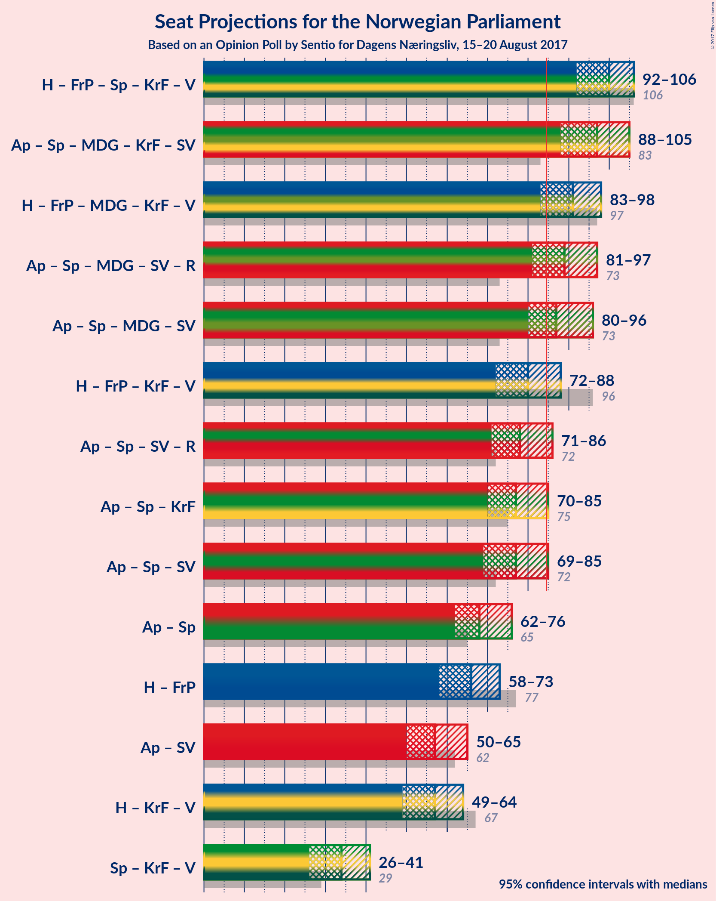

# Opinion Poll by Sentio for Dagens Næringsliv, 15–20 August 2017

<a href="#voting-intentions">Voting Intentions</a> | <a href="#seats">Seats</a> | <a href="#coalitions">Coalitions</a> | <a href="#technical-information">Technical Information</a>

## Voting Intentions

### Confidence Intervals

| Party | Last Result | Poll Result | 80% Confidence Interval | 90% Confidence Interval | 95% Confidence Interval | 99% Confidence Interval |
|:-----:|:-----------:|:-----------:|:-----------------------:|:-----------------------:|:-----------------------:|:-----------------------:|
| Arbeiderpartiet | 30.8% | 27.0% | 24.9–29.2% |24.4–29.8% |23.9–30.4% |22.9–31.4% |
| Høyre | 26.8% | 24.2% | 22.2–26.3% |21.7–26.9% |21.2–27.5% |20.3–28.5% |
| Fremskrittspartiet | 16.3% | 13.1% | 11.6–14.9% |11.2–15.4% |10.9–15.8% |10.2–16.7% |
| Senterpartiet | 5.5% | 11.0% | 9.7–12.7% |9.3–13.2% |8.9–13.6% |8.3–14.4% |
| Miljøpartiet de Grønne | 2.8% | 6.2% | 5.1–7.5% |4.8–7.8% |4.6–8.2% |4.2–8.8% |
| Kristelig Folkeparti | 5.6% | 5.3% | 4.4–6.6% |4.1–6.9% |3.9–7.2% |3.5–7.8% |
| Sosialistisk Venstreparti | 4.1% | 5.0% | 4.1–6.2% |3.9–6.6% |3.7–6.9% |3.3–7.5% |
| Venstre | 5.2% | 4.1% | 3.2–5.2% |3.0–5.5% |2.8–5.8% |2.5–6.4% |
| Rødt | 1.1% | 2.5% | 1.9–3.4% |1.7–3.7% |1.6–3.9% |1.3–4.5% |

*Note:* The poll result column reflects the actual value used in the calculations. Published results may vary slightly, and in addition be rounded to fewer digits.

## Seats

### Confidence Intervals

| Party | Last Result | Median | 80% Confidence Interval | 90% Confidence Interval | 95% Confidence Interval | 99% Confidence Interval |
|:-----:|:-----------:|:------:|:-----------------------:|:-----------------------:|:-----------------------:|:-----------------------:|
| <a href="#arbeiderpartiet">Arbeiderpartiet</a> | 55 | 49 | 45–53 |45–55 |44–55 |42–59 |
| <a href="#høyre">Høyre</a> | 48 | 42 | 38–47 |37–48 |37–49 |35–51 |
| <a href="#fremskrittspartiet">Fremskrittspartiet</a> | 29 | 23 | 20–27 |19–28 |19–28 |17–30 |
| <a href="#senterpartiet">Senterpartiet</a> | 10 | 19 | 16–23 |15–23 |15–24 |13–25 |
| <a href="#miljøpartiet-de-grønne">Miljøpartiet de Grønne</a> | 1 | 11 | 9–13 |8–13 |8–14 |7–15 |
| <a href="#kristelig-folkeparti">Kristelig Folkeparti</a> | 10 | 9 | 7–11 |3–12 |2–12 |2–13 |
| <a href="#sosialistisk-venstreparti">Sosialistisk Venstreparti</a> | 7 | 9 | 7–11 |2–12 |1–12 |1–13 |
| <a href="#venstre">Venstre</a> | 9 | 7 | 2–9 |1–9 |1–10 |1–10 |
| <a href="#rødt">Rødt</a> | 0 | 1 | 1–2 |1–2 |1–2 |1–7 |

### Arbeiderpartiet

| Number of Seats | Probability | Accumulated | Special Marks |
|:---------------:|:-----------:|:-----------:|:-------------:|
| 39 | 0% | 100% |  |
| 40 | 0.1% | 99.9% |  |
| 41 | 0.1% | 99.8% |  |
| 42 | 0.4% | 99.7% |  |
| 43 | 1.2% | 99.4% |  |
| 44 | 2% | 98% |  |
| 45 | 7% | 96% |  |
| 46 | 10% | 89% |  |
| 47 | 13% | 79% |  |
| 48 | 14% | 66% |  |
| 49 | 11% | 52% | Median |
| 50 | 10% | 41% |  |
| 51 | 5% | 30% |  |
| 52 | 8% | 26% |  |
| 53 | 9% | 17% |  |
| 54 | 3% | 9% |  |
| 55 | 3% | 6% | Last Result |
| 56 | 1.0% | 2% |  |
| 57 | 0.6% | 2% |  |
| 58 | 0.4% | 0.9% |  |
| 59 | 0.3% | 0.5% |  |
| 60 | 0.1% | 0.2% |  |
| 61 | 0.1% | 0.1% |  |
| 62 | 0% | 0% |  |

### Høyre

| Number of Seats | Probability | Accumulated | Special Marks |
|:---------------:|:-----------:|:-----------:|:-------------:|
| 33 | 0.1% | 100% |  |
| 34 | 0.2% | 99.9% |  |
| 35 | 0.7% | 99.8% |  |
| 36 | 1.1% | 99.0% |  |
| 37 | 5% | 98% |  |
| 38 | 8% | 93% |  |
| 39 | 12% | 85% |  |
| 40 | 8% | 73% |  |
| 41 | 10% | 65% |  |
| 42 | 9% | 55% | Median |
| 43 | 12% | 46% |  |
| 44 | 10% | 34% |  |
| 45 | 6% | 24% |  |
| 46 | 7% | 17% |  |
| 47 | 4% | 11% |  |
| 48 | 3% | 6% | Last Result |
| 49 | 1.0% | 3% |  |
| 50 | 1.1% | 2% |  |
| 51 | 0.3% | 0.7% |  |
| 52 | 0.2% | 0.3% |  |
| 53 | 0.1% | 0.1% |  |
| 54 | 0% | 0.1% |  |
| 55 | 0% | 0% |  |

### Fremskrittspartiet

| Number of Seats | Probability | Accumulated | Special Marks |
|:---------------:|:-----------:|:-----------:|:-------------:|
| 16 | 0.1% | 100% |  |
| 17 | 0.5% | 99.8% |  |
| 18 | 0.8% | 99.3% |  |
| 19 | 5% | 98.5% |  |
| 20 | 9% | 93% |  |
| 21 | 9% | 84% |  |
| 22 | 17% | 75% |  |
| 23 | 14% | 58% | Median |
| 24 | 9% | 44% |  |
| 25 | 8% | 35% |  |
| 26 | 10% | 26% |  |
| 27 | 10% | 16% |  |
| 28 | 5% | 6% |  |
| 29 | 0.7% | 2% | Last Result |
| 30 | 0.6% | 0.9% |  |
| 31 | 0.3% | 0.3% |  |
| 32 | 0% | 0.1% |  |
| 33 | 0% | 0% |  |

### Senterpartiet

| Number of Seats | Probability | Accumulated | Special Marks |
|:---------------:|:-----------:|:-----------:|:-------------:|
| 10 | 0% | 100% | Last Result |
| 11 | 0% | 100% |  |
| 12 | 0.1% | 100% |  |
| 13 | 0.6% | 99.9% |  |
| 14 | 1.1% | 99.3% |  |
| 15 | 3% | 98% |  |
| 16 | 7% | 95% |  |
| 17 | 11% | 88% |  |
| 18 | 15% | 77% |  |
| 19 | 19% | 62% | Median |
| 20 | 12% | 43% |  |
| 21 | 8% | 31% |  |
| 22 | 9% | 23% |  |
| 23 | 10% | 14% |  |
| 24 | 2% | 4% |  |
| 25 | 1.2% | 2% |  |
| 26 | 0.3% | 0.4% |  |
| 27 | 0.1% | 0.1% |  |
| 28 | 0% | 0% |  |

### Miljøpartiet de Grønne

| Number of Seats | Probability | Accumulated | Special Marks |
|:---------------:|:-----------:|:-----------:|:-------------:|
| 1 | 0% | 100% | Last Result |
| 2 | 0.1% | 100% |  |
| 3 | 0.1% | 99.9% |  |
| 4 | 0.1% | 99.8% |  |
| 5 | 0% | 99.7% |  |
| 6 | 0% | 99.7% |  |
| 7 | 1.1% | 99.7% |  |
| 8 | 6% | 98.7% |  |
| 9 | 19% | 92% |  |
| 10 | 23% | 74% |  |
| 11 | 20% | 51% | Median |
| 12 | 21% | 31% |  |
| 13 | 7% | 10% |  |
| 14 | 2% | 3% |  |
| 15 | 1.0% | 1.2% |  |
| 16 | 0.2% | 0.2% |  |
| 17 | 0.1% | 0.1% |  |
| 18 | 0% | 0% |  |

### Kristelig Folkeparti

| Number of Seats | Probability | Accumulated | Special Marks |
|:---------------:|:-----------:|:-----------:|:-------------:|
| 1 | 0.1% | 100% |  |
| 2 | 4% | 99.9% |  |
| 3 | 1.1% | 96% |  |
| 4 | 0% | 95% |  |
| 5 | 0% | 95% |  |
| 6 | 0.1% | 95% |  |
| 7 | 6% | 95% |  |
| 8 | 23% | 88% |  |
| 9 | 23% | 66% | Median |
| 10 | 25% | 43% | Last Result |
| 11 | 13% | 18% |  |
| 12 | 4% | 5% |  |
| 13 | 1.3% | 2% |  |
| 14 | 0.3% | 0.4% |  |
| 15 | 0.1% | 0.1% |  |
| 16 | 0% | 0% |  |

### Sosialistisk Venstreparti

| Number of Seats | Probability | Accumulated | Special Marks |
|:---------------:|:-----------:|:-----------:|:-------------:|
| 1 | 3% | 100% |  |
| 2 | 6% | 97% |  |
| 3 | 0% | 91% |  |
| 4 | 0% | 91% |  |
| 5 | 0% | 91% |  |
| 6 | 0.4% | 91% |  |
| 7 | 12% | 91% | Last Result |
| 8 | 21% | 79% |  |
| 9 | 27% | 58% | Median |
| 10 | 16% | 31% |  |
| 11 | 10% | 15% |  |
| 12 | 4% | 5% |  |
| 13 | 1.0% | 1.1% |  |
| 14 | 0.1% | 0.1% |  |
| 15 | 0% | 0% |  |

### Venstre

| Number of Seats | Probability | Accumulated | Special Marks |
|:---------------:|:-----------:|:-----------:|:-------------:|
| 0 | 0.2% | 100% |  |
| 1 | 8% | 99.8% |  |
| 2 | 25% | 91% |  |
| 3 | 5% | 66% |  |
| 4 | 0% | 62% |  |
| 5 | 0% | 62% |  |
| 6 | 0.3% | 62% |  |
| 7 | 27% | 61% | Median |
| 8 | 24% | 34% |  |
| 9 | 8% | 10% | Last Result |
| 10 | 2% | 3% |  |
| 11 | 0.3% | 0.4% |  |
| 12 | 0.1% | 0.1% |  |
| 13 | 0% | 0% |  |

### Rødt

| Number of Seats | Probability | Accumulated | Special Marks |
|:---------------:|:-----------:|:-----------:|:-------------:|
| 0 | 0.2% | 100% | Last Result |
| 1 | 60% | 99.8% | Median |
| 2 | 38% | 40% |  |
| 3 | 0% | 2% |  |
| 4 | 0% | 2% |  |
| 5 | 0% | 2% |  |
| 6 | 0.4% | 2% |  |
| 7 | 1.0% | 1.4% |  |
| 8 | 0.3% | 0.4% |  |
| 9 | 0% | 0% |  |

## Coalitions

### Confidence Intervals

| Coalition | Last Result | Median | Majority? | 80% Confidence Interval | 90% Confidence Interval | 95% Confidence Interval | 99% Confidence Interval |
|:---------:|:-----------:|:------:|:---------:|:-----------------------:|:-----------------------:|:-----------------------:|:-----------------------:|
| Høyre – Fremskrittspartiet – Senterpartiet – Kristelig Folkeparti – Venstre | 106 | 100 | 100% | 94–104 | 93–105 | 92–106 | 89–109 |
| Arbeiderpartiet – Senterpartiet – Miljøpartiet de Grønne – Kristelig Folkeparti – Sosialistisk Venstreparti | 83 | 97 | 99.8% | 91–102 | 90–103 | 88–105 | 86–107 |
| Høyre – Fremskrittspartiet – Miljøpartiet de Grønne – Kristelig Folkeparti – Venstre | 97 | 91 | 93% | 85–96 | 84–97 | 83–98 | 81–101 |
| Arbeiderpartiet – Senterpartiet – Miljøpartiet de Grønne – Sosialistisk Venstreparti – Rødt | 73 | 89 | 83% | 83–94 | 82–96 | 81–97 | 79–99 |
| Arbeiderpartiet – Senterpartiet – Miljøpartiet de Grønne – Sosialistisk Venstreparti | 73 | 87 | 75% | 82–93 | 81–95 | 80–96 | 77–98 |
| Høyre – Fremskrittspartiet – Kristelig Folkeparti – Venstre | 96 | 80 | 17% | 75–86 | 73–87 | 72–88 | 70–90 |
| Arbeiderpartiet – Senterpartiet – Sosialistisk Venstreparti – Rødt | 72 | 78 | 7% | 73–84 | 72–85 | 71–86 | 68–88 |
| Arbeiderpartiet – Senterpartiet – Kristelig Folkeparti | 75 | 77 | 3% | 72–82 | 71–84 | 70–85 | 68–88 |
| Arbeiderpartiet – Senterpartiet – Sosialistisk Venstreparti | 72 | 77 | 3% | 71–82 | 70–84 | 69–85 | 67–86 |
| Arbeiderpartiet – Senterpartiet | 65 | 68 | 0% | 64–73 | 62–75 | 62–76 | 60–78 |
| Høyre – Fremskrittspartiet | 77 | 66 | 0% | 60–71 | 59–72 | 58–73 | 56–75 |
| Arbeiderpartiet – Sosialistisk Venstreparti | 62 | 57 | 0% | 53–62 | 52–64 | 50–65 | 47–67 |
| Høyre – Kristelig Folkeparti – Venstre | 67 | 57 | 0% | 51–62 | 50–63 | 49–64 | 47–66 |
| Senterpartiet – Kristelig Folkeparti – Venstre | 29 | 34 | 0% | 29–39 | 27–40 | 26–41 | 23–43 |

### Høyre – Fremskrittspartiet – Senterpartiet – Kristelig Folkeparti – Venstre

| Number of Seats | Probability | Accumulated | Special Marks |
|:---------------:|:-----------:|:-----------:|:-------------:|
| 86 | 0% | 100% |  |
| 87 | 0.1% | 99.9% |  |
| 88 | 0.1% | 99.9% |  |
| 89 | 0.3% | 99.7% |  |
| 90 | 0.7% | 99.4% |  |
| 91 | 1.1% | 98.8% |  |
| 92 | 1.4% | 98% |  |
| 93 | 3% | 96% |  |
| 94 | 5% | 93% |  |
| 95 | 6% | 88% |  |
| 96 | 7% | 82% |  |
| 97 | 9% | 75% |  |
| 98 | 6% | 66% |  |
| 99 | 8% | 60% |  |
| 100 | 11% | 52% | Median |
| 101 | 7% | 41% |  |
| 102 | 10% | 34% |  |
| 103 | 8% | 23% |  |
| 104 | 8% | 15% |  |
| 105 | 4% | 8% |  |
| 106 | 2% | 4% | Last Result |
| 107 | 0.6% | 2% |  |
| 108 | 0.7% | 2% |  |
| 109 | 0.4% | 0.8% |  |
| 110 | 0.2% | 0.5% |  |
| 111 | 0.1% | 0.2% |  |
| 112 | 0.1% | 0.1% |  |
| 113 | 0% | 0% |  |

### Arbeiderpartiet – Senterpartiet – Miljøpartiet de Grønne – Kristelig Folkeparti – Sosialistisk Venstreparti

| Number of Seats | Probability | Accumulated | Special Marks |
|:---------------:|:-----------:|:-----------:|:-------------:|
| 83 | 0.1% | 100% | Last Result |
| 84 | 0.1% | 99.9% |  |
| 85 | 0.2% | 99.8% | Majority |
| 86 | 0.6% | 99.6% |  |
| 87 | 0.6% | 99.0% |  |
| 88 | 1.2% | 98% |  |
| 89 | 2% | 97% |  |
| 90 | 4% | 96% |  |
| 91 | 6% | 91% |  |
| 92 | 4% | 85% |  |
| 93 | 5% | 81% |  |
| 94 | 10% | 76% |  |
| 95 | 6% | 66% |  |
| 96 | 8% | 60% |  |
| 97 | 8% | 52% | Median |
| 98 | 9% | 44% |  |
| 99 | 9% | 34% |  |
| 100 | 8% | 25% |  |
| 101 | 5% | 17% |  |
| 102 | 4% | 12% |  |
| 103 | 4% | 8% |  |
| 104 | 2% | 5% |  |
| 105 | 1.5% | 3% |  |
| 106 | 0.4% | 1.2% |  |
| 107 | 0.5% | 0.8% |  |
| 108 | 0.1% | 0.3% |  |
| 109 | 0.1% | 0.1% |  |
| 110 | 0% | 0% |  |

### Høyre – Fremskrittspartiet – Miljøpartiet de Grønne – Kristelig Folkeparti – Venstre

| Number of Seats | Probability | Accumulated | Special Marks |
|:---------------:|:-----------:|:-----------:|:-------------:|
| 78 | 0.1% | 100% |  |
| 79 | 0.1% | 99.9% |  |
| 80 | 0.2% | 99.8% |  |
| 81 | 0.6% | 99.6% |  |
| 82 | 1.0% | 99.0% |  |
| 83 | 2% | 98% |  |
| 84 | 3% | 96% |  |
| 85 | 3% | 93% | Majority |
| 86 | 6% | 90% |  |
| 87 | 7% | 84% |  |
| 88 | 9% | 77% |  |
| 89 | 9% | 68% |  |
| 90 | 8% | 59% |  |
| 91 | 9% | 51% |  |
| 92 | 9% | 42% | Median |
| 93 | 7% | 33% |  |
| 94 | 8% | 26% |  |
| 95 | 5% | 18% |  |
| 96 | 5% | 13% |  |
| 97 | 4% | 8% | Last Result |
| 98 | 2% | 4% |  |
| 99 | 0.6% | 1.5% |  |
| 100 | 0.3% | 0.8% |  |
| 101 | 0.2% | 0.5% |  |
| 102 | 0.2% | 0.3% |  |
| 103 | 0.1% | 0.1% |  |
| 104 | 0% | 0% |  |

### Arbeiderpartiet – Senterpartiet – Miljøpartiet de Grønne – Sosialistisk Venstreparti – Rødt

| Number of Seats | Probability | Accumulated | Special Marks |
|:---------------:|:-----------:|:-----------:|:-------------:|
| 73 | 0% | 100% | Last Result |
| 74 | 0% | 100% |  |
| 75 | 0% | 100% |  |
| 76 | 0.1% | 100% |  |
| 77 | 0.1% | 99.9% |  |
| 78 | 0.2% | 99.8% |  |
| 79 | 0.3% | 99.6% |  |
| 80 | 0.9% | 99.3% |  |
| 81 | 1.0% | 98% |  |
| 82 | 3% | 97% |  |
| 83 | 5% | 95% |  |
| 84 | 7% | 90% |  |
| 85 | 4% | 83% | Majority |
| 86 | 7% | 79% |  |
| 87 | 10% | 72% |  |
| 88 | 9% | 62% |  |
| 89 | 9% | 53% | Median |
| 90 | 9% | 45% |  |
| 91 | 6% | 35% |  |
| 92 | 6% | 29% |  |
| 93 | 6% | 23% |  |
| 94 | 7% | 17% |  |
| 95 | 3% | 10% |  |
| 96 | 3% | 7% |  |
| 97 | 1.4% | 3% |  |
| 98 | 1.0% | 2% |  |
| 99 | 0.6% | 1.0% |  |
| 100 | 0.2% | 0.4% |  |
| 101 | 0.1% | 0.2% |  |
| 102 | 0.1% | 0.1% |  |
| 103 | 0% | 0% |  |

### Arbeiderpartiet – Senterpartiet – Miljøpartiet de Grønne – Sosialistisk Venstreparti

| Number of Seats | Probability | Accumulated | Special Marks |
|:---------------:|:-----------:|:-----------:|:-------------:|
| 73 | 0% | 100% | Last Result |
| 74 | 0.1% | 100% |  |
| 75 | 0.1% | 99.9% |  |
| 76 | 0.2% | 99.8% |  |
| 77 | 0.2% | 99.7% |  |
| 78 | 0.8% | 99.4% |  |
| 79 | 1.0% | 98.7% |  |
| 80 | 2% | 98% |  |
| 81 | 4% | 96% |  |
| 82 | 4% | 92% |  |
| 83 | 7% | 88% |  |
| 84 | 5% | 81% |  |
| 85 | 6% | 75% | Majority |
| 86 | 12% | 69% |  |
| 87 | 8% | 57% |  |
| 88 | 8% | 49% | Median |
| 89 | 8% | 40% |  |
| 90 | 7% | 32% |  |
| 91 | 5% | 25% |  |
| 92 | 6% | 20% |  |
| 93 | 6% | 14% |  |
| 94 | 2% | 8% |  |
| 95 | 2% | 5% |  |
| 96 | 2% | 3% |  |
| 97 | 0.3% | 1.1% |  |
| 98 | 0.6% | 0.9% |  |
| 99 | 0.1% | 0.3% |  |
| 100 | 0.1% | 0.2% |  |
| 101 | 0% | 0.1% |  |
| 102 | 0% | 0% |  |

### Høyre – Fremskrittspartiet – Kristelig Folkeparti – Venstre

| Number of Seats | Probability | Accumulated | Special Marks |
|:---------------:|:-----------:|:-----------:|:-------------:|
| 67 | 0.1% | 100% |  |
| 68 | 0.1% | 99.9% |  |
| 69 | 0.2% | 99.8% |  |
| 70 | 0.6% | 99.6% |  |
| 71 | 1.0% | 99.0% |  |
| 72 | 1.4% | 98% |  |
| 73 | 3% | 97% |  |
| 74 | 3% | 93% |  |
| 75 | 7% | 90% |  |
| 76 | 6% | 83% |  |
| 77 | 6% | 77% |  |
| 78 | 6% | 71% |  |
| 79 | 9% | 65% |  |
| 80 | 9% | 55% |  |
| 81 | 9% | 47% | Median |
| 82 | 10% | 38% |  |
| 83 | 7% | 28% |  |
| 84 | 4% | 21% |  |
| 85 | 7% | 17% | Majority |
| 86 | 5% | 10% |  |
| 87 | 3% | 5% |  |
| 88 | 1.0% | 3% |  |
| 89 | 0.9% | 2% |  |
| 90 | 0.3% | 0.7% |  |
| 91 | 0.2% | 0.4% |  |
| 92 | 0.1% | 0.2% |  |
| 93 | 0.1% | 0.1% |  |
| 94 | 0% | 0% |  |
| 95 | 0% | 0% |  |
| 96 | 0% | 0% | Last Result |

### Arbeiderpartiet – Senterpartiet – Sosialistisk Venstreparti – Rødt

| Number of Seats | Probability | Accumulated | Special Marks |
|:---------------:|:-----------:|:-----------:|:-------------:|
| 66 | 0.1% | 100% |  |
| 67 | 0.2% | 99.9% |  |
| 68 | 0.2% | 99.7% |  |
| 69 | 0.3% | 99.5% |  |
| 70 | 0.6% | 99.2% |  |
| 71 | 2% | 98.5% |  |
| 72 | 4% | 96% | Last Result |
| 73 | 5% | 92% |  |
| 74 | 5% | 87% |  |
| 75 | 8% | 82% |  |
| 76 | 7% | 74% |  |
| 77 | 9% | 67% |  |
| 78 | 9% | 58% | Median |
| 79 | 8% | 49% |  |
| 80 | 9% | 41% |  |
| 81 | 9% | 32% |  |
| 82 | 7% | 23% |  |
| 83 | 6% | 16% |  |
| 84 | 3% | 10% |  |
| 85 | 3% | 7% | Majority |
| 86 | 2% | 4% |  |
| 87 | 1.0% | 2% |  |
| 88 | 0.6% | 1.0% |  |
| 89 | 0.2% | 0.4% |  |
| 90 | 0.1% | 0.2% |  |
| 91 | 0.1% | 0.1% |  |
| 92 | 0% | 0% |  |

### Arbeiderpartiet – Senterpartiet – Kristelig Folkeparti

| Number of Seats | Probability | Accumulated | Special Marks |
|:---------------:|:-----------:|:-----------:|:-------------:|
| 65 | 0% | 100% |  |
| 66 | 0.1% | 99.9% |  |
| 67 | 0.2% | 99.9% |  |
| 68 | 0.3% | 99.6% |  |
| 69 | 1.3% | 99.4% |  |
| 70 | 1.0% | 98% |  |
| 71 | 3% | 97% |  |
| 72 | 6% | 94% |  |
| 73 | 4% | 89% |  |
| 74 | 7% | 85% |  |
| 75 | 12% | 78% | Last Result |
| 76 | 7% | 66% |  |
| 77 | 11% | 58% | Median |
| 78 | 8% | 47% |  |
| 79 | 6% | 39% |  |
| 80 | 7% | 33% |  |
| 81 | 9% | 26% |  |
| 82 | 6% | 16% |  |
| 83 | 4% | 10% |  |
| 84 | 3% | 6% |  |
| 85 | 1.3% | 3% | Majority |
| 86 | 0.8% | 2% |  |
| 87 | 0.4% | 1.1% |  |
| 88 | 0.4% | 0.7% |  |
| 89 | 0.2% | 0.3% |  |
| 90 | 0% | 0.1% |  |
| 91 | 0% | 0% |  |

### Arbeiderpartiet – Senterpartiet – Sosialistisk Venstreparti

| Number of Seats | Probability | Accumulated | Special Marks |
|:---------------:|:-----------:|:-----------:|:-------------:|
| 64 | 0% | 100% |  |
| 65 | 0.1% | 99.9% |  |
| 66 | 0.2% | 99.8% |  |
| 67 | 0.3% | 99.6% |  |
| 68 | 0.5% | 99.3% |  |
| 69 | 2% | 98.8% |  |
| 70 | 2% | 97% |  |
| 71 | 5% | 95% |  |
| 72 | 5% | 90% | Last Result |
| 73 | 4% | 85% |  |
| 74 | 10% | 80% |  |
| 75 | 6% | 71% |  |
| 76 | 13% | 64% |  |
| 77 | 7% | 51% | Median |
| 78 | 9% | 45% |  |
| 79 | 8% | 36% |  |
| 80 | 10% | 28% |  |
| 81 | 5% | 19% |  |
| 82 | 5% | 14% |  |
| 83 | 3% | 9% |  |
| 84 | 3% | 6% |  |
| 85 | 2% | 3% | Majority |
| 86 | 1.0% | 1.4% |  |
| 87 | 0.2% | 0.5% |  |
| 88 | 0.2% | 0.3% |  |
| 89 | 0.1% | 0.1% |  |
| 90 | 0% | 0% |  |

### Arbeiderpartiet – Senterpartiet

| Number of Seats | Probability | Accumulated | Special Marks |
|:---------------:|:-----------:|:-----------:|:-------------:|
| 58 | 0.1% | 100% |  |
| 59 | 0.1% | 99.9% |  |
| 60 | 0.4% | 99.8% |  |
| 61 | 1.1% | 99.4% |  |
| 62 | 4% | 98% |  |
| 63 | 2% | 94% |  |
| 64 | 6% | 92% |  |
| 65 | 7% | 86% | Last Result |
| 66 | 11% | 79% |  |
| 67 | 12% | 68% |  |
| 68 | 9% | 56% | Median |
| 69 | 8% | 47% |  |
| 70 | 8% | 39% |  |
| 71 | 8% | 31% |  |
| 72 | 7% | 23% |  |
| 73 | 7% | 16% |  |
| 74 | 3% | 8% |  |
| 75 | 3% | 6% |  |
| 76 | 1.1% | 3% |  |
| 77 | 0.9% | 2% |  |
| 78 | 0.4% | 0.7% |  |
| 79 | 0.2% | 0.3% |  |
| 80 | 0.1% | 0.1% |  |
| 81 | 0% | 0.1% |  |
| 82 | 0% | 0% |  |

### Høyre – Fremskrittspartiet

| Number of Seats | Probability | Accumulated | Special Marks |
|:---------------:|:-----------:|:-----------:|:-------------:|
| 54 | 0.1% | 100% |  |
| 55 | 0.2% | 99.9% |  |
| 56 | 0.4% | 99.7% |  |
| 57 | 0.9% | 99.3% |  |
| 58 | 2% | 98% |  |
| 59 | 3% | 97% |  |
| 60 | 4% | 93% |  |
| 61 | 6% | 89% |  |
| 62 | 6% | 83% |  |
| 63 | 8% | 77% |  |
| 64 | 10% | 69% |  |
| 65 | 9% | 59% | Median |
| 66 | 11% | 50% |  |
| 67 | 8% | 39% |  |
| 68 | 8% | 31% |  |
| 69 | 7% | 23% |  |
| 70 | 4% | 16% |  |
| 71 | 6% | 12% |  |
| 72 | 3% | 6% |  |
| 73 | 1.3% | 3% |  |
| 74 | 1.2% | 2% |  |
| 75 | 0.5% | 0.9% |  |
| 76 | 0.2% | 0.4% |  |
| 77 | 0.1% | 0.2% | Last Result |
| 78 | 0% | 0.1% |  |
| 79 | 0% | 0% |  |

### Arbeiderpartiet – Sosialistisk Venstreparti

| Number of Seats | Probability | Accumulated | Special Marks |
|:---------------:|:-----------:|:-----------:|:-------------:|
| 45 | 0.1% | 100% |  |
| 46 | 0.2% | 99.9% |  |
| 47 | 0.3% | 99.7% |  |
| 48 | 0.3% | 99.5% |  |
| 49 | 0.5% | 99.1% |  |
| 50 | 2% | 98.7% |  |
| 51 | 1.4% | 97% |  |
| 52 | 4% | 95% |  |
| 53 | 4% | 92% |  |
| 54 | 8% | 88% |  |
| 55 | 11% | 80% |  |
| 56 | 13% | 69% |  |
| 57 | 9% | 56% |  |
| 58 | 9% | 47% | Median |
| 59 | 7% | 39% |  |
| 60 | 6% | 32% |  |
| 61 | 10% | 25% |  |
| 62 | 6% | 16% | Last Result |
| 63 | 3% | 9% |  |
| 64 | 3% | 6% |  |
| 65 | 1.4% | 3% |  |
| 66 | 0.6% | 1.3% |  |
| 67 | 0.3% | 0.8% |  |
| 68 | 0.3% | 0.4% |  |
| 69 | 0.1% | 0.1% |  |
| 70 | 0% | 0.1% |  |
| 71 | 0% | 0% |  |

### Høyre – Kristelig Folkeparti – Venstre

| Number of Seats | Probability | Accumulated | Special Marks |
|:---------------:|:-----------:|:-----------:|:-------------:|
| 44 | 0% | 100% |  |
| 45 | 0.1% | 99.9% |  |
| 46 | 0.1% | 99.9% |  |
| 47 | 0.3% | 99.8% |  |
| 48 | 0.8% | 99.4% |  |
| 49 | 2% | 98.7% |  |
| 50 | 3% | 97% |  |
| 51 | 4% | 94% |  |
| 52 | 4% | 89% |  |
| 53 | 8% | 85% |  |
| 54 | 7% | 77% |  |
| 55 | 9% | 70% |  |
| 56 | 9% | 61% |  |
| 57 | 7% | 51% |  |
| 58 | 12% | 44% | Median |
| 59 | 5% | 32% |  |
| 60 | 11% | 27% |  |
| 61 | 5% | 15% |  |
| 62 | 4% | 10% |  |
| 63 | 4% | 7% |  |
| 64 | 1.4% | 3% |  |
| 65 | 0.8% | 2% |  |
| 66 | 0.2% | 0.7% |  |
| 67 | 0.2% | 0.5% | Last Result |
| 68 | 0.1% | 0.2% |  |
| 69 | 0.1% | 0.1% |  |
| 70 | 0% | 0% |  |

### Senterpartiet – Kristelig Folkeparti – Venstre

| Number of Seats | Probability | Accumulated | Special Marks |
|:---------------:|:-----------:|:-----------:|:-------------:|
| 21 | 0.1% | 100% |  |
| 22 | 0.1% | 99.9% |  |
| 23 | 0.7% | 99.8% |  |
| 24 | 0.4% | 99.1% |  |
| 25 | 0.4% | 98.7% |  |
| 26 | 2% | 98% |  |
| 27 | 2% | 97% |  |
| 28 | 3% | 94% |  |
| 29 | 6% | 91% | Last Result |
| 30 | 6% | 85% |  |
| 31 | 7% | 79% |  |
| 32 | 8% | 72% |  |
| 33 | 9% | 64% |  |
| 34 | 10% | 55% |  |
| 35 | 9% | 45% | Median |
| 36 | 7% | 35% |  |
| 37 | 9% | 28% |  |
| 38 | 5% | 19% |  |
| 39 | 7% | 13% |  |
| 40 | 4% | 7% |  |
| 41 | 2% | 3% |  |
| 42 | 0.5% | 1.2% |  |
| 43 | 0.5% | 0.7% |  |
| 44 | 0.2% | 0.3% |  |
| 45 | 0.1% | 0.1% |  |
| 46 | 0% | 0% |  |

## Technical Information

### Opinion Poll

+ **Pollster:** Sentio
+ **Media:** Dagens Næringsliv
+ **Fieldwork period:** 15–20 August 2017

### Calculations

+ **Sample size:** 715
+ **Simulations done:** 4,194,304
+ **Error estimate:** 1.81%

