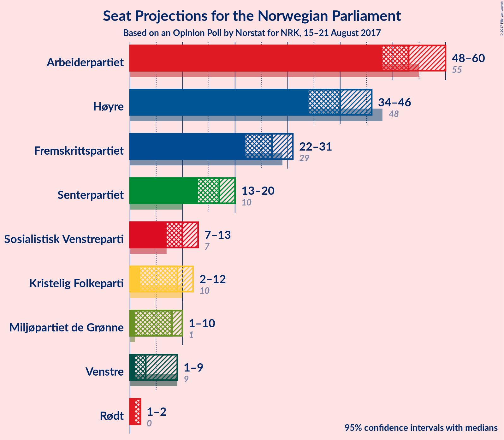

# Opinion Poll by Norstat for NRK, 15–21 August 2017

<a href="#voting-intentions">Voting Intentions</a> | <a href="#seats">Seats</a> | <a href="#coalitions">Coalitions</a> | <a href="#technical-information">Technical Information</a>

## Voting Intentions

### Confidence Intervals

| Party | Last Result | Poll Result | 80% Confidence Interval | 90% Confidence Interval | 95% Confidence Interval | 99% Confidence Interval |
|:-----:|:-----------:|:-----------:|:-----------------------:|:-----------------------:|:-----------------------:|:-----------------------:|
| Arbeiderpartiet | 30.8% | 29.0% | 27.0–31.2% |26.4–31.8% |25.9–32.3% |25.0–33.3% |
| Høyre | 26.8% | 22.4% | 20.6–24.4% |20.1–25.0% |19.6–25.5% |18.8–26.5% |
| Fremskrittspartiet | 16.3% | 14.2% | 12.7–15.9% |12.3–16.4% |11.9–16.8% |11.2–17.7% |
| Senterpartiet | 5.5% | 9.5% | 8.3–11.0% |8.0–11.4% |7.7–11.8% |7.1–12.6% |
| Sosialistisk Venstreparti | 4.1% | 5.5% | 4.6–6.8% |4.4–7.1% |4.1–7.4% |3.7–8.0% |
| Kristelig Folkeparti | 5.6% | 5.2% | 4.3–6.3% |4.0–6.7% |3.8–7.0% |3.4–7.5% |
| Miljøpartiet de Grønne | 2.8% | 4.4% | 3.6–5.5% |3.3–5.8% |3.2–6.1% |2.8–6.6% |
| Venstre | 5.2% | 4.0% | 3.2–5.1% |3.0–5.3% |2.8–5.6% |2.5–6.2% |
| Rødt | 1.1% | 2.7% | 2.1–3.6% |1.9–3.9% |1.8–4.1% |1.5–4.6% |

*Note:* The poll result column reflects the actual value used in the calculations. Published results may vary slightly, and in addition be rounded to fewer digits.

## Seats

### Confidence Intervals

| Party | Last Result | Median | 80% Confidence Interval | 90% Confidence Interval | 95% Confidence Interval | 99% Confidence Interval |
|:-----:|:-----------:|:------:|:-----------------------:|:-----------------------:|:-----------------------:|:-----------------------:|
| <a href="#arbeiderpartiet">Arbeiderpartiet</a> | 55 | 52 | 49–56 |48–58 |47–58 |46–61 |
| <a href="#høyre">Høyre</a> | 48 | 41 | 36–43 |36–43 |34–47 |33–48 |
| <a href="#fremskrittspartiet">Fremskrittspartiet</a> | 29 | 27 | 23–30 |23–32 |21–33 |19–33 |
| <a href="#senterpartiet">Senterpartiet</a> | 10 | 18 | 16–19 |14–19 |13–20 |11–22 |
| <a href="#sosialistisk-venstreparti">Sosialistisk Venstreparti</a> | 7 | 10 | 8–12 |8–12 |7–12 |2–13 |
| <a href="#kristelig-folkeparti">Kristelig Folkeparti</a> | 10 | 9 | 8–11 |2–11 |2–12 |2–13 |
| <a href="#miljøpartiet-de-grønne">Miljøpartiet de Grønne</a> | 1 | 8 | 6–9 |2–10 |1–10 |1–12 |
| <a href="#venstre">Venstre</a> | 9 | 3 | 1–9 |1–9 |1–9 |1–11 |
| <a href="#rødt">Rødt</a> | 0 | 1 | 1–2 |1–2 |1–6 |1–8 |

### Arbeiderpartiet

| Number of Seats | Probability | Accumulated | Special Marks |
|:---------------:|:-----------:|:-----------:|:-------------:|
| 45 | 0.1% | 100% |  |
| 46 | 2% | 99.9% |  |
| 47 | 2% | 98% |  |
| 48 | 1.3% | 96% |  |
| 49 | 6% | 94% |  |
| 50 | 27% | 88% |  |
| 51 | 1.3% | 61% |  |
| 52 | 39% | 60% | Median |
| 53 | 4% | 22% |  |
| 54 | 3% | 18% |  |
| 55 | 3% | 15% | Last Result |
| 56 | 2% | 12% |  |
| 57 | 1.2% | 10% |  |
| 58 | 6% | 9% |  |
| 59 | 0.7% | 2% |  |
| 60 | 0.8% | 1.4% |  |
| 61 | 0.1% | 0.6% |  |
| 62 | 0.3% | 0.5% |  |
| 63 | 0% | 0.1% |  |
| 64 | 0.1% | 0.1% |  |
| 65 | 0% | 0% |  |

### Høyre

| Number of Seats | Probability | Accumulated | Special Marks |
|:---------------:|:-----------:|:-----------:|:-------------:|
| 32 | 0.1% | 100% |  |
| 33 | 1.2% | 99.9% |  |
| 34 | 3% | 98.7% |  |
| 35 | 0.8% | 96% |  |
| 36 | 11% | 95% |  |
| 37 | 4% | 85% |  |
| 38 | 20% | 81% |  |
| 39 | 2% | 61% |  |
| 40 | 4% | 59% |  |
| 41 | 31% | 55% | Median |
| 42 | 13% | 24% |  |
| 43 | 7% | 11% |  |
| 44 | 0.4% | 5% |  |
| 45 | 0.6% | 4% |  |
| 46 | 1.0% | 4% |  |
| 47 | 2% | 3% |  |
| 48 | 0.5% | 0.9% | Last Result |
| 49 | 0.2% | 0.4% |  |
| 50 | 0.2% | 0.2% |  |
| 51 | 0% | 0% |  |

### Fremskrittspartiet

| Number of Seats | Probability | Accumulated | Special Marks |
|:---------------:|:-----------:|:-----------:|:-------------:|
| 17 | 0.1% | 100% |  |
| 18 | 0.2% | 99.9% |  |
| 19 | 0.3% | 99.7% |  |
| 20 | 1.0% | 99.4% |  |
| 21 | 1.5% | 98% |  |
| 22 | 0.6% | 97% |  |
| 23 | 12% | 96% |  |
| 24 | 2% | 84% |  |
| 25 | 6% | 82% |  |
| 26 | 19% | 76% |  |
| 27 | 11% | 57% | Median |
| 28 | 33% | 45% |  |
| 29 | 2% | 12% | Last Result |
| 30 | 0.6% | 10% |  |
| 31 | 2% | 10% |  |
| 32 | 3% | 7% |  |
| 33 | 4% | 4% |  |
| 34 | 0% | 0% |  |

### Senterpartiet

| Number of Seats | Probability | Accumulated | Special Marks |
|:---------------:|:-----------:|:-----------:|:-------------:|
| 10 | 0.1% | 100% | Last Result |
| 11 | 1.4% | 99.9% |  |
| 12 | 0.6% | 98% |  |
| 13 | 3% | 98% |  |
| 14 | 0.9% | 95% |  |
| 15 | 1.4% | 94% |  |
| 16 | 8% | 93% |  |
| 17 | 32% | 85% |  |
| 18 | 39% | 53% | Median |
| 19 | 10% | 14% |  |
| 20 | 2% | 4% |  |
| 21 | 1.0% | 2% |  |
| 22 | 0.4% | 0.8% |  |
| 23 | 0.1% | 0.4% |  |
| 24 | 0.2% | 0.2% |  |
| 25 | 0% | 0% |  |

### Sosialistisk Venstreparti

| Number of Seats | Probability | Accumulated | Special Marks |
|:---------------:|:-----------:|:-----------:|:-------------:|
| 1 | 0.1% | 100% |  |
| 2 | 1.3% | 99.9% |  |
| 3 | 0% | 98.6% |  |
| 4 | 0% | 98.6% |  |
| 5 | 0% | 98.6% |  |
| 6 | 0% | 98.6% |  |
| 7 | 1.2% | 98.6% | Last Result |
| 8 | 9% | 97% |  |
| 9 | 5% | 88% |  |
| 10 | 37% | 83% | Median |
| 11 | 35% | 46% |  |
| 12 | 9% | 11% |  |
| 13 | 1.3% | 2% |  |
| 14 | 0.4% | 0.5% |  |
| 15 | 0.1% | 0.1% |  |
| 16 | 0% | 0% |  |

### Kristelig Folkeparti

| Number of Seats | Probability | Accumulated | Special Marks |
|:---------------:|:-----------:|:-----------:|:-------------:|
| 1 | 0.4% | 100% |  |
| 2 | 5% | 99.6% |  |
| 3 | 1.2% | 94% |  |
| 4 | 0% | 93% |  |
| 5 | 0% | 93% |  |
| 6 | 0.2% | 93% |  |
| 7 | 3% | 93% |  |
| 8 | 19% | 90% |  |
| 9 | 26% | 72% | Median |
| 10 | 35% | 46% | Last Result |
| 11 | 7% | 11% |  |
| 12 | 2% | 4% |  |
| 13 | 2% | 2% |  |
| 14 | 0% | 0.2% |  |
| 15 | 0.1% | 0.1% |  |
| 16 | 0% | 0% |  |

### Miljøpartiet de Grønne

| Number of Seats | Probability | Accumulated | Special Marks |
|:---------------:|:-----------:|:-----------:|:-------------:|
| 1 | 5% | 100% | Last Result |
| 2 | 2% | 95% |  |
| 3 | 3% | 93% |  |
| 4 | 0.3% | 90% |  |
| 5 | 0% | 90% |  |
| 6 | 1.0% | 90% |  |
| 7 | 6% | 89% |  |
| 8 | 53% | 83% | Median |
| 9 | 22% | 30% |  |
| 10 | 7% | 8% |  |
| 11 | 0.8% | 2% |  |
| 12 | 0.7% | 0.7% |  |
| 13 | 0% | 0.1% |  |
| 14 | 0% | 0% |  |

### Venstre

| Number of Seats | Probability | Accumulated | Special Marks |
|:---------------:|:-----------:|:-----------:|:-------------:|
| 0 | 0.1% | 100% |  |
| 1 | 34% | 99.9% |  |
| 2 | 12% | 66% |  |
| 3 | 7% | 54% | Median |
| 4 | 0% | 46% |  |
| 5 | 0% | 46% |  |
| 6 | 0.4% | 46% |  |
| 7 | 9% | 46% |  |
| 8 | 16% | 37% |  |
| 9 | 19% | 21% | Last Result |
| 10 | 2% | 2% |  |
| 11 | 0.5% | 0.7% |  |
| 12 | 0.2% | 0.2% |  |
| 13 | 0% | 0% |  |

### Rødt

| Number of Seats | Probability | Accumulated | Special Marks |
|:---------------:|:-----------:|:-----------:|:-------------:|
| 0 | 0% | 100% | Last Result |
| 1 | 78% | 100% | Median |
| 2 | 20% | 22% |  |
| 3 | 0% | 3% |  |
| 4 | 0% | 3% |  |
| 5 | 0% | 3% |  |
| 6 | 1.4% | 3% |  |
| 7 | 0.7% | 1.2% |  |
| 8 | 0.5% | 0.6% |  |
| 9 | 0.1% | 0.1% |  |
| 10 | 0% | 0% |  |

## Coalitions

### Confidence Intervals

| Coalition | Last Result | Median | Majority? | 80% Confidence Interval | 90% Confidence Interval | 95% Confidence Interval | 99% Confidence Interval |
|:---------:|:-----------:|:------:|:---------:|:-----------------------:|:-----------------------:|:-----------------------:|:-----------------------:|
| Høyre – Fremskrittspartiet – Senterpartiet – Kristelig Folkeparti – Venstre | 106 | 98 | 99.8% | 93–103 | 90–104 | 90–105 | 86–107 |
| Arbeiderpartiet – Senterpartiet – Sosialistisk Venstreparti – Kristelig Folkeparti – Miljøpartiet de Grønne | 83 | 96 | 99.6% | 90–101 | 88–102 | 87–103 | 85–107 |
| Arbeiderpartiet – Senterpartiet – Sosialistisk Venstreparti – Miljøpartiet de Grønne – Rødt | 73 | 89 | 87% | 82–93 | 82–97 | 78–97 | 78–99 |
| Arbeiderpartiet – Senterpartiet – Sosialistisk Venstreparti – Miljøpartiet de Grønne | 73 | 88 | 83% | 81–91 | 80–96 | 77–96 | 77–97 |
| Høyre – Fremskrittspartiet – Kristelig Folkeparti – Miljøpartiet de Grønne – Venstre | 97 | 88 | 84% | 80–92 | 80–95 | 79–95 | 76–96 |
| Arbeiderpartiet – Senterpartiet – Sosialistisk Venstreparti – Rødt | 72 | 81 | 14% | 76–86 | 74–89 | 73–89 | 72–91 |
| Arbeiderpartiet – Senterpartiet – Sosialistisk Venstreparti | 72 | 80 | 9% | 73–84 | 73–88 | 72–88 | 71–89 |
| Høyre – Fremskrittspartiet – Kristelig Folkeparti – Venstre | 96 | 80 | 12% | 75–86 | 72–87 | 71–88 | 70–91 |
| Arbeiderpartiet – Senterpartiet – Kristelig Folkeparti | 75 | 78 | 7% | 74–82 | 73–85 | 72–85 | 69–87 |
| Arbeiderpartiet – Senterpartiet | 65 | 70 | 0% | 65–75 | 63–76 | 63–76 | 62–79 |
| Høyre – Fremskrittspartiet | 77 | 67 | 0% | 61–71 | 61–72 | 58–75 | 56–79 |
| Arbeiderpartiet – Sosialistisk Venstreparti | 62 | 62 | 0% | 58–67 | 57–70 | 55–70 | 55–70 |
| Høyre – Kristelig Folkeparti – Venstre | 67 | 52 | 0% | 49–58 | 46–59 | 46–60 | 41–63 |
| Senterpartiet – Kristelig Folkeparti – Venstre | 29 | 31 | 0% | 27–35 | 23–35 | 21–37 | 21–39 |

### Høyre – Fremskrittspartiet – Senterpartiet – Kristelig Folkeparti – Venstre

| Number of Seats | Probability | Accumulated | Special Marks |
|:---------------:|:-----------:|:-----------:|:-------------:|
| 83 | 0% | 100% |  |
| 84 | 0.1% | 99.9% |  |
| 85 | 0.1% | 99.8% | Majority |
| 86 | 0.4% | 99.7% |  |
| 87 | 0.2% | 99.3% |  |
| 88 | 0.5% | 99.2% |  |
| 89 | 0.9% | 98.7% |  |
| 90 | 5% | 98% |  |
| 91 | 2% | 93% |  |
| 92 | 0.6% | 91% |  |
| 93 | 1.1% | 90% |  |
| 94 | 3% | 89% |  |
| 95 | 8% | 86% |  |
| 96 | 6% | 79% |  |
| 97 | 3% | 73% |  |
| 98 | 39% | 69% | Median |
| 99 | 17% | 30% |  |
| 100 | 1.3% | 13% |  |
| 101 | 0.2% | 12% |  |
| 102 | 1.5% | 12% |  |
| 103 | 5% | 10% |  |
| 104 | 2% | 5% |  |
| 105 | 0.8% | 3% |  |
| 106 | 0.1% | 2% | Last Result |
| 107 | 2% | 2% |  |
| 108 | 0% | 0.2% |  |
| 109 | 0.1% | 0.2% |  |
| 110 | 0% | 0.1% |  |
| 111 | 0.1% | 0.1% |  |
| 112 | 0% | 0% |  |

### Arbeiderpartiet – Senterpartiet – Sosialistisk Venstreparti – Kristelig Folkeparti – Miljøpartiet de Grønne

| Number of Seats | Probability | Accumulated | Special Marks |
|:---------------:|:-----------:|:-----------:|:-------------:|
| 82 | 0% | 100% |  |
| 83 | 0.1% | 99.9% | Last Result |
| 84 | 0.2% | 99.8% |  |
| 85 | 0.2% | 99.6% | Majority |
| 86 | 2% | 99.4% |  |
| 87 | 1.0% | 98% |  |
| 88 | 2% | 97% |  |
| 89 | 1.1% | 95% |  |
| 90 | 5% | 94% |  |
| 91 | 4% | 88% |  |
| 92 | 2% | 84% |  |
| 93 | 1.2% | 82% |  |
| 94 | 1.3% | 81% |  |
| 95 | 26% | 79% |  |
| 96 | 3% | 53% |  |
| 97 | 0.4% | 50% | Median |
| 98 | 35% | 50% |  |
| 99 | 0.4% | 14% |  |
| 100 | 3% | 14% |  |
| 101 | 2% | 11% |  |
| 102 | 6% | 10% |  |
| 103 | 2% | 4% |  |
| 104 | 0.3% | 1.3% |  |
| 105 | 0% | 1.1% |  |
| 106 | 0.1% | 1.0% |  |
| 107 | 0.7% | 0.9% |  |
| 108 | 0.2% | 0.2% |  |
| 109 | 0% | 0% |  |

### Arbeiderpartiet – Senterpartiet – Sosialistisk Venstreparti – Miljøpartiet de Grønne – Rødt

| Number of Seats | Probability | Accumulated | Special Marks |
|:---------------:|:-----------:|:-----------:|:-------------:|
| 73 | 0% | 100% | Last Result |
| 74 | 0% | 100% |  |
| 75 | 0% | 99.9% |  |
| 76 | 0.2% | 99.9% |  |
| 77 | 0.2% | 99.7% |  |
| 78 | 2% | 99.6% |  |
| 79 | 0.1% | 97% |  |
| 80 | 0.3% | 97% |  |
| 81 | 0.9% | 97% |  |
| 82 | 7% | 96% |  |
| 83 | 0.7% | 89% |  |
| 84 | 0.7% | 88% |  |
| 85 | 2% | 87% | Majority |
| 86 | 2% | 85% |  |
| 87 | 16% | 83% |  |
| 88 | 14% | 67% |  |
| 89 | 28% | 53% | Median |
| 90 | 3% | 25% |  |
| 91 | 4% | 22% |  |
| 92 | 3% | 18% |  |
| 93 | 7% | 15% |  |
| 94 | 2% | 8% |  |
| 95 | 0.2% | 7% |  |
| 96 | 0.6% | 7% |  |
| 97 | 4% | 6% |  |
| 98 | 1.1% | 2% |  |
| 99 | 1.1% | 1.3% |  |
| 100 | 0% | 0.2% |  |
| 101 | 0.2% | 0.2% |  |
| 102 | 0% | 0% |  |

### Arbeiderpartiet – Senterpartiet – Sosialistisk Venstreparti – Miljøpartiet de Grønne

| Number of Seats | Probability | Accumulated | Special Marks |
|:---------------:|:-----------:|:-----------:|:-------------:|
| 73 | 0% | 100% | Last Result |
| 74 | 0% | 99.9% |  |
| 75 | 0.2% | 99.9% |  |
| 76 | 0.2% | 99.7% |  |
| 77 | 2% | 99.5% |  |
| 78 | 0.5% | 97% |  |
| 79 | 0.8% | 97% |  |
| 80 | 2% | 96% |  |
| 81 | 7% | 94% |  |
| 82 | 0.5% | 86% |  |
| 83 | 2% | 86% |  |
| 84 | 1.2% | 84% |  |
| 85 | 2% | 83% | Majority |
| 86 | 16% | 81% |  |
| 87 | 13% | 64% |  |
| 88 | 27% | 51% | Median |
| 89 | 4% | 25% |  |
| 90 | 6% | 21% |  |
| 91 | 6% | 15% |  |
| 92 | 1.3% | 9% |  |
| 93 | 1.2% | 7% |  |
| 94 | 0.6% | 6% |  |
| 95 | 0% | 6% |  |
| 96 | 4% | 6% |  |
| 97 | 2% | 2% |  |
| 98 | 0.2% | 0.2% |  |
| 99 | 0% | 0% |  |

### Høyre – Fremskrittspartiet – Kristelig Folkeparti – Miljøpartiet de Grønne – Venstre

| Number of Seats | Probability | Accumulated | Special Marks |
|:---------------:|:-----------:|:-----------:|:-------------:|
| 73 | 0% | 100% |  |
| 74 | 0% | 99.9% |  |
| 75 | 0.2% | 99.9% |  |
| 76 | 0.8% | 99.8% |  |
| 77 | 0% | 99.0% |  |
| 78 | 1.0% | 98.9% |  |
| 79 | 1.3% | 98% |  |
| 80 | 7% | 97% |  |
| 81 | 0.6% | 90% |  |
| 82 | 0.5% | 89% |  |
| 83 | 1.1% | 89% |  |
| 84 | 4% | 88% |  |
| 85 | 8% | 84% | Majority |
| 86 | 1.0% | 76% |  |
| 87 | 2% | 75% |  |
| 88 | 32% | 73% | Median |
| 89 | 0.5% | 42% |  |
| 90 | 28% | 41% |  |
| 91 | 1.2% | 13% |  |
| 92 | 2% | 12% |  |
| 93 | 2% | 10% |  |
| 94 | 1.0% | 8% |  |
| 95 | 5% | 7% |  |
| 96 | 2% | 2% |  |
| 97 | 0% | 0.2% | Last Result |
| 98 | 0% | 0.2% |  |
| 99 | 0.1% | 0.2% |  |
| 100 | 0% | 0% |  |

### Arbeiderpartiet – Senterpartiet – Sosialistisk Venstreparti – Rødt

| Number of Seats | Probability | Accumulated | Special Marks |
|:---------------:|:-----------:|:-----------:|:-------------:|
| 69 | 0% | 100% |  |
| 70 | 0.1% | 99.9% |  |
| 71 | 0% | 99.8% |  |
| 72 | 1.1% | 99.8% | Last Result |
| 73 | 2% | 98.7% |  |
| 74 | 5% | 97% |  |
| 75 | 1.3% | 92% |  |
| 76 | 2% | 91% |  |
| 77 | 2% | 88% |  |
| 78 | 0.9% | 87% |  |
| 79 | 29% | 86% |  |
| 80 | 0.6% | 57% |  |
| 81 | 32% | 56% | Median |
| 82 | 2% | 25% |  |
| 83 | 1.1% | 23% |  |
| 84 | 7% | 22% |  |
| 85 | 3% | 14% | Majority |
| 86 | 1.2% | 11% |  |
| 87 | 0.4% | 10% |  |
| 88 | 0.6% | 9% |  |
| 89 | 7% | 9% |  |
| 90 | 1.1% | 2% |  |
| 91 | 0.5% | 0.8% |  |
| 92 | 0% | 0.3% |  |
| 93 | 0.2% | 0.3% |  |
| 94 | 0% | 0% |  |

### Arbeiderpartiet – Senterpartiet – Sosialistisk Venstreparti

| Number of Seats | Probability | Accumulated | Special Marks |
|:---------------:|:-----------:|:-----------:|:-------------:|
| 68 | 0% | 100% |  |
| 69 | 0.2% | 99.9% |  |
| 70 | 0% | 99.8% |  |
| 71 | 1.1% | 99.7% |  |
| 72 | 2% | 98.6% | Last Result |
| 73 | 7% | 97% |  |
| 74 | 1.1% | 90% |  |
| 75 | 3% | 89% |  |
| 76 | 0.5% | 85% |  |
| 77 | 2% | 85% |  |
| 78 | 27% | 83% |  |
| 79 | 2% | 56% |  |
| 80 | 32% | 55% | Median |
| 81 | 1.0% | 23% |  |
| 82 | 7% | 22% |  |
| 83 | 3% | 15% |  |
| 84 | 2% | 11% |  |
| 85 | 0.8% | 9% | Majority |
| 86 | 0.3% | 9% |  |
| 87 | 1.1% | 8% |  |
| 88 | 6% | 7% |  |
| 89 | 1.2% | 1.3% |  |
| 90 | 0.1% | 0.1% |  |
| 91 | 0% | 0.1% |  |
| 92 | 0% | 0% |  |

### Høyre – Fremskrittspartiet – Kristelig Folkeparti – Venstre

| Number of Seats | Probability | Accumulated | Special Marks |
|:---------------:|:-----------:|:-----------:|:-------------:|
| 68 | 0.3% | 100% |  |
| 69 | 0% | 99.6% |  |
| 70 | 1.1% | 99.6% |  |
| 71 | 1.3% | 98% |  |
| 72 | 4% | 97% |  |
| 73 | 1.1% | 93% |  |
| 74 | 0.6% | 92% |  |
| 75 | 2% | 92% |  |
| 76 | 7% | 90% |  |
| 77 | 3% | 83% |  |
| 78 | 4% | 80% |  |
| 79 | 3% | 76% |  |
| 80 | 27% | 72% | Median |
| 81 | 14% | 45% |  |
| 82 | 16% | 31% |  |
| 83 | 2% | 15% |  |
| 84 | 2% | 13% |  |
| 85 | 2% | 12% | Majority |
| 86 | 0.7% | 10% |  |
| 87 | 7% | 10% |  |
| 88 | 0.6% | 3% |  |
| 89 | 0.3% | 2% |  |
| 90 | 0% | 2% |  |
| 91 | 1.5% | 2% |  |
| 92 | 0.1% | 0.3% |  |
| 93 | 0.1% | 0.1% |  |
| 94 | 0% | 0% |  |
| 95 | 0% | 0% |  |
| 96 | 0% | 0% | Last Result |

### Arbeiderpartiet – Senterpartiet – Kristelig Folkeparti

| Number of Seats | Probability | Accumulated | Special Marks |
|:---------------:|:-----------:|:-----------:|:-------------:|
| 67 | 0.2% | 100% |  |
| 68 | 0% | 99.8% |  |
| 69 | 0.6% | 99.8% |  |
| 70 | 0.1% | 99.2% |  |
| 71 | 1.4% | 99.1% |  |
| 72 | 0.5% | 98% |  |
| 73 | 4% | 97% |  |
| 74 | 8% | 94% |  |
| 75 | 11% | 86% | Last Result |
| 76 | 17% | 74% |  |
| 77 | 0.6% | 57% |  |
| 78 | 10% | 57% |  |
| 79 | 2% | 46% | Median |
| 80 | 27% | 45% |  |
| 81 | 2% | 18% |  |
| 82 | 7% | 16% |  |
| 83 | 0.7% | 9% |  |
| 84 | 1.1% | 9% |  |
| 85 | 5% | 7% | Majority |
| 86 | 1.0% | 2% |  |
| 87 | 1.0% | 1.3% |  |
| 88 | 0.1% | 0.3% |  |
| 89 | 0.1% | 0.2% |  |
| 90 | 0.1% | 0.1% |  |
| 91 | 0.1% | 0.1% |  |
| 92 | 0% | 0% |  |

### Arbeiderpartiet – Senterpartiet

| Number of Seats | Probability | Accumulated | Special Marks |
|:---------------:|:-----------:|:-----------:|:-------------:|
| 60 | 0.1% | 100% |  |
| 61 | 0.2% | 99.9% |  |
| 62 | 0.3% | 99.7% |  |
| 63 | 5% | 99.4% |  |
| 64 | 1.2% | 95% |  |
| 65 | 6% | 94% | Last Result |
| 66 | 0.8% | 88% |  |
| 67 | 27% | 87% |  |
| 68 | 2% | 60% |  |
| 69 | 3% | 58% |  |
| 70 | 30% | 55% | Median |
| 71 | 8% | 24% |  |
| 72 | 3% | 16% |  |
| 73 | 2% | 13% |  |
| 74 | 0.8% | 11% |  |
| 75 | 1.3% | 10% |  |
| 76 | 7% | 9% |  |
| 77 | 1.4% | 2% |  |
| 78 | 0% | 0.6% |  |
| 79 | 0.1% | 0.5% |  |
| 80 | 0.1% | 0.4% |  |
| 81 | 0% | 0.3% |  |
| 82 | 0.2% | 0.3% |  |
| 83 | 0% | 0.1% |  |
| 84 | 0% | 0% |  |

### Høyre – Fremskrittspartiet

| Number of Seats | Probability | Accumulated | Special Marks |
|:---------------:|:-----------:|:-----------:|:-------------:|
| 54 | 0.1% | 100% |  |
| 55 | 0% | 99.9% |  |
| 56 | 0.6% | 99.9% |  |
| 57 | 0.3% | 99.3% |  |
| 58 | 2% | 99.0% |  |
| 59 | 0.5% | 97% |  |
| 60 | 1.5% | 97% |  |
| 61 | 6% | 95% |  |
| 62 | 0.4% | 90% |  |
| 63 | 7% | 89% |  |
| 64 | 16% | 82% |  |
| 65 | 14% | 66% |  |
| 66 | 0.9% | 53% |  |
| 67 | 3% | 52% |  |
| 68 | 2% | 49% | Median |
| 69 | 34% | 46% |  |
| 70 | 0.6% | 12% |  |
| 71 | 6% | 11% |  |
| 72 | 0.7% | 5% |  |
| 73 | 2% | 5% |  |
| 74 | 0.1% | 3% |  |
| 75 | 1.0% | 3% |  |
| 76 | 0.2% | 2% |  |
| 77 | 0.1% | 2% | Last Result |
| 78 | 0% | 2% |  |
| 79 | 1.5% | 2% |  |
| 80 | 0.1% | 0.1% |  |
| 81 | 0% | 0% |  |

### Arbeiderpartiet – Sosialistisk Venstreparti

| Number of Seats | Probability | Accumulated | Special Marks |
|:---------------:|:-----------:|:-----------:|:-------------:|
| 52 | 0% | 100% |  |
| 53 | 0.2% | 99.9% |  |
| 54 | 0.1% | 99.7% |  |
| 55 | 2% | 99.6% |  |
| 56 | 0.5% | 97% |  |
| 57 | 6% | 97% |  |
| 58 | 3% | 91% |  |
| 59 | 3% | 89% |  |
| 60 | 2% | 86% |  |
| 61 | 27% | 84% |  |
| 62 | 31% | 56% | Last Result, Median |
| 63 | 7% | 25% |  |
| 64 | 4% | 18% |  |
| 65 | 1.1% | 15% |  |
| 66 | 2% | 14% |  |
| 67 | 3% | 11% |  |
| 68 | 0.7% | 8% |  |
| 69 | 1.2% | 8% |  |
| 70 | 6% | 6% |  |
| 71 | 0.2% | 0.4% |  |
| 72 | 0.1% | 0.2% |  |
| 73 | 0% | 0.1% |  |
| 74 | 0% | 0.1% |  |
| 75 | 0.1% | 0.1% |  |
| 76 | 0% | 0% |  |

### Høyre – Kristelig Folkeparti – Venstre

| Number of Seats | Probability | Accumulated | Special Marks |
|:---------------:|:-----------:|:-----------:|:-------------:|
| 41 | 0.9% | 100% |  |
| 42 | 0% | 99.1% |  |
| 43 | 0% | 99.1% |  |
| 44 | 0.1% | 99.0% |  |
| 45 | 0.7% | 99.0% |  |
| 46 | 4% | 98% |  |
| 47 | 2% | 94% |  |
| 48 | 0.9% | 92% |  |
| 49 | 6% | 91% |  |
| 50 | 5% | 85% |  |
| 51 | 0.3% | 80% |  |
| 52 | 31% | 80% |  |
| 53 | 6% | 49% | Median |
| 54 | 5% | 43% |  |
| 55 | 0.7% | 38% |  |
| 56 | 16% | 37% |  |
| 57 | 1.4% | 21% |  |
| 58 | 13% | 20% |  |
| 59 | 4% | 7% |  |
| 60 | 2% | 3% |  |
| 61 | 0.1% | 0.9% |  |
| 62 | 0.3% | 0.8% |  |
| 63 | 0.1% | 0.5% |  |
| 64 | 0.1% | 0.4% |  |
| 65 | 0.3% | 0.3% |  |
| 66 | 0% | 0% |  |
| 67 | 0% | 0% | Last Result |

### Senterpartiet – Kristelig Folkeparti – Venstre

| Number of Seats | Probability | Accumulated | Special Marks |
|:---------------:|:-----------:|:-----------:|:-------------:|
| 18 | 0% | 100% |  |
| 19 | 0.1% | 99.9% |  |
| 20 | 0.2% | 99.8% |  |
| 21 | 4% | 99.7% |  |
| 22 | 0.6% | 96% |  |
| 23 | 0.3% | 95% |  |
| 24 | 0.7% | 95% |  |
| 25 | 2% | 94% |  |
| 26 | 2% | 93% |  |
| 27 | 3% | 90% |  |
| 28 | 3% | 87% |  |
| 29 | 29% | 84% | Last Result |
| 30 | 3% | 55% | Median |
| 31 | 2% | 52% |  |
| 32 | 10% | 50% |  |
| 33 | 12% | 39% |  |
| 34 | 2% | 28% |  |
| 35 | 22% | 26% |  |
| 36 | 0.7% | 4% |  |
| 37 | 1.5% | 3% |  |
| 38 | 1.3% | 2% |  |
| 39 | 0.2% | 0.6% |  |
| 40 | 0.1% | 0.3% |  |
| 41 | 0.2% | 0.2% |  |
| 42 | 0% | 0% |  |

## Technical Information

### Opinion Poll

+ **Pollster:** Norstat
+ **Media:** NRK
+ **Fieldwork period:** 15–21 August 2017

### Calculations

+ **Sample size:** 776
+ **Simulations done:** 131,072
+ **Error estimate:** 2.32%

