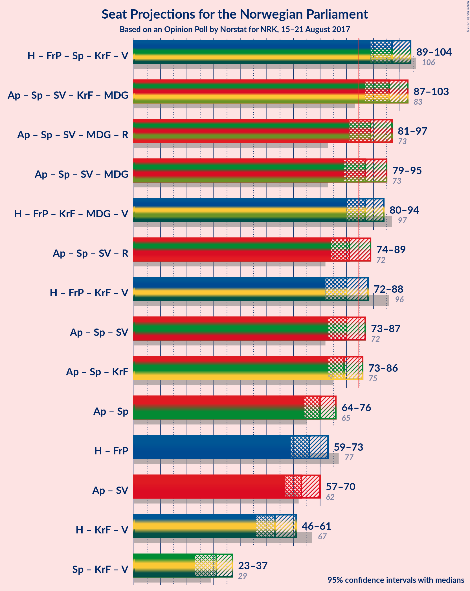

# Opinion Poll by Norstat for NRK, 15–21 August 2017

<a href="#voting-intentions">Voting Intentions</a> | <a href="#seats">Seats</a> | <a href="#coalitions">Coalitions</a> | <a href="#technical-information">Technical Information</a>

## Voting Intentions

### Confidence Intervals

| Party | Last Result | Poll Result | 80% Confidence Interval | 90% Confidence Interval | 95% Confidence Interval | 99% Confidence Interval |
|:-----:|:-----------:|:-----------:|:-----------------------:|:-----------------------:|:-----------------------:|:-----------------------:|
| Arbeiderpartiet | 30.8% | 29.0% | 27.0–31.2% |26.4–31.8% |25.9–32.3% |25.0–33.3% |
| Høyre | 26.8% | 22.4% | 20.6–24.4% |20.1–25.0% |19.6–25.5% |18.8–26.5% |
| Fremskrittspartiet | 16.3% | 14.2% | 12.7–15.9% |12.3–16.4% |11.9–16.8% |11.2–17.7% |
| Senterpartiet | 5.5% | 9.5% | 8.3–11.0% |8.0–11.4% |7.7–11.8% |7.1–12.6% |
| Sosialistisk Venstreparti | 4.1% | 5.5% | 4.6–6.8% |4.4–7.1% |4.1–7.4% |3.7–8.0% |
| Kristelig Folkeparti | 5.6% | 5.2% | 4.3–6.3% |4.0–6.7% |3.8–7.0% |3.4–7.5% |
| Miljøpartiet de Grønne | 2.8% | 4.4% | 3.6–5.5% |3.3–5.8% |3.2–6.1% |2.8–6.6% |
| Venstre | 5.2% | 4.0% | 3.2–5.1% |3.0–5.3% |2.8–5.6% |2.5–6.2% |
| Rødt | 1.1% | 2.7% | 2.1–3.6% |1.9–3.9% |1.8–4.1% |1.5–4.6% |

*Note:* The poll result column reflects the actual value used in the calculations. Published results may vary slightly, and in addition be rounded to fewer digits.

## Seats

### Confidence Intervals

| Party | Last Result | Median | 80% Confidence Interval | 90% Confidence Interval | 95% Confidence Interval | 99% Confidence Interval |
|:-----:|:-----------:|:------:|:-----------------------:|:-----------------------:|:-----------------------:|:-----------------------:|
| <a href="#arbeiderpartiet">Arbeiderpartiet</a> | 55 | 53 | 49–57 |49–59 |48–60 |46–62 |
| <a href="#høyre">Høyre</a> | 48 | 40 | 37–44 |36–45 |34–46 |33–47 |
| <a href="#fremskrittspartiet">Fremskrittspartiet</a> | 29 | 27 | 24–29 |23–29 |22–31 |19–33 |
| <a href="#senterpartiet">Senterpartiet</a> | 10 | 17 | 15–19 |14–19 |13–20 |12–22 |
| <a href="#sosialistisk-venstreparti">Sosialistisk Venstreparti</a> | 7 | 10 | 8–12 |8–13 |7–13 |2–14 |
| <a href="#kristelig-folkeparti">Kristelig Folkeparti</a> | 10 | 9 | 7–11 |7–11 |2–12 |2–13 |
| <a href="#miljøpartiet-de-grønne">Miljøpartiet de Grønne</a> | 1 | 8 | 3–9 |2–10 |1–10 |1–11 |
| <a href="#venstre">Venstre</a> | 9 | 3 | 1–9 |1–9 |1–9 |1–10 |
| <a href="#rødt">Rødt</a> | 0 | 2 | 1–2 |1–2 |1–2 |1–7 |

### Arbeiderpartiet

| Number of Seats | Probability | Accumulated | Special Marks |
|:---------------:|:-----------:|:-----------:|:-------------:|
| 45 | 0.1% | 100% |  |
| 46 | 0.6% | 99.8% |  |
| 47 | 1.0% | 99.2% |  |
| 48 | 2% | 98% |  |
| 49 | 9% | 96% |  |
| 50 | 9% | 87% |  |
| 51 | 7% | 78% |  |
| 52 | 16% | 71% |  |
| 53 | 15% | 55% | Median |
| 54 | 12% | 39% |  |
| 55 | 9% | 27% | Last Result |
| 56 | 6% | 18% |  |
| 57 | 3% | 11% |  |
| 58 | 1.3% | 9% |  |
| 59 | 5% | 7% |  |
| 60 | 1.0% | 3% |  |
| 61 | 1.0% | 2% |  |
| 62 | 0.5% | 0.7% |  |
| 63 | 0.1% | 0.2% |  |
| 64 | 0.1% | 0.2% |  |
| 65 | 0.1% | 0.1% |  |
| 66 | 0% | 0% |  |

### Høyre

| Number of Seats | Probability | Accumulated | Special Marks |
|:---------------:|:-----------:|:-----------:|:-------------:|
| 32 | 0.1% | 100% |  |
| 33 | 1.3% | 99.9% |  |
| 34 | 1.5% | 98.6% |  |
| 35 | 2% | 97% |  |
| 36 | 3% | 95% |  |
| 37 | 17% | 92% |  |
| 38 | 17% | 76% |  |
| 39 | 8% | 59% |  |
| 40 | 17% | 51% | Median |
| 41 | 14% | 34% |  |
| 42 | 6% | 21% |  |
| 43 | 4% | 14% |  |
| 44 | 5% | 11% |  |
| 45 | 2% | 6% |  |
| 46 | 3% | 4% |  |
| 47 | 1.2% | 2% |  |
| 48 | 0.2% | 0.4% | Last Result |
| 49 | 0.1% | 0.2% |  |
| 50 | 0.1% | 0.1% |  |
| 51 | 0% | 0% |  |

### Fremskrittspartiet

| Number of Seats | Probability | Accumulated | Special Marks |
|:---------------:|:-----------:|:-----------:|:-------------:|
| 18 | 0.1% | 100% |  |
| 19 | 0.4% | 99.8% |  |
| 20 | 0.6% | 99.4% |  |
| 21 | 1.2% | 98.8% |  |
| 22 | 2% | 98% |  |
| 23 | 5% | 96% |  |
| 24 | 14% | 91% |  |
| 25 | 8% | 77% |  |
| 26 | 12% | 69% |  |
| 27 | 16% | 57% | Median |
| 28 | 31% | 41% |  |
| 29 | 5% | 10% | Last Result |
| 30 | 2% | 5% |  |
| 31 | 2% | 3% |  |
| 32 | 0.7% | 2% |  |
| 33 | 0.7% | 0.9% |  |
| 34 | 0.1% | 0.1% |  |
| 35 | 0% | 0% |  |

### Senterpartiet

| Number of Seats | Probability | Accumulated | Special Marks |
|:---------------:|:-----------:|:-----------:|:-------------:|
| 10 | 0% | 100% | Last Result |
| 11 | 0.4% | 100% |  |
| 12 | 0.6% | 99.5% |  |
| 13 | 3% | 99.0% |  |
| 14 | 2% | 96% |  |
| 15 | 17% | 94% |  |
| 16 | 17% | 77% |  |
| 17 | 19% | 60% | Median |
| 18 | 22% | 41% |  |
| 19 | 14% | 19% |  |
| 20 | 2% | 4% |  |
| 21 | 0.9% | 2% |  |
| 22 | 0.6% | 0.9% |  |
| 23 | 0.2% | 0.3% |  |
| 24 | 0.1% | 0.1% |  |
| 25 | 0% | 0% |  |

### Sosialistisk Venstreparti

| Number of Seats | Probability | Accumulated | Special Marks |
|:---------------:|:-----------:|:-----------:|:-------------:|
| 1 | 0.1% | 100% |  |
| 2 | 1.3% | 99.9% |  |
| 3 | 0% | 98.7% |  |
| 4 | 0% | 98.7% |  |
| 5 | 0% | 98.7% |  |
| 6 | 0.1% | 98.7% |  |
| 7 | 1.3% | 98.6% | Last Result |
| 8 | 18% | 97% |  |
| 9 | 15% | 79% |  |
| 10 | 20% | 65% | Median |
| 11 | 32% | 45% |  |
| 12 | 6% | 13% |  |
| 13 | 7% | 8% |  |
| 14 | 0.4% | 0.5% |  |
| 15 | 0.1% | 0.1% |  |
| 16 | 0% | 0% |  |

### Kristelig Folkeparti

| Number of Seats | Probability | Accumulated | Special Marks |
|:---------------:|:-----------:|:-----------:|:-------------:|
| 1 | 0.2% | 100% |  |
| 2 | 4% | 99.8% |  |
| 3 | 0.3% | 96% |  |
| 4 | 0% | 95% |  |
| 5 | 0% | 95% |  |
| 6 | 0.3% | 95% |  |
| 7 | 6% | 95% |  |
| 8 | 25% | 89% |  |
| 9 | 23% | 64% | Median |
| 10 | 22% | 41% | Last Result |
| 11 | 14% | 19% |  |
| 12 | 3% | 5% |  |
| 13 | 2% | 2% |  |
| 14 | 0.3% | 0.4% |  |
| 15 | 0.1% | 0.1% |  |
| 16 | 0% | 0% |  |

### Miljøpartiet de Grønne

| Number of Seats | Probability | Accumulated | Special Marks |
|:---------------:|:-----------:|:-----------:|:-------------:|
| 1 | 5% | 100% | Last Result |
| 2 | 1.4% | 95% |  |
| 3 | 14% | 94% |  |
| 4 | 0.6% | 80% |  |
| 5 | 0% | 79% |  |
| 6 | 0.4% | 79% |  |
| 7 | 16% | 79% |  |
| 8 | 37% | 63% | Median |
| 9 | 17% | 25% |  |
| 10 | 6% | 8% |  |
| 11 | 1.4% | 2% |  |
| 12 | 0.3% | 0.3% |  |
| 13 | 0% | 0.1% |  |
| 14 | 0% | 0% |  |

### Venstre

| Number of Seats | Probability | Accumulated | Special Marks |
|:---------------:|:-----------:|:-----------:|:-------------:|
| 0 | 0.2% | 100% |  |
| 1 | 12% | 99.8% |  |
| 2 | 19% | 87% |  |
| 3 | 21% | 68% | Median |
| 4 | 0% | 47% |  |
| 5 | 0% | 47% |  |
| 6 | 0.4% | 47% |  |
| 7 | 20% | 47% |  |
| 8 | 14% | 27% |  |
| 9 | 11% | 13% | Last Result |
| 10 | 2% | 2% |  |
| 11 | 0.3% | 0.4% |  |
| 12 | 0.1% | 0.1% |  |
| 13 | 0% | 0% |  |

### Rødt

| Number of Seats | Probability | Accumulated | Special Marks |
|:---------------:|:-----------:|:-----------:|:-------------:|
| 0 | 0% | 100% | Last Result |
| 1 | 45% | 100% |  |
| 2 | 53% | 55% | Median |
| 3 | 0% | 2% |  |
| 4 | 0% | 2% |  |
| 5 | 0% | 2% |  |
| 6 | 0.3% | 2% |  |
| 7 | 2% | 2% |  |
| 8 | 0.4% | 0.5% |  |
| 9 | 0.1% | 0.1% |  |
| 10 | 0% | 0% |  |

## Coalitions

### Confidence Intervals

| Coalition | Last Result | Median | Majority? | 80% Confidence Interval | 90% Confidence Interval | 95% Confidence Interval | 99% Confidence Interval |
|:---------:|:-----------:|:------:|:---------:|:-----------------------:|:-----------------------:|:-----------------------:|:-----------------------:|
| Høyre – Fremskrittspartiet – Senterpartiet – Kristelig Folkeparti – Venstre | 106 | 97 | 99.8% | 92–101 | 90–103 | 89–104 | 86–107 |
| Arbeiderpartiet – Senterpartiet – Sosialistisk Venstreparti – Kristelig Folkeparti – Miljøpartiet de Grønne | 83 | 96 | 99.6% | 91–100 | 89–102 | 87–103 | 85–106 |
| Arbeiderpartiet – Senterpartiet – Sosialistisk Venstreparti – Miljøpartiet de Grønne – Rødt | 73 | 89 | 89% | 84–93 | 82–95 | 81–97 | 78–99 |
| Arbeiderpartiet – Senterpartiet – Sosialistisk Venstreparti – Miljøpartiet de Grønne | 73 | 87 | 75% | 82–91 | 80–93 | 79–95 | 76–97 |
| Høyre – Fremskrittspartiet – Kristelig Folkeparti – Miljøpartiet de Grønne – Venstre | 97 | 87 | 72% | 82–92 | 80–93 | 80–94 | 77–97 |
| Arbeiderpartiet – Senterpartiet – Sosialistisk Venstreparti – Rødt | 72 | 81 | 24% | 77–86 | 76–88 | 74–89 | 72–91 |
| Høyre – Fremskrittspartiet – Kristelig Folkeparti – Venstre | 96 | 80 | 9% | 75–84 | 74–87 | 72–88 | 69–90 |
| Arbeiderpartiet – Senterpartiet – Sosialistisk Venstreparti | 72 | 80 | 11% | 75–85 | 74–86 | 73–87 | 70–90 |
| Arbeiderpartiet – Senterpartiet – Kristelig Folkeparti | 75 | 79 | 8% | 75–84 | 74–85 | 73–86 | 69–88 |
| Arbeiderpartiet – Senterpartiet | 65 | 70 | 0% | 67–74 | 66–76 | 64–76 | 62–80 |
| Høyre – Fremskrittspartiet | 77 | 66 | 0% | 61–70 | 61–72 | 59–73 | 57–75 |
| Arbeiderpartiet – Sosialistisk Venstreparti | 62 | 63 | 0% | 59–67 | 58–69 | 57–70 | 55–72 |
| Høyre – Kristelig Folkeparti – Venstre | 67 | 53 | 0% | 49–58 | 48–60 | 46–61 | 45–64 |
| Senterpartiet – Kristelig Folkeparti – Venstre | 29 | 31 | 0% | 27–35 | 25–36 | 23–37 | 21–39 |

### Høyre – Fremskrittspartiet – Senterpartiet – Kristelig Folkeparti – Venstre

| Number of Seats | Probability | Accumulated | Special Marks |
|:---------------:|:-----------:|:-----------:|:-------------:|
| 83 | 0.1% | 100% |  |
| 84 | 0.1% | 99.9% |  |
| 85 | 0.1% | 99.8% | Majority |
| 86 | 0.3% | 99.7% |  |
| 87 | 0.6% | 99.4% |  |
| 88 | 0.6% | 98.8% |  |
| 89 | 1.2% | 98% |  |
| 90 | 2% | 97% |  |
| 91 | 1.1% | 95% |  |
| 92 | 4% | 94% |  |
| 93 | 5% | 89% |  |
| 94 | 9% | 84% |  |
| 95 | 16% | 76% |  |
| 96 | 6% | 60% | Median |
| 97 | 7% | 54% |  |
| 98 | 8% | 47% |  |
| 99 | 18% | 38% |  |
| 100 | 6% | 20% |  |
| 101 | 6% | 14% |  |
| 102 | 2% | 8% |  |
| 103 | 2% | 6% |  |
| 104 | 3% | 4% |  |
| 105 | 0.4% | 2% |  |
| 106 | 0.7% | 1.2% | Last Result |
| 107 | 0.3% | 0.5% |  |
| 108 | 0.1% | 0.2% |  |
| 109 | 0% | 0.1% |  |
| 110 | 0% | 0.1% |  |
| 111 | 0% | 0.1% |  |
| 112 | 0% | 0% |  |

### Arbeiderpartiet – Senterpartiet – Sosialistisk Venstreparti – Kristelig Folkeparti – Miljøpartiet de Grønne

| Number of Seats | Probability | Accumulated | Special Marks |
|:---------------:|:-----------:|:-----------:|:-------------:|
| 81 | 0% | 100% |  |
| 82 | 0.1% | 99.9% |  |
| 83 | 0.1% | 99.9% | Last Result |
| 84 | 0.2% | 99.7% |  |
| 85 | 0.3% | 99.6% | Majority |
| 86 | 0.8% | 99.3% |  |
| 87 | 0.9% | 98% |  |
| 88 | 2% | 97% |  |
| 89 | 0.8% | 96% |  |
| 90 | 4% | 95% |  |
| 91 | 9% | 91% |  |
| 92 | 3% | 82% |  |
| 93 | 5% | 79% |  |
| 94 | 5% | 75% |  |
| 95 | 8% | 70% |  |
| 96 | 13% | 62% |  |
| 97 | 10% | 49% | Median |
| 98 | 19% | 40% |  |
| 99 | 9% | 21% |  |
| 100 | 3% | 13% |  |
| 101 | 2% | 10% |  |
| 102 | 5% | 8% |  |
| 103 | 1.1% | 3% |  |
| 104 | 0.7% | 2% |  |
| 105 | 0.2% | 1.0% |  |
| 106 | 0.5% | 0.8% |  |
| 107 | 0.1% | 0.3% |  |
| 108 | 0.1% | 0.2% |  |
| 109 | 0% | 0% |  |

### Arbeiderpartiet – Senterpartiet – Sosialistisk Venstreparti – Miljøpartiet de Grønne – Rødt

| Number of Seats | Probability | Accumulated | Special Marks |
|:---------------:|:-----------:|:-----------:|:-------------:|
| 73 | 0% | 100% | Last Result |
| 74 | 0% | 100% |  |
| 75 | 0% | 100% |  |
| 76 | 0.2% | 99.9% |  |
| 77 | 0.1% | 99.8% |  |
| 78 | 0.4% | 99.7% |  |
| 79 | 0.5% | 99.3% |  |
| 80 | 1.3% | 98.8% |  |
| 81 | 2% | 98% |  |
| 82 | 2% | 95% |  |
| 83 | 1.3% | 93% |  |
| 84 | 2% | 92% |  |
| 85 | 11% | 89% | Majority |
| 86 | 8% | 78% |  |
| 87 | 7% | 70% |  |
| 88 | 4% | 63% |  |
| 89 | 20% | 58% |  |
| 90 | 9% | 38% | Median |
| 91 | 9% | 29% |  |
| 92 | 2% | 20% |  |
| 93 | 9% | 18% |  |
| 94 | 3% | 9% |  |
| 95 | 1.2% | 5% |  |
| 96 | 1.1% | 4% |  |
| 97 | 1.2% | 3% |  |
| 98 | 0.3% | 2% |  |
| 99 | 1.1% | 2% |  |
| 100 | 0.3% | 0.5% |  |
| 101 | 0.1% | 0.1% |  |
| 102 | 0% | 0% |  |

### Arbeiderpartiet – Senterpartiet – Sosialistisk Venstreparti – Miljøpartiet de Grønne

| Number of Seats | Probability | Accumulated | Special Marks |
|:---------------:|:-----------:|:-----------:|:-------------:|
| 73 | 0% | 100% | Last Result |
| 74 | 0.1% | 100% |  |
| 75 | 0.2% | 99.9% |  |
| 76 | 0.2% | 99.7% |  |
| 77 | 0.4% | 99.5% |  |
| 78 | 0.8% | 99.1% |  |
| 79 | 1.4% | 98% |  |
| 80 | 3% | 97% |  |
| 81 | 2% | 94% |  |
| 82 | 3% | 92% |  |
| 83 | 9% | 89% |  |
| 84 | 5% | 80% |  |
| 85 | 10% | 75% | Majority |
| 86 | 6% | 65% |  |
| 87 | 10% | 59% |  |
| 88 | 19% | 49% | Median |
| 89 | 7% | 30% |  |
| 90 | 3% | 22% |  |
| 91 | 10% | 19% |  |
| 92 | 1.4% | 9% |  |
| 93 | 3% | 8% |  |
| 94 | 2% | 5% |  |
| 95 | 1.2% | 3% |  |
| 96 | 0.6% | 2% |  |
| 97 | 1.1% | 2% |  |
| 98 | 0.1% | 0.4% |  |
| 99 | 0.3% | 0.4% |  |
| 100 | 0% | 0% |  |

### Høyre – Fremskrittspartiet – Kristelig Folkeparti – Miljøpartiet de Grønne – Venstre

| Number of Seats | Probability | Accumulated | Special Marks |
|:---------------:|:-----------:|:-----------:|:-------------:|
| 73 | 0% | 100% |  |
| 74 | 0% | 99.9% |  |
| 75 | 0.1% | 99.9% |  |
| 76 | 0.3% | 99.8% |  |
| 77 | 0.3% | 99.5% |  |
| 78 | 0.8% | 99.2% |  |
| 79 | 0.6% | 98% |  |
| 80 | 4% | 98% |  |
| 81 | 2% | 94% |  |
| 82 | 4% | 92% |  |
| 83 | 7% | 89% |  |
| 84 | 10% | 82% |  |
| 85 | 6% | 72% | Majority |
| 86 | 11% | 66% |  |
| 87 | 7% | 55% | Median |
| 88 | 11% | 48% |  |
| 89 | 11% | 37% |  |
| 90 | 8% | 26% |  |
| 91 | 6% | 17% |  |
| 92 | 6% | 11% |  |
| 93 | 2% | 5% |  |
| 94 | 0.9% | 3% |  |
| 95 | 1.0% | 2% |  |
| 96 | 0.5% | 1.1% |  |
| 97 | 0.5% | 0.6% | Last Result |
| 98 | 0.1% | 0.1% |  |
| 99 | 0% | 0.1% |  |
| 100 | 0% | 0.1% |  |
| 101 | 0% | 0% |  |

### Arbeiderpartiet – Senterpartiet – Sosialistisk Venstreparti – Rødt

| Number of Seats | Probability | Accumulated | Special Marks |
|:---------------:|:-----------:|:-----------:|:-------------:|
| 69 | 0.1% | 100% |  |
| 70 | 0.1% | 99.9% |  |
| 71 | 0.1% | 99.8% |  |
| 72 | 0.6% | 99.7% | Last Result |
| 73 | 0.6% | 99.1% |  |
| 74 | 1.2% | 98% |  |
| 75 | 1.1% | 97% |  |
| 76 | 3% | 96% |  |
| 77 | 6% | 93% |  |
| 78 | 8% | 87% |  |
| 79 | 9% | 79% |  |
| 80 | 11% | 71% |  |
| 81 | 11% | 59% |  |
| 82 | 8% | 49% | Median |
| 83 | 11% | 40% |  |
| 84 | 6% | 30% |  |
| 85 | 9% | 24% | Majority |
| 86 | 7% | 15% |  |
| 87 | 3% | 9% |  |
| 88 | 1.5% | 5% |  |
| 89 | 2% | 4% |  |
| 90 | 0.4% | 1.4% |  |
| 91 | 0.6% | 1.0% |  |
| 92 | 0.1% | 0.3% |  |
| 93 | 0.2% | 0.2% |  |
| 94 | 0% | 0.1% |  |
| 95 | 0% | 0% |  |

### Høyre – Fremskrittspartiet – Kristelig Folkeparti – Venstre

| Number of Seats | Probability | Accumulated | Special Marks |
|:---------------:|:-----------:|:-----------:|:-------------:|
| 67 | 0% | 100% |  |
| 68 | 0.1% | 99.9% |  |
| 69 | 0.6% | 99.8% |  |
| 70 | 1.1% | 99.2% |  |
| 71 | 0.3% | 98% |  |
| 72 | 1.4% | 98% |  |
| 73 | 1.3% | 96% |  |
| 74 | 2% | 95% |  |
| 75 | 4% | 94% |  |
| 76 | 9% | 90% |  |
| 77 | 5% | 81% |  |
| 78 | 9% | 76% |  |
| 79 | 9% | 67% | Median |
| 80 | 20% | 57% |  |
| 81 | 4% | 37% |  |
| 82 | 7% | 33% |  |
| 83 | 8% | 26% |  |
| 84 | 9% | 18% |  |
| 85 | 2% | 9% | Majority |
| 86 | 1.1% | 7% |  |
| 87 | 2% | 6% |  |
| 88 | 2% | 4% |  |
| 89 | 1.0% | 2% |  |
| 90 | 0.3% | 0.7% |  |
| 91 | 0.2% | 0.4% |  |
| 92 | 0.1% | 0.1% |  |
| 93 | 0% | 0.1% |  |
| 94 | 0% | 0% |  |
| 95 | 0% | 0% |  |
| 96 | 0% | 0% | Last Result |

### Arbeiderpartiet – Senterpartiet – Sosialistisk Venstreparti

| Number of Seats | Probability | Accumulated | Special Marks |
|:---------------:|:-----------:|:-----------:|:-------------:|
| 67 | 0% | 100% |  |
| 68 | 0.1% | 99.9% |  |
| 69 | 0.1% | 99.8% |  |
| 70 | 0.3% | 99.7% |  |
| 71 | 0.8% | 99.5% |  |
| 72 | 0.8% | 98.7% | Last Result |
| 73 | 1.5% | 98% |  |
| 74 | 3% | 96% |  |
| 75 | 7% | 94% |  |
| 76 | 2% | 86% |  |
| 77 | 9% | 84% |  |
| 78 | 9% | 76% |  |
| 79 | 14% | 67% |  |
| 80 | 12% | 52% | Median |
| 81 | 9% | 41% |  |
| 82 | 7% | 32% |  |
| 83 | 8% | 25% |  |
| 84 | 5% | 16% |  |
| 85 | 3% | 11% | Majority |
| 86 | 4% | 8% |  |
| 87 | 2% | 4% |  |
| 88 | 1.3% | 2% |  |
| 89 | 0.4% | 1.0% |  |
| 90 | 0.5% | 0.6% |  |
| 91 | 0.1% | 0.2% |  |
| 92 | 0% | 0.1% |  |
| 93 | 0% | 0% |  |

### Arbeiderpartiet – Senterpartiet – Kristelig Folkeparti

| Number of Seats | Probability | Accumulated | Special Marks |
|:---------------:|:-----------:|:-----------:|:-------------:|
| 67 | 0.2% | 100% |  |
| 68 | 0.1% | 99.8% |  |
| 69 | 0.2% | 99.7% |  |
| 70 | 0.3% | 99.4% |  |
| 71 | 0.9% | 99.2% |  |
| 72 | 0.5% | 98% |  |
| 73 | 2% | 98% |  |
| 74 | 4% | 95% |  |
| 75 | 8% | 91% | Last Result |
| 76 | 5% | 83% |  |
| 77 | 5% | 78% |  |
| 78 | 16% | 73% |  |
| 79 | 18% | 57% | Median |
| 80 | 16% | 39% |  |
| 81 | 6% | 23% |  |
| 82 | 4% | 17% |  |
| 83 | 3% | 14% |  |
| 84 | 3% | 10% |  |
| 85 | 5% | 8% | Majority |
| 86 | 1.4% | 3% |  |
| 87 | 0.7% | 1.4% |  |
| 88 | 0.3% | 0.7% |  |
| 89 | 0.2% | 0.5% |  |
| 90 | 0.1% | 0.3% |  |
| 91 | 0.1% | 0.1% |  |
| 92 | 0% | 0% |  |

### Arbeiderpartiet – Senterpartiet

| Number of Seats | Probability | Accumulated | Special Marks |
|:---------------:|:-----------:|:-----------:|:-------------:|
| 59 | 0% | 100% |  |
| 60 | 0.1% | 99.9% |  |
| 61 | 0.1% | 99.8% |  |
| 62 | 0.4% | 99.7% |  |
| 63 | 0.9% | 99.3% |  |
| 64 | 1.4% | 98% |  |
| 65 | 2% | 97% | Last Result |
| 66 | 4% | 95% |  |
| 67 | 14% | 91% |  |
| 68 | 13% | 77% |  |
| 69 | 9% | 64% |  |
| 70 | 17% | 55% | Median |
| 71 | 8% | 38% |  |
| 72 | 15% | 30% |  |
| 73 | 2% | 15% |  |
| 74 | 4% | 12% |  |
| 75 | 2% | 9% |  |
| 76 | 4% | 6% |  |
| 77 | 0.8% | 2% |  |
| 78 | 0.6% | 1.3% |  |
| 79 | 0.1% | 0.7% |  |
| 80 | 0.4% | 0.6% |  |
| 81 | 0% | 0.2% |  |
| 82 | 0.1% | 0.1% |  |
| 83 | 0% | 0% |  |

### Høyre – Fremskrittspartiet

| Number of Seats | Probability | Accumulated | Special Marks |
|:---------------:|:-----------:|:-----------:|:-------------:|
| 54 | 0% | 100% |  |
| 55 | 0.1% | 99.9% |  |
| 56 | 0.1% | 99.9% |  |
| 57 | 0.2% | 99.7% |  |
| 58 | 1.0% | 99.5% |  |
| 59 | 1.0% | 98% |  |
| 60 | 1.2% | 97% |  |
| 61 | 10% | 96% |  |
| 62 | 7% | 86% |  |
| 63 | 3% | 79% |  |
| 64 | 8% | 76% |  |
| 65 | 11% | 68% |  |
| 66 | 10% | 58% |  |
| 67 | 14% | 48% | Median |
| 68 | 3% | 34% |  |
| 69 | 16% | 31% |  |
| 70 | 6% | 15% |  |
| 71 | 3% | 8% |  |
| 72 | 0.9% | 5% |  |
| 73 | 2% | 4% |  |
| 74 | 2% | 2% |  |
| 75 | 0.3% | 0.7% |  |
| 76 | 0.1% | 0.4% |  |
| 77 | 0% | 0.3% | Last Result |
| 78 | 0% | 0.2% |  |
| 79 | 0.2% | 0.2% |  |
| 80 | 0% | 0% |  |

### Arbeiderpartiet – Sosialistisk Venstreparti

| Number of Seats | Probability | Accumulated | Special Marks |
|:---------------:|:-----------:|:-----------:|:-------------:|
| 52 | 0% | 100% |  |
| 53 | 0.2% | 99.9% |  |
| 54 | 0.2% | 99.7% |  |
| 55 | 0.6% | 99.5% |  |
| 56 | 0.9% | 98.9% |  |
| 57 | 1.5% | 98% |  |
| 58 | 2% | 97% |  |
| 59 | 6% | 94% |  |
| 60 | 17% | 88% |  |
| 61 | 10% | 71% |  |
| 62 | 5% | 61% | Last Result |
| 63 | 8% | 57% | Median |
| 64 | 16% | 49% |  |
| 65 | 15% | 33% |  |
| 66 | 4% | 18% |  |
| 67 | 5% | 14% |  |
| 68 | 2% | 9% |  |
| 69 | 4% | 7% |  |
| 70 | 2% | 3% |  |
| 71 | 1.1% | 2% |  |
| 72 | 0.4% | 0.8% |  |
| 73 | 0.2% | 0.3% |  |
| 74 | 0.1% | 0.2% |  |
| 75 | 0.1% | 0.1% |  |
| 76 | 0% | 0% |  |

### Høyre – Kristelig Folkeparti – Venstre

| Number of Seats | Probability | Accumulated | Special Marks |
|:---------------:|:-----------:|:-----------:|:-------------:|
| 41 | 0.1% | 100% |  |
| 42 | 0% | 99.9% |  |
| 43 | 0.1% | 99.8% |  |
| 44 | 0.2% | 99.7% |  |
| 45 | 2% | 99.6% |  |
| 46 | 1.1% | 98% |  |
| 47 | 1.0% | 97% |  |
| 48 | 1.1% | 96% |  |
| 49 | 7% | 95% |  |
| 50 | 8% | 88% |  |
| 51 | 5% | 80% |  |
| 52 | 17% | 76% | Median |
| 53 | 13% | 58% |  |
| 54 | 8% | 46% |  |
| 55 | 8% | 38% |  |
| 56 | 14% | 30% |  |
| 57 | 5% | 15% |  |
| 58 | 3% | 10% |  |
| 59 | 2% | 8% |  |
| 60 | 3% | 5% |  |
| 61 | 0.5% | 3% |  |
| 62 | 0.8% | 2% |  |
| 63 | 0.8% | 1.3% |  |
| 64 | 0.2% | 0.5% |  |
| 65 | 0.3% | 0.4% |  |
| 66 | 0% | 0.1% |  |
| 67 | 0% | 0% | Last Result |

### Senterpartiet – Kristelig Folkeparti – Venstre

| Number of Seats | Probability | Accumulated | Special Marks |
|:---------------:|:-----------:|:-----------:|:-------------:|
| 19 | 0.1% | 100% |  |
| 20 | 0.3% | 99.9% |  |
| 21 | 0.7% | 99.6% |  |
| 22 | 0.6% | 98.9% |  |
| 23 | 1.2% | 98% |  |
| 24 | 0.4% | 97% |  |
| 25 | 3% | 97% |  |
| 26 | 4% | 94% |  |
| 27 | 2% | 90% |  |
| 28 | 13% | 88% |  |
| 29 | 13% | 75% | Last Result, Median |
| 30 | 10% | 62% |  |
| 31 | 9% | 52% |  |
| 32 | 11% | 43% |  |
| 33 | 12% | 32% |  |
| 34 | 6% | 20% |  |
| 35 | 9% | 14% |  |
| 36 | 2% | 6% |  |
| 37 | 2% | 4% |  |
| 38 | 1.3% | 2% |  |
| 39 | 0.4% | 0.8% |  |
| 40 | 0.2% | 0.4% |  |
| 41 | 0.1% | 0.2% |  |
| 42 | 0% | 0.1% |  |
| 43 | 0% | 0% |  |

## Technical Information

### Opinion Poll

+ **Pollster:** Norstat
+ **Media:** NRK
+ **Fieldwork period:** 15–21 August 2017

### Calculations

+ **Sample size:** 776
+ **Simulations done:** 1,048,576
+ **Error estimate:** 1.11%

