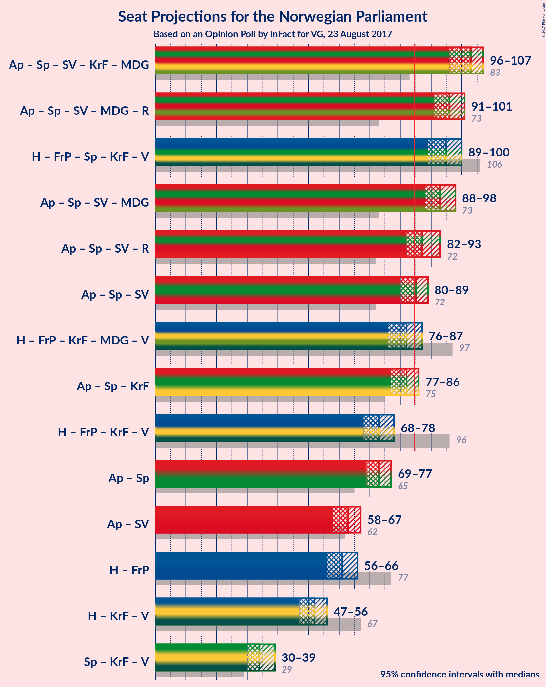

# Opinion Poll by InFact for VG, 23 August 2017

<a href="#voting-intentions">Voting Intentions</a> | <a href="#seats">Seats</a> | <a href="#coalitions">Coalitions</a> | <a href="#technical-information">Technical Information</a>

## Voting Intentions

### Confidence Intervals

| Party | Last Result | Poll Result | 80% Confidence Interval | 90% Confidence Interval | 95% Confidence Interval | 99% Confidence Interval |
|:-----:|:-----------:|:-----------:|:-----------------------:|:-----------------------:|:-----------------------:|:-----------------------:|
| Arbeiderpartiet | 30.8% | 27.6% | 26.3–28.9% |26.0–29.2% |25.7–29.6% |25.1–30.2% |
| Høyre | 26.8% | 22.2% | 21.0–23.4% |20.7–23.7% |20.4–24.1% |19.9–24.6% |
| Fremskrittspartiet | 16.3% | 12.0% | 11.1–13.0% |10.9–13.2% |10.7–13.5% |10.2–14.0% |
| Senterpartiet | 5.5% | 12.0% | 11.1–13.0% |10.9–13.2% |10.7–13.5% |10.2–14.0% |
| Sosialistisk Venstreparti | 4.1% | 6.6% | 5.9–7.4% |5.8–7.6% |5.6–7.8% |5.3–8.2% |
| Kristelig Folkeparti | 5.6% | 5.3% | 4.7–6.0% |4.5–6.2% |4.4–6.4% |4.1–6.7% |
| Miljøpartiet de Grønne | 2.8% | 4.9% | 4.3–5.6% |4.2–5.8% |4.0–5.9% |3.8–6.3% |
| Venstre | 5.2% | 3.6% | 3.1–4.2% |3.0–4.3% |2.9–4.5% |2.6–4.8% |
| Rødt | 1.1% | 3.6% | 3.1–4.2% |3.0–4.3% |2.9–4.5% |2.6–4.8% |

*Note:* The poll result column reflects the actual value used in the calculations. Published results may vary slightly, and in addition be rounded to fewer digits.

## Seats

### Confidence Intervals

| Party | Last Result | Median | 80% Confidence Interval | 90% Confidence Interval | 95% Confidence Interval | 99% Confidence Interval |
|:-----:|:-----------:|:------:|:-----------------------:|:-----------------------:|:-----------------------:|:-----------------------:|
| <a href="#arbeiderpartiet">Arbeiderpartiet</a> | 55 | 51 | 48–54 |47–54 |46–55 |45–57 |
| <a href="#høyre">Høyre</a> | 48 | 39 | 37–41 |36–42 |35–43 |35–44 |
| <a href="#fremskrittspartiet">Fremskrittspartiet</a> | 29 | 21 | 19–23 |19–25 |18–25 |18–26 |
| <a href="#senterpartiet">Senterpartiet</a> | 10 | 22 | 19–23 |19–24 |19–24 |18–25 |
| <a href="#sosialistisk-venstreparti">Sosialistisk Venstreparti</a> | 7 | 12 | 11–13 |10–13 |10–14 |9–14 |
| <a href="#kristelig-folkeparti">Kristelig Folkeparti</a> | 10 | 10 | 8–11 |8–11 |8–11 |7–12 |
| <a href="#miljøpartiet-de-grønne">Miljøpartiet de Grønne</a> | 1 | 9 | 8–10 |7–10 |7–11 |3–11 |
| <a href="#venstre">Venstre</a> | 9 | 2 | 2–7 |1–7 |1–8 |1–8 |
| <a href="#rødt">Rødt</a> | 0 | 2 | 2–7 |2–7 |2–7 |1–8 |

### Arbeiderpartiet

| Number of Seats | Probability | Accumulated | Special Marks |
|:---------------:|:-----------:|:-----------:|:-------------:|
| 44 | 0.1% | 100% |  |
| 45 | 0.5% | 99.9% |  |
| 46 | 2% | 99.4% |  |
| 47 | 3% | 97% |  |
| 48 | 5% | 94% |  |
| 49 | 5% | 89% |  |
| 50 | 13% | 84% |  |
| 51 | 25% | 71% | Median |
| 52 | 15% | 46% |  |
| 53 | 19% | 31% |  |
| 54 | 7% | 12% |  |
| 55 | 3% | 5% | Last Result |
| 56 | 0.7% | 2% |  |
| 57 | 0.8% | 1.1% |  |
| 58 | 0.2% | 0.3% |  |
| 59 | 0% | 0% |  |

### Høyre

| Number of Seats | Probability | Accumulated | Special Marks |
|:---------------:|:-----------:|:-----------:|:-------------:|
| 34 | 0.2% | 100% |  |
| 35 | 2% | 99.8% |  |
| 36 | 3% | 97% |  |
| 37 | 7% | 95% |  |
| 38 | 21% | 88% |  |
| 39 | 18% | 67% | Median |
| 40 | 20% | 48% |  |
| 41 | 20% | 29% |  |
| 42 | 5% | 9% |  |
| 43 | 3% | 4% |  |
| 44 | 0.7% | 1.2% |  |
| 45 | 0.3% | 0.5% |  |
| 46 | 0.1% | 0.2% |  |
| 47 | 0% | 0% |  |
| 48 | 0% | 0% | Last Result |

### Fremskrittspartiet

| Number of Seats | Probability | Accumulated | Special Marks |
|:---------------:|:-----------:|:-----------:|:-------------:|
| 16 | 0.1% | 100% |  |
| 17 | 0.4% | 99.9% |  |
| 18 | 3% | 99.5% |  |
| 19 | 7% | 97% |  |
| 20 | 17% | 89% |  |
| 21 | 30% | 72% | Median |
| 22 | 24% | 42% |  |
| 23 | 9% | 18% |  |
| 24 | 4% | 10% |  |
| 25 | 3% | 6% |  |
| 26 | 2% | 2% |  |
| 27 | 0.2% | 0.3% |  |
| 28 | 0.1% | 0.1% |  |
| 29 | 0% | 0% | Last Result |

### Senterpartiet

| Number of Seats | Probability | Accumulated | Special Marks |
|:---------------:|:-----------:|:-----------:|:-------------:|
| 10 | 0% | 100% | Last Result |
| 11 | 0% | 100% |  |
| 12 | 0% | 100% |  |
| 13 | 0% | 100% |  |
| 14 | 0% | 100% |  |
| 15 | 0% | 100% |  |
| 16 | 0% | 100% |  |
| 17 | 0.4% | 100% |  |
| 18 | 2% | 99.6% |  |
| 19 | 10% | 98% |  |
| 20 | 19% | 88% |  |
| 21 | 15% | 69% |  |
| 22 | 35% | 54% | Median |
| 23 | 12% | 19% |  |
| 24 | 5% | 7% |  |
| 25 | 1.4% | 2% |  |
| 26 | 0.1% | 0.2% |  |
| 27 | 0% | 0% |  |

### Sosialistisk Venstreparti

| Number of Seats | Probability | Accumulated | Special Marks |
|:---------------:|:-----------:|:-----------:|:-------------:|
| 7 | 0% | 100% | Last Result |
| 8 | 0.1% | 100% |  |
| 9 | 1.2% | 99.9% |  |
| 10 | 8% | 98.7% |  |
| 11 | 30% | 91% |  |
| 12 | 39% | 62% | Median |
| 13 | 19% | 23% |  |
| 14 | 3% | 4% |  |
| 15 | 0.3% | 0.4% |  |
| 16 | 0.1% | 0.1% |  |
| 17 | 0% | 0% |  |

### Kristelig Folkeparti

| Number of Seats | Probability | Accumulated | Special Marks |
|:---------------:|:-----------:|:-----------:|:-------------:|
| 2 | 0.1% | 100% |  |
| 3 | 0.1% | 99.9% |  |
| 4 | 0% | 99.7% |  |
| 5 | 0% | 99.7% |  |
| 6 | 0% | 99.7% |  |
| 7 | 2% | 99.7% |  |
| 8 | 14% | 98% |  |
| 9 | 32% | 84% |  |
| 10 | 38% | 52% | Last Result, Median |
| 11 | 12% | 13% |  |
| 12 | 1.4% | 1.4% |  |
| 13 | 0.1% | 0.1% |  |
| 14 | 0% | 0% |  |

### Miljøpartiet de Grønne

| Number of Seats | Probability | Accumulated | Special Marks |
|:---------------:|:-----------:|:-----------:|:-------------:|
| 1 | 0% | 100% | Last Result |
| 2 | 0.2% | 100% |  |
| 3 | 2% | 99.8% |  |
| 4 | 0.1% | 98% |  |
| 5 | 0% | 98% |  |
| 6 | 0% | 98% |  |
| 7 | 7% | 98% |  |
| 8 | 40% | 91% |  |
| 9 | 33% | 51% | Median |
| 10 | 14% | 17% |  |
| 11 | 3% | 3% |  |
| 12 | 0.1% | 0.1% |  |
| 13 | 0% | 0% |  |

### Venstre

| Number of Seats | Probability | Accumulated | Special Marks |
|:---------------:|:-----------:|:-----------:|:-------------:|
| 0 | 0.1% | 100% |  |
| 1 | 9% | 99.9% |  |
| 2 | 62% | 91% | Median |
| 3 | 9% | 29% |  |
| 4 | 0% | 20% |  |
| 5 | 0% | 20% |  |
| 6 | 2% | 20% |  |
| 7 | 14% | 18% |  |
| 8 | 5% | 5% |  |
| 9 | 0.1% | 0.1% | Last Result |
| 10 | 0% | 0% |  |

### Rødt

| Number of Seats | Probability | Accumulated | Special Marks |
|:---------------:|:-----------:|:-----------:|:-------------:|
| 0 | 0% | 100% | Last Result |
| 1 | 2% | 100% |  |
| 2 | 83% | 98% | Median |
| 3 | 0% | 15% |  |
| 4 | 0% | 15% |  |
| 5 | 0% | 15% |  |
| 6 | 1.1% | 15% |  |
| 7 | 11% | 14% |  |
| 8 | 2% | 2% |  |
| 9 | 0.1% | 0.1% |  |
| 10 | 0% | 0% |  |

## Coalitions

### Confidence Intervals

| Coalition | Last Result | Median | Majority? | 80% Confidence Interval | 90% Confidence Interval | 95% Confidence Interval | 99% Confidence Interval |
|:---------:|:-----------:|:------:|:---------:|:-----------------------:|:-----------------------:|:-----------------------:|:-----------------------:|
| Arbeiderpartiet – Senterpartiet – Sosialistisk Venstreparti – Kristelig Folkeparti – Miljøpartiet de Grønne | 83 | 103 | 100% | 99–106 | 98–107 | 96–107 | 95–108 |
| Arbeiderpartiet – Senterpartiet – Sosialistisk Venstreparti – Miljøpartiet de Grønne – Rødt | 73 | 96 | 100% | 93–99 | 92–100 | 91–101 | 89–103 |
| Høyre – Fremskrittspartiet – Senterpartiet – Kristelig Folkeparti – Venstre | 106 | 95 | 99.8% | 91–98 | 90–99 | 89–100 | 87–102 |
| Arbeiderpartiet – Senterpartiet – Sosialistisk Venstreparti – Miljøpartiet de Grønne | 73 | 93 | 99.9% | 90–96 | 89–97 | 88–98 | 86–99 |
| Arbeiderpartiet – Senterpartiet – Sosialistisk Venstreparti – Rødt | 72 | 87 | 88% | 84–91 | 84–92 | 82–93 | 81–95 |
| Arbeiderpartiet – Senterpartiet – Sosialistisk Venstreparti | 72 | 85 | 55% | 82–87 | 81–88 | 80–89 | 78–90 |
| Arbeiderpartiet – Senterpartiet – Kristelig Folkeparti | 75 | 82 | 14% | 79–85 | 78–86 | 77–87 | 76–88 |
| Høyre – Fremskrittspartiet – Kristelig Folkeparti – Miljøpartiet de Grønne – Venstre | 97 | 82 | 12% | 78–85 | 77–85 | 76–87 | 74–88 |
| Høyre – Fremskrittspartiet – Kristelig Folkeparti – Venstre | 96 | 73 | 0% | 70–76 | 69–77 | 68–78 | 66–80 |
| Arbeiderpartiet – Senterpartiet | 65 | 73 | 0% | 70–75 | 69–76 | 68–77 | 67–78 |
| Arbeiderpartiet – Sosialistisk Venstreparti | 62 | 63 | 0% | 60–66 | 59–67 | 58–67 | 56–69 |
| Høyre – Fremskrittspartiet | 77 | 61 | 0% | 58–63 | 57–65 | 56–66 | 54–67 |
| Høyre – Kristelig Folkeparti – Venstre | 67 | 52 | 0% | 49–55 | 48–56 | 47–57 | 46–58 |
| Senterpartiet – Kristelig Folkeparti – Venstre | 29 | 34 | 0% | 31–37 | 30–38 | 30–40 | 29–40 |

### Arbeiderpartiet – Senterpartiet – Sosialistisk Venstreparti – Kristelig Folkeparti – Miljøpartiet de Grønne

| Number of Seats | Probability | Accumulated | Special Marks |
|:---------------:|:-----------:|:-----------:|:-------------:|
| 83 | 0% | 100% | Last Result |
| 84 | 0% | 100% |  |
| 85 | 0% | 100% | Majority |
| 86 | 0% | 100% |  |
| 87 | 0% | 100% |  |
| 88 | 0% | 100% |  |
| 89 | 0% | 100% |  |
| 90 | 0% | 100% |  |
| 91 | 0% | 100% |  |
| 92 | 0% | 100% |  |
| 93 | 0.1% | 99.9% |  |
| 94 | 0.2% | 99.8% |  |
| 95 | 1.1% | 99.7% |  |
| 96 | 2% | 98.6% |  |
| 97 | 2% | 97% |  |
| 98 | 2% | 95% |  |
| 99 | 6% | 93% |  |
| 100 | 10% | 87% |  |
| 101 | 6% | 77% |  |
| 102 | 12% | 71% |  |
| 103 | 26% | 59% |  |
| 104 | 17% | 34% | Median |
| 105 | 5% | 17% |  |
| 106 | 6% | 12% |  |
| 107 | 4% | 5% |  |
| 108 | 0.9% | 1.4% |  |
| 109 | 0.4% | 0.5% |  |
| 110 | 0.1% | 0.1% |  |
| 111 | 0% | 0% |  |

### Arbeiderpartiet – Senterpartiet – Sosialistisk Venstreparti – Miljøpartiet de Grønne – Rødt

| Number of Seats | Probability | Accumulated | Special Marks |
|:---------------:|:-----------:|:-----------:|:-------------:|
| 73 | 0% | 100% | Last Result |
| 74 | 0% | 100% |  |
| 75 | 0% | 100% |  |
| 76 | 0% | 100% |  |
| 77 | 0% | 100% |  |
| 78 | 0% | 100% |  |
| 79 | 0% | 100% |  |
| 80 | 0% | 100% |  |
| 81 | 0% | 100% |  |
| 82 | 0% | 100% |  |
| 83 | 0% | 100% |  |
| 84 | 0% | 100% |  |
| 85 | 0% | 100% | Majority |
| 86 | 0.1% | 100% |  |
| 87 | 0.1% | 99.9% |  |
| 88 | 0.3% | 99.9% |  |
| 89 | 0.3% | 99.6% |  |
| 90 | 2% | 99.2% |  |
| 91 | 1.5% | 98% |  |
| 92 | 3% | 96% |  |
| 93 | 12% | 93% |  |
| 94 | 7% | 81% |  |
| 95 | 23% | 74% |  |
| 96 | 19% | 51% | Median |
| 97 | 9% | 32% |  |
| 98 | 8% | 23% |  |
| 99 | 8% | 15% |  |
| 100 | 4% | 7% |  |
| 101 | 2% | 4% |  |
| 102 | 1.1% | 2% |  |
| 103 | 0.8% | 1.1% |  |
| 104 | 0.1% | 0.3% |  |
| 105 | 0.2% | 0.2% |  |
| 106 | 0% | 0% |  |

### Høyre – Fremskrittspartiet – Senterpartiet – Kristelig Folkeparti – Venstre

| Number of Seats | Probability | Accumulated | Special Marks |
|:---------------:|:-----------:|:-----------:|:-------------:|
| 84 | 0.1% | 100% |  |
| 85 | 0% | 99.8% | Majority |
| 86 | 0.1% | 99.8% |  |
| 87 | 0.4% | 99.7% |  |
| 88 | 0.7% | 99.4% |  |
| 89 | 3% | 98.6% |  |
| 90 | 3% | 96% |  |
| 91 | 4% | 93% |  |
| 92 | 9% | 89% |  |
| 93 | 13% | 80% |  |
| 94 | 12% | 67% | Median |
| 95 | 17% | 54% |  |
| 96 | 18% | 37% |  |
| 97 | 6% | 19% |  |
| 98 | 7% | 13% |  |
| 99 | 2% | 6% |  |
| 100 | 1.4% | 4% |  |
| 101 | 2% | 2% |  |
| 102 | 0.5% | 0.8% |  |
| 103 | 0.2% | 0.3% |  |
| 104 | 0.1% | 0.1% |  |
| 105 | 0% | 0% |  |
| 106 | 0% | 0% | Last Result |

### Arbeiderpartiet – Senterpartiet – Sosialistisk Venstreparti – Miljøpartiet de Grønne

| Number of Seats | Probability | Accumulated | Special Marks |
|:---------------:|:-----------:|:-----------:|:-------------:|
| 73 | 0% | 100% | Last Result |
| 74 | 0% | 100% |  |
| 75 | 0% | 100% |  |
| 76 | 0% | 100% |  |
| 77 | 0% | 100% |  |
| 78 | 0% | 100% |  |
| 79 | 0% | 100% |  |
| 80 | 0% | 100% |  |
| 81 | 0% | 100% |  |
| 82 | 0% | 100% |  |
| 83 | 0% | 100% |  |
| 84 | 0.1% | 100% |  |
| 85 | 0.2% | 99.9% | Majority |
| 86 | 0.6% | 99.6% |  |
| 87 | 0.7% | 99.1% |  |
| 88 | 3% | 98% |  |
| 89 | 2% | 95% |  |
| 90 | 4% | 93% |  |
| 91 | 14% | 89% |  |
| 92 | 11% | 75% |  |
| 93 | 23% | 64% |  |
| 94 | 19% | 41% | Median |
| 95 | 9% | 22% |  |
| 96 | 7% | 14% |  |
| 97 | 4% | 7% |  |
| 98 | 2% | 3% |  |
| 99 | 0.3% | 0.7% |  |
| 100 | 0.4% | 0.4% |  |
| 101 | 0.1% | 0.1% |  |
| 102 | 0% | 0% |  |

### Arbeiderpartiet – Senterpartiet – Sosialistisk Venstreparti – Rødt

| Number of Seats | Probability | Accumulated | Special Marks |
|:---------------:|:-----------:|:-----------:|:-------------:|
| 72 | 0% | 100% | Last Result |
| 73 | 0% | 100% |  |
| 74 | 0% | 100% |  |
| 75 | 0% | 100% |  |
| 76 | 0% | 100% |  |
| 77 | 0% | 100% |  |
| 78 | 0% | 100% |  |
| 79 | 0.1% | 100% |  |
| 80 | 0.2% | 99.9% |  |
| 81 | 1.3% | 99.7% |  |
| 82 | 1.2% | 98% |  |
| 83 | 2% | 97% |  |
| 84 | 7% | 95% |  |
| 85 | 12% | 88% | Majority |
| 86 | 12% | 76% |  |
| 87 | 29% | 64% | Median |
| 88 | 12% | 36% |  |
| 89 | 6% | 24% |  |
| 90 | 6% | 18% |  |
| 91 | 6% | 12% |  |
| 92 | 3% | 6% |  |
| 93 | 1.2% | 3% |  |
| 94 | 0.5% | 2% |  |
| 95 | 0.8% | 1.1% |  |
| 96 | 0.3% | 0.3% |  |
| 97 | 0% | 0.1% |  |
| 98 | 0% | 0% |  |

### Arbeiderpartiet – Senterpartiet – Sosialistisk Venstreparti

| Number of Seats | Probability | Accumulated | Special Marks |
|:---------------:|:-----------:|:-----------:|:-------------:|
| 72 | 0% | 100% | Last Result |
| 73 | 0% | 100% |  |
| 74 | 0% | 100% |  |
| 75 | 0% | 100% |  |
| 76 | 0% | 100% |  |
| 77 | 0.2% | 99.9% |  |
| 78 | 0.5% | 99.7% |  |
| 79 | 2% | 99.2% |  |
| 80 | 3% | 98% |  |
| 81 | 2% | 95% |  |
| 82 | 9% | 93% |  |
| 83 | 14% | 84% |  |
| 84 | 15% | 70% |  |
| 85 | 29% | 55% | Median, Majority |
| 86 | 11% | 26% |  |
| 87 | 5% | 14% |  |
| 88 | 6% | 9% |  |
| 89 | 2% | 3% |  |
| 90 | 0.7% | 1.0% |  |
| 91 | 0.3% | 0.3% |  |
| 92 | 0.1% | 0.1% |  |
| 93 | 0% | 0% |  |

### Arbeiderpartiet – Senterpartiet – Kristelig Folkeparti

| Number of Seats | Probability | Accumulated | Special Marks |
|:---------------:|:-----------:|:-----------:|:-------------:|
| 73 | 0.1% | 100% |  |
| 74 | 0.1% | 99.9% |  |
| 75 | 0.3% | 99.9% | Last Result |
| 76 | 2% | 99.6% |  |
| 77 | 2% | 98% |  |
| 78 | 5% | 96% |  |
| 79 | 3% | 91% |  |
| 80 | 6% | 88% |  |
| 81 | 13% | 82% |  |
| 82 | 24% | 69% |  |
| 83 | 19% | 44% | Median |
| 84 | 12% | 25% |  |
| 85 | 9% | 14% | Majority |
| 86 | 3% | 5% |  |
| 87 | 2% | 3% |  |
| 88 | 0.5% | 0.6% |  |
| 89 | 0.1% | 0.2% |  |
| 90 | 0% | 0% |  |

### Høyre – Fremskrittspartiet – Kristelig Folkeparti – Miljøpartiet de Grønne – Venstre

| Number of Seats | Probability | Accumulated | Special Marks |
|:---------------:|:-----------:|:-----------:|:-------------:|
| 72 | 0% | 100% |  |
| 73 | 0.3% | 99.9% |  |
| 74 | 0.8% | 99.7% |  |
| 75 | 0.5% | 98.9% |  |
| 76 | 1.2% | 98% |  |
| 77 | 3% | 97% |  |
| 78 | 6% | 94% |  |
| 79 | 6% | 88% |  |
| 80 | 6% | 82% |  |
| 81 | 12% | 76% | Median |
| 82 | 29% | 64% |  |
| 83 | 12% | 36% |  |
| 84 | 12% | 24% |  |
| 85 | 7% | 12% | Majority |
| 86 | 2% | 5% |  |
| 87 | 1.2% | 3% |  |
| 88 | 1.3% | 2% |  |
| 89 | 0.2% | 0.3% |  |
| 90 | 0.1% | 0.1% |  |
| 91 | 0% | 0% |  |
| 92 | 0% | 0% |  |
| 93 | 0% | 0% |  |
| 94 | 0% | 0% |  |
| 95 | 0% | 0% |  |
| 96 | 0% | 0% |  |
| 97 | 0% | 0% | Last Result |

### Høyre – Fremskrittspartiet – Kristelig Folkeparti – Venstre

| Number of Seats | Probability | Accumulated | Special Marks |
|:---------------:|:-----------:|:-----------:|:-------------:|
| 64 | 0.2% | 100% |  |
| 65 | 0.1% | 99.8% |  |
| 66 | 0.8% | 99.7% |  |
| 67 | 1.1% | 98.9% |  |
| 68 | 2% | 98% |  |
| 69 | 4% | 96% |  |
| 70 | 8% | 93% |  |
| 71 | 8% | 85% |  |
| 72 | 9% | 77% | Median |
| 73 | 19% | 68% |  |
| 74 | 23% | 49% |  |
| 75 | 7% | 26% |  |
| 76 | 12% | 19% |  |
| 77 | 3% | 7% |  |
| 78 | 1.5% | 4% |  |
| 79 | 2% | 2% |  |
| 80 | 0.3% | 0.8% |  |
| 81 | 0.3% | 0.4% |  |
| 82 | 0.1% | 0.1% |  |
| 83 | 0.1% | 0.1% |  |
| 84 | 0% | 0% |  |
| 85 | 0% | 0% | Majority |
| 86 | 0% | 0% |  |
| 87 | 0% | 0% |  |
| 88 | 0% | 0% |  |
| 89 | 0% | 0% |  |
| 90 | 0% | 0% |  |
| 91 | 0% | 0% |  |
| 92 | 0% | 0% |  |
| 93 | 0% | 0% |  |
| 94 | 0% | 0% |  |
| 95 | 0% | 0% |  |
| 96 | 0% | 0% | Last Result |

### Arbeiderpartiet – Senterpartiet

| Number of Seats | Probability | Accumulated | Special Marks |
|:---------------:|:-----------:|:-----------:|:-------------:|
| 65 | 0% | 100% | Last Result |
| 66 | 0.2% | 100% |  |
| 67 | 0.5% | 99.7% |  |
| 68 | 2% | 99.3% |  |
| 69 | 4% | 97% |  |
| 70 | 7% | 93% |  |
| 71 | 5% | 86% |  |
| 72 | 24% | 81% |  |
| 73 | 29% | 57% | Median |
| 74 | 13% | 28% |  |
| 75 | 7% | 15% |  |
| 76 | 5% | 8% |  |
| 77 | 1.1% | 3% |  |
| 78 | 1.0% | 1.4% |  |
| 79 | 0.4% | 0.5% |  |
| 80 | 0.1% | 0.1% |  |
| 81 | 0% | 0% |  |

### Arbeiderpartiet – Sosialistisk Venstreparti

| Number of Seats | Probability | Accumulated | Special Marks |
|:---------------:|:-----------:|:-----------:|:-------------:|
| 55 | 0.1% | 100% |  |
| 56 | 0.6% | 99.9% |  |
| 57 | 1.3% | 99.2% |  |
| 58 | 2% | 98% |  |
| 59 | 3% | 96% |  |
| 60 | 5% | 93% |  |
| 61 | 8% | 88% |  |
| 62 | 13% | 80% | Last Result |
| 63 | 28% | 68% | Median |
| 64 | 12% | 40% |  |
| 65 | 15% | 27% |  |
| 66 | 7% | 12% |  |
| 67 | 4% | 6% |  |
| 68 | 1.4% | 2% |  |
| 69 | 0.6% | 0.7% |  |
| 70 | 0.1% | 0.1% |  |
| 71 | 0.1% | 0.1% |  |
| 72 | 0% | 0% |  |

### Høyre – Fremskrittspartiet

| Number of Seats | Probability | Accumulated | Special Marks |
|:---------------:|:-----------:|:-----------:|:-------------:|
| 53 | 0.2% | 100% |  |
| 54 | 0.6% | 99.8% |  |
| 55 | 1.0% | 99.1% |  |
| 56 | 3% | 98% |  |
| 57 | 4% | 95% |  |
| 58 | 10% | 91% |  |
| 59 | 10% | 81% |  |
| 60 | 15% | 71% | Median |
| 61 | 14% | 57% |  |
| 62 | 25% | 43% |  |
| 63 | 8% | 18% |  |
| 64 | 4% | 10% |  |
| 65 | 2% | 6% |  |
| 66 | 2% | 3% |  |
| 67 | 0.5% | 0.9% |  |
| 68 | 0.3% | 0.4% |  |
| 69 | 0.1% | 0.1% |  |
| 70 | 0% | 0% |  |
| 71 | 0% | 0% |  |
| 72 | 0% | 0% |  |
| 73 | 0% | 0% |  |
| 74 | 0% | 0% |  |
| 75 | 0% | 0% |  |
| 76 | 0% | 0% |  |
| 77 | 0% | 0% | Last Result |

### Høyre – Kristelig Folkeparti – Venstre

| Number of Seats | Probability | Accumulated | Special Marks |
|:---------------:|:-----------:|:-----------:|:-------------:|
| 45 | 0.1% | 100% |  |
| 46 | 1.5% | 99.8% |  |
| 47 | 2% | 98% |  |
| 48 | 3% | 97% |  |
| 49 | 7% | 94% |  |
| 50 | 16% | 87% |  |
| 51 | 15% | 71% | Median |
| 52 | 16% | 56% |  |
| 53 | 20% | 40% |  |
| 54 | 5% | 20% |  |
| 55 | 9% | 15% |  |
| 56 | 4% | 7% |  |
| 57 | 2% | 3% |  |
| 58 | 0.3% | 0.7% |  |
| 59 | 0.3% | 0.5% |  |
| 60 | 0.1% | 0.1% |  |
| 61 | 0% | 0.1% |  |
| 62 | 0% | 0% |  |
| 63 | 0% | 0% |  |
| 64 | 0% | 0% |  |
| 65 | 0% | 0% |  |
| 66 | 0% | 0% |  |
| 67 | 0% | 0% | Last Result |

### Senterpartiet – Kristelig Folkeparti – Venstre

| Number of Seats | Probability | Accumulated | Special Marks |
|:---------------:|:-----------:|:-----------:|:-------------:|
| 26 | 0% | 100% |  |
| 27 | 0.1% | 99.9% |  |
| 28 | 0.3% | 99.9% |  |
| 29 | 0.7% | 99.6% | Last Result |
| 30 | 4% | 98.9% |  |
| 31 | 9% | 95% |  |
| 32 | 16% | 86% |  |
| 33 | 14% | 70% |  |
| 34 | 21% | 56% | Median |
| 35 | 17% | 35% |  |
| 36 | 6% | 18% |  |
| 37 | 4% | 12% |  |
| 38 | 4% | 9% |  |
| 39 | 1.4% | 4% |  |
| 40 | 3% | 3% |  |
| 41 | 0.3% | 0.5% |  |
| 42 | 0.1% | 0.2% |  |
| 43 | 0.1% | 0.1% |  |
| 44 | 0% | 0% |  |

## Technical Information

### Opinion Poll

+ **Pollster:** InFact
+ **Media:** VG
+ **Fieldwork period:** 23 August 2017

### Calculations

+ **Sample size:** 2042
+ **Simulations done:** 2,097,152
+ **Error estimate:** 1.19%

