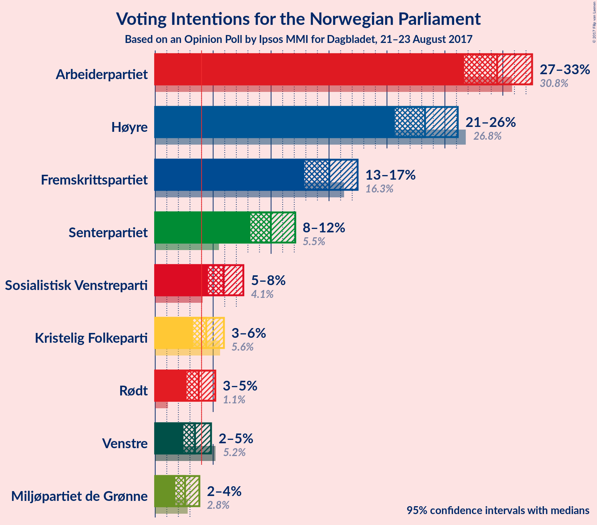
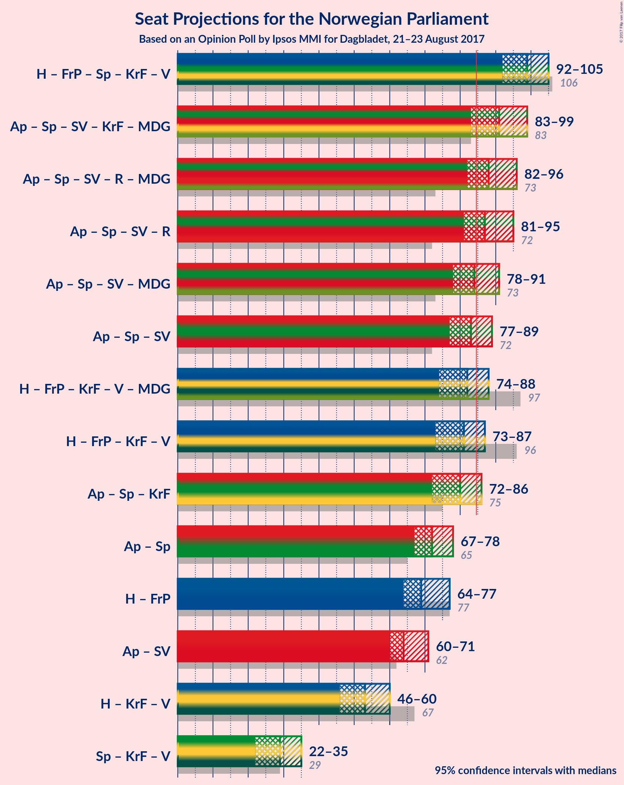

# Opinion Poll by Ipsos MMI for Dagbladet, 21–23 August 2017

<a href="#voting-intentions">Voting Intentions</a> | <a href="#seats">Seats</a> | <a href="#coalitions">Coalitions</a> | <a href="#technical-information">Technical Information</a>

## Voting Intentions

### Confidence Intervals

| Party | Last Result | Poll Result | 80% Confidence Interval | 90% Confidence Interval | 95% Confidence Interval | 99% Confidence Interval |
|:-----:|:-----------:|:-----------:|:-----------------------:|:-----------------------:|:-----------------------:|:-----------------------:|
| Arbeiderpartiet | 30.8% | 29.5% | 27.6–31.5% |27.1–32.0% |26.7–32.5% |25.8–33.5% |
| Høyre | 26.8% | 23.3% | 21.6–25.1% |21.1–25.7% |20.7–26.1% |19.9–27.0% |
| Fremskrittspartiet | 16.3% | 15.0% | 13.6–16.6% |13.2–17.1% |12.9–17.5% |12.2–18.3% |
| Senterpartiet | 5.5% | 10.0% | 8.8–11.4% |8.5–11.7% |8.2–12.1% |7.7–12.8% |
| Sosialistisk Venstreparti | 4.1% | 5.9% | 5.0–7.0% |4.8–7.3% |4.6–7.6% |4.2–8.2% |
| Kristelig Folkeparti | 5.6% | 4.4% | 3.6–5.4% |3.4–5.7% |3.3–5.9% |2.9–6.4% |
| Rødt | 1.1% | 3.8% | 3.1–4.7% |2.9–5.0% |2.7–5.2% |2.4–5.7% |
| Venstre | 5.2% | 3.4% | 2.8–4.3% |2.6–4.6% |2.4–4.8% |2.2–5.3% |
| Miljøpartiet de Grønne | 2.8% | 2.6% | 2.0–3.4% |1.9–3.6% |1.7–3.8% |1.5–4.2% |

*Note:* The poll result column reflects the actual value used in the calculations. Published results may vary slightly, and in addition be rounded to fewer digits.

## Seats

### Confidence Intervals

| Party | Last Result | Median | 80% Confidence Interval | 90% Confidence Interval | 95% Confidence Interval | 99% Confidence Interval |
|:-----:|:-----------:|:------:|:-----------------------:|:-----------------------:|:-----------------------:|:-----------------------:|
| <a href="#arbeiderpartiet">Arbeiderpartiet</a> | 55 | 54 | 51–57 |50–58 |50–60 |48–62 |
| <a href="#høyre">Høyre</a> | 48 | 41 | 39–46 |38–48 |37–48 |36–51 |
| <a href="#fremskrittspartiet">Fremskrittspartiet</a> | 29 | 28 | 24–30 |24–31 |23–32 |22–34 |
| <a href="#senterpartiet">Senterpartiet</a> | 10 | 18 | 16–20 |15–21 |15–22 |14–23 |
| <a href="#sosialistisk-venstreparti">Sosialistisk Venstreparti</a> | 7 | 11 | 9–13 |9–14 |8–14 |7–15 |
| <a href="#kristelig-folkeparti">Kristelig Folkeparti</a> | 10 | 8 | 2–10 |2–10 |2–11 |2–12 |
| <a href="#rødt">Rødt</a> | 0 | 2 | 2–9 |2–9 |1–9 |1–10 |
| <a href="#venstre">Venstre</a> | 9 | 2 | 1–8 |1–8 |1–8 |0–9 |
| <a href="#miljøpartiet-de-grønne">Miljøpartiet de Grønne</a> | 1 | 1 | 1 |1–2 |0–3 |0–7 |

### Arbeiderpartiet

| Number of Seats | Probability | Accumulated | Special Marks |
|:---------------:|:-----------:|:-----------:|:-------------:|
| 45 | 0% | 100% |  |
| 46 | 0.1% | 99.9% |  |
| 47 | 0.2% | 99.9% |  |
| 48 | 0.6% | 99.7% |  |
| 49 | 1.4% | 99.1% |  |
| 50 | 3% | 98% |  |
| 51 | 10% | 94% |  |
| 52 | 17% | 85% |  |
| 53 | 11% | 68% |  |
| 54 | 23% | 57% | Median |
| 55 | 9% | 33% | Last Result |
| 56 | 9% | 24% |  |
| 57 | 8% | 15% |  |
| 58 | 3% | 7% |  |
| 59 | 2% | 5% |  |
| 60 | 1.3% | 3% |  |
| 61 | 0.6% | 1.4% |  |
| 62 | 0.3% | 0.7% |  |
| 63 | 0.2% | 0.4% |  |
| 64 | 0.1% | 0.2% |  |
| 65 | 0% | 0.1% |  |
| 66 | 0.1% | 0.1% |  |
| 67 | 0% | 0% |  |

### Høyre

| Number of Seats | Probability | Accumulated | Special Marks |
|:---------------:|:-----------:|:-----------:|:-------------:|
| 34 | 0.1% | 100% |  |
| 35 | 0.2% | 99.8% |  |
| 36 | 1.4% | 99.6% |  |
| 37 | 2% | 98% |  |
| 38 | 5% | 96% |  |
| 39 | 4% | 91% |  |
| 40 | 8% | 87% |  |
| 41 | 30% | 78% | Median |
| 42 | 7% | 49% |  |
| 43 | 16% | 42% |  |
| 44 | 9% | 27% |  |
| 45 | 4% | 18% |  |
| 46 | 6% | 14% |  |
| 47 | 2% | 8% |  |
| 48 | 4% | 6% | Last Result |
| 49 | 1.3% | 2% |  |
| 50 | 0.2% | 0.9% |  |
| 51 | 0.6% | 0.6% |  |
| 52 | 0% | 0.1% |  |
| 53 | 0% | 0% |  |

### Fremskrittspartiet

| Number of Seats | Probability | Accumulated | Special Marks |
|:---------------:|:-----------:|:-----------:|:-------------:|
| 20 | 0% | 100% |  |
| 21 | 0.3% | 99.9% |  |
| 22 | 0.4% | 99.6% |  |
| 23 | 2% | 99.2% |  |
| 24 | 8% | 97% |  |
| 25 | 11% | 89% |  |
| 26 | 6% | 79% |  |
| 27 | 14% | 73% |  |
| 28 | 24% | 58% | Median |
| 29 | 21% | 35% | Last Result |
| 30 | 6% | 13% |  |
| 31 | 4% | 7% |  |
| 32 | 1.4% | 3% |  |
| 33 | 1.1% | 2% |  |
| 34 | 0.4% | 0.6% |  |
| 35 | 0.1% | 0.2% |  |
| 36 | 0% | 0% |  |

### Senterpartiet

| Number of Seats | Probability | Accumulated | Special Marks |
|:---------------:|:-----------:|:-----------:|:-------------:|
| 10 | 0% | 100% | Last Result |
| 11 | 0% | 100% |  |
| 12 | 0.1% | 100% |  |
| 13 | 0.3% | 99.9% |  |
| 14 | 1.3% | 99.7% |  |
| 15 | 6% | 98% |  |
| 16 | 9% | 93% |  |
| 17 | 21% | 84% |  |
| 18 | 25% | 63% | Median |
| 19 | 15% | 38% |  |
| 20 | 13% | 22% |  |
| 21 | 6% | 9% |  |
| 22 | 3% | 3% |  |
| 23 | 0.4% | 0.7% |  |
| 24 | 0.2% | 0.3% |  |
| 25 | 0.1% | 0.1% |  |
| 26 | 0% | 0% |  |

### Sosialistisk Venstreparti

| Number of Seats | Probability | Accumulated | Special Marks |
|:---------------:|:-----------:|:-----------:|:-------------:|
| 2 | 0.2% | 100% |  |
| 3 | 0% | 99.8% |  |
| 4 | 0% | 99.8% |  |
| 5 | 0% | 99.8% |  |
| 6 | 0% | 99.8% |  |
| 7 | 0.4% | 99.8% | Last Result |
| 8 | 3% | 99.4% |  |
| 9 | 22% | 96% |  |
| 10 | 21% | 74% |  |
| 11 | 22% | 53% | Median |
| 12 | 16% | 31% |  |
| 13 | 7% | 15% |  |
| 14 | 6% | 8% |  |
| 15 | 2% | 2% |  |
| 16 | 0.1% | 0.1% |  |
| 17 | 0% | 0% |  |

### Kristelig Folkeparti

| Number of Seats | Probability | Accumulated | Special Marks |
|:---------------:|:-----------:|:-----------:|:-------------:|
| 1 | 0.3% | 100% |  |
| 2 | 21% | 99.7% |  |
| 3 | 0.4% | 79% |  |
| 4 | 0% | 79% |  |
| 5 | 0% | 79% |  |
| 6 | 0% | 79% |  |
| 7 | 6% | 79% |  |
| 8 | 31% | 72% | Median |
| 9 | 28% | 41% |  |
| 10 | 10% | 13% | Last Result |
| 11 | 2% | 3% |  |
| 12 | 1.0% | 1.0% |  |
| 13 | 0.1% | 0.1% |  |
| 14 | 0% | 0% |  |

### Rødt

| Number of Seats | Probability | Accumulated | Special Marks |
|:---------------:|:-----------:|:-----------:|:-------------:|
| 0 | 0% | 100% | Last Result |
| 1 | 3% | 100% |  |
| 2 | 57% | 97% | Median |
| 3 | 0% | 40% |  |
| 4 | 0% | 40% |  |
| 5 | 0% | 40% |  |
| 6 | 0% | 40% |  |
| 7 | 9% | 40% |  |
| 8 | 19% | 31% |  |
| 9 | 10% | 11% |  |
| 10 | 0.7% | 1.1% |  |
| 11 | 0.3% | 0.4% |  |
| 12 | 0% | 0% |  |

### Venstre

| Number of Seats | Probability | Accumulated | Special Marks |
|:---------------:|:-----------:|:-----------:|:-------------:|
| 0 | 2% | 100% |  |
| 1 | 18% | 98% |  |
| 2 | 31% | 80% | Median |
| 3 | 21% | 49% |  |
| 4 | 0% | 28% |  |
| 5 | 0% | 28% |  |
| 6 | 0.1% | 28% |  |
| 7 | 4% | 28% |  |
| 8 | 23% | 25% |  |
| 9 | 2% | 2% | Last Result |
| 10 | 0.3% | 0.4% |  |
| 11 | 0.1% | 0.1% |  |
| 12 | 0% | 0% |  |

### Miljøpartiet de Grønne

| Number of Seats | Probability | Accumulated | Special Marks |
|:---------------:|:-----------:|:-----------:|:-------------:|
| 0 | 4% | 100% |  |
| 1 | 89% | 96% | Last Result, Median |
| 2 | 3% | 7% |  |
| 3 | 4% | 5% |  |
| 4 | 0% | 0.8% |  |
| 5 | 0% | 0.7% |  |
| 6 | 0% | 0.7% |  |
| 7 | 0.3% | 0.7% |  |
| 8 | 0.4% | 0.5% |  |
| 9 | 0% | 0% |  |

## Coalitions

### Confidence Intervals

| Coalition | Last Result | Median | Majority? | 80% Confidence Interval | 90% Confidence Interval | 95% Confidence Interval | 99% Confidence Interval |
|:---------:|:-----------:|:------:|:---------:|:-----------------------:|:-----------------------:|:-----------------------:|:-----------------------:|
| Høyre – Fremskrittspartiet – Senterpartiet – Kristelig Folkeparti – Venstre | 106 | 99 | 100% | 94–104 | 93–104 | 92–105 | 89–106 |
| Arbeiderpartiet – Senterpartiet – Sosialistisk Venstreparti – Kristelig Folkeparti – Miljøpartiet de Grønne | 83 | 91 | 95% | 86–96 | 85–97 | 83–99 | 82–101 |
| Arbeiderpartiet – Senterpartiet – Sosialistisk Venstreparti – Rødt – Miljøpartiet de Grønne | 73 | 88 | 81% | 84–93 | 83–95 | 82–96 | 80–99 |
| Arbeiderpartiet – Senterpartiet – Sosialistisk Venstreparti – Rødt | 72 | 87 | 70% | 83–92 | 82–94 | 81–95 | 79–97 |
| Arbeiderpartiet – Senterpartiet – Sosialistisk Venstreparti – Miljøpartiet de Grønne | 73 | 84 | 37% | 80–88 | 79–90 | 78–91 | 76–94 |
| Arbeiderpartiet – Senterpartiet – Sosialistisk Venstreparti | 72 | 83 | 28% | 79–87 | 78–89 | 77–89 | 75–92 |
| Høyre – Fremskrittspartiet – Kristelig Folkeparti – Venstre – Miljøpartiet de Grønne | 97 | 82 | 30% | 77–86 | 75–87 | 74–88 | 72–90 |
| Høyre – Fremskrittspartiet – Kristelig Folkeparti – Venstre | 96 | 81 | 19% | 76–85 | 74–86 | 73–87 | 70–89 |
| Arbeiderpartiet – Senterpartiet – Kristelig Folkeparti | 75 | 80 | 6% | 74–83 | 72–85 | 72–86 | 70–88 |
| Arbeiderpartiet – Senterpartiet | 65 | 72 | 0.1% | 69–76 | 68–77 | 67–78 | 65–81 |
| Høyre – Fremskrittspartiet | 77 | 69 | 0% | 66–75 | 65–75 | 64–77 | 62–79 |
| Arbeiderpartiet – Sosialistisk Venstreparti | 62 | 64 | 0% | 62–68 | 61–70 | 60–71 | 58–73 |
| Høyre – Kristelig Folkeparti – Venstre | 67 | 53 | 0% | 48–57 | 47–58 | 46–60 | 43–63 |
| Senterpartiet – Kristelig Folkeparti – Venstre | 29 | 29 | 0% | 22–34 | 22–34 | 22–35 | 19–37 |

### Høyre – Fremskrittspartiet – Senterpartiet – Kristelig Folkeparti – Venstre

| Number of Seats | Probability | Accumulated | Special Marks |
|:---------------:|:-----------:|:-----------:|:-------------:|
| 86 | 0.1% | 100% |  |
| 87 | 0.1% | 99.9% |  |
| 88 | 0.2% | 99.8% |  |
| 89 | 0.9% | 99.6% |  |
| 90 | 0.5% | 98.8% |  |
| 91 | 0.6% | 98% |  |
| 92 | 3% | 98% |  |
| 93 | 3% | 95% |  |
| 94 | 4% | 92% |  |
| 95 | 11% | 88% |  |
| 96 | 6% | 77% |  |
| 97 | 9% | 71% | Median |
| 98 | 10% | 61% |  |
| 99 | 11% | 52% |  |
| 100 | 7% | 41% |  |
| 101 | 4% | 35% |  |
| 102 | 5% | 30% |  |
| 103 | 15% | 25% |  |
| 104 | 6% | 10% |  |
| 105 | 2% | 4% |  |
| 106 | 0.8% | 1.3% | Last Result |
| 107 | 0.3% | 0.5% |  |
| 108 | 0.1% | 0.2% |  |
| 109 | 0.1% | 0.1% |  |
| 110 | 0% | 0.1% |  |
| 111 | 0% | 0% |  |

### Arbeiderpartiet – Senterpartiet – Sosialistisk Venstreparti – Kristelig Folkeparti – Miljøpartiet de Grønne

| Number of Seats | Probability | Accumulated | Special Marks |
|:---------------:|:-----------:|:-----------:|:-------------:|
| 80 | 0.1% | 100% |  |
| 81 | 0.3% | 99.9% |  |
| 82 | 0.3% | 99.6% |  |
| 83 | 3% | 99.4% | Last Result |
| 84 | 1.3% | 96% |  |
| 85 | 3% | 95% | Majority |
| 86 | 3% | 93% |  |
| 87 | 2% | 90% |  |
| 88 | 10% | 88% |  |
| 89 | 5% | 78% |  |
| 90 | 21% | 74% |  |
| 91 | 7% | 53% |  |
| 92 | 11% | 46% | Median |
| 93 | 11% | 35% |  |
| 94 | 7% | 24% |  |
| 95 | 7% | 18% |  |
| 96 | 2% | 10% |  |
| 97 | 4% | 8% |  |
| 98 | 0.7% | 4% |  |
| 99 | 1.0% | 3% |  |
| 100 | 1.3% | 2% |  |
| 101 | 0.6% | 0.7% |  |
| 102 | 0.1% | 0.1% |  |
| 103 | 0% | 0.1% |  |
| 104 | 0% | 0% |  |

### Arbeiderpartiet – Senterpartiet – Sosialistisk Venstreparti – Rødt – Miljøpartiet de Grønne

| Number of Seats | Probability | Accumulated | Special Marks |
|:---------------:|:-----------:|:-----------:|:-------------:|
| 73 | 0% | 100% | Last Result |
| 74 | 0% | 100% |  |
| 75 | 0% | 100% |  |
| 76 | 0% | 100% |  |
| 77 | 0% | 100% |  |
| 78 | 0.1% | 99.9% |  |
| 79 | 0.1% | 99.9% |  |
| 80 | 0.6% | 99.8% |  |
| 81 | 1.4% | 99.1% |  |
| 82 | 1.3% | 98% |  |
| 83 | 2% | 96% |  |
| 84 | 14% | 94% |  |
| 85 | 10% | 81% | Majority |
| 86 | 9% | 70% | Median |
| 87 | 2% | 62% |  |
| 88 | 13% | 59% |  |
| 89 | 7% | 46% |  |
| 90 | 7% | 39% |  |
| 91 | 10% | 31% |  |
| 92 | 6% | 21% |  |
| 93 | 8% | 15% |  |
| 94 | 1.4% | 8% |  |
| 95 | 3% | 7% |  |
| 96 | 0.7% | 3% |  |
| 97 | 0.7% | 2% |  |
| 98 | 1.2% | 2% |  |
| 99 | 0.3% | 0.5% |  |
| 100 | 0.1% | 0.2% |  |
| 101 | 0.1% | 0.1% |  |
| 102 | 0% | 0% |  |

### Arbeiderpartiet – Senterpartiet – Sosialistisk Venstreparti – Rødt

| Number of Seats | Probability | Accumulated | Special Marks |
|:---------------:|:-----------:|:-----------:|:-------------:|
| 72 | 0% | 100% | Last Result |
| 73 | 0% | 100% |  |
| 74 | 0% | 100% |  |
| 75 | 0% | 100% |  |
| 76 | 0% | 100% |  |
| 77 | 0.1% | 99.9% |  |
| 78 | 0.1% | 99.9% |  |
| 79 | 0.7% | 99.7% |  |
| 80 | 1.4% | 99.1% |  |
| 81 | 1.4% | 98% |  |
| 82 | 2% | 96% |  |
| 83 | 14% | 94% |  |
| 84 | 10% | 80% |  |
| 85 | 9% | 70% | Median, Majority |
| 86 | 3% | 61% |  |
| 87 | 15% | 58% |  |
| 88 | 7% | 44% |  |
| 89 | 6% | 36% |  |
| 90 | 10% | 31% |  |
| 91 | 6% | 21% |  |
| 92 | 6% | 14% |  |
| 93 | 2% | 8% |  |
| 94 | 3% | 6% |  |
| 95 | 0.7% | 3% |  |
| 96 | 0.8% | 2% |  |
| 97 | 1.1% | 1.4% |  |
| 98 | 0.2% | 0.3% |  |
| 99 | 0.1% | 0.2% |  |
| 100 | 0.1% | 0.1% |  |
| 101 | 0% | 0% |  |

### Arbeiderpartiet – Senterpartiet – Sosialistisk Venstreparti – Miljøpartiet de Grønne

| Number of Seats | Probability | Accumulated | Special Marks |
|:---------------:|:-----------:|:-----------:|:-------------:|
| 73 | 0.1% | 100% | Last Result |
| 74 | 0.1% | 99.9% |  |
| 75 | 0.1% | 99.9% |  |
| 76 | 0.7% | 99.7% |  |
| 77 | 0.9% | 99.1% |  |
| 78 | 2% | 98% |  |
| 79 | 3% | 96% |  |
| 80 | 8% | 94% |  |
| 81 | 6% | 86% |  |
| 82 | 17% | 80% |  |
| 83 | 13% | 63% |  |
| 84 | 13% | 50% | Median |
| 85 | 7% | 37% | Majority |
| 86 | 11% | 30% |  |
| 87 | 4% | 19% |  |
| 88 | 5% | 15% |  |
| 89 | 4% | 10% |  |
| 90 | 2% | 6% |  |
| 91 | 2% | 3% |  |
| 92 | 0.4% | 2% |  |
| 93 | 0.9% | 1.4% |  |
| 94 | 0.1% | 0.6% |  |
| 95 | 0.1% | 0.4% |  |
| 96 | 0.3% | 0.4% |  |
| 97 | 0% | 0.1% |  |
| 98 | 0% | 0% |  |

### Arbeiderpartiet – Senterpartiet – Sosialistisk Venstreparti

| Number of Seats | Probability | Accumulated | Special Marks |
|:---------------:|:-----------:|:-----------:|:-------------:|
| 72 | 0.1% | 100% | Last Result |
| 73 | 0.1% | 99.9% |  |
| 74 | 0.2% | 99.8% |  |
| 75 | 0.6% | 99.7% |  |
| 76 | 1.0% | 99.0% |  |
| 77 | 2% | 98% |  |
| 78 | 2% | 96% |  |
| 79 | 7% | 94% |  |
| 80 | 7% | 86% |  |
| 81 | 17% | 79% |  |
| 82 | 12% | 62% |  |
| 83 | 13% | 50% | Median |
| 84 | 8% | 37% |  |
| 85 | 12% | 28% | Majority |
| 86 | 5% | 17% |  |
| 87 | 3% | 12% |  |
| 88 | 4% | 9% |  |
| 89 | 3% | 5% |  |
| 90 | 0.7% | 2% |  |
| 91 | 0.4% | 2% |  |
| 92 | 0.9% | 1.3% |  |
| 93 | 0% | 0.4% |  |
| 94 | 0% | 0.4% |  |
| 95 | 0.3% | 0.4% |  |
| 96 | 0% | 0% |  |

### Høyre – Fremskrittspartiet – Kristelig Folkeparti – Venstre – Miljøpartiet de Grønne

| Number of Seats | Probability | Accumulated | Special Marks |
|:---------------:|:-----------:|:-----------:|:-------------:|
| 69 | 0.1% | 100% |  |
| 70 | 0.1% | 99.9% |  |
| 71 | 0.2% | 99.8% |  |
| 72 | 1.1% | 99.6% |  |
| 73 | 0.8% | 98.5% |  |
| 74 | 0.7% | 98% |  |
| 75 | 3% | 97% |  |
| 76 | 2% | 94% |  |
| 77 | 6% | 92% |  |
| 78 | 6% | 86% |  |
| 79 | 10% | 79% |  |
| 80 | 6% | 69% | Median |
| 81 | 7% | 64% |  |
| 82 | 15% | 56% |  |
| 83 | 3% | 42% |  |
| 84 | 9% | 39% |  |
| 85 | 10% | 30% | Majority |
| 86 | 14% | 20% |  |
| 87 | 2% | 6% |  |
| 88 | 1.4% | 4% |  |
| 89 | 1.4% | 2% |  |
| 90 | 0.7% | 0.9% |  |
| 91 | 0.1% | 0.3% |  |
| 92 | 0.1% | 0.1% |  |
| 93 | 0% | 0.1% |  |
| 94 | 0% | 0% |  |
| 95 | 0% | 0% |  |
| 96 | 0% | 0% |  |
| 97 | 0% | 0% | Last Result |

### Høyre – Fremskrittspartiet – Kristelig Folkeparti – Venstre

| Number of Seats | Probability | Accumulated | Special Marks |
|:---------------:|:-----------:|:-----------:|:-------------:|
| 68 | 0.1% | 100% |  |
| 69 | 0.1% | 99.9% |  |
| 70 | 0.3% | 99.8% |  |
| 71 | 1.2% | 99.5% |  |
| 72 | 0.7% | 98% |  |
| 73 | 0.7% | 98% |  |
| 74 | 3% | 97% |  |
| 75 | 1.4% | 93% |  |
| 76 | 8% | 92% |  |
| 77 | 6% | 85% |  |
| 78 | 10% | 79% |  |
| 79 | 7% | 69% | Median |
| 80 | 7% | 61% |  |
| 81 | 13% | 54% |  |
| 82 | 2% | 41% |  |
| 83 | 9% | 38% |  |
| 84 | 10% | 30% |  |
| 85 | 14% | 19% | Majority |
| 86 | 2% | 5% |  |
| 87 | 1.3% | 4% |  |
| 88 | 1.4% | 2% |  |
| 89 | 0.6% | 0.9% |  |
| 90 | 0.1% | 0.2% |  |
| 91 | 0.1% | 0.1% |  |
| 92 | 0% | 0.1% |  |
| 93 | 0% | 0% |  |
| 94 | 0% | 0% |  |
| 95 | 0% | 0% |  |
| 96 | 0% | 0% | Last Result |

### Arbeiderpartiet – Senterpartiet – Kristelig Folkeparti

| Number of Seats | Probability | Accumulated | Special Marks |
|:---------------:|:-----------:|:-----------:|:-------------:|
| 68 | 0% | 100% |  |
| 69 | 0% | 99.9% |  |
| 70 | 0.4% | 99.9% |  |
| 71 | 1.1% | 99.5% |  |
| 72 | 4% | 98% |  |
| 73 | 1.2% | 94% |  |
| 74 | 4% | 93% |  |
| 75 | 2% | 89% | Last Result |
| 76 | 6% | 87% |  |
| 77 | 8% | 82% |  |
| 78 | 12% | 74% |  |
| 79 | 8% | 63% |  |
| 80 | 22% | 55% | Median |
| 81 | 12% | 33% |  |
| 82 | 6% | 21% |  |
| 83 | 5% | 15% |  |
| 84 | 4% | 10% |  |
| 85 | 2% | 6% | Majority |
| 86 | 2% | 4% |  |
| 87 | 0.9% | 2% |  |
| 88 | 0.4% | 0.8% |  |
| 89 | 0.2% | 0.4% |  |
| 90 | 0.1% | 0.2% |  |
| 91 | 0% | 0% |  |

### Arbeiderpartiet – Senterpartiet

| Number of Seats | Probability | Accumulated | Special Marks |
|:---------------:|:-----------:|:-----------:|:-------------:|
| 62 | 0% | 100% |  |
| 63 | 0.2% | 99.9% |  |
| 64 | 0.1% | 99.8% |  |
| 65 | 0.6% | 99.6% | Last Result |
| 66 | 0.5% | 99.1% |  |
| 67 | 3% | 98.5% |  |
| 68 | 4% | 96% |  |
| 69 | 13% | 92% |  |
| 70 | 10% | 79% |  |
| 71 | 9% | 69% |  |
| 72 | 25% | 59% | Median |
| 73 | 7% | 34% |  |
| 74 | 8% | 28% |  |
| 75 | 6% | 19% |  |
| 76 | 6% | 13% |  |
| 77 | 3% | 7% |  |
| 78 | 2% | 4% |  |
| 79 | 0.5% | 2% |  |
| 80 | 0.4% | 1.1% |  |
| 81 | 0.4% | 0.8% |  |
| 82 | 0.1% | 0.4% |  |
| 83 | 0.1% | 0.3% |  |
| 84 | 0.1% | 0.2% |  |
| 85 | 0% | 0.1% | Majority |
| 86 | 0.1% | 0.1% |  |
| 87 | 0% | 0% |  |

### Høyre – Fremskrittspartiet

| Number of Seats | Probability | Accumulated | Special Marks |
|:---------------:|:-----------:|:-----------:|:-------------:|
| 60 | 0.2% | 100% |  |
| 61 | 0.1% | 99.8% |  |
| 62 | 0.2% | 99.7% |  |
| 63 | 1.0% | 99.5% |  |
| 64 | 2% | 98% |  |
| 65 | 6% | 96% |  |
| 66 | 8% | 90% |  |
| 67 | 4% | 82% |  |
| 68 | 13% | 78% |  |
| 69 | 22% | 64% | Median |
| 70 | 5% | 42% |  |
| 71 | 6% | 37% |  |
| 72 | 12% | 31% |  |
| 73 | 5% | 19% |  |
| 74 | 3% | 14% |  |
| 75 | 6% | 11% |  |
| 76 | 1.1% | 5% |  |
| 77 | 3% | 4% | Last Result |
| 78 | 0.3% | 0.9% |  |
| 79 | 0.3% | 0.6% |  |
| 80 | 0.1% | 0.3% |  |
| 81 | 0.1% | 0.2% |  |
| 82 | 0.1% | 0.1% |  |
| 83 | 0% | 0% |  |

### Arbeiderpartiet – Sosialistisk Venstreparti

| Number of Seats | Probability | Accumulated | Special Marks |
|:---------------:|:-----------:|:-----------:|:-------------:|
| 55 | 0.1% | 100% |  |
| 56 | 0.1% | 99.9% |  |
| 57 | 0.2% | 99.8% |  |
| 58 | 0.3% | 99.6% |  |
| 59 | 2% | 99.3% |  |
| 60 | 2% | 98% |  |
| 61 | 3% | 96% |  |
| 62 | 12% | 92% | Last Result |
| 63 | 24% | 80% |  |
| 64 | 7% | 56% |  |
| 65 | 11% | 49% | Median |
| 66 | 12% | 38% |  |
| 67 | 12% | 26% |  |
| 68 | 6% | 14% |  |
| 69 | 2% | 8% |  |
| 70 | 2% | 6% |  |
| 71 | 2% | 4% |  |
| 72 | 0.5% | 2% |  |
| 73 | 0.8% | 1.2% |  |
| 74 | 0.2% | 0.4% |  |
| 75 | 0.1% | 0.2% |  |
| 76 | 0% | 0.1% |  |
| 77 | 0.1% | 0.1% |  |
| 78 | 0% | 0% |  |

### Høyre – Kristelig Folkeparti – Venstre

| Number of Seats | Probability | Accumulated | Special Marks |
|:---------------:|:-----------:|:-----------:|:-------------:|
| 40 | 0.1% | 100% |  |
| 41 | 0.1% | 99.9% |  |
| 42 | 0.2% | 99.7% |  |
| 43 | 0.2% | 99.5% |  |
| 44 | 1.2% | 99.4% |  |
| 45 | 0.6% | 98% |  |
| 46 | 2% | 98% |  |
| 47 | 4% | 96% |  |
| 48 | 3% | 92% |  |
| 49 | 5% | 89% |  |
| 50 | 5% | 84% |  |
| 51 | 8% | 78% | Median |
| 52 | 10% | 70% |  |
| 53 | 14% | 60% |  |
| 54 | 12% | 46% |  |
| 55 | 8% | 34% |  |
| 56 | 3% | 26% |  |
| 57 | 15% | 23% |  |
| 58 | 4% | 8% |  |
| 59 | 1.4% | 5% |  |
| 60 | 2% | 3% |  |
| 61 | 0.2% | 0.8% |  |
| 62 | 0.2% | 0.7% |  |
| 63 | 0.4% | 0.5% |  |
| 64 | 0.1% | 0.1% |  |
| 65 | 0% | 0% |  |
| 66 | 0% | 0% |  |
| 67 | 0% | 0% | Last Result |

### Senterpartiet – Kristelig Folkeparti – Venstre

| Number of Seats | Probability | Accumulated | Special Marks |
|:---------------:|:-----------:|:-----------:|:-------------:|
| 18 | 0.3% | 100% |  |
| 19 | 0.9% | 99.7% |  |
| 20 | 0.3% | 98.8% |  |
| 21 | 0.6% | 98.5% |  |
| 22 | 8% | 98% |  |
| 23 | 3% | 90% |  |
| 24 | 3% | 87% |  |
| 25 | 5% | 84% |  |
| 26 | 3% | 79% |  |
| 27 | 5% | 76% |  |
| 28 | 9% | 71% | Median |
| 29 | 12% | 62% | Last Result |
| 30 | 12% | 50% |  |
| 31 | 8% | 38% |  |
| 32 | 9% | 29% |  |
| 33 | 3% | 20% |  |
| 34 | 14% | 17% |  |
| 35 | 1.3% | 3% |  |
| 36 | 0.8% | 2% |  |
| 37 | 1.0% | 1.4% |  |
| 38 | 0.3% | 0.4% |  |
| 39 | 0.1% | 0.1% |  |
| 40 | 0% | 0% |  |

## Technical Information

### Opinion Poll

+ **Pollster:** Ipsos MMI
+ **Media:** Dagbladet
+ **Fieldwork period:** 21–23 August 2017

### Calculations

+ **Sample size:** 932
+ **Simulations done:** 1,048,576
+ **Error estimate:** 1.39%

