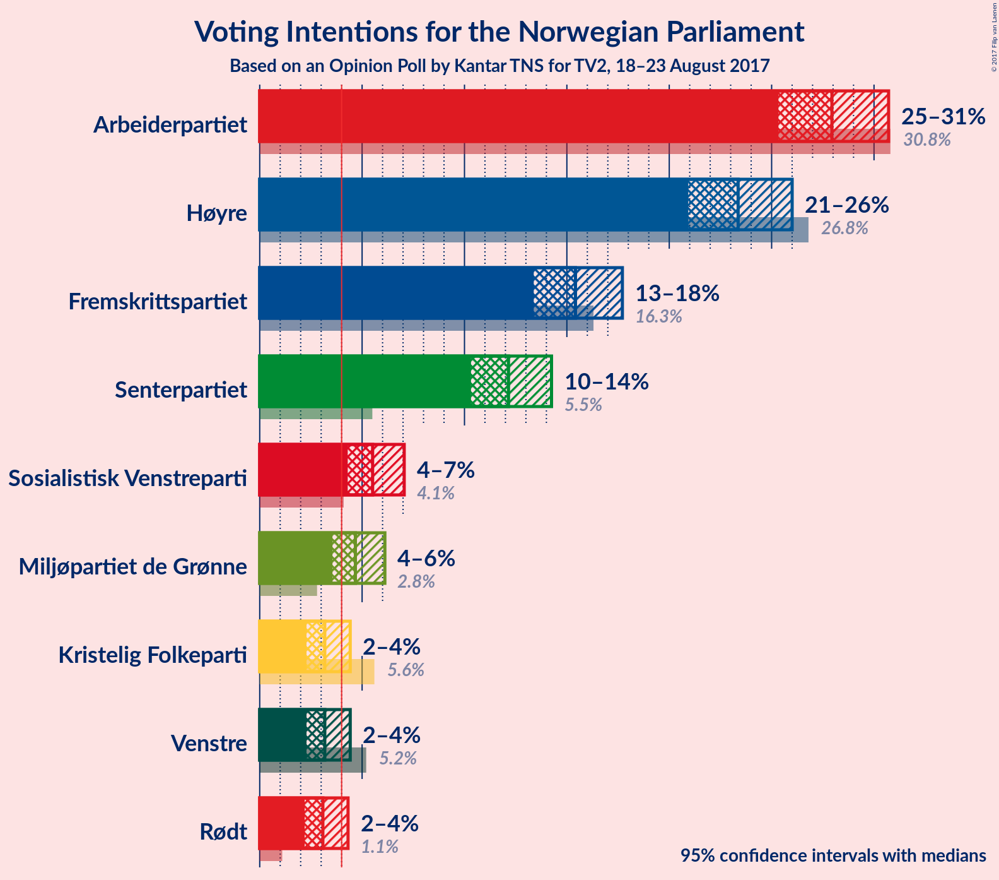
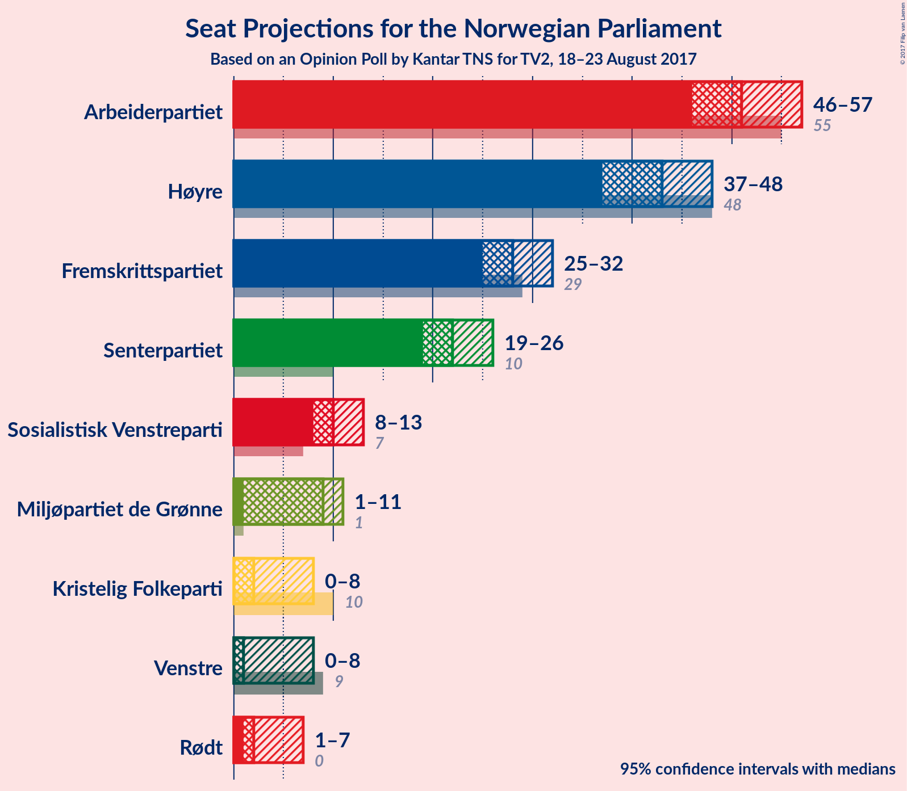
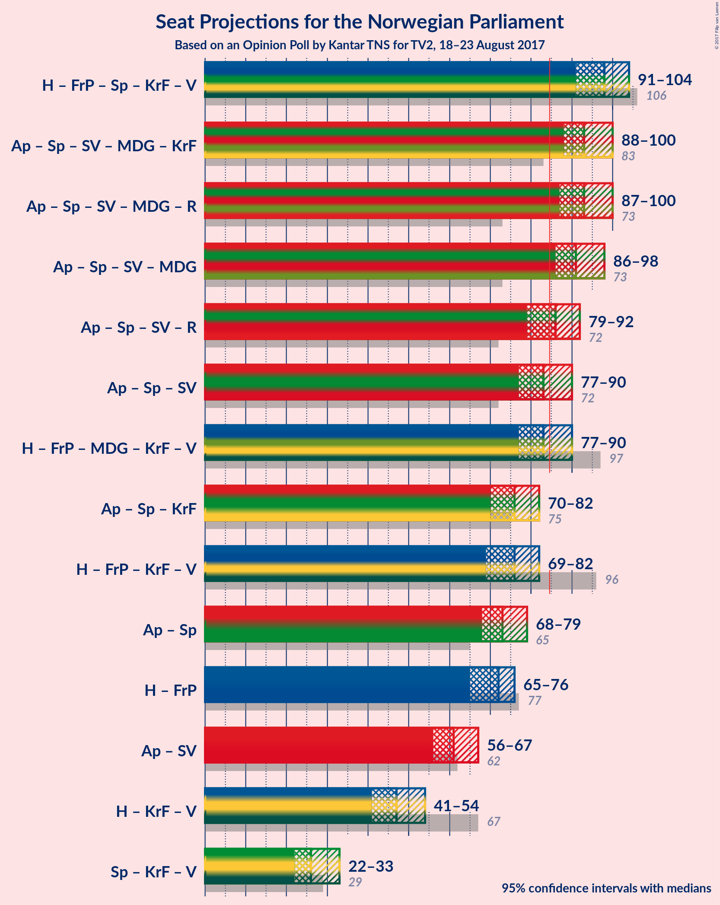

# Opinion Poll by Kantar TNS for TV2, 18–23 August 2017

<a href="#voting-intentions">Voting Intentions</a> | <a href="#seats">Seats</a> | <a href="#coalitions">Coalitions</a> | <a href="#technical-information">Technical Information</a>

## Voting Intentions

### Confidence Intervals

| Party | Last Result | Poll Result | 80% Confidence Interval | 90% Confidence Interval | 95% Confidence Interval | 99% Confidence Interval |
|:-----:|:-----------:|:-----------:|:-----------------------:|:-----------------------:|:-----------------------:|:-----------------------:|
| Arbeiderpartiet | 30.8% | 27.9% | 26.2–29.8% |25.7–30.3% |25.3–30.7% |24.5–31.6% |
| Høyre | 26.8% | 23.4% | 21.8–25.1% |21.3–25.6% |20.9–26.0% |20.2–26.8% |
| Fremskrittspartiet | 16.3% | 15.4% | 14.1–16.9% |13.7–17.3% |13.4–17.7% |12.8–18.5% |
| Senterpartiet | 5.5% | 12.1% | 10.9–13.5% |10.6–13.9% |10.3–14.3% |9.8–14.9% |
| Sosialistisk Venstreparti | 4.1% | 5.5% | 4.7–6.5% |4.5–6.8% |4.3–7.1% |3.9–7.6% |
| Miljøpartiet de Grønne | 2.8% | 4.7% | 3.9–5.6% |3.7–5.9% |3.6–6.1% |3.2–6.6% |
| Kristelig Folkeparti | 5.6% | 3.2% | 2.6–4.0% |2.4–4.2% |2.3–4.4% |2.0–4.8% |
| Venstre | 5.2% | 3.2% | 2.6–4.0% |2.4–4.2% |2.3–4.4% |2.0–4.8% |
| Rødt | 1.1% | 3.1% | 2.5–3.9% |2.3–4.1% |2.2–4.3% |2.0–4.7% |

*Note:* The poll result column reflects the actual value used in the calculations. Published results may vary slightly, and in addition be rounded to fewer digits.

## Seats

### Confidence Intervals

| Party | Last Result | Median | 80% Confidence Interval | 90% Confidence Interval | 95% Confidence Interval | 99% Confidence Interval |
|:-----:|:-----------:|:------:|:-----------------------:|:-----------------------:|:-----------------------:|:-----------------------:|
| <a href="#arbeiderpartiet">Arbeiderpartiet</a> | 55 | 50 | 48–55 |47–55 |47–55 |45–56 |
| <a href="#høyre">Høyre</a> | 48 | 43 | 37–47 |37–47 |37–49 |37–51 |
| <a href="#fremskrittspartiet">Fremskrittspartiet</a> | 29 | 28 | 25–32 |25–32 |25–33 |23–34 |
| <a href="#senterpartiet">Senterpartiet</a> | 10 | 21 | 19–24 |19–25 |19–26 |18–27 |
| <a href="#sosialistisk-venstreparti">Sosialistisk Venstreparti</a> | 7 | 10 | 9–13 |8–13 |8–13 |7–13 |
| <a href="#miljøpartiet-de-grønne">Miljøpartiet de Grønne</a> | 1 | 9 | 1–11 |1–11 |1–11 |1–12 |
| <a href="#kristelig-folkeparti">Kristelig Folkeparti</a> | 10 | 2 | 0–7 |0–7 |0–7 |0–8 |
| <a href="#venstre">Venstre</a> | 9 | 1 | 0–7 |0–8 |0–8 |0–8 |
| <a href="#rødt">Rødt</a> | 0 | 2 | 1–2 |1–7 |1–7 |1–8 |

### Arbeiderpartiet

| Number of Seats | Probability | Accumulated | Special Marks |
|:---------------:|:-----------:|:-----------:|:-------------:|
| 43 | 0.2% | 100% |  |
| 44 | 0.1% | 99.8% |  |
| 45 | 1.2% | 99.7% |  |
| 46 | 1.0% | 98.5% |  |
| 47 | 6% | 98% |  |
| 48 | 11% | 92% |  |
| 49 | 19% | 81% |  |
| 50 | 22% | 63% | Median |
| 51 | 8% | 41% |  |
| 52 | 0.6% | 33% |  |
| 53 | 2% | 32% |  |
| 54 | 8% | 30% |  |
| 55 | 21% | 22% | Last Result |
| 56 | 1.0% | 1.1% |  |
| 57 | 0% | 0.2% |  |
| 58 | 0.1% | 0.2% |  |
| 59 | 0% | 0.1% |  |
| 60 | 0% | 0% |  |

### Høyre

| Number of Seats | Probability | Accumulated | Special Marks |
|:---------------:|:-----------:|:-----------:|:-------------:|
| 35 | 0.3% | 100% |  |
| 36 | 0.1% | 99.7% |  |
| 37 | 11% | 99.6% |  |
| 38 | 2% | 88% |  |
| 39 | 8% | 86% |  |
| 40 | 3% | 79% |  |
| 41 | 4% | 76% |  |
| 42 | 21% | 72% |  |
| 43 | 11% | 51% | Median |
| 44 | 6% | 39% |  |
| 45 | 13% | 33% |  |
| 46 | 5% | 20% |  |
| 47 | 11% | 15% |  |
| 48 | 0.7% | 4% | Last Result |
| 49 | 2% | 3% |  |
| 50 | 0.1% | 0.9% |  |
| 51 | 0.7% | 0.7% |  |
| 52 | 0% | 0% |  |

### Fremskrittspartiet

| Number of Seats | Probability | Accumulated | Special Marks |
|:---------------:|:-----------:|:-----------:|:-------------:|
| 21 | 0% | 100% |  |
| 22 | 0.1% | 99.9% |  |
| 23 | 0.5% | 99.9% |  |
| 24 | 0.9% | 99.3% |  |
| 25 | 9% | 98% |  |
| 26 | 9% | 89% |  |
| 27 | 7% | 80% |  |
| 28 | 41% | 73% | Median |
| 29 | 2% | 32% | Last Result |
| 30 | 2% | 30% |  |
| 31 | 6% | 28% |  |
| 32 | 17% | 22% |  |
| 33 | 3% | 4% |  |
| 34 | 2% | 2% |  |
| 35 | 0% | 0.1% |  |
| 36 | 0% | 0% |  |

### Senterpartiet

| Number of Seats | Probability | Accumulated | Special Marks |
|:---------------:|:-----------:|:-----------:|:-------------:|
| 10 | 0% | 100% | Last Result |
| 11 | 0% | 100% |  |
| 12 | 0% | 100% |  |
| 13 | 0% | 100% |  |
| 14 | 0% | 100% |  |
| 15 | 0% | 100% |  |
| 16 | 0.1% | 100% |  |
| 17 | 0.2% | 99.9% |  |
| 18 | 2% | 99.7% |  |
| 19 | 21% | 98% |  |
| 20 | 8% | 77% |  |
| 21 | 31% | 68% | Median |
| 22 | 8% | 38% |  |
| 23 | 18% | 29% |  |
| 24 | 3% | 12% |  |
| 25 | 4% | 8% |  |
| 26 | 4% | 5% |  |
| 27 | 0.3% | 0.6% |  |
| 28 | 0% | 0.3% |  |
| 29 | 0.2% | 0.2% |  |
| 30 | 0% | 0% |  |

### Sosialistisk Venstreparti

| Number of Seats | Probability | Accumulated | Special Marks |
|:---------------:|:-----------:|:-----------:|:-------------:|
| 1 | 0.2% | 100% |  |
| 2 | 0.2% | 99.8% |  |
| 3 | 0% | 99.6% |  |
| 4 | 0% | 99.6% |  |
| 5 | 0% | 99.6% |  |
| 6 | 0% | 99.6% |  |
| 7 | 0.3% | 99.6% | Last Result |
| 8 | 5% | 99.3% |  |
| 9 | 7% | 94% |  |
| 10 | 47% | 87% | Median |
| 11 | 21% | 40% |  |
| 12 | 6% | 19% |  |
| 13 | 12% | 13% |  |
| 14 | 0.3% | 0.4% |  |
| 15 | 0.2% | 0.2% |  |
| 16 | 0% | 0% |  |

### Miljøpartiet de Grønne

| Number of Seats | Probability | Accumulated | Special Marks |
|:---------------:|:-----------:|:-----------:|:-------------:|
| 1 | 10% | 100% | Last Result |
| 2 | 2% | 90% |  |
| 3 | 0.7% | 87% |  |
| 4 | 2% | 87% |  |
| 5 | 0% | 84% |  |
| 6 | 0% | 84% |  |
| 7 | 14% | 84% |  |
| 8 | 12% | 71% |  |
| 9 | 17% | 59% | Median |
| 10 | 21% | 41% |  |
| 11 | 19% | 21% |  |
| 12 | 1.2% | 1.3% |  |
| 13 | 0.1% | 0.1% |  |
| 14 | 0% | 0% |  |

### Kristelig Folkeparti

| Number of Seats | Probability | Accumulated | Special Marks |
|:---------------:|:-----------:|:-----------:|:-------------:|
| 0 | 16% | 100% |  |
| 1 | 7% | 84% |  |
| 2 | 55% | 77% | Median |
| 3 | 0.1% | 22% |  |
| 4 | 0% | 22% |  |
| 5 | 0% | 22% |  |
| 6 | 0% | 22% |  |
| 7 | 20% | 22% |  |
| 8 | 1.2% | 2% |  |
| 9 | 0.2% | 0.3% |  |
| 10 | 0.2% | 0.2% | Last Result |
| 11 | 0% | 0% |  |

### Venstre

| Number of Seats | Probability | Accumulated | Special Marks |
|:---------------:|:-----------:|:-----------:|:-------------:|
| 0 | 11% | 100% |  |
| 1 | 52% | 89% | Median |
| 2 | 14% | 37% |  |
| 3 | 7% | 23% |  |
| 4 | 0% | 16% |  |
| 5 | 0% | 16% |  |
| 6 | 0.1% | 16% |  |
| 7 | 10% | 16% |  |
| 8 | 6% | 6% |  |
| 9 | 0.2% | 0.3% | Last Result |
| 10 | 0% | 0% |  |

### Rødt

| Number of Seats | Probability | Accumulated | Special Marks |
|:---------------:|:-----------:|:-----------:|:-------------:|
| 0 | 0% | 100% | Last Result |
| 1 | 35% | 100% |  |
| 2 | 59% | 65% | Median |
| 3 | 0% | 7% |  |
| 4 | 0% | 7% |  |
| 5 | 0% | 7% |  |
| 6 | 0% | 7% |  |
| 7 | 5% | 7% |  |
| 8 | 2% | 2% |  |
| 9 | 0.2% | 0.2% |  |
| 10 | 0% | 0% |  |

## Coalitions

### Confidence Intervals

| Coalition | Last Result | Median | Majority? | 80% Confidence Interval | 90% Confidence Interval | 95% Confidence Interval | 99% Confidence Interval |
|:---------:|:-----------:|:------:|:---------:|:-----------------------:|:-----------------------:|:-----------------------:|:-----------------------:|
| Høyre – Fremskrittspartiet – Senterpartiet – Kristelig Folkeparti – Venstre | 106 | 98 | 100% | 93–102 | 92–103 | 92–104 | 90–107 |
| Arbeiderpartiet – Senterpartiet – Sosialistisk Venstreparti – Miljøpartiet de Grønne – Rødt | 73 | 92 | 99.1% | 89–96 | 89–99 | 88–100 | 82–100 |
| Arbeiderpartiet – Senterpartiet – Sosialistisk Venstreparti – Miljøpartiet de Grønne – Kristelig Folkeparti | 83 | 94 | 99.2% | 90–97 | 88–99 | 88–99 | 83–101 |
| Arbeiderpartiet – Senterpartiet – Sosialistisk Venstreparti – Miljøpartiet de Grønne | 73 | 91 | 98% | 87–95 | 87–98 | 85–99 | 79–99 |
| Arbeiderpartiet – Senterpartiet – Sosialistisk Venstreparti – Rødt | 72 | 85 | 52% | 79–90 | 79–91 | 79–91 | 78–92 |
| Høyre – Fremskrittspartiet – Miljøpartiet de Grønne – Kristelig Folkeparti – Venstre | 97 | 84 | 48% | 79–90 | 78–90 | 78–90 | 77–91 |
| Arbeiderpartiet – Senterpartiet – Sosialistisk Venstreparti | 72 | 81 | 37% | 77–88 | 77–90 | 77–90 | 75–90 |
| Arbeiderpartiet – Senterpartiet – Kristelig Folkeparti | 75 | 74 | 0.1% | 71–80 | 70–80 | 70–81 | 70–81 |
| Høyre – Fremskrittspartiet – Kristelig Folkeparti – Venstre | 96 | 77 | 0.9% | 73–80 | 70–80 | 69–81 | 69–87 |
| Arbeiderpartiet – Senterpartiet | 65 | 71 | 0% | 67–78 | 67–79 | 67–80 | 67–80 |
| Høyre – Fremskrittspartiet | 77 | 71 | 0% | 66–75 | 65–75 | 65–76 | 63–83 |
| Arbeiderpartiet – Sosialistisk Venstreparti | 62 | 61 | 0% | 58–65 | 58–66 | 55–67 | 54–67 |
| Høyre – Kristelig Folkeparti – Venstre | 67 | 46 | 0% | 42–52 | 42–54 | 41–54 | 41–55 |
| Senterpartiet – Kristelig Folkeparti – Venstre | 29 | 26 | 0% | 21–35 | 21–35 | 21–35 | 20–36 |

### Høyre – Fremskrittspartiet – Senterpartiet – Kristelig Folkeparti – Venstre

| Number of Seats | Probability | Accumulated | Special Marks |
|:---------------:|:-----------:|:-----------:|:-------------:|
| 87 | 0.1% | 100% |  |
| 88 | 0.1% | 99.9% |  |
| 89 | 0.2% | 99.8% |  |
| 90 | 0.9% | 99.7% |  |
| 91 | 0.3% | 98.8% |  |
| 92 | 5% | 98% |  |
| 93 | 15% | 94% |  |
| 94 | 4% | 79% |  |
| 95 | 6% | 75% | Median |
| 96 | 8% | 68% |  |
| 97 | 2% | 60% |  |
| 98 | 19% | 58% |  |
| 99 | 9% | 40% |  |
| 100 | 8% | 31% |  |
| 101 | 10% | 22% |  |
| 102 | 6% | 12% |  |
| 103 | 4% | 6% |  |
| 104 | 0.2% | 3% |  |
| 105 | 1.2% | 2% |  |
| 106 | 0.4% | 1.2% | Last Result |
| 107 | 0.8% | 0.9% |  |
| 108 | 0% | 0% |  |

### Arbeiderpartiet – Senterpartiet – Sosialistisk Venstreparti – Miljøpartiet de Grønne – Rødt

| Number of Seats | Probability | Accumulated | Special Marks |
|:---------------:|:-----------:|:-----------:|:-------------:|
| 73 | 0% | 100% | Last Result |
| 74 | 0% | 100% |  |
| 75 | 0% | 100% |  |
| 76 | 0% | 100% |  |
| 77 | 0% | 100% |  |
| 78 | 0% | 100% |  |
| 79 | 0% | 100% |  |
| 80 | 0% | 100% |  |
| 81 | 0% | 100% |  |
| 82 | 0.7% | 100% |  |
| 83 | 0.2% | 99.3% |  |
| 84 | 0% | 99.2% |  |
| 85 | 0.3% | 99.1% | Majority |
| 86 | 0.8% | 98.9% |  |
| 87 | 0.6% | 98% |  |
| 88 | 0.7% | 98% |  |
| 89 | 14% | 97% |  |
| 90 | 10% | 83% |  |
| 91 | 13% | 72% |  |
| 92 | 18% | 60% | Median |
| 93 | 0.8% | 41% |  |
| 94 | 0.3% | 40% |  |
| 95 | 9% | 40% |  |
| 96 | 22% | 31% |  |
| 97 | 2% | 10% |  |
| 98 | 0.7% | 8% |  |
| 99 | 3% | 7% |  |
| 100 | 5% | 5% |  |
| 101 | 0% | 0.2% |  |
| 102 | 0% | 0.2% |  |
| 103 | 0% | 0.1% |  |
| 104 | 0% | 0.1% |  |
| 105 | 0.1% | 0.1% |  |
| 106 | 0% | 0% |  |

### Arbeiderpartiet – Senterpartiet – Sosialistisk Venstreparti – Miljøpartiet de Grønne – Kristelig Folkeparti

| Number of Seats | Probability | Accumulated | Special Marks |
|:---------------:|:-----------:|:-----------:|:-------------:|
| 81 | 0.1% | 100% |  |
| 82 | 0% | 99.9% |  |
| 83 | 0.7% | 99.9% | Last Result |
| 84 | 0.1% | 99.3% |  |
| 85 | 0.6% | 99.2% | Majority |
| 86 | 0.8% | 98.6% |  |
| 87 | 0% | 98% |  |
| 88 | 5% | 98% |  |
| 89 | 0.7% | 92% |  |
| 90 | 2% | 92% |  |
| 91 | 16% | 90% |  |
| 92 | 1.4% | 74% | Median |
| 93 | 18% | 72% |  |
| 94 | 18% | 54% |  |
| 95 | 18% | 37% |  |
| 96 | 4% | 19% |  |
| 97 | 6% | 15% |  |
| 98 | 4% | 9% |  |
| 99 | 3% | 5% |  |
| 100 | 0.2% | 2% |  |
| 101 | 2% | 2% |  |
| 102 | 0% | 0.1% |  |
| 103 | 0.1% | 0.1% |  |
| 104 | 0% | 0% |  |

### Arbeiderpartiet – Senterpartiet – Sosialistisk Venstreparti – Miljøpartiet de Grønne

| Number of Seats | Probability | Accumulated | Special Marks |
|:---------------:|:-----------:|:-----------:|:-------------:|
| 73 | 0% | 100% | Last Result |
| 74 | 0% | 100% |  |
| 75 | 0% | 100% |  |
| 76 | 0% | 100% |  |
| 77 | 0% | 100% |  |
| 78 | 0% | 100% |  |
| 79 | 0.7% | 100% |  |
| 80 | 0% | 99.3% |  |
| 81 | 0.7% | 99.3% |  |
| 82 | 0.2% | 98.5% |  |
| 83 | 0.3% | 98% |  |
| 84 | 0.3% | 98% |  |
| 85 | 1.0% | 98% | Majority |
| 86 | 0.8% | 97% |  |
| 87 | 14% | 96% |  |
| 88 | 10% | 82% |  |
| 89 | 17% | 72% |  |
| 90 | 2% | 55% | Median |
| 91 | 18% | 53% |  |
| 92 | 0.4% | 35% |  |
| 93 | 8% | 35% |  |
| 94 | 13% | 27% |  |
| 95 | 5% | 14% |  |
| 96 | 2% | 9% |  |
| 97 | 0% | 7% |  |
| 98 | 3% | 7% |  |
| 99 | 4% | 4% |  |
| 100 | 0% | 0.1% |  |
| 101 | 0% | 0.1% |  |
| 102 | 0% | 0.1% |  |
| 103 | 0.1% | 0.1% |  |
| 104 | 0% | 0% |  |

### Arbeiderpartiet – Senterpartiet – Sosialistisk Venstreparti – Rødt

| Number of Seats | Probability | Accumulated | Special Marks |
|:---------------:|:-----------:|:-----------:|:-------------:|
| 72 | 0% | 100% | Last Result |
| 73 | 0% | 100% |  |
| 74 | 0% | 100% |  |
| 75 | 0% | 100% |  |
| 76 | 0.2% | 100% |  |
| 77 | 0.3% | 99.8% |  |
| 78 | 0.4% | 99.5% |  |
| 79 | 9% | 99.1% |  |
| 80 | 0.8% | 90% |  |
| 81 | 19% | 89% |  |
| 82 | 7% | 70% |  |
| 83 | 10% | 63% | Median |
| 84 | 0.9% | 53% |  |
| 85 | 3% | 52% | Majority |
| 86 | 7% | 49% |  |
| 87 | 20% | 42% |  |
| 88 | 0.6% | 22% |  |
| 89 | 4% | 21% |  |
| 90 | 9% | 18% |  |
| 91 | 8% | 9% |  |
| 92 | 0.2% | 0.6% |  |
| 93 | 0.2% | 0.3% |  |
| 94 | 0.1% | 0.1% |  |
| 95 | 0% | 0% |  |

### Høyre – Fremskrittspartiet – Miljøpartiet de Grønne – Kristelig Folkeparti – Venstre

| Number of Seats | Probability | Accumulated | Special Marks |
|:---------------:|:-----------:|:-----------:|:-------------:|
| 75 | 0.1% | 100% |  |
| 76 | 0.2% | 99.9% |  |
| 77 | 0.2% | 99.7% |  |
| 78 | 8% | 99.4% |  |
| 79 | 9% | 91% |  |
| 80 | 4% | 82% |  |
| 81 | 0.6% | 79% |  |
| 82 | 20% | 78% |  |
| 83 | 7% | 58% | Median |
| 84 | 3% | 51% |  |
| 85 | 0.9% | 48% | Majority |
| 86 | 10% | 47% |  |
| 87 | 7% | 37% |  |
| 88 | 19% | 30% |  |
| 89 | 0.8% | 11% |  |
| 90 | 9% | 10% |  |
| 91 | 0.4% | 0.9% |  |
| 92 | 0.3% | 0.5% |  |
| 93 | 0.2% | 0.2% |  |
| 94 | 0% | 0% |  |
| 95 | 0% | 0% |  |
| 96 | 0% | 0% |  |
| 97 | 0% | 0% | Last Result |

### Arbeiderpartiet – Senterpartiet – Sosialistisk Venstreparti

| Number of Seats | Probability | Accumulated | Special Marks |
|:---------------:|:-----------:|:-----------:|:-------------:|
| 72 | 0.1% | 100% | Last Result |
| 73 | 0% | 99.9% |  |
| 74 | 0.1% | 99.9% |  |
| 75 | 1.1% | 99.8% |  |
| 76 | 1.1% | 98.8% |  |
| 77 | 9% | 98% |  |
| 78 | 1.2% | 89% |  |
| 79 | 2% | 88% |  |
| 80 | 27% | 86% |  |
| 81 | 10% | 59% | Median |
| 82 | 2% | 49% |  |
| 83 | 3% | 47% |  |
| 84 | 7% | 44% |  |
| 85 | 9% | 37% | Majority |
| 86 | 7% | 27% |  |
| 87 | 3% | 21% |  |
| 88 | 10% | 18% |  |
| 89 | 2% | 8% |  |
| 90 | 6% | 6% |  |
| 91 | 0.1% | 0.2% |  |
| 92 | 0% | 0% |  |

### Arbeiderpartiet – Senterpartiet – Kristelig Folkeparti

| Number of Seats | Probability | Accumulated | Special Marks |
|:---------------:|:-----------:|:-----------:|:-------------:|
| 67 | 0.1% | 100% |  |
| 68 | 0.1% | 99.8% |  |
| 69 | 0.1% | 99.7% |  |
| 70 | 5% | 99.6% |  |
| 71 | 13% | 94% |  |
| 72 | 21% | 81% |  |
| 73 | 0.8% | 60% | Median |
| 74 | 11% | 59% |  |
| 75 | 6% | 49% | Last Result |
| 76 | 8% | 43% |  |
| 77 | 0.3% | 35% |  |
| 78 | 15% | 35% |  |
| 79 | 1.1% | 19% |  |
| 80 | 16% | 18% |  |
| 81 | 2% | 3% |  |
| 82 | 0.3% | 0.4% |  |
| 83 | 0% | 0.1% |  |
| 84 | 0% | 0.1% |  |
| 85 | 0% | 0.1% | Majority |
| 86 | 0% | 0% |  |

### Høyre – Fremskrittspartiet – Kristelig Folkeparti – Venstre

| Number of Seats | Probability | Accumulated | Special Marks |
|:---------------:|:-----------:|:-----------:|:-------------:|
| 64 | 0.1% | 100% |  |
| 65 | 0% | 99.9% |  |
| 66 | 0% | 99.9% |  |
| 67 | 0% | 99.9% |  |
| 68 | 0% | 99.8% |  |
| 69 | 5% | 99.8% |  |
| 70 | 3% | 95% |  |
| 71 | 0.7% | 93% |  |
| 72 | 2% | 92% |  |
| 73 | 22% | 90% |  |
| 74 | 9% | 69% | Median |
| 75 | 0.3% | 60% |  |
| 76 | 0.8% | 60% |  |
| 77 | 18% | 59% |  |
| 78 | 13% | 40% |  |
| 79 | 10% | 28% |  |
| 80 | 14% | 17% |  |
| 81 | 0.7% | 3% |  |
| 82 | 0.6% | 2% |  |
| 83 | 0.8% | 2% |  |
| 84 | 0.3% | 1.1% |  |
| 85 | 0% | 0.9% | Majority |
| 86 | 0.2% | 0.8% |  |
| 87 | 0.7% | 0.7% |  |
| 88 | 0% | 0% |  |
| 89 | 0% | 0% |  |
| 90 | 0% | 0% |  |
| 91 | 0% | 0% |  |
| 92 | 0% | 0% |  |
| 93 | 0% | 0% |  |
| 94 | 0% | 0% |  |
| 95 | 0% | 0% |  |
| 96 | 0% | 0% | Last Result |

### Arbeiderpartiet – Senterpartiet

| Number of Seats | Probability | Accumulated | Special Marks |
|:---------------:|:-----------:|:-----------:|:-------------:|
| 64 | 0.2% | 100% |  |
| 65 | 0.1% | 99.8% | Last Result |
| 66 | 0.2% | 99.7% |  |
| 67 | 10% | 99.5% |  |
| 68 | 1.4% | 89% |  |
| 69 | 10% | 88% |  |
| 70 | 17% | 77% |  |
| 71 | 19% | 60% | Median |
| 72 | 4% | 42% |  |
| 73 | 5% | 38% |  |
| 74 | 8% | 33% |  |
| 75 | 0.7% | 25% |  |
| 76 | 4% | 24% |  |
| 77 | 1.0% | 21% |  |
| 78 | 14% | 20% |  |
| 79 | 2% | 6% |  |
| 80 | 3% | 4% |  |
| 81 | 0.2% | 0.3% |  |
| 82 | 0.1% | 0.1% |  |
| 83 | 0% | 0% |  |

### Høyre – Fremskrittspartiet

| Number of Seats | Probability | Accumulated | Special Marks |
|:---------------:|:-----------:|:-----------:|:-------------:|
| 60 | 0% | 100% |  |
| 61 | 0% | 99.9% |  |
| 62 | 0.1% | 99.9% |  |
| 63 | 0.6% | 99.8% |  |
| 64 | 0.3% | 99.2% |  |
| 65 | 9% | 98.9% |  |
| 66 | 5% | 90% |  |
| 67 | 3% | 85% |  |
| 68 | 0.8% | 82% |  |
| 69 | 3% | 81% |  |
| 70 | 13% | 78% |  |
| 71 | 17% | 65% | Median |
| 72 | 15% | 48% |  |
| 73 | 0.3% | 34% |  |
| 74 | 18% | 34% |  |
| 75 | 11% | 16% |  |
| 76 | 2% | 4% |  |
| 77 | 0.1% | 2% | Last Result |
| 78 | 0.2% | 2% |  |
| 79 | 0.9% | 2% |  |
| 80 | 0.2% | 0.9% |  |
| 81 | 0% | 0.7% |  |
| 82 | 0% | 0.7% |  |
| 83 | 0.7% | 0.7% |  |
| 84 | 0% | 0% |  |

### Arbeiderpartiet – Sosialistisk Venstreparti

| Number of Seats | Probability | Accumulated | Special Marks |
|:---------------:|:-----------:|:-----------:|:-------------:|
| 51 | 0.1% | 100% |  |
| 52 | 0% | 99.9% |  |
| 53 | 0% | 99.9% |  |
| 54 | 1.3% | 99.8% |  |
| 55 | 1.0% | 98.5% |  |
| 56 | 2% | 97% |  |
| 57 | 0.3% | 96% |  |
| 58 | 15% | 95% |  |
| 59 | 16% | 80% |  |
| 60 | 9% | 64% | Median |
| 61 | 11% | 55% |  |
| 62 | 4% | 44% | Last Result |
| 63 | 6% | 41% |  |
| 64 | 14% | 35% |  |
| 65 | 11% | 20% |  |
| 66 | 6% | 9% |  |
| 67 | 4% | 4% |  |
| 68 | 0% | 0.2% |  |
| 69 | 0.1% | 0.1% |  |
| 70 | 0% | 0.1% |  |
| 71 | 0% | 0% |  |

### Høyre – Kristelig Folkeparti – Venstre

| Number of Seats | Probability | Accumulated | Special Marks |
|:---------------:|:-----------:|:-----------:|:-------------:|
| 38 | 0.1% | 100% |  |
| 39 | 0.1% | 99.9% |  |
| 40 | 0% | 99.8% |  |
| 41 | 3% | 99.8% |  |
| 42 | 7% | 96% |  |
| 43 | 2% | 89% |  |
| 44 | 3% | 87% |  |
| 45 | 21% | 84% |  |
| 46 | 15% | 63% | Median |
| 47 | 2% | 48% |  |
| 48 | 7% | 46% |  |
| 49 | 0.9% | 39% |  |
| 50 | 10% | 39% |  |
| 51 | 9% | 28% |  |
| 52 | 12% | 19% |  |
| 53 | 0.1% | 7% |  |
| 54 | 6% | 7% |  |
| 55 | 1.2% | 2% |  |
| 56 | 0.3% | 0.5% |  |
| 57 | 0% | 0.2% |  |
| 58 | 0% | 0.2% |  |
| 59 | 0% | 0.2% |  |
| 60 | 0.2% | 0.2% |  |
| 61 | 0% | 0% |  |
| 62 | 0% | 0% |  |
| 63 | 0% | 0% |  |
| 64 | 0% | 0% |  |
| 65 | 0% | 0% |  |
| 66 | 0% | 0% |  |
| 67 | 0% | 0% | Last Result |

### Senterpartiet – Kristelig Folkeparti – Venstre

| Number of Seats | Probability | Accumulated | Special Marks |
|:---------------:|:-----------:|:-----------:|:-------------:|
| 19 | 0.1% | 100% |  |
| 20 | 1.5% | 99.9% |  |
| 21 | 12% | 98% |  |
| 22 | 7% | 86% |  |
| 23 | 6% | 80% |  |
| 24 | 18% | 74% | Median |
| 25 | 0.5% | 56% |  |
| 26 | 17% | 56% |  |
| 27 | 1.0% | 38% |  |
| 28 | 15% | 37% |  |
| 29 | 5% | 22% | Last Result |
| 30 | 0.6% | 17% |  |
| 31 | 5% | 16% |  |
| 32 | 0.5% | 11% |  |
| 33 | 0.6% | 11% |  |
| 34 | 0.1% | 10% |  |
| 35 | 8% | 10% |  |
| 36 | 1.3% | 2% |  |
| 37 | 0.3% | 0.4% |  |
| 38 | 0% | 0.1% |  |
| 39 | 0% | 0% |  |

## Technical Information

### Opinion Poll

+ **Pollster:** Kantar TNS
+ **Media:** TV2
+ **Fieldwork period:** 18–23 August 2017

### Calculations

+ **Sample size:** 1070
+ **Simulations done:** 65,536
+ **Error estimate:** 2.61%

