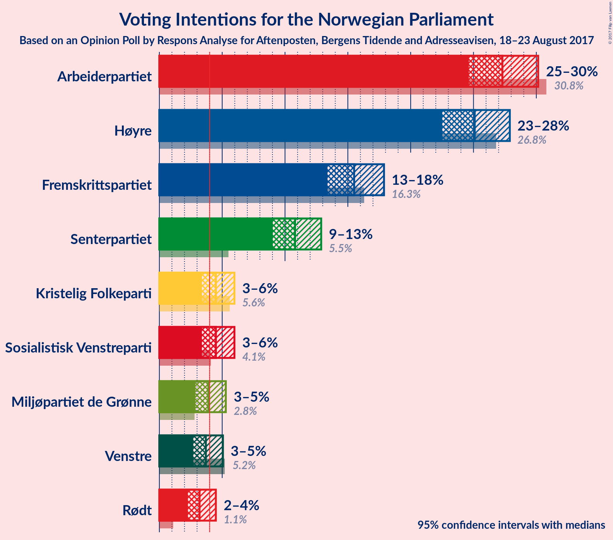
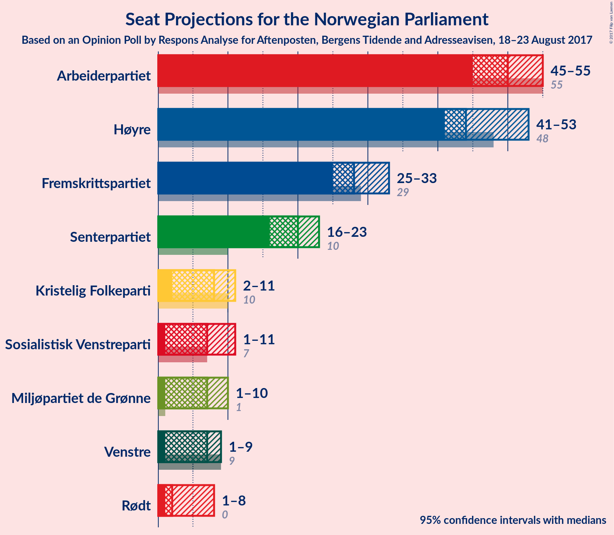
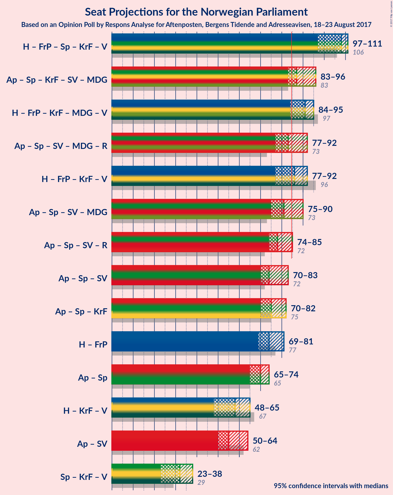

# Opinion Poll by Respons Analyse for Aftenposten, Bergens Tidende and Adresseavisen, 18–23 August 2017

<a href="#voting-intentions">Voting Intentions</a> | <a href="#seats">Seats</a> | <a href="#coalitions">Coalitions</a> | <a href="#technical-information">Technical Information</a>

## Voting Intentions

### Confidence Intervals

| Party | Last Result | Poll Result | 80% Confidence Interval | 90% Confidence Interval | 95% Confidence Interval | 99% Confidence Interval |
|:-----:|:-----------:|:-----------:|:-----------------------:|:-----------------------:|:-----------------------:|:-----------------------:|
| Arbeiderpartiet | 30.8% | 27.3% | 25.5–29.2% |25.0–29.7% |24.6–30.1% |23.8–31.1% |
| Høyre | 26.8% | 25.1% | 23.4–26.9% |22.9–27.4% |22.5–27.9% |21.7–28.8% |
| Fremskrittspartiet | 16.3% | 15.5% | 14.1–17.1% |13.7–17.5% |13.4–17.9% |12.7–18.7% |
| Senterpartiet | 5.5% | 10.8% | 9.6–12.2% |9.3–12.5% |9.0–12.9% |8.5–13.6% |
| Kristelig Folkeparti | 5.6% | 4.5% | 3.8–5.5% |3.6–5.7% |3.4–6.0% |3.0–6.5% |
| Sosialistisk Venstreparti | 4.1% | 4.5% | 3.8–5.5% |3.6–5.7% |3.4–6.0% |3.0–6.5% |
| Miljøpartiet de Grønne | 2.8% | 3.9% | 3.2–4.8% |3.0–5.1% |2.9–5.3% |2.6–5.8% |
| Venstre | 5.2% | 3.7% | 3.0–4.6% |2.9–4.8% |2.7–5.1% |2.4–5.5% |
| Rødt | 1.1% | 3.2% | 2.6–4.0% |2.4–4.3% |2.3–4.5% |2.0–4.9% |

*Note:* The poll result column reflects the actual value used in the calculations. Published results may vary slightly, and in addition be rounded to fewer digits.

## Seats

### Confidence Intervals

| Party | Last Result | Median | 80% Confidence Interval | 90% Confidence Interval | 95% Confidence Interval | 99% Confidence Interval |
|:-----:|:-----------:|:------:|:-----------------------:|:-----------------------:|:-----------------------:|:-----------------------:|
| <a href="#arbeiderpartiet">Arbeiderpartiet</a> | 55 | 50 | 46–54 |45–54 |45–56 |44–57 |
| <a href="#høyre">Høyre</a> | 48 | 45 | 42–49 |41–51 |39–53 |38–54 |
| <a href="#fremskrittspartiet">Fremskrittspartiet</a> | 29 | 28 | 26–32 |25–32 |24–33 |23–34 |
| <a href="#senterpartiet">Senterpartiet</a> | 10 | 20 | 18–22 |17–23 |16–23 |14–25 |
| <a href="#kristelig-folkeparti">Kristelig Folkeparti</a> | 10 | 8 | 2–10 |2–10 |2–11 |1–11 |
| <a href="#sosialistisk-venstreparti">Sosialistisk Venstreparti</a> | 7 | 8 | 2–10 |1–10 |1–11 |1–12 |
| <a href="#miljøpartiet-de-grønne">Miljøpartiet de Grønne</a> | 1 | 3 | 1–9 |1–9 |1–10 |1–10 |
| <a href="#venstre">Venstre</a> | 9 | 2 | 1–8 |1–9 |1–9 |1–9 |
| <a href="#rødt">Rødt</a> | 0 | 2 | 1–7 |1–8 |1–8 |1–9 |

### Arbeiderpartiet

| Number of Seats | Probability | Accumulated | Special Marks |
|:---------------:|:-----------:|:-----------:|:-------------:|
| 41 | 0% | 100% |  |
| 42 | 0% | 99.9% |  |
| 43 | 0.1% | 99.9% |  |
| 44 | 0.5% | 99.8% |  |
| 45 | 5% | 99.3% |  |
| 46 | 7% | 94% |  |
| 47 | 10% | 87% |  |
| 48 | 7% | 77% |  |
| 49 | 15% | 70% |  |
| 50 | 15% | 56% | Median |
| 51 | 12% | 41% |  |
| 52 | 8% | 29% |  |
| 53 | 10% | 21% |  |
| 54 | 6% | 11% |  |
| 55 | 2% | 5% | Last Result |
| 56 | 0.8% | 3% |  |
| 57 | 1.5% | 2% |  |
| 58 | 0.2% | 0.4% |  |
| 59 | 0.2% | 0.2% |  |
| 60 | 0% | 0.1% |  |
| 61 | 0% | 0% |  |

### Høyre

| Number of Seats | Probability | Accumulated | Special Marks |
|:---------------:|:-----------:|:-----------:|:-------------:|
| 37 | 0.1% | 100% |  |
| 38 | 0.8% | 99.8% |  |
| 39 | 2% | 99.0% |  |
| 40 | 1.3% | 97% |  |
| 41 | 4% | 96% |  |
| 42 | 11% | 91% |  |
| 43 | 6% | 81% |  |
| 44 | 13% | 75% |  |
| 45 | 13% | 62% | Median |
| 46 | 9% | 48% |  |
| 47 | 15% | 40% |  |
| 48 | 7% | 25% | Last Result |
| 49 | 11% | 18% |  |
| 50 | 2% | 7% |  |
| 51 | 2% | 6% |  |
| 52 | 1.1% | 4% |  |
| 53 | 0.5% | 3% |  |
| 54 | 2% | 2% |  |
| 55 | 0.2% | 0.3% |  |
| 56 | 0% | 0.1% |  |
| 57 | 0% | 0% |  |

### Fremskrittspartiet

| Number of Seats | Probability | Accumulated | Special Marks |
|:---------------:|:-----------:|:-----------:|:-------------:|
| 22 | 0.3% | 100% |  |
| 23 | 0.7% | 99.6% |  |
| 24 | 2% | 98.9% |  |
| 25 | 5% | 97% |  |
| 26 | 5% | 92% |  |
| 27 | 14% | 87% |  |
| 28 | 26% | 73% | Median |
| 29 | 19% | 48% | Last Result |
| 30 | 13% | 29% |  |
| 31 | 4% | 15% |  |
| 32 | 9% | 12% |  |
| 33 | 2% | 3% |  |
| 34 | 0.6% | 1.0% |  |
| 35 | 0.3% | 0.4% |  |
| 36 | 0% | 0.1% |  |
| 37 | 0.1% | 0.1% |  |
| 38 | 0% | 0% |  |

### Senterpartiet

| Number of Seats | Probability | Accumulated | Special Marks |
|:---------------:|:-----------:|:-----------:|:-------------:|
| 10 | 0% | 100% | Last Result |
| 11 | 0% | 100% |  |
| 12 | 0% | 100% |  |
| 13 | 0.1% | 100% |  |
| 14 | 0.4% | 99.9% |  |
| 15 | 2% | 99.5% |  |
| 16 | 2% | 98% |  |
| 17 | 4% | 96% |  |
| 18 | 16% | 92% |  |
| 19 | 24% | 76% |  |
| 20 | 23% | 52% | Median |
| 21 | 10% | 29% |  |
| 22 | 12% | 19% |  |
| 23 | 5% | 7% |  |
| 24 | 0.7% | 1.5% |  |
| 25 | 0.4% | 0.8% |  |
| 26 | 0.2% | 0.4% |  |
| 27 | 0.1% | 0.1% |  |
| 28 | 0% | 0% |  |

### Kristelig Folkeparti

| Number of Seats | Probability | Accumulated | Special Marks |
|:---------------:|:-----------:|:-----------:|:-------------:|
| 1 | 0.7% | 100% |  |
| 2 | 15% | 99.3% |  |
| 3 | 5% | 84% |  |
| 4 | 0% | 79% |  |
| 5 | 0% | 79% |  |
| 6 | 0% | 79% |  |
| 7 | 4% | 79% |  |
| 8 | 36% | 75% | Median |
| 9 | 27% | 39% |  |
| 10 | 10% | 12% | Last Result |
| 11 | 2% | 3% |  |
| 12 | 0.3% | 0.5% |  |
| 13 | 0.1% | 0.1% |  |
| 14 | 0% | 0% |  |

### Sosialistisk Venstreparti

| Number of Seats | Probability | Accumulated | Special Marks |
|:---------------:|:-----------:|:-----------:|:-------------:|
| 1 | 5% | 100% |  |
| 2 | 22% | 95% |  |
| 3 | 0% | 73% |  |
| 4 | 0% | 73% |  |
| 5 | 0% | 73% |  |
| 6 | 0% | 73% |  |
| 7 | 6% | 73% | Last Result |
| 8 | 33% | 67% | Median |
| 9 | 18% | 34% |  |
| 10 | 12% | 15% |  |
| 11 | 3% | 3% |  |
| 12 | 0.6% | 0.7% |  |
| 13 | 0.1% | 0.1% |  |
| 14 | 0% | 0% |  |

### Miljøpartiet de Grønne

| Number of Seats | Probability | Accumulated | Special Marks |
|:---------------:|:-----------:|:-----------:|:-------------:|
| 1 | 32% | 100% | Last Result |
| 2 | 9% | 68% |  |
| 3 | 15% | 59% | Median |
| 4 | 3% | 44% |  |
| 5 | 0% | 41% |  |
| 6 | 0% | 41% |  |
| 7 | 10% | 41% |  |
| 8 | 20% | 31% |  |
| 9 | 7% | 11% |  |
| 10 | 4% | 4% |  |
| 11 | 0.1% | 0.1% |  |
| 12 | 0% | 0% |  |

### Venstre

| Number of Seats | Probability | Accumulated | Special Marks |
|:---------------:|:-----------:|:-----------:|:-------------:|
| 0 | 0.2% | 100% |  |
| 1 | 18% | 99.8% |  |
| 2 | 32% | 81% | Median |
| 3 | 12% | 50% |  |
| 4 | 0% | 38% |  |
| 5 | 0% | 38% |  |
| 6 | 0.1% | 38% |  |
| 7 | 9% | 38% |  |
| 8 | 20% | 29% |  |
| 9 | 9% | 9% | Last Result |
| 10 | 0.4% | 0.4% |  |
| 11 | 0.1% | 0.1% |  |
| 12 | 0% | 0% |  |

### Rødt

| Number of Seats | Probability | Accumulated | Special Marks |
|:---------------:|:-----------:|:-----------:|:-------------:|
| 0 | 0% | 100% | Last Result |
| 1 | 15% | 100% |  |
| 2 | 73% | 85% | Median |
| 3 | 0% | 12% |  |
| 4 | 0% | 12% |  |
| 5 | 0% | 12% |  |
| 6 | 0.1% | 12% |  |
| 7 | 5% | 12% |  |
| 8 | 7% | 7% |  |
| 9 | 0.4% | 0.5% |  |
| 10 | 0.1% | 0.1% |  |
| 11 | 0% | 0% |  |

## Coalitions

### Confidence Intervals

| Coalition | Last Result | Median | Majority? | 80% Confidence Interval | 90% Confidence Interval | 95% Confidence Interval | 99% Confidence Interval |
|:---------:|:-----------:|:------:|:---------:|:-----------------------:|:-----------------------:|:-----------------------:|:-----------------------:|
| Høyre – Fremskrittspartiet – Senterpartiet – Kristelig Folkeparti – Venstre | 106 | 105 | 100% | 99–111 | 98–112 | 97–113 | 94–115 |
| Høyre – Fremskrittspartiet – Kristelig Folkeparti – Miljøpartiet de Grønne – Venstre | 97 | 90 | 93% | 85–95 | 84–97 | 83–98 | 80–100 |
| Arbeiderpartiet – Senterpartiet – Kristelig Folkeparti – Sosialistisk Venstreparti – Miljøpartiet de Grønne | 83 | 88 | 83% | 82–94 | 81–95 | 81–96 | 79–99 |
| Høyre – Fremskrittspartiet – Kristelig Folkeparti – Venstre | 96 | 85 | 61% | 80–91 | 79–92 | 77–95 | 74–95 |
| Arbeiderpartiet – Senterpartiet – Sosialistisk Venstreparti – Miljøpartiet de Grønne – Rødt | 73 | 84 | 39% | 78–89 | 77–90 | 74–92 | 74–95 |
| Arbeiderpartiet – Senterpartiet – Sosialistisk Venstreparti – Miljøpartiet de Grønne | 73 | 81 | 23% | 76–86 | 74–88 | 72–89 | 71–92 |
| Arbeiderpartiet – Senterpartiet – Sosialistisk Venstreparti – Rødt | 72 | 79 | 7% | 74–84 | 72–85 | 71–86 | 69–89 |
| Arbeiderpartiet – Senterpartiet – Kristelig Folkeparti | 75 | 77 | 2% | 72–81 | 71–83 | 69–84 | 68–86 |
| Arbeiderpartiet – Senterpartiet – Sosialistisk Venstreparti | 72 | 76 | 1.0% | 72–82 | 70–83 | 69–84 | 66–85 |
| Høyre – Fremskrittspartiet | 77 | 74 | 0.2% | 69–79 | 69–81 | 67–84 | 65–84 |
| Arbeiderpartiet – Senterpartiet | 65 | 69 | 0% | 66–74 | 65–75 | 64–76 | 62–79 |
| Høyre – Kristelig Folkeparti – Venstre | 67 | 57 | 0% | 51–63 | 50–64 | 49–66 | 47–67 |
| Arbeiderpartiet – Sosialistisk Venstreparti | 62 | 57 | 0% | 52–62 | 51–63 | 50–64 | 49–65 |
| Senterpartiet – Kristelig Folkeparti – Venstre | 29 | 31 | 0% | 24–36 | 24–38 | 23–39 | 21–41 |

### Høyre – Fremskrittspartiet – Senterpartiet – Kristelig Folkeparti – Venstre

| Number of Seats | Probability | Accumulated | Special Marks |
|:---------------:|:-----------:|:-----------:|:-------------:|
| 91 | 0% | 100% |  |
| 92 | 0.1% | 99.9% |  |
| 93 | 0.1% | 99.9% |  |
| 94 | 0.3% | 99.8% |  |
| 95 | 0.8% | 99.5% |  |
| 96 | 0.8% | 98.6% |  |
| 97 | 1.2% | 98% |  |
| 98 | 4% | 97% |  |
| 99 | 5% | 92% |  |
| 100 | 2% | 87% |  |
| 101 | 5% | 85% |  |
| 102 | 8% | 80% |  |
| 103 | 7% | 72% | Median |
| 104 | 7% | 66% |  |
| 105 | 13% | 59% |  |
| 106 | 5% | 45% | Last Result |
| 107 | 4% | 41% |  |
| 108 | 12% | 37% |  |
| 109 | 9% | 25% |  |
| 110 | 2% | 16% |  |
| 111 | 5% | 14% |  |
| 112 | 4% | 9% |  |
| 113 | 4% | 5% |  |
| 114 | 0.3% | 0.9% |  |
| 115 | 0.4% | 0.7% |  |
| 116 | 0.2% | 0.3% |  |
| 117 | 0% | 0.1% |  |
| 118 | 0% | 0.1% |  |
| 119 | 0% | 0% |  |

### Høyre – Fremskrittspartiet – Kristelig Folkeparti – Miljøpartiet de Grønne – Venstre

| Number of Seats | Probability | Accumulated | Special Marks |
|:---------------:|:-----------:|:-----------:|:-------------:|
| 77 | 0.1% | 100% |  |
| 78 | 0.1% | 99.9% |  |
| 79 | 0.2% | 99.8% |  |
| 80 | 0.2% | 99.6% |  |
| 81 | 0.3% | 99.4% |  |
| 82 | 0.7% | 99.0% |  |
| 83 | 0.8% | 98% |  |
| 84 | 5% | 97% |  |
| 85 | 6% | 93% | Majority |
| 86 | 11% | 86% | Median |
| 87 | 5% | 76% |  |
| 88 | 8% | 71% |  |
| 89 | 7% | 63% |  |
| 90 | 9% | 56% |  |
| 91 | 9% | 46% |  |
| 92 | 7% | 37% |  |
| 93 | 13% | 30% |  |
| 94 | 6% | 17% |  |
| 95 | 3% | 12% |  |
| 96 | 2% | 8% |  |
| 97 | 2% | 6% | Last Result |
| 98 | 3% | 4% |  |
| 99 | 0.2% | 0.8% |  |
| 100 | 0.3% | 0.7% |  |
| 101 | 0.2% | 0.4% |  |
| 102 | 0.1% | 0.2% |  |
| 103 | 0% | 0% |  |

### Arbeiderpartiet – Senterpartiet – Kristelig Folkeparti – Sosialistisk Venstreparti – Miljøpartiet de Grønne

| Number of Seats | Probability | Accumulated | Special Marks |
|:---------------:|:-----------:|:-----------:|:-------------:|
| 75 | 0.1% | 100% |  |
| 76 | 0% | 99.9% |  |
| 77 | 0.2% | 99.9% |  |
| 78 | 0.2% | 99.7% |  |
| 79 | 0.5% | 99.6% |  |
| 80 | 1.4% | 99.0% |  |
| 81 | 6% | 98% |  |
| 82 | 2% | 92% |  |
| 83 | 1.3% | 90% | Last Result |
| 84 | 5% | 89% |  |
| 85 | 14% | 83% | Majority |
| 86 | 10% | 69% |  |
| 87 | 8% | 59% |  |
| 88 | 4% | 51% |  |
| 89 | 8% | 47% | Median |
| 90 | 12% | 39% |  |
| 91 | 3% | 27% |  |
| 92 | 4% | 24% |  |
| 93 | 4% | 20% |  |
| 94 | 10% | 16% |  |
| 95 | 2% | 6% |  |
| 96 | 2% | 4% |  |
| 97 | 1.2% | 2% |  |
| 98 | 0.2% | 0.7% |  |
| 99 | 0.4% | 0.5% |  |
| 100 | 0% | 0.1% |  |
| 101 | 0% | 0% |  |

### Høyre – Fremskrittspartiet – Kristelig Folkeparti – Venstre

| Number of Seats | Probability | Accumulated | Special Marks |
|:---------------:|:-----------:|:-----------:|:-------------:|
| 72 | 0.1% | 100% |  |
| 73 | 0.2% | 99.9% |  |
| 74 | 0.3% | 99.7% |  |
| 75 | 0.2% | 99.5% |  |
| 76 | 0.9% | 99.3% |  |
| 77 | 3% | 98% |  |
| 78 | 0.7% | 96% |  |
| 79 | 3% | 95% |  |
| 80 | 2% | 92% |  |
| 81 | 6% | 90% |  |
| 82 | 10% | 83% |  |
| 83 | 7% | 74% | Median |
| 84 | 6% | 67% |  |
| 85 | 15% | 61% | Majority |
| 86 | 9% | 46% |  |
| 87 | 4% | 38% |  |
| 88 | 4% | 34% |  |
| 89 | 8% | 31% |  |
| 90 | 11% | 23% |  |
| 91 | 5% | 12% |  |
| 92 | 2% | 7% |  |
| 93 | 0.9% | 5% |  |
| 94 | 0.3% | 4% |  |
| 95 | 3% | 4% |  |
| 96 | 0.1% | 0.4% | Last Result |
| 97 | 0.3% | 0.3% |  |
| 98 | 0% | 0% |  |

### Arbeiderpartiet – Senterpartiet – Sosialistisk Venstreparti – Miljøpartiet de Grønne – Rødt

| Number of Seats | Probability | Accumulated | Special Marks |
|:---------------:|:-----------:|:-----------:|:-------------:|
| 72 | 0.3% | 100% |  |
| 73 | 0.1% | 99.7% | Last Result |
| 74 | 3% | 99.6% |  |
| 75 | 0.3% | 96% |  |
| 76 | 0.9% | 96% |  |
| 77 | 2% | 95% |  |
| 78 | 5% | 93% |  |
| 79 | 11% | 88% |  |
| 80 | 8% | 77% |  |
| 81 | 4% | 69% |  |
| 82 | 4% | 66% |  |
| 83 | 9% | 62% | Median |
| 84 | 15% | 54% |  |
| 85 | 6% | 39% | Majority |
| 86 | 7% | 33% |  |
| 87 | 10% | 26% |  |
| 88 | 6% | 17% |  |
| 89 | 2% | 10% |  |
| 90 | 3% | 8% |  |
| 91 | 0.7% | 5% |  |
| 92 | 3% | 4% |  |
| 93 | 0.9% | 2% |  |
| 94 | 0.2% | 0.7% |  |
| 95 | 0.3% | 0.5% |  |
| 96 | 0.2% | 0.3% |  |
| 97 | 0.1% | 0.1% |  |
| 98 | 0% | 0% |  |

### Arbeiderpartiet – Senterpartiet – Sosialistisk Venstreparti – Miljøpartiet de Grønne

| Number of Seats | Probability | Accumulated | Special Marks |
|:---------------:|:-----------:|:-----------:|:-------------:|
| 68 | 0% | 100% |  |
| 69 | 0% | 99.9% |  |
| 70 | 0.3% | 99.9% |  |
| 71 | 0.1% | 99.6% |  |
| 72 | 3% | 99.5% |  |
| 73 | 0.5% | 96% | Last Result |
| 74 | 1.1% | 96% |  |
| 75 | 4% | 95% |  |
| 76 | 3% | 91% |  |
| 77 | 15% | 89% |  |
| 78 | 9% | 73% |  |
| 79 | 4% | 64% |  |
| 80 | 5% | 60% |  |
| 81 | 6% | 55% | Median |
| 82 | 13% | 48% |  |
| 83 | 6% | 36% |  |
| 84 | 6% | 29% |  |
| 85 | 8% | 23% | Majority |
| 86 | 7% | 14% |  |
| 87 | 2% | 7% |  |
| 88 | 2% | 5% |  |
| 89 | 0.7% | 3% |  |
| 90 | 1.0% | 2% |  |
| 91 | 0.1% | 1.4% |  |
| 92 | 0.8% | 1.3% |  |
| 93 | 0.2% | 0.4% |  |
| 94 | 0.1% | 0.2% |  |
| 95 | 0.1% | 0.1% |  |
| 96 | 0% | 0% |  |

### Arbeiderpartiet – Senterpartiet – Sosialistisk Venstreparti – Rødt

| Number of Seats | Probability | Accumulated | Special Marks |
|:---------------:|:-----------:|:-----------:|:-------------:|
| 67 | 0.1% | 100% |  |
| 68 | 0.2% | 99.8% |  |
| 69 | 0.3% | 99.6% |  |
| 70 | 0.2% | 99.3% |  |
| 71 | 3% | 99.2% |  |
| 72 | 2% | 96% | Last Result |
| 73 | 2% | 94% |  |
| 74 | 3% | 92% |  |
| 75 | 6% | 88% |  |
| 76 | 13% | 83% |  |
| 77 | 7% | 70% |  |
| 78 | 9% | 63% |  |
| 79 | 9% | 54% |  |
| 80 | 7% | 44% | Median |
| 81 | 8% | 37% |  |
| 82 | 5% | 29% |  |
| 83 | 11% | 24% |  |
| 84 | 6% | 14% |  |
| 85 | 5% | 7% | Majority |
| 86 | 0.8% | 3% |  |
| 87 | 0.7% | 2% |  |
| 88 | 0.3% | 1.0% |  |
| 89 | 0.2% | 0.6% |  |
| 90 | 0.2% | 0.4% |  |
| 91 | 0.1% | 0.2% |  |
| 92 | 0.1% | 0.1% |  |
| 93 | 0% | 0% |  |

### Arbeiderpartiet – Senterpartiet – Kristelig Folkeparti

| Number of Seats | Probability | Accumulated | Special Marks |
|:---------------:|:-----------:|:-----------:|:-------------:|
| 65 | 0.1% | 100% |  |
| 66 | 0.1% | 99.9% |  |
| 67 | 0.1% | 99.8% |  |
| 68 | 0.7% | 99.7% |  |
| 69 | 1.5% | 99.0% |  |
| 70 | 2% | 97% |  |
| 71 | 5% | 95% |  |
| 72 | 2% | 91% |  |
| 73 | 2% | 89% |  |
| 74 | 12% | 87% |  |
| 75 | 10% | 75% | Last Result |
| 76 | 10% | 65% |  |
| 77 | 13% | 55% |  |
| 78 | 9% | 42% | Median |
| 79 | 9% | 33% |  |
| 80 | 6% | 24% |  |
| 81 | 9% | 18% |  |
| 82 | 3% | 9% |  |
| 83 | 3% | 6% |  |
| 84 | 0.6% | 3% |  |
| 85 | 0.7% | 2% | Majority |
| 86 | 1.2% | 2% |  |
| 87 | 0.1% | 0.3% |  |
| 88 | 0.2% | 0.2% |  |
| 89 | 0% | 0% |  |

### Arbeiderpartiet – Senterpartiet – Sosialistisk Venstreparti

| Number of Seats | Probability | Accumulated | Special Marks |
|:---------------:|:-----------:|:-----------:|:-------------:|
| 65 | 0.2% | 100% |  |
| 66 | 0.4% | 99.8% |  |
| 67 | 0.4% | 99.4% |  |
| 68 | 0.3% | 99.1% |  |
| 69 | 3% | 98.8% |  |
| 70 | 3% | 95% |  |
| 71 | 3% | 93% |  |
| 72 | 3% | 90% | Last Result |
| 73 | 6% | 87% |  |
| 74 | 15% | 82% |  |
| 75 | 5% | 66% |  |
| 76 | 13% | 62% |  |
| 77 | 14% | 49% |  |
| 78 | 7% | 36% | Median |
| 79 | 7% | 29% |  |
| 80 | 4% | 21% |  |
| 81 | 7% | 17% |  |
| 82 | 5% | 10% |  |
| 83 | 3% | 6% |  |
| 84 | 2% | 3% |  |
| 85 | 0.5% | 1.0% | Majority |
| 86 | 0.1% | 0.5% |  |
| 87 | 0.1% | 0.4% |  |
| 88 | 0.2% | 0.3% |  |
| 89 | 0.1% | 0.1% |  |
| 90 | 0% | 0.1% |  |
| 91 | 0% | 0% |  |

### Høyre – Fremskrittspartiet

| Number of Seats | Probability | Accumulated | Special Marks |
|:---------------:|:-----------:|:-----------:|:-------------:|
| 62 | 0% | 100% |  |
| 63 | 0.1% | 99.9% |  |
| 64 | 0.1% | 99.9% |  |
| 65 | 0.3% | 99.8% |  |
| 66 | 0.7% | 99.5% |  |
| 67 | 2% | 98.8% |  |
| 68 | 2% | 97% |  |
| 69 | 6% | 95% |  |
| 70 | 6% | 89% |  |
| 71 | 7% | 83% |  |
| 72 | 13% | 76% |  |
| 73 | 8% | 63% | Median |
| 74 | 20% | 55% |  |
| 75 | 3% | 36% |  |
| 76 | 8% | 32% |  |
| 77 | 4% | 25% | Last Result |
| 78 | 6% | 21% |  |
| 79 | 6% | 15% |  |
| 80 | 2% | 9% |  |
| 81 | 4% | 7% |  |
| 82 | 0.6% | 3% |  |
| 83 | 0.2% | 3% |  |
| 84 | 2% | 3% |  |
| 85 | 0.1% | 0.2% | Majority |
| 86 | 0% | 0.1% |  |
| 87 | 0% | 0% |  |

### Arbeiderpartiet – Senterpartiet

| Number of Seats | Probability | Accumulated | Special Marks |
|:---------------:|:-----------:|:-----------:|:-------------:|
| 60 | 0.1% | 100% |  |
| 61 | 0.1% | 99.9% |  |
| 62 | 0.6% | 99.8% |  |
| 63 | 1.2% | 99.2% |  |
| 64 | 1.3% | 98% |  |
| 65 | 3% | 97% | Last Result |
| 66 | 13% | 93% |  |
| 67 | 10% | 81% |  |
| 68 | 10% | 71% |  |
| 69 | 14% | 61% |  |
| 70 | 9% | 47% | Median |
| 71 | 7% | 39% |  |
| 72 | 7% | 32% |  |
| 73 | 14% | 24% |  |
| 74 | 5% | 10% |  |
| 75 | 2% | 5% |  |
| 76 | 1.2% | 4% |  |
| 77 | 2% | 2% |  |
| 78 | 0.3% | 0.9% |  |
| 79 | 0.3% | 0.5% |  |
| 80 | 0.1% | 0.2% |  |
| 81 | 0% | 0.1% |  |
| 82 | 0% | 0.1% |  |
| 83 | 0% | 0% |  |

### Høyre – Kristelig Folkeparti – Venstre

| Number of Seats | Probability | Accumulated | Special Marks |
|:---------------:|:-----------:|:-----------:|:-------------:|
| 43 | 0.1% | 100% |  |
| 44 | 0.1% | 99.9% |  |
| 45 | 0% | 99.9% |  |
| 46 | 0.2% | 99.8% |  |
| 47 | 0.4% | 99.7% |  |
| 48 | 1.1% | 99.3% |  |
| 49 | 2% | 98% |  |
| 50 | 1.4% | 96% |  |
| 51 | 5% | 95% |  |
| 52 | 4% | 90% |  |
| 53 | 11% | 86% |  |
| 54 | 9% | 75% |  |
| 55 | 3% | 66% | Median |
| 56 | 11% | 63% |  |
| 57 | 8% | 52% |  |
| 58 | 9% | 44% |  |
| 59 | 7% | 36% |  |
| 60 | 3% | 28% |  |
| 61 | 7% | 25% |  |
| 62 | 4% | 18% |  |
| 63 | 7% | 14% |  |
| 64 | 3% | 7% |  |
| 65 | 1.4% | 5% |  |
| 66 | 3% | 3% |  |
| 67 | 0.3% | 0.6% | Last Result |
| 68 | 0.2% | 0.2% |  |
| 69 | 0% | 0% |  |

### Arbeiderpartiet – Sosialistisk Venstreparti

| Number of Seats | Probability | Accumulated | Special Marks |
|:---------------:|:-----------:|:-----------:|:-------------:|
| 45 | 0% | 100% |  |
| 46 | 0.1% | 99.9% |  |
| 47 | 0.2% | 99.8% |  |
| 48 | 0.2% | 99.7% |  |
| 49 | 1.0% | 99.5% |  |
| 50 | 1.3% | 98.5% |  |
| 51 | 7% | 97% |  |
| 52 | 5% | 90% |  |
| 53 | 6% | 85% |  |
| 54 | 7% | 79% |  |
| 55 | 14% | 72% |  |
| 56 | 7% | 58% |  |
| 57 | 6% | 51% |  |
| 58 | 12% | 45% | Median |
| 59 | 9% | 33% |  |
| 60 | 4% | 24% |  |
| 61 | 9% | 20% |  |
| 62 | 5% | 11% | Last Result |
| 63 | 0.5% | 5% |  |
| 64 | 4% | 5% |  |
| 65 | 0.8% | 1.3% |  |
| 66 | 0.1% | 0.5% |  |
| 67 | 0.1% | 0.3% |  |
| 68 | 0.1% | 0.2% |  |
| 69 | 0% | 0.1% |  |
| 70 | 0% | 0% |  |

### Senterpartiet – Kristelig Folkeparti – Venstre

| Number of Seats | Probability | Accumulated | Special Marks |
|:---------------:|:-----------:|:-----------:|:-------------:|
| 19 | 0% | 100% |  |
| 20 | 0.2% | 99.9% |  |
| 21 | 0.7% | 99.8% |  |
| 22 | 0.7% | 99.0% |  |
| 23 | 3% | 98% |  |
| 24 | 5% | 95% |  |
| 25 | 2% | 90% |  |
| 26 | 1.5% | 87% |  |
| 27 | 4% | 86% |  |
| 28 | 8% | 82% |  |
| 29 | 7% | 74% | Last Result |
| 30 | 9% | 67% | Median |
| 31 | 11% | 58% |  |
| 32 | 8% | 47% |  |
| 33 | 9% | 39% |  |
| 34 | 4% | 30% |  |
| 35 | 8% | 26% |  |
| 36 | 9% | 18% |  |
| 37 | 3% | 10% |  |
| 38 | 4% | 7% |  |
| 39 | 2% | 3% |  |
| 40 | 0.1% | 0.6% |  |
| 41 | 0.3% | 0.5% |  |
| 42 | 0.2% | 0.2% |  |
| 43 | 0% | 0% |  |

## Technical Information

### Opinion Poll

+ **Pollster:** Respons Analyse
+ **Media:** Aftenposten, Bergens Tidende and Adresseavisen
+ **Fieldwork period:** 18–23 August 2017

### Calculations

+ **Sample size:** 1000
+ **Simulations done:** 1,048,576
+ **Error estimate:** 2.77%

