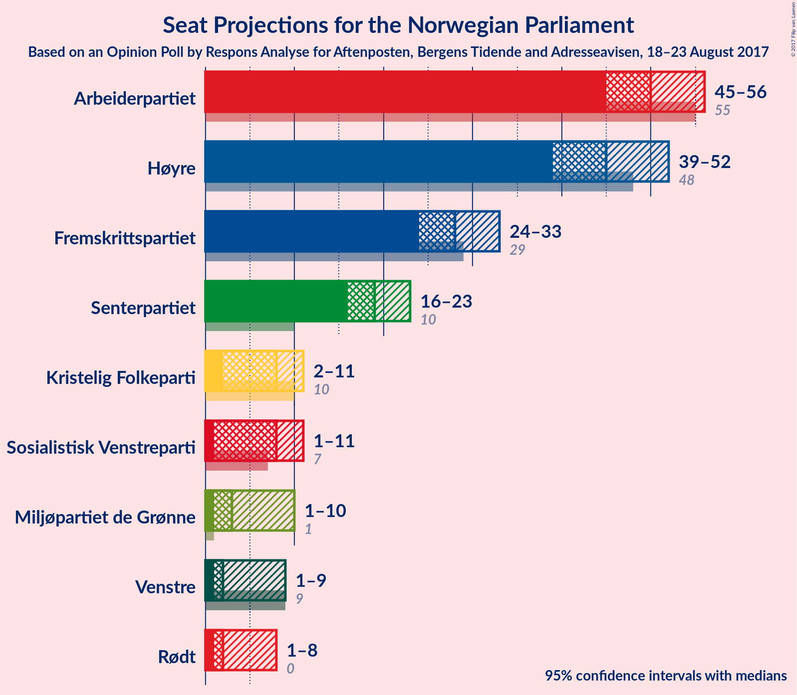
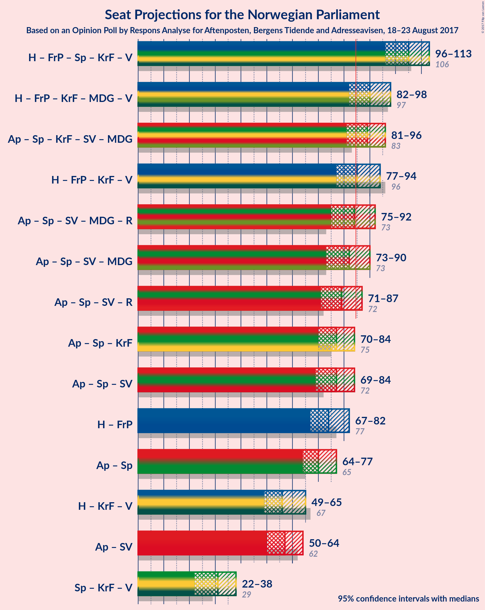

# Opinion Poll by Respons Analyse for Aftenposten, Bergens Tidende and Adresseavisen, 18–23 August 2017

<a href="#voting-intentions">Voting Intentions</a> | <a href="#seats">Seats</a> | <a href="#coalitions">Coalitions</a> | <a href="#technical-information">Technical Information</a>

## Voting Intentions

### Confidence Intervals

| Party | Last Result | Poll Result | 80% Confidence Interval | 90% Confidence Interval | 95% Confidence Interval | 99% Confidence Interval |
|:-----:|:-----------:|:-----------:|:-----------------------:|:-----------------------:|:-----------------------:|:-----------------------:|
| Arbeiderpartiet | 30.8% | 27.3% | 25.5–29.2% |25.0–29.7% |24.6–30.1% |23.8–31.1% |
| Høyre | 26.8% | 25.1% | 23.4–26.9% |22.9–27.4% |22.5–27.9% |21.7–28.8% |
| Fremskrittspartiet | 16.3% | 15.5% | 14.1–17.1% |13.7–17.5% |13.4–17.9% |12.7–18.7% |
| Senterpartiet | 5.5% | 10.8% | 9.6–12.2% |9.3–12.5% |9.0–12.9% |8.5–13.6% |
| Kristelig Folkeparti | 5.6% | 4.5% | 3.8–5.5% |3.6–5.7% |3.4–6.0% |3.0–6.5% |
| Sosialistisk Venstreparti | 4.1% | 4.5% | 3.8–5.5% |3.6–5.7% |3.4–6.0% |3.0–6.5% |
| Miljøpartiet de Grønne | 2.8% | 3.9% | 3.2–4.8% |3.0–5.1% |2.9–5.3% |2.6–5.8% |
| Venstre | 5.2% | 3.7% | 3.0–4.6% |2.9–4.8% |2.7–5.1% |2.4–5.5% |
| Rødt | 1.1% | 3.2% | 2.6–4.0% |2.4–4.3% |2.3–4.5% |2.0–4.9% |

*Note:* The poll result column reflects the actual value used in the calculations. Published results may vary slightly, and in addition be rounded to fewer digits.

## Seats

### Confidence Intervals

| Party | Last Result | Median | 80% Confidence Interval | 90% Confidence Interval | 95% Confidence Interval | 99% Confidence Interval |
|:-----:|:-----------:|:------:|:-----------------------:|:-----------------------:|:-----------------------:|:-----------------------:|
| <a href="#arbeiderpartiet">Arbeiderpartiet</a> | 55 | 50 | 48–55 |47–55 |46–55 |44–57 |
| <a href="#høyre">Høyre</a> | 48 | 45 | 44–53 |44–53 |42–53 |39–53 |
| <a href="#fremskrittspartiet">Fremskrittspartiet</a> | 29 | 29 | 27–32 |27–32 |25–32 |23–33 |
| <a href="#senterpartiet">Senterpartiet</a> | 10 | 20 | 17–20 |16–24 |16–26 |16–26 |
| <a href="#kristelig-folkeparti">Kristelig Folkeparti</a> | 10 | 2 | 2–9 |1–10 |1–10 |1–10 |
| <a href="#sosialistisk-venstreparti">Sosialistisk Venstreparti</a> | 7 | 9 | 2–10 |1–10 |1–11 |1–12 |
| <a href="#miljøpartiet-de-grønne">Miljøpartiet de Grønne</a> | 1 | 8 | 2–10 |1–10 |1–10 |1–10 |
| <a href="#venstre">Venstre</a> | 9 | 2 | 2–8 |2–10 |2–10 |1–10 |
| <a href="#rødt">Rødt</a> | 0 | 2 | 1–2 |1–2 |1–7 |1–10 |

### Arbeiderpartiet

| Number of Seats | Probability | Accumulated | Special Marks |
|:---------------:|:-----------:|:-----------:|:-------------:|
| 41 | 0.1% | 100% |  |
| 42 | 0.1% | 99.9% |  |
| 43 | 0% | 99.8% |  |
| 44 | 0.9% | 99.8% |  |
| 45 | 0% | 98.9% |  |
| 46 | 3% | 98.9% |  |
| 47 | 1.1% | 96% |  |
| 48 | 5% | 95% |  |
| 49 | 17% | 90% |  |
| 50 | 52% | 72% | Median |
| 51 | 0.3% | 20% |  |
| 52 | 0.1% | 20% |  |
| 53 | 2% | 20% |  |
| 54 | 0.3% | 17% |  |
| 55 | 16% | 17% | Last Result |
| 56 | 0% | 0.7% |  |
| 57 | 0.4% | 0.7% |  |
| 58 | 0.1% | 0.3% |  |
| 59 | 0.1% | 0.1% |  |
| 60 | 0% | 0% |  |

### Høyre

| Number of Seats | Probability | Accumulated | Special Marks |
|:---------------:|:-----------:|:-----------:|:-------------:|
| 39 | 2% | 100% |  |
| 40 | 0.2% | 98% |  |
| 41 | 0.5% | 98% |  |
| 42 | 0.6% | 98% |  |
| 43 | 0.1% | 97% |  |
| 44 | 45% | 97% |  |
| 45 | 14% | 52% | Median |
| 46 | 2% | 39% |  |
| 47 | 10% | 37% |  |
| 48 | 10% | 27% | Last Result |
| 49 | 0.1% | 17% |  |
| 50 | 0.1% | 17% |  |
| 51 | 0% | 17% |  |
| 52 | 0% | 17% |  |
| 53 | 16% | 17% |  |
| 54 | 0% | 0.3% |  |
| 55 | 0.3% | 0.3% |  |
| 56 | 0% | 0% |  |

### Fremskrittspartiet

| Number of Seats | Probability | Accumulated | Special Marks |
|:---------------:|:-----------:|:-----------:|:-------------:|
| 21 | 0% | 100% |  |
| 22 | 0% | 99.9% |  |
| 23 | 2% | 99.9% |  |
| 24 | 0% | 98% |  |
| 25 | 2% | 98% |  |
| 26 | 0.4% | 96% |  |
| 27 | 18% | 96% |  |
| 28 | 13% | 78% |  |
| 29 | 53% | 65% | Last Result, Median |
| 30 | 0% | 12% |  |
| 31 | 0.5% | 12% |  |
| 32 | 10% | 11% |  |
| 33 | 0.6% | 0.8% |  |
| 34 | 0.2% | 0.2% |  |
| 35 | 0% | 0% |  |

### Senterpartiet

| Number of Seats | Probability | Accumulated | Special Marks |
|:---------------:|:-----------:|:-----------:|:-------------:|
| 10 | 0% | 100% | Last Result |
| 11 | 0% | 100% |  |
| 12 | 0% | 100% |  |
| 13 | 0% | 100% |  |
| 14 | 0% | 100% |  |
| 15 | 0% | 100% |  |
| 16 | 7% | 100% |  |
| 17 | 20% | 93% |  |
| 18 | 8% | 73% |  |
| 19 | 13% | 65% |  |
| 20 | 45% | 52% | Median |
| 21 | 0.4% | 7% |  |
| 22 | 0.3% | 6% |  |
| 23 | 0.5% | 6% |  |
| 24 | 0.5% | 5% |  |
| 25 | 0.3% | 5% |  |
| 26 | 5% | 5% |  |
| 27 | 0% | 0% |  |

### Kristelig Folkeparti

| Number of Seats | Probability | Accumulated | Special Marks |
|:---------------:|:-----------:|:-----------:|:-------------:|
| 1 | 10% | 100% |  |
| 2 | 63% | 90% | Median |
| 3 | 0% | 27% |  |
| 4 | 0% | 27% |  |
| 5 | 0% | 27% |  |
| 6 | 0% | 27% |  |
| 7 | 0.1% | 27% |  |
| 8 | 16% | 27% |  |
| 9 | 2% | 11% |  |
| 10 | 9% | 9% | Last Result |
| 11 | 0.2% | 0.3% |  |
| 12 | 0% | 0.1% |  |
| 13 | 0.1% | 0.1% |  |
| 14 | 0% | 0% |  |

### Sosialistisk Venstreparti

| Number of Seats | Probability | Accumulated | Special Marks |
|:---------------:|:-----------:|:-----------:|:-------------:|
| 1 | 8% | 100% |  |
| 2 | 6% | 92% |  |
| 3 | 0% | 86% |  |
| 4 | 0% | 86% |  |
| 5 | 0% | 86% |  |
| 6 | 0% | 86% |  |
| 7 | 9% | 86% | Last Result |
| 8 | 0.5% | 77% |  |
| 9 | 28% | 76% | Median |
| 10 | 46% | 49% |  |
| 11 | 0.7% | 3% |  |
| 12 | 2% | 2% |  |
| 13 | 0% | 0% |  |

### Miljøpartiet de Grønne

| Number of Seats | Probability | Accumulated | Special Marks |
|:---------------:|:-----------:|:-----------:|:-------------:|
| 1 | 10% | 100% | Last Result |
| 2 | 27% | 90% |  |
| 3 | 2% | 63% |  |
| 4 | 0.1% | 61% |  |
| 5 | 0% | 61% |  |
| 6 | 0% | 61% |  |
| 7 | 1.5% | 61% |  |
| 8 | 14% | 59% | Median |
| 9 | 0.3% | 45% |  |
| 10 | 44% | 45% |  |
| 11 | 0% | 0% |  |

### Venstre

| Number of Seats | Probability | Accumulated | Special Marks |
|:---------------:|:-----------:|:-----------:|:-------------:|
| 0 | 0.1% | 100% |  |
| 1 | 2% | 99.9% |  |
| 2 | 66% | 98% | Median |
| 3 | 0.7% | 32% |  |
| 4 | 0% | 31% |  |
| 5 | 0% | 31% |  |
| 6 | 0% | 31% |  |
| 7 | 8% | 31% |  |
| 8 | 14% | 23% |  |
| 9 | 1.5% | 9% | Last Result |
| 10 | 8% | 8% |  |
| 11 | 0.1% | 0.1% |  |
| 12 | 0% | 0% |  |

### Rødt

| Number of Seats | Probability | Accumulated | Special Marks |
|:---------------:|:-----------:|:-----------:|:-------------:|
| 0 | 0% | 100% | Last Result |
| 1 | 13% | 100% |  |
| 2 | 84% | 87% | Median |
| 3 | 0% | 4% |  |
| 4 | 0% | 4% |  |
| 5 | 0% | 4% |  |
| 6 | 0% | 4% |  |
| 7 | 2% | 4% |  |
| 8 | 0.4% | 1.3% |  |
| 9 | 0.1% | 0.8% |  |
| 10 | 0.8% | 0.8% |  |
| 11 | 0% | 0% |  |

## Coalitions

### Confidence Intervals

| Coalition | Last Result | Median | Majority? | 80% Confidence Interval | 90% Confidence Interval | 95% Confidence Interval | 99% Confidence Interval |
|:---------:|:-----------:|:------:|:---------:|:-----------------------:|:-----------------------:|:-----------------------:|:-----------------------:|
| Høyre – Fremskrittspartiet – Senterpartiet – Kristelig Folkeparti – Venstre | 106 | 101 | 100% | 97–109 | 97–109 | 97–109 | 95–111 |
| Høyre – Fremskrittspartiet – Kristelig Folkeparti – Miljøpartiet de Grønne – Venstre | 97 | 87 | 99.0% | 86–92 | 86–101 | 85–101 | 80–101 |
| Høyre – Fremskrittspartiet – Kristelig Folkeparti – Venstre | 96 | 83 | 30% | 77–91 | 77–93 | 77–93 | 77–93 |
| Arbeiderpartiet – Senterpartiet – Kristelig Folkeparti – Sosialistisk Venstreparti – Miljøpartiet de Grønne | 83 | 92 | 72% | 80–92 | 80–92 | 80–92 | 76–94 |
| Arbeiderpartiet – Senterpartiet – Sosialistisk Venstreparti – Miljøpartiet de Grønne – Rødt | 73 | 86 | 70% | 78–92 | 76–92 | 76–92 | 76–92 |
| Arbeiderpartiet – Senterpartiet – Sosialistisk Venstreparti – Miljøpartiet de Grønne | 73 | 84 | 46% | 76–90 | 74–90 | 74–90 | 68–90 |
| Arbeiderpartiet – Senterpartiet – Sosialistisk Venstreparti – Rødt | 72 | 82 | 1.0% | 77–83 | 68–83 | 68–84 | 68–89 |
| Arbeiderpartiet – Senterpartiet – Kristelig Folkeparti | 75 | 72 | 0.8% | 69–76 | 69–82 | 69–82 | 67–88 |
| Arbeiderpartiet – Senterpartiet – Sosialistisk Venstreparti | 72 | 80 | 0.6% | 74–81 | 66–81 | 66–81 | 66–87 |
| Høyre – Fremskrittspartiet | 77 | 73 | 0.1% | 73–80 | 73–80 | 71–80 | 62–80 |
| Arbeiderpartiet – Senterpartiet | 65 | 70 | 0% | 65–72 | 65–74 | 65–74 | 61–79 |
| Arbeiderpartiet – Sosialistisk Venstreparti | 62 | 60 | 0% | 50–64 | 50–64 | 50–64 | 49–64 |
| Høyre – Kristelig Folkeparti – Venstre | 67 | 55 | 0% | 48–63 | 48–64 | 48–64 | 48–64 |
| Senterpartiet – Kristelig Folkeparti – Venstre | 29 | 24 | 0% | 21–36 | 21–36 | 21–36 | 21–36 |

### Høyre – Fremskrittspartiet – Senterpartiet – Kristelig Folkeparti – Venstre

| Number of Seats | Probability | Accumulated | Special Marks |
|:---------------:|:-----------:|:-----------:|:-------------:|
| 92 | 0.1% | 100% |  |
| 93 | 0% | 99.9% |  |
| 94 | 0.1% | 99.9% |  |
| 95 | 1.5% | 99.9% |  |
| 96 | 0% | 98% |  |
| 97 | 44% | 98% |  |
| 98 | 0.4% | 54% | Median |
| 99 | 0% | 54% |  |
| 100 | 0.9% | 53% |  |
| 101 | 16% | 53% |  |
| 102 | 0.1% | 36% |  |
| 103 | 1.1% | 36% |  |
| 104 | 1.3% | 35% |  |
| 105 | 0.1% | 34% |  |
| 106 | 0.6% | 34% | Last Result |
| 107 | 2% | 33% |  |
| 108 | 11% | 31% |  |
| 109 | 20% | 21% |  |
| 110 | 0% | 0.7% |  |
| 111 | 0.2% | 0.7% |  |
| 112 | 0% | 0.4% |  |
| 113 | 0.1% | 0.4% |  |
| 114 | 0.3% | 0.3% |  |
| 115 | 0% | 0% |  |

### Høyre – Fremskrittspartiet – Kristelig Folkeparti – Miljøpartiet de Grønne – Venstre

| Number of Seats | Probability | Accumulated | Special Marks |
|:---------------:|:-----------:|:-----------:|:-------------:|
| 78 | 0.1% | 100% |  |
| 79 | 0% | 99.9% |  |
| 80 | 0.5% | 99.9% |  |
| 81 | 0% | 99.4% |  |
| 82 | 0% | 99.4% |  |
| 83 | 0.1% | 99.3% |  |
| 84 | 0.3% | 99.3% |  |
| 85 | 2% | 99.0% | Majority |
| 86 | 17% | 97% | Median |
| 87 | 45% | 81% |  |
| 88 | 0% | 35% |  |
| 89 | 0.4% | 35% |  |
| 90 | 0.2% | 35% |  |
| 91 | 17% | 35% |  |
| 92 | 8% | 18% |  |
| 93 | 2% | 10% |  |
| 94 | 0.1% | 8% |  |
| 95 | 0.1% | 8% |  |
| 96 | 0% | 8% |  |
| 97 | 0.2% | 8% | Last Result |
| 98 | 0% | 7% |  |
| 99 | 0% | 7% |  |
| 100 | 0% | 7% |  |
| 101 | 7% | 7% |  |
| 102 | 0% | 0% |  |

### Høyre – Fremskrittspartiet – Kristelig Folkeparti – Venstre

| Number of Seats | Probability | Accumulated | Special Marks |
|:---------------:|:-----------:|:-----------:|:-------------:|
| 74 | 0% | 100% |  |
| 75 | 0.1% | 99.9% |  |
| 76 | 0% | 99.9% |  |
| 77 | 44% | 99.8% |  |
| 78 | 2% | 55% | Median |
| 79 | 0.5% | 54% |  |
| 80 | 0.1% | 53% |  |
| 81 | 0.3% | 53% |  |
| 82 | 0.1% | 53% |  |
| 83 | 6% | 53% |  |
| 84 | 16% | 47% |  |
| 85 | 1.4% | 30% | Majority |
| 86 | 0.8% | 29% |  |
| 87 | 0% | 28% |  |
| 88 | 2% | 28% |  |
| 89 | 10% | 26% |  |
| 90 | 0% | 16% |  |
| 91 | 8% | 16% |  |
| 92 | 0% | 8% |  |
| 93 | 7% | 8% |  |
| 94 | 0.1% | 0.3% |  |
| 95 | 0% | 0.1% |  |
| 96 | 0.1% | 0.1% | Last Result |
| 97 | 0% | 0% |  |

### Arbeiderpartiet – Senterpartiet – Kristelig Folkeparti – Sosialistisk Venstreparti – Miljøpartiet de Grønne

| Number of Seats | Probability | Accumulated | Special Marks |
|:---------------:|:-----------:|:-----------:|:-------------:|
| 76 | 0.8% | 100% |  |
| 77 | 0% | 99.2% |  |
| 78 | 0% | 99.2% |  |
| 79 | 0.1% | 99.2% |  |
| 80 | 10% | 99.1% |  |
| 81 | 0.1% | 89% |  |
| 82 | 0% | 89% |  |
| 83 | 0.4% | 89% | Last Result |
| 84 | 16% | 89% |  |
| 85 | 17% | 72% | Majority |
| 86 | 0% | 56% |  |
| 87 | 0.8% | 56% |  |
| 88 | 0.1% | 55% |  |
| 89 | 2% | 55% | Median |
| 90 | 0.9% | 53% |  |
| 91 | 0.2% | 52% |  |
| 92 | 51% | 52% |  |
| 93 | 0% | 0.7% |  |
| 94 | 0.2% | 0.7% |  |
| 95 | 0.1% | 0.5% |  |
| 96 | 0% | 0.3% |  |
| 97 | 0.2% | 0.3% |  |
| 98 | 0.1% | 0.1% |  |
| 99 | 0% | 0.1% |  |
| 100 | 0.1% | 0.1% |  |
| 101 | 0% | 0% |  |

### Arbeiderpartiet – Senterpartiet – Sosialistisk Venstreparti – Miljøpartiet de Grønne – Rødt

| Number of Seats | Probability | Accumulated | Special Marks |
|:---------------:|:-----------:|:-----------:|:-------------:|
| 73 | 0.1% | 100% | Last Result |
| 74 | 0% | 99.9% |  |
| 75 | 0.1% | 99.9% |  |
| 76 | 7% | 99.7% |  |
| 77 | 0% | 92% |  |
| 78 | 8% | 92% |  |
| 79 | 0% | 84% |  |
| 80 | 10% | 84% |  |
| 81 | 2% | 74% |  |
| 82 | 0% | 72% |  |
| 83 | 0.8% | 72% |  |
| 84 | 1.4% | 71% |  |
| 85 | 16% | 70% | Majority |
| 86 | 6% | 53% |  |
| 87 | 0.1% | 47% |  |
| 88 | 0.3% | 47% |  |
| 89 | 0.1% | 47% | Median |
| 90 | 0.5% | 47% |  |
| 91 | 2% | 46% |  |
| 92 | 44% | 45% |  |
| 93 | 0% | 0.2% |  |
| 94 | 0.1% | 0.1% |  |
| 95 | 0% | 0.1% |  |
| 96 | 0% | 0% |  |

### Arbeiderpartiet – Senterpartiet – Sosialistisk Venstreparti – Miljøpartiet de Grønne

| Number of Seats | Probability | Accumulated | Special Marks |
|:---------------:|:-----------:|:-----------:|:-------------:|
| 68 | 0.8% | 100% |  |
| 69 | 0% | 99.2% |  |
| 70 | 0% | 99.2% |  |
| 71 | 0.1% | 99.2% |  |
| 72 | 0% | 99.1% |  |
| 73 | 0.1% | 99.1% | Last Result |
| 74 | 7% | 99.0% |  |
| 75 | 0.3% | 92% |  |
| 76 | 8% | 91% |  |
| 77 | 0.1% | 84% |  |
| 78 | 0.1% | 84% |  |
| 79 | 11% | 83% |  |
| 80 | 2% | 73% |  |
| 81 | 0.5% | 70% |  |
| 82 | 1.4% | 70% |  |
| 83 | 16% | 69% |  |
| 84 | 7% | 52% |  |
| 85 | 0.1% | 46% | Majority |
| 86 | 0.2% | 46% |  |
| 87 | 0.1% | 45% | Median |
| 88 | 0.5% | 45% |  |
| 89 | 0% | 45% |  |
| 90 | 45% | 45% |  |
| 91 | 0% | 0.1% |  |
| 92 | 0.1% | 0.1% |  |
| 93 | 0% | 0% |  |

### Arbeiderpartiet – Senterpartiet – Sosialistisk Venstreparti – Rødt

| Number of Seats | Probability | Accumulated | Special Marks |
|:---------------:|:-----------:|:-----------:|:-------------:|
| 68 | 7% | 100% |  |
| 69 | 0% | 93% |  |
| 70 | 0% | 93% |  |
| 71 | 0% | 93% |  |
| 72 | 0.2% | 93% | Last Result |
| 73 | 0% | 92% |  |
| 74 | 0.1% | 92% |  |
| 75 | 0.1% | 92% |  |
| 76 | 2% | 92% |  |
| 77 | 8% | 90% |  |
| 78 | 17% | 82% |  |
| 79 | 0.2% | 65% |  |
| 80 | 0.4% | 65% |  |
| 81 | 0% | 65% | Median |
| 82 | 45% | 65% |  |
| 83 | 17% | 19% |  |
| 84 | 2% | 3% |  |
| 85 | 0.3% | 1.0% | Majority |
| 86 | 0.1% | 0.7% |  |
| 87 | 0% | 0.7% |  |
| 88 | 0% | 0.6% |  |
| 89 | 0.5% | 0.6% |  |
| 90 | 0% | 0.1% |  |
| 91 | 0.1% | 0.1% |  |
| 92 | 0% | 0% |  |

### Arbeiderpartiet – Senterpartiet – Kristelig Folkeparti

| Number of Seats | Probability | Accumulated | Special Marks |
|:---------------:|:-----------:|:-----------:|:-------------:|
| 67 | 1.3% | 100% |  |
| 68 | 0.2% | 98.7% |  |
| 69 | 11% | 98% |  |
| 70 | 0% | 88% |  |
| 71 | 0% | 88% |  |
| 72 | 45% | 88% | Median |
| 73 | 0.3% | 43% |  |
| 74 | 18% | 42% |  |
| 75 | 8% | 24% | Last Result |
| 76 | 8% | 16% |  |
| 77 | 0.1% | 9% |  |
| 78 | 2% | 9% |  |
| 79 | 0.5% | 7% |  |
| 80 | 0.1% | 6% |  |
| 81 | 0.5% | 6% |  |
| 82 | 5% | 6% |  |
| 83 | 0% | 0.8% |  |
| 84 | 0% | 0.8% |  |
| 85 | 0.2% | 0.8% | Majority |
| 86 | 0.1% | 0.7% |  |
| 87 | 0.1% | 0.6% |  |
| 88 | 0.6% | 0.6% |  |
| 89 | 0% | 0% |  |

### Arbeiderpartiet – Senterpartiet – Sosialistisk Venstreparti

| Number of Seats | Probability | Accumulated | Special Marks |
|:---------------:|:-----------:|:-----------:|:-------------:|
| 66 | 8% | 100% |  |
| 67 | 0% | 92% |  |
| 68 | 0% | 92% |  |
| 69 | 0% | 92% |  |
| 70 | 0.1% | 92% |  |
| 71 | 0.9% | 92% |  |
| 72 | 0.1% | 91% | Last Result |
| 73 | 0% | 91% |  |
| 74 | 2% | 91% |  |
| 75 | 8% | 89% |  |
| 76 | 5% | 81% |  |
| 77 | 13% | 77% |  |
| 78 | 0% | 63% |  |
| 79 | 0.4% | 63% | Median |
| 80 | 45% | 63% |  |
| 81 | 16% | 18% |  |
| 82 | 0.7% | 2% |  |
| 83 | 0.2% | 0.9% |  |
| 84 | 0.2% | 0.7% |  |
| 85 | 0% | 0.6% | Majority |
| 86 | 0% | 0.6% |  |
| 87 | 0.5% | 0.6% |  |
| 88 | 0% | 0.1% |  |
| 89 | 0.1% | 0.1% |  |
| 90 | 0% | 0% |  |

### Høyre – Fremskrittspartiet

| Number of Seats | Probability | Accumulated | Special Marks |
|:---------------:|:-----------:|:-----------:|:-------------:|
| 62 | 2% | 100% |  |
| 63 | 0% | 98% |  |
| 64 | 0.1% | 98% |  |
| 65 | 0% | 98% |  |
| 66 | 0.1% | 98% |  |
| 67 | 0% | 98% |  |
| 68 | 0.3% | 98% |  |
| 69 | 0% | 98% |  |
| 70 | 0.1% | 98% |  |
| 71 | 2% | 98% |  |
| 72 | 0.1% | 96% |  |
| 73 | 57% | 96% |  |
| 74 | 3% | 39% | Median |
| 75 | 0.7% | 36% |  |
| 76 | 9% | 36% |  |
| 77 | 0.2% | 27% | Last Result |
| 78 | 0% | 27% |  |
| 79 | 0% | 27% |  |
| 80 | 26% | 27% |  |
| 81 | 0.2% | 0.4% |  |
| 82 | 0% | 0.2% |  |
| 83 | 0% | 0.1% |  |
| 84 | 0% | 0.1% |  |
| 85 | 0.1% | 0.1% | Majority |
| 86 | 0% | 0% |  |

### Arbeiderpartiet – Senterpartiet

| Number of Seats | Probability | Accumulated | Special Marks |
|:---------------:|:-----------:|:-----------:|:-------------:|
| 60 | 0.1% | 100% |  |
| 61 | 0.8% | 99.9% |  |
| 62 | 0% | 99.1% |  |
| 63 | 0% | 99.1% |  |
| 64 | 0.9% | 99.0% |  |
| 65 | 11% | 98% | Last Result |
| 66 | 0.1% | 87% |  |
| 67 | 0.1% | 87% |  |
| 68 | 18% | 87% |  |
| 69 | 0.1% | 69% |  |
| 70 | 46% | 69% | Median |
| 71 | 0.3% | 23% |  |
| 72 | 17% | 23% |  |
| 73 | 0% | 6% |  |
| 74 | 5% | 6% |  |
| 75 | 0.2% | 2% |  |
| 76 | 0% | 1.4% |  |
| 77 | 0.5% | 1.4% |  |
| 78 | 0.2% | 0.9% |  |
| 79 | 0.3% | 0.7% |  |
| 80 | 0.4% | 0.4% |  |
| 81 | 0% | 0% |  |

### Arbeiderpartiet – Sosialistisk Venstreparti

| Number of Seats | Probability | Accumulated | Special Marks |
|:---------------:|:-----------:|:-----------:|:-------------:|
| 49 | 0.8% | 100% |  |
| 50 | 12% | 99.1% |  |
| 51 | 0% | 87% |  |
| 52 | 0.3% | 87% |  |
| 53 | 0% | 87% |  |
| 54 | 0.9% | 87% |  |
| 55 | 2% | 86% |  |
| 56 | 0.1% | 84% |  |
| 57 | 8% | 84% |  |
| 58 | 12% | 76% |  |
| 59 | 0.5% | 64% | Median |
| 60 | 46% | 64% |  |
| 61 | 0% | 18% |  |
| 62 | 0.3% | 17% | Last Result |
| 63 | 0.7% | 17% |  |
| 64 | 16% | 16% |  |
| 65 | 0% | 0.1% |  |
| 66 | 0% | 0.1% |  |
| 67 | 0% | 0.1% |  |
| 68 | 0% | 0.1% |  |
| 69 | 0% | 0.1% |  |
| 70 | 0.1% | 0.1% |  |
| 71 | 0% | 0% |  |

### Høyre – Kristelig Folkeparti – Venstre

| Number of Seats | Probability | Accumulated | Special Marks |
|:---------------:|:-----------:|:-----------:|:-------------:|
| 46 | 0.5% | 100% |  |
| 47 | 0% | 99.5% |  |
| 48 | 44% | 99.5% |  |
| 49 | 0.1% | 55% | Median |
| 50 | 0.2% | 55% |  |
| 51 | 0.2% | 55% |  |
| 52 | 0.2% | 54% |  |
| 53 | 0% | 54% |  |
| 54 | 0.8% | 54% |  |
| 55 | 6% | 53% |  |
| 56 | 0.5% | 47% |  |
| 57 | 27% | 47% |  |
| 58 | 2% | 20% |  |
| 59 | 0% | 18% |  |
| 60 | 0.4% | 18% |  |
| 61 | 0.2% | 18% |  |
| 62 | 0.8% | 18% |  |
| 63 | 9% | 17% |  |
| 64 | 7% | 8% |  |
| 65 | 0% | 0% |  |
| 66 | 0% | 0% |  |
| 67 | 0% | 0% | Last Result |

### Senterpartiet – Kristelig Folkeparti – Venstre

| Number of Seats | Probability | Accumulated | Special Marks |
|:---------------:|:-----------:|:-----------:|:-------------:|
| 20 | 0.1% | 100% |  |
| 21 | 16% | 99.9% |  |
| 22 | 0% | 84% |  |
| 23 | 0% | 84% |  |
| 24 | 44% | 84% | Median |
| 25 | 0% | 39% |  |
| 26 | 0.8% | 39% |  |
| 27 | 0% | 38% |  |
| 28 | 11% | 38% |  |
| 29 | 0.2% | 28% | Last Result |
| 30 | 2% | 28% |  |
| 31 | 0.1% | 25% |  |
| 32 | 1.4% | 25% |  |
| 33 | 9% | 24% |  |
| 34 | 0.1% | 15% |  |
| 35 | 0% | 15% |  |
| 36 | 14% | 14% |  |
| 37 | 0.2% | 0.4% |  |
| 38 | 0.1% | 0.2% |  |
| 39 | 0.2% | 0.2% |  |
| 40 | 0% | 0% |  |

## Technical Information

### Opinion Poll

+ **Pollster:** Respons Analyse
+ **Media:** Aftenposten, Bergens Tidende and Adresseavisen
+ **Fieldwork period:** 18–23 August 2017

### Calculations

+ **Sample size:** 1000
+ **Simulations done:** 16,384
+ **Error estimate:** 3.86%

