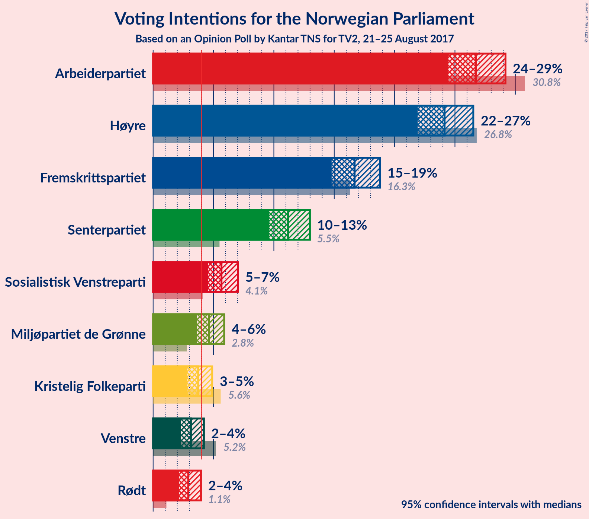
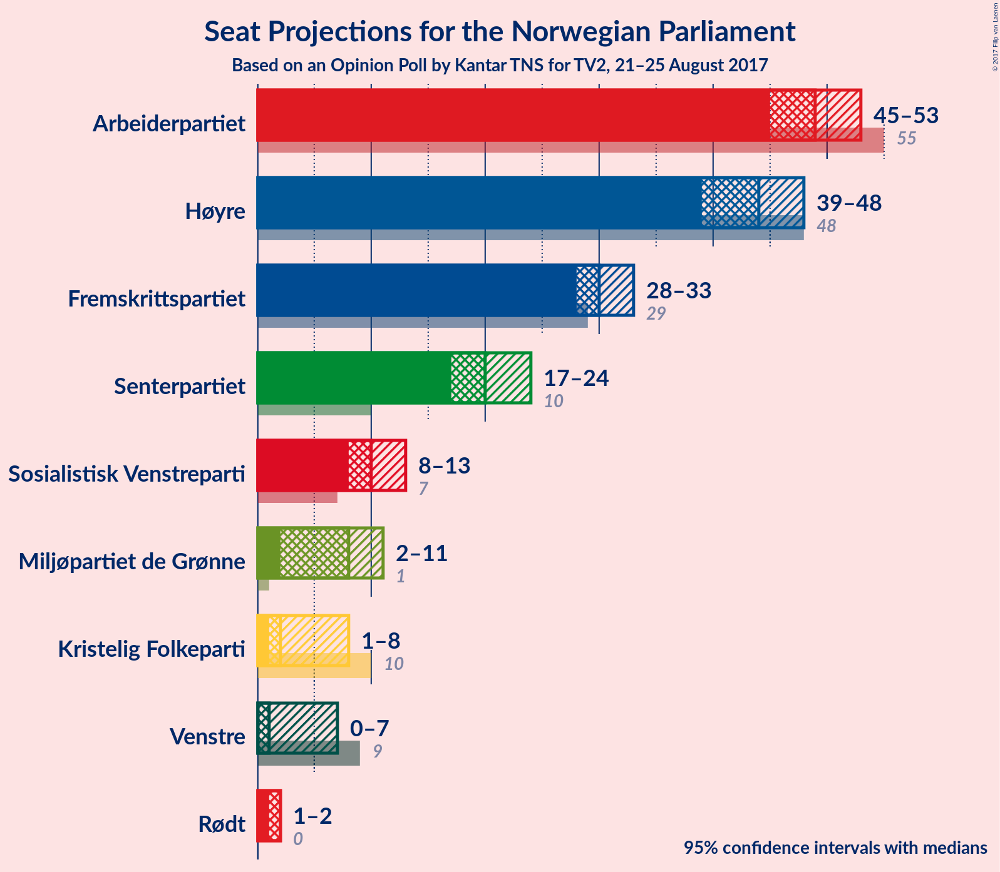
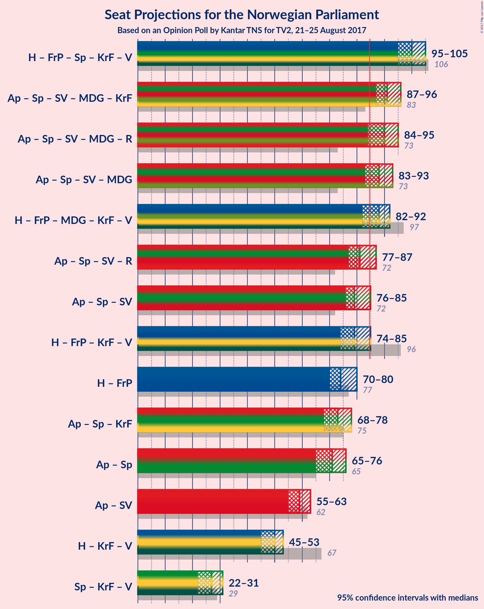

# Opinion Poll by Kantar TNS for TV2, 21–25 August 2017

<a href="#voting-intentions">Voting Intentions</a> | <a href="#seats">Seats</a> | <a href="#coalitions">Coalitions</a> | <a href="#technical-information">Technical Information</a>

## Voting Intentions

### Confidence Intervals

| Party | Last Result | Poll Result | 80% Confidence Interval | 90% Confidence Interval | 95% Confidence Interval | 99% Confidence Interval |
|:-----:|:-----------:|:-----------:|:-----------------------:|:-----------------------:|:-----------------------:|:-----------------------:|
| Arbeiderpartiet | 30.8% | 26.8% | 25.2–28.3% |24.8–28.8% |24.4–29.2% |23.7–30.0% |
| Høyre | 26.8% | 24.1% | 22.7–25.7% |22.3–26.1% |21.9–26.5% |21.2–27.3% |
| Fremskrittspartiet | 16.3% | 16.7% | 15.4–18.1% |15.1–18.5% |14.8–18.8% |14.2–19.5% |
| Senterpartiet | 5.5% | 11.2% | 10.1–12.4% |9.8–12.7% |9.6–13.0% |9.1–13.6% |
| Sosialistisk Venstreparti | 4.1% | 5.7% | 4.9–6.6% |4.7–6.8% |4.5–7.0% |4.2–7.5% |
| Miljøpartiet de Grønne | 2.8% | 4.6% | 4.0–5.4% |3.8–5.7% |3.6–5.9% |3.3–6.3% |
| Kristelig Folkeparti | 5.6% | 3.7% | 3.1–4.5% |3.0–4.7% |2.8–4.9% |2.6–5.3% |
| Venstre | 5.2% | 3.1% | 2.6–3.8% |2.4–4.0% |2.3–4.2% |2.1–4.6% |
| Rødt | 1.1% | 2.9% | 2.4–3.6% |2.3–3.8% |2.1–4.0% |1.9–4.3% |

*Note:* The poll result column reflects the actual value used in the calculations. Published results may vary slightly, and in addition be rounded to fewer digits.

## Seats

### Confidence Intervals

| Party | Last Result | Median | 80% Confidence Interval | 90% Confidence Interval | 95% Confidence Interval | 99% Confidence Interval |
|:-----:|:-----------:|:------:|:-----------------------:|:-----------------------:|:-----------------------:|:-----------------------:|
| <a href="#arbeiderpartiet">Arbeiderpartiet</a> | 55 | 49 | 47–53 |46–53 |45–53 |43–55 |
| <a href="#høyre">Høyre</a> | 48 | 45 | 41–47 |40–48 |38–48 |38–49 |
| <a href="#fremskrittspartiet">Fremskrittspartiet</a> | 29 | 29 | 29–32 |28–33 |28–33 |27–34 |
| <a href="#senterpartiet">Senterpartiet</a> | 10 | 20 | 18–23 |18–23 |17–23 |16–24 |
| <a href="#sosialistisk-venstreparti">Sosialistisk Venstreparti</a> | 7 | 11 | 8–12 |8–12 |8–13 |8–13 |
| <a href="#miljøpartiet-de-grønne">Miljøpartiet de Grønne</a> | 1 | 8 | 7–9 |3–10 |3–11 |1–11 |
| <a href="#kristelig-folkeparti">Kristelig Folkeparti</a> | 10 | 2 | 2–7 |2–8 |1–8 |1–9 |
| <a href="#venstre">Venstre</a> | 9 | 1 | 1–2 |1–3 |1–3 |0–8 |
| <a href="#rødt">Rødt</a> | 0 | 2 | 1–2 |1–2 |1–2 |1–8 |

### Arbeiderpartiet

| Number of Seats | Probability | Accumulated | Special Marks |
|:---------------:|:-----------:|:-----------:|:-------------:|
| 42 | 0.1% | 100% |  |
| 43 | 0.5% | 99.9% |  |
| 44 | 0.7% | 99.5% |  |
| 45 | 3% | 98.7% |  |
| 46 | 4% | 96% |  |
| 47 | 8% | 92% |  |
| 48 | 28% | 84% |  |
| 49 | 12% | 56% | Median |
| 50 | 5% | 44% |  |
| 51 | 14% | 39% |  |
| 52 | 14% | 24% |  |
| 53 | 9% | 10% |  |
| 54 | 0.7% | 1.2% |  |
| 55 | 0.1% | 0.5% | Last Result |
| 56 | 0.3% | 0.4% |  |
| 57 | 0% | 0% |  |

### Høyre

| Number of Seats | Probability | Accumulated | Special Marks |
|:---------------:|:-----------:|:-----------:|:-------------:|
| 37 | 0.1% | 100% |  |
| 38 | 4% | 99.9% |  |
| 39 | 1.0% | 96% |  |
| 40 | 3% | 95% |  |
| 41 | 4% | 92% |  |
| 42 | 22% | 88% |  |
| 43 | 4% | 66% |  |
| 44 | 7% | 62% |  |
| 45 | 25% | 55% | Median |
| 46 | 15% | 30% |  |
| 47 | 7% | 15% |  |
| 48 | 7% | 9% | Last Result |
| 49 | 2% | 2% |  |
| 50 | 0.2% | 0.3% |  |
| 51 | 0.1% | 0.1% |  |
| 52 | 0% | 0% |  |

### Fremskrittspartiet

| Number of Seats | Probability | Accumulated | Special Marks |
|:---------------:|:-----------:|:-----------:|:-------------:|
| 25 | 0% | 100% |  |
| 26 | 0.3% | 99.9% |  |
| 27 | 1.0% | 99.6% |  |
| 28 | 4% | 98.6% |  |
| 29 | 48% | 95% | Last Result, Median |
| 30 | 13% | 46% |  |
| 31 | 7% | 33% |  |
| 32 | 19% | 26% |  |
| 33 | 5% | 7% |  |
| 34 | 1.1% | 1.5% |  |
| 35 | 0.2% | 0.3% |  |
| 36 | 0.1% | 0.2% |  |
| 37 | 0% | 0.1% |  |
| 38 | 0% | 0% |  |

### Senterpartiet

| Number of Seats | Probability | Accumulated | Special Marks |
|:---------------:|:-----------:|:-----------:|:-------------:|
| 10 | 0% | 100% | Last Result |
| 11 | 0% | 100% |  |
| 12 | 0% | 100% |  |
| 13 | 0% | 100% |  |
| 14 | 0% | 100% |  |
| 15 | 0.1% | 100% |  |
| 16 | 0.5% | 99.9% |  |
| 17 | 3% | 99.4% |  |
| 18 | 8% | 96% |  |
| 19 | 20% | 88% |  |
| 20 | 25% | 68% | Median |
| 21 | 15% | 44% |  |
| 22 | 11% | 28% |  |
| 23 | 16% | 17% |  |
| 24 | 1.4% | 2% |  |
| 25 | 0.2% | 0.3% |  |
| 26 | 0.1% | 0.2% |  |
| 27 | 0% | 0% |  |

### Sosialistisk Venstreparti

| Number of Seats | Probability | Accumulated | Special Marks |
|:---------------:|:-----------:|:-----------:|:-------------:|
| 7 | 0.1% | 100% | Last Result |
| 8 | 15% | 99.8% |  |
| 9 | 8% | 85% |  |
| 10 | 19% | 77% |  |
| 11 | 46% | 58% | Median |
| 12 | 9% | 11% |  |
| 13 | 2% | 3% |  |
| 14 | 0.4% | 0.5% |  |
| 15 | 0% | 0% |  |

### Miljøpartiet de Grønne

| Number of Seats | Probability | Accumulated | Special Marks |
|:---------------:|:-----------:|:-----------:|:-------------:|
| 1 | 1.3% | 100% | Last Result |
| 2 | 0.2% | 98.7% |  |
| 3 | 6% | 98.5% |  |
| 4 | 0.8% | 92% |  |
| 5 | 0% | 92% |  |
| 6 | 0% | 92% |  |
| 7 | 18% | 92% |  |
| 8 | 41% | 74% | Median |
| 9 | 27% | 33% |  |
| 10 | 2% | 6% |  |
| 11 | 4% | 4% |  |
| 12 | 0.1% | 0.1% |  |
| 13 | 0% | 0% |  |

### Kristelig Folkeparti

| Number of Seats | Probability | Accumulated | Special Marks |
|:---------------:|:-----------:|:-----------:|:-------------:|
| 0 | 0.3% | 100% |  |
| 1 | 2% | 99.7% |  |
| 2 | 62% | 97% | Median |
| 3 | 10% | 35% |  |
| 4 | 0% | 25% |  |
| 5 | 0% | 25% |  |
| 6 | 0% | 25% |  |
| 7 | 16% | 25% |  |
| 8 | 8% | 10% |  |
| 9 | 1.2% | 1.3% |  |
| 10 | 0.1% | 0.1% | Last Result |
| 11 | 0% | 0% |  |

### Venstre

| Number of Seats | Probability | Accumulated | Special Marks |
|:---------------:|:-----------:|:-----------:|:-------------:|
| 0 | 1.4% | 100% |  |
| 1 | 60% | 98.6% | Median |
| 2 | 30% | 38% |  |
| 3 | 6% | 8% |  |
| 4 | 0% | 2% |  |
| 5 | 0% | 2% |  |
| 6 | 0% | 2% |  |
| 7 | 1.0% | 2% |  |
| 8 | 0.7% | 0.8% |  |
| 9 | 0.1% | 0.1% | Last Result |
| 10 | 0% | 0% |  |

### Rødt

| Number of Seats | Probability | Accumulated | Special Marks |
|:---------------:|:-----------:|:-----------:|:-------------:|
| 0 | 0% | 100% | Last Result |
| 1 | 27% | 100% |  |
| 2 | 72% | 73% | Median |
| 3 | 0% | 1.5% |  |
| 4 | 0% | 1.5% |  |
| 5 | 0% | 1.5% |  |
| 6 | 0% | 1.5% |  |
| 7 | 0.7% | 1.5% |  |
| 8 | 0.7% | 0.7% |  |
| 9 | 0% | 0% |  |

## Coalitions

### Confidence Intervals

| Coalition | Last Result | Median | Majority? | 80% Confidence Interval | 90% Confidence Interval | 95% Confidence Interval | 99% Confidence Interval |
|:---------:|:-----------:|:------:|:---------:|:-----------------------:|:-----------------------:|:-----------------------:|:-----------------------:|
| Høyre – Fremskrittspartiet – Senterpartiet – Kristelig Folkeparti – Venstre | 106 | 99 | 100% | 96–104 | 95–105 | 95–105 | 93–107 |
| Arbeiderpartiet – Senterpartiet – Sosialistisk Venstreparti – Miljøpartiet de Grønne – Kristelig Folkeparti | 83 | 92 | 99.6% | 87–95 | 86–96 | 85–96 | 85–98 |
| Arbeiderpartiet – Senterpartiet – Sosialistisk Venstreparti – Miljøpartiet de Grønne – Rødt | 73 | 90 | 98% | 86–94 | 86–95 | 85–95 | 83–96 |
| Arbeiderpartiet – Senterpartiet – Sosialistisk Venstreparti – Miljøpartiet de Grønne | 73 | 88 | 89% | 84–93 | 84–93 | 82–93 | 81–94 |
| Høyre – Fremskrittspartiet – Miljøpartiet de Grønne – Kristelig Folkeparti – Venstre | 97 | 87 | 88% | 83–91 | 82–92 | 81–92 | 81–94 |
| Arbeiderpartiet – Senterpartiet – Sosialistisk Venstreparti – Rødt | 72 | 82 | 12% | 78–86 | 77–87 | 77–88 | 75–88 |
| Arbeiderpartiet – Senterpartiet – Sosialistisk Venstreparti | 72 | 80 | 9% | 76–84 | 76–85 | 75–86 | 73–86 |
| Høyre – Fremskrittspartiet – Kristelig Folkeparti – Venstre | 96 | 79 | 2% | 75–83 | 74–83 | 74–84 | 73–86 |
| Høyre – Fremskrittspartiet | 77 | 74 | 0% | 71–79 | 70–80 | 70–80 | 67–81 |
| Arbeiderpartiet – Senterpartiet – Kristelig Folkeparti | 75 | 73 | 0% | 69–78 | 68–78 | 68–78 | 66–79 |
| Arbeiderpartiet – Senterpartiet | 65 | 71 | 0% | 66–74 | 66–75 | 65–76 | 63–76 |
| Arbeiderpartiet – Sosialistisk Venstreparti | 62 | 59 | 0% | 57–63 | 56–64 | 55–65 | 54–65 |
| Høyre – Kristelig Folkeparti – Venstre | 67 | 49 | 0% | 45–52 | 45–52 | 45–53 | 44–56 |
| Senterpartiet – Kristelig Folkeparti – Venstre | 29 | 26 | 0% | 22–28 | 22–29 | 21–31 | 20–33 |

### Høyre – Fremskrittspartiet – Senterpartiet – Kristelig Folkeparti – Venstre

| Number of Seats | Probability | Accumulated | Special Marks |
|:---------------:|:-----------:|:-----------:|:-------------:|
| 91 | 0.1% | 100% |  |
| 92 | 0.3% | 99.9% |  |
| 93 | 1.0% | 99.6% |  |
| 94 | 1.0% | 98.7% |  |
| 95 | 5% | 98% |  |
| 96 | 14% | 93% |  |
| 97 | 2% | 79% | Median |
| 98 | 9% | 77% |  |
| 99 | 20% | 68% |  |
| 100 | 5% | 49% |  |
| 101 | 24% | 44% |  |
| 102 | 7% | 19% |  |
| 103 | 2% | 12% |  |
| 104 | 2% | 10% |  |
| 105 | 7% | 8% |  |
| 106 | 0.7% | 1.3% | Last Result |
| 107 | 0.2% | 0.7% |  |
| 108 | 0.1% | 0.4% |  |
| 109 | 0.2% | 0.3% |  |
| 110 | 0% | 0.1% |  |
| 111 | 0.1% | 0.1% |  |
| 112 | 0% | 0% |  |

### Arbeiderpartiet – Senterpartiet – Sosialistisk Venstreparti – Miljøpartiet de Grønne – Kristelig Folkeparti

| Number of Seats | Probability | Accumulated | Special Marks |
|:---------------:|:-----------:|:-----------:|:-------------:|
| 82 | 0.1% | 100% |  |
| 83 | 0.1% | 99.9% | Last Result |
| 84 | 0.2% | 99.9% |  |
| 85 | 2% | 99.6% | Majority |
| 86 | 6% | 97% |  |
| 87 | 5% | 91% |  |
| 88 | 8% | 86% |  |
| 89 | 3% | 78% |  |
| 90 | 11% | 76% | Median |
| 91 | 13% | 65% |  |
| 92 | 15% | 52% |  |
| 93 | 6% | 36% |  |
| 94 | 3% | 31% |  |
| 95 | 22% | 28% |  |
| 96 | 4% | 6% |  |
| 97 | 0.8% | 1.3% |  |
| 98 | 0.4% | 0.5% |  |
| 99 | 0.1% | 0.1% |  |
| 100 | 0% | 0.1% |  |
| 101 | 0% | 0% |  |

### Arbeiderpartiet – Senterpartiet – Sosialistisk Venstreparti – Miljøpartiet de Grønne – Rødt

| Number of Seats | Probability | Accumulated | Special Marks |
|:---------------:|:-----------:|:-----------:|:-------------:|
| 73 | 0% | 100% | Last Result |
| 74 | 0% | 100% |  |
| 75 | 0% | 100% |  |
| 76 | 0% | 100% |  |
| 77 | 0% | 100% |  |
| 78 | 0% | 100% |  |
| 79 | 0% | 100% |  |
| 80 | 0.1% | 100% |  |
| 81 | 0.1% | 99.9% |  |
| 82 | 0.2% | 99.8% |  |
| 83 | 0.3% | 99.6% |  |
| 84 | 2% | 99.3% |  |
| 85 | 2% | 98% | Majority |
| 86 | 11% | 95% |  |
| 87 | 6% | 84% |  |
| 88 | 13% | 79% |  |
| 89 | 7% | 65% |  |
| 90 | 14% | 58% | Median |
| 91 | 15% | 45% |  |
| 92 | 17% | 30% |  |
| 93 | 2% | 13% |  |
| 94 | 5% | 11% |  |
| 95 | 6% | 6% |  |
| 96 | 0.3% | 0.6% |  |
| 97 | 0.1% | 0.3% |  |
| 98 | 0.1% | 0.1% |  |
| 99 | 0% | 0% |  |

### Arbeiderpartiet – Senterpartiet – Sosialistisk Venstreparti – Miljøpartiet de Grønne

| Number of Seats | Probability | Accumulated | Special Marks |
|:---------------:|:-----------:|:-----------:|:-------------:|
| 73 | 0% | 100% | Last Result |
| 74 | 0% | 100% |  |
| 75 | 0% | 100% |  |
| 76 | 0% | 100% |  |
| 77 | 0% | 100% |  |
| 78 | 0.1% | 100% |  |
| 79 | 0.1% | 99.9% |  |
| 80 | 0.2% | 99.8% |  |
| 81 | 0.5% | 99.6% |  |
| 82 | 2% | 99.1% |  |
| 83 | 2% | 97% |  |
| 84 | 7% | 96% |  |
| 85 | 10% | 89% | Majority |
| 86 | 7% | 79% |  |
| 87 | 12% | 72% |  |
| 88 | 15% | 60% | Median |
| 89 | 15% | 45% |  |
| 90 | 16% | 30% |  |
| 91 | 3% | 14% |  |
| 92 | 0.8% | 11% |  |
| 93 | 9% | 10% |  |
| 94 | 0.6% | 0.9% |  |
| 95 | 0.1% | 0.2% |  |
| 96 | 0.1% | 0.2% |  |
| 97 | 0% | 0% |  |

### Høyre – Fremskrittspartiet – Miljøpartiet de Grønne – Kristelig Folkeparti – Venstre

| Number of Seats | Probability | Accumulated | Special Marks |
|:---------------:|:-----------:|:-----------:|:-------------:|
| 78 | 0% | 100% |  |
| 79 | 0.1% | 99.9% |  |
| 80 | 0.1% | 99.8% |  |
| 81 | 4% | 99.7% |  |
| 82 | 1.4% | 96% |  |
| 83 | 6% | 94% |  |
| 84 | 0.4% | 89% |  |
| 85 | 26% | 88% | Median, Majority |
| 86 | 8% | 62% |  |
| 87 | 9% | 54% |  |
| 88 | 15% | 45% |  |
| 89 | 14% | 30% |  |
| 90 | 2% | 16% |  |
| 91 | 5% | 14% |  |
| 92 | 6% | 8% |  |
| 93 | 1.1% | 2% |  |
| 94 | 0.4% | 0.8% |  |
| 95 | 0.2% | 0.3% |  |
| 96 | 0.1% | 0.1% |  |
| 97 | 0% | 0% | Last Result |

### Arbeiderpartiet – Senterpartiet – Sosialistisk Venstreparti – Rødt

| Number of Seats | Probability | Accumulated | Special Marks |
|:---------------:|:-----------:|:-----------:|:-------------:|
| 72 | 0% | 100% | Last Result |
| 73 | 0.1% | 100% |  |
| 74 | 0.2% | 99.9% |  |
| 75 | 0.4% | 99.7% |  |
| 76 | 1.1% | 99.2% |  |
| 77 | 6% | 98% |  |
| 78 | 5% | 92% |  |
| 79 | 2% | 86% |  |
| 80 | 14% | 84% |  |
| 81 | 15% | 70% |  |
| 82 | 9% | 55% | Median |
| 83 | 8% | 46% |  |
| 84 | 26% | 38% |  |
| 85 | 0.4% | 12% | Majority |
| 86 | 6% | 11% |  |
| 87 | 1.4% | 6% |  |
| 88 | 4% | 4% |  |
| 89 | 0.1% | 0.3% |  |
| 90 | 0.1% | 0.2% |  |
| 91 | 0% | 0.1% |  |
| 92 | 0% | 0% |  |

### Arbeiderpartiet – Senterpartiet – Sosialistisk Venstreparti

| Number of Seats | Probability | Accumulated | Special Marks |
|:---------------:|:-----------:|:-----------:|:-------------:|
| 71 | 0% | 100% |  |
| 72 | 0.3% | 99.9% | Last Result |
| 73 | 0.5% | 99.7% |  |
| 74 | 0.6% | 99.2% |  |
| 75 | 3% | 98.6% |  |
| 76 | 10% | 96% |  |
| 77 | 2% | 87% |  |
| 78 | 7% | 84% |  |
| 79 | 23% | 77% |  |
| 80 | 7% | 55% | Median |
| 81 | 11% | 48% |  |
| 82 | 24% | 38% |  |
| 83 | 3% | 14% |  |
| 84 | 1.2% | 11% |  |
| 85 | 5% | 9% | Majority |
| 86 | 4% | 4% |  |
| 87 | 0.1% | 0.3% |  |
| 88 | 0.1% | 0.2% |  |
| 89 | 0.1% | 0.1% |  |
| 90 | 0% | 0% |  |

### Høyre – Fremskrittspartiet – Kristelig Folkeparti – Venstre

| Number of Seats | Probability | Accumulated | Special Marks |
|:---------------:|:-----------:|:-----------:|:-------------:|
| 71 | 0.1% | 100% |  |
| 72 | 0.1% | 99.9% |  |
| 73 | 0.3% | 99.7% |  |
| 74 | 6% | 99.4% |  |
| 75 | 5% | 94% |  |
| 76 | 2% | 89% |  |
| 77 | 17% | 87% | Median |
| 78 | 15% | 70% |  |
| 79 | 14% | 55% |  |
| 80 | 7% | 42% |  |
| 81 | 13% | 35% |  |
| 82 | 6% | 21% |  |
| 83 | 11% | 16% |  |
| 84 | 2% | 5% |  |
| 85 | 2% | 2% | Majority |
| 86 | 0.3% | 0.7% |  |
| 87 | 0.2% | 0.4% |  |
| 88 | 0.1% | 0.2% |  |
| 89 | 0.1% | 0.1% |  |
| 90 | 0% | 0% |  |
| 91 | 0% | 0% |  |
| 92 | 0% | 0% |  |
| 93 | 0% | 0% |  |
| 94 | 0% | 0% |  |
| 95 | 0% | 0% |  |
| 96 | 0% | 0% | Last Result |

### Høyre – Fremskrittspartiet

| Number of Seats | Probability | Accumulated | Special Marks |
|:---------------:|:-----------:|:-----------:|:-------------:|
| 65 | 0% | 100% |  |
| 66 | 0.3% | 99.9% |  |
| 67 | 0.2% | 99.6% |  |
| 68 | 1.0% | 99.4% |  |
| 69 | 0.5% | 98% |  |
| 70 | 5% | 98% |  |
| 71 | 19% | 93% |  |
| 72 | 7% | 75% |  |
| 73 | 6% | 67% |  |
| 74 | 25% | 61% | Median |
| 75 | 9% | 36% |  |
| 76 | 3% | 27% |  |
| 77 | 8% | 24% | Last Result |
| 78 | 2% | 16% |  |
| 79 | 5% | 13% |  |
| 80 | 7% | 9% |  |
| 81 | 1.5% | 2% |  |
| 82 | 0.1% | 0.2% |  |
| 83 | 0% | 0.1% |  |
| 84 | 0% | 0% |  |

### Arbeiderpartiet – Senterpartiet – Kristelig Folkeparti

| Number of Seats | Probability | Accumulated | Special Marks |
|:---------------:|:-----------:|:-----------:|:-------------:|
| 64 | 0.1% | 100% |  |
| 65 | 0.1% | 99.9% |  |
| 66 | 0.4% | 99.8% |  |
| 67 | 2% | 99.4% |  |
| 68 | 6% | 98% |  |
| 69 | 3% | 92% |  |
| 70 | 7% | 89% |  |
| 71 | 10% | 83% | Median |
| 72 | 9% | 73% |  |
| 73 | 26% | 64% |  |
| 74 | 8% | 38% |  |
| 75 | 2% | 30% | Last Result |
| 76 | 10% | 28% |  |
| 77 | 2% | 18% |  |
| 78 | 15% | 17% |  |
| 79 | 1.0% | 1.4% |  |
| 80 | 0.1% | 0.5% |  |
| 81 | 0.2% | 0.4% |  |
| 82 | 0.1% | 0.2% |  |
| 83 | 0% | 0% |  |

### Arbeiderpartiet – Senterpartiet

| Number of Seats | Probability | Accumulated | Special Marks |
|:---------------:|:-----------:|:-----------:|:-------------:|
| 61 | 0.1% | 100% |  |
| 62 | 0.1% | 99.9% |  |
| 63 | 0.8% | 99.8% |  |
| 64 | 0.4% | 99.0% |  |
| 65 | 3% | 98.6% | Last Result |
| 66 | 10% | 96% |  |
| 67 | 3% | 86% |  |
| 68 | 15% | 83% |  |
| 69 | 7% | 67% | Median |
| 70 | 10% | 60% |  |
| 71 | 35% | 51% |  |
| 72 | 4% | 15% |  |
| 73 | 0.8% | 11% |  |
| 74 | 5% | 10% |  |
| 75 | 0.5% | 5% |  |
| 76 | 4% | 5% |  |
| 77 | 0.1% | 0.2% |  |
| 78 | 0% | 0.1% |  |
| 79 | 0% | 0% |  |

### Arbeiderpartiet – Sosialistisk Venstreparti

| Number of Seats | Probability | Accumulated | Special Marks |
|:---------------:|:-----------:|:-----------:|:-------------:|
| 51 | 0% | 100% |  |
| 52 | 0.1% | 99.9% |  |
| 53 | 0.2% | 99.9% |  |
| 54 | 1.4% | 99.7% |  |
| 55 | 3% | 98% |  |
| 56 | 2% | 96% |  |
| 57 | 10% | 94% |  |
| 58 | 7% | 84% |  |
| 59 | 36% | 78% |  |
| 60 | 9% | 41% | Median |
| 61 | 8% | 33% |  |
| 62 | 6% | 25% | Last Result |
| 63 | 14% | 19% |  |
| 64 | 0.7% | 5% |  |
| 65 | 5% | 5% |  |
| 66 | 0.1% | 0.2% |  |
| 67 | 0% | 0.1% |  |
| 68 | 0% | 0% |  |

### Høyre – Kristelig Folkeparti – Venstre

| Number of Seats | Probability | Accumulated | Special Marks |
|:---------------:|:-----------:|:-----------:|:-------------:|
| 42 | 0.2% | 100% |  |
| 43 | 0.2% | 99.8% |  |
| 44 | 1.0% | 99.6% |  |
| 45 | 9% | 98.6% |  |
| 46 | 5% | 89% |  |
| 47 | 5% | 85% |  |
| 48 | 18% | 80% | Median |
| 49 | 15% | 62% |  |
| 50 | 21% | 47% |  |
| 51 | 13% | 25% |  |
| 52 | 8% | 13% |  |
| 53 | 3% | 5% |  |
| 54 | 1.0% | 2% |  |
| 55 | 0.6% | 1.4% |  |
| 56 | 0.5% | 0.8% |  |
| 57 | 0.1% | 0.3% |  |
| 58 | 0.1% | 0.2% |  |
| 59 | 0% | 0.1% |  |
| 60 | 0.1% | 0.1% |  |
| 61 | 0% | 0% |  |
| 62 | 0% | 0% |  |
| 63 | 0% | 0% |  |
| 64 | 0% | 0% |  |
| 65 | 0% | 0% |  |
| 66 | 0% | 0% |  |
| 67 | 0% | 0% | Last Result |

### Senterpartiet – Kristelig Folkeparti – Venstre

| Number of Seats | Probability | Accumulated | Special Marks |
|:---------------:|:-----------:|:-----------:|:-------------:|
| 19 | 0.3% | 100% |  |
| 20 | 0.7% | 99.7% |  |
| 21 | 2% | 99.0% |  |
| 22 | 19% | 97% |  |
| 23 | 4% | 78% | Median |
| 24 | 8% | 74% |  |
| 25 | 15% | 66% |  |
| 26 | 16% | 51% |  |
| 27 | 12% | 35% |  |
| 28 | 18% | 24% |  |
| 29 | 1.1% | 6% | Last Result |
| 30 | 1.4% | 5% |  |
| 31 | 2% | 3% |  |
| 32 | 0.4% | 1.4% |  |
| 33 | 0.7% | 1.0% |  |
| 34 | 0.1% | 0.3% |  |
| 35 | 0.1% | 0.2% |  |
| 36 | 0% | 0.2% |  |
| 37 | 0.1% | 0.1% |  |
| 38 | 0% | 0% |  |

## Technical Information

### Opinion Poll

+ **Pollster:** Kantar TNS
+ **Media:** TV2
+ **Fieldwork period:** 21–25 August 2017

### Calculations

+ **Sample size:** 1342
+ **Simulations done:** 524,288
+ **Error estimate:** 1.42%

