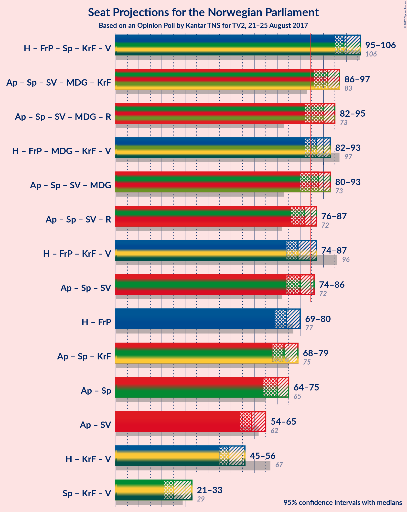

# Opinion Poll by Kantar TNS for TV2, 21–25 August 2017

<a href="#voting-intentions">Voting Intentions</a> | <a href="#seats">Seats</a> | <a href="#coalitions">Coalitions</a> | <a href="#technical-information">Technical Information</a>

## Voting Intentions

### Confidence Intervals

| Party | Last Result | Poll Result | 80% Confidence Interval | 90% Confidence Interval | 95% Confidence Interval | 99% Confidence Interval |
|:-----:|:-----------:|:-----------:|:-----------------------:|:-----------------------:|:-----------------------:|:-----------------------:|
| Arbeiderpartiet | 30.8% | 26.8% | 25.2–28.3% |24.8–28.8% |24.4–29.2% |23.7–30.0% |
| Høyre | 26.8% | 24.1% | 22.7–25.7% |22.3–26.1% |21.9–26.5% |21.2–27.3% |
| Fremskrittspartiet | 16.3% | 16.7% | 15.4–18.1% |15.1–18.5% |14.8–18.8% |14.2–19.5% |
| Senterpartiet | 5.5% | 11.2% | 10.1–12.4% |9.8–12.7% |9.6–13.0% |9.1–13.6% |
| Sosialistisk Venstreparti | 4.1% | 5.7% | 4.9–6.6% |4.7–6.8% |4.5–7.0% |4.2–7.5% |
| Miljøpartiet de Grønne | 2.8% | 4.6% | 4.0–5.4% |3.8–5.7% |3.6–5.9% |3.3–6.3% |
| Kristelig Folkeparti | 5.6% | 3.7% | 3.1–4.5% |3.0–4.7% |2.8–4.9% |2.6–5.3% |
| Venstre | 5.2% | 3.1% | 2.6–3.8% |2.4–4.0% |2.3–4.2% |2.1–4.6% |
| Rødt | 1.1% | 2.9% | 2.4–3.6% |2.3–3.8% |2.1–4.0% |1.9–4.3% |

*Note:* The poll result column reflects the actual value used in the calculations. Published results may vary slightly, and in addition be rounded to fewer digits.

## Seats

### Confidence Intervals

| Party | Last Result | Median | 80% Confidence Interval | 90% Confidence Interval | 95% Confidence Interval | 99% Confidence Interval |
|:-----:|:-----------:|:------:|:-----------------------:|:-----------------------:|:-----------------------:|:-----------------------:|
| <a href="#arbeiderpartiet">Arbeiderpartiet</a> | 55 | 49 | 46–52 |46–53 |45–53 |43–55 |
| <a href="#høyre">Høyre</a> | 48 | 44 | 41–47 |40–48 |39–48 |38–50 |
| <a href="#fremskrittspartiet">Fremskrittspartiet</a> | 29 | 30 | 29–32 |28–32 |28–33 |26–35 |
| <a href="#senterpartiet">Senterpartiet</a> | 10 | 20 | 18–23 |18–23 |17–24 |17–25 |
| <a href="#sosialistisk-venstreparti">Sosialistisk Venstreparti</a> | 7 | 10 | 9–12 |8–12 |8–13 |8–14 |
| <a href="#miljøpartiet-de-grønne">Miljøpartiet de Grønne</a> | 1 | 8 | 7–10 |3–10 |2–11 |1–11 |
| <a href="#kristelig-folkeparti">Kristelig Folkeparti</a> | 10 | 2 | 2–8 |2–8 |1–8 |1–9 |
| <a href="#venstre">Venstre</a> | 9 | 1 | 1–2 |1–3 |0–7 |0–8 |
| <a href="#rødt">Rødt</a> | 0 | 2 | 1–2 |1–2 |1–2 |1–7 |

### Arbeiderpartiet

*For a full overview of the results for this party, see the [Arbeiderpartiet](party-arbeiderpartiet.html) page.*

| Number of Seats | Probability | Accumulated | Special Marks |
|:---------------:|:-----------:|:-----------:|:-------------:|
| 42 | 0.1% | 100% |  |
| 43 | 0.5% | 99.9% |  |
| 44 | 1.3% | 99.3% |  |
| 45 | 3% | 98% |  |
| 46 | 11% | 95% |  |
| 47 | 7% | 85% |  |
| 48 | 17% | 77% |  |
| 49 | 15% | 60% | Median |
| 50 | 9% | 45% |  |
| 51 | 10% | 36% |  |
| 52 | 21% | 26% |  |
| 53 | 3% | 6% |  |
| 54 | 1.4% | 2% |  |
| 55 | 0.5% | 0.7% | Last Result |
| 56 | 0.2% | 0.2% |  |
| 57 | 0.1% | 0.1% |  |
| 58 | 0% | 0% |  |

### Høyre

*For a full overview of the results for this party, see the [Høyre](party-hyre.html) page.*

| Number of Seats | Probability | Accumulated | Special Marks |
|:---------------:|:-----------:|:-----------:|:-------------:|
| 36 | 0.1% | 100% |  |
| 37 | 0.2% | 99.9% |  |
| 38 | 2% | 99.8% |  |
| 39 | 2% | 98% |  |
| 40 | 5% | 96% |  |
| 41 | 5% | 92% |  |
| 42 | 12% | 86% |  |
| 43 | 13% | 74% |  |
| 44 | 17% | 61% | Median |
| 45 | 15% | 44% |  |
| 46 | 19% | 30% |  |
| 47 | 4% | 11% |  |
| 48 | 4% | 6% | Last Result |
| 49 | 2% | 2% |  |
| 50 | 0.4% | 0.5% |  |
| 51 | 0.1% | 0.1% |  |
| 52 | 0% | 0% |  |

### Fremskrittspartiet

*For a full overview of the results for this party, see the [Fremskrittspartiet](party-fremskrittspartiet.html) page.*

| Number of Seats | Probability | Accumulated | Special Marks |
|:---------------:|:-----------:|:-----------:|:-------------:|
| 25 | 0.1% | 100% |  |
| 26 | 0.4% | 99.9% |  |
| 27 | 1.1% | 99.5% |  |
| 28 | 8% | 98% |  |
| 29 | 32% | 90% | Last Result |
| 30 | 23% | 58% | Median |
| 31 | 15% | 35% |  |
| 32 | 15% | 19% |  |
| 33 | 3% | 5% |  |
| 34 | 1.0% | 2% |  |
| 35 | 0.3% | 0.6% |  |
| 36 | 0.1% | 0.2% |  |
| 37 | 0.1% | 0.1% |  |
| 38 | 0% | 0% |  |

### Senterpartiet

*For a full overview of the results for this party, see the [Senterpartiet](party-senterpartiet.html) page.*

| Number of Seats | Probability | Accumulated | Special Marks |
|:---------------:|:-----------:|:-----------:|:-------------:|
| 10 | 0% | 100% | Last Result |
| 11 | 0% | 100% |  |
| 12 | 0% | 100% |  |
| 13 | 0% | 100% |  |
| 14 | 0% | 100% |  |
| 15 | 0.1% | 100% |  |
| 16 | 0.4% | 99.9% |  |
| 17 | 3% | 99.5% |  |
| 18 | 8% | 96% |  |
| 19 | 20% | 88% |  |
| 20 | 23% | 68% | Median |
| 21 | 18% | 44% |  |
| 22 | 15% | 26% |  |
| 23 | 9% | 11% |  |
| 24 | 2% | 3% |  |
| 25 | 0.7% | 1.1% |  |
| 26 | 0.3% | 0.4% |  |
| 27 | 0% | 0% |  |

### Sosialistisk Venstreparti

*For a full overview of the results for this party, see the [Sosialistisk Venstreparti](party-sosialistiskvenstreparti.html) page.*

| Number of Seats | Probability | Accumulated | Special Marks |
|:---------------:|:-----------:|:-----------:|:-------------:|
| 2 | 0.1% | 100% |  |
| 3 | 0% | 99.9% |  |
| 4 | 0% | 99.9% |  |
| 5 | 0% | 99.9% |  |
| 6 | 0% | 99.9% |  |
| 7 | 0.4% | 99.9% | Last Result |
| 8 | 7% | 99.5% |  |
| 9 | 17% | 93% |  |
| 10 | 30% | 75% | Median |
| 11 | 30% | 45% |  |
| 12 | 12% | 15% |  |
| 13 | 3% | 3% |  |
| 14 | 0.4% | 0.5% |  |
| 15 | 0.1% | 0.1% |  |
| 16 | 0% | 0% |  |

### Miljøpartiet de Grønne

*For a full overview of the results for this party, see the [Miljøpartiet de Grønne](party-miljpartietdegrnne.html) page.*

| Number of Seats | Probability | Accumulated | Special Marks |
|:---------------:|:-----------:|:-----------:|:-------------:|
| 1 | 1.3% | 100% | Last Result |
| 2 | 1.2% | 98.7% |  |
| 3 | 4% | 97% |  |
| 4 | 3% | 94% |  |
| 5 | 0% | 91% |  |
| 6 | 0% | 91% |  |
| 7 | 11% | 91% |  |
| 8 | 35% | 80% | Median |
| 9 | 30% | 44% |  |
| 10 | 10% | 14% |  |
| 11 | 3% | 4% |  |
| 12 | 0.3% | 0.4% |  |
| 13 | 0% | 0% |  |

### Kristelig Folkeparti

*For a full overview of the results for this party, see the [Kristelig Folkeparti](party-kristeligfolkeparti.html) page.*

| Number of Seats | Probability | Accumulated | Special Marks |
|:---------------:|:-----------:|:-----------:|:-------------:|
| 0 | 0.1% | 100% |  |
| 1 | 3% | 99.9% |  |
| 2 | 61% | 97% | Median |
| 3 | 8% | 36% |  |
| 4 | 0% | 28% |  |
| 5 | 0% | 28% |  |
| 6 | 0% | 28% |  |
| 7 | 15% | 28% |  |
| 8 | 11% | 13% |  |
| 9 | 2% | 2% |  |
| 10 | 0.1% | 0.2% | Last Result |
| 11 | 0% | 0% |  |

### Venstre

*For a full overview of the results for this party, see the [Venstre](party-venstre.html) page.*

| Number of Seats | Probability | Accumulated | Special Marks |
|:---------------:|:-----------:|:-----------:|:-------------:|
| 0 | 5% | 100% |  |
| 1 | 58% | 95% | Median |
| 2 | 29% | 37% |  |
| 3 | 5% | 9% |  |
| 4 | 0% | 4% |  |
| 5 | 0% | 4% |  |
| 6 | 0% | 4% |  |
| 7 | 3% | 4% |  |
| 8 | 1.1% | 1.2% |  |
| 9 | 0.1% | 0.1% | Last Result |
| 10 | 0% | 0% |  |

### Rødt

*For a full overview of the results for this party, see the [Rødt](party-rdt.html) page.*

| Number of Seats | Probability | Accumulated | Special Marks |
|:---------------:|:-----------:|:-----------:|:-------------:|
| 0 | 0% | 100% | Last Result |
| 1 | 36% | 100% |  |
| 2 | 63% | 64% | Median |
| 3 | 0% | 1.4% |  |
| 4 | 0% | 1.4% |  |
| 5 | 0% | 1.4% |  |
| 6 | 0% | 1.4% |  |
| 7 | 0.9% | 1.4% |  |
| 8 | 0.5% | 0.5% |  |
| 9 | 0% | 0% |  |

## Coalitions

### Confidence Intervals

| Coalition | Last Result | Median | Majority? | 80% Confidence Interval | 90% Confidence Interval | 95% Confidence Interval | 99% Confidence Interval |
|:---------:|:-----------:|:------:|:---------:|:-----------------------:|:-----------------------:|:-----------------------:|:-----------------------:|
| Høyre – Fremskrittspartiet – Senterpartiet – Kristelig Folkeparti – Venstre | 106 | 99 | 100% | 96–104 | 96–105 | 95–106 | 93–108 |
| Arbeiderpartiet – Senterpartiet – Sosialistisk Venstreparti – Miljøpartiet de Grønne – Kristelig Folkeparti | 83 | 92 | 99.5% | 88–95 | 87–96 | 86–97 | 85–97 |
| Arbeiderpartiet – Senterpartiet – Sosialistisk Venstreparti – Miljøpartiet de Grønne – Rødt | 73 | 90 | 93% | 86–93 | 84–94 | 82–95 | 81–97 |
| Høyre – Fremskrittspartiet – Miljøpartiet de Grønne – Kristelig Folkeparti – Venstre | 97 | 87 | 84% | 84–91 | 83–92 | 82–93 | 80–94 |
| Arbeiderpartiet – Senterpartiet – Sosialistisk Venstreparti – Miljøpartiet de Grønne | 73 | 88 | 85% | 84–92 | 82–93 | 80–93 | 80–95 |
| Arbeiderpartiet – Senterpartiet – Sosialistisk Venstreparti – Rødt | 72 | 82 | 16% | 78–85 | 77–86 | 76–87 | 75–89 |
| Høyre – Fremskrittspartiet – Kristelig Folkeparti – Venstre | 96 | 79 | 7% | 76–83 | 75–85 | 74–87 | 72–88 |
| Arbeiderpartiet – Senterpartiet – Sosialistisk Venstreparti | 72 | 80 | 6% | 76–83 | 75–85 | 74–86 | 73–87 |
| Høyre – Fremskrittspartiet | 77 | 74 | 0% | 71–78 | 70–80 | 69–80 | 67–81 |
| Arbeiderpartiet – Senterpartiet – Kristelig Folkeparti | 75 | 73 | 0% | 70–77 | 68–78 | 68–79 | 66–81 |
| Arbeiderpartiet – Senterpartiet | 65 | 70 | 0% | 66–73 | 65–74 | 64–75 | 63–76 |
| Arbeiderpartiet – Sosialistisk Venstreparti | 62 | 59 | 0% | 56–63 | 55–63 | 54–65 | 54–66 |
| Høyre – Kristelig Folkeparti – Venstre | 67 | 49 | 0% | 46–53 | 45–55 | 45–56 | 43–57 |
| Senterpartiet – Kristelig Folkeparti – Venstre | 29 | 25 | 0% | 22–30 | 21–31 | 21–33 | 20–34 |

### Høyre – Fremskrittspartiet – Senterpartiet – Kristelig Folkeparti – Venstre

| Number of Seats | Probability | Accumulated | Special Marks |
|:---------------:|:-----------:|:-----------:|:-------------:|
| 91 | 0.1% | 100% |  |
| 92 | 0.2% | 99.9% |  |
| 93 | 0.6% | 99.7% |  |
| 94 | 1.3% | 99.0% |  |
| 95 | 3% | 98% |  |
| 96 | 13% | 95% |  |
| 97 | 11% | 82% | Median |
| 98 | 8% | 71% |  |
| 99 | 16% | 62% |  |
| 100 | 5% | 46% |  |
| 101 | 14% | 41% |  |
| 102 | 9% | 27% |  |
| 103 | 6% | 18% |  |
| 104 | 3% | 11% |  |
| 105 | 4% | 8% |  |
| 106 | 3% | 4% | Last Result |
| 107 | 0.4% | 1.0% |  |
| 108 | 0.3% | 0.6% |  |
| 109 | 0.2% | 0.3% |  |
| 110 | 0.1% | 0.2% |  |
| 111 | 0.1% | 0.1% |  |
| 112 | 0% | 0% |  |

### Arbeiderpartiet – Senterpartiet – Sosialistisk Venstreparti – Miljøpartiet de Grønne – Kristelig Folkeparti

| Number of Seats | Probability | Accumulated | Special Marks |
|:---------------:|:-----------:|:-----------:|:-------------:|
| 82 | 0% | 100% |  |
| 83 | 0.1% | 99.9% | Last Result |
| 84 | 0.3% | 99.8% |  |
| 85 | 1.4% | 99.5% | Majority |
| 86 | 3% | 98% |  |
| 87 | 4% | 95% |  |
| 88 | 7% | 92% |  |
| 89 | 7% | 85% | Median |
| 90 | 14% | 78% |  |
| 91 | 9% | 65% |  |
| 92 | 11% | 56% |  |
| 93 | 17% | 44% |  |
| 94 | 11% | 27% |  |
| 95 | 10% | 15% |  |
| 96 | 3% | 6% |  |
| 97 | 2% | 3% |  |
| 98 | 0.3% | 0.5% |  |
| 99 | 0.1% | 0.2% |  |
| 100 | 0.1% | 0.1% |  |
| 101 | 0% | 0% |  |

### Arbeiderpartiet – Senterpartiet – Sosialistisk Venstreparti – Miljøpartiet de Grønne – Rødt

| Number of Seats | Probability | Accumulated | Special Marks |
|:---------------:|:-----------:|:-----------:|:-------------:|
| 73 | 0% | 100% | Last Result |
| 74 | 0% | 100% |  |
| 75 | 0% | 100% |  |
| 76 | 0% | 100% |  |
| 77 | 0% | 100% |  |
| 78 | 0.1% | 100% |  |
| 79 | 0.1% | 99.9% |  |
| 80 | 0.1% | 99.8% |  |
| 81 | 0.3% | 99.7% |  |
| 82 | 2% | 99.4% |  |
| 83 | 0.7% | 97% |  |
| 84 | 3% | 96% |  |
| 85 | 3% | 93% | Majority |
| 86 | 7% | 90% |  |
| 87 | 6% | 84% |  |
| 88 | 11% | 78% |  |
| 89 | 12% | 67% | Median |
| 90 | 11% | 55% |  |
| 91 | 10% | 45% |  |
| 92 | 13% | 34% |  |
| 93 | 14% | 21% |  |
| 94 | 3% | 7% |  |
| 95 | 3% | 4% |  |
| 96 | 0.6% | 1.4% |  |
| 97 | 0.7% | 0.8% |  |
| 98 | 0.1% | 0.1% |  |
| 99 | 0% | 0% |  |

### Høyre – Fremskrittspartiet – Miljøpartiet de Grønne – Kristelig Folkeparti – Venstre

| Number of Seats | Probability | Accumulated | Special Marks |
|:---------------:|:-----------:|:-----------:|:-------------:|
| 77 | 0.2% | 100% |  |
| 78 | 0% | 99.8% |  |
| 79 | 0.2% | 99.8% |  |
| 80 | 0.2% | 99.6% |  |
| 81 | 2% | 99.4% |  |
| 82 | 1.5% | 98% |  |
| 83 | 4% | 96% |  |
| 84 | 8% | 92% |  |
| 85 | 18% | 84% | Median, Majority |
| 86 | 8% | 66% |  |
| 87 | 9% | 58% |  |
| 88 | 12% | 49% |  |
| 89 | 15% | 37% |  |
| 90 | 8% | 22% |  |
| 91 | 6% | 14% |  |
| 92 | 5% | 8% |  |
| 93 | 0.9% | 3% |  |
| 94 | 2% | 2% |  |
| 95 | 0.2% | 0.4% |  |
| 96 | 0.1% | 0.2% |  |
| 97 | 0% | 0% | Last Result |

### Arbeiderpartiet – Senterpartiet – Sosialistisk Venstreparti – Miljøpartiet de Grønne

| Number of Seats | Probability | Accumulated | Special Marks |
|:---------------:|:-----------:|:-----------:|:-------------:|
| 73 | 0% | 100% | Last Result |
| 74 | 0% | 100% |  |
| 75 | 0% | 100% |  |
| 76 | 0% | 100% |  |
| 77 | 0.1% | 100% |  |
| 78 | 0.1% | 99.8% |  |
| 79 | 0.2% | 99.8% |  |
| 80 | 3% | 99.6% |  |
| 81 | 0.7% | 97% |  |
| 82 | 2% | 96% |  |
| 83 | 3% | 94% |  |
| 84 | 6% | 91% |  |
| 85 | 7% | 85% | Majority |
| 86 | 5% | 78% |  |
| 87 | 15% | 73% | Median |
| 88 | 13% | 58% |  |
| 89 | 9% | 45% |  |
| 90 | 10% | 37% |  |
| 91 | 14% | 27% |  |
| 92 | 7% | 12% |  |
| 93 | 4% | 5% |  |
| 94 | 0.9% | 2% |  |
| 95 | 0.7% | 0.9% |  |
| 96 | 0.1% | 0.1% |  |
| 97 | 0% | 0% |  |

### Arbeiderpartiet – Senterpartiet – Sosialistisk Venstreparti – Rødt

| Number of Seats | Probability | Accumulated | Special Marks |
|:---------------:|:-----------:|:-----------:|:-------------:|
| 72 | 0% | 100% | Last Result |
| 73 | 0.1% | 100% |  |
| 74 | 0.2% | 99.8% |  |
| 75 | 2% | 99.6% |  |
| 76 | 0.9% | 98% |  |
| 77 | 5% | 97% |  |
| 78 | 6% | 92% |  |
| 79 | 8% | 86% |  |
| 80 | 15% | 78% |  |
| 81 | 12% | 63% | Median |
| 82 | 9% | 51% |  |
| 83 | 8% | 42% |  |
| 84 | 18% | 34% |  |
| 85 | 8% | 16% | Majority |
| 86 | 4% | 8% |  |
| 87 | 1.5% | 4% |  |
| 88 | 2% | 2% |  |
| 89 | 0.2% | 0.6% |  |
| 90 | 0.2% | 0.4% |  |
| 91 | 0% | 0.2% |  |
| 92 | 0.2% | 0.2% |  |
| 93 | 0% | 0% |  |

### Høyre – Fremskrittspartiet – Kristelig Folkeparti – Venstre

| Number of Seats | Probability | Accumulated | Special Marks |
|:---------------:|:-----------:|:-----------:|:-------------:|
| 71 | 0.1% | 100% |  |
| 72 | 0.7% | 99.9% |  |
| 73 | 0.6% | 99.2% |  |
| 74 | 3% | 98.6% |  |
| 75 | 3% | 96% |  |
| 76 | 14% | 93% |  |
| 77 | 13% | 79% | Median |
| 78 | 10% | 66% |  |
| 79 | 11% | 55% |  |
| 80 | 12% | 45% |  |
| 81 | 11% | 33% |  |
| 82 | 6% | 22% |  |
| 83 | 7% | 16% |  |
| 84 | 3% | 10% |  |
| 85 | 3% | 7% | Majority |
| 86 | 0.7% | 4% |  |
| 87 | 2% | 3% |  |
| 88 | 0.3% | 0.6% |  |
| 89 | 0.1% | 0.3% |  |
| 90 | 0.1% | 0.2% |  |
| 91 | 0.1% | 0.1% |  |
| 92 | 0% | 0% |  |
| 93 | 0% | 0% |  |
| 94 | 0% | 0% |  |
| 95 | 0% | 0% |  |
| 96 | 0% | 0% | Last Result |

### Arbeiderpartiet – Senterpartiet – Sosialistisk Venstreparti

| Number of Seats | Probability | Accumulated | Special Marks |
|:---------------:|:-----------:|:-----------:|:-------------:|
| 71 | 0.1% | 100% |  |
| 72 | 0.2% | 99.9% | Last Result |
| 73 | 2% | 99.7% |  |
| 74 | 0.8% | 98% |  |
| 75 | 2% | 97% |  |
| 76 | 9% | 95% |  |
| 77 | 6% | 86% |  |
| 78 | 13% | 80% |  |
| 79 | 13% | 67% | Median |
| 80 | 11% | 55% |  |
| 81 | 7% | 44% |  |
| 82 | 14% | 37% |  |
| 83 | 16% | 23% |  |
| 84 | 1.4% | 7% |  |
| 85 | 3% | 6% | Majority |
| 86 | 2% | 3% |  |
| 87 | 0.2% | 0.6% |  |
| 88 | 0.2% | 0.4% |  |
| 89 | 0.1% | 0.2% |  |
| 90 | 0.2% | 0.2% |  |
| 91 | 0% | 0% |  |

### Høyre – Fremskrittspartiet

| Number of Seats | Probability | Accumulated | Special Marks |
|:---------------:|:-----------:|:-----------:|:-------------:|
| 65 | 0.1% | 100% |  |
| 66 | 0.2% | 99.9% |  |
| 67 | 0.3% | 99.7% |  |
| 68 | 1.3% | 99.4% |  |
| 69 | 2% | 98% |  |
| 70 | 4% | 96% |  |
| 71 | 11% | 92% |  |
| 72 | 8% | 81% |  |
| 73 | 20% | 73% |  |
| 74 | 14% | 52% | Median |
| 75 | 9% | 38% |  |
| 76 | 7% | 30% |  |
| 77 | 10% | 22% | Last Result |
| 78 | 5% | 12% |  |
| 79 | 2% | 7% |  |
| 80 | 4% | 5% |  |
| 81 | 0.7% | 1.0% |  |
| 82 | 0.2% | 0.3% |  |
| 83 | 0.1% | 0.1% |  |
| 84 | 0% | 0% |  |

### Arbeiderpartiet – Senterpartiet – Kristelig Folkeparti

| Number of Seats | Probability | Accumulated | Special Marks |
|:---------------:|:-----------:|:-----------:|:-------------:|
| 64 | 0.1% | 100% |  |
| 65 | 0.2% | 99.9% |  |
| 66 | 0.4% | 99.8% |  |
| 67 | 2% | 99.3% |  |
| 68 | 3% | 98% |  |
| 69 | 4% | 94% |  |
| 70 | 11% | 91% |  |
| 71 | 8% | 80% | Median |
| 72 | 9% | 72% |  |
| 73 | 17% | 64% |  |
| 74 | 12% | 47% |  |
| 75 | 14% | 35% | Last Result |
| 76 | 8% | 21% |  |
| 77 | 3% | 13% |  |
| 78 | 7% | 10% |  |
| 79 | 1.4% | 3% |  |
| 80 | 1.1% | 2% |  |
| 81 | 0.2% | 0.6% |  |
| 82 | 0.3% | 0.3% |  |
| 83 | 0% | 0.1% |  |
| 84 | 0% | 0% |  |

### Arbeiderpartiet – Senterpartiet

| Number of Seats | Probability | Accumulated | Special Marks |
|:---------------:|:-----------:|:-----------:|:-------------:|
| 61 | 0.1% | 100% |  |
| 62 | 0.2% | 99.9% |  |
| 63 | 1.0% | 99.7% |  |
| 64 | 1.3% | 98.7% |  |
| 65 | 4% | 97% | Last Result |
| 66 | 7% | 94% |  |
| 67 | 7% | 86% |  |
| 68 | 16% | 80% |  |
| 69 | 11% | 63% | Median |
| 70 | 6% | 52% |  |
| 71 | 20% | 46% |  |
| 72 | 12% | 26% |  |
| 73 | 8% | 14% |  |
| 74 | 3% | 6% |  |
| 75 | 1.4% | 3% |  |
| 76 | 2% | 2% |  |
| 77 | 0.1% | 0.3% |  |
| 78 | 0.2% | 0.2% |  |
| 79 | 0% | 0% |  |

### Arbeiderpartiet – Sosialistisk Venstreparti

| Number of Seats | Probability | Accumulated | Special Marks |
|:---------------:|:-----------:|:-----------:|:-------------:|
| 51 | 0% | 100% |  |
| 52 | 0.1% | 99.9% |  |
| 53 | 0.3% | 99.8% |  |
| 54 | 2% | 99.5% |  |
| 55 | 3% | 97% |  |
| 56 | 7% | 95% |  |
| 57 | 13% | 88% |  |
| 58 | 8% | 75% |  |
| 59 | 17% | 67% | Median |
| 60 | 12% | 50% |  |
| 61 | 10% | 37% |  |
| 62 | 11% | 28% | Last Result |
| 63 | 13% | 17% |  |
| 64 | 2% | 5% |  |
| 65 | 2% | 3% |  |
| 66 | 0.5% | 0.7% |  |
| 67 | 0.1% | 0.2% |  |
| 68 | 0.1% | 0.1% |  |
| 69 | 0% | 0% |  |

### Høyre – Kristelig Folkeparti – Venstre

| Number of Seats | Probability | Accumulated | Special Marks |
|:---------------:|:-----------:|:-----------:|:-------------:|
| 41 | 0% | 100% |  |
| 42 | 0.2% | 99.9% |  |
| 43 | 0.4% | 99.7% |  |
| 44 | 1.3% | 99.3% |  |
| 45 | 5% | 98% |  |
| 46 | 10% | 93% |  |
| 47 | 13% | 83% | Median |
| 48 | 13% | 70% |  |
| 49 | 19% | 57% |  |
| 50 | 11% | 39% |  |
| 51 | 8% | 27% |  |
| 52 | 6% | 20% |  |
| 53 | 6% | 14% |  |
| 54 | 2% | 8% |  |
| 55 | 3% | 6% |  |
| 56 | 3% | 3% |  |
| 57 | 0.2% | 0.6% |  |
| 58 | 0.2% | 0.4% |  |
| 59 | 0.2% | 0.2% |  |
| 60 | 0% | 0% |  |
| 61 | 0% | 0% |  |
| 62 | 0% | 0% |  |
| 63 | 0% | 0% |  |
| 64 | 0% | 0% |  |
| 65 | 0% | 0% |  |
| 66 | 0% | 0% |  |
| 67 | 0% | 0% | Last Result |

### Senterpartiet – Kristelig Folkeparti – Venstre

| Number of Seats | Probability | Accumulated | Special Marks |
|:---------------:|:-----------:|:-----------:|:-------------:|
| 19 | 0.2% | 100% |  |
| 20 | 1.5% | 99.8% |  |
| 21 | 3% | 98% |  |
| 22 | 11% | 95% |  |
| 23 | 12% | 84% | Median |
| 24 | 16% | 72% |  |
| 25 | 10% | 57% |  |
| 26 | 11% | 46% |  |
| 27 | 8% | 35% |  |
| 28 | 10% | 27% |  |
| 29 | 6% | 16% | Last Result |
| 30 | 3% | 10% |  |
| 31 | 4% | 8% |  |
| 32 | 0.8% | 4% |  |
| 33 | 2% | 3% |  |
| 34 | 0.3% | 0.6% |  |
| 35 | 0.1% | 0.3% |  |
| 36 | 0.1% | 0.2% |  |
| 37 | 0% | 0.1% |  |
| 38 | 0% | 0% |  |

## Technical Information

### Opinion Poll

+ **Pollster:** Kantar TNS
+ **Media:** TV2
+ **Fieldwork period:** 21–25 August 2017

### Calculations

+ **Sample size:** 1342
+ **Simulations done:** 2,097,152
+ **Error estimate:** 0.96%

