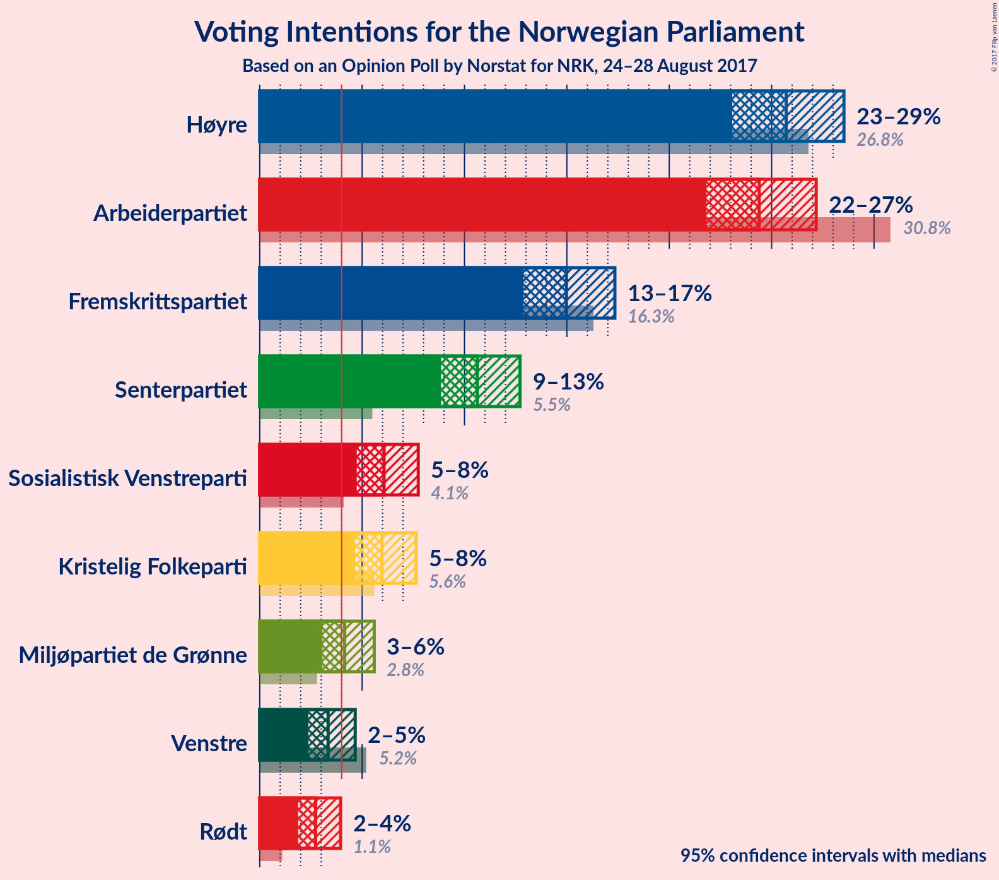
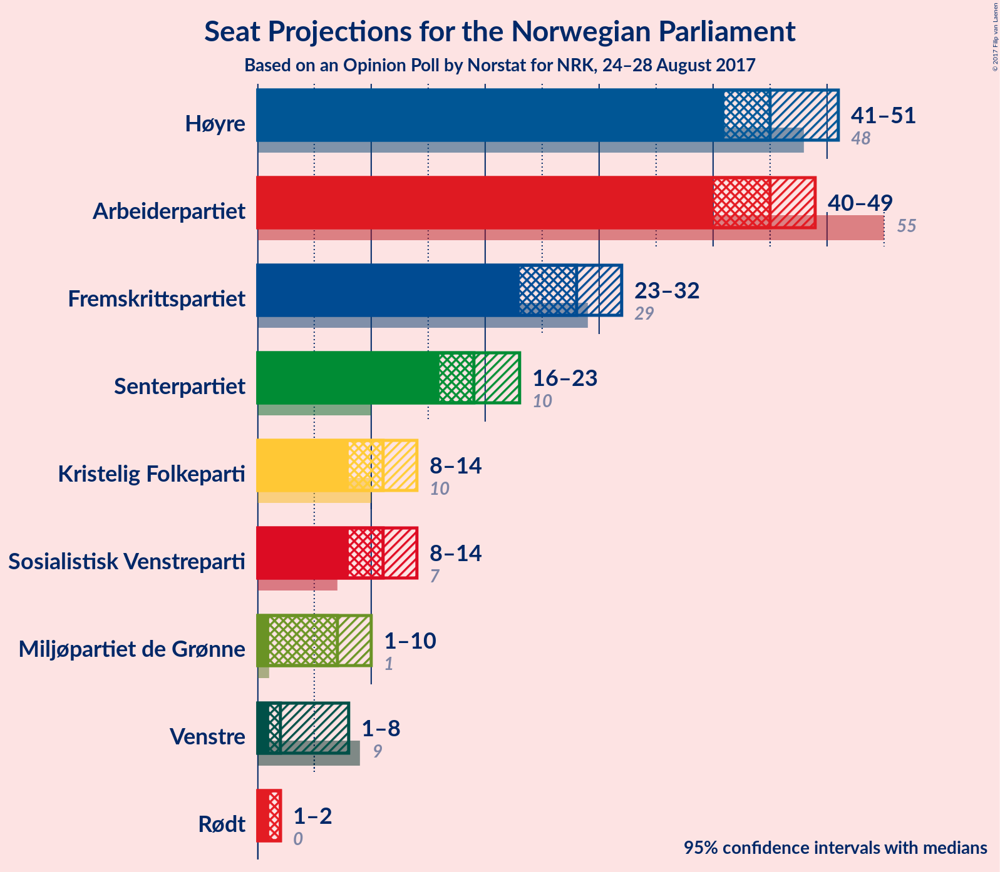
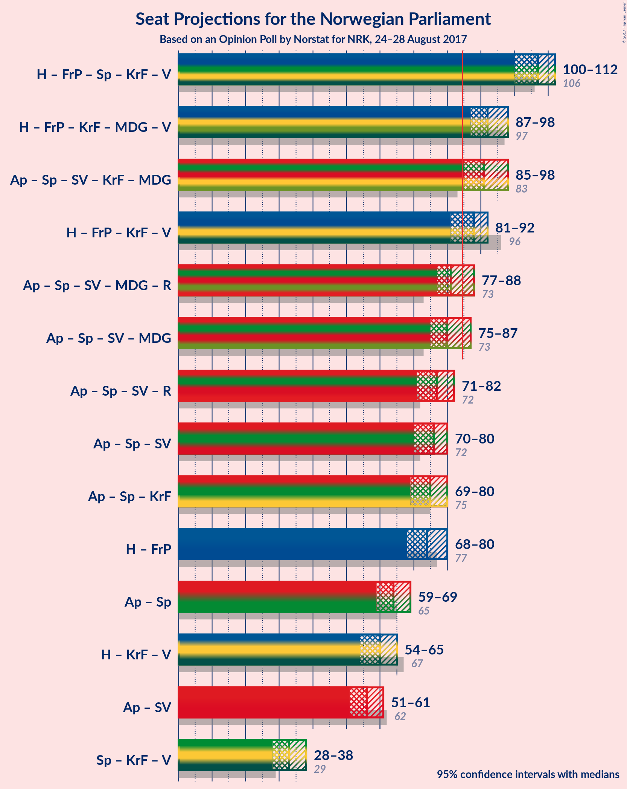

# Opinion Poll by Norstat for NRK, 24–28 August 2017

<a href="#voting-intentions">Voting Intentions</a> | <a href="#seats">Seats</a> | <a href="#coalitions">Coalitions</a> | <a href="#technical-information">Technical Information</a>

## Voting Intentions

### Confidence Intervals

| Party | Last Result | Poll Result | 80% Confidence Interval | 90% Confidence Interval | 95% Confidence Interval | 99% Confidence Interval |
|:-----:|:-----------:|:-----------:|:-----------------------:|:-----------------------:|:-----------------------:|:-----------------------:|
| Høyre | 26.8% | 25.7% | 24.0–27.6% |23.5–28.1% |23.1–28.5% |22.3–29.4% |
| Arbeiderpartiet | 30.8% | 24.4% | 22.7–26.2% |22.2–26.7% |21.8–27.2% |21.0–28.1% |
| Fremskrittspartiet | 16.3% | 15.0% | 13.6–16.5% |13.2–17.0% |12.9–17.3% |12.3–18.1% |
| Senterpartiet | 5.5% | 10.6% | 9.5–12.0% |9.1–12.4% |8.9–12.7% |8.3–13.4% |
| Sosialistisk Venstreparti | 4.1% | 6.1% | 5.2–7.2% |5.0–7.5% |4.7–7.7% |4.4–8.3% |
| Kristelig Folkeparti | 5.6% | 6.0% | 5.1–7.1% |4.9–7.4% |4.6–7.6% |4.3–8.2% |
| Miljøpartiet de Grønne | 2.8% | 4.1% | 3.4–5.1% |3.2–5.3% |3.1–5.6% |2.8–6.1% |
| Venstre | 5.2% | 3.3% | 2.7–4.2% |2.5–4.5% |2.4–4.7% |2.1–5.1% |
| Rødt | 1.1% | 2.7% | 2.2–3.5% |2.0–3.7% |1.9–3.9% |1.6–4.4% |

*Note:* The poll result column reflects the actual value used in the calculations. Published results may vary slightly, and in addition be rounded to fewer digits.

## Seats

### Confidence Intervals

| Party | Last Result | Median | 80% Confidence Interval | 90% Confidence Interval | 95% Confidence Interval | 99% Confidence Interval |
|:-----:|:-----------:|:------:|:-----------------------:|:-----------------------:|:-----------------------:|:-----------------------:|
| <a href="#høyre">Høyre</a> | 48 | 45 | 42–50 |41–51 |41–51 |39–53 |
| <a href="#arbeiderpartiet">Arbeiderpartiet</a> | 55 | 45 | 42–48 |41–48 |40–49 |38–52 |
| <a href="#fremskrittspartiet">Fremskrittspartiet</a> | 29 | 28 | 24–31 |24–31 |23–32 |21–32 |
| <a href="#senterpartiet">Senterpartiet</a> | 10 | 19 | 17–22 |16–23 |16–23 |14–24 |
| <a href="#sosialistisk-venstreparti">Sosialistisk Venstreparti</a> | 7 | 11 | 10–13 |9–14 |8–14 |8–15 |
| <a href="#kristelig-folkeparti">Kristelig Folkeparti</a> | 10 | 11 | 9–13 |9–13 |8–14 |8–15 |
| <a href="#miljøpartiet-de-grønne">Miljøpartiet de Grønne</a> | 1 | 7 | 1–9 |1–10 |1–10 |1–11 |
| <a href="#venstre">Venstre</a> | 9 | 2 | 1–7 |1–8 |1–8 |0–9 |
| <a href="#rødt">Rødt</a> | 0 | 2 | 1–2 |1–2 |1–2 |1–7 |

### Høyre

| Number of Seats | Probability | Accumulated | Special Marks |
|:---------------:|:-----------:|:-----------:|:-------------:|
| 37 | 0.1% | 100% |  |
| 38 | 0.1% | 99.9% |  |
| 39 | 1.2% | 99.7% |  |
| 40 | 0.8% | 98.5% |  |
| 41 | 3% | 98% |  |
| 42 | 19% | 95% |  |
| 43 | 11% | 76% |  |
| 44 | 10% | 66% |  |
| 45 | 8% | 56% | Median |
| 46 | 8% | 49% |  |
| 47 | 9% | 40% |  |
| 48 | 9% | 31% | Last Result |
| 49 | 9% | 22% |  |
| 50 | 7% | 13% |  |
| 51 | 4% | 6% |  |
| 52 | 0.4% | 2% |  |
| 53 | 1.5% | 2% |  |
| 54 | 0.2% | 0.5% |  |
| 55 | 0.1% | 0.3% |  |
| 56 | 0.1% | 0.1% |  |
| 57 | 0% | 0% |  |

### Arbeiderpartiet

| Number of Seats | Probability | Accumulated | Special Marks |
|:---------------:|:-----------:|:-----------:|:-------------:|
| 36 | 0.1% | 100% |  |
| 37 | 0.1% | 99.9% |  |
| 38 | 0.6% | 99.8% |  |
| 39 | 0.8% | 99.3% |  |
| 40 | 3% | 98% |  |
| 41 | 5% | 95% |  |
| 42 | 14% | 90% |  |
| 43 | 4% | 76% |  |
| 44 | 7% | 72% |  |
| 45 | 25% | 65% | Median |
| 46 | 18% | 40% |  |
| 47 | 8% | 21% |  |
| 48 | 9% | 14% |  |
| 49 | 2% | 5% |  |
| 50 | 1.1% | 2% |  |
| 51 | 0.5% | 1.3% |  |
| 52 | 0.3% | 0.8% |  |
| 53 | 0.5% | 0.5% |  |
| 54 | 0% | 0% |  |
| 55 | 0% | 0% | Last Result |

### Fremskrittspartiet

| Number of Seats | Probability | Accumulated | Special Marks |
|:---------------:|:-----------:|:-----------:|:-------------:|
| 20 | 0.1% | 100% |  |
| 21 | 0.4% | 99.9% |  |
| 22 | 0.8% | 99.5% |  |
| 23 | 3% | 98.7% |  |
| 24 | 6% | 95% |  |
| 25 | 7% | 89% |  |
| 26 | 17% | 83% |  |
| 27 | 12% | 65% |  |
| 28 | 16% | 53% | Median |
| 29 | 8% | 37% | Last Result |
| 30 | 14% | 29% |  |
| 31 | 13% | 15% |  |
| 32 | 2% | 3% |  |
| 33 | 0.3% | 0.4% |  |
| 34 | 0.1% | 0.1% |  |
| 35 | 0.1% | 0.1% |  |
| 36 | 0% | 0% |  |

### Senterpartiet

| Number of Seats | Probability | Accumulated | Special Marks |
|:---------------:|:-----------:|:-----------:|:-------------:|
| 10 | 0% | 100% | Last Result |
| 11 | 0% | 100% |  |
| 12 | 0.1% | 100% |  |
| 13 | 0.1% | 99.9% |  |
| 14 | 0.5% | 99.8% |  |
| 15 | 1.0% | 99.3% |  |
| 16 | 6% | 98% |  |
| 17 | 8% | 92% |  |
| 18 | 24% | 84% |  |
| 19 | 17% | 60% | Median |
| 20 | 12% | 42% |  |
| 21 | 12% | 30% |  |
| 22 | 13% | 18% |  |
| 23 | 4% | 5% |  |
| 24 | 1.4% | 2% |  |
| 25 | 0.2% | 0.2% |  |
| 26 | 0% | 0.1% |  |
| 27 | 0% | 0% |  |

### Sosialistisk Venstreparti

| Number of Seats | Probability | Accumulated | Special Marks |
|:---------------:|:-----------:|:-----------:|:-------------:|
| 2 | 0.3% | 100% |  |
| 3 | 0% | 99.7% |  |
| 4 | 0% | 99.7% |  |
| 5 | 0% | 99.7% |  |
| 6 | 0% | 99.7% |  |
| 7 | 0.2% | 99.7% | Last Result |
| 8 | 2% | 99.5% |  |
| 9 | 7% | 97% |  |
| 10 | 30% | 91% |  |
| 11 | 29% | 61% | Median |
| 12 | 18% | 32% |  |
| 13 | 7% | 14% |  |
| 14 | 6% | 7% |  |
| 15 | 1.0% | 1.3% |  |
| 16 | 0.3% | 0.3% |  |
| 17 | 0% | 0% |  |

### Kristelig Folkeparti

| Number of Seats | Probability | Accumulated | Special Marks |
|:---------------:|:-----------:|:-----------:|:-------------:|
| 3 | 0.1% | 100% |  |
| 4 | 0% | 99.8% |  |
| 5 | 0% | 99.8% |  |
| 6 | 0% | 99.8% |  |
| 7 | 0.3% | 99.8% |  |
| 8 | 4% | 99.6% |  |
| 9 | 9% | 96% |  |
| 10 | 29% | 87% | Last Result |
| 11 | 29% | 58% | Median |
| 12 | 16% | 28% |  |
| 13 | 8% | 12% |  |
| 14 | 4% | 4% |  |
| 15 | 0.5% | 0.6% |  |
| 16 | 0.1% | 0.1% |  |
| 17 | 0% | 0% |  |

### Miljøpartiet de Grønne

| Number of Seats | Probability | Accumulated | Special Marks |
|:---------------:|:-----------:|:-----------:|:-------------:|
| 1 | 11% | 100% | Last Result |
| 2 | 9% | 89% |  |
| 3 | 14% | 80% |  |
| 4 | 8% | 66% |  |
| 5 | 0% | 58% |  |
| 6 | 0% | 58% |  |
| 7 | 11% | 58% | Median |
| 8 | 31% | 46% |  |
| 9 | 9% | 15% |  |
| 10 | 6% | 6% |  |
| 11 | 0.4% | 0.5% |  |
| 12 | 0.1% | 0.1% |  |
| 13 | 0% | 0% |  |

### Venstre

| Number of Seats | Probability | Accumulated | Special Marks |
|:---------------:|:-----------:|:-----------:|:-------------:|
| 0 | 2% | 100% |  |
| 1 | 47% | 98% |  |
| 2 | 28% | 51% | Median |
| 3 | 9% | 23% |  |
| 4 | 0% | 14% |  |
| 5 | 0% | 14% |  |
| 6 | 0.2% | 14% |  |
| 7 | 7% | 14% |  |
| 8 | 5% | 7% |  |
| 9 | 2% | 2% | Last Result |
| 10 | 0.1% | 0.1% |  |
| 11 | 0% | 0% |  |

### Rødt

| Number of Seats | Probability | Accumulated | Special Marks |
|:---------------:|:-----------:|:-----------:|:-------------:|
| 0 | 0% | 100% | Last Result |
| 1 | 48% | 100% |  |
| 2 | 49% | 52% | Median |
| 3 | 0% | 2% |  |
| 4 | 0% | 2% |  |
| 5 | 0% | 2% |  |
| 6 | 0.2% | 2% |  |
| 7 | 2% | 2% |  |
| 8 | 0.2% | 0.3% |  |
| 9 | 0.1% | 0.1% |  |
| 10 | 0% | 0% |  |

## Coalitions

### Confidence Intervals

| Coalition | Last Result | Median | Majority? | 80% Confidence Interval | 90% Confidence Interval | 95% Confidence Interval | 99% Confidence Interval |
|:---------:|:-----------:|:------:|:---------:|:-----------------------:|:-----------------------:|:-----------------------:|:-----------------------:|
| Høyre – Fremskrittspartiet – Senterpartiet – Kristelig Folkeparti – Venstre | 106 | 105 | 100% | 101–110 | 101–111 | 100–112 | 97–115 |
| Arbeiderpartiet – Senterpartiet – Sosialistisk Venstreparti – Kristelig Folkeparti – Miljøpartiet de Grønne | 83 | 92 | 98.6% | 87–98 | 86–98 | 86–98 | 82–100 |
| Høyre – Fremskrittspartiet – Kristelig Folkeparti – Miljøpartiet de Grønne – Venstre | 97 | 92 | 99.3% | 88–97 | 87–98 | 86–98 | 84–100 |
| Høyre – Fremskrittspartiet – Kristelig Folkeparti – Venstre | 96 | 86 | 65% | 82–91 | 81–91 | 81–93 | 77–95 |
| Arbeiderpartiet – Senterpartiet – Sosialistisk Venstreparti – Miljøpartiet de Grønne – Rødt | 73 | 83 | 35% | 78–87 | 78–88 | 76–88 | 74–92 |
| Arbeiderpartiet – Senterpartiet – Sosialistisk Venstreparti – Miljøpartiet de Grønne | 73 | 81 | 24% | 76–86 | 76–86 | 75–87 | 72–90 |
| Arbeiderpartiet – Senterpartiet – Sosialistisk Venstreparti – Rødt | 72 | 77 | 0.7% | 72–81 | 71–82 | 71–83 | 69–85 |
| Arbeiderpartiet – Senterpartiet – Sosialistisk Venstreparti | 72 | 75 | 0.1% | 71–79 | 70–80 | 69–81 | 67–83 |
| Arbeiderpartiet – Senterpartiet – Kristelig Folkeparti | 75 | 75 | 0.2% | 71–79 | 70–80 | 69–80 | 66–82 |
| Høyre – Fremskrittspartiet | 77 | 73 | 0% | 69–79 | 68–80 | 68–80 | 65–81 |
| Arbeiderpartiet – Senterpartiet | 65 | 64 | 0% | 60–67 | 59–68 | 58–69 | 56–73 |
| Høyre – Kristelig Folkeparti – Venstre | 67 | 59 | 0% | 54–63 | 54–65 | 53–65 | 52–68 |
| Arbeiderpartiet – Sosialistisk Venstreparti | 62 | 56 | 0% | 52–59 | 51–60 | 50–61 | 48–63 |
| Senterpartiet – Kristelig Folkeparti – Venstre | 29 | 32 | 0% | 29–36 | 28–38 | 27–39 | 26–41 |

### Høyre – Fremskrittspartiet – Senterpartiet – Kristelig Folkeparti – Venstre

| Number of Seats | Probability | Accumulated | Special Marks |
|:---------------:|:-----------:|:-----------:|:-------------:|
| 94 | 0.1% | 100% |  |
| 95 | 0.1% | 99.9% |  |
| 96 | 0.2% | 99.9% |  |
| 97 | 0.5% | 99.6% |  |
| 98 | 0.6% | 99.1% |  |
| 99 | 0.4% | 98.5% |  |
| 100 | 2% | 98% |  |
| 101 | 6% | 96% |  |
| 102 | 6% | 90% |  |
| 103 | 14% | 84% |  |
| 104 | 13% | 70% |  |
| 105 | 11% | 58% | Median |
| 106 | 8% | 47% | Last Result |
| 107 | 3% | 39% |  |
| 108 | 4% | 36% |  |
| 109 | 16% | 33% |  |
| 110 | 10% | 16% |  |
| 111 | 2% | 6% |  |
| 112 | 4% | 5% |  |
| 113 | 0.3% | 1.0% |  |
| 114 | 0.1% | 0.7% |  |
| 115 | 0.1% | 0.6% |  |
| 116 | 0.3% | 0.5% |  |
| 117 | 0.1% | 0.2% |  |
| 118 | 0.1% | 0.1% |  |
| 119 | 0% | 0% |  |

### Arbeiderpartiet – Senterpartiet – Sosialistisk Venstreparti – Kristelig Folkeparti – Miljøpartiet de Grønne

| Number of Seats | Probability | Accumulated | Special Marks |
|:---------------:|:-----------:|:-----------:|:-------------:|
| 78 | 0.1% | 100% |  |
| 79 | 0% | 99.9% |  |
| 80 | 0% | 99.9% |  |
| 81 | 0.1% | 99.8% |  |
| 82 | 0.5% | 99.8% |  |
| 83 | 0.3% | 99.3% | Last Result |
| 84 | 0.4% | 99.0% |  |
| 85 | 0.9% | 98.6% | Majority |
| 86 | 6% | 98% |  |
| 87 | 7% | 91% |  |
| 88 | 11% | 84% |  |
| 89 | 7% | 73% |  |
| 90 | 5% | 66% |  |
| 91 | 8% | 61% |  |
| 92 | 12% | 53% |  |
| 93 | 9% | 41% | Median |
| 94 | 5% | 32% |  |
| 95 | 3% | 27% |  |
| 96 | 12% | 24% |  |
| 97 | 2% | 12% |  |
| 98 | 9% | 10% |  |
| 99 | 0.8% | 2% |  |
| 100 | 0.5% | 0.8% |  |
| 101 | 0.2% | 0.3% |  |
| 102 | 0% | 0.1% |  |
| 103 | 0% | 0.1% |  |
| 104 | 0% | 0% |  |

### Høyre – Fremskrittspartiet – Kristelig Folkeparti – Miljøpartiet de Grønne – Venstre

| Number of Seats | Probability | Accumulated | Special Marks |
|:---------------:|:-----------:|:-----------:|:-------------:|
| 82 | 0.1% | 100% |  |
| 83 | 0.1% | 99.9% |  |
| 84 | 0.6% | 99.8% |  |
| 85 | 0.9% | 99.3% | Majority |
| 86 | 1.3% | 98% |  |
| 87 | 2% | 97% |  |
| 88 | 6% | 95% |  |
| 89 | 3% | 88% |  |
| 90 | 18% | 85% |  |
| 91 | 13% | 68% |  |
| 92 | 10% | 55% |  |
| 93 | 14% | 45% | Median |
| 94 | 8% | 31% |  |
| 95 | 6% | 22% |  |
| 96 | 4% | 16% |  |
| 97 | 6% | 12% | Last Result |
| 98 | 4% | 6% |  |
| 99 | 0.9% | 2% |  |
| 100 | 0.6% | 0.9% |  |
| 101 | 0.2% | 0.4% |  |
| 102 | 0.1% | 0.2% |  |
| 103 | 0% | 0.1% |  |
| 104 | 0.1% | 0.1% |  |
| 105 | 0% | 0% |  |

### Høyre – Fremskrittspartiet – Kristelig Folkeparti – Venstre

| Number of Seats | Probability | Accumulated | Special Marks |
|:---------------:|:-----------:|:-----------:|:-------------:|
| 76 | 0% | 100% |  |
| 77 | 0.5% | 99.9% |  |
| 78 | 0.3% | 99.4% |  |
| 79 | 0.3% | 99.1% |  |
| 80 | 0.9% | 98.9% |  |
| 81 | 4% | 98% |  |
| 82 | 17% | 94% |  |
| 83 | 4% | 77% |  |
| 84 | 8% | 73% |  |
| 85 | 7% | 65% | Majority |
| 86 | 11% | 58% | Median |
| 87 | 5% | 47% |  |
| 88 | 6% | 42% |  |
| 89 | 6% | 36% |  |
| 90 | 9% | 30% |  |
| 91 | 17% | 21% |  |
| 92 | 1.2% | 4% |  |
| 93 | 2% | 3% |  |
| 94 | 0.6% | 1.3% |  |
| 95 | 0.3% | 0.7% |  |
| 96 | 0.1% | 0.4% | Last Result |
| 97 | 0.1% | 0.3% |  |
| 98 | 0.1% | 0.2% |  |
| 99 | 0% | 0.1% |  |
| 100 | 0% | 0% |  |

### Arbeiderpartiet – Senterpartiet – Sosialistisk Venstreparti – Miljøpartiet de Grønne – Rødt

| Number of Seats | Probability | Accumulated | Special Marks |
|:---------------:|:-----------:|:-----------:|:-------------:|
| 70 | 0% | 100% |  |
| 71 | 0.1% | 99.9% |  |
| 72 | 0.1% | 99.8% |  |
| 73 | 0.1% | 99.7% | Last Result |
| 74 | 0.3% | 99.6% |  |
| 75 | 0.6% | 99.3% |  |
| 76 | 2% | 98.7% |  |
| 77 | 1.2% | 97% |  |
| 78 | 17% | 96% |  |
| 79 | 9% | 79% |  |
| 80 | 6% | 70% |  |
| 81 | 6% | 64% |  |
| 82 | 5% | 58% |  |
| 83 | 11% | 53% |  |
| 84 | 7% | 42% | Median |
| 85 | 8% | 35% | Majority |
| 86 | 4% | 27% |  |
| 87 | 17% | 23% |  |
| 88 | 4% | 6% |  |
| 89 | 0.9% | 2% |  |
| 90 | 0.3% | 1.1% |  |
| 91 | 0.3% | 0.9% |  |
| 92 | 0.5% | 0.6% |  |
| 93 | 0% | 0.1% |  |
| 94 | 0% | 0% |  |

### Arbeiderpartiet – Senterpartiet – Sosialistisk Venstreparti – Miljøpartiet de Grønne

| Number of Seats | Probability | Accumulated | Special Marks |
|:---------------:|:-----------:|:-----------:|:-------------:|
| 68 | 0% | 100% |  |
| 69 | 0.2% | 99.9% |  |
| 70 | 0.1% | 99.7% |  |
| 71 | 0.1% | 99.6% |  |
| 72 | 0.2% | 99.5% |  |
| 73 | 0.4% | 99.3% | Last Result |
| 74 | 0.7% | 98.9% |  |
| 75 | 2% | 98% |  |
| 76 | 12% | 96% |  |
| 77 | 10% | 84% |  |
| 78 | 6% | 74% |  |
| 79 | 8% | 68% |  |
| 80 | 4% | 60% |  |
| 81 | 9% | 56% |  |
| 82 | 13% | 48% | Median |
| 83 | 7% | 35% |  |
| 84 | 4% | 28% |  |
| 85 | 8% | 24% | Majority |
| 86 | 12% | 16% |  |
| 87 | 2% | 3% |  |
| 88 | 0.3% | 1.2% |  |
| 89 | 0.1% | 0.9% |  |
| 90 | 0.3% | 0.7% |  |
| 91 | 0.4% | 0.4% |  |
| 92 | 0% | 0% |  |

### Arbeiderpartiet – Senterpartiet – Sosialistisk Venstreparti – Rødt

| Number of Seats | Probability | Accumulated | Special Marks |
|:---------------:|:-----------:|:-----------:|:-------------:|
| 65 | 0.1% | 100% |  |
| 66 | 0% | 99.9% |  |
| 67 | 0.1% | 99.9% |  |
| 68 | 0.2% | 99.8% |  |
| 69 | 0.6% | 99.6% |  |
| 70 | 0.9% | 99.1% |  |
| 71 | 4% | 98% |  |
| 72 | 6% | 94% | Last Result |
| 73 | 4% | 88% |  |
| 74 | 6% | 84% |  |
| 75 | 8% | 77% |  |
| 76 | 14% | 69% |  |
| 77 | 10% | 55% | Median |
| 78 | 13% | 45% |  |
| 79 | 18% | 32% |  |
| 80 | 3% | 15% |  |
| 81 | 6% | 12% |  |
| 82 | 2% | 5% |  |
| 83 | 1.3% | 3% |  |
| 84 | 0.9% | 2% |  |
| 85 | 0.6% | 0.7% | Majority |
| 86 | 0.1% | 0.2% |  |
| 87 | 0.1% | 0.1% |  |
| 88 | 0% | 0% |  |

### Arbeiderpartiet – Senterpartiet – Sosialistisk Venstreparti

| Number of Seats | Probability | Accumulated | Special Marks |
|:---------------:|:-----------:|:-----------:|:-------------:|
| 64 | 0.1% | 100% |  |
| 65 | 0.1% | 99.9% |  |
| 66 | 0.1% | 99.8% |  |
| 67 | 0.6% | 99.7% |  |
| 68 | 0.7% | 99.1% |  |
| 69 | 2% | 98% |  |
| 70 | 5% | 97% |  |
| 71 | 6% | 92% |  |
| 72 | 6% | 86% | Last Result |
| 73 | 10% | 80% |  |
| 74 | 15% | 70% |  |
| 75 | 6% | 55% | Median |
| 76 | 10% | 48% |  |
| 77 | 13% | 38% |  |
| 78 | 13% | 25% |  |
| 79 | 4% | 12% |  |
| 80 | 5% | 8% |  |
| 81 | 1.1% | 3% |  |
| 82 | 0.8% | 2% |  |
| 83 | 0.9% | 1.1% |  |
| 84 | 0.1% | 0.2% |  |
| 85 | 0.1% | 0.1% | Majority |
| 86 | 0% | 0% |  |

### Arbeiderpartiet – Senterpartiet – Kristelig Folkeparti

| Number of Seats | Probability | Accumulated | Special Marks |
|:---------------:|:-----------:|:-----------:|:-------------:|
| 64 | 0.1% | 100% |  |
| 65 | 0.2% | 99.8% |  |
| 66 | 0.3% | 99.6% |  |
| 67 | 1.0% | 99.4% |  |
| 68 | 0.7% | 98% |  |
| 69 | 0.5% | 98% |  |
| 70 | 5% | 97% |  |
| 71 | 3% | 92% |  |
| 72 | 15% | 89% |  |
| 73 | 11% | 73% |  |
| 74 | 6% | 63% |  |
| 75 | 18% | 56% | Last Result, Median |
| 76 | 2% | 38% |  |
| 77 | 7% | 37% |  |
| 78 | 12% | 29% |  |
| 79 | 12% | 18% |  |
| 80 | 3% | 5% |  |
| 81 | 0.9% | 2% |  |
| 82 | 0.7% | 1.0% |  |
| 83 | 0.1% | 0.4% |  |
| 84 | 0.1% | 0.2% |  |
| 85 | 0.1% | 0.2% | Majority |
| 86 | 0% | 0% |  |

### Høyre – Fremskrittspartiet

| Number of Seats | Probability | Accumulated | Special Marks |
|:---------------:|:-----------:|:-----------:|:-------------:|
| 62 | 0.1% | 100% |  |
| 63 | 0.1% | 99.9% |  |
| 64 | 0.2% | 99.9% |  |
| 65 | 0.4% | 99.7% |  |
| 66 | 0.4% | 99.3% |  |
| 67 | 0.8% | 98.9% |  |
| 68 | 3% | 98% |  |
| 69 | 18% | 95% |  |
| 70 | 9% | 76% |  |
| 71 | 4% | 67% |  |
| 72 | 7% | 63% |  |
| 73 | 14% | 56% | Median |
| 74 | 5% | 41% |  |
| 75 | 5% | 36% |  |
| 76 | 8% | 31% |  |
| 77 | 5% | 24% | Last Result |
| 78 | 7% | 19% |  |
| 79 | 5% | 12% |  |
| 80 | 7% | 7% |  |
| 81 | 0.4% | 0.7% |  |
| 82 | 0.1% | 0.3% |  |
| 83 | 0.2% | 0.2% |  |
| 84 | 0% | 0% |  |

### Arbeiderpartiet – Senterpartiet

| Number of Seats | Probability | Accumulated | Special Marks |
|:---------------:|:-----------:|:-----------:|:-------------:|
| 55 | 0.1% | 100% |  |
| 56 | 0.4% | 99.9% |  |
| 57 | 1.1% | 99.5% |  |
| 58 | 0.9% | 98% |  |
| 59 | 4% | 97% |  |
| 60 | 3% | 93% |  |
| 61 | 10% | 90% |  |
| 62 | 12% | 80% |  |
| 63 | 13% | 69% |  |
| 64 | 10% | 56% | Median |
| 65 | 10% | 46% | Last Result |
| 66 | 4% | 35% |  |
| 67 | 21% | 31% |  |
| 68 | 7% | 10% |  |
| 69 | 1.3% | 3% |  |
| 70 | 0.6% | 2% |  |
| 71 | 0.2% | 0.9% |  |
| 72 | 0.2% | 0.7% |  |
| 73 | 0.4% | 0.5% |  |
| 74 | 0.1% | 0.1% |  |
| 75 | 0% | 0% |  |

### Høyre – Kristelig Folkeparti – Venstre

| Number of Seats | Probability | Accumulated | Special Marks |
|:---------------:|:-----------:|:-----------:|:-------------:|
| 50 | 0.1% | 100% |  |
| 51 | 0.2% | 99.9% |  |
| 52 | 1.0% | 99.7% |  |
| 53 | 4% | 98.7% |  |
| 54 | 6% | 95% |  |
| 55 | 11% | 89% |  |
| 56 | 13% | 78% |  |
| 57 | 8% | 66% |  |
| 58 | 4% | 58% | Median |
| 59 | 9% | 54% |  |
| 60 | 10% | 45% |  |
| 61 | 9% | 35% |  |
| 62 | 10% | 25% |  |
| 63 | 5% | 15% |  |
| 64 | 4% | 10% |  |
| 65 | 4% | 6% |  |
| 66 | 0.9% | 2% |  |
| 67 | 0.5% | 1.1% | Last Result |
| 68 | 0.2% | 0.6% |  |
| 69 | 0.1% | 0.4% |  |
| 70 | 0.2% | 0.3% |  |
| 71 | 0% | 0.1% |  |
| 72 | 0% | 0% |  |

### Arbeiderpartiet – Sosialistisk Venstreparti

| Number of Seats | Probability | Accumulated | Special Marks |
|:---------------:|:-----------:|:-----------:|:-------------:|
| 45 | 0.1% | 100% |  |
| 46 | 0% | 99.9% |  |
| 47 | 0.2% | 99.9% |  |
| 48 | 0.3% | 99.7% |  |
| 49 | 0.4% | 99.4% |  |
| 50 | 2% | 99.0% |  |
| 51 | 7% | 97% |  |
| 52 | 5% | 90% |  |
| 53 | 3% | 86% |  |
| 54 | 8% | 83% |  |
| 55 | 13% | 75% |  |
| 56 | 30% | 62% | Median |
| 57 | 10% | 32% |  |
| 58 | 3% | 23% |  |
| 59 | 10% | 19% |  |
| 60 | 6% | 10% |  |
| 61 | 1.3% | 3% |  |
| 62 | 0.8% | 2% | Last Result |
| 63 | 0.8% | 1.2% |  |
| 64 | 0.1% | 0.4% |  |
| 65 | 0.2% | 0.3% |  |
| 66 | 0.1% | 0.1% |  |
| 67 | 0% | 0% |  |

### Senterpartiet – Kristelig Folkeparti – Venstre

| Number of Seats | Probability | Accumulated | Special Marks |
|:---------------:|:-----------:|:-----------:|:-------------:|
| 23 | 0.1% | 100% |  |
| 24 | 0% | 99.9% |  |
| 25 | 0.2% | 99.9% |  |
| 26 | 0.4% | 99.7% |  |
| 27 | 3% | 99.3% |  |
| 28 | 3% | 97% |  |
| 29 | 13% | 94% | Last Result |
| 30 | 10% | 81% |  |
| 31 | 11% | 71% |  |
| 32 | 10% | 60% | Median |
| 33 | 11% | 49% |  |
| 34 | 9% | 38% |  |
| 35 | 14% | 29% |  |
| 36 | 6% | 14% |  |
| 37 | 2% | 9% |  |
| 38 | 3% | 7% |  |
| 39 | 3% | 4% |  |
| 40 | 0.3% | 1.1% |  |
| 41 | 0.7% | 0.8% |  |
| 42 | 0% | 0.1% |  |
| 43 | 0% | 0.1% |  |
| 44 | 0% | 0% |  |

## Technical Information

### Opinion Poll

+ **Pollster:** Norstat
+ **Media:** NRK
+ **Fieldwork period:** 24–28 August 2017

### Calculations

+ **Sample size:** 988
+ **Simulations done:** 524,288
+ **Error estimate:** 1.42%

