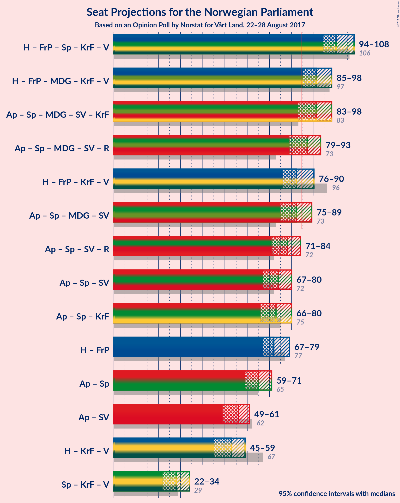

# Opinion Poll by Norstat for Vårt Land, 22–28 August 2017

<a href="#voting-intentions">Voting Intentions</a> | <a href="#seats">Seats</a> | <a href="#coalitions">Coalitions</a> | <a href="#technical-information">Technical Information</a>

## Voting Intentions

### Confidence Intervals

| Party | Last Result | Poll Result | 80% Confidence Interval | 90% Confidence Interval | 95% Confidence Interval | 99% Confidence Interval |
|:-----:|:-----------:|:-----------:|:-----------------------:|:-----------------------:|:-----------------------:|:-----------------------:|
| Arbeiderpartiet | 30.8% | 25.6% | 23.9–27.5% |23.4–28.1% |22.9–28.5% |22.1–29.5% |
| Høyre | 26.8% | 24.2% | 22.5–26.1% |22.0–26.6% |21.6–27.1% |20.8–28.0% |
| Fremskrittspartiet | 16.3% | 16.7% | 15.3–18.4% |14.8–18.9% |14.5–19.3% |13.8–20.1% |
| Senterpartiet | 5.5% | 10.3% | 9.1–11.7% |8.8–12.1% |8.5–12.4% |8.0–13.1% |
| Sosialistisk Venstreparti | 4.1% | 5.2% | 4.3–6.2% |4.1–6.5% |3.9–6.8% |3.5–7.3% |
| Miljøpartiet de Grønne | 2.8% | 5.2% | 4.3–6.2% |4.1–6.5% |3.9–6.8% |3.5–7.3% |
| Kristelig Folkeparti | 5.6% | 4.9% | 4.1–6.0% |3.9–6.3% |3.7–6.5% |3.4–7.1% |
| Rødt | 1.1% | 3.8% | 3.1–4.7% |2.9–5.0% |2.7–5.2% |2.4–5.7% |
| Venstre | 5.2% | 3.1% | 2.5–4.0% |2.3–4.2% |2.2–4.4% |1.9–4.9% |

*Note:* The poll result column reflects the actual value used in the calculations. Published results may vary slightly, and in addition be rounded to fewer digits.

## Seats

### Confidence Intervals

| Party | Last Result | Median | 80% Confidence Interval | 90% Confidence Interval | 95% Confidence Interval | 99% Confidence Interval |
|:-----:|:-----------:|:------:|:-----------------------:|:-----------------------:|:-----------------------:|:-----------------------:|
| <a href="#arbeiderpartiet">Arbeiderpartiet</a> | 55 | 49 | 44–51 |43–51 |42–51 |41–54 |
| <a href="#høyre">Høyre</a> | 48 | 44 | 38–46 |38–46 |38–47 |36–50 |
| <a href="#fremskrittspartiet">Fremskrittspartiet</a> | 29 | 29 | 28–32 |27–33 |26–33 |26–36 |
| <a href="#senterpartiet">Senterpartiet</a> | 10 | 18 | 14–20 |14–21 |14–22 |13–23 |
| <a href="#sosialistisk-venstreparti">Sosialistisk Venstreparti</a> | 7 | 8 | 7–10 |6–11 |2–12 |1–14 |
| <a href="#miljøpartiet-de-grønne">Miljøpartiet de Grønne</a> | 1 | 8 | 8–11 |7–11 |3–12 |2–13 |
| <a href="#kristelig-folkeparti">Kristelig Folkeparti</a> | 10 | 8 | 7–11 |3–11 |2–12 |2–12 |
| <a href="#rødt">Rødt</a> | 0 | 2 | 2–8 |2–9 |2–9 |1–10 |
| <a href="#venstre">Venstre</a> | 9 | 1 | 1–2 |0–7 |0–7 |0–8 |

### Arbeiderpartiet

| Number of Seats | Probability | Accumulated | Special Marks |
|:---------------:|:-----------:|:-----------:|:-------------:|
| 38 | 0.2% | 100% |  |
| 39 | 0.2% | 99.8% |  |
| 40 | 0.1% | 99.6% |  |
| 41 | 0.4% | 99.5% |  |
| 42 | 2% | 99.1% |  |
| 43 | 3% | 97% |  |
| 44 | 6% | 95% |  |
| 45 | 6% | 89% |  |
| 46 | 12% | 83% |  |
| 47 | 5% | 71% |  |
| 48 | 4% | 66% |  |
| 49 | 12% | 62% | Median |
| 50 | 21% | 50% |  |
| 51 | 27% | 29% |  |
| 52 | 0.8% | 2% |  |
| 53 | 0.2% | 1.3% |  |
| 54 | 0.7% | 1.0% |  |
| 55 | 0.2% | 0.3% | Last Result |
| 56 | 0% | 0.1% |  |
| 57 | 0% | 0% |  |

### Høyre

| Number of Seats | Probability | Accumulated | Special Marks |
|:---------------:|:-----------:|:-----------:|:-------------:|
| 35 | 0.1% | 100% |  |
| 36 | 0.7% | 99.9% |  |
| 37 | 1.5% | 99.2% |  |
| 38 | 10% | 98% |  |
| 39 | 8% | 88% |  |
| 40 | 6% | 80% |  |
| 41 | 2% | 74% |  |
| 42 | 3% | 72% |  |
| 43 | 4% | 69% |  |
| 44 | 29% | 65% | Median |
| 45 | 2% | 36% |  |
| 46 | 31% | 34% |  |
| 47 | 1.4% | 3% |  |
| 48 | 0.2% | 2% | Last Result |
| 49 | 0.7% | 2% |  |
| 50 | 0.6% | 0.8% |  |
| 51 | 0% | 0.2% |  |
| 52 | 0.2% | 0.2% |  |
| 53 | 0% | 0% |  |

### Fremskrittspartiet

| Number of Seats | Probability | Accumulated | Special Marks |
|:---------------:|:-----------:|:-----------:|:-------------:|
| 23 | 0.1% | 100% |  |
| 24 | 0.2% | 99.9% |  |
| 25 | 0.1% | 99.7% |  |
| 26 | 3% | 99.6% |  |
| 27 | 3% | 96% |  |
| 28 | 12% | 93% |  |
| 29 | 56% | 81% | Last Result, Median |
| 30 | 2% | 25% |  |
| 31 | 10% | 23% |  |
| 32 | 4% | 13% |  |
| 33 | 7% | 9% |  |
| 34 | 0.7% | 2% |  |
| 35 | 1.0% | 2% |  |
| 36 | 0.5% | 0.7% |  |
| 37 | 0% | 0.2% |  |
| 38 | 0.1% | 0.1% |  |
| 39 | 0% | 0% |  |

### Senterpartiet

| Number of Seats | Probability | Accumulated | Special Marks |
|:---------------:|:-----------:|:-----------:|:-------------:|
| 10 | 0% | 100% | Last Result |
| 11 | 0% | 100% |  |
| 12 | 0.3% | 100% |  |
| 13 | 2% | 99.7% |  |
| 14 | 19% | 98% |  |
| 15 | 4% | 79% |  |
| 16 | 8% | 75% |  |
| 17 | 16% | 66% |  |
| 18 | 30% | 51% | Median |
| 19 | 4% | 21% |  |
| 20 | 9% | 17% |  |
| 21 | 4% | 8% |  |
| 22 | 4% | 5% |  |
| 23 | 0.8% | 1.1% |  |
| 24 | 0.1% | 0.3% |  |
| 25 | 0% | 0.2% |  |
| 26 | 0.1% | 0.1% |  |
| 27 | 0% | 0% |  |

### Sosialistisk Venstreparti

| Number of Seats | Probability | Accumulated | Special Marks |
|:---------------:|:-----------:|:-----------:|:-------------:|
| 1 | 1.1% | 100% |  |
| 2 | 3% | 98.9% |  |
| 3 | 0% | 95% |  |
| 4 | 0% | 95% |  |
| 5 | 0% | 95% |  |
| 6 | 1.1% | 95% |  |
| 7 | 19% | 94% | Last Result |
| 8 | 51% | 76% | Median |
| 9 | 10% | 25% |  |
| 10 | 9% | 15% |  |
| 11 | 4% | 6% |  |
| 12 | 2% | 3% |  |
| 13 | 0.5% | 1.1% |  |
| 14 | 0.5% | 0.5% |  |
| 15 | 0% | 0% |  |

### Miljøpartiet de Grønne

| Number of Seats | Probability | Accumulated | Special Marks |
|:---------------:|:-----------:|:-----------:|:-------------:|
| 1 | 0.5% | 100% | Last Result |
| 2 | 1.1% | 99.5% |  |
| 3 | 1.5% | 98% |  |
| 4 | 0.6% | 97% |  |
| 5 | 0% | 96% |  |
| 6 | 0.2% | 96% |  |
| 7 | 2% | 96% |  |
| 8 | 48% | 94% | Median |
| 9 | 21% | 46% |  |
| 10 | 9% | 25% |  |
| 11 | 13% | 16% |  |
| 12 | 3% | 3% |  |
| 13 | 0.8% | 0.9% |  |
| 14 | 0.1% | 0.1% |  |
| 15 | 0% | 0% |  |

### Kristelig Folkeparti

| Number of Seats | Probability | Accumulated | Special Marks |
|:---------------:|:-----------:|:-----------:|:-------------:|
| 1 | 0.1% | 100% |  |
| 2 | 4% | 99.9% |  |
| 3 | 2% | 96% |  |
| 4 | 0% | 94% |  |
| 5 | 0% | 94% |  |
| 6 | 0.9% | 94% |  |
| 7 | 7% | 94% |  |
| 8 | 47% | 87% | Median |
| 9 | 15% | 39% |  |
| 10 | 14% | 24% | Last Result |
| 11 | 7% | 10% |  |
| 12 | 3% | 3% |  |
| 13 | 0.2% | 0.2% |  |
| 14 | 0% | 0% |  |

### Rødt

| Number of Seats | Probability | Accumulated | Special Marks |
|:---------------:|:-----------:|:-----------:|:-------------:|
| 0 | 0% | 100% | Last Result |
| 1 | 2% | 100% |  |
| 2 | 57% | 98% | Median |
| 3 | 0% | 41% |  |
| 4 | 0% | 41% |  |
| 5 | 0% | 41% |  |
| 6 | 18% | 41% |  |
| 7 | 12% | 23% |  |
| 8 | 6% | 11% |  |
| 9 | 4% | 5% |  |
| 10 | 1.0% | 1.2% |  |
| 11 | 0.2% | 0.2% |  |
| 12 | 0% | 0% |  |

### Venstre

| Number of Seats | Probability | Accumulated | Special Marks |
|:---------------:|:-----------:|:-----------:|:-------------:|
| 0 | 5% | 100% |  |
| 1 | 71% | 95% | Median |
| 2 | 15% | 24% |  |
| 3 | 2% | 9% |  |
| 4 | 0% | 7% |  |
| 5 | 0% | 7% |  |
| 6 | 2% | 7% |  |
| 7 | 4% | 6% |  |
| 8 | 2% | 2% |  |
| 9 | 0.3% | 0.3% | Last Result |
| 10 | 0% | 0% |  |

## Coalitions

### Confidence Intervals

| Coalition | Last Result | Median | Majority? | 80% Confidence Interval | 90% Confidence Interval | 95% Confidence Interval | 99% Confidence Interval |
|:---------:|:-----------:|:------:|:---------:|:-----------------------:|:-----------------------:|:-----------------------:|:-----------------------:|
| Høyre – Fremskrittspartiet – Senterpartiet – Kristelig Folkeparti – Venstre | 106 | 100 | 100% | 96–103 | 96–105 | 94–107 | 90–108 |
| Arbeiderpartiet – Senterpartiet – Miljøpartiet de Grønne – Sosialistisk Venstreparti – Kristelig Folkeparti | 83 | 92 | 93% | 85–95 | 83–98 | 83–99 | 81–99 |
| Høyre – Fremskrittspartiet – Miljøpartiet de Grønne – Kristelig Folkeparti – Venstre | 97 | 90 | 97% | 88–96 | 87–96 | 84–98 | 82–100 |
| Arbeiderpartiet – Senterpartiet – Miljøpartiet de Grønne – Sosialistisk Venstreparti – Rødt | 73 | 87 | 78% | 83–89 | 81–92 | 80–96 | 78–97 |
| Høyre – Fremskrittspartiet – Kristelig Folkeparti – Venstre | 96 | 82 | 22% | 80–86 | 77–88 | 73–89 | 72–91 |
| Arbeiderpartiet – Senterpartiet – Miljøpartiet de Grønne – Sosialistisk Venstreparti | 73 | 82 | 41% | 78–87 | 76–87 | 74–88 | 73–91 |
| Arbeiderpartiet – Senterpartiet – Sosialistisk Venstreparti – Rødt | 72 | 79 | 3% | 73–81 | 73–82 | 71–85 | 69–87 |
| Arbeiderpartiet – Senterpartiet – Kristelig Folkeparti | 75 | 74 | 0% | 69–78 | 68–80 | 67–80 | 64–81 |
| Arbeiderpartiet – Senterpartiet – Sosialistisk Venstreparti | 72 | 73 | 0.1% | 70–78 | 68–79 | 66–79 | 65–80 |
| Høyre – Fremskrittspartiet | 77 | 73 | 0% | 67–75 | 67–76 | 66–77 | 64–80 |
| Arbeiderpartiet – Senterpartiet | 65 | 65 | 0% | 62–69 | 60–69 | 59–70 | 58–72 |
| Arbeiderpartiet – Sosialistisk Venstreparti | 62 | 57 | 0% | 53–59 | 51–59 | 50–61 | 47–63 |
| Høyre – Kristelig Folkeparti – Venstre | 67 | 53 | 0% | 49–56 | 47–58 | 46–60 | 42–61 |
| Senterpartiet – Kristelig Folkeparti – Venstre | 29 | 27 | 0% | 23–32 | 23–33 | 21–35 | 20–37 |

### Høyre – Fremskrittspartiet – Senterpartiet – Kristelig Folkeparti – Venstre

| Number of Seats | Probability | Accumulated | Special Marks |
|:---------------:|:-----------:|:-----------:|:-------------:|
| 87 | 0.1% | 100% |  |
| 88 | 0.2% | 99.9% |  |
| 89 | 0.1% | 99.7% |  |
| 90 | 0.2% | 99.6% |  |
| 91 | 0.1% | 99.4% |  |
| 92 | 0.1% | 99.3% |  |
| 93 | 1.1% | 99.2% |  |
| 94 | 2% | 98% |  |
| 95 | 0.7% | 97% |  |
| 96 | 7% | 96% |  |
| 97 | 3% | 88% |  |
| 98 | 21% | 85% |  |
| 99 | 2% | 64% |  |
| 100 | 31% | 62% | Median |
| 101 | 4% | 32% |  |
| 102 | 15% | 28% |  |
| 103 | 6% | 13% |  |
| 104 | 1.2% | 7% |  |
| 105 | 2% | 6% |  |
| 106 | 1.2% | 4% | Last Result |
| 107 | 2% | 3% |  |
| 108 | 0.9% | 1.3% |  |
| 109 | 0.1% | 0.4% |  |
| 110 | 0.1% | 0.3% |  |
| 111 | 0.1% | 0.2% |  |
| 112 | 0% | 0.1% |  |
| 113 | 0% | 0% |  |

### Arbeiderpartiet – Senterpartiet – Miljøpartiet de Grønne – Sosialistisk Venstreparti – Kristelig Folkeparti

| Number of Seats | Probability | Accumulated | Special Marks |
|:---------------:|:-----------:|:-----------:|:-------------:|
| 79 | 0.1% | 100% |  |
| 80 | 0% | 99.8% |  |
| 81 | 1.1% | 99.8% |  |
| 82 | 1.0% | 98.7% |  |
| 83 | 4% | 98% | Last Result |
| 84 | 1.0% | 94% |  |
| 85 | 3% | 93% | Majority |
| 86 | 2% | 90% |  |
| 87 | 18% | 88% |  |
| 88 | 1.1% | 69% |  |
| 89 | 4% | 68% |  |
| 90 | 2% | 65% |  |
| 91 | 11% | 62% | Median |
| 92 | 9% | 51% |  |
| 93 | 27% | 42% |  |
| 94 | 4% | 15% |  |
| 95 | 2% | 11% |  |
| 96 | 1.2% | 9% |  |
| 97 | 0.3% | 8% |  |
| 98 | 5% | 8% |  |
| 99 | 3% | 3% |  |
| 100 | 0% | 0.1% |  |
| 101 | 0% | 0.1% |  |
| 102 | 0% | 0% |  |

### Høyre – Fremskrittspartiet – Miljøpartiet de Grønne – Kristelig Folkeparti – Venstre

| Number of Seats | Probability | Accumulated | Special Marks |
|:---------------:|:-----------:|:-----------:|:-------------:|
| 80 | 0.4% | 100% |  |
| 81 | 0% | 99.6% |  |
| 82 | 1.5% | 99.6% |  |
| 83 | 0.6% | 98% |  |
| 84 | 0.6% | 98% |  |
| 85 | 1.1% | 97% | Majority |
| 86 | 0.8% | 96% |  |
| 87 | 2% | 95% |  |
| 88 | 4% | 93% |  |
| 89 | 10% | 90% |  |
| 90 | 31% | 79% | Median |
| 91 | 4% | 48% |  |
| 92 | 18% | 45% |  |
| 93 | 4% | 27% |  |
| 94 | 4% | 23% |  |
| 95 | 3% | 19% |  |
| 96 | 11% | 15% |  |
| 97 | 1.3% | 4% | Last Result |
| 98 | 2% | 3% |  |
| 99 | 0.3% | 0.8% |  |
| 100 | 0.2% | 0.5% |  |
| 101 | 0.2% | 0.3% |  |
| 102 | 0.1% | 0.1% |  |
| 103 | 0% | 0% |  |

### Arbeiderpartiet – Senterpartiet – Miljøpartiet de Grønne – Sosialistisk Venstreparti – Rødt

| Number of Seats | Probability | Accumulated | Special Marks |
|:---------------:|:-----------:|:-----------:|:-------------:|
| 73 | 0% | 100% | Last Result |
| 74 | 0% | 100% |  |
| 75 | 0.1% | 100% |  |
| 76 | 0% | 99.9% |  |
| 77 | 0.3% | 99.9% |  |
| 78 | 0.1% | 99.6% |  |
| 79 | 0.5% | 99.5% |  |
| 80 | 3% | 99.0% |  |
| 81 | 1.3% | 96% |  |
| 82 | 0.7% | 95% |  |
| 83 | 5% | 94% |  |
| 84 | 12% | 89% |  |
| 85 | 20% | 78% | Median, Majority |
| 86 | 5% | 58% |  |
| 87 | 29% | 53% |  |
| 88 | 3% | 24% |  |
| 89 | 14% | 22% |  |
| 90 | 2% | 7% |  |
| 91 | 0.4% | 6% |  |
| 92 | 0.7% | 5% |  |
| 93 | 1.2% | 4% |  |
| 94 | 0.7% | 3% |  |
| 95 | 0.1% | 3% |  |
| 96 | 2% | 3% |  |
| 97 | 0.3% | 0.6% |  |
| 98 | 0% | 0.3% |  |
| 99 | 0.1% | 0.3% |  |
| 100 | 0.2% | 0.2% |  |
| 101 | 0% | 0% |  |

### Høyre – Fremskrittspartiet – Kristelig Folkeparti – Venstre

| Number of Seats | Probability | Accumulated | Special Marks |
|:---------------:|:-----------:|:-----------:|:-------------:|
| 69 | 0.2% | 100% |  |
| 70 | 0.1% | 99.8% |  |
| 71 | 0% | 99.7% |  |
| 72 | 0.3% | 99.7% |  |
| 73 | 2% | 99.4% |  |
| 74 | 0.1% | 97% |  |
| 75 | 0.7% | 97% |  |
| 76 | 1.2% | 97% |  |
| 77 | 0.7% | 96% |  |
| 78 | 0.4% | 95% |  |
| 79 | 2% | 94% |  |
| 80 | 14% | 93% |  |
| 81 | 3% | 78% |  |
| 82 | 29% | 76% | Median |
| 83 | 5% | 47% |  |
| 84 | 20% | 42% |  |
| 85 | 12% | 22% | Majority |
| 86 | 5% | 11% |  |
| 87 | 0.7% | 6% |  |
| 88 | 1.3% | 5% |  |
| 89 | 3% | 4% |  |
| 90 | 0.5% | 1.0% |  |
| 91 | 0.1% | 0.5% |  |
| 92 | 0.3% | 0.4% |  |
| 93 | 0% | 0.1% |  |
| 94 | 0.1% | 0.1% |  |
| 95 | 0% | 0% |  |
| 96 | 0% | 0% | Last Result |

### Arbeiderpartiet – Senterpartiet – Miljøpartiet de Grønne – Sosialistisk Venstreparti

| Number of Seats | Probability | Accumulated | Special Marks |
|:---------------:|:-----------:|:-----------:|:-------------:|
| 71 | 0% | 100% |  |
| 72 | 0.1% | 99.9% |  |
| 73 | 0.9% | 99.8% | Last Result |
| 74 | 2% | 98.9% |  |
| 75 | 1.3% | 97% |  |
| 76 | 3% | 96% |  |
| 77 | 1.4% | 93% |  |
| 78 | 3% | 92% |  |
| 79 | 19% | 88% |  |
| 80 | 2% | 69% |  |
| 81 | 3% | 68% |  |
| 82 | 17% | 65% |  |
| 83 | 1.5% | 48% | Median |
| 84 | 6% | 46% |  |
| 85 | 28% | 41% | Majority |
| 86 | 0.2% | 13% |  |
| 87 | 8% | 12% |  |
| 88 | 3% | 4% |  |
| 89 | 0.7% | 2% |  |
| 90 | 0.4% | 1.0% |  |
| 91 | 0.2% | 0.6% |  |
| 92 | 0% | 0.3% |  |
| 93 | 0.1% | 0.3% |  |
| 94 | 0% | 0.2% |  |
| 95 | 0.2% | 0.2% |  |
| 96 | 0% | 0% |  |

### Arbeiderpartiet – Senterpartiet – Sosialistisk Venstreparti – Rødt

| Number of Seats | Probability | Accumulated | Special Marks |
|:---------------:|:-----------:|:-----------:|:-------------:|
| 67 | 0.1% | 100% |  |
| 68 | 0.2% | 99.9% |  |
| 69 | 0.2% | 99.7% |  |
| 70 | 0.3% | 99.5% |  |
| 71 | 2% | 99.2% |  |
| 72 | 1.3% | 97% | Last Result |
| 73 | 11% | 96% |  |
| 74 | 3% | 85% |  |
| 75 | 4% | 81% |  |
| 76 | 4% | 77% |  |
| 77 | 18% | 73% | Median |
| 78 | 4% | 55% |  |
| 79 | 31% | 52% |  |
| 80 | 10% | 21% |  |
| 81 | 4% | 10% |  |
| 82 | 2% | 7% |  |
| 83 | 0.8% | 5% |  |
| 84 | 1.1% | 4% |  |
| 85 | 0.6% | 3% | Majority |
| 86 | 0.6% | 2% |  |
| 87 | 1.5% | 2% |  |
| 88 | 0% | 0.4% |  |
| 89 | 0.4% | 0.4% |  |
| 90 | 0% | 0% |  |

### Arbeiderpartiet – Senterpartiet – Kristelig Folkeparti

| Number of Seats | Probability | Accumulated | Special Marks |
|:---------------:|:-----------:|:-----------:|:-------------:|
| 63 | 0.1% | 100% |  |
| 64 | 0.5% | 99.9% |  |
| 65 | 1.4% | 99.4% |  |
| 66 | 0.4% | 98% |  |
| 67 | 2% | 98% |  |
| 68 | 4% | 96% |  |
| 69 | 3% | 92% |  |
| 70 | 3% | 89% |  |
| 71 | 1.1% | 85% |  |
| 72 | 30% | 84% |  |
| 73 | 3% | 54% |  |
| 74 | 5% | 52% |  |
| 75 | 7% | 47% | Last Result, Median |
| 76 | 3% | 40% |  |
| 77 | 27% | 37% |  |
| 78 | 2% | 11% |  |
| 79 | 1.3% | 9% |  |
| 80 | 6% | 8% |  |
| 81 | 2% | 2% |  |
| 82 | 0% | 0.1% |  |
| 83 | 0% | 0.1% |  |
| 84 | 0% | 0% |  |

### Arbeiderpartiet – Senterpartiet – Sosialistisk Venstreparti

| Number of Seats | Probability | Accumulated | Special Marks |
|:---------------:|:-----------:|:-----------:|:-------------:|
| 64 | 0.3% | 100% |  |
| 65 | 0.9% | 99.6% |  |
| 66 | 2% | 98.8% |  |
| 67 | 1.4% | 97% |  |
| 68 | 2% | 95% |  |
| 69 | 3% | 93% |  |
| 70 | 4% | 90% |  |
| 71 | 27% | 86% |  |
| 72 | 3% | 59% | Last Result |
| 73 | 7% | 56% |  |
| 74 | 6% | 49% |  |
| 75 | 1.5% | 43% | Median |
| 76 | 3% | 41% |  |
| 77 | 28% | 38% |  |
| 78 | 5% | 10% |  |
| 79 | 3% | 6% |  |
| 80 | 2% | 2% |  |
| 81 | 0.1% | 0.5% |  |
| 82 | 0.1% | 0.4% |  |
| 83 | 0% | 0.3% |  |
| 84 | 0.2% | 0.3% |  |
| 85 | 0% | 0.1% | Majority |
| 86 | 0.1% | 0.1% |  |
| 87 | 0% | 0% |  |

### Høyre – Fremskrittspartiet

| Number of Seats | Probability | Accumulated | Special Marks |
|:---------------:|:-----------:|:-----------:|:-------------:|
| 63 | 0.1% | 100% |  |
| 64 | 1.4% | 99.9% |  |
| 65 | 0.8% | 98% |  |
| 66 | 0.9% | 98% |  |
| 67 | 7% | 97% |  |
| 68 | 3% | 90% |  |
| 69 | 8% | 87% |  |
| 70 | 2% | 79% |  |
| 71 | 2% | 77% |  |
| 72 | 5% | 76% |  |
| 73 | 29% | 70% | Median |
| 74 | 4% | 42% |  |
| 75 | 31% | 38% |  |
| 76 | 4% | 7% |  |
| 77 | 2% | 3% | Last Result |
| 78 | 0.2% | 2% |  |
| 79 | 0.8% | 2% |  |
| 80 | 0.4% | 0.7% |  |
| 81 | 0.2% | 0.3% |  |
| 82 | 0% | 0.1% |  |
| 83 | 0% | 0.1% |  |
| 84 | 0% | 0.1% |  |
| 85 | 0% | 0% | Majority |

### Arbeiderpartiet – Senterpartiet

| Number of Seats | Probability | Accumulated | Special Marks |
|:---------------:|:-----------:|:-----------:|:-------------:|
| 57 | 0.2% | 100% |  |
| 58 | 1.3% | 99.8% |  |
| 59 | 3% | 98.5% |  |
| 60 | 0.5% | 95% |  |
| 61 | 4% | 95% |  |
| 62 | 4% | 90% |  |
| 63 | 12% | 86% |  |
| 64 | 21% | 75% |  |
| 65 | 10% | 54% | Last Result |
| 66 | 2% | 44% |  |
| 67 | 1.4% | 42% | Median |
| 68 | 2% | 40% |  |
| 69 | 35% | 38% |  |
| 70 | 0.7% | 3% |  |
| 71 | 1.0% | 2% |  |
| 72 | 0.7% | 1.0% |  |
| 73 | 0.1% | 0.4% |  |
| 74 | 0% | 0.2% |  |
| 75 | 0.1% | 0.2% |  |
| 76 | 0.1% | 0.1% |  |
| 77 | 0% | 0% |  |

### Arbeiderpartiet – Sosialistisk Venstreparti

| Number of Seats | Probability | Accumulated | Special Marks |
|:---------------:|:-----------:|:-----------:|:-------------:|
| 45 | 0.1% | 100% |  |
| 46 | 0.1% | 99.9% |  |
| 47 | 0.8% | 99.8% |  |
| 48 | 0.1% | 99.0% |  |
| 49 | 1.4% | 98.9% |  |
| 50 | 2% | 98% |  |
| 51 | 3% | 96% |  |
| 52 | 2% | 93% |  |
| 53 | 5% | 91% |  |
| 54 | 15% | 85% |  |
| 55 | 5% | 71% |  |
| 56 | 2% | 66% |  |
| 57 | 23% | 64% | Median |
| 58 | 8% | 41% |  |
| 59 | 29% | 33% |  |
| 60 | 1.0% | 4% |  |
| 61 | 1.3% | 3% |  |
| 62 | 0.3% | 2% | Last Result |
| 63 | 1.3% | 2% |  |
| 64 | 0.2% | 0.3% |  |
| 65 | 0% | 0.1% |  |
| 66 | 0.1% | 0.1% |  |
| 67 | 0% | 0% |  |

### Høyre – Kristelig Folkeparti – Venstre

| Number of Seats | Probability | Accumulated | Special Marks |
|:---------------:|:-----------:|:-----------:|:-------------:|
| 41 | 0.3% | 100% |  |
| 42 | 0.2% | 99.7% |  |
| 43 | 0.1% | 99.5% |  |
| 44 | 1.0% | 99.4% |  |
| 45 | 0.6% | 98% |  |
| 46 | 0.6% | 98% |  |
| 47 | 3% | 97% |  |
| 48 | 0.6% | 94% |  |
| 49 | 7% | 94% |  |
| 50 | 6% | 87% |  |
| 51 | 5% | 81% |  |
| 52 | 6% | 76% |  |
| 53 | 30% | 70% | Median |
| 54 | 3% | 41% |  |
| 55 | 18% | 37% |  |
| 56 | 11% | 19% |  |
| 57 | 0.7% | 8% |  |
| 58 | 3% | 7% |  |
| 59 | 0.3% | 4% |  |
| 60 | 2% | 4% |  |
| 61 | 1.1% | 1.4% |  |
| 62 | 0.1% | 0.3% |  |
| 63 | 0.2% | 0.2% |  |
| 64 | 0% | 0% |  |
| 65 | 0% | 0% |  |
| 66 | 0% | 0% |  |
| 67 | 0% | 0% | Last Result |

### Senterpartiet – Kristelig Folkeparti – Venstre

| Number of Seats | Probability | Accumulated | Special Marks |
|:---------------:|:-----------:|:-----------:|:-------------:|
| 17 | 0.1% | 100% |  |
| 18 | 0% | 99.9% |  |
| 19 | 0.1% | 99.9% |  |
| 20 | 2% | 99.8% |  |
| 21 | 1.1% | 98% |  |
| 22 | 1.0% | 97% |  |
| 23 | 17% | 96% |  |
| 24 | 1.2% | 79% |  |
| 25 | 2% | 78% |  |
| 26 | 3% | 76% |  |
| 27 | 45% | 73% | Median |
| 28 | 4% | 29% |  |
| 29 | 5% | 24% | Last Result |
| 30 | 4% | 19% |  |
| 31 | 5% | 15% |  |
| 32 | 1.3% | 11% |  |
| 33 | 6% | 9% |  |
| 34 | 0.2% | 3% |  |
| 35 | 2% | 3% |  |
| 36 | 0.2% | 0.8% |  |
| 37 | 0.4% | 0.6% |  |
| 38 | 0% | 0.2% |  |
| 39 | 0.2% | 0.2% |  |
| 40 | 0% | 0% |  |

## Technical Information

### Opinion Poll

+ **Pollster:** Norstat
+ **Media:** Vårt Land
+ **Fieldwork period:** 22–28 August 2017

### Calculations

+ **Sample size:** 932
+ **Simulations done:** 131,072
+ **Error estimate:** 1.95%

