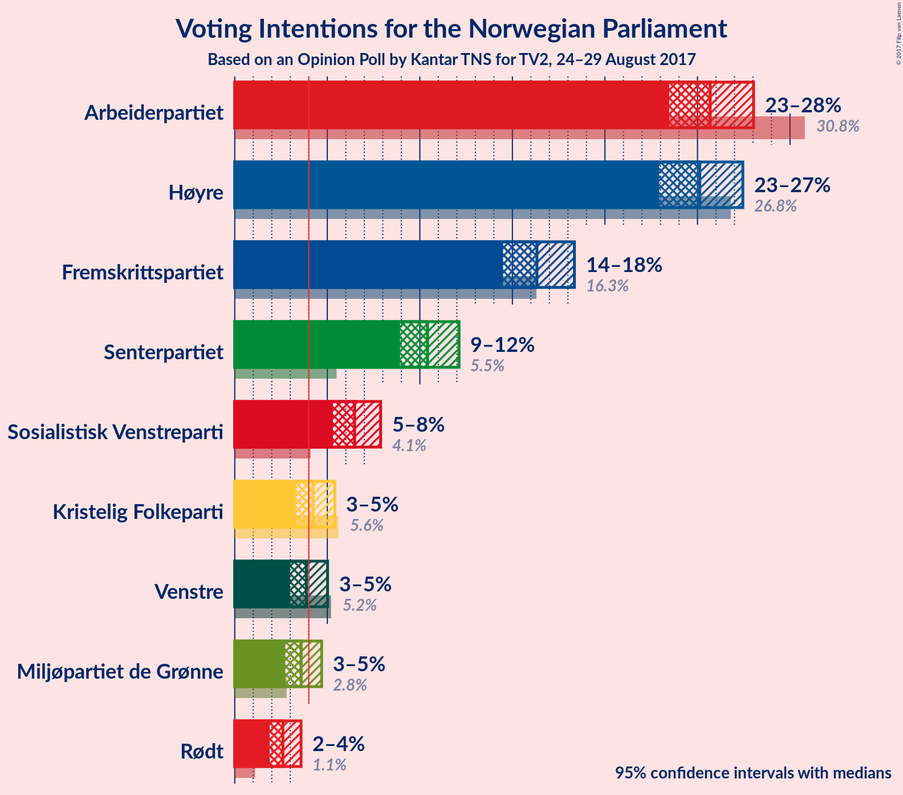
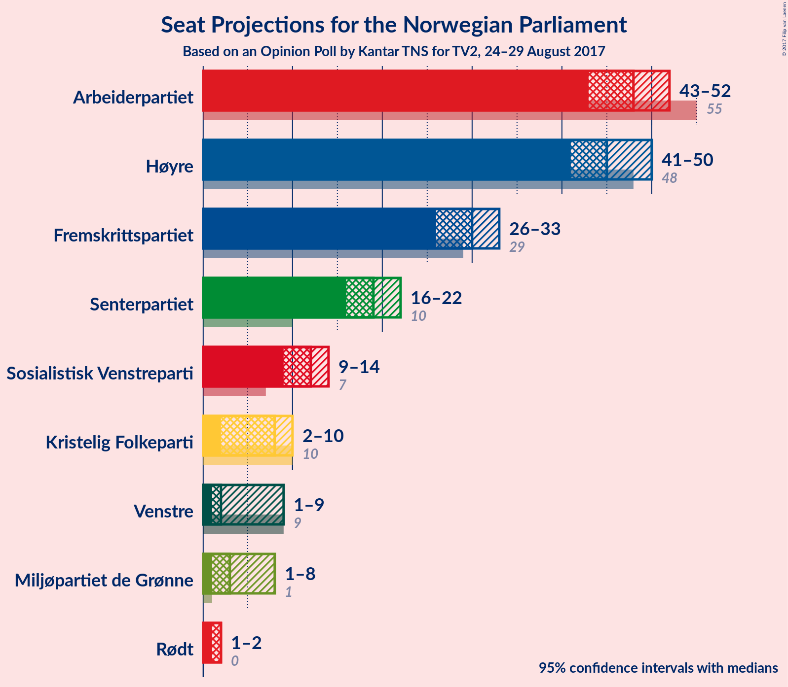
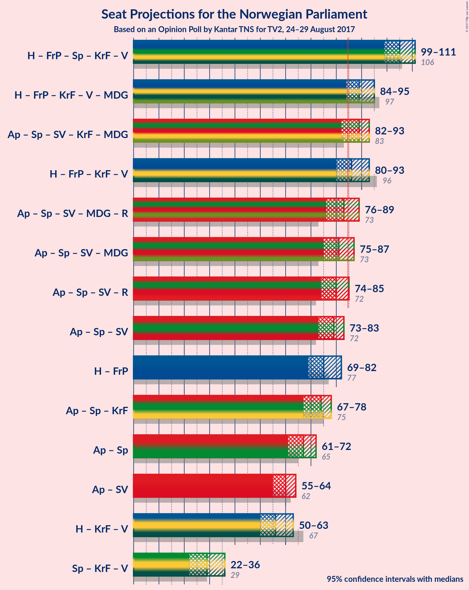

# Opinion Poll by Kantar TNS for TV2, 24–29 August 2017

<a href="#voting-intentions">Voting Intentions</a> | <a href="#seats">Seats</a> | <a href="#coalitions">Coalitions</a> | <a href="#technical-information">Technical Information</a>

## Voting Intentions

### Confidence Intervals

| Party | Last Result | Poll Result | 80% Confidence Interval | 90% Confidence Interval | 95% Confidence Interval | 99% Confidence Interval |
|:-----:|:-----------:|:-----------:|:-----------------------:|:-----------------------:|:-----------------------:|:-----------------------:|
| Arbeiderpartiet | 30.8% | 25.7% | 24.2–27.2% |23.8–27.6% |23.5–28.0% |22.8–28.8% |
| Høyre | 26.8% | 25.1% | 23.7–26.6% |23.3–27.1% |22.9–27.5% |22.3–28.2% |
| Fremskrittspartiet | 16.3% | 16.3% | 15.1–17.6% |14.8–18.0% |14.5–18.4% |13.9–19.0% |
| Senterpartiet | 5.5% | 10.4% | 9.4–11.5% |9.2–11.8% |8.9–12.1% |8.5–12.7% |
| Sosialistisk Venstreparti | 4.1% | 6.5% | 5.7–7.4% |5.5–7.7% |5.3–7.9% |5.0–8.3% |
| Kristelig Folkeparti | 5.6% | 4.2% | 3.6–5.0% |3.4–5.2% |3.3–5.4% |3.0–5.8% |
| Venstre | 5.2% | 3.9% | 3.3–4.6% |3.1–4.8% |3.0–5.0% |2.7–5.4% |
| Miljøpartiet de Grønne | 2.8% | 3.6% | 3.0–4.3% |2.9–4.5% |2.7–4.7% |2.5–5.1% |
| Rødt | 1.1% | 2.6% | 2.1–3.2% |2.0–3.4% |1.9–3.6% |1.7–3.9% |

*Note:* The poll result column reflects the actual value used in the calculations. Published results may vary slightly, and in addition be rounded to fewer digits.

## Seats

### Confidence Intervals

| Party | Last Result | Median | 80% Confidence Interval | 90% Confidence Interval | 95% Confidence Interval | 99% Confidence Interval |
|:-----:|:-----------:|:------:|:-----------------------:|:-----------------------:|:-----------------------:|:-----------------------:|
| <a href="#arbeiderpartiet">Arbeiderpartiet</a> | 55 | 48 | 45–50 |44–51 |43–52 |42–53 |
| <a href="#høyre">Høyre</a> | 48 | 46 | 42–49 |41–49 |41–50 |39–52 |
| <a href="#fremskrittspartiet">Fremskrittspartiet</a> | 29 | 30 | 28–32 |27–33 |26–34 |25–35 |
| <a href="#senterpartiet">Senterpartiet</a> | 10 | 19 | 17–21 |16–22 |16–22 |15–23 |
| <a href="#sosialistisk-venstreparti">Sosialistisk Venstreparti</a> | 7 | 12 | 10–13 |10–14 |9–14 |9–15 |
| <a href="#kristelig-folkeparti">Kristelig Folkeparti</a> | 10 | 8 | 2–9 |2–9 |2–10 |1–10 |
| <a href="#venstre">Venstre</a> | 9 | 3 | 1–8 |1–8 |1–9 |1–10 |
| <a href="#miljøpartiet-de-grønne">Miljøpartiet de Grønne</a> | 1 | 2 | 1–8 |1–8 |1–8 |1–9 |
| <a href="#rødt">Rødt</a> | 0 | 2 | 1–2 |1–2 |1–2 |1–2 |

### Arbeiderpartiet

*For a full overview of the results for this party, see the [Arbeiderpartiet](party-arbeiderpartiet.html) page.*

| Number of Seats | Probability | Accumulated | Special Marks |
|:---------------:|:-----------:|:-----------:|:-------------:|
| 40 | 0.1% | 100% |  |
| 41 | 0.3% | 99.9% |  |
| 42 | 0.7% | 99.6% |  |
| 43 | 2% | 98.9% |  |
| 44 | 5% | 96% |  |
| 45 | 14% | 91% |  |
| 46 | 16% | 77% |  |
| 47 | 10% | 61% |  |
| 48 | 22% | 51% | Median |
| 49 | 11% | 29% |  |
| 50 | 9% | 18% |  |
| 51 | 6% | 10% |  |
| 52 | 2% | 4% |  |
| 53 | 1.0% | 2% |  |
| 54 | 0.4% | 0.5% |  |
| 55 | 0.1% | 0.1% | Last Result |
| 56 | 0% | 0% |  |

### Høyre

*For a full overview of the results for this party, see the [Høyre](party-hyre.html) page.*

| Number of Seats | Probability | Accumulated | Special Marks |
|:---------------:|:-----------:|:-----------:|:-------------:|
| 38 | 0.2% | 100% |  |
| 39 | 0.5% | 99.8% |  |
| 40 | 2% | 99.4% |  |
| 41 | 3% | 98% |  |
| 42 | 6% | 94% |  |
| 43 | 7% | 89% |  |
| 44 | 9% | 82% |  |
| 45 | 22% | 73% |  |
| 46 | 18% | 51% | Median |
| 47 | 11% | 33% |  |
| 48 | 9% | 22% | Last Result |
| 49 | 9% | 13% |  |
| 50 | 2% | 5% |  |
| 51 | 1.2% | 2% |  |
| 52 | 0.9% | 1.2% |  |
| 53 | 0.2% | 0.3% |  |
| 54 | 0% | 0.1% |  |
| 55 | 0% | 0.1% |  |
| 56 | 0% | 0% |  |

### Fremskrittspartiet

*For a full overview of the results for this party, see the [Fremskrittspartiet](party-fremskrittspartiet.html) page.*

| Number of Seats | Probability | Accumulated | Special Marks |
|:---------------:|:-----------:|:-----------:|:-------------:|
| 23 | 0.1% | 100% |  |
| 24 | 0.2% | 99.9% |  |
| 25 | 0.8% | 99.8% |  |
| 26 | 2% | 98.9% |  |
| 27 | 7% | 97% |  |
| 28 | 11% | 91% |  |
| 29 | 18% | 80% | Last Result |
| 30 | 29% | 62% | Median |
| 31 | 13% | 33% |  |
| 32 | 13% | 21% |  |
| 33 | 3% | 7% |  |
| 34 | 2% | 4% |  |
| 35 | 1.3% | 2% |  |
| 36 | 0.3% | 0.3% |  |
| 37 | 0.1% | 0.1% |  |
| 38 | 0% | 0% |  |

### Senterpartiet

*For a full overview of the results for this party, see the [Senterpartiet](party-senterpartiet.html) page.*

| Number of Seats | Probability | Accumulated | Special Marks |
|:---------------:|:-----------:|:-----------:|:-------------:|
| 10 | 0% | 100% | Last Result |
| 11 | 0% | 100% |  |
| 12 | 0% | 100% |  |
| 13 | 0% | 100% |  |
| 14 | 0.2% | 100% |  |
| 15 | 1.2% | 99.8% |  |
| 16 | 4% | 98.5% |  |
| 17 | 13% | 95% |  |
| 18 | 20% | 81% |  |
| 19 | 28% | 61% | Median |
| 20 | 17% | 33% |  |
| 21 | 7% | 16% |  |
| 22 | 7% | 8% |  |
| 23 | 1.2% | 2% |  |
| 24 | 0.3% | 0.4% |  |
| 25 | 0.1% | 0.1% |  |
| 26 | 0% | 0% |  |

### Sosialistisk Venstreparti

*For a full overview of the results for this party, see the [Sosialistisk Venstreparti](party-sosialistiskvenstreparti.html) page.*

| Number of Seats | Probability | Accumulated | Special Marks |
|:---------------:|:-----------:|:-----------:|:-------------:|
| 7 | 0% | 100% | Last Result |
| 8 | 0.1% | 100% |  |
| 9 | 3% | 99.8% |  |
| 10 | 10% | 97% |  |
| 11 | 22% | 87% |  |
| 12 | 38% | 65% | Median |
| 13 | 17% | 27% |  |
| 14 | 7% | 10% |  |
| 15 | 2% | 2% |  |
| 16 | 0.3% | 0.4% |  |
| 17 | 0% | 0% |  |

### Kristelig Folkeparti

*For a full overview of the results for this party, see the [Kristelig Folkeparti](party-kristeligfolkeparti.html) page.*

| Number of Seats | Probability | Accumulated | Special Marks |
|:---------------:|:-----------:|:-----------:|:-------------:|
| 1 | 0.7% | 100% |  |
| 2 | 16% | 99.3% |  |
| 3 | 14% | 83% |  |
| 4 | 0% | 70% |  |
| 5 | 0% | 69% |  |
| 6 | 0% | 69% |  |
| 7 | 11% | 69% |  |
| 8 | 38% | 59% | Median |
| 9 | 17% | 20% |  |
| 10 | 3% | 3% | Last Result |
| 11 | 0.3% | 0.3% |  |
| 12 | 0% | 0% |  |

### Venstre

*For a full overview of the results for this party, see the [Venstre](party-venstre.html) page.*

| Number of Seats | Probability | Accumulated | Special Marks |
|:---------------:|:-----------:|:-----------:|:-------------:|
| 1 | 11% | 100% |  |
| 2 | 35% | 89% |  |
| 3 | 18% | 54% | Median |
| 4 | 0% | 37% |  |
| 5 | 0% | 37% |  |
| 6 | 0% | 37% |  |
| 7 | 12% | 37% |  |
| 8 | 20% | 24% |  |
| 9 | 4% | 5% | Last Result |
| 10 | 0.6% | 0.7% |  |
| 11 | 0% | 0% |  |

### Miljøpartiet de Grønne

*For a full overview of the results for this party, see the [Miljøpartiet de Grønne](party-miljpartietdegrnne.html) page.*

| Number of Seats | Probability | Accumulated | Special Marks |
|:---------------:|:-----------:|:-----------:|:-------------:|
| 1 | 41% | 100% | Last Result |
| 2 | 13% | 59% | Median |
| 3 | 25% | 47% |  |
| 4 | 2% | 21% |  |
| 5 | 0% | 19% |  |
| 6 | 0% | 19% |  |
| 7 | 9% | 19% |  |
| 8 | 9% | 11% |  |
| 9 | 2% | 2% |  |
| 10 | 0.1% | 0.1% |  |
| 11 | 0% | 0% |  |

### Rødt

*For a full overview of the results for this party, see the [Rødt](party-rdt.html) page.*

| Number of Seats | Probability | Accumulated | Special Marks |
|:---------------:|:-----------:|:-----------:|:-------------:|
| 0 | 0% | 100% | Last Result |
| 1 | 44% | 100% |  |
| 2 | 55% | 56% | Median |
| 3 | 0% | 0.3% |  |
| 4 | 0% | 0.3% |  |
| 5 | 0% | 0.3% |  |
| 6 | 0% | 0.3% |  |
| 7 | 0.2% | 0.3% |  |
| 8 | 0.1% | 0.1% |  |
| 9 | 0% | 0% |  |

## Coalitions

### Confidence Intervals

| Coalition | Last Result | Median | Majority? | 80% Confidence Interval | 90% Confidence Interval | 95% Confidence Interval | 99% Confidence Interval |
|:---------:|:-----------:|:------:|:---------:|:-----------------------:|:-----------------------:|:-----------------------:|:-----------------------:|
| Høyre – Fremskrittspartiet – Senterpartiet – Kristelig Folkeparti – Venstre | 106 | 105 | 100% | 101–109 | 100–110 | 99–111 | 97–112 |
| Høyre – Fremskrittspartiet – Kristelig Folkeparti – Venstre – Miljøpartiet de Grønne | 97 | 89 | 94% | 85–93 | 84–94 | 83–95 | 81–97 |
| Arbeiderpartiet – Senterpartiet – Sosialistisk Venstreparti – Kristelig Folkeparti – Miljøpartiet de Grønne | 83 | 88 | 81% | 83–92 | 82–93 | 81–94 | 79–96 |
| Høyre – Fremskrittspartiet – Kristelig Folkeparti – Venstre | 96 | 86 | 73% | 82–91 | 81–92 | 80–93 | 78–94 |
| Arbeiderpartiet – Senterpartiet – Sosialistisk Venstreparti – Miljøpartiet de Grønne – Rødt | 73 | 83 | 27% | 78–87 | 77–88 | 76–89 | 75–91 |
| Arbeiderpartiet – Senterpartiet – Sosialistisk Venstreparti – Miljøpartiet de Grønne | 73 | 81 | 19% | 77–85 | 76–86 | 75–88 | 74–90 |
| Arbeiderpartiet – Senterpartiet – Sosialistisk Venstreparti – Rødt | 72 | 80 | 6% | 76–84 | 75–85 | 74–86 | 72–88 |
| Arbeiderpartiet – Senterpartiet – Sosialistisk Venstreparti | 72 | 78 | 3% | 74–82 | 74–84 | 73–85 | 71–87 |
| Høyre – Fremskrittspartiet | 77 | 76 | 0.6% | 71–79 | 70–81 | 69–82 | 67–85 |
| Arbeiderpartiet – Senterpartiet – Kristelig Folkeparti | 75 | 73 | 0% | 69–76 | 67–78 | 66–78 | 64–80 |
| Arbeiderpartiet – Senterpartiet | 65 | 66 | 0% | 63–70 | 62–71 | 61–73 | 60–73 |
| Arbeiderpartiet – Sosialistisk Venstreparti | 62 | 59 | 0% | 56–63 | 55–64 | 55–64 | 53–66 |
| Høyre – Kristelig Folkeparti – Venstre | 67 | 56 | 0% | 52–61 | 51–62 | 50–63 | 48–65 |
| Senterpartiet – Kristelig Folkeparti – Venstre | 29 | 29 | 0% | 25–34 | 23–35 | 22–36 | 21–38 |

### Høyre – Fremskrittspartiet – Senterpartiet – Kristelig Folkeparti – Venstre

| Number of Seats | Probability | Accumulated | Special Marks |
|:---------------:|:-----------:|:-----------:|:-------------:|
| 95 | 0.1% | 100% |  |
| 96 | 0.2% | 99.9% |  |
| 97 | 0.6% | 99.7% |  |
| 98 | 0.8% | 99.1% |  |
| 99 | 3% | 98% |  |
| 100 | 3% | 96% |  |
| 101 | 4% | 93% |  |
| 102 | 10% | 90% |  |
| 103 | 7% | 80% |  |
| 104 | 19% | 72% |  |
| 105 | 9% | 53% |  |
| 106 | 8% | 44% | Last Result, Median |
| 107 | 10% | 36% |  |
| 108 | 11% | 26% |  |
| 109 | 5% | 15% |  |
| 110 | 6% | 10% |  |
| 111 | 2% | 4% |  |
| 112 | 1.4% | 2% |  |
| 113 | 0.3% | 0.4% |  |
| 114 | 0% | 0.1% |  |
| 115 | 0% | 0% |  |

### Høyre – Fremskrittspartiet – Kristelig Folkeparti – Venstre – Miljøpartiet de Grønne

| Number of Seats | Probability | Accumulated | Special Marks |
|:---------------:|:-----------:|:-----------:|:-------------:|
| 79 | 0.1% | 100% |  |
| 80 | 0.4% | 99.9% |  |
| 81 | 0.3% | 99.5% |  |
| 82 | 0.6% | 99.2% |  |
| 83 | 3% | 98.6% |  |
| 84 | 2% | 96% |  |
| 85 | 8% | 94% | Majority |
| 86 | 4% | 86% |  |
| 87 | 8% | 82% |  |
| 88 | 17% | 74% |  |
| 89 | 12% | 57% | Median |
| 90 | 9% | 45% |  |
| 91 | 11% | 37% |  |
| 92 | 9% | 25% |  |
| 93 | 8% | 16% |  |
| 94 | 5% | 8% |  |
| 95 | 2% | 3% |  |
| 96 | 0.5% | 1.3% |  |
| 97 | 0.5% | 0.7% | Last Result |
| 98 | 0.2% | 0.3% |  |
| 99 | 0% | 0% |  |

### Arbeiderpartiet – Senterpartiet – Sosialistisk Venstreparti – Kristelig Folkeparti – Miljøpartiet de Grønne

| Number of Seats | Probability | Accumulated | Special Marks |
|:---------------:|:-----------:|:-----------:|:-------------:|
| 77 | 0.1% | 100% |  |
| 78 | 0.1% | 99.9% |  |
| 79 | 0.3% | 99.8% |  |
| 80 | 1.2% | 99.5% |  |
| 81 | 0.9% | 98% |  |
| 82 | 3% | 97% |  |
| 83 | 6% | 94% | Last Result |
| 84 | 8% | 88% |  |
| 85 | 8% | 81% | Majority |
| 86 | 7% | 73% |  |
| 87 | 9% | 66% |  |
| 88 | 17% | 57% |  |
| 89 | 8% | 40% | Median |
| 90 | 17% | 32% |  |
| 91 | 4% | 14% |  |
| 92 | 5% | 10% |  |
| 93 | 3% | 6% |  |
| 94 | 2% | 3% |  |
| 95 | 0.9% | 1.5% |  |
| 96 | 0.3% | 0.5% |  |
| 97 | 0.1% | 0.2% |  |
| 98 | 0.1% | 0.1% |  |
| 99 | 0% | 0% |  |

### Høyre – Fremskrittspartiet – Kristelig Folkeparti – Venstre

| Number of Seats | Probability | Accumulated | Special Marks |
|:---------------:|:-----------:|:-----------:|:-------------:|
| 76 | 0.1% | 100% |  |
| 77 | 0.2% | 99.9% |  |
| 78 | 1.0% | 99.7% |  |
| 79 | 0.8% | 98.7% |  |
| 80 | 1.2% | 98% |  |
| 81 | 3% | 97% |  |
| 82 | 10% | 94% |  |
| 83 | 5% | 83% |  |
| 84 | 5% | 79% |  |
| 85 | 16% | 73% | Majority |
| 86 | 14% | 57% |  |
| 87 | 9% | 43% | Median |
| 88 | 8% | 34% |  |
| 89 | 8% | 26% |  |
| 90 | 6% | 18% |  |
| 91 | 5% | 12% |  |
| 92 | 4% | 7% |  |
| 93 | 3% | 3% |  |
| 94 | 0.3% | 0.5% |  |
| 95 | 0.1% | 0.2% |  |
| 96 | 0% | 0% | Last Result |

### Arbeiderpartiet – Senterpartiet – Sosialistisk Venstreparti – Miljøpartiet de Grønne – Rødt

| Number of Seats | Probability | Accumulated | Special Marks |
|:---------------:|:-----------:|:-----------:|:-------------:|
| 73 | 0% | 100% | Last Result |
| 74 | 0.1% | 100% |  |
| 75 | 0.3% | 99.8% |  |
| 76 | 3% | 99.5% |  |
| 77 | 4% | 97% |  |
| 78 | 5% | 93% |  |
| 79 | 6% | 88% |  |
| 80 | 8% | 82% |  |
| 81 | 8% | 74% |  |
| 82 | 9% | 66% |  |
| 83 | 14% | 57% | Median |
| 84 | 16% | 43% |  |
| 85 | 5% | 27% | Majority |
| 86 | 5% | 21% |  |
| 87 | 10% | 17% |  |
| 88 | 3% | 6% |  |
| 89 | 1.2% | 3% |  |
| 90 | 0.8% | 2% |  |
| 91 | 1.0% | 1.3% |  |
| 92 | 0.2% | 0.3% |  |
| 93 | 0.1% | 0.1% |  |
| 94 | 0% | 0% |  |

### Arbeiderpartiet – Senterpartiet – Sosialistisk Venstreparti – Miljøpartiet de Grønne

| Number of Seats | Probability | Accumulated | Special Marks |
|:---------------:|:-----------:|:-----------:|:-------------:|
| 72 | 0% | 100% |  |
| 73 | 0.2% | 99.9% | Last Result |
| 74 | 0.8% | 99.7% |  |
| 75 | 3% | 98.9% |  |
| 76 | 4% | 96% |  |
| 77 | 8% | 91% |  |
| 78 | 5% | 83% |  |
| 79 | 9% | 79% |  |
| 80 | 10% | 70% |  |
| 81 | 13% | 60% | Median |
| 82 | 16% | 47% |  |
| 83 | 7% | 31% |  |
| 84 | 6% | 24% |  |
| 85 | 9% | 19% | Majority |
| 86 | 5% | 10% |  |
| 87 | 2% | 5% |  |
| 88 | 1.0% | 3% |  |
| 89 | 1.1% | 2% |  |
| 90 | 0.4% | 0.6% |  |
| 91 | 0.2% | 0.2% |  |
| 92 | 0.1% | 0.1% |  |
| 93 | 0% | 0% |  |

### Arbeiderpartiet – Senterpartiet – Sosialistisk Venstreparti – Rødt

| Number of Seats | Probability | Accumulated | Special Marks |
|:---------------:|:-----------:|:-----------:|:-------------:|
| 71 | 0.2% | 100% |  |
| 72 | 0.5% | 99.7% | Last Result |
| 73 | 0.5% | 99.3% |  |
| 74 | 2% | 98.7% |  |
| 75 | 5% | 97% |  |
| 76 | 8% | 92% |  |
| 77 | 9% | 84% |  |
| 78 | 11% | 75% |  |
| 79 | 9% | 63% |  |
| 80 | 12% | 55% |  |
| 81 | 17% | 43% | Median |
| 82 | 8% | 26% |  |
| 83 | 4% | 18% |  |
| 84 | 8% | 14% |  |
| 85 | 2% | 6% | Majority |
| 86 | 3% | 4% |  |
| 87 | 0.6% | 1.4% |  |
| 88 | 0.3% | 0.8% |  |
| 89 | 0.4% | 0.5% |  |
| 90 | 0.1% | 0.1% |  |
| 91 | 0% | 0% |  |

### Arbeiderpartiet – Senterpartiet – Sosialistisk Venstreparti

| Number of Seats | Probability | Accumulated | Special Marks |
|:---------------:|:-----------:|:-----------:|:-------------:|
| 69 | 0.1% | 100% |  |
| 70 | 0.2% | 99.9% |  |
| 71 | 0.6% | 99.7% |  |
| 72 | 0.9% | 99.1% | Last Result |
| 73 | 3% | 98% |  |
| 74 | 7% | 95% |  |
| 75 | 8% | 88% |  |
| 76 | 11% | 81% |  |
| 77 | 11% | 69% |  |
| 78 | 10% | 58% |  |
| 79 | 18% | 48% | Median |
| 80 | 10% | 30% |  |
| 81 | 4% | 20% |  |
| 82 | 8% | 16% |  |
| 83 | 2% | 8% |  |
| 84 | 2% | 5% |  |
| 85 | 2% | 3% | Majority |
| 86 | 0.3% | 0.9% |  |
| 87 | 0.4% | 0.6% |  |
| 88 | 0.1% | 0.2% |  |
| 89 | 0% | 0% |  |

### Høyre – Fremskrittspartiet

| Number of Seats | Probability | Accumulated | Special Marks |
|:---------------:|:-----------:|:-----------:|:-------------:|
| 66 | 0.2% | 100% |  |
| 67 | 0.3% | 99.8% |  |
| 68 | 0.6% | 99.5% |  |
| 69 | 2% | 98.9% |  |
| 70 | 3% | 97% |  |
| 71 | 5% | 94% |  |
| 72 | 5% | 90% |  |
| 73 | 6% | 84% |  |
| 74 | 10% | 78% |  |
| 75 | 17% | 69% |  |
| 76 | 14% | 52% | Median |
| 77 | 12% | 38% | Last Result |
| 78 | 13% | 25% |  |
| 79 | 3% | 13% |  |
| 80 | 3% | 9% |  |
| 81 | 2% | 6% |  |
| 82 | 2% | 4% |  |
| 83 | 0.4% | 1.3% |  |
| 84 | 0.4% | 1.0% |  |
| 85 | 0.2% | 0.6% | Majority |
| 86 | 0.4% | 0.4% |  |
| 87 | 0% | 0% |  |

### Arbeiderpartiet – Senterpartiet – Kristelig Folkeparti

| Number of Seats | Probability | Accumulated | Special Marks |
|:---------------:|:-----------:|:-----------:|:-------------:|
| 63 | 0.2% | 100% |  |
| 64 | 0.3% | 99.8% |  |
| 65 | 1.1% | 99.5% |  |
| 66 | 2% | 98% |  |
| 67 | 2% | 96% |  |
| 68 | 4% | 94% |  |
| 69 | 5% | 90% |  |
| 70 | 8% | 86% |  |
| 71 | 9% | 78% |  |
| 72 | 12% | 69% |  |
| 73 | 15% | 57% |  |
| 74 | 10% | 42% |  |
| 75 | 17% | 32% | Last Result, Median |
| 76 | 5% | 15% |  |
| 77 | 4% | 10% |  |
| 78 | 3% | 5% |  |
| 79 | 0.8% | 2% |  |
| 80 | 0.9% | 1.2% |  |
| 81 | 0.3% | 0.4% |  |
| 82 | 0.1% | 0.1% |  |
| 83 | 0% | 0% |  |

### Arbeiderpartiet – Senterpartiet

| Number of Seats | Probability | Accumulated | Special Marks |
|:---------------:|:-----------:|:-----------:|:-------------:|
| 58 | 0.1% | 100% |  |
| 59 | 0.1% | 99.9% |  |
| 60 | 0.6% | 99.8% |  |
| 61 | 2% | 99.2% |  |
| 62 | 4% | 97% |  |
| 63 | 11% | 93% |  |
| 64 | 10% | 82% |  |
| 65 | 11% | 72% | Last Result |
| 66 | 13% | 61% |  |
| 67 | 19% | 48% | Median |
| 68 | 9% | 30% |  |
| 69 | 6% | 21% |  |
| 70 | 9% | 15% |  |
| 71 | 2% | 6% |  |
| 72 | 1.3% | 4% |  |
| 73 | 3% | 3% |  |
| 74 | 0.2% | 0.4% |  |
| 75 | 0.1% | 0.2% |  |
| 76 | 0% | 0.1% |  |
| 77 | 0% | 0% |  |

### Arbeiderpartiet – Sosialistisk Venstreparti

| Number of Seats | Probability | Accumulated | Special Marks |
|:---------------:|:-----------:|:-----------:|:-------------:|
| 51 | 0% | 100% |  |
| 52 | 0.1% | 99.9% |  |
| 53 | 0.7% | 99.8% |  |
| 54 | 1.4% | 99.2% |  |
| 55 | 4% | 98% |  |
| 56 | 6% | 93% |  |
| 57 | 15% | 87% |  |
| 58 | 13% | 72% |  |
| 59 | 11% | 59% |  |
| 60 | 19% | 48% | Median |
| 61 | 8% | 29% |  |
| 62 | 10% | 21% | Last Result |
| 63 | 5% | 11% |  |
| 64 | 3% | 6% |  |
| 65 | 1.3% | 2% |  |
| 66 | 0.4% | 0.9% |  |
| 67 | 0.3% | 0.4% |  |
| 68 | 0.1% | 0.1% |  |
| 69 | 0% | 0% |  |

### Høyre – Kristelig Folkeparti – Venstre

| Number of Seats | Probability | Accumulated | Special Marks |
|:---------------:|:-----------:|:-----------:|:-------------:|
| 46 | 0.1% | 100% |  |
| 47 | 0.3% | 99.8% |  |
| 48 | 0.6% | 99.6% |  |
| 49 | 0.8% | 99.0% |  |
| 50 | 2% | 98% |  |
| 51 | 5% | 96% |  |
| 52 | 8% | 92% |  |
| 53 | 4% | 84% |  |
| 54 | 6% | 80% |  |
| 55 | 17% | 73% |  |
| 56 | 8% | 56% |  |
| 57 | 13% | 48% | Median |
| 58 | 9% | 35% |  |
| 59 | 8% | 26% |  |
| 60 | 9% | 19% |  |
| 61 | 4% | 10% |  |
| 62 | 4% | 6% |  |
| 63 | 2% | 3% |  |
| 64 | 0.3% | 0.9% |  |
| 65 | 0.3% | 0.6% |  |
| 66 | 0.2% | 0.3% |  |
| 67 | 0% | 0% | Last Result |

### Senterpartiet – Kristelig Folkeparti – Venstre

| Number of Seats | Probability | Accumulated | Special Marks |
|:---------------:|:-----------:|:-----------:|:-------------:|
| 20 | 0.3% | 100% |  |
| 21 | 1.2% | 99.6% |  |
| 22 | 2% | 98% |  |
| 23 | 2% | 97% |  |
| 24 | 2% | 95% |  |
| 25 | 3% | 93% |  |
| 26 | 8% | 90% |  |
| 27 | 6% | 82% |  |
| 28 | 8% | 75% |  |
| 29 | 19% | 67% | Last Result |
| 30 | 12% | 48% | Median |
| 31 | 8% | 36% |  |
| 32 | 8% | 29% |  |
| 33 | 6% | 20% |  |
| 34 | 8% | 14% |  |
| 35 | 3% | 7% |  |
| 36 | 1.5% | 4% |  |
| 37 | 1.2% | 2% |  |
| 38 | 0.7% | 1.0% |  |
| 39 | 0.2% | 0.3% |  |
| 40 | 0% | 0% |  |

## Technical Information

### Opinion Poll

+ **Pollster:** Kantar TNS
+ **Media:** TV2
+ **Fieldwork period:** 24–29 August 2017

### Calculations

+ **Sample size:** 1421
+ **Simulations done:** 4,194,304
+ **Error estimate:** 0.67%

