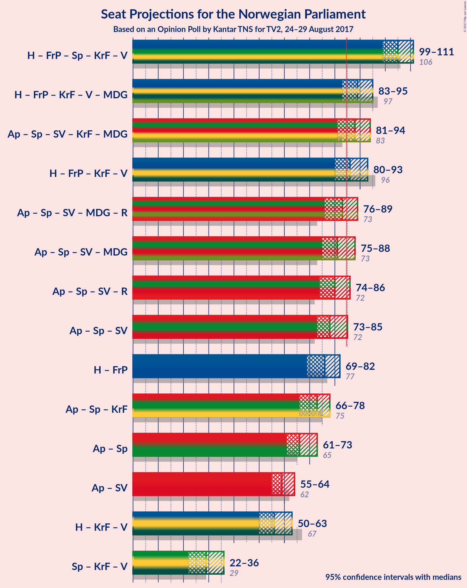

# Opinion Poll by Kantar TNS for TV2, 24–29 August 2017

<a href="#voting-intentions">Voting Intentions</a> | <a href="#seats">Seats</a> | <a href="#coalitions">Coalitions</a> | <a href="#technical-information">Technical Information</a>

## Voting Intentions

### Confidence Intervals

| Party | Last Result | Poll Result | 80% Confidence Interval | 90% Confidence Interval | 95% Confidence Interval | 99% Confidence Interval |
|:-----:|:-----------:|:-----------:|:-----------------------:|:-----------------------:|:-----------------------:|:-----------------------:|
| Arbeiderpartiet | 30.8% | 25.7% | 24.2–27.2% |23.8–27.6% |23.5–28.0% |22.8–28.8% |
| Høyre | 26.8% | 25.1% | 23.7–26.6% |23.3–27.1% |22.9–27.5% |22.3–28.2% |
| Fremskrittspartiet | 16.3% | 16.3% | 15.1–17.6% |14.8–18.0% |14.5–18.4% |13.9–19.0% |
| Senterpartiet | 5.5% | 10.4% | 9.4–11.5% |9.2–11.8% |8.9–12.1% |8.5–12.7% |
| Sosialistisk Venstreparti | 4.1% | 6.5% | 5.7–7.4% |5.5–7.7% |5.3–7.9% |5.0–8.3% |
| Kristelig Folkeparti | 5.6% | 4.2% | 3.6–5.0% |3.4–5.2% |3.3–5.4% |3.0–5.8% |
| Venstre | 5.2% | 3.9% | 3.3–4.6% |3.1–4.8% |3.0–5.0% |2.7–5.4% |
| Miljøpartiet de Grønne | 2.8% | 3.6% | 3.0–4.3% |2.9–4.5% |2.7–4.7% |2.5–5.1% |
| Rødt | 1.1% | 2.6% | 2.1–3.2% |2.0–3.4% |1.9–3.6% |1.7–3.9% |

*Note:* The poll result column reflects the actual value used in the calculations. Published results may vary slightly, and in addition be rounded to fewer digits.

## Seats

### Confidence Intervals

| Party | Last Result | Median | 80% Confidence Interval | 90% Confidence Interval | 95% Confidence Interval | 99% Confidence Interval |
|:-----:|:-----------:|:------:|:-----------------------:|:-----------------------:|:-----------------------:|:-----------------------:|
| <a href="#arbeiderpartiet">Arbeiderpartiet</a> | 55 | 48 | 45–50 |44–51 |43–52 |42–54 |
| <a href="#høyre">Høyre</a> | 48 | 45 | 42–49 |41–49 |40–50 |39–52 |
| <a href="#fremskrittspartiet">Fremskrittspartiet</a> | 29 | 30 | 28–32 |27–33 |26–34 |25–35 |
| <a href="#senterpartiet">Senterpartiet</a> | 10 | 19 | 17–21 |16–22 |16–22 |15–23 |
| <a href="#sosialistisk-venstreparti">Sosialistisk Venstreparti</a> | 7 | 12 | 10–13 |10–14 |9–14 |9–15 |
| <a href="#kristelig-folkeparti">Kristelig Folkeparti</a> | 10 | 8 | 2–9 |2–9 |2–10 |1–10 |
| <a href="#venstre">Venstre</a> | 9 | 2 | 1–8 |1–9 |1–9 |1–10 |
| <a href="#miljøpartiet-de-grønne">Miljøpartiet de Grønne</a> | 1 | 3 | 1–8 |1–8 |1–8 |1–9 |
| <a href="#rødt">Rødt</a> | 0 | 2 | 1–2 |1–2 |1–2 |1–2 |

### Arbeiderpartiet

| Number of Seats | Probability | Accumulated | Special Marks |
|:---------------:|:-----------:|:-----------:|:-------------:|
| 40 | 0.1% | 100% |  |
| 41 | 0.3% | 99.9% |  |
| 42 | 0.7% | 99.6% |  |
| 43 | 2% | 98.9% |  |
| 44 | 4% | 97% |  |
| 45 | 12% | 92% |  |
| 46 | 15% | 80% |  |
| 47 | 11% | 65% |  |
| 48 | 29% | 54% | Median |
| 49 | 13% | 25% |  |
| 50 | 5% | 12% |  |
| 51 | 4% | 7% |  |
| 52 | 1.1% | 3% |  |
| 53 | 2% | 2% |  |
| 54 | 0.4% | 0.5% |  |
| 55 | 0% | 0.1% | Last Result |
| 56 | 0% | 0.1% |  |
| 57 | 0% | 0% |  |

### Høyre

| Number of Seats | Probability | Accumulated | Special Marks |
|:---------------:|:-----------:|:-----------:|:-------------:|
| 38 | 0.2% | 100% |  |
| 39 | 0.3% | 99.8% |  |
| 40 | 2% | 99.5% |  |
| 41 | 3% | 97% |  |
| 42 | 5% | 94% |  |
| 43 | 8% | 89% |  |
| 44 | 8% | 81% |  |
| 45 | 32% | 73% | Median |
| 46 | 10% | 41% |  |
| 47 | 11% | 31% |  |
| 48 | 8% | 20% | Last Result |
| 49 | 8% | 12% |  |
| 50 | 2% | 4% |  |
| 51 | 1.1% | 2% |  |
| 52 | 0.6% | 0.9% |  |
| 53 | 0.1% | 0.2% |  |
| 54 | 0.1% | 0.1% |  |
| 55 | 0% | 0% |  |

### Fremskrittspartiet

| Number of Seats | Probability | Accumulated | Special Marks |
|:---------------:|:-----------:|:-----------:|:-------------:|
| 24 | 0.2% | 100% |  |
| 25 | 0.9% | 99.8% |  |
| 26 | 2% | 98.9% |  |
| 27 | 6% | 97% |  |
| 28 | 12% | 91% |  |
| 29 | 20% | 80% | Last Result |
| 30 | 29% | 59% | Median |
| 31 | 11% | 30% |  |
| 32 | 13% | 19% |  |
| 33 | 3% | 6% |  |
| 34 | 2% | 3% |  |
| 35 | 1.1% | 1.4% |  |
| 36 | 0.1% | 0.2% |  |
| 37 | 0.1% | 0.1% |  |
| 38 | 0% | 0% |  |

### Senterpartiet

| Number of Seats | Probability | Accumulated | Special Marks |
|:---------------:|:-----------:|:-----------:|:-------------:|
| 10 | 0% | 100% | Last Result |
| 11 | 0% | 100% |  |
| 12 | 0% | 100% |  |
| 13 | 0% | 100% |  |
| 14 | 0.1% | 100% |  |
| 15 | 0.8% | 99.8% |  |
| 16 | 5% | 99.0% |  |
| 17 | 13% | 94% |  |
| 18 | 18% | 81% |  |
| 19 | 36% | 63% | Median |
| 20 | 11% | 27% |  |
| 21 | 9% | 15% |  |
| 22 | 4% | 6% |  |
| 23 | 1.3% | 2% |  |
| 24 | 0.2% | 0.3% |  |
| 25 | 0.1% | 0.1% |  |
| 26 | 0% | 0% |  |

### Sosialistisk Venstreparti

| Number of Seats | Probability | Accumulated | Special Marks |
|:---------------:|:-----------:|:-----------:|:-------------:|
| 7 | 0% | 100% | Last Result |
| 8 | 0.1% | 100% |  |
| 9 | 3% | 99.9% |  |
| 10 | 10% | 97% |  |
| 11 | 22% | 87% |  |
| 12 | 39% | 65% | Median |
| 13 | 17% | 27% |  |
| 14 | 8% | 10% |  |
| 15 | 2% | 2% |  |
| 16 | 0.3% | 0.4% |  |
| 17 | 0% | 0% |  |

### Kristelig Folkeparti

| Number of Seats | Probability | Accumulated | Special Marks |
|:---------------:|:-----------:|:-----------:|:-------------:|
| 1 | 0.6% | 100% |  |
| 2 | 13% | 99.4% |  |
| 3 | 8% | 86% |  |
| 4 | 0% | 79% |  |
| 5 | 0% | 79% |  |
| 6 | 0% | 79% |  |
| 7 | 14% | 78% |  |
| 8 | 47% | 65% | Median |
| 9 | 14% | 18% |  |
| 10 | 4% | 4% | Last Result |
| 11 | 0.2% | 0.3% |  |
| 12 | 0% | 0% |  |

### Venstre

| Number of Seats | Probability | Accumulated | Special Marks |
|:---------------:|:-----------:|:-----------:|:-------------:|
| 1 | 12% | 100% |  |
| 2 | 40% | 88% | Median |
| 3 | 14% | 48% |  |
| 4 | 0% | 34% |  |
| 5 | 0% | 34% |  |
| 6 | 0% | 34% |  |
| 7 | 12% | 34% |  |
| 8 | 17% | 23% |  |
| 9 | 5% | 6% | Last Result |
| 10 | 0.8% | 0.9% |  |
| 11 | 0.1% | 0.1% |  |
| 12 | 0% | 0% |  |

### Miljøpartiet de Grønne

| Number of Seats | Probability | Accumulated | Special Marks |
|:---------------:|:-----------:|:-----------:|:-------------:|
| 1 | 36% | 100% | Last Result |
| 2 | 12% | 64% |  |
| 3 | 29% | 52% | Median |
| 4 | 3% | 22% |  |
| 5 | 0% | 20% |  |
| 6 | 0% | 20% |  |
| 7 | 10% | 20% |  |
| 8 | 9% | 10% |  |
| 9 | 1.4% | 2% |  |
| 10 | 0.1% | 0.1% |  |
| 11 | 0% | 0% |  |

### Rødt

| Number of Seats | Probability | Accumulated | Special Marks |
|:---------------:|:-----------:|:-----------:|:-------------:|
| 0 | 0% | 100% | Last Result |
| 1 | 42% | 100% |  |
| 2 | 58% | 58% | Median |
| 3 | 0% | 0.4% |  |
| 4 | 0% | 0.4% |  |
| 5 | 0% | 0.4% |  |
| 6 | 0% | 0.4% |  |
| 7 | 0.3% | 0.3% |  |
| 8 | 0.1% | 0.1% |  |
| 9 | 0% | 0% |  |

## Coalitions

### Confidence Intervals

| Coalition | Last Result | Median | Majority? | 80% Confidence Interval | 90% Confidence Interval | 95% Confidence Interval | 99% Confidence Interval |
|:---------:|:-----------:|:------:|:---------:|:-----------------------:|:-----------------------:|:-----------------------:|:-----------------------:|
| Høyre – Fremskrittspartiet – Senterpartiet – Kristelig Folkeparti – Venstre | 106 | 105 | 100% | 101–109 | 100–110 | 99–111 | 97–112 |
| Høyre – Fremskrittspartiet – Kristelig Folkeparti – Venstre – Miljøpartiet de Grønne | 97 | 89 | 97% | 86–93 | 85–94 | 84–95 | 82–97 |
| Arbeiderpartiet – Senterpartiet – Sosialistisk Venstreparti – Kristelig Folkeparti – Miljøpartiet de Grønne | 83 | 89 | 83% | 83–92 | 82–93 | 82–93 | 79–95 |
| Høyre – Fremskrittspartiet – Kristelig Folkeparti – Venstre | 96 | 86 | 78% | 82–90 | 81–92 | 80–93 | 78–93 |
| Arbeiderpartiet – Senterpartiet – Sosialistisk Venstreparti – Miljøpartiet de Grønne – Rødt | 73 | 83 | 22% | 79–87 | 77–88 | 76–89 | 76–91 |
| Arbeiderpartiet – Senterpartiet – Sosialistisk Venstreparti – Miljøpartiet de Grønne | 73 | 81 | 13% | 77–85 | 76–86 | 75–87 | 74–90 |
| Arbeiderpartiet – Senterpartiet – Sosialistisk Venstreparti – Rødt | 72 | 80 | 3% | 76–83 | 75–84 | 74–85 | 72–87 |
| Arbeiderpartiet – Senterpartiet – Sosialistisk Venstreparti | 72 | 79 | 1.5% | 74–81 | 74–83 | 73–83 | 71–86 |
| Høyre – Fremskrittspartiet | 77 | 75 | 0.2% | 71–79 | 70–80 | 69–82 | 68–84 |
| Arbeiderpartiet – Senterpartiet – Kristelig Folkeparti | 75 | 74 | 0% | 68–77 | 67–78 | 67–78 | 65–80 |
| Arbeiderpartiet – Senterpartiet | 65 | 67 | 0% | 63–69 | 62–70 | 61–72 | 60–73 |
| Arbeiderpartiet – Sosialistisk Venstreparti | 62 | 60 | 0% | 56–62 | 55–63 | 55–64 | 53–66 |
| Høyre – Kristelig Folkeparti – Venstre | 67 | 56 | 0% | 53–60 | 51–61 | 50–63 | 48–64 |
| Senterpartiet – Kristelig Folkeparti – Venstre | 29 | 29 | 0% | 25–34 | 24–35 | 22–36 | 21–38 |

### Høyre – Fremskrittspartiet – Senterpartiet – Kristelig Folkeparti – Venstre

| Number of Seats | Probability | Accumulated | Special Marks |
|:---------------:|:-----------:|:-----------:|:-------------:|
| 94 | 0% | 100% |  |
| 95 | 0.1% | 99.9% |  |
| 96 | 0.2% | 99.9% |  |
| 97 | 0.4% | 99.6% |  |
| 98 | 1.0% | 99.2% |  |
| 99 | 3% | 98% |  |
| 100 | 2% | 95% |  |
| 101 | 4% | 93% |  |
| 102 | 7% | 89% |  |
| 103 | 7% | 82% |  |
| 104 | 25% | 76% | Median |
| 105 | 9% | 51% |  |
| 106 | 8% | 42% | Last Result |
| 107 | 11% | 34% |  |
| 108 | 10% | 23% |  |
| 109 | 5% | 13% |  |
| 110 | 3% | 7% |  |
| 111 | 2% | 4% |  |
| 112 | 2% | 2% |  |
| 113 | 0.3% | 0.4% |  |
| 114 | 0.1% | 0.1% |  |
| 115 | 0% | 0% |  |

### Høyre – Fremskrittspartiet – Kristelig Folkeparti – Venstre – Miljøpartiet de Grønne

| Number of Seats | Probability | Accumulated | Special Marks |
|:---------------:|:-----------:|:-----------:|:-------------:|
| 80 | 0.1% | 100% |  |
| 81 | 0.3% | 99.9% |  |
| 82 | 0.9% | 99.6% |  |
| 83 | 0.6% | 98.7% |  |
| 84 | 1.5% | 98% |  |
| 85 | 4% | 97% | Majority |
| 86 | 3% | 93% |  |
| 87 | 7% | 89% |  |
| 88 | 26% | 82% | Median |
| 89 | 17% | 56% |  |
| 90 | 8% | 38% |  |
| 91 | 10% | 31% |  |
| 92 | 9% | 21% |  |
| 93 | 4% | 12% |  |
| 94 | 5% | 8% |  |
| 95 | 1.1% | 3% |  |
| 96 | 0.5% | 1.4% |  |
| 97 | 0.7% | 0.9% | Last Result |
| 98 | 0.1% | 0.2% |  |
| 99 | 0% | 0.1% |  |
| 100 | 0% | 0% |  |

### Arbeiderpartiet – Senterpartiet – Sosialistisk Venstreparti – Kristelig Folkeparti – Miljøpartiet de Grønne

| Number of Seats | Probability | Accumulated | Special Marks |
|:---------------:|:-----------:|:-----------:|:-------------:|
| 77 | 0% | 100% |  |
| 78 | 0.1% | 99.9% |  |
| 79 | 0.4% | 99.9% |  |
| 80 | 0.8% | 99.4% |  |
| 81 | 1.0% | 98.6% |  |
| 82 | 3% | 98% |  |
| 83 | 5% | 95% | Last Result |
| 84 | 6% | 90% |  |
| 85 | 6% | 83% | Majority |
| 86 | 6% | 78% |  |
| 87 | 8% | 72% |  |
| 88 | 13% | 64% |  |
| 89 | 10% | 52% |  |
| 90 | 27% | 42% | Median |
| 91 | 3% | 15% |  |
| 92 | 5% | 11% |  |
| 93 | 4% | 6% |  |
| 94 | 1.1% | 2% |  |
| 95 | 0.7% | 1.2% |  |
| 96 | 0.2% | 0.5% |  |
| 97 | 0.1% | 0.3% |  |
| 98 | 0.1% | 0.2% |  |
| 99 | 0% | 0% |  |

### Høyre – Fremskrittspartiet – Kristelig Folkeparti – Venstre

| Number of Seats | Probability | Accumulated | Special Marks |
|:---------------:|:-----------:|:-----------:|:-------------:|
| 75 | 0% | 100% |  |
| 76 | 0.1% | 99.9% |  |
| 77 | 0.2% | 99.9% |  |
| 78 | 0.4% | 99.7% |  |
| 79 | 0.9% | 99.2% |  |
| 80 | 1.3% | 98% |  |
| 81 | 4% | 97% |  |
| 82 | 5% | 94% |  |
| 83 | 5% | 89% |  |
| 84 | 5% | 84% |  |
| 85 | 23% | 78% | Median, Majority |
| 86 | 16% | 55% |  |
| 87 | 7% | 40% |  |
| 88 | 11% | 32% |  |
| 89 | 7% | 21% |  |
| 90 | 5% | 14% |  |
| 91 | 4% | 9% |  |
| 92 | 2% | 5% |  |
| 93 | 3% | 3% |  |
| 94 | 0.3% | 0.5% |  |
| 95 | 0.1% | 0.2% |  |
| 96 | 0% | 0.1% | Last Result |
| 97 | 0% | 0% |  |

### Arbeiderpartiet – Senterpartiet – Sosialistisk Venstreparti – Miljøpartiet de Grønne – Rødt

| Number of Seats | Probability | Accumulated | Special Marks |
|:---------------:|:-----------:|:-----------:|:-------------:|
| 73 | 0% | 100% | Last Result |
| 74 | 0.1% | 99.9% |  |
| 75 | 0.3% | 99.8% |  |
| 76 | 3% | 99.5% |  |
| 77 | 2% | 97% |  |
| 78 | 4% | 95% |  |
| 79 | 5% | 91% |  |
| 80 | 7% | 86% |  |
| 81 | 11% | 79% |  |
| 82 | 7% | 68% |  |
| 83 | 16% | 60% |  |
| 84 | 23% | 45% | Median |
| 85 | 5% | 22% | Majority |
| 86 | 5% | 16% |  |
| 87 | 5% | 11% |  |
| 88 | 4% | 6% |  |
| 89 | 1.3% | 3% |  |
| 90 | 0.9% | 2% |  |
| 91 | 0.4% | 0.8% |  |
| 92 | 0.2% | 0.3% |  |
| 93 | 0.1% | 0.1% |  |
| 94 | 0% | 0.1% |  |
| 95 | 0% | 0% |  |

### Arbeiderpartiet – Senterpartiet – Sosialistisk Venstreparti – Miljøpartiet de Grønne

| Number of Seats | Probability | Accumulated | Special Marks |
|:---------------:|:-----------:|:-----------:|:-------------:|
| 71 | 0% | 100% |  |
| 72 | 0.1% | 99.9% |  |
| 73 | 0.1% | 99.9% | Last Result |
| 74 | 1.1% | 99.8% |  |
| 75 | 3% | 98.7% |  |
| 76 | 2% | 95% |  |
| 77 | 6% | 94% |  |
| 78 | 5% | 88% |  |
| 79 | 9% | 83% |  |
| 80 | 9% | 74% |  |
| 81 | 15% | 65% |  |
| 82 | 25% | 50% | Median |
| 83 | 6% | 25% |  |
| 84 | 6% | 19% |  |
| 85 | 4% | 13% | Majority |
| 86 | 5% | 9% |  |
| 87 | 2% | 4% |  |
| 88 | 1.3% | 2% |  |
| 89 | 0.4% | 1.1% |  |
| 90 | 0.4% | 0.7% |  |
| 91 | 0.2% | 0.3% |  |
| 92 | 0.1% | 0.1% |  |
| 93 | 0% | 0% |  |

### Arbeiderpartiet – Senterpartiet – Sosialistisk Venstreparti – Rødt

| Number of Seats | Probability | Accumulated | Special Marks |
|:---------------:|:-----------:|:-----------:|:-------------:|
| 70 | 0% | 100% |  |
| 71 | 0.1% | 99.9% |  |
| 72 | 0.7% | 99.8% | Last Result |
| 73 | 0.5% | 99.1% |  |
| 74 | 1.1% | 98.6% |  |
| 75 | 5% | 97% |  |
| 76 | 4% | 92% |  |
| 77 | 9% | 88% |  |
| 78 | 10% | 79% |  |
| 79 | 8% | 69% |  |
| 80 | 17% | 62% |  |
| 81 | 26% | 44% | Median |
| 82 | 7% | 18% |  |
| 83 | 3% | 11% |  |
| 84 | 4% | 7% |  |
| 85 | 1.5% | 3% | Majority |
| 86 | 0.6% | 2% |  |
| 87 | 0.9% | 1.3% |  |
| 88 | 0.3% | 0.4% |  |
| 89 | 0.1% | 0.1% |  |
| 90 | 0% | 0% |  |

### Arbeiderpartiet – Senterpartiet – Sosialistisk Venstreparti

| Number of Seats | Probability | Accumulated | Special Marks |
|:---------------:|:-----------:|:-----------:|:-------------:|
| 69 | 0.1% | 100% |  |
| 70 | 0.2% | 99.9% |  |
| 71 | 0.8% | 99.8% |  |
| 72 | 0.8% | 99.0% | Last Result |
| 73 | 3% | 98% |  |
| 74 | 6% | 95% |  |
| 75 | 5% | 89% |  |
| 76 | 11% | 84% |  |
| 77 | 8% | 73% |  |
| 78 | 14% | 66% |  |
| 79 | 28% | 52% | Median |
| 80 | 11% | 24% |  |
| 81 | 3% | 13% |  |
| 82 | 5% | 10% |  |
| 83 | 3% | 5% |  |
| 84 | 0.8% | 2% |  |
| 85 | 0.9% | 1.5% | Majority |
| 86 | 0.4% | 0.6% |  |
| 87 | 0.2% | 0.3% |  |
| 88 | 0% | 0.1% |  |
| 89 | 0% | 0% |  |

### Høyre – Fremskrittspartiet

| Number of Seats | Probability | Accumulated | Special Marks |
|:---------------:|:-----------:|:-----------:|:-------------:|
| 66 | 0.2% | 100% |  |
| 67 | 0.3% | 99.8% |  |
| 68 | 0.7% | 99.5% |  |
| 69 | 3% | 98.8% |  |
| 70 | 3% | 96% |  |
| 71 | 4% | 93% |  |
| 72 | 5% | 90% |  |
| 73 | 6% | 84% |  |
| 74 | 12% | 78% |  |
| 75 | 24% | 66% | Median |
| 76 | 9% | 42% |  |
| 77 | 16% | 34% | Last Result |
| 78 | 5% | 17% |  |
| 79 | 3% | 12% |  |
| 80 | 5% | 9% |  |
| 81 | 2% | 5% |  |
| 82 | 2% | 3% |  |
| 83 | 0.2% | 1.0% |  |
| 84 | 0.6% | 0.8% |  |
| 85 | 0.1% | 0.2% | Majority |
| 86 | 0% | 0% |  |

### Arbeiderpartiet – Senterpartiet – Kristelig Folkeparti

| Number of Seats | Probability | Accumulated | Special Marks |
|:---------------:|:-----------:|:-----------:|:-------------:|
| 62 | 0% | 100% |  |
| 63 | 0.3% | 99.9% |  |
| 64 | 0.1% | 99.7% |  |
| 65 | 0.6% | 99.5% |  |
| 66 | 1.3% | 98.9% |  |
| 67 | 3% | 98% |  |
| 68 | 5% | 95% |  |
| 69 | 4% | 90% |  |
| 70 | 5% | 85% |  |
| 71 | 10% | 80% |  |
| 72 | 7% | 70% |  |
| 73 | 12% | 63% |  |
| 74 | 9% | 51% |  |
| 75 | 24% | 42% | Last Result, Median |
| 76 | 6% | 18% |  |
| 77 | 7% | 12% |  |
| 78 | 3% | 5% |  |
| 79 | 0.9% | 2% |  |
| 80 | 0.6% | 1.0% |  |
| 81 | 0.3% | 0.4% |  |
| 82 | 0% | 0.1% |  |
| 83 | 0% | 0% |  |

### Arbeiderpartiet – Senterpartiet

| Number of Seats | Probability | Accumulated | Special Marks |
|:---------------:|:-----------:|:-----------:|:-------------:|
| 58 | 0.1% | 100% |  |
| 59 | 0.2% | 99.9% |  |
| 60 | 0.7% | 99.7% |  |
| 61 | 2% | 99.0% |  |
| 62 | 3% | 97% |  |
| 63 | 6% | 94% |  |
| 64 | 10% | 88% |  |
| 65 | 13% | 78% | Last Result |
| 66 | 14% | 65% |  |
| 67 | 28% | 51% | Median |
| 68 | 10% | 23% |  |
| 69 | 6% | 13% |  |
| 70 | 3% | 7% |  |
| 71 | 2% | 4% |  |
| 72 | 0.9% | 3% |  |
| 73 | 1.3% | 2% |  |
| 74 | 0.2% | 0.4% |  |
| 75 | 0.1% | 0.2% |  |
| 76 | 0.1% | 0.1% |  |
| 77 | 0% | 0% |  |

### Arbeiderpartiet – Sosialistisk Venstreparti

| Number of Seats | Probability | Accumulated | Special Marks |
|:---------------:|:-----------:|:-----------:|:-------------:|
| 51 | 0% | 100% |  |
| 52 | 0.1% | 99.9% |  |
| 53 | 0.9% | 99.8% |  |
| 54 | 1.4% | 98.9% |  |
| 55 | 4% | 98% |  |
| 56 | 7% | 93% |  |
| 57 | 12% | 87% |  |
| 58 | 11% | 75% |  |
| 59 | 11% | 64% |  |
| 60 | 27% | 52% | Median |
| 61 | 9% | 25% |  |
| 62 | 8% | 16% | Last Result |
| 63 | 4% | 9% |  |
| 64 | 3% | 5% |  |
| 65 | 0.6% | 1.4% |  |
| 66 | 0.4% | 0.8% |  |
| 67 | 0.2% | 0.3% |  |
| 68 | 0.1% | 0.1% |  |
| 69 | 0% | 0% |  |

### Høyre – Kristelig Folkeparti – Venstre

| Number of Seats | Probability | Accumulated | Special Marks |
|:---------------:|:-----------:|:-----------:|:-------------:|
| 46 | 0.1% | 100% |  |
| 47 | 0.2% | 99.9% |  |
| 48 | 0.7% | 99.7% |  |
| 49 | 0.7% | 99.0% |  |
| 50 | 1.0% | 98% |  |
| 51 | 3% | 97% |  |
| 52 | 4% | 94% |  |
| 53 | 4% | 90% |  |
| 54 | 7% | 87% |  |
| 55 | 25% | 80% | Median |
| 56 | 8% | 54% |  |
| 57 | 16% | 47% |  |
| 58 | 6% | 31% |  |
| 59 | 7% | 25% |  |
| 60 | 11% | 17% |  |
| 61 | 3% | 7% |  |
| 62 | 1.1% | 4% |  |
| 63 | 2% | 3% |  |
| 64 | 0.3% | 0.8% |  |
| 65 | 0.3% | 0.5% |  |
| 66 | 0.1% | 0.2% |  |
| 67 | 0% | 0.1% | Last Result |
| 68 | 0% | 0% |  |

### Senterpartiet – Kristelig Folkeparti – Venstre

| Number of Seats | Probability | Accumulated | Special Marks |
|:---------------:|:-----------:|:-----------:|:-------------:|
| 20 | 0.5% | 100% |  |
| 21 | 2% | 99.5% |  |
| 22 | 1.3% | 98% |  |
| 23 | 1.4% | 97% |  |
| 24 | 2% | 95% |  |
| 25 | 4% | 93% |  |
| 26 | 2% | 89% |  |
| 27 | 5% | 87% |  |
| 28 | 8% | 83% |  |
| 29 | 26% | 75% | Last Result, Median |
| 30 | 10% | 48% |  |
| 31 | 8% | 39% |  |
| 32 | 12% | 30% |  |
| 33 | 6% | 18% |  |
| 34 | 6% | 12% |  |
| 35 | 2% | 6% |  |
| 36 | 2% | 4% |  |
| 37 | 1.2% | 2% |  |
| 38 | 0.5% | 0.8% |  |
| 39 | 0.3% | 0.3% |  |
| 40 | 0% | 0% |  |

## Technical Information

### Opinion Poll

+ **Pollster:** Kantar TNS
+ **Media:** TV2
+ **Fieldwork period:** 24–29 August 2017

### Calculations

+ **Sample size:** 1421
+ **Simulations done:** 2,097,152
+ **Error estimate:** 1.81%

