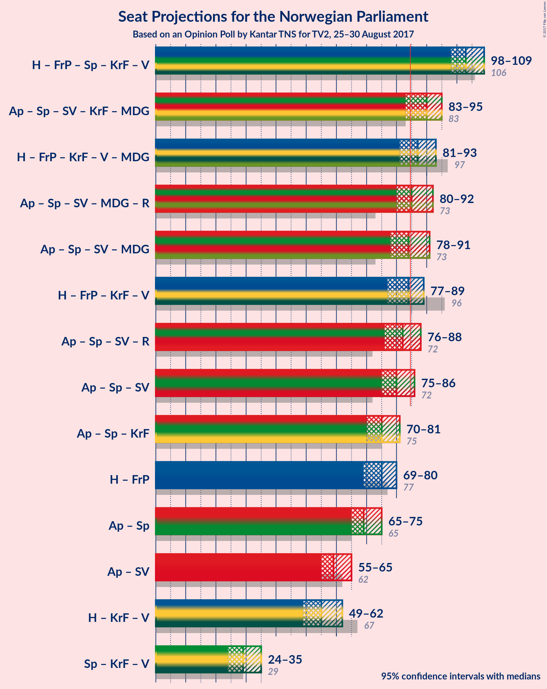

# Opinion Poll by Kantar TNS for TV2, 25–30 August 2017

<a href="#voting-intentions">Voting Intentions</a> | <a href="#seats">Seats</a> | <a href="#coalitions">Coalitions</a> | <a href="#technical-information">Technical Information</a>

## Voting Intentions

### Confidence Intervals

| Party | Last Result | Poll Result | 80% Confidence Interval | 90% Confidence Interval | 95% Confidence Interval | 99% Confidence Interval |
|:-----:|:-----------:|:-----------:|:-----------------------:|:-----------------------:|:-----------------------:|:-----------------------:|
| Arbeiderpartiet | 30.8% | 26.7% | 25.3–28.2% |25.0–28.6% |24.6–28.9% |24.0–29.6% |
| Høyre | 26.8% | 24.7% | 23.4–26.2% |23.0–26.6% |22.7–26.9% |22.1–27.6% |
| Fremskrittspartiet | 16.3% | 15.4% | 14.3–16.6% |14.0–17.0% |13.7–17.3% |13.2–17.9% |
| Senterpartiet | 5.5% | 11.1% | 10.2–12.2% |9.9–12.5% |9.6–12.7% |9.2–13.3% |
| Sosialistisk Venstreparti | 4.1% | 5.9% | 5.2–6.7% |5.0–7.0% |4.8–7.1% |4.5–7.6% |
| Kristelig Folkeparti | 5.6% | 4.2% | 3.6–4.9% |3.5–5.1% |3.3–5.3% |3.1–5.7% |
| Venstre | 5.2% | 3.6% | 3.1–4.3% |2.9–4.5% |2.8–4.6% |2.5–5.0% |
| Miljøpartiet de Grønne | 2.8% | 3.5% | 3.0–4.2% |2.9–4.4% |2.7–4.6% |2.5–4.9% |
| Rødt | 1.1% | 2.8% | 2.3–3.4% |2.2–3.6% |2.1–3.7% |1.9–4.0% |

*Note:* The poll result column reflects the actual value used in the calculations. Published results may vary slightly, and in addition be rounded to fewer digits.

## Seats

### Confidence Intervals

| Party | Last Result | Median | 80% Confidence Interval | 90% Confidence Interval | 95% Confidence Interval | 99% Confidence Interval |
|:-----:|:-----------:|:------:|:-----------------------:|:-----------------------:|:-----------------------:|:-----------------------:|
| <a href="#arbeiderpartiet">Arbeiderpartiet</a> | 55 | 49 | 47–52 |46–52 |46–54 |45–56 |
| <a href="#høyre">Høyre</a> | 48 | 47 | 44–49 |43–49 |42–51 |40–52 |
| <a href="#fremskrittspartiet">Fremskrittspartiet</a> | 29 | 29 | 26–31 |26–31 |25–32 |24–33 |
| <a href="#senterpartiet">Senterpartiet</a> | 10 | 20 | 18–22 |18–23 |17–23 |16–24 |
| <a href="#sosialistisk-venstreparti">Sosialistisk Venstreparti</a> | 7 | 11 | 10–12 |9–12 |9–13 |8–14 |
| <a href="#kristelig-folkeparti">Kristelig Folkeparti</a> | 10 | 8 | 2–9 |2–9 |2–10 |1–10 |
| <a href="#venstre">Venstre</a> | 9 | 2 | 1–7 |1–8 |1–8 |1–9 |
| <a href="#miljøpartiet-de-grønne">Miljøpartiet de Grønne</a> | 1 | 1 | 1–4 |1–8 |1–8 |1–9 |
| <a href="#rødt">Rødt</a> | 0 | 2 | 1–2 |1–2 |1–2 |1–2 |

### Arbeiderpartiet

| Number of Seats | Probability | Accumulated | Special Marks |
|:---------------:|:-----------:|:-----------:|:-------------:|
| 43 | 0.2% | 100% |  |
| 44 | 0.2% | 99.8% |  |
| 45 | 2% | 99.6% |  |
| 46 | 4% | 98% |  |
| 47 | 5% | 94% |  |
| 48 | 30% | 89% |  |
| 49 | 24% | 59% | Median |
| 50 | 4% | 35% |  |
| 51 | 7% | 31% |  |
| 52 | 20% | 25% |  |
| 53 | 0.9% | 4% |  |
| 54 | 2% | 3% |  |
| 55 | 0.2% | 1.0% | Last Result |
| 56 | 0.6% | 0.7% |  |
| 57 | 0% | 0.1% |  |
| 58 | 0% | 0% |  |

### Høyre

| Number of Seats | Probability | Accumulated | Special Marks |
|:---------------:|:-----------:|:-----------:|:-------------:|
| 38 | 0.2% | 100% |  |
| 39 | 0.3% | 99.8% |  |
| 40 | 0.6% | 99.5% |  |
| 41 | 1.1% | 99.0% |  |
| 42 | 2% | 98% |  |
| 43 | 4% | 95% |  |
| 44 | 3% | 91% |  |
| 45 | 7% | 89% |  |
| 46 | 17% | 82% |  |
| 47 | 32% | 65% | Median |
| 48 | 22% | 33% | Last Result |
| 49 | 7% | 10% |  |
| 50 | 0.2% | 3% |  |
| 51 | 0.4% | 3% |  |
| 52 | 2% | 2% |  |
| 53 | 0% | 0% |  |

### Fremskrittspartiet

| Number of Seats | Probability | Accumulated | Special Marks |
|:---------------:|:-----------:|:-----------:|:-------------:|
| 23 | 0.3% | 100% |  |
| 24 | 2% | 99.7% |  |
| 25 | 3% | 98% |  |
| 26 | 8% | 95% |  |
| 27 | 3% | 87% |  |
| 28 | 22% | 84% |  |
| 29 | 30% | 62% | Last Result, Median |
| 30 | 16% | 33% |  |
| 31 | 13% | 17% |  |
| 32 | 3% | 3% |  |
| 33 | 0.7% | 0.9% |  |
| 34 | 0.1% | 0.1% |  |
| 35 | 0% | 0% |  |

### Senterpartiet

| Number of Seats | Probability | Accumulated | Special Marks |
|:---------------:|:-----------:|:-----------:|:-------------:|
| 10 | 0% | 100% | Last Result |
| 11 | 0% | 100% |  |
| 12 | 0% | 100% |  |
| 13 | 0% | 100% |  |
| 14 | 0% | 100% |  |
| 15 | 0% | 100% |  |
| 16 | 0.8% | 100% |  |
| 17 | 2% | 99.1% |  |
| 18 | 16% | 97% |  |
| 19 | 15% | 82% |  |
| 20 | 23% | 66% | Median |
| 21 | 21% | 43% |  |
| 22 | 16% | 22% |  |
| 23 | 3% | 6% |  |
| 24 | 2% | 2% |  |
| 25 | 0.1% | 0.2% |  |
| 26 | 0.1% | 0.1% |  |
| 27 | 0% | 0% |  |

### Sosialistisk Venstreparti

| Number of Seats | Probability | Accumulated | Special Marks |
|:---------------:|:-----------:|:-----------:|:-------------:|
| 7 | 0% | 100% | Last Result |
| 8 | 0.9% | 100% |  |
| 9 | 5% | 99.0% |  |
| 10 | 21% | 94% |  |
| 11 | 42% | 72% | Median |
| 12 | 25% | 30% |  |
| 13 | 4% | 5% |  |
| 14 | 0.4% | 0.5% |  |
| 15 | 0.1% | 0.1% |  |
| 16 | 0% | 0% |  |

### Kristelig Folkeparti

| Number of Seats | Probability | Accumulated | Special Marks |
|:---------------:|:-----------:|:-----------:|:-------------:|
| 1 | 0.7% | 100% |  |
| 2 | 24% | 99.2% |  |
| 3 | 6% | 75% |  |
| 4 | 0% | 69% |  |
| 5 | 0% | 69% |  |
| 6 | 0% | 69% |  |
| 7 | 16% | 69% |  |
| 8 | 31% | 53% | Median |
| 9 | 19% | 22% |  |
| 10 | 2% | 3% | Last Result |
| 11 | 0.3% | 0.3% |  |
| 12 | 0% | 0% |  |

### Venstre

| Number of Seats | Probability | Accumulated | Special Marks |
|:---------------:|:-----------:|:-----------:|:-------------:|
| 0 | 0.1% | 100% |  |
| 1 | 15% | 99.9% |  |
| 2 | 54% | 85% | Median |
| 3 | 20% | 31% |  |
| 4 | 0% | 11% |  |
| 5 | 0% | 11% |  |
| 6 | 0% | 11% |  |
| 7 | 2% | 11% |  |
| 8 | 7% | 8% |  |
| 9 | 0.9% | 1.0% | Last Result |
| 10 | 0.1% | 0.1% |  |
| 11 | 0% | 0% |  |

### Miljøpartiet de Grønne

| Number of Seats | Probability | Accumulated | Special Marks |
|:---------------:|:-----------:|:-----------:|:-------------:|
| 1 | 63% | 100% | Last Result, Median |
| 2 | 3% | 37% |  |
| 3 | 23% | 34% |  |
| 4 | 2% | 10% |  |
| 5 | 0% | 9% |  |
| 6 | 0% | 9% |  |
| 7 | 3% | 9% |  |
| 8 | 5% | 6% |  |
| 9 | 0.6% | 0.7% |  |
| 10 | 0.2% | 0.2% |  |
| 11 | 0% | 0% |  |

### Rødt

| Number of Seats | Probability | Accumulated | Special Marks |
|:---------------:|:-----------:|:-----------:|:-------------:|
| 0 | 0% | 100% | Last Result |
| 1 | 18% | 100% |  |
| 2 | 82% | 82% | Median |
| 3 | 0% | 0.3% |  |
| 4 | 0% | 0.3% |  |
| 5 | 0% | 0.3% |  |
| 6 | 0% | 0.3% |  |
| 7 | 0.1% | 0.2% |  |
| 8 | 0.1% | 0.1% |  |
| 9 | 0% | 0% |  |

## Coalitions

### Confidence Intervals

| Coalition | Last Result | Median | Majority? | 80% Confidence Interval | 90% Confidence Interval | 95% Confidence Interval | 99% Confidence Interval |
|:---------:|:-----------:|:------:|:---------:|:-----------------------:|:-----------------------:|:-----------------------:|:-----------------------:|
| Høyre – Fremskrittspartiet – Senterpartiet – Kristelig Folkeparti – Venstre | 106 | 106 | 100% | 100–107 | 100–109 | 99–109 | 96–110 |
| Arbeiderpartiet – Senterpartiet – Sosialistisk Venstreparti – Kristelig Folkeparti – Miljøpartiet de Grønne | 83 | 90 | 94% | 86–93 | 84–94 | 83–95 | 82–97 |
| Høyre – Fremskrittspartiet – Kristelig Folkeparti – Venstre – Miljøpartiet de Grønne | 97 | 87 | 73% | 82–90 | 82–90 | 81–92 | 80–93 |
| Arbeiderpartiet – Senterpartiet – Sosialistisk Venstreparti – Miljøpartiet de Grønne – Rødt | 73 | 84 | 45% | 80–90 | 80–90 | 80–92 | 78–93 |
| Arbeiderpartiet – Senterpartiet – Sosialistisk Venstreparti – Miljøpartiet de Grønne | 73 | 82 | 26% | 78–88 | 78–89 | 78–90 | 77–92 |
| Høyre – Fremskrittspartiet – Kristelig Folkeparti – Venstre | 96 | 85 | 55% | 79–89 | 79–89 | 77–89 | 76–91 |
| Arbeiderpartiet – Senterpartiet – Sosialistisk Venstreparti – Rødt | 72 | 82 | 27% | 79–87 | 79–87 | 77–88 | 76–89 |
| Arbeiderpartiet – Senterpartiet – Sosialistisk Venstreparti | 72 | 80 | 15% | 77–85 | 77–85 | 75–86 | 74–88 |
| Høyre – Fremskrittspartiet | 77 | 75 | 0% | 72–79 | 70–79 | 69–82 | 68–82 |
| Arbeiderpartiet – Senterpartiet – Kristelig Folkeparti | 75 | 76 | 0.1% | 73–79 | 71–80 | 71–81 | 69–83 |
| Arbeiderpartiet – Senterpartiet | 65 | 69 | 0% | 67–73 | 67–73 | 65–75 | 64–77 |
| Arbeiderpartiet – Sosialistisk Venstreparti | 62 | 59 | 0% | 58–64 | 57–64 | 56–65 | 54–67 |
| Høyre – Kristelig Folkeparti – Venstre | 67 | 56 | 0% | 51–60 | 51–60 | 49–60 | 48–64 |
| Senterpartiet – Kristelig Folkeparti – Venstre | 29 | 29 | 0% | 25–32 | 24–34 | 24–35 | 23–38 |

### Høyre – Fremskrittspartiet – Senterpartiet – Kristelig Folkeparti – Venstre

| Number of Seats | Probability | Accumulated | Special Marks |
|:---------------:|:-----------:|:-----------:|:-------------:|
| 94 | 0% | 100% |  |
| 95 | 0.3% | 99.9% |  |
| 96 | 0.2% | 99.6% |  |
| 97 | 0.2% | 99.5% |  |
| 98 | 0.9% | 99.3% |  |
| 99 | 3% | 98% |  |
| 100 | 12% | 95% |  |
| 101 | 4% | 83% |  |
| 102 | 4% | 80% |  |
| 103 | 14% | 76% |  |
| 104 | 5% | 62% |  |
| 105 | 5% | 57% |  |
| 106 | 5% | 51% | Last Result, Median |
| 107 | 39% | 47% |  |
| 108 | 3% | 8% |  |
| 109 | 4% | 6% |  |
| 110 | 0.8% | 1.2% |  |
| 111 | 0.3% | 0.4% |  |
| 112 | 0.1% | 0.2% |  |
| 113 | 0% | 0% |  |

### Arbeiderpartiet – Senterpartiet – Sosialistisk Venstreparti – Kristelig Folkeparti – Miljøpartiet de Grønne

| Number of Seats | Probability | Accumulated | Special Marks |
|:---------------:|:-----------:|:-----------:|:-------------:|
| 80 | 0.1% | 100% |  |
| 81 | 0.1% | 99.9% |  |
| 82 | 0.8% | 99.8% |  |
| 83 | 3% | 99.0% | Last Result |
| 84 | 3% | 96% |  |
| 85 | 0.9% | 94% | Majority |
| 86 | 7% | 93% |  |
| 87 | 28% | 86% |  |
| 88 | 3% | 58% |  |
| 89 | 4% | 55% | Median |
| 90 | 25% | 51% |  |
| 91 | 13% | 27% |  |
| 92 | 4% | 14% |  |
| 93 | 4% | 10% |  |
| 94 | 2% | 6% |  |
| 95 | 2% | 4% |  |
| 96 | 1.1% | 2% |  |
| 97 | 0.2% | 0.6% |  |
| 98 | 0.1% | 0.4% |  |
| 99 | 0.2% | 0.3% |  |
| 100 | 0.1% | 0.2% |  |
| 101 | 0% | 0% |  |

### Høyre – Fremskrittspartiet – Kristelig Folkeparti – Venstre – Miljøpartiet de Grønne

| Number of Seats | Probability | Accumulated | Special Marks |
|:---------------:|:-----------:|:-----------:|:-------------:|
| 77 | 0% | 100% |  |
| 78 | 0.2% | 99.9% |  |
| 79 | 0.2% | 99.8% |  |
| 80 | 2% | 99.6% |  |
| 81 | 1.0% | 98% |  |
| 82 | 12% | 97% |  |
| 83 | 2% | 85% |  |
| 84 | 10% | 83% |  |
| 85 | 6% | 73% | Majority |
| 86 | 14% | 68% |  |
| 87 | 11% | 54% | Median |
| 88 | 15% | 43% |  |
| 89 | 8% | 28% |  |
| 90 | 15% | 20% |  |
| 91 | 1.2% | 5% |  |
| 92 | 2% | 3% |  |
| 93 | 1.3% | 2% |  |
| 94 | 0.2% | 0.4% |  |
| 95 | 0.1% | 0.2% |  |
| 96 | 0.1% | 0.1% |  |
| 97 | 0% | 0% | Last Result |

### Arbeiderpartiet – Senterpartiet – Sosialistisk Venstreparti – Miljøpartiet de Grønne – Rødt

| Number of Seats | Probability | Accumulated | Special Marks |
|:---------------:|:-----------:|:-----------:|:-------------:|
| 73 | 0% | 100% | Last Result |
| 74 | 0% | 100% |  |
| 75 | 0% | 100% |  |
| 76 | 0% | 100% |  |
| 77 | 0.1% | 100% |  |
| 78 | 0.6% | 99.9% |  |
| 79 | 0.8% | 99.3% |  |
| 80 | 12% | 98.5% |  |
| 81 | 6% | 86% |  |
| 82 | 16% | 80% |  |
| 83 | 6% | 64% | Median |
| 84 | 14% | 59% |  |
| 85 | 11% | 45% | Majority |
| 86 | 10% | 34% |  |
| 87 | 4% | 24% |  |
| 88 | 1.4% | 20% |  |
| 89 | 2% | 19% |  |
| 90 | 12% | 17% |  |
| 91 | 2% | 5% |  |
| 92 | 2% | 3% |  |
| 93 | 0.4% | 0.9% |  |
| 94 | 0.3% | 0.4% |  |
| 95 | 0.1% | 0.1% |  |
| 96 | 0% | 0% |  |

### Arbeiderpartiet – Senterpartiet – Sosialistisk Venstreparti – Miljøpartiet de Grønne

| Number of Seats | Probability | Accumulated | Special Marks |
|:---------------:|:-----------:|:-----------:|:-------------:|
| 73 | 0% | 100% | Last Result |
| 74 | 0% | 100% |  |
| 75 | 0% | 100% |  |
| 76 | 0.4% | 99.9% |  |
| 77 | 0.9% | 99.5% |  |
| 78 | 12% | 98.6% |  |
| 79 | 3% | 87% |  |
| 80 | 19% | 84% |  |
| 81 | 4% | 65% | Median |
| 82 | 15% | 61% |  |
| 83 | 9% | 45% |  |
| 84 | 10% | 36% |  |
| 85 | 5% | 26% | Majority |
| 86 | 1.4% | 21% |  |
| 87 | 2% | 19% |  |
| 88 | 12% | 17% |  |
| 89 | 2% | 5% |  |
| 90 | 0.4% | 3% |  |
| 91 | 2% | 2% |  |
| 92 | 0.6% | 0.7% |  |
| 93 | 0% | 0.1% |  |
| 94 | 0.1% | 0.1% |  |
| 95 | 0% | 0% |  |

### Høyre – Fremskrittspartiet – Kristelig Folkeparti – Venstre

| Number of Seats | Probability | Accumulated | Special Marks |
|:---------------:|:-----------:|:-----------:|:-------------:|
| 74 | 0.1% | 100% |  |
| 75 | 0.3% | 99.9% |  |
| 76 | 0.4% | 99.6% |  |
| 77 | 2% | 99.1% |  |
| 78 | 2% | 97% |  |
| 79 | 12% | 95% |  |
| 80 | 2% | 83% |  |
| 81 | 1.4% | 81% |  |
| 82 | 4% | 80% |  |
| 83 | 10% | 76% |  |
| 84 | 11% | 66% |  |
| 85 | 14% | 55% | Majority |
| 86 | 6% | 41% | Median |
| 87 | 16% | 36% |  |
| 88 | 6% | 20% |  |
| 89 | 12% | 14% |  |
| 90 | 0.8% | 1.5% |  |
| 91 | 0.5% | 0.7% |  |
| 92 | 0.1% | 0.1% |  |
| 93 | 0% | 0% |  |
| 94 | 0% | 0% |  |
| 95 | 0% | 0% |  |
| 96 | 0% | 0% | Last Result |

### Arbeiderpartiet – Senterpartiet – Sosialistisk Venstreparti – Rødt

| Number of Seats | Probability | Accumulated | Special Marks |
|:---------------:|:-----------:|:-----------:|:-------------:|
| 72 | 0% | 100% | Last Result |
| 73 | 0.1% | 100% |  |
| 74 | 0.1% | 99.9% |  |
| 75 | 0.2% | 99.8% |  |
| 76 | 1.3% | 99.6% |  |
| 77 | 2% | 98% |  |
| 78 | 1.2% | 97% |  |
| 79 | 15% | 95% |  |
| 80 | 8% | 80% |  |
| 81 | 15% | 72% |  |
| 82 | 11% | 57% | Median |
| 83 | 14% | 46% |  |
| 84 | 6% | 32% |  |
| 85 | 10% | 27% | Majority |
| 86 | 2% | 17% |  |
| 87 | 12% | 15% |  |
| 88 | 1.0% | 3% |  |
| 89 | 2% | 2% |  |
| 90 | 0.2% | 0.4% |  |
| 91 | 0.2% | 0.2% |  |
| 92 | 0% | 0.1% |  |
| 93 | 0% | 0% |  |

### Arbeiderpartiet – Senterpartiet – Sosialistisk Venstreparti

| Number of Seats | Probability | Accumulated | Special Marks |
|:---------------:|:-----------:|:-----------:|:-------------:|
| 71 | 0.1% | 100% |  |
| 72 | 0% | 99.9% | Last Result |
| 73 | 0.1% | 99.9% |  |
| 74 | 0.7% | 99.8% |  |
| 75 | 2% | 99.0% |  |
| 76 | 1.5% | 97% |  |
| 77 | 14% | 96% |  |
| 78 | 5% | 82% |  |
| 79 | 18% | 76% |  |
| 80 | 11% | 58% | Median |
| 81 | 15% | 48% |  |
| 82 | 4% | 33% |  |
| 83 | 10% | 29% |  |
| 84 | 4% | 19% |  |
| 85 | 11% | 15% | Majority |
| 86 | 1.2% | 3% |  |
| 87 | 1.2% | 2% |  |
| 88 | 0.6% | 0.8% |  |
| 89 | 0.2% | 0.3% |  |
| 90 | 0% | 0.1% |  |
| 91 | 0% | 0.1% |  |
| 92 | 0% | 0% |  |

### Høyre – Fremskrittspartiet

| Number of Seats | Probability | Accumulated | Special Marks |
|:---------------:|:-----------:|:-----------:|:-------------:|
| 65 | 0% | 100% |  |
| 66 | 0.2% | 99.9% |  |
| 67 | 0.2% | 99.7% |  |
| 68 | 0.8% | 99.5% |  |
| 69 | 2% | 98.8% |  |
| 70 | 3% | 97% |  |
| 71 | 3% | 94% |  |
| 72 | 4% | 91% |  |
| 73 | 5% | 88% |  |
| 74 | 10% | 82% |  |
| 75 | 27% | 72% |  |
| 76 | 5% | 45% | Median |
| 77 | 16% | 40% | Last Result |
| 78 | 14% | 24% |  |
| 79 | 7% | 10% |  |
| 80 | 0.5% | 3% |  |
| 81 | 0.4% | 3% |  |
| 82 | 3% | 3% |  |
| 83 | 0% | 0% |  |

### Arbeiderpartiet – Senterpartiet – Kristelig Folkeparti

| Number of Seats | Probability | Accumulated | Special Marks |
|:---------------:|:-----------:|:-----------:|:-------------:|
| 67 | 0% | 100% |  |
| 68 | 0.2% | 99.9% |  |
| 69 | 0.4% | 99.7% |  |
| 70 | 1.4% | 99.3% |  |
| 71 | 4% | 98% |  |
| 72 | 2% | 94% |  |
| 73 | 3% | 92% |  |
| 74 | 9% | 89% |  |
| 75 | 29% | 80% | Last Result |
| 76 | 21% | 52% |  |
| 77 | 5% | 31% | Median |
| 78 | 15% | 26% |  |
| 79 | 4% | 11% |  |
| 80 | 3% | 7% |  |
| 81 | 2% | 4% |  |
| 82 | 0.8% | 2% |  |
| 83 | 0.6% | 0.8% |  |
| 84 | 0.1% | 0.2% |  |
| 85 | 0.1% | 0.1% | Majority |
| 86 | 0% | 0% |  |

### Arbeiderpartiet – Senterpartiet

| Number of Seats | Probability | Accumulated | Special Marks |
|:---------------:|:-----------:|:-----------:|:-------------:|
| 62 | 0.1% | 100% |  |
| 63 | 0.3% | 99.9% |  |
| 64 | 0.3% | 99.6% |  |
| 65 | 2% | 99.3% | Last Result |
| 66 | 1.2% | 97% |  |
| 67 | 18% | 96% |  |
| 68 | 24% | 77% |  |
| 69 | 5% | 54% | Median |
| 70 | 15% | 49% |  |
| 71 | 8% | 34% |  |
| 72 | 9% | 26% |  |
| 73 | 13% | 17% |  |
| 74 | 1.0% | 4% |  |
| 75 | 2% | 3% |  |
| 76 | 0.3% | 1.0% |  |
| 77 | 0.6% | 0.7% |  |
| 78 | 0.1% | 0.2% |  |
| 79 | 0% | 0.1% |  |
| 80 | 0% | 0% |  |

### Arbeiderpartiet – Sosialistisk Venstreparti

| Number of Seats | Probability | Accumulated | Special Marks |
|:---------------:|:-----------:|:-----------:|:-------------:|
| 53 | 0.1% | 100% |  |
| 54 | 0.6% | 99.9% |  |
| 55 | 1.1% | 99.3% |  |
| 56 | 2% | 98% |  |
| 57 | 2% | 96% |  |
| 58 | 7% | 94% |  |
| 59 | 42% | 87% |  |
| 60 | 5% | 45% | Median |
| 61 | 10% | 40% |  |
| 62 | 4% | 30% | Last Result |
| 63 | 8% | 26% |  |
| 64 | 13% | 17% |  |
| 65 | 3% | 5% |  |
| 66 | 1.2% | 2% |  |
| 67 | 0.7% | 0.8% |  |
| 68 | 0% | 0.1% |  |
| 69 | 0% | 0.1% |  |
| 70 | 0% | 0% |  |

### Høyre – Kristelig Folkeparti – Venstre

| Number of Seats | Probability | Accumulated | Special Marks |
|:---------------:|:-----------:|:-----------:|:-------------:|
| 45 | 0% | 100% |  |
| 46 | 0% | 99.9% |  |
| 47 | 0.2% | 99.9% |  |
| 48 | 2% | 99.7% |  |
| 49 | 0.7% | 98% |  |
| 50 | 2% | 97% |  |
| 51 | 12% | 96% |  |
| 52 | 4% | 83% |  |
| 53 | 7% | 80% |  |
| 54 | 4% | 73% |  |
| 55 | 3% | 68% |  |
| 56 | 28% | 65% |  |
| 57 | 7% | 37% | Median |
| 58 | 13% | 30% |  |
| 59 | 2% | 17% |  |
| 60 | 13% | 15% |  |
| 61 | 0.7% | 2% |  |
| 62 | 0.4% | 1.4% |  |
| 63 | 0.4% | 1.0% |  |
| 64 | 0.5% | 0.6% |  |
| 65 | 0.1% | 0.1% |  |
| 66 | 0% | 0% |  |
| 67 | 0% | 0% | Last Result |

### Senterpartiet – Kristelig Folkeparti – Venstre

| Number of Seats | Probability | Accumulated | Special Marks |
|:---------------:|:-----------:|:-----------:|:-------------:|
| 21 | 0.1% | 100% |  |
| 22 | 0.4% | 99.9% |  |
| 23 | 0.6% | 99.6% |  |
| 24 | 7% | 98.9% |  |
| 25 | 11% | 92% |  |
| 26 | 2% | 80% |  |
| 27 | 4% | 78% |  |
| 28 | 5% | 74% |  |
| 29 | 21% | 68% | Last Result |
| 30 | 20% | 47% | Median |
| 31 | 3% | 28% |  |
| 32 | 16% | 24% |  |
| 33 | 2% | 8% |  |
| 34 | 2% | 6% |  |
| 35 | 3% | 4% |  |
| 36 | 0.7% | 2% |  |
| 37 | 0.3% | 0.8% |  |
| 38 | 0.3% | 0.6% |  |
| 39 | 0.2% | 0.3% |  |
| 40 | 0% | 0% |  |

## Technical Information

### Opinion Poll

+ **Pollster:** Kantar TNS
+ **Media:** TV2
+ **Fieldwork period:** 25–30 August 2017

### Calculations

+ **Sample size:** 1613
+ **Simulations done:** 524,288
+ **Error estimate:** 0.88%

