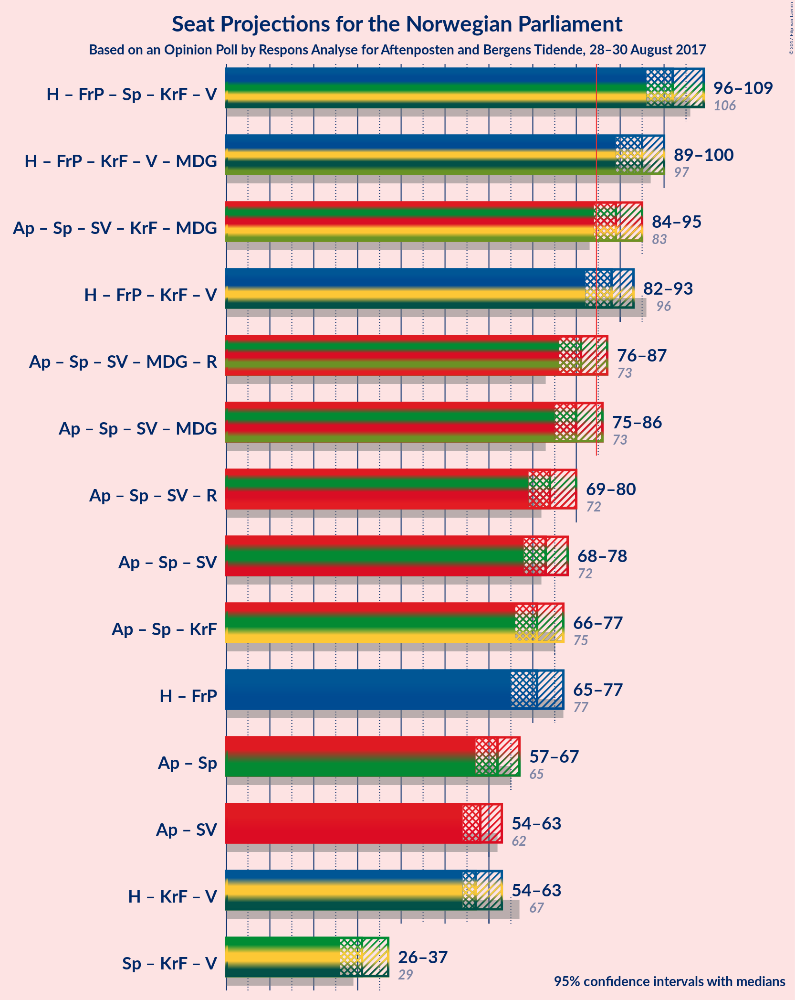

# Opinion Poll by Respons Analyse for Aftenposten and Bergens Tidende, 28–30 August 2017

<a href="#voting-intentions">Voting Intentions</a> | <a href="#seats">Seats</a> | <a href="#coalitions">Coalitions</a> | <a href="#technical-information">Technical Information</a>

## Voting Intentions

### Confidence Intervals

| Party | Last Result | Poll Result | 80% Confidence Interval | 90% Confidence Interval | 95% Confidence Interval | 99% Confidence Interval |
|:-----:|:-----------:|:-----------:|:-----------------------:|:-----------------------:|:-----------------------:|:-----------------------:|
| Arbeiderpartiet | 30.8% | 26.1% | 24.4–28.0% |23.9–28.5% |23.5–29.0% |22.7–29.9% |
| Høyre | 26.8% | 24.0% | 22.3–25.7% |21.8–26.3% |21.4–26.7% |20.6–27.6% |
| Fremskrittspartiet | 16.3% | 16.6% | 15.1–18.2% |14.7–18.6% |14.4–19.0% |13.7–19.8% |
| Senterpartiet | 5.5% | 8.8% | 7.7–10.0% |7.4–10.4% |7.2–10.7% |6.7–11.3% |
| Sosialistisk Venstreparti | 4.1% | 6.2% | 5.3–7.3% |5.1–7.6% |4.8–7.9% |4.5–8.4% |
| Kristelig Folkeparti | 5.6% | 5.4% | 4.6–6.4% |4.3–6.7% |4.1–7.0% |3.8–7.5% |
| Venstre | 5.2% | 4.9% | 4.1–5.9% |3.9–6.2% |3.7–6.4% |3.4–6.9% |
| Miljøpartiet de Grønne | 2.8% | 4.7% | 3.9–5.7% |3.7–5.9% |3.5–6.2% |3.2–6.7% |
| Rødt | 1.1% | 2.4% | 1.9–3.1% |1.7–3.4% |1.6–3.6% |1.4–3.9% |

*Note:* The poll result column reflects the actual value used in the calculations. Published results may vary slightly, and in addition be rounded to fewer digits.

## Seats

### Confidence Intervals

| Party | Last Result | Median | 80% Confidence Interval | 90% Confidence Interval | 95% Confidence Interval | 99% Confidence Interval |
|:-----:|:-----------:|:------:|:-----------------------:|:-----------------------:|:-----------------------:|:-----------------------:|
| <a href="#arbeiderpartiet">Arbeiderpartiet</a> | 55 | 48 | 44–51 |44–52 |43–53 |43–54 |
| <a href="#høyre">Høyre</a> | 48 | 40 | 38–45 |38–46 |37–47 |35–48 |
| <a href="#fremskrittspartiet">Fremskrittspartiet</a> | 29 | 29 | 27–32 |27–33 |26–33 |24–36 |
| <a href="#senterpartiet">Senterpartiet</a> | 10 | 15 | 13–17 |12–18 |12–18 |11–19 |
| <a href="#sosialistisk-venstreparti">Sosialistisk Venstreparti</a> | 7 | 11 | 9–12 |9–12 |8–13 |8–14 |
| <a href="#kristelig-folkeparti">Kristelig Folkeparti</a> | 10 | 9 | 8–10 |7–11 |7–12 |2–12 |
| <a href="#venstre">Venstre</a> | 9 | 8 | 3–10 |2–10 |2–10 |2–11 |
| <a href="#miljøpartiet-de-grønne">Miljøpartiet de Grønne</a> | 1 | 8 | 7–9 |2–9 |2–10 |1–11 |
| <a href="#rødt">Rødt</a> | 0 | 1 | 1–2 |1–2 |1–2 |1–2 |

### Arbeiderpartiet

| Number of Seats | Probability | Accumulated | Special Marks |
|:---------------:|:-----------:|:-----------:|:-------------:|
| 41 | 0.1% | 100% |  |
| 42 | 0.3% | 99.9% |  |
| 43 | 3% | 99.6% |  |
| 44 | 9% | 96% |  |
| 45 | 8% | 88% |  |
| 46 | 5% | 80% |  |
| 47 | 12% | 75% |  |
| 48 | 14% | 63% | Median |
| 49 | 22% | 49% |  |
| 50 | 7% | 27% |  |
| 51 | 14% | 20% |  |
| 52 | 2% | 6% |  |
| 53 | 2% | 3% |  |
| 54 | 0.6% | 0.9% |  |
| 55 | 0.3% | 0.3% | Last Result |
| 56 | 0% | 0% |  |

### Høyre

| Number of Seats | Probability | Accumulated | Special Marks |
|:---------------:|:-----------:|:-----------:|:-------------:|
| 34 | 0.1% | 100% |  |
| 35 | 0.7% | 99.9% |  |
| 36 | 1.3% | 99.2% |  |
| 37 | 2% | 98% |  |
| 38 | 15% | 95% |  |
| 39 | 30% | 80% |  |
| 40 | 4% | 50% | Median |
| 41 | 6% | 46% |  |
| 42 | 14% | 40% |  |
| 43 | 8% | 26% |  |
| 44 | 7% | 19% |  |
| 45 | 4% | 12% |  |
| 46 | 6% | 8% |  |
| 47 | 2% | 3% |  |
| 48 | 0.2% | 0.6% | Last Result |
| 49 | 0.3% | 0.3% |  |
| 50 | 0.1% | 0.1% |  |
| 51 | 0% | 0% |  |

### Fremskrittspartiet

| Number of Seats | Probability | Accumulated | Special Marks |
|:---------------:|:-----------:|:-----------:|:-------------:|
| 23 | 0.3% | 100% |  |
| 24 | 0.2% | 99.7% |  |
| 25 | 0.2% | 99.5% |  |
| 26 | 4% | 99.3% |  |
| 27 | 6% | 95% |  |
| 28 | 27% | 89% |  |
| 29 | 13% | 63% | Last Result, Median |
| 30 | 5% | 49% |  |
| 31 | 9% | 44% |  |
| 32 | 26% | 35% |  |
| 33 | 6% | 8% |  |
| 34 | 0.7% | 2% |  |
| 35 | 0.9% | 2% |  |
| 36 | 0.5% | 0.6% |  |
| 37 | 0% | 0.1% |  |
| 38 | 0% | 0% |  |

### Senterpartiet

| Number of Seats | Probability | Accumulated | Special Marks |
|:---------------:|:-----------:|:-----------:|:-------------:|
| 10 | 0.2% | 100% | Last Result |
| 11 | 1.4% | 99.8% |  |
| 12 | 7% | 98% |  |
| 13 | 32% | 91% |  |
| 14 | 4% | 59% |  |
| 15 | 20% | 54% | Median |
| 16 | 18% | 35% |  |
| 17 | 12% | 17% |  |
| 18 | 4% | 5% |  |
| 19 | 0.7% | 0.9% |  |
| 20 | 0.2% | 0.2% |  |
| 21 | 0% | 0.1% |  |
| 22 | 0% | 0% |  |

### Sosialistisk Venstreparti

| Number of Seats | Probability | Accumulated | Special Marks |
|:---------------:|:-----------:|:-----------:|:-------------:|
| 7 | 0.4% | 100% | Last Result |
| 8 | 4% | 99.6% |  |
| 9 | 16% | 96% |  |
| 10 | 19% | 80% |  |
| 11 | 51% | 61% | Median |
| 12 | 8% | 11% |  |
| 13 | 2% | 3% |  |
| 14 | 0.6% | 0.8% |  |
| 15 | 0.1% | 0.1% |  |
| 16 | 0% | 0% |  |

### Kristelig Folkeparti

| Number of Seats | Probability | Accumulated | Special Marks |
|:---------------:|:-----------:|:-----------:|:-------------:|
| 2 | 0.8% | 100% |  |
| 3 | 0.2% | 99.2% |  |
| 4 | 0% | 99.0% |  |
| 5 | 0% | 99.0% |  |
| 6 | 0% | 99.0% |  |
| 7 | 6% | 99.0% |  |
| 8 | 20% | 93% |  |
| 9 | 47% | 73% | Median |
| 10 | 17% | 26% | Last Result |
| 11 | 6% | 9% |  |
| 12 | 3% | 3% |  |
| 13 | 0.2% | 0.3% |  |
| 14 | 0.1% | 0.1% |  |
| 15 | 0% | 0% |  |

### Venstre

| Number of Seats | Probability | Accumulated | Special Marks |
|:---------------:|:-----------:|:-----------:|:-------------:|
| 1 | 0.2% | 100% |  |
| 2 | 6% | 99.8% |  |
| 3 | 5% | 94% |  |
| 4 | 0% | 89% |  |
| 5 | 0% | 89% |  |
| 6 | 3% | 89% |  |
| 7 | 12% | 86% |  |
| 8 | 45% | 74% | Median |
| 9 | 18% | 29% | Last Result |
| 10 | 8% | 10% |  |
| 11 | 2% | 2% |  |
| 12 | 0.1% | 0.2% |  |
| 13 | 0% | 0% |  |

### Miljøpartiet de Grønne

| Number of Seats | Probability | Accumulated | Special Marks |
|:---------------:|:-----------:|:-----------:|:-------------:|
| 1 | 2% | 100% | Last Result |
| 2 | 4% | 98% |  |
| 3 | 1.3% | 94% |  |
| 4 | 2% | 93% |  |
| 5 | 0% | 90% |  |
| 6 | 0% | 90% |  |
| 7 | 40% | 90% |  |
| 8 | 24% | 50% | Median |
| 9 | 22% | 26% |  |
| 10 | 4% | 5% |  |
| 11 | 0.5% | 0.7% |  |
| 12 | 0.2% | 0.2% |  |
| 13 | 0% | 0% |  |

### Rødt

| Number of Seats | Probability | Accumulated | Special Marks |
|:---------------:|:-----------:|:-----------:|:-------------:|
| 0 | 0.2% | 100% | Last Result |
| 1 | 84% | 99.8% | Median |
| 2 | 16% | 16% |  |
| 3 | 0% | 0.2% |  |
| 4 | 0% | 0.2% |  |
| 5 | 0% | 0.2% |  |
| 6 | 0.1% | 0.2% |  |
| 7 | 0.1% | 0.1% |  |
| 8 | 0% | 0% |  |

## Coalitions

### Confidence Intervals

| Coalition | Last Result | Median | Majority? | 80% Confidence Interval | 90% Confidence Interval | 95% Confidence Interval | 99% Confidence Interval |
|:---------:|:-----------:|:------:|:---------:|:-----------------------:|:-----------------------:|:-----------------------:|:-----------------------:|
| Høyre – Fremskrittspartiet – Senterpartiet – Kristelig Folkeparti – Venstre | 106 | 101 | 100% | 98–106 | 97–106 | 96–108 | 95–112 |
| Høyre – Fremskrittspartiet – Kristelig Folkeparti – Venstre – Miljøpartiet de Grønne | 97 | 95 | 100% | 90–99 | 90–100 | 90–100 | 87–101 |
| Arbeiderpartiet – Senterpartiet – Sosialistisk Venstreparti – Kristelig Folkeparti – Miljøpartiet de Grønne | 83 | 89 | 96% | 86–94 | 85–94 | 84–95 | 82–97 |
| Høyre – Fremskrittspartiet – Kristelig Folkeparti – Venstre | 96 | 88 | 75% | 83–91 | 83–92 | 82–93 | 80–95 |
| Arbeiderpartiet – Senterpartiet – Sosialistisk Venstreparti – Miljøpartiet de Grønne – Rødt | 73 | 81 | 25% | 78–86 | 77–86 | 76–87 | 74–89 |
| Arbeiderpartiet – Senterpartiet – Sosialistisk Venstreparti – Miljøpartiet de Grønne | 73 | 80 | 17% | 77–85 | 76–85 | 74–86 | 73–87 |
| Arbeiderpartiet – Senterpartiet – Sosialistisk Venstreparti – Rødt | 72 | 74 | 0% | 70–79 | 69–79 | 69–79 | 68–82 |
| Arbeiderpartiet – Senterpartiet – Sosialistisk Venstreparti | 72 | 73 | 0% | 69–78 | 68–78 | 68–78 | 67–80 |
| Arbeiderpartiet – Senterpartiet – Kristelig Folkeparti | 75 | 71 | 0% | 68–76 | 67–76 | 66–77 | 64–79 |
| Høyre – Fremskrittspartiet | 77 | 71 | 0% | 66–75 | 66–77 | 65–77 | 63–78 |
| Arbeiderpartiet – Senterpartiet | 65 | 62 | 0% | 59–67 | 58–67 | 57–68 | 56–69 |
| Arbeiderpartiet – Sosialistisk Venstreparti | 62 | 59 | 0% | 55–62 | 54–62 | 54–64 | 53–65 |
| Høyre – Kristelig Folkeparti – Venstre | 67 | 57 | 0% | 55–61 | 54–62 | 54–63 | 51–65 |
| Senterpartiet – Kristelig Folkeparti – Venstre | 29 | 30 | 0% | 28–35 | 26–36 | 26–36 | 25–39 |

### Høyre – Fremskrittspartiet – Senterpartiet – Kristelig Folkeparti – Venstre

| Number of Seats | Probability | Accumulated | Special Marks |
|:---------------:|:-----------:|:-----------:|:-------------:|
| 93 | 0% | 100% |  |
| 94 | 0.3% | 99.9% |  |
| 95 | 0.6% | 99.6% |  |
| 96 | 2% | 99.0% |  |
| 97 | 3% | 97% |  |
| 98 | 5% | 94% |  |
| 99 | 11% | 90% |  |
| 100 | 10% | 78% |  |
| 101 | 22% | 68% | Median |
| 102 | 5% | 46% |  |
| 103 | 12% | 41% |  |
| 104 | 11% | 29% |  |
| 105 | 6% | 18% |  |
| 106 | 8% | 12% | Last Result |
| 107 | 0.5% | 5% |  |
| 108 | 2% | 4% |  |
| 109 | 0.6% | 2% |  |
| 110 | 0.8% | 2% |  |
| 111 | 0.3% | 0.9% |  |
| 112 | 0.5% | 0.6% |  |
| 113 | 0% | 0.1% |  |
| 114 | 0% | 0% |  |

### Høyre – Fremskrittspartiet – Kristelig Folkeparti – Venstre – Miljøpartiet de Grønne

| Number of Seats | Probability | Accumulated | Special Marks |
|:---------------:|:-----------:|:-----------:|:-------------:|
| 85 | 0% | 100% | Majority |
| 86 | 0.3% | 99.9% |  |
| 87 | 0.2% | 99.7% |  |
| 88 | 0.4% | 99.5% |  |
| 89 | 1.3% | 99.0% |  |
| 90 | 11% | 98% |  |
| 91 | 3% | 87% |  |
| 92 | 13% | 84% |  |
| 93 | 6% | 71% |  |
| 94 | 4% | 65% | Median |
| 95 | 27% | 60% |  |
| 96 | 3% | 34% |  |
| 97 | 8% | 30% | Last Result |
| 98 | 12% | 22% |  |
| 99 | 5% | 10% |  |
| 100 | 4% | 5% |  |
| 101 | 0.9% | 1.1% |  |
| 102 | 0.1% | 0.2% |  |
| 103 | 0% | 0.1% |  |
| 104 | 0% | 0% |  |

### Arbeiderpartiet – Senterpartiet – Sosialistisk Venstreparti – Kristelig Folkeparti – Miljøpartiet de Grønne

| Number of Seats | Probability | Accumulated | Special Marks |
|:---------------:|:-----------:|:-----------:|:-------------:|
| 79 | 0% | 100% |  |
| 80 | 0.2% | 99.9% |  |
| 81 | 0.2% | 99.7% |  |
| 82 | 0.2% | 99.5% |  |
| 83 | 2% | 99.3% | Last Result |
| 84 | 2% | 98% |  |
| 85 | 5% | 96% | Majority |
| 86 | 8% | 91% |  |
| 87 | 6% | 82% |  |
| 88 | 8% | 76% |  |
| 89 | 26% | 68% |  |
| 90 | 9% | 42% |  |
| 91 | 4% | 33% | Median |
| 92 | 7% | 29% |  |
| 93 | 5% | 22% |  |
| 94 | 14% | 17% |  |
| 95 | 0.6% | 3% |  |
| 96 | 2% | 2% |  |
| 97 | 0.5% | 0.8% |  |
| 98 | 0.1% | 0.2% |  |
| 99 | 0.1% | 0.1% |  |
| 100 | 0% | 0% |  |

### Høyre – Fremskrittspartiet – Kristelig Folkeparti – Venstre

| Number of Seats | Probability | Accumulated | Special Marks |
|:---------------:|:-----------:|:-----------:|:-------------:|
| 78 | 0% | 100% |  |
| 79 | 0.3% | 99.9% |  |
| 80 | 0.2% | 99.6% |  |
| 81 | 0.9% | 99.4% |  |
| 82 | 2% | 98% |  |
| 83 | 16% | 96% |  |
| 84 | 6% | 81% |  |
| 85 | 6% | 75% | Majority |
| 86 | 3% | 68% | Median |
| 87 | 7% | 65% |  |
| 88 | 28% | 58% |  |
| 89 | 8% | 30% |  |
| 90 | 5% | 23% |  |
| 91 | 10% | 18% |  |
| 92 | 4% | 8% |  |
| 93 | 2% | 4% |  |
| 94 | 0.3% | 2% |  |
| 95 | 1.4% | 2% |  |
| 96 | 0.1% | 0.2% | Last Result |
| 97 | 0.1% | 0.1% |  |
| 98 | 0% | 0% |  |

### Arbeiderpartiet – Senterpartiet – Sosialistisk Venstreparti – Miljøpartiet de Grønne – Rødt

| Number of Seats | Probability | Accumulated | Special Marks |
|:---------------:|:-----------:|:-----------:|:-------------:|
| 72 | 0.1% | 100% |  |
| 73 | 0.1% | 99.9% | Last Result |
| 74 | 1.4% | 99.8% |  |
| 75 | 0.3% | 98% |  |
| 76 | 2% | 98% |  |
| 77 | 4% | 96% |  |
| 78 | 10% | 92% |  |
| 79 | 5% | 82% |  |
| 80 | 8% | 77% |  |
| 81 | 28% | 70% |  |
| 82 | 7% | 42% |  |
| 83 | 3% | 35% | Median |
| 84 | 6% | 32% |  |
| 85 | 6% | 25% | Majority |
| 86 | 16% | 19% |  |
| 87 | 2% | 4% |  |
| 88 | 0.9% | 2% |  |
| 89 | 0.2% | 0.6% |  |
| 90 | 0.3% | 0.4% |  |
| 91 | 0% | 0.1% |  |
| 92 | 0% | 0% |  |

### Arbeiderpartiet – Senterpartiet – Sosialistisk Venstreparti – Miljøpartiet de Grønne

| Number of Seats | Probability | Accumulated | Special Marks |
|:---------------:|:-----------:|:-----------:|:-------------:|
| 71 | 0.1% | 100% |  |
| 72 | 0.3% | 99.9% |  |
| 73 | 1.4% | 99.6% | Last Result |
| 74 | 0.8% | 98% |  |
| 75 | 1.5% | 97% |  |
| 76 | 5% | 96% |  |
| 77 | 10% | 91% |  |
| 78 | 5% | 81% |  |
| 79 | 8% | 76% |  |
| 80 | 30% | 68% |  |
| 81 | 4% | 38% |  |
| 82 | 3% | 34% | Median |
| 83 | 6% | 31% |  |
| 84 | 7% | 24% |  |
| 85 | 14% | 17% | Majority |
| 86 | 2% | 3% |  |
| 87 | 0.8% | 1.3% |  |
| 88 | 0.3% | 0.5% |  |
| 89 | 0.2% | 0.2% |  |
| 90 | 0% | 0.1% |  |
| 91 | 0% | 0% |  |

### Arbeiderpartiet – Senterpartiet – Sosialistisk Venstreparti – Rødt

| Number of Seats | Probability | Accumulated | Special Marks |
|:---------------:|:-----------:|:-----------:|:-------------:|
| 66 | 0% | 100% |  |
| 67 | 0.1% | 99.9% |  |
| 68 | 0.9% | 99.8% |  |
| 69 | 4% | 98.9% |  |
| 70 | 5% | 95% |  |
| 71 | 12% | 90% |  |
| 72 | 8% | 78% | Last Result |
| 73 | 3% | 70% |  |
| 74 | 27% | 66% |  |
| 75 | 4% | 40% | Median |
| 76 | 6% | 35% |  |
| 77 | 13% | 29% |  |
| 78 | 3% | 16% |  |
| 79 | 11% | 13% |  |
| 80 | 1.3% | 2% |  |
| 81 | 0.4% | 1.0% |  |
| 82 | 0.2% | 0.5% |  |
| 83 | 0.3% | 0.3% |  |
| 84 | 0% | 0.1% |  |
| 85 | 0% | 0% | Majority |

### Arbeiderpartiet – Senterpartiet – Sosialistisk Venstreparti

| Number of Seats | Probability | Accumulated | Special Marks |
|:---------------:|:-----------:|:-----------:|:-------------:|
| 65 | 0.1% | 100% |  |
| 66 | 0.1% | 99.9% |  |
| 67 | 1.3% | 99.8% |  |
| 68 | 4% | 98% |  |
| 69 | 7% | 94% |  |
| 70 | 10% | 87% |  |
| 71 | 9% | 77% |  |
| 72 | 5% | 68% | Last Result |
| 73 | 24% | 63% |  |
| 74 | 5% | 38% | Median |
| 75 | 6% | 34% |  |
| 76 | 13% | 28% |  |
| 77 | 2% | 15% |  |
| 78 | 11% | 13% |  |
| 79 | 1.1% | 2% |  |
| 80 | 0.3% | 0.8% |  |
| 81 | 0.3% | 0.4% |  |
| 82 | 0.1% | 0.1% |  |
| 83 | 0% | 0% |  |

### Arbeiderpartiet – Senterpartiet – Kristelig Folkeparti

| Number of Seats | Probability | Accumulated | Special Marks |
|:---------------:|:-----------:|:-----------:|:-------------:|
| 62 | 0.1% | 100% |  |
| 63 | 0.2% | 99.8% |  |
| 64 | 0.1% | 99.6% |  |
| 65 | 2% | 99.5% |  |
| 66 | 2% | 98% |  |
| 67 | 3% | 95% |  |
| 68 | 7% | 93% |  |
| 69 | 10% | 85% |  |
| 70 | 4% | 75% |  |
| 71 | 31% | 71% |  |
| 72 | 4% | 40% | Median |
| 73 | 5% | 37% |  |
| 74 | 11% | 31% |  |
| 75 | 3% | 20% | Last Result |
| 76 | 14% | 17% |  |
| 77 | 1.4% | 3% |  |
| 78 | 1.1% | 2% |  |
| 79 | 0.5% | 0.8% |  |
| 80 | 0.2% | 0.3% |  |
| 81 | 0.1% | 0.1% |  |
| 82 | 0% | 0% |  |

### Høyre – Fremskrittspartiet

| Number of Seats | Probability | Accumulated | Special Marks |
|:---------------:|:-----------:|:-----------:|:-------------:|
| 61 | 0% | 100% |  |
| 62 | 0.1% | 99.9% |  |
| 63 | 0.6% | 99.9% |  |
| 64 | 1.3% | 99.3% |  |
| 65 | 2% | 98% |  |
| 66 | 12% | 96% |  |
| 67 | 5% | 85% |  |
| 68 | 6% | 79% |  |
| 69 | 6% | 74% | Median |
| 70 | 5% | 68% |  |
| 71 | 31% | 62% |  |
| 72 | 4% | 31% |  |
| 73 | 5% | 27% |  |
| 74 | 11% | 22% |  |
| 75 | 4% | 11% |  |
| 76 | 2% | 7% |  |
| 77 | 5% | 5% | Last Result |
| 78 | 0.2% | 0.6% |  |
| 79 | 0.3% | 0.4% |  |
| 80 | 0.1% | 0.1% |  |
| 81 | 0% | 0% |  |

### Arbeiderpartiet – Senterpartiet

| Number of Seats | Probability | Accumulated | Special Marks |
|:---------------:|:-----------:|:-----------:|:-------------:|
| 55 | 0% | 100% |  |
| 56 | 0.8% | 99.9% |  |
| 57 | 3% | 99.2% |  |
| 58 | 4% | 97% |  |
| 59 | 9% | 93% |  |
| 60 | 7% | 83% |  |
| 61 | 8% | 76% |  |
| 62 | 25% | 68% |  |
| 63 | 4% | 43% | Median |
| 64 | 8% | 39% |  |
| 65 | 8% | 30% | Last Result |
| 66 | 9% | 23% |  |
| 67 | 11% | 13% |  |
| 68 | 2% | 3% |  |
| 69 | 0.6% | 1.0% |  |
| 70 | 0.3% | 0.4% |  |
| 71 | 0.1% | 0.1% |  |
| 72 | 0% | 0% |  |

### Arbeiderpartiet – Sosialistisk Venstreparti

| Number of Seats | Probability | Accumulated | Special Marks |
|:---------------:|:-----------:|:-----------:|:-------------:|
| 50 | 0% | 100% |  |
| 51 | 0% | 99.9% |  |
| 52 | 0.1% | 99.9% |  |
| 53 | 0.5% | 99.8% |  |
| 54 | 6% | 99.3% |  |
| 55 | 12% | 94% |  |
| 56 | 11% | 81% |  |
| 57 | 7% | 71% |  |
| 58 | 11% | 64% |  |
| 59 | 5% | 53% | Median |
| 60 | 26% | 48% |  |
| 61 | 5% | 22% |  |
| 62 | 12% | 17% | Last Result |
| 63 | 2% | 5% |  |
| 64 | 2% | 3% |  |
| 65 | 0.4% | 0.8% |  |
| 66 | 0.2% | 0.3% |  |
| 67 | 0.1% | 0.1% |  |
| 68 | 0% | 0% |  |

### Høyre – Kristelig Folkeparti – Venstre

| Number of Seats | Probability | Accumulated | Special Marks |
|:---------------:|:-----------:|:-----------:|:-------------:|
| 48 | 0% | 100% |  |
| 49 | 0.1% | 99.9% |  |
| 50 | 0.1% | 99.9% |  |
| 51 | 0.4% | 99.8% |  |
| 52 | 0.4% | 99.3% |  |
| 53 | 0.6% | 99.0% |  |
| 54 | 5% | 98% |  |
| 55 | 15% | 93% |  |
| 56 | 27% | 78% |  |
| 57 | 9% | 51% | Median |
| 58 | 11% | 42% |  |
| 59 | 9% | 31% |  |
| 60 | 8% | 22% |  |
| 61 | 4% | 13% |  |
| 62 | 6% | 9% |  |
| 63 | 2% | 3% |  |
| 64 | 0.3% | 2% |  |
| 65 | 0.9% | 1.3% |  |
| 66 | 0.2% | 0.4% |  |
| 67 | 0.1% | 0.2% | Last Result |
| 68 | 0% | 0.1% |  |
| 69 | 0% | 0% |  |

### Senterpartiet – Kristelig Folkeparti – Venstre

| Number of Seats | Probability | Accumulated | Special Marks |
|:---------------:|:-----------:|:-----------:|:-------------:|
| 23 | 0.1% | 100% |  |
| 24 | 0.2% | 99.9% |  |
| 25 | 0.4% | 99.6% |  |
| 26 | 6% | 99.2% |  |
| 27 | 1.4% | 94% |  |
| 28 | 5% | 92% |  |
| 29 | 10% | 88% | Last Result |
| 30 | 29% | 77% |  |
| 31 | 3% | 49% |  |
| 32 | 6% | 45% | Median |
| 33 | 22% | 40% |  |
| 34 | 6% | 18% |  |
| 35 | 6% | 12% |  |
| 36 | 3% | 6% |  |
| 37 | 1.3% | 2% |  |
| 38 | 0.6% | 1.1% |  |
| 39 | 0.5% | 0.5% |  |
| 40 | 0.1% | 0.1% |  |
| 41 | 0% | 0% |  |

## Technical Information

### Opinion Poll

+ **Pollster:** Respons Analyse
+ **Media:** Aftenposten and Bergens Tidende
+ **Fieldwork period:** 28–30 August 2017

### Calculations

+ **Sample size:** 1002
+ **Simulations done:** 1,048,576
+ **Error estimate:** 1.45%

