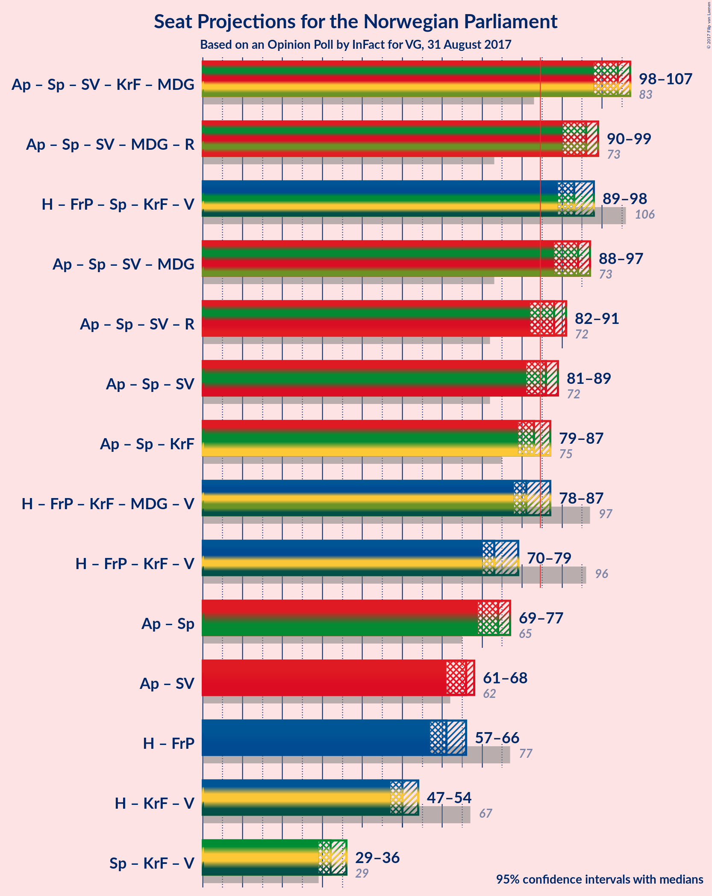

# Opinion Poll by InFact for VG, 31 August 2017

<a href="#voting-intentions">Voting Intentions</a> | <a href="#seats">Seats</a> | <a href="#coalitions">Coalitions</a> | <a href="#technical-information">Technical Information</a>

## Voting Intentions

### Confidence Intervals

| Party | Last Result | Poll Result | 80% Confidence Interval | 90% Confidence Interval | 95% Confidence Interval | 99% Confidence Interval |
|:-----:|:-----------:|:-----------:|:-----------------------:|:-----------------------:|:-----------------------:|:-----------------------:|
| Arbeiderpartiet | 30.8% | 29.0% | 27.7–30.3% |27.4–30.7% |27.1–31.0% |26.4–31.6% |
| Høyre | 26.8% | 21.5% | 20.3–22.7% |20.0–23.0% |19.7–23.3% |19.2–23.9% |
| Fremskrittspartiet | 16.3% | 13.0% | 12.1–14.0% |11.8–14.3% |11.6–14.5% |11.2–15.0% |
| Senterpartiet | 5.5% | 11.2% | 10.3–12.1% |10.1–12.4% |9.9–12.6% |9.5–13.1% |
| Sosialistisk Venstreparti | 4.1% | 6.6% | 5.9–7.4% |5.7–7.6% |5.6–7.8% |5.3–8.1% |
| Kristelig Folkeparti | 5.6% | 5.5% | 4.9–6.2% |4.7–6.4% |4.6–6.6% |4.3–7.0% |
| Miljøpartiet de Grønne | 2.8% | 4.8% | 4.2–5.4% |4.1–5.6% |3.9–5.8% |3.7–6.1% |
| Venstre | 5.2% | 3.4% | 2.9–4.0% |2.8–4.1% |2.7–4.3% |2.5–4.6% |
| Rødt | 1.1% | 3.1% | 2.7–3.7% |2.5–3.8% |2.4–3.9% |2.2–4.2% |

*Note:* The poll result column reflects the actual value used in the calculations. Published results may vary slightly, and in addition be rounded to fewer digits.

## Seats

### Confidence Intervals

| Party | Last Result | Median | 80% Confidence Interval | 90% Confidence Interval | 95% Confidence Interval | 99% Confidence Interval |
|:-----:|:-----------:|:------:|:-----------------------:|:-----------------------:|:-----------------------:|:-----------------------:|
| <a href="#arbeiderpartiet">Arbeiderpartiet</a> | 55 | 54 | 51–55 |50–56 |50–57 |48–60 |
| <a href="#høyre">Høyre</a> | 48 | 37 | 36–40 |35–41 |35–42 |34–43 |
| <a href="#fremskrittspartiet">Fremskrittspartiet</a> | 29 | 24 | 22–26 |21–26 |20–27 |19–28 |
| <a href="#senterpartiet">Senterpartiet</a> | 10 | 20 | 18–22 |18–22 |17–23 |17–24 |
| <a href="#sosialistisk-venstreparti">Sosialistisk Venstreparti</a> | 7 | 12 | 11–13 |10–13 |10–14 |9–14 |
| <a href="#kristelig-folkeparti">Kristelig Folkeparti</a> | 10 | 9 | 9–11 |9–11 |8–11 |8–12 |
| <a href="#miljøpartiet-de-grønne">Miljøpartiet de Grønne</a> | 1 | 9 | 8–10 |7–10 |3–10 |3–11 |
| <a href="#venstre">Venstre</a> | 9 | 2 | 1–3 |1–7 |1–7 |1–8 |
| <a href="#rødt">Rødt</a> | 0 | 2 | 1–2 |1–2 |1–2 |1–7 |

### Arbeiderpartiet

| Number of Seats | Probability | Accumulated | Special Marks |
|:---------------:|:-----------:|:-----------:|:-------------:|
| 46 | 0.1% | 100% |  |
| 47 | 0.2% | 99.9% |  |
| 48 | 0.5% | 99.7% |  |
| 49 | 1.1% | 99.2% |  |
| 50 | 5% | 98% |  |
| 51 | 9% | 94% |  |
| 52 | 9% | 85% |  |
| 53 | 13% | 76% |  |
| 54 | 51% | 63% | Median |
| 55 | 5% | 12% | Last Result |
| 56 | 4% | 7% |  |
| 57 | 1.3% | 3% |  |
| 58 | 0.8% | 1.5% |  |
| 59 | 0.1% | 0.7% |  |
| 60 | 0.6% | 0.6% |  |
| 61 | 0% | 0% |  |

### Høyre

| Number of Seats | Probability | Accumulated | Special Marks |
|:---------------:|:-----------:|:-----------:|:-------------:|
| 33 | 0.1% | 100% |  |
| 34 | 1.1% | 99.8% |  |
| 35 | 5% | 98.8% |  |
| 36 | 7% | 94% |  |
| 37 | 40% | 87% | Median |
| 38 | 19% | 47% |  |
| 39 | 8% | 28% |  |
| 40 | 14% | 20% |  |
| 41 | 4% | 7% |  |
| 42 | 2% | 3% |  |
| 43 | 0.6% | 0.8% |  |
| 44 | 0.2% | 0.2% |  |
| 45 | 0% | 0% |  |
| 46 | 0% | 0% |  |
| 47 | 0% | 0% |  |
| 48 | 0% | 0% | Last Result |

### Fremskrittspartiet

| Number of Seats | Probability | Accumulated | Special Marks |
|:---------------:|:-----------:|:-----------:|:-------------:|
| 18 | 0.1% | 100% |  |
| 19 | 0.6% | 99.9% |  |
| 20 | 2% | 99.3% |  |
| 21 | 6% | 97% |  |
| 22 | 14% | 92% |  |
| 23 | 22% | 77% |  |
| 24 | 38% | 56% | Median |
| 25 | 5% | 18% |  |
| 26 | 9% | 13% |  |
| 27 | 3% | 4% |  |
| 28 | 0.6% | 0.8% |  |
| 29 | 0.1% | 0.1% | Last Result |
| 30 | 0% | 0% |  |

### Senterpartiet

| Number of Seats | Probability | Accumulated | Special Marks |
|:---------------:|:-----------:|:-----------:|:-------------:|
| 10 | 0% | 100% | Last Result |
| 11 | 0% | 100% |  |
| 12 | 0% | 100% |  |
| 13 | 0% | 100% |  |
| 14 | 0% | 100% |  |
| 15 | 0% | 100% |  |
| 16 | 0.3% | 100% |  |
| 17 | 3% | 99.7% |  |
| 18 | 9% | 97% |  |
| 19 | 22% | 87% |  |
| 20 | 37% | 65% | Median |
| 21 | 13% | 28% |  |
| 22 | 9% | 14% |  |
| 23 | 4% | 5% |  |
| 24 | 0.5% | 0.6% |  |
| 25 | 0.1% | 0.1% |  |
| 26 | 0% | 0% |  |

### Sosialistisk Venstreparti

| Number of Seats | Probability | Accumulated | Special Marks |
|:---------------:|:-----------:|:-----------:|:-------------:|
| 7 | 0% | 100% | Last Result |
| 8 | 0% | 100% |  |
| 9 | 1.1% | 100% |  |
| 10 | 5% | 98.9% |  |
| 11 | 21% | 94% |  |
| 12 | 55% | 73% | Median |
| 13 | 14% | 18% |  |
| 14 | 4% | 4% |  |
| 15 | 0.2% | 0.3% |  |
| 16 | 0% | 0% |  |

### Kristelig Folkeparti

| Number of Seats | Probability | Accumulated | Special Marks |
|:---------------:|:-----------:|:-----------:|:-------------:|
| 2 | 0.1% | 100% |  |
| 3 | 0% | 99.9% |  |
| 4 | 0% | 99.9% |  |
| 5 | 0% | 99.9% |  |
| 6 | 0% | 99.9% |  |
| 7 | 0.2% | 99.9% |  |
| 8 | 3% | 99.7% |  |
| 9 | 47% | 97% | Median |
| 10 | 24% | 49% | Last Result |
| 11 | 24% | 26% |  |
| 12 | 1.2% | 2% |  |
| 13 | 0.4% | 0.4% |  |
| 14 | 0% | 0% |  |

### Miljøpartiet de Grønne

| Number of Seats | Probability | Accumulated | Special Marks |
|:---------------:|:-----------:|:-----------:|:-------------:|
| 1 | 0.1% | 100% | Last Result |
| 2 | 0.3% | 99.9% |  |
| 3 | 4% | 99.6% |  |
| 4 | 0.1% | 96% |  |
| 5 | 0% | 96% |  |
| 6 | 0% | 96% |  |
| 7 | 5% | 96% |  |
| 8 | 35% | 91% |  |
| 9 | 45% | 55% | Median |
| 10 | 9% | 10% |  |
| 11 | 0.9% | 1.0% |  |
| 12 | 0.1% | 0.1% |  |
| 13 | 0% | 0% |  |

### Venstre

| Number of Seats | Probability | Accumulated | Special Marks |
|:---------------:|:-----------:|:-----------:|:-------------:|
| 0 | 0.3% | 100% |  |
| 1 | 18% | 99.7% |  |
| 2 | 65% | 82% | Median |
| 3 | 9% | 17% |  |
| 4 | 0% | 8% |  |
| 5 | 0% | 8% |  |
| 6 | 0% | 8% |  |
| 7 | 7% | 8% |  |
| 8 | 0.9% | 1.0% |  |
| 9 | 0% | 0% | Last Result |

### Rødt

| Number of Seats | Probability | Accumulated | Special Marks |
|:---------------:|:-----------:|:-----------:|:-------------:|
| 0 | 0% | 100% | Last Result |
| 1 | 17% | 100% |  |
| 2 | 82% | 83% | Median |
| 3 | 0% | 1.4% |  |
| 4 | 0% | 1.4% |  |
| 5 | 0% | 1.4% |  |
| 6 | 0% | 1.4% |  |
| 7 | 1.1% | 1.4% |  |
| 8 | 0.2% | 0.2% |  |
| 9 | 0% | 0% |  |

## Coalitions

### Confidence Intervals

| Coalition | Last Result | Median | Majority? | 80% Confidence Interval | 90% Confidence Interval | 95% Confidence Interval | 99% Confidence Interval |
|:---------:|:-----------:|:------:|:---------:|:-----------------------:|:-----------------------:|:-----------------------:|:-----------------------:|
| Arbeiderpartiet – Senterpartiet – Sosialistisk Venstreparti – Kristelig Folkeparti – Miljøpartiet de Grønne | 83 | 104 | 100% | 100–105 | 100–106 | 98–107 | 97–108 |
| Arbeiderpartiet – Senterpartiet – Sosialistisk Venstreparti – Miljøpartiet de Grønne – Rødt | 73 | 96 | 100% | 92–97 | 91–98 | 90–99 | 89–100 |
| Høyre – Fremskrittspartiet – Senterpartiet – Kristelig Folkeparti – Venstre | 106 | 93 | 100% | 91–97 | 91–97 | 89–98 | 88–102 |
| Arbeiderpartiet – Senterpartiet – Sosialistisk Venstreparti – Miljøpartiet de Grønne | 73 | 94 | 99.9% | 90–95 | 89–96 | 88–97 | 87–98 |
| Arbeiderpartiet – Senterpartiet – Sosialistisk Venstreparti – Rødt | 72 | 88 | 85% | 84–89 | 83–90 | 82–91 | 80–92 |
| Arbeiderpartiet – Senterpartiet – Sosialistisk Venstreparti | 72 | 86 | 74% | 82–87 | 81–88 | 81–89 | 79–90 |
| Arbeiderpartiet – Senterpartiet – Kristelig Folkeparti | 75 | 83 | 24% | 81–85 | 79–86 | 79–87 | 77–89 |
| Høyre – Fremskrittspartiet – Kristelig Folkeparti – Miljøpartiet de Grønne – Venstre | 97 | 81 | 15% | 80–85 | 79–86 | 78–87 | 77–89 |
| Høyre – Fremskrittspartiet – Kristelig Folkeparti – Venstre | 96 | 73 | 0% | 72–77 | 71–78 | 70–79 | 69–80 |
| Arbeiderpartiet – Senterpartiet | 65 | 74 | 0% | 70–75 | 70–76 | 69–77 | 68–79 |
| Arbeiderpartiet – Sosialistisk Venstreparti | 62 | 66 | 0% | 63–67 | 62–68 | 61–68 | 59–71 |
| Høyre – Fremskrittspartiet | 77 | 61 | 0% | 59–64 | 58–66 | 57–66 | 56–68 |
| Høyre – Kristelig Folkeparti – Venstre | 67 | 50 | 0% | 48–53 | 48–54 | 47–54 | 45–56 |
| Senterpartiet – Kristelig Folkeparti – Venstre | 29 | 32 | 0% | 30–34 | 29–35 | 29–36 | 28–39 |

### Arbeiderpartiet – Senterpartiet – Sosialistisk Venstreparti – Kristelig Folkeparti – Miljøpartiet de Grønne

| Number of Seats | Probability | Accumulated | Special Marks |
|:---------------:|:-----------:|:-----------:|:-------------:|
| 83 | 0% | 100% | Last Result |
| 84 | 0% | 100% |  |
| 85 | 0% | 100% | Majority |
| 86 | 0% | 100% |  |
| 87 | 0% | 100% |  |
| 88 | 0% | 100% |  |
| 89 | 0% | 100% |  |
| 90 | 0% | 100% |  |
| 91 | 0% | 100% |  |
| 92 | 0% | 100% |  |
| 93 | 0% | 100% |  |
| 94 | 0.1% | 100% |  |
| 95 | 0.1% | 99.9% |  |
| 96 | 0.3% | 99.8% |  |
| 97 | 1.3% | 99.6% |  |
| 98 | 1.2% | 98% |  |
| 99 | 2% | 97% |  |
| 100 | 6% | 95% |  |
| 101 | 7% | 89% |  |
| 102 | 11% | 82% |  |
| 103 | 11% | 71% |  |
| 104 | 31% | 60% | Median |
| 105 | 20% | 29% |  |
| 106 | 5% | 9% |  |
| 107 | 3% | 4% |  |
| 108 | 1.0% | 1.5% |  |
| 109 | 0.4% | 0.5% |  |
| 110 | 0.1% | 0.1% |  |
| 111 | 0% | 0% |  |

### Arbeiderpartiet – Senterpartiet – Sosialistisk Venstreparti – Miljøpartiet de Grønne – Rødt

| Number of Seats | Probability | Accumulated | Special Marks |
|:---------------:|:-----------:|:-----------:|:-------------:|
| 73 | 0% | 100% | Last Result |
| 74 | 0% | 100% |  |
| 75 | 0% | 100% |  |
| 76 | 0% | 100% |  |
| 77 | 0% | 100% |  |
| 78 | 0% | 100% |  |
| 79 | 0% | 100% |  |
| 80 | 0% | 100% |  |
| 81 | 0% | 100% |  |
| 82 | 0% | 100% |  |
| 83 | 0% | 100% |  |
| 84 | 0% | 100% |  |
| 85 | 0% | 100% | Majority |
| 86 | 0% | 100% |  |
| 87 | 0% | 100% |  |
| 88 | 0.3% | 99.9% |  |
| 89 | 1.4% | 99.6% |  |
| 90 | 0.8% | 98% |  |
| 91 | 4% | 97% |  |
| 92 | 8% | 94% |  |
| 93 | 3% | 86% |  |
| 94 | 7% | 83% |  |
| 95 | 18% | 76% |  |
| 96 | 12% | 58% |  |
| 97 | 38% | 46% | Median |
| 98 | 4% | 8% |  |
| 99 | 4% | 5% |  |
| 100 | 0.6% | 1.1% |  |
| 101 | 0.2% | 0.5% |  |
| 102 | 0.2% | 0.3% |  |
| 103 | 0.1% | 0.1% |  |
| 104 | 0% | 0% |  |

### Høyre – Fremskrittspartiet – Senterpartiet – Kristelig Folkeparti – Venstre

| Number of Seats | Probability | Accumulated | Special Marks |
|:---------------:|:-----------:|:-----------:|:-------------:|
| 86 | 0.1% | 100% |  |
| 87 | 0.1% | 99.9% |  |
| 88 | 0.2% | 99.7% |  |
| 89 | 2% | 99.5% |  |
| 90 | 2% | 97% |  |
| 91 | 9% | 96% |  |
| 92 | 29% | 86% | Median |
| 93 | 16% | 57% |  |
| 94 | 13% | 41% |  |
| 95 | 9% | 28% |  |
| 96 | 8% | 19% |  |
| 97 | 7% | 11% |  |
| 98 | 2% | 4% |  |
| 99 | 0.9% | 2% |  |
| 100 | 0.6% | 1.4% |  |
| 101 | 0.2% | 0.7% |  |
| 102 | 0.5% | 0.5% |  |
| 103 | 0% | 0% |  |
| 104 | 0% | 0% |  |
| 105 | 0% | 0% |  |
| 106 | 0% | 0% | Last Result |

### Arbeiderpartiet – Senterpartiet – Sosialistisk Venstreparti – Miljøpartiet de Grønne

| Number of Seats | Probability | Accumulated | Special Marks |
|:---------------:|:-----------:|:-----------:|:-------------:|
| 73 | 0% | 100% | Last Result |
| 74 | 0% | 100% |  |
| 75 | 0% | 100% |  |
| 76 | 0% | 100% |  |
| 77 | 0% | 100% |  |
| 78 | 0% | 100% |  |
| 79 | 0% | 100% |  |
| 80 | 0% | 100% |  |
| 81 | 0% | 100% |  |
| 82 | 0% | 100% |  |
| 83 | 0% | 100% |  |
| 84 | 0% | 100% |  |
| 85 | 0% | 99.9% | Majority |
| 86 | 0.3% | 99.9% |  |
| 87 | 0.7% | 99.6% |  |
| 88 | 2% | 98.9% |  |
| 89 | 2% | 97% |  |
| 90 | 8% | 95% |  |
| 91 | 4% | 87% |  |
| 92 | 5% | 83% |  |
| 93 | 16% | 79% |  |
| 94 | 16% | 62% |  |
| 95 | 38% | 46% | Median |
| 96 | 3% | 8% |  |
| 97 | 3% | 5% |  |
| 98 | 2% | 2% |  |
| 99 | 0.2% | 0.3% |  |
| 100 | 0.1% | 0.1% |  |
| 101 | 0% | 0.1% |  |
| 102 | 0% | 0% |  |

### Arbeiderpartiet – Senterpartiet – Sosialistisk Venstreparti – Rødt

| Number of Seats | Probability | Accumulated | Special Marks |
|:---------------:|:-----------:|:-----------:|:-------------:|
| 72 | 0% | 100% | Last Result |
| 73 | 0% | 100% |  |
| 74 | 0% | 100% |  |
| 75 | 0% | 100% |  |
| 76 | 0% | 100% |  |
| 77 | 0% | 100% |  |
| 78 | 0% | 100% |  |
| 79 | 0% | 100% |  |
| 80 | 0.7% | 99.9% |  |
| 81 | 0.3% | 99.2% |  |
| 82 | 2% | 98.9% |  |
| 83 | 3% | 97% |  |
| 84 | 9% | 94% |  |
| 85 | 3% | 85% | Majority |
| 86 | 7% | 81% |  |
| 87 | 21% | 74% |  |
| 88 | 36% | 53% | Median |
| 89 | 11% | 18% |  |
| 90 | 3% | 7% |  |
| 91 | 2% | 3% |  |
| 92 | 0.8% | 1.2% |  |
| 93 | 0.4% | 0.5% |  |
| 94 | 0% | 0.1% |  |
| 95 | 0.1% | 0.1% |  |
| 96 | 0% | 0% |  |

### Arbeiderpartiet – Senterpartiet – Sosialistisk Venstreparti

| Number of Seats | Probability | Accumulated | Special Marks |
|:---------------:|:-----------:|:-----------:|:-------------:|
| 72 | 0% | 100% | Last Result |
| 73 | 0% | 100% |  |
| 74 | 0% | 100% |  |
| 75 | 0% | 100% |  |
| 76 | 0% | 100% |  |
| 77 | 0.1% | 100% |  |
| 78 | 0.1% | 99.9% |  |
| 79 | 0.8% | 99.8% |  |
| 80 | 1.2% | 99.0% |  |
| 81 | 3% | 98% |  |
| 82 | 6% | 94% |  |
| 83 | 7% | 88% |  |
| 84 | 7% | 82% |  |
| 85 | 17% | 74% | Majority |
| 86 | 41% | 58% | Median |
| 87 | 10% | 17% |  |
| 88 | 4% | 7% |  |
| 89 | 1.2% | 3% |  |
| 90 | 2% | 2% |  |
| 91 | 0.2% | 0.3% |  |
| 92 | 0.1% | 0.1% |  |
| 93 | 0% | 0.1% |  |
| 94 | 0% | 0% |  |

### Arbeiderpartiet – Senterpartiet – Kristelig Folkeparti

| Number of Seats | Probability | Accumulated | Special Marks |
|:---------------:|:-----------:|:-----------:|:-------------:|
| 75 | 0% | 100% | Last Result |
| 76 | 0.1% | 100% |  |
| 77 | 0.9% | 99.8% |  |
| 78 | 0.6% | 98.9% |  |
| 79 | 4% | 98% |  |
| 80 | 3% | 95% |  |
| 81 | 10% | 92% |  |
| 82 | 11% | 82% |  |
| 83 | 36% | 70% | Median |
| 84 | 11% | 34% |  |
| 85 | 16% | 24% | Majority |
| 86 | 4% | 8% |  |
| 87 | 2% | 4% |  |
| 88 | 0.8% | 2% |  |
| 89 | 0.7% | 0.8% |  |
| 90 | 0% | 0.1% |  |
| 91 | 0% | 0% |  |

### Høyre – Fremskrittspartiet – Kristelig Folkeparti – Miljøpartiet de Grønne – Venstre

| Number of Seats | Probability | Accumulated | Special Marks |
|:---------------:|:-----------:|:-----------:|:-------------:|
| 74 | 0.1% | 100% |  |
| 75 | 0% | 99.9% |  |
| 76 | 0.4% | 99.9% |  |
| 77 | 0.8% | 99.5% |  |
| 78 | 2% | 98.8% |  |
| 79 | 3% | 97% |  |
| 80 | 11% | 93% |  |
| 81 | 36% | 82% | Median |
| 82 | 21% | 47% |  |
| 83 | 7% | 26% |  |
| 84 | 3% | 19% |  |
| 85 | 9% | 15% | Majority |
| 86 | 3% | 6% |  |
| 87 | 2% | 3% |  |
| 88 | 0.3% | 1.1% |  |
| 89 | 0.7% | 0.8% |  |
| 90 | 0% | 0.1% |  |
| 91 | 0% | 0% |  |
| 92 | 0% | 0% |  |
| 93 | 0% | 0% |  |
| 94 | 0% | 0% |  |
| 95 | 0% | 0% |  |
| 96 | 0% | 0% |  |
| 97 | 0% | 0% | Last Result |

### Høyre – Fremskrittspartiet – Kristelig Folkeparti – Venstre

| Number of Seats | Probability | Accumulated | Special Marks |
|:---------------:|:-----------:|:-----------:|:-------------:|
| 66 | 0.1% | 100% |  |
| 67 | 0.2% | 99.9% |  |
| 68 | 0.2% | 99.7% |  |
| 69 | 0.6% | 99.5% |  |
| 70 | 4% | 98.9% |  |
| 71 | 4% | 95% |  |
| 72 | 38% | 92% | Median |
| 73 | 12% | 54% |  |
| 74 | 18% | 42% |  |
| 75 | 7% | 24% |  |
| 76 | 3% | 17% |  |
| 77 | 8% | 14% |  |
| 78 | 4% | 6% |  |
| 79 | 0.8% | 3% |  |
| 80 | 1.4% | 2% |  |
| 81 | 0.3% | 0.4% |  |
| 82 | 0% | 0.1% |  |
| 83 | 0% | 0% |  |
| 84 | 0% | 0% |  |
| 85 | 0% | 0% | Majority |
| 86 | 0% | 0% |  |
| 87 | 0% | 0% |  |
| 88 | 0% | 0% |  |
| 89 | 0% | 0% |  |
| 90 | 0% | 0% |  |
| 91 | 0% | 0% |  |
| 92 | 0% | 0% |  |
| 93 | 0% | 0% |  |
| 94 | 0% | 0% |  |
| 95 | 0% | 0% |  |
| 96 | 0% | 0% | Last Result |

### Arbeiderpartiet – Senterpartiet

| Number of Seats | Probability | Accumulated | Special Marks |
|:---------------:|:-----------:|:-----------:|:-------------:|
| 65 | 0% | 100% | Last Result |
| 66 | 0% | 100% |  |
| 67 | 0.1% | 99.9% |  |
| 68 | 1.1% | 99.8% |  |
| 69 | 2% | 98.7% |  |
| 70 | 7% | 97% |  |
| 71 | 5% | 90% |  |
| 72 | 8% | 85% |  |
| 73 | 22% | 77% |  |
| 74 | 37% | 55% | Median |
| 75 | 11% | 18% |  |
| 76 | 3% | 8% |  |
| 77 | 3% | 4% |  |
| 78 | 0.6% | 1.4% |  |
| 79 | 0.7% | 0.8% |  |
| 80 | 0.1% | 0.1% |  |
| 81 | 0% | 0.1% |  |
| 82 | 0% | 0% |  |

### Arbeiderpartiet – Sosialistisk Venstreparti

| Number of Seats | Probability | Accumulated | Special Marks |
|:---------------:|:-----------:|:-----------:|:-------------:|
| 57 | 0.1% | 100% |  |
| 58 | 0.1% | 99.9% |  |
| 59 | 0.8% | 99.8% |  |
| 60 | 0.4% | 99.0% |  |
| 61 | 2% | 98.6% |  |
| 62 | 4% | 96% | Last Result |
| 63 | 10% | 92% |  |
| 64 | 16% | 82% |  |
| 65 | 8% | 67% |  |
| 66 | 39% | 59% | Median |
| 67 | 12% | 20% |  |
| 68 | 5% | 8% |  |
| 69 | 0.9% | 2% |  |
| 70 | 0.7% | 1.4% |  |
| 71 | 0.6% | 0.8% |  |
| 72 | 0.1% | 0.2% |  |
| 73 | 0% | 0% |  |

### Høyre – Fremskrittspartiet

| Number of Seats | Probability | Accumulated | Special Marks |
|:---------------:|:-----------:|:-----------:|:-------------:|
| 54 | 0% | 100% |  |
| 55 | 0.3% | 99.9% |  |
| 56 | 0.8% | 99.6% |  |
| 57 | 2% | 98.8% |  |
| 58 | 4% | 97% |  |
| 59 | 10% | 93% |  |
| 60 | 11% | 84% |  |
| 61 | 36% | 73% | Median |
| 62 | 13% | 37% |  |
| 63 | 6% | 25% |  |
| 64 | 9% | 18% |  |
| 65 | 4% | 9% |  |
| 66 | 3% | 5% |  |
| 67 | 1.5% | 2% |  |
| 68 | 0.5% | 0.7% |  |
| 69 | 0.2% | 0.2% |  |
| 70 | 0% | 0% |  |
| 71 | 0% | 0% |  |
| 72 | 0% | 0% |  |
| 73 | 0% | 0% |  |
| 74 | 0% | 0% |  |
| 75 | 0% | 0% |  |
| 76 | 0% | 0% |  |
| 77 | 0% | 0% | Last Result |

### Høyre – Kristelig Folkeparti – Venstre

| Number of Seats | Probability | Accumulated | Special Marks |
|:---------------:|:-----------:|:-----------:|:-------------:|
| 44 | 0.1% | 100% |  |
| 45 | 0.5% | 99.9% |  |
| 46 | 1.1% | 99.4% |  |
| 47 | 3% | 98% |  |
| 48 | 34% | 95% | Median |
| 49 | 10% | 62% |  |
| 50 | 10% | 52% |  |
| 51 | 22% | 42% |  |
| 52 | 9% | 21% |  |
| 53 | 7% | 12% |  |
| 54 | 3% | 5% |  |
| 55 | 1.0% | 2% |  |
| 56 | 0.4% | 0.8% |  |
| 57 | 0.4% | 0.5% |  |
| 58 | 0.1% | 0.1% |  |
| 59 | 0% | 0% |  |
| 60 | 0% | 0% |  |
| 61 | 0% | 0% |  |
| 62 | 0% | 0% |  |
| 63 | 0% | 0% |  |
| 64 | 0% | 0% |  |
| 65 | 0% | 0% |  |
| 66 | 0% | 0% |  |
| 67 | 0% | 0% | Last Result |

### Senterpartiet – Kristelig Folkeparti – Venstre

| Number of Seats | Probability | Accumulated | Special Marks |
|:---------------:|:-----------:|:-----------:|:-------------:|
| 26 | 0.1% | 100% |  |
| 27 | 0.4% | 99.9% |  |
| 28 | 2% | 99.5% |  |
| 29 | 4% | 98% | Last Result |
| 30 | 10% | 93% |  |
| 31 | 30% | 84% | Median |
| 32 | 16% | 54% |  |
| 33 | 20% | 38% |  |
| 34 | 9% | 18% |  |
| 35 | 5% | 9% |  |
| 36 | 2% | 4% |  |
| 37 | 0.5% | 2% |  |
| 38 | 0.5% | 1.0% |  |
| 39 | 0.4% | 0.5% |  |
| 40 | 0.1% | 0.1% |  |
| 41 | 0% | 0% |  |

## Technical Information

### Opinion Poll

+ **Pollster:** InFact
+ **Media:** VG
+ **Fieldwork period:** 31 August 2017

### Calculations

+ **Sample size:** 2032
+ **Simulations done:** 1,048,576
+ **Error estimate:** 0.78%

