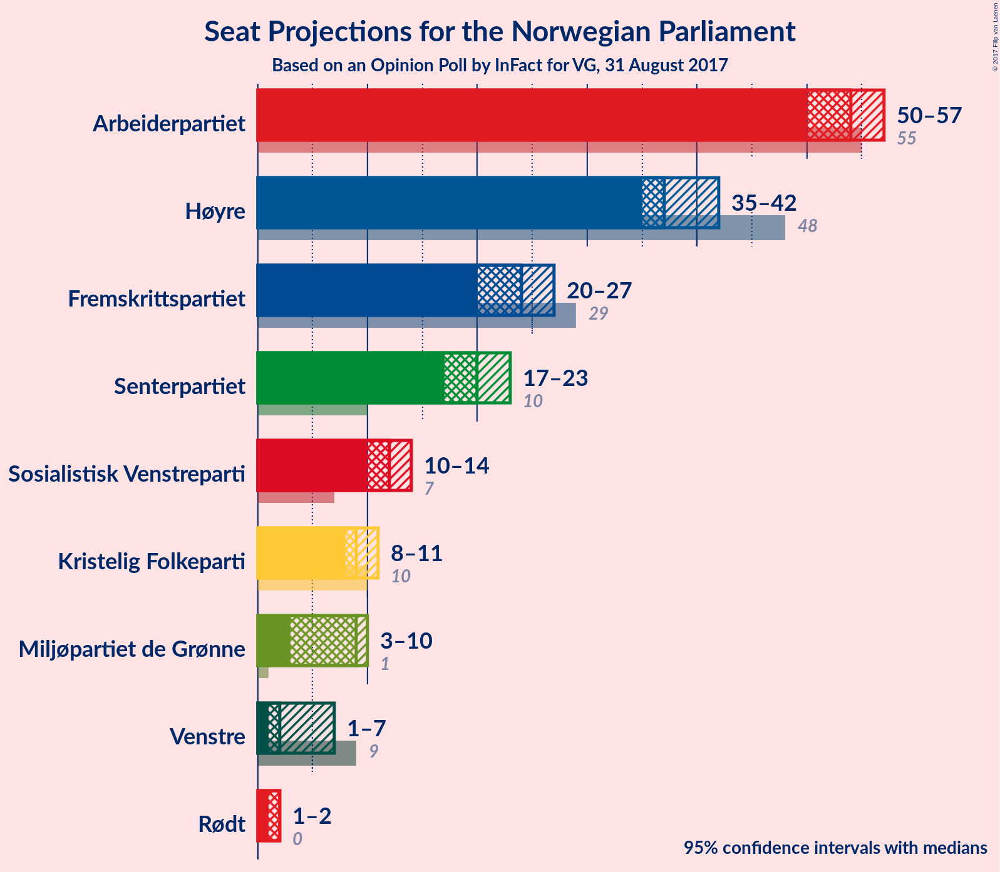

# Opinion Poll by InFact for VG, 31 August 2017

<a href="#voting-intentions">Voting Intentions</a> | <a href="#seats">Seats</a> | <a href="#coalitions">Coalitions</a> | <a href="#technical-information">Technical Information</a>

## Voting Intentions

### Confidence Intervals

| Party | Last Result | Poll Result | 80% Confidence Interval | 90% Confidence Interval | 95% Confidence Interval | 99% Confidence Interval |
|:-----:|:-----------:|:-----------:|:-----------------------:|:-----------------------:|:-----------------------:|:-----------------------:|
| Arbeiderpartiet | 30.8% | 29.0% | 27.7–30.3% |27.4–30.7% |27.1–31.0% |26.4–31.6% |
| Høyre | 26.8% | 21.5% | 20.3–22.7% |20.0–23.0% |19.7–23.3% |19.2–23.9% |
| Fremskrittspartiet | 16.3% | 13.0% | 12.1–14.0% |11.8–14.3% |11.6–14.5% |11.2–15.0% |
| Senterpartiet | 5.5% | 11.2% | 10.3–12.1% |10.1–12.4% |9.9–12.6% |9.5–13.1% |
| Sosialistisk Venstreparti | 4.1% | 6.6% | 5.9–7.4% |5.7–7.6% |5.6–7.8% |5.3–8.1% |
| Kristelig Folkeparti | 5.6% | 5.5% | 4.9–6.2% |4.7–6.4% |4.6–6.6% |4.3–7.0% |
| Miljøpartiet de Grønne | 2.8% | 4.8% | 4.2–5.4% |4.1–5.6% |3.9–5.8% |3.7–6.1% |
| Venstre | 5.2% | 3.4% | 2.9–4.0% |2.8–4.1% |2.7–4.3% |2.5–4.6% |
| Rødt | 1.1% | 3.1% | 2.7–3.7% |2.5–3.8% |2.4–3.9% |2.2–4.2% |

*Note:* The poll result column reflects the actual value used in the calculations. Published results may vary slightly, and in addition be rounded to fewer digits.

## Seats

### Confidence Intervals

| Party | Last Result | Median | 80% Confidence Interval | 90% Confidence Interval | 95% Confidence Interval | 99% Confidence Interval |
|:-----:|:-----------:|:------:|:-----------------------:|:-----------------------:|:-----------------------:|:-----------------------:|
| <a href="#arbeiderpartiet">Arbeiderpartiet</a> | 55 | 54 | 51–54 |50–55 |50–55 |48–56 |
| <a href="#høyre">Høyre</a> | 48 | 37 | 36–40 |35–40 |35–41 |34–42 |
| <a href="#fremskrittspartiet">Fremskrittspartiet</a> | 29 | 24 | 22–26 |21–26 |21–27 |19–28 |
| <a href="#senterpartiet">Senterpartiet</a> | 10 | 20 | 19–21 |18–23 |18–23 |17–23 |
| <a href="#sosialistisk-venstreparti">Sosialistisk Venstreparti</a> | 7 | 12 | 12–13 |11–13 |11–14 |10–14 |
| <a href="#kristelig-folkeparti">Kristelig Folkeparti</a> | 10 | 9 | 9–11 |9–11 |9–11 |8–12 |
| <a href="#miljøpartiet-de-grønne">Miljøpartiet de Grønne</a> | 1 | 9 | 8–9 |7–9 |3–10 |3–11 |
| <a href="#venstre">Venstre</a> | 9 | 2 | 2–3 |1–7 |1–7 |1–8 |
| <a href="#rødt">Rødt</a> | 0 | 2 | 1–2 |1–2 |1–2 |1–2 |

### Arbeiderpartiet

| Number of Seats | Probability | Accumulated | Special Marks |
|:---------------:|:-----------:|:-----------:|:-------------:|
| 46 | 0.1% | 100% |  |
| 47 | 0.2% | 99.9% |  |
| 48 | 0.6% | 99.7% |  |
| 49 | 0.9% | 99.1% |  |
| 50 | 4% | 98% |  |
| 51 | 11% | 94% |  |
| 52 | 9% | 84% |  |
| 53 | 5% | 75% |  |
| 54 | 64% | 70% | Median |
| 55 | 3% | 6% | Last Result |
| 56 | 2% | 2% |  |
| 57 | 0.1% | 0.3% |  |
| 58 | 0.1% | 0.2% |  |
| 59 | 0.1% | 0.1% |  |
| 60 | 0% | 0% |  |

### Høyre

| Number of Seats | Probability | Accumulated | Special Marks |
|:---------------:|:-----------:|:-----------:|:-------------:|
| 33 | 0.1% | 100% |  |
| 34 | 1.4% | 99.8% |  |
| 35 | 6% | 98% |  |
| 36 | 6% | 92% |  |
| 37 | 47% | 86% | Median |
| 38 | 18% | 39% |  |
| 39 | 6% | 20% |  |
| 40 | 12% | 15% |  |
| 41 | 2% | 3% |  |
| 42 | 0.5% | 0.5% |  |
| 43 | 0.1% | 0.1% |  |
| 44 | 0% | 0% |  |
| 45 | 0% | 0% |  |
| 46 | 0% | 0% |  |
| 47 | 0% | 0% |  |
| 48 | 0% | 0% | Last Result |

### Fremskrittspartiet

| Number of Seats | Probability | Accumulated | Special Marks |
|:---------------:|:-----------:|:-----------:|:-------------:|
| 18 | 0.1% | 100% |  |
| 19 | 0.6% | 99.9% |  |
| 20 | 1.2% | 99.4% |  |
| 21 | 5% | 98% |  |
| 22 | 16% | 93% |  |
| 23 | 19% | 77% |  |
| 24 | 40% | 58% | Median |
| 25 | 4% | 18% |  |
| 26 | 11% | 14% |  |
| 27 | 3% | 3% |  |
| 28 | 0.5% | 0.7% |  |
| 29 | 0.1% | 0.1% | Last Result |
| 30 | 0% | 0% |  |

### Senterpartiet

| Number of Seats | Probability | Accumulated | Special Marks |
|:---------------:|:-----------:|:-----------:|:-------------:|
| 10 | 0% | 100% | Last Result |
| 11 | 0% | 100% |  |
| 12 | 0% | 100% |  |
| 13 | 0% | 100% |  |
| 14 | 0% | 100% |  |
| 15 | 0% | 100% |  |
| 16 | 0.2% | 100% |  |
| 17 | 0.8% | 99.8% |  |
| 18 | 7% | 99.0% |  |
| 19 | 24% | 92% |  |
| 20 | 46% | 68% | Median |
| 21 | 12% | 22% |  |
| 22 | 4% | 9% |  |
| 23 | 5% | 6% |  |
| 24 | 0.3% | 0.4% |  |
| 25 | 0.1% | 0.1% |  |
| 26 | 0% | 0% |  |

### Sosialistisk Venstreparti

| Number of Seats | Probability | Accumulated | Special Marks |
|:---------------:|:-----------:|:-----------:|:-------------:|
| 7 | 0% | 100% | Last Result |
| 8 | 0% | 100% |  |
| 9 | 0.2% | 100% |  |
| 10 | 2% | 99.8% |  |
| 11 | 6% | 98% |  |
| 12 | 69% | 92% | Median |
| 13 | 18% | 23% |  |
| 14 | 4% | 5% |  |
| 15 | 0.2% | 0.2% |  |
| 16 | 0% | 0% |  |

### Kristelig Folkeparti

| Number of Seats | Probability | Accumulated | Special Marks |
|:---------------:|:-----------:|:-----------:|:-------------:|
| 7 | 0.1% | 100% |  |
| 8 | 2% | 99.8% |  |
| 9 | 54% | 98% | Median |
| 10 | 15% | 44% | Last Result |
| 11 | 27% | 29% |  |
| 12 | 1.0% | 1.4% |  |
| 13 | 0.3% | 0.4% |  |
| 14 | 0% | 0% |  |

### Miljøpartiet de Grønne

| Number of Seats | Probability | Accumulated | Special Marks |
|:---------------:|:-----------:|:-----------:|:-------------:|
| 1 | 0.1% | 100% | Last Result |
| 2 | 0.3% | 99.9% |  |
| 3 | 3% | 99.7% |  |
| 4 | 0.1% | 96% |  |
| 5 | 0% | 96% |  |
| 6 | 0% | 96% |  |
| 7 | 5% | 96% |  |
| 8 | 39% | 91% |  |
| 9 | 47% | 52% | Median |
| 10 | 4% | 5% |  |
| 11 | 1.1% | 1.1% |  |
| 12 | 0.1% | 0.1% |  |
| 13 | 0% | 0% |  |

### Venstre

| Number of Seats | Probability | Accumulated | Special Marks |
|:---------------:|:-----------:|:-----------:|:-------------:|
| 0 | 0.2% | 100% |  |
| 1 | 5% | 99.8% |  |
| 2 | 76% | 95% | Median |
| 3 | 10% | 19% |  |
| 4 | 0% | 9% |  |
| 5 | 0% | 9% |  |
| 6 | 0% | 9% |  |
| 7 | 8% | 9% |  |
| 8 | 1.2% | 1.2% |  |
| 9 | 0% | 0% | Last Result |

### Rødt

| Number of Seats | Probability | Accumulated | Special Marks |
|:---------------:|:-----------:|:-----------:|:-------------:|
| 0 | 0% | 100% | Last Result |
| 1 | 17% | 100% |  |
| 2 | 82% | 83% | Median |
| 3 | 0% | 0.5% |  |
| 4 | 0% | 0.5% |  |
| 5 | 0% | 0.5% |  |
| 6 | 0% | 0.5% |  |
| 7 | 0.3% | 0.4% |  |
| 8 | 0.1% | 0.1% |  |
| 9 | 0% | 0% |  |

## Coalitions

### Confidence Intervals

| Coalition | Last Result | Median | Majority? | 80% Confidence Interval | 90% Confidence Interval | 95% Confidence Interval | 99% Confidence Interval |
|:---------:|:-----------:|:------:|:---------:|:-----------------------:|:-----------------------:|:-----------------------:|:-----------------------:|
| Arbeiderpartiet – Senterpartiet – Sosialistisk Venstreparti – Kristelig Folkeparti – Miljøpartiet de Grønne | 83 | 104 | 100% | 101–105 | 100–106 | 99–107 | 97–108 |
| Arbeiderpartiet – Senterpartiet – Sosialistisk Venstreparti – Miljøpartiet de Grønne – Rødt | 73 | 96 | 100% | 92–97 | 91–98 | 91–99 | 89–100 |
| Høyre – Fremskrittspartiet – Senterpartiet – Kristelig Folkeparti – Venstre | 106 | 93 | 100% | 91–96 | 91–97 | 90–98 | 89–100 |
| Arbeiderpartiet – Senterpartiet – Sosialistisk Venstreparti – Miljøpartiet de Grønne | 73 | 94 | 99.9% | 90–95 | 90–96 | 89–97 | 87–98 |
| Arbeiderpartiet – Senterpartiet – Sosialistisk Venstreparti – Rødt | 72 | 88 | 89% | 84–89 | 83–89 | 82–91 | 80–92 |
| Arbeiderpartiet – Senterpartiet – Sosialistisk Venstreparti | 72 | 86 | 83% | 83–87 | 81–87 | 81–89 | 79–90 |
| Høyre – Fremskrittspartiet – Kristelig Folkeparti – Miljøpartiet de Grønne – Venstre | 97 | 81 | 11% | 80–85 | 80–86 | 78–87 | 77–89 |
| Arbeiderpartiet – Senterpartiet – Kristelig Folkeparti | 75 | 83 | 18% | 81–85 | 79–86 | 79–86 | 77–88 |
| Høyre – Fremskrittspartiet – Kristelig Folkeparti – Venstre | 96 | 73 | 0% | 72–77 | 71–78 | 70–78 | 69–80 |
| Arbeiderpartiet – Senterpartiet | 65 | 74 | 0% | 70–74 | 70–75 | 69–76 | 68–78 |
| Arbeiderpartiet – Sosialistisk Venstreparti | 62 | 66 | 0% | 63–67 | 62–68 | 61–68 | 59–70 |
| Høyre – Fremskrittspartiet | 77 | 61 | 0% | 59–64 | 58–65 | 57–66 | 55–67 |
| Høyre – Kristelig Folkeparti – Venstre | 67 | 50 | 0% | 48–52 | 48–53 | 47–54 | 46–56 |
| Senterpartiet – Kristelig Folkeparti – Venstre | 29 | 32 | 0% | 31–34 | 30–35 | 30–36 | 28–39 |

### Arbeiderpartiet – Senterpartiet – Sosialistisk Venstreparti – Kristelig Folkeparti – Miljøpartiet de Grønne

| Number of Seats | Probability | Accumulated | Special Marks |
|:---------------:|:-----------:|:-----------:|:-------------:|
| 83 | 0% | 100% | Last Result |
| 84 | 0% | 100% |  |
| 85 | 0% | 100% | Majority |
| 86 | 0% | 100% |  |
| 87 | 0% | 100% |  |
| 88 | 0% | 100% |  |
| 89 | 0% | 100% |  |
| 90 | 0% | 100% |  |
| 91 | 0% | 100% |  |
| 92 | 0% | 100% |  |
| 93 | 0% | 100% |  |
| 94 | 0.1% | 100% |  |
| 95 | 0% | 99.9% |  |
| 96 | 0.1% | 99.9% |  |
| 97 | 1.3% | 99.7% |  |
| 98 | 0.3% | 98% |  |
| 99 | 1.5% | 98% |  |
| 100 | 6% | 97% |  |
| 101 | 5% | 90% |  |
| 102 | 10% | 86% |  |
| 103 | 11% | 76% |  |
| 104 | 40% | 65% | Median |
| 105 | 18% | 26% |  |
| 106 | 4% | 7% |  |
| 107 | 2% | 3% |  |
| 108 | 0.6% | 1.0% |  |
| 109 | 0.4% | 0.5% |  |
| 110 | 0% | 0.1% |  |
| 111 | 0% | 0% |  |

### Arbeiderpartiet – Senterpartiet – Sosialistisk Venstreparti – Miljøpartiet de Grønne – Rødt

| Number of Seats | Probability | Accumulated | Special Marks |
|:---------------:|:-----------:|:-----------:|:-------------:|
| 73 | 0% | 100% | Last Result |
| 74 | 0% | 100% |  |
| 75 | 0% | 100% |  |
| 76 | 0% | 100% |  |
| 77 | 0% | 100% |  |
| 78 | 0% | 100% |  |
| 79 | 0% | 100% |  |
| 80 | 0% | 100% |  |
| 81 | 0% | 100% |  |
| 82 | 0% | 100% |  |
| 83 | 0% | 100% |  |
| 84 | 0% | 100% |  |
| 85 | 0% | 100% | Majority |
| 86 | 0% | 100% |  |
| 87 | 0% | 99.9% |  |
| 88 | 0.2% | 99.9% |  |
| 89 | 1.2% | 99.7% |  |
| 90 | 0.4% | 98% |  |
| 91 | 4% | 98% |  |
| 92 | 7% | 94% |  |
| 93 | 2% | 87% |  |
| 94 | 3% | 86% |  |
| 95 | 24% | 83% |  |
| 96 | 13% | 59% |  |
| 97 | 41% | 46% | Median |
| 98 | 2% | 5% |  |
| 99 | 2% | 3% |  |
| 100 | 0.6% | 0.9% |  |
| 101 | 0.2% | 0.3% |  |
| 102 | 0% | 0.1% |  |
| 103 | 0% | 0.1% |  |
| 104 | 0% | 0% |  |

### Høyre – Fremskrittspartiet – Senterpartiet – Kristelig Folkeparti – Venstre

| Number of Seats | Probability | Accumulated | Special Marks |
|:---------------:|:-----------:|:-----------:|:-------------:|
| 87 | 0.1% | 100% |  |
| 88 | 0.1% | 99.8% |  |
| 89 | 1.3% | 99.8% |  |
| 90 | 2% | 98% |  |
| 91 | 8% | 97% |  |
| 92 | 37% | 89% | Median |
| 93 | 15% | 52% |  |
| 94 | 9% | 37% |  |
| 95 | 8% | 27% |  |
| 96 | 10% | 20% |  |
| 97 | 6% | 10% |  |
| 98 | 2% | 4% |  |
| 99 | 0.8% | 2% |  |
| 100 | 0.8% | 1.0% |  |
| 101 | 0.1% | 0.2% |  |
| 102 | 0% | 0.1% |  |
| 103 | 0% | 0% |  |
| 104 | 0% | 0% |  |
| 105 | 0% | 0% |  |
| 106 | 0% | 0% | Last Result |

### Arbeiderpartiet – Senterpartiet – Sosialistisk Venstreparti – Miljøpartiet de Grønne

| Number of Seats | Probability | Accumulated | Special Marks |
|:---------------:|:-----------:|:-----------:|:-------------:|
| 73 | 0% | 100% | Last Result |
| 74 | 0% | 100% |  |
| 75 | 0% | 100% |  |
| 76 | 0% | 100% |  |
| 77 | 0% | 100% |  |
| 78 | 0% | 100% |  |
| 79 | 0% | 100% |  |
| 80 | 0% | 100% |  |
| 81 | 0% | 100% |  |
| 82 | 0% | 100% |  |
| 83 | 0% | 100% |  |
| 84 | 0.1% | 100% |  |
| 85 | 0% | 99.9% | Majority |
| 86 | 0.2% | 99.9% |  |
| 87 | 0.3% | 99.7% |  |
| 88 | 1.4% | 99.4% |  |
| 89 | 2% | 98% |  |
| 90 | 7% | 96% |  |
| 91 | 4% | 89% |  |
| 92 | 2% | 85% |  |
| 93 | 17% | 84% |  |
| 94 | 20% | 66% |  |
| 95 | 41% | 46% | Median |
| 96 | 2% | 5% |  |
| 97 | 2% | 4% |  |
| 98 | 2% | 2% |  |
| 99 | 0.2% | 0.3% |  |
| 100 | 0% | 0.1% |  |
| 101 | 0% | 0.1% |  |
| 102 | 0% | 0% |  |

### Arbeiderpartiet – Senterpartiet – Sosialistisk Venstreparti – Rødt

| Number of Seats | Probability | Accumulated | Special Marks |
|:---------------:|:-----------:|:-----------:|:-------------:|
| 72 | 0% | 100% | Last Result |
| 73 | 0% | 100% |  |
| 74 | 0% | 100% |  |
| 75 | 0% | 100% |  |
| 76 | 0% | 100% |  |
| 77 | 0% | 100% |  |
| 78 | 0% | 100% |  |
| 79 | 0% | 100% |  |
| 80 | 1.0% | 99.9% |  |
| 81 | 0.3% | 98.9% |  |
| 82 | 2% | 98.6% |  |
| 83 | 2% | 96% |  |
| 84 | 6% | 94% |  |
| 85 | 2% | 89% | Majority |
| 86 | 5% | 87% |  |
| 87 | 24% | 82% |  |
| 88 | 42% | 58% | Median |
| 89 | 12% | 15% |  |
| 90 | 1.1% | 4% |  |
| 91 | 2% | 3% |  |
| 92 | 0.7% | 0.9% |  |
| 93 | 0.1% | 0.2% |  |
| 94 | 0% | 0.1% |  |
| 95 | 0% | 0.1% |  |
| 96 | 0% | 0% |  |

### Arbeiderpartiet – Senterpartiet – Sosialistisk Venstreparti

| Number of Seats | Probability | Accumulated | Special Marks |
|:---------------:|:-----------:|:-----------:|:-------------:|
| 72 | 0% | 100% | Last Result |
| 73 | 0% | 100% |  |
| 74 | 0% | 100% |  |
| 75 | 0% | 100% |  |
| 76 | 0% | 100% |  |
| 77 | 0.1% | 100% |  |
| 78 | 0.2% | 99.9% |  |
| 79 | 1.0% | 99.8% |  |
| 80 | 1.1% | 98.8% |  |
| 81 | 3% | 98% |  |
| 82 | 4% | 95% |  |
| 83 | 4% | 91% |  |
| 84 | 4% | 87% |  |
| 85 | 18% | 83% | Majority |
| 86 | 49% | 65% | Median |
| 87 | 11% | 16% |  |
| 88 | 2% | 4% |  |
| 89 | 1.2% | 3% |  |
| 90 | 1.3% | 1.5% |  |
| 91 | 0.1% | 0.2% |  |
| 92 | 0.1% | 0.1% |  |
| 93 | 0% | 0.1% |  |
| 94 | 0% | 0% |  |

### Høyre – Fremskrittspartiet – Kristelig Folkeparti – Miljøpartiet de Grønne – Venstre

| Number of Seats | Probability | Accumulated | Special Marks |
|:---------------:|:-----------:|:-----------:|:-------------:|
| 74 | 0% | 100% |  |
| 75 | 0% | 99.9% |  |
| 76 | 0.1% | 99.9% |  |
| 77 | 0.7% | 99.8% |  |
| 78 | 2% | 99.1% |  |
| 79 | 1.1% | 97% |  |
| 80 | 12% | 96% |  |
| 81 | 42% | 85% | Median |
| 82 | 24% | 42% |  |
| 83 | 5% | 18% |  |
| 84 | 2% | 13% |  |
| 85 | 6% | 11% | Majority |
| 86 | 2% | 6% |  |
| 87 | 2% | 4% |  |
| 88 | 0.3% | 1.4% |  |
| 89 | 1.0% | 1.1% |  |
| 90 | 0% | 0.1% |  |
| 91 | 0% | 0% |  |
| 92 | 0% | 0% |  |
| 93 | 0% | 0% |  |
| 94 | 0% | 0% |  |
| 95 | 0% | 0% |  |
| 96 | 0% | 0% |  |
| 97 | 0% | 0% | Last Result |

### Arbeiderpartiet – Senterpartiet – Kristelig Folkeparti

| Number of Seats | Probability | Accumulated | Special Marks |
|:---------------:|:-----------:|:-----------:|:-------------:|
| 75 | 0% | 100% | Last Result |
| 76 | 0.2% | 100% |  |
| 77 | 1.1% | 99.8% |  |
| 78 | 0.6% | 98.7% |  |
| 79 | 4% | 98% |  |
| 80 | 3% | 94% |  |
| 81 | 5% | 91% |  |
| 82 | 11% | 86% |  |
| 83 | 48% | 75% | Median |
| 84 | 9% | 27% |  |
| 85 | 12% | 18% | Majority |
| 86 | 4% | 6% |  |
| 87 | 0.8% | 2% |  |
| 88 | 0.7% | 0.8% |  |
| 89 | 0.1% | 0.1% |  |
| 90 | 0% | 0% |  |

### Høyre – Fremskrittspartiet – Kristelig Folkeparti – Venstre

| Number of Seats | Probability | Accumulated | Special Marks |
|:---------------:|:-----------:|:-----------:|:-------------:|
| 66 | 0% | 100% |  |
| 67 | 0% | 99.9% |  |
| 68 | 0.2% | 99.9% |  |
| 69 | 0.6% | 99.7% |  |
| 70 | 2% | 99.1% |  |
| 71 | 2% | 97% |  |
| 72 | 41% | 95% | Median |
| 73 | 13% | 54% |  |
| 74 | 24% | 41% |  |
| 75 | 3% | 17% |  |
| 76 | 2% | 14% |  |
| 77 | 7% | 13% |  |
| 78 | 4% | 6% |  |
| 79 | 0.4% | 2% |  |
| 80 | 1.2% | 2% |  |
| 81 | 0.2% | 0.3% |  |
| 82 | 0% | 0.1% |  |
| 83 | 0% | 0.1% |  |
| 84 | 0% | 0% |  |
| 85 | 0% | 0% | Majority |
| 86 | 0% | 0% |  |
| 87 | 0% | 0% |  |
| 88 | 0% | 0% |  |
| 89 | 0% | 0% |  |
| 90 | 0% | 0% |  |
| 91 | 0% | 0% |  |
| 92 | 0% | 0% |  |
| 93 | 0% | 0% |  |
| 94 | 0% | 0% |  |
| 95 | 0% | 0% |  |
| 96 | 0% | 0% | Last Result |

### Arbeiderpartiet – Senterpartiet

| Number of Seats | Probability | Accumulated | Special Marks |
|:---------------:|:-----------:|:-----------:|:-------------:|
| 65 | 0% | 100% | Last Result |
| 66 | 0.1% | 100% |  |
| 67 | 0.1% | 99.9% |  |
| 68 | 1.5% | 99.8% |  |
| 69 | 2% | 98% |  |
| 70 | 6% | 96% |  |
| 71 | 4% | 90% |  |
| 72 | 4% | 86% |  |
| 73 | 24% | 82% |  |
| 74 | 49% | 58% | Median |
| 75 | 5% | 9% |  |
| 76 | 2% | 3% |  |
| 77 | 0.4% | 1.1% |  |
| 78 | 0.6% | 0.7% |  |
| 79 | 0.1% | 0.1% |  |
| 80 | 0.1% | 0.1% |  |
| 81 | 0% | 0% |  |

### Arbeiderpartiet – Sosialistisk Venstreparti

| Number of Seats | Probability | Accumulated | Special Marks |
|:---------------:|:-----------:|:-----------:|:-------------:|
| 57 | 0.1% | 100% |  |
| 58 | 0.1% | 99.9% |  |
| 59 | 1.0% | 99.8% |  |
| 60 | 0.5% | 98.9% |  |
| 61 | 2% | 98% |  |
| 62 | 3% | 97% | Last Result |
| 63 | 10% | 94% |  |
| 64 | 9% | 84% |  |
| 65 | 2% | 75% |  |
| 66 | 55% | 72% | Median |
| 67 | 11% | 18% |  |
| 68 | 5% | 7% |  |
| 69 | 0.6% | 2% |  |
| 70 | 0.8% | 1.0% |  |
| 71 | 0.1% | 0.1% |  |
| 72 | 0% | 0% |  |

### Høyre – Fremskrittspartiet

| Number of Seats | Probability | Accumulated | Special Marks |
|:---------------:|:-----------:|:-----------:|:-------------:|
| 54 | 0% | 100% |  |
| 55 | 0.5% | 99.9% |  |
| 56 | 1.0% | 99.4% |  |
| 57 | 2% | 98% |  |
| 58 | 4% | 97% |  |
| 59 | 9% | 92% |  |
| 60 | 11% | 83% |  |
| 61 | 40% | 72% | Median |
| 62 | 12% | 31% |  |
| 63 | 7% | 19% |  |
| 64 | 6% | 12% |  |
| 65 | 2% | 6% |  |
| 66 | 4% | 4% |  |
| 67 | 0.4% | 0.5% |  |
| 68 | 0.1% | 0.1% |  |
| 69 | 0% | 0% |  |
| 70 | 0% | 0% |  |
| 71 | 0% | 0% |  |
| 72 | 0% | 0% |  |
| 73 | 0% | 0% |  |
| 74 | 0% | 0% |  |
| 75 | 0% | 0% |  |
| 76 | 0% | 0% |  |
| 77 | 0% | 0% | Last Result |

### Høyre – Kristelig Folkeparti – Venstre

| Number of Seats | Probability | Accumulated | Special Marks |
|:---------------:|:-----------:|:-----------:|:-------------:|
| 44 | 0.1% | 100% |  |
| 45 | 0.3% | 99.9% |  |
| 46 | 0.7% | 99.6% |  |
| 47 | 2% | 98.9% |  |
| 48 | 39% | 97% | Median |
| 49 | 7% | 58% |  |
| 50 | 8% | 51% |  |
| 51 | 25% | 42% |  |
| 52 | 9% | 17% |  |
| 53 | 5% | 9% |  |
| 54 | 2% | 3% |  |
| 55 | 0.9% | 1.4% |  |
| 56 | 0.1% | 0.6% |  |
| 57 | 0.4% | 0.4% |  |
| 58 | 0.1% | 0.1% |  |
| 59 | 0% | 0% |  |
| 60 | 0% | 0% |  |
| 61 | 0% | 0% |  |
| 62 | 0% | 0% |  |
| 63 | 0% | 0% |  |
| 64 | 0% | 0% |  |
| 65 | 0% | 0% |  |
| 66 | 0% | 0% |  |
| 67 | 0% | 0% | Last Result |

### Senterpartiet – Kristelig Folkeparti – Venstre

| Number of Seats | Probability | Accumulated | Special Marks |
|:---------------:|:-----------:|:-----------:|:-------------:|
| 27 | 0.1% | 100% |  |
| 28 | 0.5% | 99.9% |  |
| 29 | 0.9% | 99.4% | Last Result |
| 30 | 5% | 98.5% |  |
| 31 | 40% | 93% | Median |
| 32 | 16% | 53% |  |
| 33 | 16% | 37% |  |
| 34 | 12% | 21% |  |
| 35 | 6% | 10% |  |
| 36 | 2% | 4% |  |
| 37 | 0.7% | 2% |  |
| 38 | 0.6% | 1.2% |  |
| 39 | 0.5% | 0.7% |  |
| 40 | 0.1% | 0.2% |  |
| 41 | 0% | 0.1% |  |
| 42 | 0% | 0% |  |

## Technical Information

### Opinion Poll

+ **Pollster:** InFact
+ **Media:** VG
+ **Fieldwork period:** 31 August 2017

### Calculations

+ **Sample size:** 2032
+ **Simulations done:** 524,288
+ **Error estimate:** 1.22%

