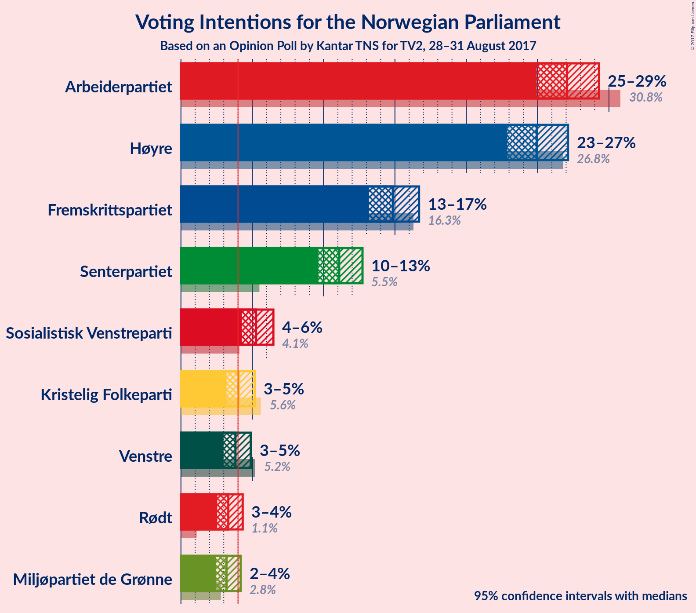
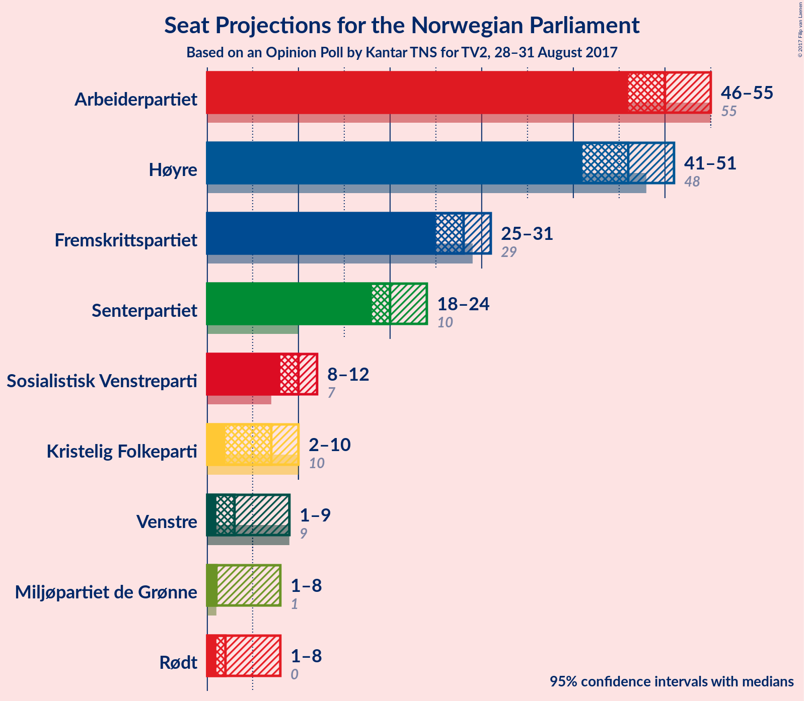
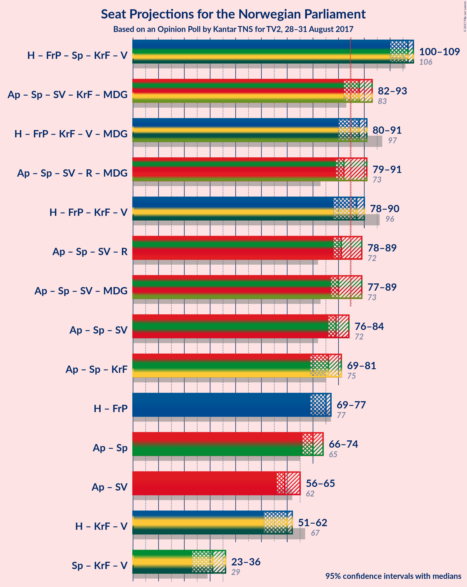

# Opinion Poll by Kantar TNS for TV2, 28–31 August 2017

<a href="#voting-intentions">Voting Intentions</a> | <a href="#seats">Seats</a> | <a href="#coalitions">Coalitions</a> | <a href="#technical-information">Technical Information</a>

## Voting Intentions

### Confidence Intervals

| Party | Last Result | Poll Result | 80% Confidence Interval | 90% Confidence Interval | 95% Confidence Interval | 99% Confidence Interval |
|:-----:|:-----------:|:-----------:|:-----------------------:|:-----------------------:|:-----------------------:|:-----------------------:|
| Arbeiderpartiet | 30.8% | 27.1% | 25.7–28.5% |25.3–28.9% |24.9–29.3% |24.3–30.0% |
| Høyre | 26.8% | 24.9% | 23.6–26.4% |23.2–26.8% |22.9–27.1% |22.2–27.8% |
| Fremskrittspartiet | 16.3% | 14.8% | 13.7–16.0% |13.4–16.4% |13.2–16.7% |12.7–17.3% |
| Senterpartiet | 5.5% | 11.1% | 10.1–12.2% |9.9–12.5% |9.6–12.7% |9.2–13.3% |
| Sosialistisk Venstreparti | 4.1% | 5.3% | 4.6–6.1% |4.4–6.3% |4.3–6.5% |4.0–6.9% |
| Kristelig Folkeparti | 5.6% | 4.1% | 3.5–4.8% |3.3–5.0% |3.2–5.2% |3.0–5.5% |
| Venstre | 5.2% | 3.8% | 3.3–4.5% |3.1–4.7% |3.0–4.9% |2.7–5.2% |
| Rødt | 1.1% | 3.3% | 2.8–4.0% |2.7–4.2% |2.5–4.3% |2.3–4.7% |
| Miljøpartiet de Grønne | 2.8% | 3.2% | 2.7–3.8% |2.5–4.0% |2.4–4.2% |2.2–4.5% |

*Note:* The poll result column reflects the actual value used in the calculations. Published results may vary slightly, and in addition be rounded to fewer digits.

## Seats

### Confidence Intervals

| Party | Last Result | Median | 80% Confidence Interval | 90% Confidence Interval | 95% Confidence Interval | 99% Confidence Interval |
|:-----:|:-----------:|:------:|:-----------------------:|:-----------------------:|:-----------------------:|:-----------------------:|
| <a href="#arbeiderpartiet">Arbeiderpartiet</a> | 55 | 50 | 47–54 |47–55 |46–55 |45–58 |
| <a href="#høyre">Høyre</a> | 48 | 46 | 43–49 |42–50 |41–51 |40–52 |
| <a href="#fremskrittspartiet">Fremskrittspartiet</a> | 29 | 28 | 26–31 |25–31 |25–31 |23–33 |
| <a href="#senterpartiet">Senterpartiet</a> | 10 | 20 | 19–22 |18–23 |18–24 |17–25 |
| <a href="#sosialistisk-venstreparti">Sosialistisk Venstreparti</a> | 7 | 10 | 9–11 |8–12 |8–12 |7–13 |
| <a href="#kristelig-folkeparti">Kristelig Folkeparti</a> | 10 | 7 | 2–9 |2–10 |2–10 |1–10 |
| <a href="#venstre">Venstre</a> | 9 | 3 | 1–8 |1–9 |1–9 |1–10 |
| <a href="#rødt">Rødt</a> | 0 | 2 | 2 |2–8 |1–8 |1–8 |
| <a href="#miljøpartiet-de-grønne">Miljøpartiet de Grønne</a> | 1 | 1 | 1–3 |1–4 |1–8 |1–9 |

### Arbeiderpartiet

| Number of Seats | Probability | Accumulated | Special Marks |
|:---------------:|:-----------:|:-----------:|:-------------:|
| 44 | 0.1% | 100% |  |
| 45 | 1.4% | 99.8% |  |
| 46 | 2% | 98% |  |
| 47 | 7% | 96% |  |
| 48 | 5% | 89% |  |
| 49 | 19% | 83% |  |
| 50 | 17% | 64% | Median |
| 51 | 11% | 47% |  |
| 52 | 14% | 36% |  |
| 53 | 7% | 22% |  |
| 54 | 8% | 15% |  |
| 55 | 5% | 6% | Last Result |
| 56 | 0.4% | 1.3% |  |
| 57 | 0.2% | 0.9% |  |
| 58 | 0.6% | 0.7% |  |
| 59 | 0% | 0% |  |

### Høyre

| Number of Seats | Probability | Accumulated | Special Marks |
|:---------------:|:-----------:|:-----------:|:-------------:|
| 38 | 0.1% | 100% |  |
| 39 | 0.1% | 99.9% |  |
| 40 | 1.3% | 99.8% |  |
| 41 | 2% | 98% |  |
| 42 | 2% | 96% |  |
| 43 | 4% | 94% |  |
| 44 | 7% | 90% |  |
| 45 | 27% | 83% |  |
| 46 | 12% | 55% | Median |
| 47 | 13% | 43% |  |
| 48 | 8% | 30% | Last Result |
| 49 | 14% | 22% |  |
| 50 | 4% | 7% |  |
| 51 | 2% | 3% |  |
| 52 | 0.8% | 1.2% |  |
| 53 | 0.1% | 0.4% |  |
| 54 | 0.2% | 0.2% |  |
| 55 | 0% | 0% |  |

### Fremskrittspartiet

| Number of Seats | Probability | Accumulated | Special Marks |
|:---------------:|:-----------:|:-----------:|:-------------:|
| 22 | 0.1% | 100% |  |
| 23 | 0.9% | 99.9% |  |
| 24 | 1.3% | 99.0% |  |
| 25 | 7% | 98% |  |
| 26 | 9% | 90% |  |
| 27 | 17% | 82% |  |
| 28 | 38% | 64% | Median |
| 29 | 10% | 26% | Last Result |
| 30 | 6% | 17% |  |
| 31 | 9% | 10% |  |
| 32 | 0.5% | 1.1% |  |
| 33 | 0.5% | 0.6% |  |
| 34 | 0.1% | 0.1% |  |
| 35 | 0% | 0% |  |

### Senterpartiet

| Number of Seats | Probability | Accumulated | Special Marks |
|:---------------:|:-----------:|:-----------:|:-------------:|
| 10 | 0% | 100% | Last Result |
| 11 | 0% | 100% |  |
| 12 | 0% | 100% |  |
| 13 | 0% | 100% |  |
| 14 | 0% | 100% |  |
| 15 | 0.1% | 100% |  |
| 16 | 0.3% | 99.9% |  |
| 17 | 1.1% | 99.7% |  |
| 18 | 5% | 98.5% |  |
| 19 | 15% | 93% |  |
| 20 | 36% | 78% | Median |
| 21 | 17% | 42% |  |
| 22 | 15% | 25% |  |
| 23 | 6% | 10% |  |
| 24 | 3% | 4% |  |
| 25 | 0.9% | 1.0% |  |
| 26 | 0.1% | 0.1% |  |
| 27 | 0% | 0% |  |

### Sosialistisk Venstreparti

| Number of Seats | Probability | Accumulated | Special Marks |
|:---------------:|:-----------:|:-----------:|:-------------:|
| 2 | 0.4% | 100% |  |
| 3 | 0% | 99.6% |  |
| 4 | 0% | 99.6% |  |
| 5 | 0% | 99.6% |  |
| 6 | 0% | 99.6% |  |
| 7 | 0.5% | 99.6% | Last Result |
| 8 | 8% | 99.1% |  |
| 9 | 35% | 91% |  |
| 10 | 28% | 56% | Median |
| 11 | 22% | 28% |  |
| 12 | 4% | 6% |  |
| 13 | 2% | 2% |  |
| 14 | 0.2% | 0.2% |  |
| 15 | 0% | 0% |  |

### Kristelig Folkeparti

| Number of Seats | Probability | Accumulated | Special Marks |
|:---------------:|:-----------:|:-----------:|:-------------:|
| 1 | 0.5% | 100% |  |
| 2 | 35% | 99.5% |  |
| 3 | 6% | 64% |  |
| 4 | 0% | 58% |  |
| 5 | 0% | 58% |  |
| 6 | 0% | 58% |  |
| 7 | 16% | 58% | Median |
| 8 | 27% | 43% |  |
| 9 | 10% | 15% |  |
| 10 | 5% | 5% | Last Result |
| 11 | 0.1% | 0.1% |  |
| 12 | 0% | 0% |  |

### Venstre

| Number of Seats | Probability | Accumulated | Special Marks |
|:---------------:|:-----------:|:-----------:|:-------------:|
| 1 | 13% | 100% |  |
| 2 | 28% | 87% |  |
| 3 | 21% | 59% | Median |
| 4 | 0% | 38% |  |
| 5 | 0% | 38% |  |
| 6 | 0% | 38% |  |
| 7 | 6% | 38% |  |
| 8 | 24% | 31% |  |
| 9 | 6% | 7% | Last Result |
| 10 | 0.6% | 0.6% |  |
| 11 | 0% | 0% |  |

### Rødt

| Number of Seats | Probability | Accumulated | Special Marks |
|:---------------:|:-----------:|:-----------:|:-------------:|
| 0 | 0% | 100% | Last Result |
| 1 | 5% | 100% |  |
| 2 | 86% | 95% | Median |
| 3 | 0% | 10% |  |
| 4 | 0% | 10% |  |
| 5 | 0% | 10% |  |
| 6 | 0% | 10% |  |
| 7 | 3% | 10% |  |
| 8 | 7% | 7% |  |
| 9 | 0.3% | 0.3% |  |
| 10 | 0% | 0% |  |

### Miljøpartiet de Grønne

| Number of Seats | Probability | Accumulated | Special Marks |
|:---------------:|:-----------:|:-----------:|:-------------:|
| 1 | 81% | 100% | Last Result, Median |
| 2 | 7% | 19% |  |
| 3 | 7% | 12% |  |
| 4 | 1.4% | 5% |  |
| 5 | 0% | 4% |  |
| 6 | 0% | 4% |  |
| 7 | 1.0% | 4% |  |
| 8 | 2% | 3% |  |
| 9 | 0.6% | 0.6% |  |
| 10 | 0% | 0% |  |

## Coalitions

### Confidence Intervals

| Coalition | Last Result | Median | Majority? | 80% Confidence Interval | 90% Confidence Interval | 95% Confidence Interval | 99% Confidence Interval |
|:---------:|:-----------:|:------:|:---------:|:-----------------------:|:-----------------------:|:-----------------------:|:-----------------------:|
| Høyre – Fremskrittspartiet – Senterpartiet – Kristelig Folkeparti – Venstre | 106 | 105 | 100% | 100–108 | 99–109 | 97–110 | 97–111 |
| Arbeiderpartiet – Senterpartiet – Sosialistisk Venstreparti – Kristelig Folkeparti – Miljøpartiet de Grønne | 83 | 88 | 91% | 85–92 | 82–93 | 82–94 | 80–95 |
| Arbeiderpartiet – Senterpartiet – Sosialistisk Venstreparti – Rødt – Miljøpartiet de Grønne | 73 | 85 | 53% | 81–91 | 81–91 | 80–91 | 78–94 |
| Høyre – Fremskrittspartiet – Kristelig Folkeparti – Venstre – Miljøpartiet de Grønne | 97 | 86 | 64% | 80–89 | 79–90 | 79–91 | 77–93 |
| Arbeiderpartiet – Senterpartiet – Sosialistisk Venstreparti – Rødt | 72 | 83 | 36% | 80–89 | 79–90 | 78–90 | 76–92 |
| Høyre – Fremskrittspartiet – Kristelig Folkeparti – Venstre | 96 | 84 | 47% | 78–88 | 78–88 | 78–89 | 75–91 |
| Arbeiderpartiet – Senterpartiet – Sosialistisk Venstreparti – Miljøpartiet de Grønne | 73 | 82 | 29% | 79–86 | 78–89 | 77–89 | 75–91 |
| Arbeiderpartiet – Senterpartiet – Sosialistisk Venstreparti | 72 | 81 | 13% | 77–85 | 76–88 | 76–88 | 73–88 |
| Arbeiderpartiet – Senterpartiet – Kristelig Folkeparti | 75 | 77 | 0.3% | 73–80 | 71–81 | 70–82 | 69–84 |
| Høyre – Fremskrittspartiet | 77 | 74 | 0% | 71–78 | 69–78 | 69–79 | 66–81 |
| Arbeiderpartiet – Senterpartiet | 65 | 71 | 0% | 68–75 | 67–77 | 66–77 | 64–79 |
| Arbeiderpartiet – Sosialistisk Venstreparti | 62 | 60 | 0% | 57–65 | 56–66 | 55–66 | 54–68 |
| Høyre – Kristelig Folkeparti – Venstre | 67 | 56 | 0% | 50–60 | 49–61 | 49–62 | 48–65 |
| Senterpartiet – Kristelig Folkeparti – Venstre | 29 | 31 | 0% | 25–35 | 23–36 | 23–38 | 22–39 |

### Høyre – Fremskrittspartiet – Senterpartiet – Kristelig Folkeparti – Venstre

| Number of Seats | Probability | Accumulated | Special Marks |
|:---------------:|:-----------:|:-----------:|:-------------:|
| 93 | 0% | 100% |  |
| 94 | 0% | 99.9% |  |
| 95 | 0.1% | 99.9% |  |
| 96 | 0.3% | 99.8% |  |
| 97 | 3% | 99.6% |  |
| 98 | 1.1% | 97% |  |
| 99 | 2% | 95% |  |
| 100 | 9% | 93% |  |
| 101 | 3% | 84% |  |
| 102 | 9% | 81% |  |
| 103 | 7% | 72% |  |
| 104 | 7% | 65% | Median |
| 105 | 14% | 58% |  |
| 106 | 9% | 43% | Last Result |
| 107 | 14% | 35% |  |
| 108 | 14% | 21% |  |
| 109 | 3% | 7% |  |
| 110 | 2% | 4% |  |
| 111 | 2% | 2% |  |
| 112 | 0.1% | 0.3% |  |
| 113 | 0.1% | 0.2% |  |
| 114 | 0% | 0% |  |

### Arbeiderpartiet – Senterpartiet – Sosialistisk Venstreparti – Kristelig Folkeparti – Miljøpartiet de Grønne

| Number of Seats | Probability | Accumulated | Special Marks |
|:---------------:|:-----------:|:-----------:|:-------------:|
| 78 | 0.1% | 100% |  |
| 79 | 0.2% | 99.9% |  |
| 80 | 1.1% | 99.7% |  |
| 81 | 0.7% | 98.6% |  |
| 82 | 4% | 98% |  |
| 83 | 1.0% | 94% | Last Result |
| 84 | 2% | 93% |  |
| 85 | 7% | 91% | Majority |
| 86 | 15% | 83% |  |
| 87 | 11% | 68% |  |
| 88 | 19% | 57% | Median |
| 89 | 6% | 39% |  |
| 90 | 8% | 33% |  |
| 91 | 13% | 25% |  |
| 92 | 5% | 12% |  |
| 93 | 3% | 7% |  |
| 94 | 2% | 3% |  |
| 95 | 0.7% | 1.1% |  |
| 96 | 0.2% | 0.5% |  |
| 97 | 0.2% | 0.2% |  |
| 98 | 0% | 0.1% |  |
| 99 | 0% | 0% |  |

### Arbeiderpartiet – Senterpartiet – Sosialistisk Venstreparti – Rødt – Miljøpartiet de Grønne

| Number of Seats | Probability | Accumulated | Special Marks |
|:---------------:|:-----------:|:-----------:|:-------------:|
| 73 | 0% | 100% | Last Result |
| 74 | 0% | 100% |  |
| 75 | 0.1% | 100% |  |
| 76 | 0.1% | 99.9% |  |
| 77 | 0.4% | 99.9% |  |
| 78 | 0.5% | 99.5% |  |
| 79 | 1.5% | 99.0% |  |
| 80 | 2% | 98% |  |
| 81 | 14% | 95% |  |
| 82 | 16% | 81% |  |
| 83 | 7% | 65% | Median |
| 84 | 5% | 58% |  |
| 85 | 12% | 53% | Majority |
| 86 | 7% | 42% |  |
| 87 | 10% | 35% |  |
| 88 | 9% | 25% |  |
| 89 | 2% | 15% |  |
| 90 | 2% | 13% |  |
| 91 | 9% | 11% |  |
| 92 | 0.7% | 2% |  |
| 93 | 0.4% | 1.0% |  |
| 94 | 0.5% | 0.6% |  |
| 95 | 0% | 0.1% |  |
| 96 | 0% | 0% |  |

### Høyre – Fremskrittspartiet – Kristelig Folkeparti – Venstre – Miljøpartiet de Grønne

| Number of Seats | Probability | Accumulated | Special Marks |
|:---------------:|:-----------:|:-----------:|:-------------:|
| 76 | 0.4% | 100% |  |
| 77 | 0.3% | 99.6% |  |
| 78 | 0.2% | 99.3% |  |
| 79 | 8% | 99.1% |  |
| 80 | 2% | 91% |  |
| 81 | 1.2% | 88% |  |
| 82 | 6% | 87% |  |
| 83 | 12% | 81% |  |
| 84 | 5% | 70% |  |
| 85 | 12% | 64% | Median, Majority |
| 86 | 5% | 52% |  |
| 87 | 9% | 47% |  |
| 88 | 15% | 38% |  |
| 89 | 15% | 24% |  |
| 90 | 4% | 8% |  |
| 91 | 2% | 4% |  |
| 92 | 0.9% | 2% |  |
| 93 | 0.6% | 1.1% |  |
| 94 | 0.4% | 0.5% |  |
| 95 | 0.1% | 0.1% |  |
| 96 | 0% | 0% |  |
| 97 | 0% | 0% | Last Result |

### Arbeiderpartiet – Senterpartiet – Sosialistisk Venstreparti – Rødt

| Number of Seats | Probability | Accumulated | Special Marks |
|:---------------:|:-----------:|:-----------:|:-------------:|
| 72 | 0% | 100% | Last Result |
| 73 | 0% | 100% |  |
| 74 | 0.1% | 100% |  |
| 75 | 0.4% | 99.9% |  |
| 76 | 0.6% | 99.5% |  |
| 77 | 0.9% | 98.9% |  |
| 78 | 2% | 98% |  |
| 79 | 4% | 96% |  |
| 80 | 15% | 92% |  |
| 81 | 15% | 76% |  |
| 82 | 9% | 62% | Median |
| 83 | 5% | 53% |  |
| 84 | 12% | 47% |  |
| 85 | 5% | 36% | Majority |
| 86 | 12% | 30% |  |
| 87 | 6% | 19% |  |
| 88 | 1.2% | 13% |  |
| 89 | 2% | 12% |  |
| 90 | 8% | 9% |  |
| 91 | 0.2% | 0.9% |  |
| 92 | 0.3% | 0.7% |  |
| 93 | 0.4% | 0.4% |  |
| 94 | 0% | 0% |  |

### Høyre – Fremskrittspartiet – Kristelig Folkeparti – Venstre

| Number of Seats | Probability | Accumulated | Special Marks |
|:---------------:|:-----------:|:-----------:|:-------------:|
| 74 | 0% | 100% |  |
| 75 | 0.5% | 99.9% |  |
| 76 | 0.4% | 99.4% |  |
| 77 | 0.7% | 99.0% |  |
| 78 | 9% | 98% |  |
| 79 | 2% | 89% |  |
| 80 | 2% | 87% |  |
| 81 | 9% | 85% |  |
| 82 | 10% | 75% |  |
| 83 | 7% | 65% |  |
| 84 | 12% | 58% | Median |
| 85 | 5% | 47% | Majority |
| 86 | 7% | 42% |  |
| 87 | 16% | 35% |  |
| 88 | 14% | 19% |  |
| 89 | 2% | 5% |  |
| 90 | 1.5% | 2% |  |
| 91 | 0.5% | 1.0% |  |
| 92 | 0.4% | 0.5% |  |
| 93 | 0.1% | 0.1% |  |
| 94 | 0.1% | 0.1% |  |
| 95 | 0% | 0% |  |
| 96 | 0% | 0% | Last Result |

### Arbeiderpartiet – Senterpartiet – Sosialistisk Venstreparti – Miljøpartiet de Grønne

| Number of Seats | Probability | Accumulated | Special Marks |
|:---------------:|:-----------:|:-----------:|:-------------:|
| 73 | 0.1% | 100% | Last Result |
| 74 | 0.1% | 99.9% |  |
| 75 | 0.5% | 99.8% |  |
| 76 | 0.8% | 99.3% |  |
| 77 | 2% | 98.5% |  |
| 78 | 2% | 96% |  |
| 79 | 16% | 94% |  |
| 80 | 16% | 78% |  |
| 81 | 5% | 62% | Median |
| 82 | 8% | 57% |  |
| 83 | 13% | 48% |  |
| 84 | 6% | 35% |  |
| 85 | 9% | 29% | Majority |
| 86 | 9% | 19% |  |
| 87 | 2% | 10% |  |
| 88 | 0.7% | 8% |  |
| 89 | 7% | 7% |  |
| 90 | 0.4% | 0.9% |  |
| 91 | 0.4% | 0.6% |  |
| 92 | 0.2% | 0.2% |  |
| 93 | 0% | 0.1% |  |
| 94 | 0% | 0% |  |

### Arbeiderpartiet – Senterpartiet – Sosialistisk Venstreparti

| Number of Seats | Probability | Accumulated | Special Marks |
|:---------------:|:-----------:|:-----------:|:-------------:|
| 72 | 0.2% | 100% | Last Result |
| 73 | 0.4% | 99.8% |  |
| 74 | 0.7% | 99.4% |  |
| 75 | 1.2% | 98.7% |  |
| 76 | 4% | 98% |  |
| 77 | 5% | 94% |  |
| 78 | 16% | 89% |  |
| 79 | 15% | 73% |  |
| 80 | 7% | 58% | Median |
| 81 | 8% | 51% |  |
| 82 | 13% | 43% |  |
| 83 | 5% | 30% |  |
| 84 | 11% | 24% |  |
| 85 | 6% | 13% | Majority |
| 86 | 1.0% | 8% |  |
| 87 | 0.8% | 7% |  |
| 88 | 6% | 6% |  |
| 89 | 0.1% | 0.2% |  |
| 90 | 0.1% | 0.1% |  |
| 91 | 0% | 0.1% |  |
| 92 | 0% | 0% |  |

### Arbeiderpartiet – Senterpartiet – Kristelig Folkeparti

| Number of Seats | Probability | Accumulated | Special Marks |
|:---------------:|:-----------:|:-----------:|:-------------:|
| 67 | 0.1% | 100% |  |
| 68 | 0.3% | 99.9% |  |
| 69 | 2% | 99.6% |  |
| 70 | 1.1% | 98% |  |
| 71 | 3% | 97% |  |
| 72 | 4% | 94% |  |
| 73 | 2% | 90% |  |
| 74 | 7% | 88% |  |
| 75 | 15% | 81% | Last Result |
| 76 | 15% | 66% |  |
| 77 | 10% | 51% | Median |
| 78 | 13% | 41% |  |
| 79 | 9% | 29% |  |
| 80 | 10% | 20% |  |
| 81 | 4% | 9% |  |
| 82 | 3% | 5% |  |
| 83 | 0.9% | 1.5% |  |
| 84 | 0.3% | 0.5% |  |
| 85 | 0.1% | 0.3% | Majority |
| 86 | 0.1% | 0.2% |  |
| 87 | 0% | 0% |  |

### Høyre – Fremskrittspartiet

| Number of Seats | Probability | Accumulated | Special Marks |
|:---------------:|:-----------:|:-----------:|:-------------:|
| 65 | 0.3% | 100% |  |
| 66 | 0.5% | 99.7% |  |
| 67 | 0.3% | 99.2% |  |
| 68 | 1.2% | 98.9% |  |
| 69 | 3% | 98% |  |
| 70 | 4% | 95% |  |
| 71 | 7% | 91% |  |
| 72 | 8% | 84% |  |
| 73 | 25% | 76% |  |
| 74 | 4% | 51% | Median |
| 75 | 14% | 47% |  |
| 76 | 10% | 33% |  |
| 77 | 12% | 22% | Last Result |
| 78 | 7% | 10% |  |
| 79 | 1.3% | 3% |  |
| 80 | 0.9% | 2% |  |
| 81 | 1.0% | 1.2% |  |
| 82 | 0% | 0.2% |  |
| 83 | 0% | 0.1% |  |
| 84 | 0.1% | 0.1% |  |
| 85 | 0% | 0% | Majority |

### Arbeiderpartiet – Senterpartiet

| Number of Seats | Probability | Accumulated | Special Marks |
|:---------------:|:-----------:|:-----------:|:-------------:|
| 63 | 0.1% | 100% |  |
| 64 | 0.7% | 99.9% |  |
| 65 | 0.9% | 99.2% | Last Result |
| 66 | 3% | 98% |  |
| 67 | 4% | 95% |  |
| 68 | 4% | 91% |  |
| 69 | 19% | 87% |  |
| 70 | 15% | 68% | Median |
| 71 | 5% | 52% |  |
| 72 | 16% | 47% |  |
| 73 | 15% | 30% |  |
| 74 | 3% | 15% |  |
| 75 | 4% | 12% |  |
| 76 | 2% | 8% |  |
| 77 | 5% | 7% |  |
| 78 | 0.7% | 1.2% |  |
| 79 | 0.4% | 0.5% |  |
| 80 | 0.1% | 0.1% |  |
| 81 | 0.1% | 0.1% |  |
| 82 | 0% | 0% |  |

### Arbeiderpartiet – Sosialistisk Venstreparti

| Number of Seats | Probability | Accumulated | Special Marks |
|:---------------:|:-----------:|:-----------:|:-------------:|
| 51 | 0% | 100% |  |
| 52 | 0.1% | 99.9% |  |
| 53 | 0.2% | 99.8% |  |
| 54 | 0.6% | 99.7% |  |
| 55 | 3% | 99.1% |  |
| 56 | 3% | 96% |  |
| 57 | 6% | 93% |  |
| 58 | 17% | 87% |  |
| 59 | 13% | 70% |  |
| 60 | 10% | 57% | Median |
| 61 | 15% | 46% |  |
| 62 | 7% | 32% | Last Result |
| 63 | 9% | 25% |  |
| 64 | 6% | 16% |  |
| 65 | 4% | 10% |  |
| 66 | 5% | 6% |  |
| 67 | 0.5% | 1.3% |  |
| 68 | 0.7% | 0.7% |  |
| 69 | 0% | 0.1% |  |
| 70 | 0% | 0% |  |

### Høyre – Kristelig Folkeparti – Venstre

| Number of Seats | Probability | Accumulated | Special Marks |
|:---------------:|:-----------:|:-----------:|:-------------:|
| 45 | 0% | 100% |  |
| 46 | 0.1% | 99.9% |  |
| 47 | 0.2% | 99.9% |  |
| 48 | 0.5% | 99.7% |  |
| 49 | 5% | 99.2% |  |
| 50 | 5% | 94% |  |
| 51 | 6% | 89% |  |
| 52 | 3% | 83% |  |
| 53 | 8% | 80% |  |
| 54 | 3% | 72% |  |
| 55 | 7% | 68% |  |
| 56 | 12% | 61% | Median |
| 57 | 8% | 49% |  |
| 58 | 5% | 41% |  |
| 59 | 6% | 36% |  |
| 60 | 23% | 30% |  |
| 61 | 5% | 7% |  |
| 62 | 1.0% | 3% |  |
| 63 | 0.5% | 2% |  |
| 64 | 0.3% | 1.1% |  |
| 65 | 0.7% | 0.8% |  |
| 66 | 0% | 0.1% |  |
| 67 | 0% | 0% | Last Result |

### Senterpartiet – Kristelig Folkeparti – Venstre

| Number of Seats | Probability | Accumulated | Special Marks |
|:---------------:|:-----------:|:-----------:|:-------------:|
| 21 | 0.1% | 100% |  |
| 22 | 0.6% | 99.9% |  |
| 23 | 4% | 99.3% |  |
| 24 | 3% | 95% |  |
| 25 | 12% | 92% |  |
| 26 | 4% | 80% |  |
| 27 | 2% | 76% |  |
| 28 | 3% | 74% |  |
| 29 | 4% | 70% | Last Result |
| 30 | 11% | 66% | Median |
| 31 | 10% | 54% |  |
| 32 | 11% | 44% |  |
| 33 | 8% | 34% |  |
| 34 | 2% | 25% |  |
| 35 | 18% | 24% |  |
| 36 | 2% | 6% |  |
| 37 | 2% | 5% |  |
| 38 | 2% | 3% |  |
| 39 | 0.7% | 0.9% |  |
| 40 | 0% | 0.1% |  |
| 41 | 0.1% | 0.1% |  |
| 42 | 0% | 0% |  |

## Technical Information

### Opinion Poll

+ **Pollster:** Kantar TNS
+ **Media:** TV2
+ **Fieldwork period:** 28–31 August 2017

### Calculations

+ **Sample size:** 1596
+ **Simulations done:** 1,048,576
+ **Error estimate:** 1.37%

