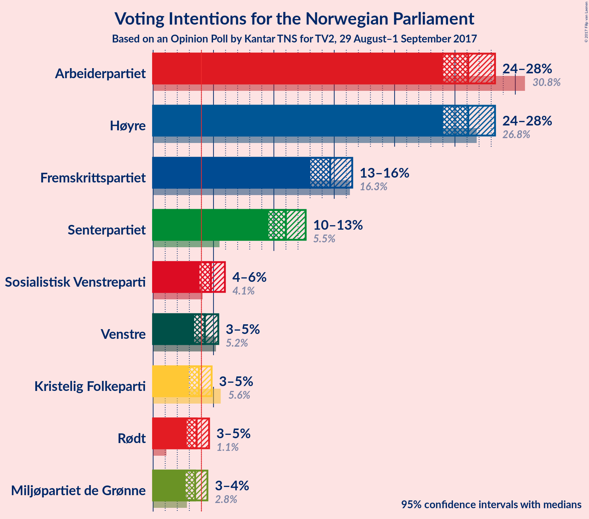
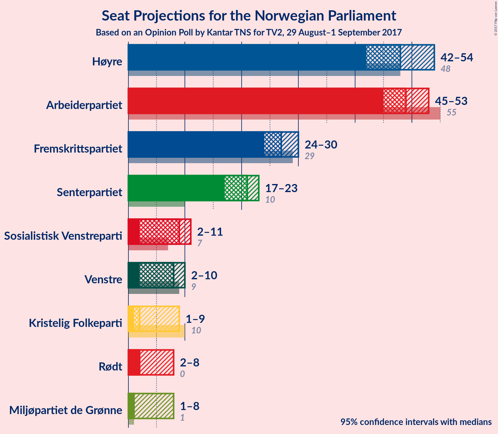
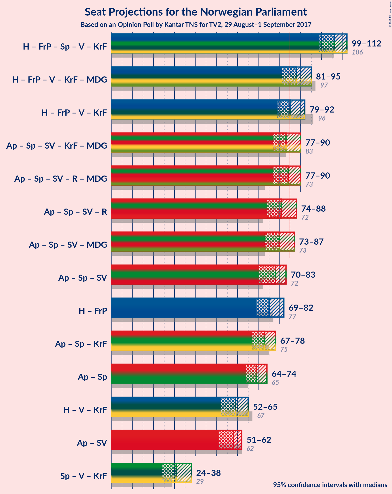

# Opinion Poll by Kantar TNS for TV2, 29 August–1 September 2017

<a href="#voting-intentions">Voting Intentions</a> | <a href="#seats">Seats</a> | <a href="#coalitions">Coalitions</a> | <a href="#technical-information">Technical Information</a>

## Voting Intentions

### Confidence Intervals

| Party | Last Result | Poll Result | 80% Confidence Interval | 90% Confidence Interval | 95% Confidence Interval | 99% Confidence Interval |
|:-----:|:-----------:|:-----------:|:-----------------------:|:-----------------------:|:-----------------------:|:-----------------------:|
| Arbeiderpartiet | 30.8% | 26.1% | 24.7–27.5% |24.3–28.0% |24.0–28.3% |23.4–29.0% |
| Høyre | 26.8% | 26.1% | 24.7–27.5% |24.3–28.0% |24.0–28.3% |23.4–29.0% |
| Fremskrittspartiet | 16.3% | 14.7% | 13.6–15.9% |13.3–16.2% |13.0–16.5% |12.5–17.1% |
| Senterpartiet | 5.5% | 11.0% | 10.0–12.1% |9.8–12.4% |9.6–12.6% |9.1–13.2% |
| Sosialistisk Venstreparti | 4.1% | 4.8% | 4.2–5.5% |4.0–5.8% |3.8–5.9% |3.6–6.3% |
| Venstre | 5.2% | 4.3% | 3.7–5.0% |3.5–5.2% |3.4–5.4% |3.1–5.8% |
| Kristelig Folkeparti | 5.6% | 3.8% | 3.2–4.5% |3.1–4.7% |3.0–4.8% |2.7–5.2% |
| Rødt | 1.1% | 3.6% | 3.1–4.3% |2.9–4.5% |2.8–4.6% |2.6–5.0% |
| Miljøpartiet de Grønne | 2.8% | 3.5% | 3.0–4.1% |2.8–4.3% |2.7–4.5% |2.5–4.8% |

*Note:* The poll result column reflects the actual value used in the calculations. Published results may vary slightly, and in addition be rounded to fewer digits.

## Seats

### Confidence Intervals

| Party | Last Result | Median | 80% Confidence Interval | 90% Confidence Interval | 95% Confidence Interval | 99% Confidence Interval |
|:-----:|:-----------:|:------:|:-----------------------:|:-----------------------:|:-----------------------:|:-----------------------:|
| <a href="#arbeiderpartiet">Arbeiderpartiet</a> | 55 | 49 | 46–51 |45–52 |45–53 |44–55 |
| <a href="#høyre">Høyre</a> | 48 | 48 | 45–52 |43–54 |42–54 |41–55 |
| <a href="#fremskrittspartiet">Fremskrittspartiet</a> | 29 | 27 | 24–29 |24–30 |24–30 |23–32 |
| <a href="#senterpartiet">Senterpartiet</a> | 10 | 21 | 19–22 |18–22 |17–23 |16–25 |
| <a href="#sosialistisk-venstreparti">Sosialistisk Venstreparti</a> | 7 | 9 | 7–10 |2–10 |2–11 |1–12 |
| <a href="#venstre">Venstre</a> | 9 | 8 | 2–9 |2–10 |2–10 |1–11 |
| <a href="#kristelig-folkeparti">Kristelig Folkeparti</a> | 10 | 2 | 2–8 |2–8 |1–9 |1–10 |
| <a href="#rødt">Rødt</a> | 0 | 2 | 2–8 |2–8 |2–8 |1–9 |
| <a href="#miljøpartiet-de-grønne">Miljøpartiet de Grønne</a> | 1 | 1 | 1–7 |1–7 |1–8 |1–9 |

### Arbeiderpartiet

*For a full overview of the results for this party, see the [Arbeiderpartiet](party-arbeiderpartiet.html) page.*

| Number of Seats | Probability | Accumulated | Special Marks |
|:---------------:|:-----------:|:-----------:|:-------------:|
| 41 | 0% | 100% |  |
| 42 | 0.1% | 99.9% |  |
| 43 | 0.3% | 99.8% |  |
| 44 | 1.3% | 99.5% |  |
| 45 | 5% | 98% |  |
| 46 | 9% | 93% |  |
| 47 | 12% | 84% |  |
| 48 | 16% | 72% |  |
| 49 | 20% | 56% | Median |
| 50 | 15% | 36% |  |
| 51 | 14% | 21% |  |
| 52 | 3% | 7% |  |
| 53 | 2% | 4% |  |
| 54 | 1.3% | 2% |  |
| 55 | 0.4% | 0.7% | Last Result |
| 56 | 0.3% | 0.3% |  |
| 57 | 0% | 0.1% |  |
| 58 | 0% | 0% |  |

### Høyre

*For a full overview of the results for this party, see the [Høyre](party-hyre.html) page.*

| Number of Seats | Probability | Accumulated | Special Marks |
|:---------------:|:-----------:|:-----------:|:-------------:|
| 39 | 0.2% | 100% |  |
| 40 | 0.2% | 99.8% |  |
| 41 | 0.9% | 99.6% |  |
| 42 | 2% | 98.7% |  |
| 43 | 3% | 97% |  |
| 44 | 4% | 95% |  |
| 45 | 10% | 91% |  |
| 46 | 8% | 81% |  |
| 47 | 13% | 73% |  |
| 48 | 10% | 59% | Last Result, Median |
| 49 | 14% | 50% |  |
| 50 | 16% | 36% |  |
| 51 | 3% | 21% |  |
| 52 | 8% | 17% |  |
| 53 | 0.7% | 9% |  |
| 54 | 7% | 8% |  |
| 55 | 0.9% | 1.1% |  |
| 56 | 0.1% | 0.2% |  |
| 57 | 0.1% | 0.1% |  |
| 58 | 0% | 0% |  |

### Fremskrittspartiet

*For a full overview of the results for this party, see the [Fremskrittspartiet](party-fremskrittspartiet.html) page.*

| Number of Seats | Probability | Accumulated | Special Marks |
|:---------------:|:-----------:|:-----------:|:-------------:|
| 21 | 0.1% | 100% |  |
| 22 | 0.3% | 99.9% |  |
| 23 | 2% | 99.6% |  |
| 24 | 8% | 98% |  |
| 25 | 13% | 89% |  |
| 26 | 20% | 76% |  |
| 27 | 11% | 56% | Median |
| 28 | 25% | 45% |  |
| 29 | 11% | 20% | Last Result |
| 30 | 7% | 10% |  |
| 31 | 2% | 2% |  |
| 32 | 0.4% | 0.6% |  |
| 33 | 0.1% | 0.2% |  |
| 34 | 0.1% | 0.1% |  |
| 35 | 0% | 0% |  |

### Senterpartiet

*For a full overview of the results for this party, see the [Senterpartiet](party-senterpartiet.html) page.*

| Number of Seats | Probability | Accumulated | Special Marks |
|:---------------:|:-----------:|:-----------:|:-------------:|
| 10 | 0% | 100% | Last Result |
| 11 | 0% | 100% |  |
| 12 | 0% | 100% |  |
| 13 | 0% | 100% |  |
| 14 | 0.1% | 100% |  |
| 15 | 0.2% | 99.9% |  |
| 16 | 1.2% | 99.6% |  |
| 17 | 3% | 98% |  |
| 18 | 5% | 96% |  |
| 19 | 16% | 91% |  |
| 20 | 23% | 74% |  |
| 21 | 32% | 51% | Median |
| 22 | 14% | 19% |  |
| 23 | 3% | 5% |  |
| 24 | 1.2% | 2% |  |
| 25 | 0.5% | 0.6% |  |
| 26 | 0.1% | 0.1% |  |
| 27 | 0% | 0% |  |

### Sosialistisk Venstreparti

*For a full overview of the results for this party, see the [Sosialistisk Venstreparti](party-sosialistiskvenstreparti.html) page.*

| Number of Seats | Probability | Accumulated | Special Marks |
|:---------------:|:-----------:|:-----------:|:-------------:|
| 1 | 0.6% | 100% |  |
| 2 | 7% | 99.4% |  |
| 3 | 0% | 92% |  |
| 4 | 0% | 92% |  |
| 5 | 0% | 92% |  |
| 6 | 0% | 92% |  |
| 7 | 4% | 92% | Last Result |
| 8 | 32% | 88% |  |
| 9 | 33% | 57% | Median |
| 10 | 19% | 23% |  |
| 11 | 4% | 5% |  |
| 12 | 0.9% | 1.0% |  |
| 13 | 0.1% | 0.1% |  |
| 14 | 0% | 0% |  |

### Venstre

*For a full overview of the results for this party, see the [Venstre](party-venstre.html) page.*

| Number of Seats | Probability | Accumulated | Special Marks |
|:---------------:|:-----------:|:-----------:|:-------------:|
| 1 | 1.2% | 100% |  |
| 2 | 11% | 98.8% |  |
| 3 | 26% | 88% |  |
| 4 | 0% | 62% |  |
| 5 | 0% | 62% |  |
| 6 | 0.1% | 62% |  |
| 7 | 9% | 62% |  |
| 8 | 34% | 53% | Median |
| 9 | 13% | 20% | Last Result |
| 10 | 5% | 6% |  |
| 11 | 1.2% | 1.2% |  |
| 12 | 0% | 0% |  |

### Kristelig Folkeparti

*For a full overview of the results for this party, see the [Kristelig Folkeparti](party-kristeligfolkeparti.html) page.*

| Number of Seats | Probability | Accumulated | Special Marks |
|:---------------:|:-----------:|:-----------:|:-------------:|
| 1 | 5% | 100% |  |
| 2 | 53% | 95% | Median |
| 3 | 11% | 43% |  |
| 4 | 0% | 31% |  |
| 5 | 0% | 31% |  |
| 6 | 0.1% | 31% |  |
| 7 | 11% | 31% |  |
| 8 | 16% | 20% |  |
| 9 | 4% | 5% |  |
| 10 | 0.5% | 0.6% | Last Result |
| 11 | 0% | 0% |  |

### Rødt

*For a full overview of the results for this party, see the [Rødt](party-rdt.html) page.*

| Number of Seats | Probability | Accumulated | Special Marks |
|:---------------:|:-----------:|:-----------:|:-------------:|
| 0 | 0% | 100% | Last Result |
| 1 | 1.1% | 100% |  |
| 2 | 65% | 98.9% | Median |
| 3 | 0% | 33% |  |
| 4 | 0% | 33% |  |
| 5 | 0% | 33% |  |
| 6 | 0.3% | 33% |  |
| 7 | 11% | 33% |  |
| 8 | 20% | 22% |  |
| 9 | 2% | 2% |  |
| 10 | 0.1% | 0.1% |  |
| 11 | 0% | 0% |  |

### Miljøpartiet de Grønne

*For a full overview of the results for this party, see the [Miljøpartiet de Grønne](party-miljpartietdegrnne.html) page.*

| Number of Seats | Probability | Accumulated | Special Marks |
|:---------------:|:-----------:|:-----------:|:-------------:|
| 1 | 59% | 100% | Last Result, Median |
| 2 | 10% | 41% |  |
| 3 | 18% | 31% |  |
| 4 | 1.2% | 13% |  |
| 5 | 0% | 12% |  |
| 6 | 0.1% | 12% |  |
| 7 | 7% | 12% |  |
| 8 | 4% | 5% |  |
| 9 | 0.8% | 0.8% |  |
| 10 | 0% | 0% |  |

## Coalitions

### Confidence Intervals

| Coalition | Last Result | Median | Majority? | 80% Confidence Interval | 90% Confidence Interval | 95% Confidence Interval | 99% Confidence Interval |
|:---------:|:-----------:|:------:|:---------:|:-----------------------:|:-----------------------:|:-----------------------:|:-----------------------:|
| Høyre – Fremskrittspartiet – Senterpartiet – Venstre – Kristelig Folkeparti | 106 | 106 | 100% | 100–110 | 100–111 | 99–112 | 97–115 |
| Høyre – Fremskrittspartiet – Venstre – Kristelig Folkeparti – Miljøpartiet de Grønne | 97 | 88 | 78% | 83–92 | 81–94 | 81–95 | 81–98 |
| Høyre – Fremskrittspartiet – Venstre – Kristelig Folkeparti | 96 | 85 | 65% | 80–90 | 80–91 | 79–92 | 77–95 |
| Arbeiderpartiet – Senterpartiet – Sosialistisk Venstreparti – Kristelig Folkeparti – Miljøpartiet de Grønne | 83 | 83 | 32% | 80–88 | 78–89 | 77–90 | 76–92 |
| Arbeiderpartiet – Senterpartiet – Sosialistisk Venstreparti – Rødt – Miljøpartiet de Grønne | 73 | 84 | 35% | 79–89 | 78–89 | 77–90 | 74–92 |
| Arbeiderpartiet – Senterpartiet – Sosialistisk Venstreparti – Rødt | 72 | 81 | 22% | 77–86 | 75–88 | 74–88 | 71–88 |
| Arbeiderpartiet – Senterpartiet – Sosialistisk Venstreparti – Miljøpartiet de Grønne | 73 | 80 | 5% | 75–83 | 74–85 | 73–87 | 70–88 |
| Arbeiderpartiet – Senterpartiet – Sosialistisk Venstreparti | 72 | 78 | 0.4% | 73–80 | 72–81 | 70–83 | 69–84 |
| Høyre – Fremskrittspartiet | 77 | 75 | 0.1% | 71–80 | 70–82 | 69–82 | 68–83 |
| Arbeiderpartiet – Senterpartiet – Kristelig Folkeparti | 75 | 73 | 0% | 70–77 | 69–78 | 67–78 | 66–81 |
| Arbeiderpartiet – Senterpartiet | 65 | 69 | 0% | 65–72 | 64–73 | 64–74 | 62–77 |
| Høyre – Venstre – Kristelig Folkeparti | 67 | 59 | 0% | 53–63 | 52–65 | 52–65 | 50–67 |
| Arbeiderpartiet – Sosialistisk Venstreparti | 62 | 58 | 0% | 54–60 | 52–61 | 51–62 | 48–64 |
| Senterpartiet – Venstre – Kristelig Folkeparti | 29 | 31 | 0% | 25–35 | 25–36 | 24–38 | 23–39 |

### Høyre – Fremskrittspartiet – Senterpartiet – Venstre – Kristelig Folkeparti

| Number of Seats | Probability | Accumulated | Special Marks |
|:---------------:|:-----------:|:-----------:|:-------------:|
| 94 | 0.1% | 100% |  |
| 95 | 0.1% | 99.9% |  |
| 96 | 0.2% | 99.8% |  |
| 97 | 0.6% | 99.6% |  |
| 98 | 1.4% | 99.0% |  |
| 99 | 2% | 98% |  |
| 100 | 7% | 96% |  |
| 101 | 6% | 89% |  |
| 102 | 3% | 83% |  |
| 103 | 6% | 80% |  |
| 104 | 9% | 75% |  |
| 105 | 5% | 65% |  |
| 106 | 15% | 60% | Last Result, Median |
| 107 | 13% | 45% |  |
| 108 | 13% | 33% |  |
| 109 | 5% | 19% |  |
| 110 | 4% | 14% |  |
| 111 | 5% | 10% |  |
| 112 | 2% | 4% |  |
| 113 | 1.1% | 2% |  |
| 114 | 0.2% | 0.9% |  |
| 115 | 0.6% | 0.7% |  |
| 116 | 0.1% | 0.2% |  |
| 117 | 0.1% | 0.1% |  |
| 118 | 0% | 0% |  |

### Høyre – Fremskrittspartiet – Venstre – Kristelig Folkeparti – Miljøpartiet de Grønne

| Number of Seats | Probability | Accumulated | Special Marks |
|:---------------:|:-----------:|:-----------:|:-------------:|
| 78 | 0.1% | 100% |  |
| 79 | 0.1% | 99.9% |  |
| 80 | 0.2% | 99.8% |  |
| 81 | 6% | 99.6% |  |
| 82 | 1.2% | 93% |  |
| 83 | 3% | 92% |  |
| 84 | 11% | 89% |  |
| 85 | 5% | 78% | Majority |
| 86 | 4% | 73% | Median |
| 87 | 14% | 69% |  |
| 88 | 19% | 55% |  |
| 89 | 11% | 36% |  |
| 90 | 5% | 25% |  |
| 91 | 5% | 20% |  |
| 92 | 5% | 14% |  |
| 93 | 5% | 10% |  |
| 94 | 3% | 5% |  |
| 95 | 1.0% | 3% |  |
| 96 | 0.5% | 1.5% |  |
| 97 | 0.4% | 0.9% | Last Result |
| 98 | 0.4% | 0.5% |  |
| 99 | 0.1% | 0.1% |  |
| 100 | 0% | 0% |  |

### Høyre – Fremskrittspartiet – Venstre – Kristelig Folkeparti

| Number of Seats | Probability | Accumulated | Special Marks |
|:---------------:|:-----------:|:-----------:|:-------------:|
| 75 | 0.1% | 100% |  |
| 76 | 0.2% | 99.9% |  |
| 77 | 0.4% | 99.6% |  |
| 78 | 0.5% | 99.2% |  |
| 79 | 2% | 98.7% |  |
| 80 | 9% | 96% |  |
| 81 | 4% | 87% |  |
| 82 | 3% | 83% |  |
| 83 | 9% | 80% |  |
| 84 | 6% | 71% |  |
| 85 | 15% | 65% | Median, Majority |
| 86 | 13% | 50% |  |
| 87 | 11% | 37% |  |
| 88 | 9% | 27% |  |
| 89 | 7% | 18% |  |
| 90 | 3% | 10% |  |
| 91 | 2% | 7% |  |
| 92 | 2% | 5% |  |
| 93 | 2% | 2% |  |
| 94 | 0.3% | 0.8% |  |
| 95 | 0.2% | 0.5% |  |
| 96 | 0.3% | 0.4% | Last Result |
| 97 | 0% | 0% |  |

### Arbeiderpartiet – Senterpartiet – Sosialistisk Venstreparti – Kristelig Folkeparti – Miljøpartiet de Grønne

| Number of Seats | Probability | Accumulated | Special Marks |
|:---------------:|:-----------:|:-----------:|:-------------:|
| 73 | 0.1% | 100% |  |
| 74 | 0% | 99.9% |  |
| 75 | 0.2% | 99.9% |  |
| 76 | 0.5% | 99.7% |  |
| 77 | 3% | 99.2% |  |
| 78 | 2% | 96% |  |
| 79 | 2% | 94% |  |
| 80 | 11% | 92% |  |
| 81 | 6% | 81% |  |
| 82 | 12% | 75% | Median |
| 83 | 17% | 63% | Last Result |
| 84 | 14% | 46% |  |
| 85 | 6% | 32% | Majority |
| 86 | 5% | 27% |  |
| 87 | 4% | 22% |  |
| 88 | 9% | 18% |  |
| 89 | 5% | 9% |  |
| 90 | 3% | 4% |  |
| 91 | 0.7% | 2% |  |
| 92 | 0.4% | 0.9% |  |
| 93 | 0.3% | 0.5% |  |
| 94 | 0.1% | 0.1% |  |
| 95 | 0% | 0.1% |  |
| 96 | 0% | 0% |  |

### Arbeiderpartiet – Senterpartiet – Sosialistisk Venstreparti – Rødt – Miljøpartiet de Grønne

| Number of Seats | Probability | Accumulated | Special Marks |
|:---------------:|:-----------:|:-----------:|:-------------:|
| 73 | 0.3% | 100% | Last Result |
| 74 | 0.2% | 99.6% |  |
| 75 | 0.3% | 99.5% |  |
| 76 | 2% | 99.2% |  |
| 77 | 2% | 98% |  |
| 78 | 2% | 95% |  |
| 79 | 3% | 93% |  |
| 80 | 7% | 90% |  |
| 81 | 9% | 82% |  |
| 82 | 11% | 73% | Median |
| 83 | 13% | 63% |  |
| 84 | 15% | 50% |  |
| 85 | 6% | 35% | Majority |
| 86 | 9% | 29% |  |
| 87 | 3% | 20% |  |
| 88 | 4% | 17% |  |
| 89 | 9% | 13% |  |
| 90 | 2% | 4% |  |
| 91 | 0.5% | 1.3% |  |
| 92 | 0.4% | 0.8% |  |
| 93 | 0.2% | 0.4% |  |
| 94 | 0.1% | 0.1% |  |
| 95 | 0% | 0% |  |

### Arbeiderpartiet – Senterpartiet – Sosialistisk Venstreparti – Rødt

| Number of Seats | Probability | Accumulated | Special Marks |
|:---------------:|:-----------:|:-----------:|:-------------:|
| 70 | 0.1% | 100% |  |
| 71 | 0.4% | 99.9% |  |
| 72 | 0.4% | 99.5% | Last Result |
| 73 | 0.5% | 99.1% |  |
| 74 | 1.0% | 98.5% |  |
| 75 | 3% | 97% |  |
| 76 | 5% | 95% |  |
| 77 | 5% | 90% |  |
| 78 | 5% | 86% |  |
| 79 | 5% | 80% |  |
| 80 | 11% | 75% |  |
| 81 | 19% | 64% | Median |
| 82 | 14% | 45% |  |
| 83 | 4% | 31% |  |
| 84 | 5% | 27% |  |
| 85 | 11% | 22% | Majority |
| 86 | 3% | 11% |  |
| 87 | 1.2% | 8% |  |
| 88 | 6% | 7% |  |
| 89 | 0.2% | 0.4% |  |
| 90 | 0.1% | 0.2% |  |
| 91 | 0.1% | 0.1% |  |
| 92 | 0% | 0% |  |

### Arbeiderpartiet – Senterpartiet – Sosialistisk Venstreparti – Miljøpartiet de Grønne

| Number of Seats | Probability | Accumulated | Special Marks |
|:---------------:|:-----------:|:-----------:|:-------------:|
| 69 | 0.1% | 100% |  |
| 70 | 1.3% | 99.9% |  |
| 71 | 0.4% | 98.6% |  |
| 72 | 0.4% | 98% |  |
| 73 | 1.3% | 98% | Last Result |
| 74 | 2% | 96% |  |
| 75 | 5% | 94% |  |
| 76 | 3% | 90% |  |
| 77 | 4% | 86% |  |
| 78 | 15% | 82% |  |
| 79 | 10% | 67% |  |
| 80 | 12% | 57% | Median |
| 81 | 19% | 45% |  |
| 82 | 14% | 27% |  |
| 83 | 5% | 12% |  |
| 84 | 2% | 8% |  |
| 85 | 2% | 5% | Majority |
| 86 | 0.5% | 4% |  |
| 87 | 3% | 3% |  |
| 88 | 0.4% | 0.8% |  |
| 89 | 0.1% | 0.3% |  |
| 90 | 0.1% | 0.3% |  |
| 91 | 0.1% | 0.2% |  |
| 92 | 0% | 0% |  |

### Arbeiderpartiet – Senterpartiet – Sosialistisk Venstreparti

| Number of Seats | Probability | Accumulated | Special Marks |
|:---------------:|:-----------:|:-----------:|:-------------:|
| 67 | 0.1% | 100% |  |
| 68 | 0.1% | 99.8% |  |
| 69 | 2% | 99.7% |  |
| 70 | 0.8% | 98% |  |
| 71 | 1.2% | 97% |  |
| 72 | 3% | 96% | Last Result |
| 73 | 4% | 93% |  |
| 74 | 7% | 90% |  |
| 75 | 5% | 83% |  |
| 76 | 8% | 78% |  |
| 77 | 12% | 70% |  |
| 78 | 15% | 58% |  |
| 79 | 19% | 43% | Median |
| 80 | 17% | 24% |  |
| 81 | 2% | 7% |  |
| 82 | 2% | 5% |  |
| 83 | 1.4% | 3% |  |
| 84 | 1.1% | 1.5% |  |
| 85 | 0.3% | 0.4% | Majority |
| 86 | 0% | 0.1% |  |
| 87 | 0.1% | 0.1% |  |
| 88 | 0% | 0% |  |

### Høyre – Fremskrittspartiet

| Number of Seats | Probability | Accumulated | Special Marks |
|:---------------:|:-----------:|:-----------:|:-------------:|
| 65 | 0% | 100% |  |
| 66 | 0.2% | 99.9% |  |
| 67 | 0.2% | 99.8% |  |
| 68 | 2% | 99.5% |  |
| 69 | 2% | 98% |  |
| 70 | 3% | 96% |  |
| 71 | 3% | 93% |  |
| 72 | 12% | 90% |  |
| 73 | 10% | 78% |  |
| 74 | 5% | 68% |  |
| 75 | 19% | 62% | Median |
| 76 | 12% | 43% |  |
| 77 | 7% | 32% | Last Result |
| 78 | 4% | 25% |  |
| 79 | 6% | 21% |  |
| 80 | 8% | 15% |  |
| 81 | 1.3% | 7% |  |
| 82 | 5% | 6% |  |
| 83 | 0.7% | 1.0% |  |
| 84 | 0.3% | 0.4% |  |
| 85 | 0.1% | 0.1% | Majority |
| 86 | 0% | 0.1% |  |
| 87 | 0% | 0% |  |

### Arbeiderpartiet – Senterpartiet – Kristelig Folkeparti

| Number of Seats | Probability | Accumulated | Special Marks |
|:---------------:|:-----------:|:-----------:|:-------------:|
| 63 | 0.1% | 100% |  |
| 64 | 0% | 99.9% |  |
| 65 | 0.2% | 99.9% |  |
| 66 | 0.4% | 99.7% |  |
| 67 | 3% | 99.3% |  |
| 68 | 1.2% | 97% |  |
| 69 | 4% | 96% |  |
| 70 | 6% | 92% |  |
| 71 | 15% | 86% |  |
| 72 | 16% | 71% | Median |
| 73 | 20% | 55% |  |
| 74 | 10% | 35% |  |
| 75 | 5% | 25% | Last Result |
| 76 | 8% | 20% |  |
| 77 | 4% | 12% |  |
| 78 | 5% | 8% |  |
| 79 | 1.0% | 2% |  |
| 80 | 0.7% | 1.2% |  |
| 81 | 0.1% | 0.6% |  |
| 82 | 0.2% | 0.4% |  |
| 83 | 0.1% | 0.2% |  |
| 84 | 0% | 0.1% |  |
| 85 | 0% | 0% | Majority |

### Arbeiderpartiet – Senterpartiet

| Number of Seats | Probability | Accumulated | Special Marks |
|:---------------:|:-----------:|:-----------:|:-------------:|
| 60 | 0.1% | 100% |  |
| 61 | 0.2% | 99.9% |  |
| 62 | 0.6% | 99.6% |  |
| 63 | 1.3% | 99.1% |  |
| 64 | 4% | 98% |  |
| 65 | 4% | 94% | Last Result |
| 66 | 4% | 90% |  |
| 67 | 8% | 86% |  |
| 68 | 12% | 78% |  |
| 69 | 18% | 66% |  |
| 70 | 20% | 48% | Median |
| 71 | 15% | 28% |  |
| 72 | 7% | 13% |  |
| 73 | 3% | 6% |  |
| 74 | 2% | 4% |  |
| 75 | 0.5% | 2% |  |
| 76 | 0.5% | 1.1% |  |
| 77 | 0.4% | 0.6% |  |
| 78 | 0.1% | 0.2% |  |
| 79 | 0% | 0.1% |  |
| 80 | 0.1% | 0.1% |  |
| 81 | 0% | 0% |  |

### Høyre – Venstre – Kristelig Folkeparti

| Number of Seats | Probability | Accumulated | Special Marks |
|:---------------:|:-----------:|:-----------:|:-------------:|
| 48 | 0.1% | 100% |  |
| 49 | 0.2% | 99.9% |  |
| 50 | 0.7% | 99.7% |  |
| 51 | 1.2% | 98.9% |  |
| 52 | 7% | 98% |  |
| 53 | 2% | 91% |  |
| 54 | 4% | 89% |  |
| 55 | 11% | 85% |  |
| 56 | 4% | 75% |  |
| 57 | 12% | 71% |  |
| 58 | 5% | 59% | Median |
| 59 | 16% | 54% |  |
| 60 | 8% | 38% |  |
| 61 | 11% | 30% |  |
| 62 | 7% | 20% |  |
| 63 | 5% | 13% |  |
| 64 | 2% | 8% |  |
| 65 | 4% | 6% |  |
| 66 | 1.2% | 2% |  |
| 67 | 0.4% | 0.7% | Last Result |
| 68 | 0.2% | 0.3% |  |
| 69 | 0% | 0.1% |  |
| 70 | 0% | 0% |  |

### Arbeiderpartiet – Sosialistisk Venstreparti

| Number of Seats | Probability | Accumulated | Special Marks |
|:---------------:|:-----------:|:-----------:|:-------------:|
| 47 | 0.1% | 100% |  |
| 48 | 1.3% | 99.9% |  |
| 49 | 0.3% | 98.5% |  |
| 50 | 0.6% | 98% |  |
| 51 | 1.5% | 98% |  |
| 52 | 2% | 96% |  |
| 53 | 2% | 94% |  |
| 54 | 5% | 91% |  |
| 55 | 8% | 86% |  |
| 56 | 14% | 78% |  |
| 57 | 12% | 64% |  |
| 58 | 26% | 52% | Median |
| 59 | 9% | 26% |  |
| 60 | 11% | 17% |  |
| 61 | 3% | 6% |  |
| 62 | 2% | 3% | Last Result |
| 63 | 0.6% | 1.1% |  |
| 64 | 0.2% | 0.5% |  |
| 65 | 0.2% | 0.3% |  |
| 66 | 0.1% | 0.1% |  |
| 67 | 0% | 0% |  |

### Senterpartiet – Venstre – Kristelig Folkeparti

| Number of Seats | Probability | Accumulated | Special Marks |
|:---------------:|:-----------:|:-----------:|:-------------:|
| 21 | 0% | 100% |  |
| 22 | 0.2% | 99.9% |  |
| 23 | 1.0% | 99.8% |  |
| 24 | 4% | 98.8% |  |
| 25 | 7% | 95% |  |
| 26 | 11% | 88% |  |
| 27 | 2% | 78% |  |
| 28 | 3% | 76% |  |
| 29 | 7% | 73% | Last Result |
| 30 | 7% | 66% |  |
| 31 | 16% | 58% | Median |
| 32 | 19% | 42% |  |
| 33 | 5% | 22% |  |
| 34 | 6% | 17% |  |
| 35 | 3% | 11% |  |
| 36 | 4% | 8% |  |
| 37 | 0.9% | 3% |  |
| 38 | 0.7% | 3% |  |
| 39 | 1.5% | 2% |  |
| 40 | 0.3% | 0.4% |  |
| 41 | 0.1% | 0.1% |  |
| 42 | 0% | 0% |  |

## Technical Information

### Opinion Poll

+ **Pollster:** Kantar TNS
+ **Media:** TV2
+ **Fieldwork period:** 29 August–1 September 2017

### Calculations

+ **Sample size:** 1609
+ **Simulations done:** 1,048,576
+ **Error estimate:** 2.94%

