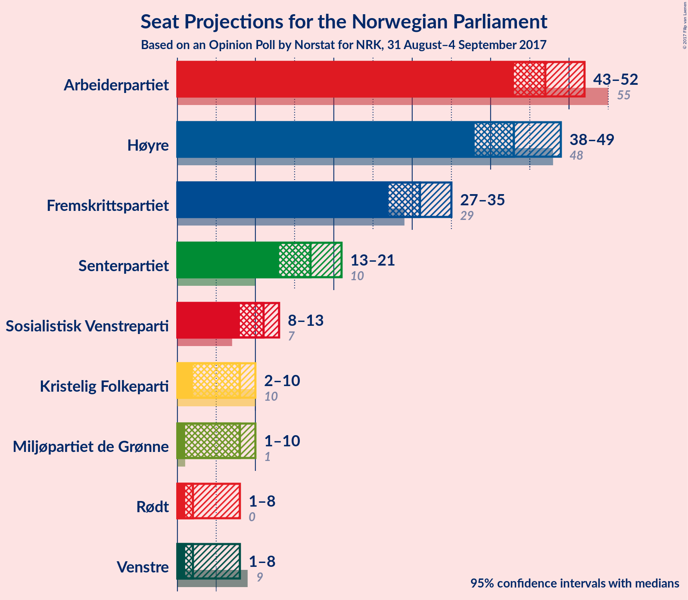
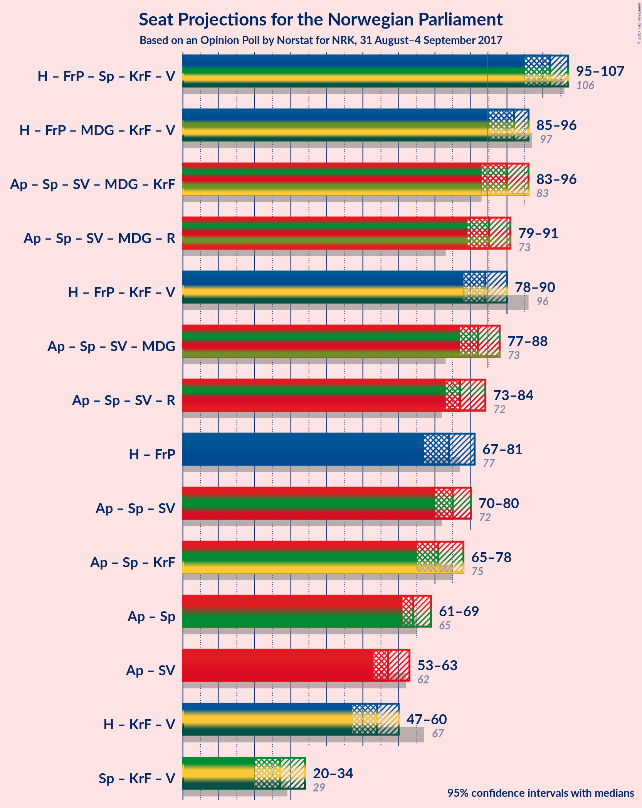

# Opinion Poll by Norstat for NRK, 31 August–4 September 2017

<a href="#voting-intentions">Voting Intentions</a> | <a href="#seats">Seats</a> | <a href="#coalitions">Coalitions</a> | <a href="#technical-information">Technical Information</a>

## Voting Intentions

### Confidence Intervals

| Party | Last Result | Poll Result | 80% Confidence Interval | 90% Confidence Interval | 95% Confidence Interval | 99% Confidence Interval |
|:-----:|:-----------:|:-----------:|:-----------------------:|:-----------------------:|:-----------------------:|:-----------------------:|
| Arbeiderpartiet | 30.8% | 25.8% | 24.2–27.5% |23.8–28.0% |23.4–28.4% |22.7–29.2% |
| Høyre | 26.8% | 24.2% | 22.7–25.9% |22.2–26.3% |21.8–26.7% |21.1–27.6% |
| Fremskrittspartiet | 16.3% | 17.0% | 15.7–18.5% |15.3–18.9% |15.0–19.3% |14.3–20.0% |
| Senterpartiet | 5.5% | 9.6% | 8.6–10.8% |8.3–11.1% |8.0–11.4% |7.6–12.0% |
| Sosialistisk Venstreparti | 4.1% | 5.9% | 5.2–6.9% |4.9–7.2% |4.7–7.5% |4.4–8.0% |
| Miljøpartiet de Grønne | 2.8% | 4.6% | 3.9–5.5% |3.7–5.7% |3.5–5.9% |3.2–6.4% |
| Kristelig Folkeparti | 5.6% | 4.5% | 3.8–5.4% |3.6–5.6% |3.5–5.9% |3.2–6.3% |
| Venstre | 5.2% | 3.5% | 2.9–4.3% |2.7–4.5% |2.6–4.7% |2.3–5.1% |
| Rødt | 1.1% | 3.2% | 2.7–4.0% |2.5–4.2% |2.4–4.4% |2.1–4.8% |

*Note:* The poll result column reflects the actual value used in the calculations. Published results may vary slightly, and in addition be rounded to fewer digits.

## Seats

### Confidence Intervals

| Party | Last Result | Median | 80% Confidence Interval | 90% Confidence Interval | 95% Confidence Interval | 99% Confidence Interval |
|:-----:|:-----------:|:------:|:-----------------------:|:-----------------------:|:-----------------------:|:-----------------------:|
| <a href="#arbeiderpartiet">Arbeiderpartiet</a> | 55 | 48 | 45–51 |45–51 |44–53 |42–53 |
| <a href="#høyre">Høyre</a> | 48 | 41 | 39–48 |38–49 |38–49 |37–49 |
| <a href="#fremskrittspartiet">Fremskrittspartiet</a> | 29 | 32 | 29–34 |28–35 |28–36 |27–37 |
| <a href="#senterpartiet">Senterpartiet</a> | 10 | 16 | 15–19 |14–19 |13–20 |13–22 |
| <a href="#sosialistisk-venstreparti">Sosialistisk Venstreparti</a> | 7 | 11 | 9–12 |9–13 |9–14 |8–14 |
| <a href="#miljøpartiet-de-grønne">Miljøpartiet de Grønne</a> | 1 | 8 | 3–10 |3–10 |2–11 |1–11 |
| <a href="#kristelig-folkeparti">Kristelig Folkeparti</a> | 10 | 7 | 2–10 |2–10 |2–10 |2–11 |
| <a href="#venstre">Venstre</a> | 9 | 2 | 1–3 |1–7 |1–7 |1–8 |
| <a href="#rødt">Rødt</a> | 0 | 2 | 1–7 |1–7 |1–7 |1–8 |

### Arbeiderpartiet

*For a full overview of the results for this party, see the [Arbeiderpartiet](party-arbeiderpartiet.html) page.*

| Number of Seats | Probability | Accumulated | Special Marks |
|:---------------:|:-----------:|:-----------:|:-------------:|
| 39 | 0% | 100% |  |
| 40 | 0.1% | 99.9% |  |
| 41 | 0% | 99.8% |  |
| 42 | 0.4% | 99.8% |  |
| 43 | 0.7% | 99.4% |  |
| 44 | 3% | 98.8% |  |
| 45 | 27% | 95% |  |
| 46 | 5% | 68% |  |
| 47 | 12% | 63% |  |
| 48 | 19% | 51% | Median |
| 49 | 6% | 32% |  |
| 50 | 15% | 26% |  |
| 51 | 6% | 11% |  |
| 52 | 1.5% | 5% |  |
| 53 | 3% | 3% |  |
| 54 | 0.4% | 0.4% |  |
| 55 | 0% | 0% | Last Result |

### Høyre

*For a full overview of the results for this party, see the [Høyre](party-hyre.html) page.*

| Number of Seats | Probability | Accumulated | Special Marks |
|:---------------:|:-----------:|:-----------:|:-------------:|
| 36 | 0.1% | 100% |  |
| 37 | 2% | 99.9% |  |
| 38 | 3% | 98% |  |
| 39 | 5% | 94% |  |
| 40 | 28% | 89% |  |
| 41 | 15% | 61% | Median |
| 42 | 10% | 46% |  |
| 43 | 3% | 36% |  |
| 44 | 7% | 33% |  |
| 45 | 11% | 26% |  |
| 46 | 2% | 14% |  |
| 47 | 2% | 12% |  |
| 48 | 1.1% | 10% | Last Result |
| 49 | 9% | 9% |  |
| 50 | 0.1% | 0.3% |  |
| 51 | 0.1% | 0.2% |  |
| 52 | 0.1% | 0.1% |  |
| 53 | 0% | 0% |  |

### Fremskrittspartiet

*For a full overview of the results for this party, see the [Fremskrittspartiet](party-fremskrittspartiet.html) page.*

| Number of Seats | Probability | Accumulated | Special Marks |
|:---------------:|:-----------:|:-----------:|:-------------:|
| 24 | 0.3% | 100% |  |
| 25 | 0% | 99.7% |  |
| 26 | 0.2% | 99.7% |  |
| 27 | 2% | 99.5% |  |
| 28 | 5% | 98% |  |
| 29 | 8% | 93% | Last Result |
| 30 | 4% | 85% |  |
| 31 | 31% | 81% |  |
| 32 | 22% | 50% | Median |
| 33 | 18% | 28% |  |
| 34 | 4% | 10% |  |
| 35 | 2% | 7% |  |
| 36 | 4% | 5% |  |
| 37 | 1.0% | 1.1% |  |
| 38 | 0% | 0.1% |  |
| 39 | 0% | 0% |  |

### Senterpartiet

*For a full overview of the results for this party, see the [Senterpartiet](party-senterpartiet.html) page.*

| Number of Seats | Probability | Accumulated | Special Marks |
|:---------------:|:-----------:|:-----------:|:-------------:|
| 10 | 0% | 100% | Last Result |
| 11 | 0% | 100% |  |
| 12 | 0.2% | 100% |  |
| 13 | 2% | 99.8% |  |
| 14 | 3% | 97% |  |
| 15 | 6% | 94% |  |
| 16 | 39% | 89% | Median |
| 17 | 22% | 49% |  |
| 18 | 13% | 27% |  |
| 19 | 10% | 14% |  |
| 20 | 3% | 5% |  |
| 21 | 0.5% | 2% |  |
| 22 | 2% | 2% |  |
| 23 | 0% | 0% |  |

### Sosialistisk Venstreparti

*For a full overview of the results for this party, see the [Sosialistisk Venstreparti](party-sosialistiskvenstreparti.html) page.*

| Number of Seats | Probability | Accumulated | Special Marks |
|:---------------:|:-----------:|:-----------:|:-------------:|
| 2 | 0.2% | 100% |  |
| 3 | 0% | 99.8% |  |
| 4 | 0% | 99.8% |  |
| 5 | 0% | 99.8% |  |
| 6 | 0% | 99.8% |  |
| 7 | 0.1% | 99.8% | Last Result |
| 8 | 2% | 99.6% |  |
| 9 | 13% | 98% |  |
| 10 | 28% | 84% |  |
| 11 | 18% | 56% | Median |
| 12 | 33% | 38% |  |
| 13 | 3% | 6% |  |
| 14 | 3% | 3% |  |
| 15 | 0.1% | 0.2% |  |
| 16 | 0.1% | 0.1% |  |
| 17 | 0% | 0% |  |

### Miljøpartiet de Grønne

*For a full overview of the results for this party, see the [Miljøpartiet de Grønne](party-miljpartietdegrnne.html) page.*

| Number of Seats | Probability | Accumulated | Special Marks |
|:---------------:|:-----------:|:-----------:|:-------------:|
| 1 | 2% | 100% | Last Result |
| 2 | 1.3% | 98% |  |
| 3 | 12% | 97% |  |
| 4 | 0.8% | 84% |  |
| 5 | 0% | 83% |  |
| 6 | 0.1% | 83% |  |
| 7 | 6% | 83% |  |
| 8 | 32% | 78% | Median |
| 9 | 36% | 46% |  |
| 10 | 8% | 10% |  |
| 11 | 2% | 3% |  |
| 12 | 0.2% | 0.2% |  |
| 13 | 0% | 0% |  |

### Kristelig Folkeparti

*For a full overview of the results for this party, see the [Kristelig Folkeparti](party-kristeligfolkeparti.html) page.*

| Number of Seats | Probability | Accumulated | Special Marks |
|:---------------:|:-----------:|:-----------:|:-------------:|
| 1 | 0.4% | 100% |  |
| 2 | 15% | 99.6% |  |
| 3 | 8% | 85% |  |
| 4 | 0% | 76% |  |
| 5 | 0% | 76% |  |
| 6 | 0.1% | 76% |  |
| 7 | 31% | 76% | Median |
| 8 | 16% | 46% |  |
| 9 | 16% | 30% |  |
| 10 | 13% | 14% | Last Result |
| 11 | 0.6% | 0.7% |  |
| 12 | 0% | 0.1% |  |
| 13 | 0% | 0% |  |

### Venstre

*For a full overview of the results for this party, see the [Venstre](party-venstre.html) page.*

| Number of Seats | Probability | Accumulated | Special Marks |
|:---------------:|:-----------:|:-----------:|:-------------:|
| 0 | 0.5% | 100% |  |
| 1 | 36% | 99.5% |  |
| 2 | 53% | 63% | Median |
| 3 | 5% | 10% |  |
| 4 | 0% | 6% |  |
| 5 | 0% | 6% |  |
| 6 | 0.3% | 6% |  |
| 7 | 3% | 5% |  |
| 8 | 2% | 2% |  |
| 9 | 0.4% | 0.5% | Last Result |
| 10 | 0.1% | 0.1% |  |
| 11 | 0% | 0% |  |

### Rødt

*For a full overview of the results for this party, see the [Rødt](party-rdt.html) page.*

| Number of Seats | Probability | Accumulated | Special Marks |
|:---------------:|:-----------:|:-----------:|:-------------:|
| 0 | 0% | 100% | Last Result |
| 1 | 13% | 100% |  |
| 2 | 54% | 87% | Median |
| 3 | 0% | 33% |  |
| 4 | 0% | 33% |  |
| 5 | 0% | 33% |  |
| 6 | 0.2% | 33% |  |
| 7 | 31% | 33% |  |
| 8 | 2% | 2% |  |
| 9 | 0.1% | 0.1% |  |
| 10 | 0% | 0% |  |

## Coalitions

### Confidence Intervals

| Coalition | Last Result | Median | Majority? | 80% Confidence Interval | 90% Confidence Interval | 95% Confidence Interval | 99% Confidence Interval |
|:---------:|:-----------:|:------:|:---------:|:-----------------------:|:-----------------------:|:-----------------------:|:-----------------------:|
| Høyre – Fremskrittspartiet – Senterpartiet – Kristelig Folkeparti – Venstre | 106 | 99 | 100% | 96–104 | 96–106 | 93–106 | 91–110 |
| Høyre – Fremskrittspartiet – Miljøpartiet de Grønne – Kristelig Folkeparti – Venstre | 97 | 89 | 97% | 88–93 | 86–95 | 84–96 | 83–98 |
| Arbeiderpartiet – Senterpartiet – Sosialistisk Venstreparti – Miljøpartiet de Grønne – Kristelig Folkeparti | 83 | 89 | 96% | 85–93 | 85–95 | 83–96 | 82–98 |
| Arbeiderpartiet – Senterpartiet – Sosialistisk Venstreparti – Miljøpartiet de Grønne – Rødt | 73 | 87 | 77% | 82–89 | 80–90 | 80–92 | 75–93 |
| Høyre – Fremskrittspartiet – Kristelig Folkeparti – Venstre | 96 | 82 | 23% | 80–87 | 79–89 | 77–89 | 76–94 |
| Arbeiderpartiet – Senterpartiet – Sosialistisk Venstreparti – Miljøpartiet de Grønne | 73 | 83 | 21% | 80–86 | 78–87 | 77–88 | 73–90 |
| Arbeiderpartiet – Senterpartiet – Sosialistisk Venstreparti – Rødt | 72 | 80 | 3% | 76–81 | 74–83 | 73–85 | 71–86 |
| Høyre – Fremskrittspartiet | 77 | 73 | 0% | 70–81 | 68–81 | 67–81 | 66–82 |
| Arbeiderpartiet – Senterpartiet – Sosialistisk Venstreparti | 72 | 75 | 0.1% | 73–79 | 72–79 | 70–80 | 68–83 |
| Arbeiderpartiet – Senterpartiet – Kristelig Folkeparti | 75 | 70 | 0% | 67–77 | 67–78 | 66–78 | 64–79 |
| Arbeiderpartiet – Senterpartiet | 65 | 65 | 0% | 61–68 | 61–68 | 60–68 | 58–70 |
| Arbeiderpartiet – Sosialistisk Venstreparti | 62 | 58 | 0% | 56–62 | 56–62 | 55–63 | 52–65 |
| Høyre – Kristelig Folkeparti – Venstre | 67 | 51 | 0% | 48–56 | 48–56 | 47–58 | 46–62 |
| Senterpartiet – Kristelig Folkeparti – Venstre | 29 | 25 | 0% | 20–30 | 20–30 | 20–33 | 19–36 |

### Høyre – Fremskrittspartiet – Senterpartiet – Kristelig Folkeparti – Venstre

| Number of Seats | Probability | Accumulated | Special Marks |
|:---------------:|:-----------:|:-----------:|:-------------:|
| 91 | 2% | 100% |  |
| 92 | 0.1% | 98% |  |
| 93 | 2% | 98% |  |
| 94 | 0.3% | 96% |  |
| 95 | 0.4% | 96% |  |
| 96 | 27% | 96% |  |
| 97 | 4% | 69% |  |
| 98 | 6% | 65% | Median |
| 99 | 13% | 59% |  |
| 100 | 6% | 45% |  |
| 101 | 12% | 39% |  |
| 102 | 6% | 27% |  |
| 103 | 10% | 21% |  |
| 104 | 2% | 11% |  |
| 105 | 1.3% | 8% |  |
| 106 | 5% | 7% | Last Result |
| 107 | 0.6% | 2% |  |
| 108 | 0.2% | 2% |  |
| 109 | 0.3% | 1.3% |  |
| 110 | 1.0% | 1.0% |  |
| 111 | 0% | 0.1% |  |
| 112 | 0% | 0.1% |  |
| 113 | 0% | 0.1% |  |
| 114 | 0% | 0% |  |

### Høyre – Fremskrittspartiet – Miljøpartiet de Grønne – Kristelig Folkeparti – Venstre

| Number of Seats | Probability | Accumulated | Special Marks |
|:---------------:|:-----------:|:-----------:|:-------------:|
| 81 | 0.1% | 100% |  |
| 82 | 0% | 99.9% |  |
| 83 | 0.4% | 99.9% |  |
| 84 | 2% | 99.4% |  |
| 85 | 2% | 97% | Majority |
| 86 | 0.6% | 95% |  |
| 87 | 3% | 95% |  |
| 88 | 10% | 92% |  |
| 89 | 32% | 82% |  |
| 90 | 2% | 50% | Median |
| 91 | 10% | 48% |  |
| 92 | 26% | 38% |  |
| 93 | 3% | 12% |  |
| 94 | 3% | 9% |  |
| 95 | 2% | 6% |  |
| 96 | 2% | 4% |  |
| 97 | 0.9% | 2% | Last Result |
| 98 | 0.6% | 1.0% |  |
| 99 | 0.3% | 0.4% |  |
| 100 | 0.1% | 0.1% |  |
| 101 | 0% | 0% |  |

### Arbeiderpartiet – Senterpartiet – Sosialistisk Venstreparti – Miljøpartiet de Grønne – Kristelig Folkeparti

| Number of Seats | Probability | Accumulated | Special Marks |
|:---------------:|:-----------:|:-----------:|:-------------:|
| 79 | 0% | 100% |  |
| 80 | 0.1% | 99.9% |  |
| 81 | 0.3% | 99.9% |  |
| 82 | 1.2% | 99.6% |  |
| 83 | 1.1% | 98% | Last Result |
| 84 | 0.9% | 97% |  |
| 85 | 10% | 96% | Majority |
| 86 | 6% | 87% |  |
| 87 | 1.4% | 81% |  |
| 88 | 10% | 80% |  |
| 89 | 29% | 70% |  |
| 90 | 4% | 41% | Median |
| 91 | 6% | 37% |  |
| 92 | 8% | 31% |  |
| 93 | 15% | 23% |  |
| 94 | 2% | 8% |  |
| 95 | 2% | 5% |  |
| 96 | 2% | 3% |  |
| 97 | 0.3% | 2% |  |
| 98 | 0.9% | 1.2% |  |
| 99 | 0.3% | 0.3% |  |
| 100 | 0% | 0% |  |

### Arbeiderpartiet – Senterpartiet – Sosialistisk Venstreparti – Miljøpartiet de Grønne – Rødt

| Number of Seats | Probability | Accumulated | Special Marks |
|:---------------:|:-----------:|:-----------:|:-------------:|
| 73 | 0% | 100% | Last Result |
| 74 | 0.2% | 100% |  |
| 75 | 0.4% | 99.8% |  |
| 76 | 0.6% | 99.4% |  |
| 77 | 0.1% | 98.8% |  |
| 78 | 0.3% | 98.7% |  |
| 79 | 0.6% | 98% |  |
| 80 | 6% | 98% |  |
| 81 | 2% | 92% |  |
| 82 | 2% | 91% |  |
| 83 | 1.3% | 89% |  |
| 84 | 10% | 88% |  |
| 85 | 17% | 77% | Median, Majority |
| 86 | 9% | 61% |  |
| 87 | 10% | 52% |  |
| 88 | 7% | 42% |  |
| 89 | 28% | 35% |  |
| 90 | 3% | 7% |  |
| 91 | 0.6% | 4% |  |
| 92 | 1.5% | 4% |  |
| 93 | 2% | 2% |  |
| 94 | 0.1% | 0.2% |  |
| 95 | 0% | 0.1% |  |
| 96 | 0% | 0% |  |

### Høyre – Fremskrittspartiet – Kristelig Folkeparti – Venstre

| Number of Seats | Probability | Accumulated | Special Marks |
|:---------------:|:-----------:|:-----------:|:-------------:|
| 74 | 0% | 100% |  |
| 75 | 0.1% | 99.9% |  |
| 76 | 2% | 99.8% |  |
| 77 | 1.5% | 98% |  |
| 78 | 0.6% | 96% |  |
| 79 | 3% | 96% |  |
| 80 | 28% | 93% |  |
| 81 | 7% | 65% |  |
| 82 | 10% | 58% | Median |
| 83 | 9% | 48% |  |
| 84 | 17% | 39% |  |
| 85 | 10% | 23% | Majority |
| 86 | 1.3% | 12% |  |
| 87 | 2% | 11% |  |
| 88 | 2% | 9% |  |
| 89 | 6% | 8% |  |
| 90 | 0.6% | 2% |  |
| 91 | 0.3% | 2% |  |
| 92 | 0.1% | 1.3% |  |
| 93 | 0.6% | 1.2% |  |
| 94 | 0.4% | 0.6% |  |
| 95 | 0.2% | 0.2% |  |
| 96 | 0% | 0% | Last Result |

### Arbeiderpartiet – Senterpartiet – Sosialistisk Venstreparti – Miljøpartiet de Grønne

| Number of Seats | Probability | Accumulated | Special Marks |
|:---------------:|:-----------:|:-----------:|:-------------:|
| 72 | 0.2% | 100% |  |
| 73 | 0.4% | 99.8% | Last Result |
| 74 | 0.8% | 99.3% |  |
| 75 | 0.5% | 98.6% |  |
| 76 | 0.3% | 98% |  |
| 77 | 0.6% | 98% |  |
| 78 | 6% | 97% |  |
| 79 | 2% | 92% |  |
| 80 | 1.2% | 90% |  |
| 81 | 4% | 89% |  |
| 82 | 32% | 85% |  |
| 83 | 17% | 53% | Median |
| 84 | 14% | 35% |  |
| 85 | 9% | 21% | Majority |
| 86 | 7% | 13% |  |
| 87 | 1.2% | 6% |  |
| 88 | 4% | 5% |  |
| 89 | 0.1% | 0.9% |  |
| 90 | 0.3% | 0.8% |  |
| 91 | 0.4% | 0.5% |  |
| 92 | 0.1% | 0.1% |  |
| 93 | 0% | 0% |  |

### Arbeiderpartiet – Senterpartiet – Sosialistisk Venstreparti – Rødt

| Number of Seats | Probability | Accumulated | Special Marks |
|:---------------:|:-----------:|:-----------:|:-------------:|
| 69 | 0.1% | 100% |  |
| 70 | 0.3% | 99.9% |  |
| 71 | 0.6% | 99.6% |  |
| 72 | 0.9% | 99.0% | Last Result |
| 73 | 2% | 98% |  |
| 74 | 2% | 96% |  |
| 75 | 3% | 94% |  |
| 76 | 3% | 91% |  |
| 77 | 26% | 88% | Median |
| 78 | 10% | 62% |  |
| 79 | 2% | 52% |  |
| 80 | 32% | 50% |  |
| 81 | 10% | 18% |  |
| 82 | 3% | 8% |  |
| 83 | 0.6% | 5% |  |
| 84 | 2% | 5% |  |
| 85 | 2% | 3% | Majority |
| 86 | 0.4% | 0.6% |  |
| 87 | 0% | 0.1% |  |
| 88 | 0.1% | 0.1% |  |
| 89 | 0% | 0% |  |

### Høyre – Fremskrittspartiet

| Number of Seats | Probability | Accumulated | Special Marks |
|:---------------:|:-----------:|:-----------:|:-------------:|
| 64 | 0.1% | 100% |  |
| 65 | 0.1% | 99.9% |  |
| 66 | 2% | 99.8% |  |
| 67 | 1.4% | 98% |  |
| 68 | 3% | 96% |  |
| 69 | 0.3% | 93% |  |
| 70 | 4% | 93% |  |
| 71 | 26% | 89% |  |
| 72 | 9% | 63% |  |
| 73 | 13% | 54% | Median |
| 74 | 5% | 41% |  |
| 75 | 5% | 36% |  |
| 76 | 3% | 31% |  |
| 77 | 6% | 28% | Last Result |
| 78 | 6% | 22% |  |
| 79 | 1.5% | 15% |  |
| 80 | 2% | 14% |  |
| 81 | 11% | 12% |  |
| 82 | 0.7% | 0.9% |  |
| 83 | 0.1% | 0.2% |  |
| 84 | 0% | 0.1% |  |
| 85 | 0% | 0% | Majority |

### Arbeiderpartiet – Senterpartiet – Sosialistisk Venstreparti

| Number of Seats | Probability | Accumulated | Special Marks |
|:---------------:|:-----------:|:-----------:|:-------------:|
| 66 | 0.1% | 100% |  |
| 67 | 0.1% | 99.9% |  |
| 68 | 0.7% | 99.8% |  |
| 69 | 0.6% | 99.1% |  |
| 70 | 1.0% | 98% |  |
| 71 | 0.7% | 97% |  |
| 72 | 3% | 97% | Last Result |
| 73 | 27% | 94% |  |
| 74 | 3% | 67% |  |
| 75 | 26% | 63% | Median |
| 76 | 15% | 38% |  |
| 77 | 1.3% | 23% |  |
| 78 | 9% | 21% |  |
| 79 | 10% | 12% |  |
| 80 | 2% | 3% |  |
| 81 | 0.3% | 1.0% |  |
| 82 | 0.2% | 0.7% |  |
| 83 | 0.4% | 0.5% |  |
| 84 | 0% | 0.1% |  |
| 85 | 0% | 0.1% | Majority |
| 86 | 0.1% | 0.1% |  |
| 87 | 0% | 0% |  |

### Arbeiderpartiet – Senterpartiet – Kristelig Folkeparti

| Number of Seats | Probability | Accumulated | Special Marks |
|:---------------:|:-----------:|:-----------:|:-------------:|
| 63 | 0.3% | 100% |  |
| 64 | 0.2% | 99.7% |  |
| 65 | 0.6% | 99.5% |  |
| 66 | 2% | 98.9% |  |
| 67 | 9% | 97% |  |
| 68 | 31% | 87% |  |
| 69 | 4% | 56% |  |
| 70 | 5% | 52% |  |
| 71 | 3% | 47% | Median |
| 72 | 5% | 44% |  |
| 73 | 9% | 39% |  |
| 74 | 1.2% | 30% |  |
| 75 | 16% | 29% | Last Result |
| 76 | 2% | 13% |  |
| 77 | 3% | 10% |  |
| 78 | 6% | 7% |  |
| 79 | 0.9% | 0.9% |  |
| 80 | 0% | 0.1% |  |
| 81 | 0% | 0% |  |

### Arbeiderpartiet – Senterpartiet

| Number of Seats | Probability | Accumulated | Special Marks |
|:---------------:|:-----------:|:-----------:|:-------------:|
| 56 | 0.1% | 100% |  |
| 57 | 0.1% | 99.9% |  |
| 58 | 0.8% | 99.8% |  |
| 59 | 1.4% | 99.1% |  |
| 60 | 0.8% | 98% |  |
| 61 | 25% | 97% |  |
| 62 | 4% | 72% |  |
| 63 | 5% | 68% |  |
| 64 | 6% | 63% | Median |
| 65 | 17% | 57% | Last Result |
| 66 | 20% | 40% |  |
| 67 | 4% | 19% |  |
| 68 | 13% | 15% |  |
| 69 | 1.4% | 2% |  |
| 70 | 0.7% | 0.9% |  |
| 71 | 0.1% | 0.2% |  |
| 72 | 0.1% | 0.2% |  |
| 73 | 0% | 0.1% |  |
| 74 | 0% | 0.1% |  |
| 75 | 0% | 0.1% |  |
| 76 | 0% | 0% |  |

### Arbeiderpartiet – Sosialistisk Venstreparti

| Number of Seats | Probability | Accumulated | Special Marks |
|:---------------:|:-----------:|:-----------:|:-------------:|
| 50 | 0% | 100% |  |
| 51 | 0.2% | 99.9% |  |
| 52 | 0.5% | 99.8% |  |
| 53 | 0.7% | 99.3% |  |
| 54 | 0.5% | 98.7% |  |
| 55 | 3% | 98% |  |
| 56 | 11% | 95% |  |
| 57 | 29% | 84% |  |
| 58 | 18% | 54% |  |
| 59 | 8% | 36% | Median |
| 60 | 5% | 28% |  |
| 61 | 12% | 23% |  |
| 62 | 6% | 10% | Last Result |
| 63 | 2% | 5% |  |
| 64 | 2% | 2% |  |
| 65 | 0.1% | 0.6% |  |
| 66 | 0.1% | 0.4% |  |
| 67 | 0% | 0.4% |  |
| 68 | 0.3% | 0.3% |  |
| 69 | 0% | 0% |  |

### Høyre – Kristelig Folkeparti – Venstre

| Number of Seats | Probability | Accumulated | Special Marks |
|:---------------:|:-----------:|:-----------:|:-------------:|
| 43 | 0.1% | 100% |  |
| 44 | 0.1% | 99.9% |  |
| 45 | 0% | 99.9% |  |
| 46 | 0.6% | 99.8% |  |
| 47 | 4% | 99.2% |  |
| 48 | 7% | 95% |  |
| 49 | 31% | 89% |  |
| 50 | 6% | 58% | Median |
| 51 | 13% | 51% |  |
| 52 | 14% | 38% |  |
| 53 | 9% | 25% |  |
| 54 | 4% | 16% |  |
| 55 | 1.3% | 11% |  |
| 56 | 6% | 10% |  |
| 57 | 0.4% | 4% |  |
| 58 | 1.2% | 4% |  |
| 59 | 0.8% | 2% |  |
| 60 | 0.6% | 2% |  |
| 61 | 0.1% | 1.0% |  |
| 62 | 0.6% | 0.9% |  |
| 63 | 0.1% | 0.3% |  |
| 64 | 0.2% | 0.2% |  |
| 65 | 0% | 0.1% |  |
| 66 | 0% | 0% |  |
| 67 | 0% | 0% | Last Result |

### Senterpartiet – Kristelig Folkeparti – Venstre

| Number of Seats | Probability | Accumulated | Special Marks |
|:---------------:|:-----------:|:-----------:|:-------------:|
| 17 | 0.1% | 100% |  |
| 18 | 0.2% | 99.9% |  |
| 19 | 2% | 99.8% |  |
| 20 | 9% | 98% |  |
| 21 | 4% | 88% |  |
| 22 | 2% | 84% |  |
| 23 | 2% | 82% |  |
| 24 | 8% | 80% |  |
| 25 | 29% | 72% | Median |
| 26 | 6% | 43% |  |
| 27 | 12% | 37% |  |
| 28 | 9% | 26% |  |
| 29 | 4% | 17% | Last Result |
| 30 | 8% | 12% |  |
| 31 | 1.2% | 5% |  |
| 32 | 0.6% | 4% |  |
| 33 | 0.9% | 3% |  |
| 34 | 0.6% | 2% |  |
| 35 | 0.5% | 2% |  |
| 36 | 1.0% | 1.0% |  |
| 37 | 0% | 0.1% |  |
| 38 | 0% | 0% |  |

## Technical Information

### Opinion Poll

+ **Pollster:** Norstat
+ **Media:** NRK
+ **Fieldwork period:** 31 August–4 September 2017

### Calculations

+ **Sample size:** 1177
+ **Simulations done:** 262,144
+ **Error estimate:** 1.51%

