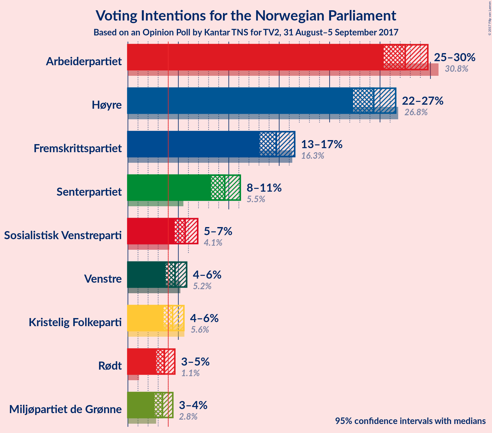
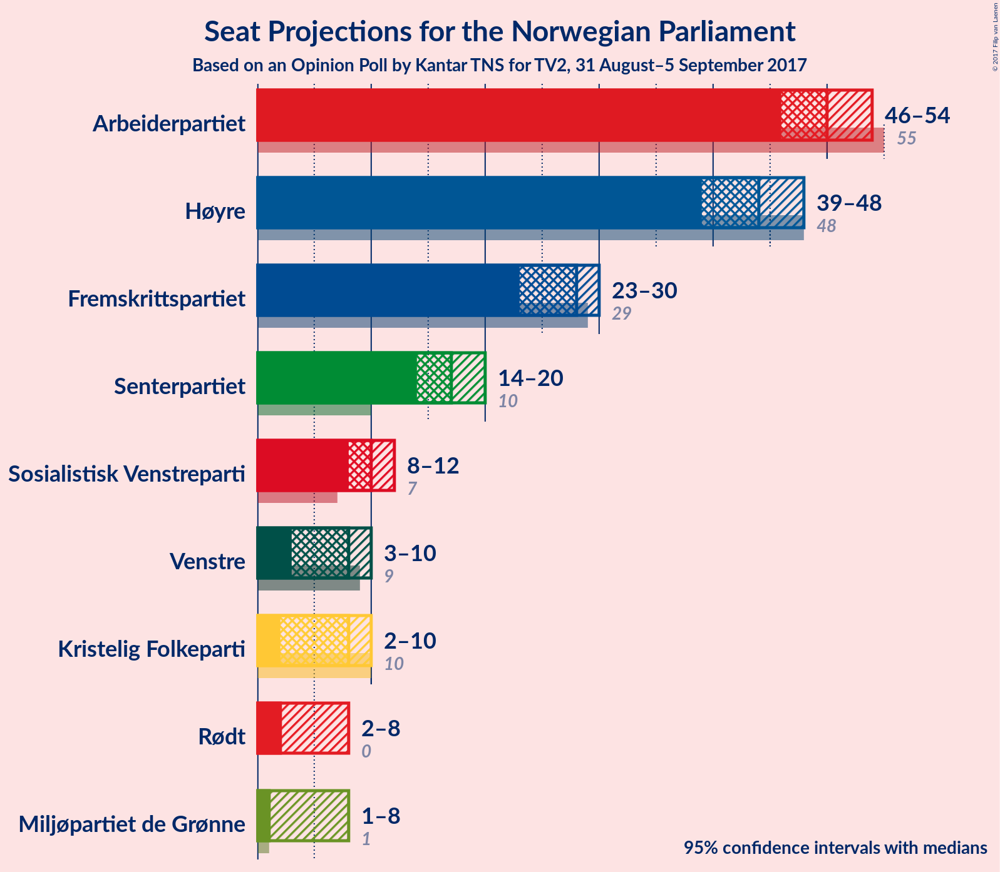
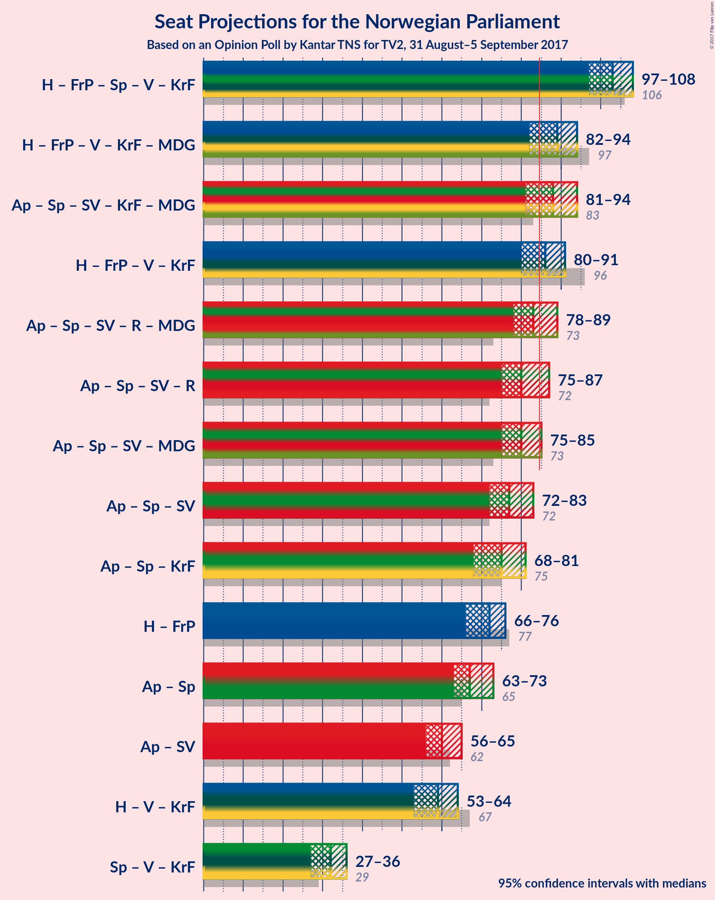

# Opinion Poll by Kantar TNS for TV2, 31 August–5 September 2017

<a href="#voting-intentions">Voting Intentions</a> | <a href="#seats">Seats</a> | <a href="#coalitions">Coalitions</a> | <a href="#technical-information">Technical Information</a>

## Voting Intentions

### Confidence Intervals

| Party | Last Result | Poll Result | 80% Confidence Interval | 90% Confidence Interval | 95% Confidence Interval | 99% Confidence Interval |
|:-----:|:-----------:|:-----------:|:-----------------------:|:-----------------------:|:-----------------------:|:-----------------------:|
| Arbeiderpartiet | 30.8% | 27.5% | 26.1–29.0% |25.7–29.4% |25.4–29.7% |24.7–30.5% |
| Høyre | 26.8% | 24.4% | 23.0–25.8% |22.7–26.2% |22.3–26.6% |21.7–27.2% |
| Fremskrittspartiet | 16.3% | 14.7% | 13.6–15.9% |13.3–16.2% |13.1–16.5% |12.6–17.1% |
| Senterpartiet | 5.5% | 9.6% | 8.7–10.6% |8.5–10.9% |8.2–11.1% |7.8–11.6% |
| Sosialistisk Venstreparti | 4.1% | 5.7% | 5.0–6.5% |4.8–6.7% |4.6–6.9% |4.3–7.3% |
| Venstre | 5.2% | 4.7% | 4.1–5.4% |3.9–5.6% |3.7–5.8% |3.5–6.2% |
| Kristelig Folkeparti | 5.6% | 4.4% | 3.8–5.2% |3.7–5.4% |3.5–5.5% |3.2–5.9% |
| Rødt | 1.1% | 3.6% | 3.1–4.3% |2.9–4.5% |2.8–4.6% |2.6–5.0% |
| Miljøpartiet de Grønne | 2.8% | 3.4% | 2.9–4.1% |2.8–4.3% |2.6–4.5% |2.4–4.8% |

*Note:* The poll result column reflects the actual value used in the calculations. Published results may vary slightly, and in addition be rounded to fewer digits.

## Seats

### Confidence Intervals

| Party | Last Result | Median | 80% Confidence Interval | 90% Confidence Interval | 95% Confidence Interval | 99% Confidence Interval |
|:-----:|:-----------:|:------:|:-----------------------:|:-----------------------:|:-----------------------:|:-----------------------:|
| <a href="#arbeiderpartiet">Arbeiderpartiet</a> | 55 | 50 | 47–53 |47–54 |46–54 |46–55 |
| <a href="#høyre">Høyre</a> | 48 | 44 | 41–46 |40–48 |39–48 |38–49 |
| <a href="#fremskrittspartiet">Fremskrittspartiet</a> | 29 | 28 | 25–30 |24–30 |23–30 |22–32 |
| <a href="#senterpartiet">Senterpartiet</a> | 10 | 17 | 15–19 |14–20 |14–20 |13–21 |
| <a href="#sosialistisk-venstreparti">Sosialistisk Venstreparti</a> | 7 | 10 | 9–11 |9–11 |8–12 |7–13 |
| <a href="#venstre">Venstre</a> | 9 | 8 | 3–9 |3–10 |3–10 |2–11 |
| <a href="#kristelig-folkeparti">Kristelig Folkeparti</a> | 10 | 8 | 3–9 |2–9 |2–10 |2–10 |
| <a href="#rødt">Rødt</a> | 0 | 2 | 2–7 |2–8 |2–8 |1–9 |
| <a href="#miljøpartiet-de-grønne">Miljøpartiet de Grønne</a> | 1 | 1 | 1–7 |1–8 |1–8 |1–8 |

### Arbeiderpartiet

*For a full overview of the results for this party, see the [Arbeiderpartiet](party-arbeiderpartiet.html) page.*

| Number of Seats | Probability | Accumulated | Special Marks |
|:---------------:|:-----------:|:-----------:|:-------------:|
| 44 | 0% | 100% |  |
| 45 | 0.4% | 99.9% |  |
| 46 | 2% | 99.5% |  |
| 47 | 7% | 97% |  |
| 48 | 13% | 90% |  |
| 49 | 12% | 77% |  |
| 50 | 23% | 65% | Median |
| 51 | 9% | 42% |  |
| 52 | 13% | 33% |  |
| 53 | 13% | 20% |  |
| 54 | 5% | 7% |  |
| 55 | 1.2% | 2% | Last Result |
| 56 | 0.3% | 0.5% |  |
| 57 | 0.1% | 0.1% |  |
| 58 | 0% | 0% |  |

### Høyre

*For a full overview of the results for this party, see the [Høyre](party-hyre.html) page.*

| Number of Seats | Probability | Accumulated | Special Marks |
|:---------------:|:-----------:|:-----------:|:-------------:|
| 36 | 0% | 100% |  |
| 37 | 0.3% | 99.9% |  |
| 38 | 1.3% | 99.6% |  |
| 39 | 2% | 98% |  |
| 40 | 6% | 96% |  |
| 41 | 5% | 90% |  |
| 42 | 11% | 85% |  |
| 43 | 11% | 75% |  |
| 44 | 28% | 64% | Median |
| 45 | 10% | 35% |  |
| 46 | 17% | 25% |  |
| 47 | 2% | 9% |  |
| 48 | 4% | 6% | Last Result |
| 49 | 1.4% | 2% |  |
| 50 | 0.4% | 0.5% |  |
| 51 | 0% | 0.1% |  |
| 52 | 0% | 0% |  |

### Fremskrittspartiet

*For a full overview of the results for this party, see the [Fremskrittspartiet](party-fremskrittspartiet.html) page.*

| Number of Seats | Probability | Accumulated | Special Marks |
|:---------------:|:-----------:|:-----------:|:-------------:|
| 22 | 0.9% | 100% |  |
| 23 | 3% | 99.1% |  |
| 24 | 5% | 96% |  |
| 25 | 6% | 91% |  |
| 26 | 4% | 85% |  |
| 27 | 13% | 81% |  |
| 28 | 46% | 68% | Median |
| 29 | 10% | 22% | Last Result |
| 30 | 11% | 13% |  |
| 31 | 0.9% | 2% |  |
| 32 | 0.6% | 0.7% |  |
| 33 | 0.1% | 0.1% |  |
| 34 | 0% | 0% |  |

### Senterpartiet

*For a full overview of the results for this party, see the [Senterpartiet](party-senterpartiet.html) page.*

| Number of Seats | Probability | Accumulated | Special Marks |
|:---------------:|:-----------:|:-----------:|:-------------:|
| 10 | 0% | 100% | Last Result |
| 11 | 0% | 100% |  |
| 12 | 0.4% | 100% |  |
| 13 | 0.9% | 99.6% |  |
| 14 | 8% | 98.8% |  |
| 15 | 9% | 90% |  |
| 16 | 10% | 81% |  |
| 17 | 34% | 71% | Median |
| 18 | 18% | 37% |  |
| 19 | 12% | 19% |  |
| 20 | 5% | 7% |  |
| 21 | 1.4% | 2% |  |
| 22 | 0.2% | 0.3% |  |
| 23 | 0.1% | 0.1% |  |
| 24 | 0% | 0% |  |

### Sosialistisk Venstreparti

*For a full overview of the results for this party, see the [Sosialistisk Venstreparti](party-sosialistiskvenstreparti.html) page.*

| Number of Seats | Probability | Accumulated | Special Marks |
|:---------------:|:-----------:|:-----------:|:-------------:|
| 2 | 0.1% | 100% |  |
| 3 | 0% | 99.9% |  |
| 4 | 0% | 99.9% |  |
| 5 | 0% | 99.9% |  |
| 6 | 0% | 99.9% |  |
| 7 | 0.6% | 99.9% | Last Result |
| 8 | 4% | 99.3% |  |
| 9 | 19% | 96% |  |
| 10 | 46% | 77% | Median |
| 11 | 27% | 31% |  |
| 12 | 3% | 4% |  |
| 13 | 0.6% | 1.0% |  |
| 14 | 0.3% | 0.4% |  |
| 15 | 0.1% | 0.1% |  |
| 16 | 0% | 0% |  |

### Venstre

*For a full overview of the results for this party, see the [Venstre](party-venstre.html) page.*

| Number of Seats | Probability | Accumulated | Special Marks |
|:---------------:|:-----------:|:-----------:|:-------------:|
| 1 | 0.1% | 100% |  |
| 2 | 2% | 99.9% |  |
| 3 | 11% | 98% |  |
| 4 | 0% | 87% |  |
| 5 | 0% | 87% |  |
| 6 | 0.1% | 87% |  |
| 7 | 25% | 87% |  |
| 8 | 29% | 62% | Median |
| 9 | 25% | 33% | Last Result |
| 10 | 8% | 9% |  |
| 11 | 1.0% | 1.2% |  |
| 12 | 0.2% | 0.2% |  |
| 13 | 0% | 0% |  |

### Kristelig Folkeparti

*For a full overview of the results for this party, see the [Kristelig Folkeparti](party-kristeligfolkeparti.html) page.*

| Number of Seats | Probability | Accumulated | Special Marks |
|:---------------:|:-----------:|:-----------:|:-------------:|
| 1 | 0.1% | 100% |  |
| 2 | 6% | 99.9% |  |
| 3 | 13% | 94% |  |
| 4 | 0% | 81% |  |
| 5 | 0% | 81% |  |
| 6 | 0.9% | 81% |  |
| 7 | 14% | 80% |  |
| 8 | 52% | 66% | Median |
| 9 | 11% | 14% |  |
| 10 | 3% | 3% | Last Result |
| 11 | 0.4% | 0.4% |  |
| 12 | 0% | 0% |  |

### Rødt

*For a full overview of the results for this party, see the [Rødt](party-rdt.html) page.*

| Number of Seats | Probability | Accumulated | Special Marks |
|:---------------:|:-----------:|:-----------:|:-------------:|
| 0 | 0% | 100% | Last Result |
| 1 | 1.1% | 100% |  |
| 2 | 82% | 98.9% | Median |
| 3 | 0% | 17% |  |
| 4 | 0% | 17% |  |
| 5 | 0% | 17% |  |
| 6 | 0.6% | 17% |  |
| 7 | 11% | 17% |  |
| 8 | 5% | 5% |  |
| 9 | 0.5% | 0.5% |  |
| 10 | 0% | 0% |  |

### Miljøpartiet de Grønne

*For a full overview of the results for this party, see the [Miljøpartiet de Grønne](party-miljpartietdegrnne.html) page.*

| Number of Seats | Probability | Accumulated | Special Marks |
|:---------------:|:-----------:|:-----------:|:-------------:|
| 1 | 51% | 100% | Last Result, Median |
| 2 | 5% | 49% |  |
| 3 | 26% | 44% |  |
| 4 | 1.4% | 17% |  |
| 5 | 0% | 16% |  |
| 6 | 0.1% | 16% |  |
| 7 | 9% | 16% |  |
| 8 | 7% | 7% |  |
| 9 | 0.2% | 0.2% |  |
| 10 | 0% | 0% |  |

## Coalitions

### Confidence Intervals

| Coalition | Last Result | Median | Majority? | 80% Confidence Interval | 90% Confidence Interval | 95% Confidence Interval | 99% Confidence Interval |
|:---------:|:-----------:|:------:|:---------:|:-----------------------:|:-----------------------:|:-----------------------:|:-----------------------:|
| Høyre – Fremskrittspartiet – Senterpartiet – Venstre – Kristelig Folkeparti | 106 | 103 | 100% | 100–106 | 98–108 | 97–108 | 92–109 |
| Høyre – Fremskrittspartiet – Venstre – Kristelig Folkeparti – Miljøpartiet de Grønne | 97 | 89 | 91% | 85–92 | 84–94 | 82–94 | 80–95 |
| Arbeiderpartiet – Senterpartiet – Sosialistisk Venstreparti – Kristelig Folkeparti – Miljøpartiet de Grønne | 83 | 88 | 74% | 82–91 | 82–92 | 81–94 | 80–94 |
| Høyre – Fremskrittspartiet – Venstre – Kristelig Folkeparti | 96 | 86 | 72% | 82–90 | 82–91 | 80–91 | 74–93 |
| Arbeiderpartiet – Senterpartiet – Sosialistisk Venstreparti – Rødt – Miljøpartiet de Grønne | 73 | 83 | 28% | 79–87 | 78–87 | 78–89 | 76–95 |
| Arbeiderpartiet – Senterpartiet – Sosialistisk Venstreparti – Rødt | 72 | 80 | 9% | 77–84 | 75–85 | 75–87 | 74–89 |
| Arbeiderpartiet – Senterpartiet – Sosialistisk Venstreparti – Miljøpartiet de Grønne | 73 | 80 | 10% | 76–84 | 76–85 | 75–85 | 73–88 |
| Arbeiderpartiet – Senterpartiet – Sosialistisk Venstreparti | 72 | 77 | 0.9% | 74–82 | 73–82 | 72–83 | 70–85 |
| Arbeiderpartiet – Senterpartiet – Kristelig Folkeparti | 75 | 75 | 0% | 69–79 | 68–80 | 68–81 | 66–82 |
| Høyre – Fremskrittspartiet | 77 | 72 | 0% | 67–76 | 66–76 | 66–76 | 61–78 |
| Arbeiderpartiet – Senterpartiet | 65 | 67 | 0% | 64–71 | 63–72 | 63–73 | 61–74 |
| Arbeiderpartiet – Sosialistisk Venstreparti | 62 | 60 | 0% | 58–63 | 58–64 | 56–65 | 55–66 |
| Høyre – Venstre – Kristelig Folkeparti | 67 | 59 | 0% | 55–62 | 54–63 | 53–64 | 50–65 |
| Senterpartiet – Venstre – Kristelig Folkeparti | 29 | 32 | 0% | 29–35 | 28–36 | 27–36 | 25–38 |

### Høyre – Fremskrittspartiet – Senterpartiet – Venstre – Kristelig Folkeparti

| Number of Seats | Probability | Accumulated | Special Marks |
|:---------------:|:-----------:|:-----------:|:-------------:|
| 91 | 0.1% | 100% |  |
| 92 | 0.7% | 99.9% |  |
| 93 | 0.3% | 99.2% |  |
| 94 | 0.1% | 99.0% |  |
| 95 | 0.3% | 98.8% |  |
| 96 | 0.5% | 98.6% |  |
| 97 | 2% | 98% |  |
| 98 | 3% | 97% |  |
| 99 | 2% | 93% |  |
| 100 | 11% | 91% |  |
| 101 | 11% | 81% |  |
| 102 | 5% | 70% |  |
| 103 | 15% | 64% |  |
| 104 | 22% | 49% |  |
| 105 | 8% | 27% | Median |
| 106 | 11% | 19% | Last Result |
| 107 | 2% | 9% |  |
| 108 | 6% | 7% |  |
| 109 | 0.4% | 0.9% |  |
| 110 | 0.3% | 0.5% |  |
| 111 | 0.1% | 0.2% |  |
| 112 | 0% | 0% |  |

### Høyre – Fremskrittspartiet – Venstre – Kristelig Folkeparti – Miljøpartiet de Grønne

| Number of Seats | Probability | Accumulated | Special Marks |
|:---------------:|:-----------:|:-----------:|:-------------:|
| 78 | 0.1% | 100% |  |
| 79 | 0.2% | 99.9% |  |
| 80 | 0.3% | 99.7% |  |
| 81 | 1.2% | 99.4% |  |
| 82 | 0.9% | 98% |  |
| 83 | 1.3% | 97% |  |
| 84 | 5% | 96% |  |
| 85 | 9% | 91% | Majority |
| 86 | 4% | 82% |  |
| 87 | 12% | 77% |  |
| 88 | 9% | 65% |  |
| 89 | 10% | 56% | Median |
| 90 | 22% | 47% |  |
| 91 | 11% | 25% |  |
| 92 | 6% | 14% |  |
| 93 | 1.1% | 8% |  |
| 94 | 5% | 6% |  |
| 95 | 1.4% | 2% |  |
| 96 | 0.1% | 0.3% |  |
| 97 | 0.1% | 0.1% | Last Result |
| 98 | 0% | 0% |  |

### Arbeiderpartiet – Senterpartiet – Sosialistisk Venstreparti – Kristelig Folkeparti – Miljøpartiet de Grønne

| Number of Seats | Probability | Accumulated | Special Marks |
|:---------------:|:-----------:|:-----------:|:-------------:|
| 78 | 0.1% | 100% |  |
| 79 | 0.3% | 99.9% |  |
| 80 | 2% | 99.6% |  |
| 81 | 1.3% | 98% |  |
| 82 | 7% | 96% |  |
| 83 | 2% | 90% | Last Result |
| 84 | 14% | 88% |  |
| 85 | 3% | 74% | Majority |
| 86 | 6% | 72% | Median |
| 87 | 11% | 66% |  |
| 88 | 28% | 55% |  |
| 89 | 7% | 27% |  |
| 90 | 4% | 20% |  |
| 91 | 9% | 15% |  |
| 92 | 2% | 6% |  |
| 93 | 0.9% | 4% |  |
| 94 | 3% | 3% |  |
| 95 | 0.3% | 0.4% |  |
| 96 | 0% | 0.1% |  |
| 97 | 0% | 0% |  |

### Høyre – Fremskrittspartiet – Venstre – Kristelig Folkeparti

| Number of Seats | Probability | Accumulated | Special Marks |
|:---------------:|:-----------:|:-----------:|:-------------:|
| 74 | 0.7% | 100% |  |
| 75 | 0.1% | 99.3% |  |
| 76 | 0.2% | 99.2% |  |
| 77 | 0.2% | 99.1% |  |
| 78 | 0.6% | 98.9% |  |
| 79 | 0.3% | 98% |  |
| 80 | 0.5% | 98% |  |
| 81 | 1.4% | 97% |  |
| 82 | 9% | 96% |  |
| 83 | 6% | 88% |  |
| 84 | 10% | 81% |  |
| 85 | 6% | 72% | Majority |
| 86 | 16% | 65% |  |
| 87 | 25% | 49% |  |
| 88 | 12% | 24% | Median |
| 89 | 2% | 12% |  |
| 90 | 3% | 10% |  |
| 91 | 6% | 7% |  |
| 92 | 0.4% | 1.0% |  |
| 93 | 0.5% | 0.6% |  |
| 94 | 0.1% | 0.1% |  |
| 95 | 0% | 0% |  |
| 96 | 0% | 0% | Last Result |

### Arbeiderpartiet – Senterpartiet – Sosialistisk Venstreparti – Rødt – Miljøpartiet de Grønne

| Number of Seats | Probability | Accumulated | Special Marks |
|:---------------:|:-----------:|:-----------:|:-------------:|
| 73 | 0% | 100% | Last Result |
| 74 | 0% | 100% |  |
| 75 | 0.1% | 100% |  |
| 76 | 0.5% | 99.9% |  |
| 77 | 0.4% | 99.4% |  |
| 78 | 6% | 99.0% |  |
| 79 | 3% | 93% |  |
| 80 | 2% | 90% | Median |
| 81 | 12% | 88% |  |
| 82 | 25% | 76% |  |
| 83 | 16% | 51% |  |
| 84 | 6% | 35% |  |
| 85 | 10% | 28% | Majority |
| 86 | 6% | 19% |  |
| 87 | 9% | 12% |  |
| 88 | 1.4% | 4% |  |
| 89 | 0.5% | 3% |  |
| 90 | 0.3% | 2% |  |
| 91 | 0.6% | 2% |  |
| 92 | 0.2% | 1.1% |  |
| 93 | 0.2% | 0.9% |  |
| 94 | 0.1% | 0.8% |  |
| 95 | 0.7% | 0.7% |  |
| 96 | 0% | 0% |  |

### Arbeiderpartiet – Senterpartiet – Sosialistisk Venstreparti – Rødt

| Number of Seats | Probability | Accumulated | Special Marks |
|:---------------:|:-----------:|:-----------:|:-------------:|
| 72 | 0.1% | 100% | Last Result |
| 73 | 0.1% | 99.9% |  |
| 74 | 1.4% | 99.7% |  |
| 75 | 5% | 98% |  |
| 76 | 1.1% | 94% |  |
| 77 | 6% | 92% |  |
| 78 | 11% | 86% |  |
| 79 | 22% | 75% | Median |
| 80 | 10% | 53% |  |
| 81 | 9% | 44% |  |
| 82 | 12% | 35% |  |
| 83 | 4% | 23% |  |
| 84 | 9% | 18% |  |
| 85 | 5% | 9% | Majority |
| 86 | 1.3% | 4% |  |
| 87 | 0.9% | 3% |  |
| 88 | 1.2% | 2% |  |
| 89 | 0.3% | 0.6% |  |
| 90 | 0.2% | 0.3% |  |
| 91 | 0.1% | 0.1% |  |
| 92 | 0% | 0% |  |

### Arbeiderpartiet – Senterpartiet – Sosialistisk Venstreparti – Miljøpartiet de Grønne

| Number of Seats | Probability | Accumulated | Special Marks |
|:---------------:|:-----------:|:-----------:|:-------------:|
| 71 | 0.1% | 100% |  |
| 72 | 0.2% | 99.9% |  |
| 73 | 0.7% | 99.7% | Last Result |
| 74 | 0.8% | 99.0% |  |
| 75 | 1.3% | 98% |  |
| 76 | 11% | 97% |  |
| 77 | 6% | 86% |  |
| 78 | 3% | 80% | Median |
| 79 | 13% | 76% |  |
| 80 | 25% | 63% |  |
| 81 | 12% | 38% |  |
| 82 | 4% | 26% |  |
| 83 | 9% | 23% |  |
| 84 | 4% | 13% |  |
| 85 | 7% | 10% | Majority |
| 86 | 1.2% | 2% |  |
| 87 | 0.3% | 1.1% |  |
| 88 | 0.7% | 0.8% |  |
| 89 | 0% | 0.1% |  |
| 90 | 0% | 0.1% |  |
| 91 | 0% | 0% |  |

### Arbeiderpartiet – Senterpartiet – Sosialistisk Venstreparti

| Number of Seats | Probability | Accumulated | Special Marks |
|:---------------:|:-----------:|:-----------:|:-------------:|
| 68 | 0.3% | 100% |  |
| 69 | 0% | 99.7% |  |
| 70 | 0.2% | 99.6% |  |
| 71 | 0.7% | 99.4% |  |
| 72 | 2% | 98.7% | Last Result |
| 73 | 6% | 97% |  |
| 74 | 3% | 92% |  |
| 75 | 11% | 89% |  |
| 76 | 12% | 77% |  |
| 77 | 23% | 65% | Median |
| 78 | 11% | 42% |  |
| 79 | 8% | 31% |  |
| 80 | 8% | 23% |  |
| 81 | 3% | 15% |  |
| 82 | 8% | 12% |  |
| 83 | 3% | 4% |  |
| 84 | 0.4% | 1.3% |  |
| 85 | 0.7% | 0.9% | Majority |
| 86 | 0.2% | 0.2% |  |
| 87 | 0% | 0.1% |  |
| 88 | 0% | 0% |  |

### Arbeiderpartiet – Senterpartiet – Kristelig Folkeparti

| Number of Seats | Probability | Accumulated | Special Marks |
|:---------------:|:-----------:|:-----------:|:-------------:|
| 65 | 0.3% | 100% |  |
| 66 | 1.3% | 99.7% |  |
| 67 | 0.2% | 98% |  |
| 68 | 5% | 98% |  |
| 69 | 6% | 93% |  |
| 70 | 6% | 87% |  |
| 71 | 4% | 81% |  |
| 72 | 4% | 77% |  |
| 73 | 13% | 73% |  |
| 74 | 4% | 60% |  |
| 75 | 20% | 57% | Last Result, Median |
| 76 | 8% | 37% |  |
| 77 | 6% | 29% |  |
| 78 | 9% | 23% |  |
| 79 | 4% | 13% |  |
| 80 | 7% | 9% |  |
| 81 | 0.5% | 3% |  |
| 82 | 2% | 2% |  |
| 83 | 0.2% | 0.3% |  |
| 84 | 0% | 0% |  |

### Høyre – Fremskrittspartiet

| Number of Seats | Probability | Accumulated | Special Marks |
|:---------------:|:-----------:|:-----------:|:-------------:|
| 61 | 0.7% | 100% |  |
| 62 | 0.1% | 99.3% |  |
| 63 | 0.1% | 99.2% |  |
| 64 | 0.4% | 99.1% |  |
| 65 | 1.0% | 98.7% |  |
| 66 | 4% | 98% |  |
| 67 | 5% | 94% |  |
| 68 | 4% | 90% |  |
| 69 | 8% | 85% |  |
| 70 | 17% | 77% |  |
| 71 | 4% | 60% |  |
| 72 | 26% | 56% | Median |
| 73 | 7% | 30% |  |
| 74 | 4% | 23% |  |
| 75 | 6% | 19% |  |
| 76 | 10% | 13% |  |
| 77 | 2% | 2% | Last Result |
| 78 | 0.6% | 0.8% |  |
| 79 | 0.1% | 0.2% |  |
| 80 | 0% | 0% |  |

### Arbeiderpartiet – Senterpartiet

| Number of Seats | Probability | Accumulated | Special Marks |
|:---------------:|:-----------:|:-----------:|:-------------:|
| 59 | 0.3% | 100% |  |
| 60 | 0.1% | 99.7% |  |
| 61 | 0.4% | 99.6% |  |
| 62 | 0.6% | 99.3% |  |
| 63 | 7% | 98.7% |  |
| 64 | 3% | 91% |  |
| 65 | 16% | 88% | Last Result |
| 66 | 10% | 72% |  |
| 67 | 20% | 62% | Median |
| 68 | 9% | 42% |  |
| 69 | 10% | 33% |  |
| 70 | 6% | 23% |  |
| 71 | 7% | 16% |  |
| 72 | 7% | 10% |  |
| 73 | 2% | 3% |  |
| 74 | 0.9% | 1.3% |  |
| 75 | 0.3% | 0.3% |  |
| 76 | 0% | 0% |  |

### Arbeiderpartiet – Sosialistisk Venstreparti

| Number of Seats | Probability | Accumulated | Special Marks |
|:---------------:|:-----------:|:-----------:|:-------------:|
| 53 | 0.1% | 100% |  |
| 54 | 0.1% | 99.9% |  |
| 55 | 0.7% | 99.9% |  |
| 56 | 2% | 99.2% |  |
| 57 | 2% | 97% |  |
| 58 | 14% | 95% |  |
| 59 | 14% | 81% |  |
| 60 | 26% | 67% | Median |
| 61 | 12% | 41% |  |
| 62 | 10% | 29% | Last Result |
| 63 | 12% | 20% |  |
| 64 | 5% | 8% |  |
| 65 | 2% | 3% |  |
| 66 | 0.8% | 1.2% |  |
| 67 | 0.2% | 0.4% |  |
| 68 | 0.1% | 0.2% |  |
| 69 | 0.1% | 0.1% |  |
| 70 | 0% | 0% |  |

### Høyre – Venstre – Kristelig Folkeparti

| Number of Seats | Probability | Accumulated | Special Marks |
|:---------------:|:-----------:|:-----------:|:-------------:|
| 47 | 0.1% | 100% |  |
| 48 | 0.2% | 99.9% |  |
| 49 | 0.1% | 99.7% |  |
| 50 | 0.1% | 99.5% |  |
| 51 | 0.2% | 99.4% |  |
| 52 | 1.3% | 99.2% |  |
| 53 | 0.6% | 98% |  |
| 54 | 4% | 97% |  |
| 55 | 10% | 94% |  |
| 56 | 9% | 84% |  |
| 57 | 7% | 75% |  |
| 58 | 13% | 68% |  |
| 59 | 24% | 54% |  |
| 60 | 10% | 30% | Median |
| 61 | 9% | 20% |  |
| 62 | 5% | 11% |  |
| 63 | 3% | 6% |  |
| 64 | 2% | 3% |  |
| 65 | 0.9% | 1.4% |  |
| 66 | 0.3% | 0.5% |  |
| 67 | 0.1% | 0.2% | Last Result |
| 68 | 0% | 0% |  |

### Senterpartiet – Venstre – Kristelig Folkeparti

| Number of Seats | Probability | Accumulated | Special Marks |
|:---------------:|:-----------:|:-----------:|:-------------:|
| 21 | 0.1% | 100% |  |
| 22 | 0.1% | 99.9% |  |
| 23 | 0.1% | 99.8% |  |
| 24 | 0.1% | 99.7% |  |
| 25 | 0.5% | 99.6% |  |
| 26 | 1.0% | 99.1% |  |
| 27 | 2% | 98% |  |
| 28 | 3% | 96% |  |
| 29 | 6% | 93% | Last Result |
| 30 | 20% | 87% |  |
| 31 | 15% | 67% |  |
| 32 | 26% | 52% |  |
| 33 | 7% | 26% | Median |
| 34 | 7% | 19% |  |
| 35 | 4% | 12% |  |
| 36 | 6% | 8% |  |
| 37 | 1.0% | 2% |  |
| 38 | 0.6% | 0.8% |  |
| 39 | 0.2% | 0.3% |  |
| 40 | 0% | 0.1% |  |
| 41 | 0% | 0% |  |

## Technical Information

### Opinion Poll

+ **Pollster:** Kantar TNS
+ **Media:** TV2
+ **Fieldwork period:** 31 August–5 September 2017

### Calculations

+ **Sample size:** 1604
+ **Simulations done:** 524,288
+ **Error estimate:** 1.68%

