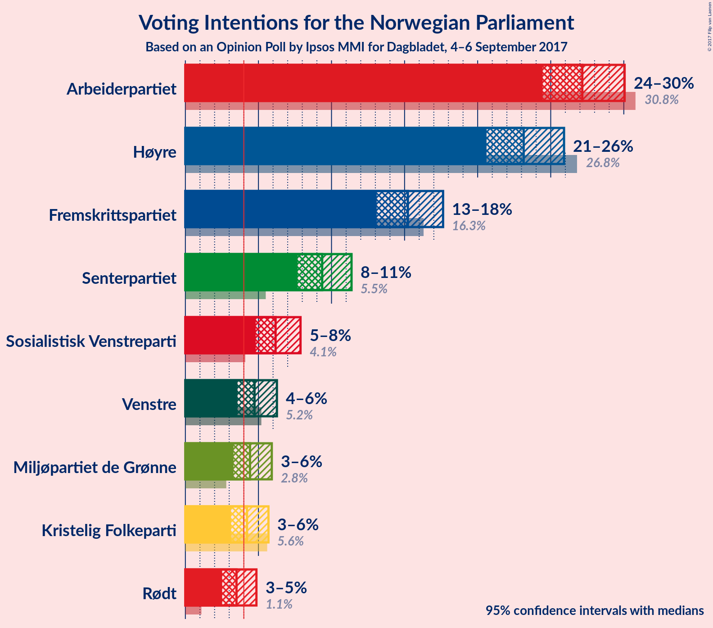
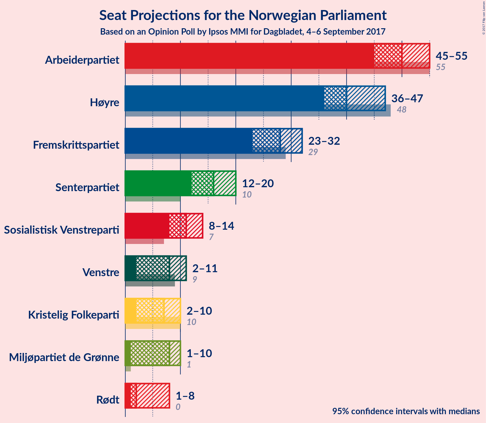
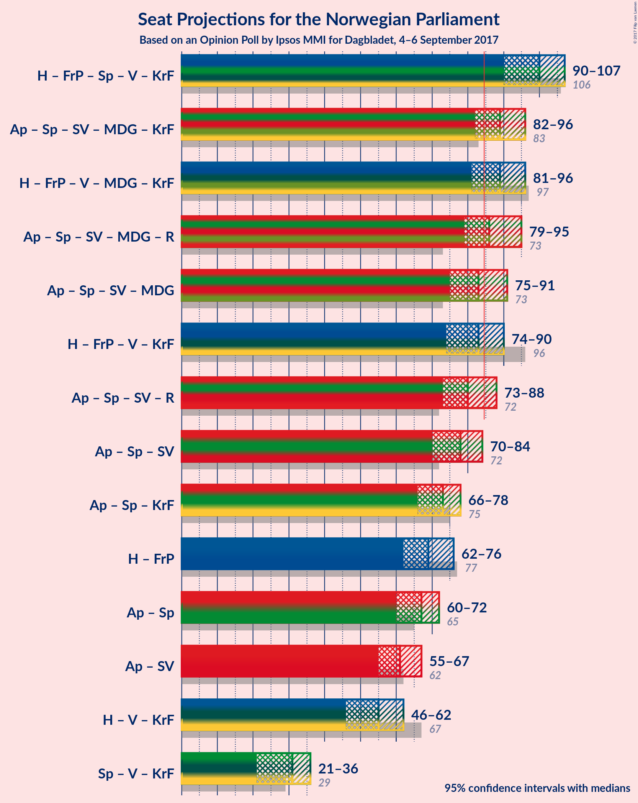

# Opinion Poll by Ipsos MMI for Dagbladet, 4–6 September 2017

<a href="#voting-intentions">Voting Intentions</a> | <a href="#seats">Seats</a> | <a href="#coalitions">Coalitions</a> | <a href="#technical-information">Technical Information</a>

## Voting Intentions

### Confidence Intervals

| Party | Last Result | Poll Result | 80% Confidence Interval | 90% Confidence Interval | 95% Confidence Interval | 99% Confidence Interval |
|:-----:|:-----------:|:-----------:|:-----------------------:|:-----------------------:|:-----------------------:|:-----------------------:|
| Arbeiderpartiet | 30.8% | 27.2% | 25.4–29.1% |24.9–29.6% |24.4–30.1% |23.6–31.0% |
| Høyre | 26.8% | 23.1% | 21.5–25.0% |21.0–25.5% |20.6–25.9% |19.8–26.8% |
| Fremskrittspartiet | 16.3% | 15.2% | 13.8–16.8% |13.4–17.2% |13.1–17.6% |12.5–18.4% |
| Senterpartiet | 5.5% | 9.4% | 8.3–10.7% |7.9–11.0% |7.7–11.4% |7.2–12.0% |
| Sosialistisk Venstreparti | 4.1% | 6.2% | 5.3–7.3% |5.0–7.6% |4.8–7.9% |4.4–8.4% |
| Venstre | 5.2% | 4.7% | 4.0–5.7% |3.7–6.0% |3.6–6.3% |3.2–6.8% |
| Miljøpartiet de Grønne | 2.8% | 4.4% | 3.7–5.4% |3.5–5.7% |3.3–5.9% |3.0–6.4% |
| Kristelig Folkeparti | 5.6% | 4.2% | 3.5–5.2% |3.3–5.4% |3.1–5.7% |2.8–6.2% |
| Rødt | 1.1% | 3.5% | 2.9–4.4% |2.7–4.6% |2.5–4.9% |2.2–5.3% |

*Note:* The poll result column reflects the actual value used in the calculations. Published results may vary slightly, and in addition be rounded to fewer digits.

## Seats

### Confidence Intervals

| Party | Last Result | Median | 80% Confidence Interval | 90% Confidence Interval | 95% Confidence Interval | 99% Confidence Interval |
|:-----:|:-----------:|:------:|:-----------------------:|:-----------------------:|:-----------------------:|:-----------------------:|
| <a href="#arbeiderpartiet">Arbeiderpartiet</a> | 55 | 50 | 46–53 |46–55 |45–55 |44–56 |
| <a href="#høyre">Høyre</a> | 48 | 40 | 37–45 |36–46 |36–47 |34–49 |
| <a href="#fremskrittspartiet">Fremskrittspartiet</a> | 29 | 28 | 24–31 |24–31 |23–32 |22–33 |
| <a href="#senterpartiet">Senterpartiet</a> | 10 | 16 | 13–19 |13–19 |12–20 |12–22 |
| <a href="#sosialistisk-venstreparti">Sosialistisk Venstreparti</a> | 7 | 11 | 9–13 |9–13 |8–14 |7–15 |
| <a href="#venstre">Venstre</a> | 9 | 8 | 2–10 |2–10 |2–11 |1–12 |
| <a href="#miljøpartiet-de-grønne">Miljøpartiet de Grønne</a> | 1 | 8 | 2–9 |1–10 |1–10 |1–11 |
| <a href="#kristelig-folkeparti">Kristelig Folkeparti</a> | 10 | 7 | 2–9 |2–9 |2–10 |1–11 |
| <a href="#rødt">Rødt</a> | 0 | 2 | 1–7 |1–8 |1–8 |1–9 |

### Arbeiderpartiet

*For a full overview of the results for this party, see the [Arbeiderpartiet](party-arbeiderpartiet.html) page.*

| Number of Seats | Probability | Accumulated | Special Marks |
|:---------------:|:-----------:|:-----------:|:-------------:|
| 42 | 0% | 100% |  |
| 43 | 0.2% | 99.9% |  |
| 44 | 1.0% | 99.7% |  |
| 45 | 2% | 98.7% |  |
| 46 | 14% | 97% |  |
| 47 | 7% | 83% |  |
| 48 | 7% | 76% |  |
| 49 | 10% | 69% |  |
| 50 | 9% | 59% | Median |
| 51 | 19% | 50% |  |
| 52 | 15% | 31% |  |
| 53 | 9% | 16% |  |
| 54 | 2% | 7% |  |
| 55 | 3% | 5% | Last Result |
| 56 | 2% | 2% |  |
| 57 | 0.3% | 0.4% |  |
| 58 | 0.1% | 0.1% |  |
| 59 | 0% | 0% |  |

### Høyre

*For a full overview of the results for this party, see the [Høyre](party-hyre.html) page.*

| Number of Seats | Probability | Accumulated | Special Marks |
|:---------------:|:-----------:|:-----------:|:-------------:|
| 33 | 0.3% | 100% |  |
| 34 | 0.3% | 99.7% |  |
| 35 | 2% | 99.4% |  |
| 36 | 5% | 98% |  |
| 37 | 6% | 93% |  |
| 38 | 9% | 87% |  |
| 39 | 18% | 78% |  |
| 40 | 16% | 60% | Median |
| 41 | 10% | 44% |  |
| 42 | 5% | 34% |  |
| 43 | 7% | 29% |  |
| 44 | 9% | 23% |  |
| 45 | 7% | 13% |  |
| 46 | 2% | 6% |  |
| 47 | 2% | 4% |  |
| 48 | 0.4% | 2% | Last Result |
| 49 | 2% | 2% |  |
| 50 | 0.2% | 0.2% |  |
| 51 | 0% | 0% |  |

### Fremskrittspartiet

*For a full overview of the results for this party, see the [Fremskrittspartiet](party-fremskrittspartiet.html) page.*

| Number of Seats | Probability | Accumulated | Special Marks |
|:---------------:|:-----------:|:-----------:|:-------------:|
| 21 | 0.1% | 100% |  |
| 22 | 1.0% | 99.9% |  |
| 23 | 4% | 99.0% |  |
| 24 | 7% | 95% |  |
| 25 | 4% | 89% |  |
| 26 | 6% | 85% |  |
| 27 | 10% | 79% |  |
| 28 | 31% | 69% | Median |
| 29 | 14% | 38% | Last Result |
| 30 | 7% | 24% |  |
| 31 | 12% | 16% |  |
| 32 | 3% | 5% |  |
| 33 | 1.1% | 1.4% |  |
| 34 | 0.1% | 0.3% |  |
| 35 | 0.1% | 0.2% |  |
| 36 | 0% | 0.2% |  |
| 37 | 0.1% | 0.1% |  |
| 38 | 0.1% | 0.1% |  |
| 39 | 0% | 0% |  |

### Senterpartiet

*For a full overview of the results for this party, see the [Senterpartiet](party-senterpartiet.html) page.*

| Number of Seats | Probability | Accumulated | Special Marks |
|:---------------:|:-----------:|:-----------:|:-------------:|
| 10 | 0% | 100% | Last Result |
| 11 | 0.2% | 99.9% |  |
| 12 | 2% | 99.7% |  |
| 13 | 9% | 97% |  |
| 14 | 13% | 89% |  |
| 15 | 10% | 76% |  |
| 16 | 30% | 65% | Median |
| 17 | 15% | 35% |  |
| 18 | 7% | 21% |  |
| 19 | 9% | 14% |  |
| 20 | 3% | 5% |  |
| 21 | 0.5% | 2% |  |
| 22 | 1.4% | 2% |  |
| 23 | 0.1% | 0.2% |  |
| 24 | 0% | 0% |  |

### Sosialistisk Venstreparti

*For a full overview of the results for this party, see the [Sosialistisk Venstreparti](party-sosialistiskvenstreparti.html) page.*

| Number of Seats | Probability | Accumulated | Special Marks |
|:---------------:|:-----------:|:-----------:|:-------------:|
| 2 | 0.1% | 100% |  |
| 3 | 0% | 99.9% |  |
| 4 | 0% | 99.9% |  |
| 5 | 0% | 99.9% |  |
| 6 | 0.1% | 99.9% |  |
| 7 | 0.7% | 99.9% | Last Result |
| 8 | 4% | 99.1% |  |
| 9 | 16% | 95% |  |
| 10 | 27% | 79% |  |
| 11 | 26% | 52% | Median |
| 12 | 16% | 26% |  |
| 13 | 7% | 11% |  |
| 14 | 3% | 4% |  |
| 15 | 0.7% | 0.9% |  |
| 16 | 0.1% | 0.2% |  |
| 17 | 0% | 0.1% |  |
| 18 | 0% | 0% |  |

### Venstre

*For a full overview of the results for this party, see the [Venstre](party-venstre.html) page.*

| Number of Seats | Probability | Accumulated | Special Marks |
|:---------------:|:-----------:|:-----------:|:-------------:|
| 1 | 0.7% | 100% |  |
| 2 | 12% | 99.3% |  |
| 3 | 4% | 87% |  |
| 4 | 0% | 83% |  |
| 5 | 0% | 83% |  |
| 6 | 0.9% | 83% |  |
| 7 | 14% | 82% |  |
| 8 | 27% | 68% | Median |
| 9 | 27% | 41% | Last Result |
| 10 | 11% | 13% |  |
| 11 | 2% | 3% |  |
| 12 | 0.4% | 0.7% |  |
| 13 | 0.2% | 0.3% |  |
| 14 | 0% | 0% |  |

### Miljøpartiet de Grønne

*For a full overview of the results for this party, see the [Miljøpartiet de Grønne](party-miljpartietdegrnne.html) page.*

| Number of Seats | Probability | Accumulated | Special Marks |
|:---------------:|:-----------:|:-----------:|:-------------:|
| 1 | 7% | 100% | Last Result |
| 2 | 4% | 93% |  |
| 3 | 17% | 89% |  |
| 4 | 0.2% | 73% |  |
| 5 | 0% | 72% |  |
| 6 | 0.3% | 72% |  |
| 7 | 16% | 72% |  |
| 8 | 37% | 56% | Median |
| 9 | 10% | 19% |  |
| 10 | 8% | 9% |  |
| 11 | 1.3% | 1.4% |  |
| 12 | 0.1% | 0.1% |  |
| 13 | 0% | 0% |  |

### Kristelig Folkeparti

*For a full overview of the results for this party, see the [Kristelig Folkeparti](party-kristeligfolkeparti.html) page.*

| Number of Seats | Probability | Accumulated | Special Marks |
|:---------------:|:-----------:|:-----------:|:-------------:|
| 1 | 1.5% | 100% |  |
| 2 | 21% | 98% |  |
| 3 | 4% | 77% |  |
| 4 | 0.2% | 73% |  |
| 5 | 0% | 73% |  |
| 6 | 0.8% | 73% |  |
| 7 | 24% | 72% | Median |
| 8 | 25% | 48% |  |
| 9 | 19% | 23% |  |
| 10 | 3% | 4% | Last Result |
| 11 | 1.1% | 1.1% |  |
| 12 | 0% | 0% |  |

### Rødt

*For a full overview of the results for this party, see the [Rødt](party-rdt.html) page.*

| Number of Seats | Probability | Accumulated | Special Marks |
|:---------------:|:-----------:|:-----------:|:-------------:|
| 0 | 0% | 100% | Last Result |
| 1 | 14% | 100% |  |
| 2 | 62% | 86% | Median |
| 3 | 0% | 24% |  |
| 4 | 0% | 24% |  |
| 5 | 0% | 24% |  |
| 6 | 0.5% | 24% |  |
| 7 | 17% | 23% |  |
| 8 | 6% | 6% |  |
| 9 | 0.7% | 0.8% |  |
| 10 | 0.1% | 0.1% |  |
| 11 | 0% | 0% |  |

## Coalitions

### Confidence Intervals

| Coalition | Last Result | Median | Majority? | 80% Confidence Interval | 90% Confidence Interval | 95% Confidence Interval | 99% Confidence Interval |
|:---------:|:-----------:|:------:|:---------:|:-----------------------:|:-----------------------:|:-----------------------:|:-----------------------:|
| Høyre – Fremskrittspartiet – Senterpartiet – Venstre – Kristelig Folkeparti | 106 | 99 | 100% | 94–103 | 90–107 | 90–108 | 86–108 |
| Arbeiderpartiet – Senterpartiet – Sosialistisk Venstreparti – Miljøpartiet de Grønne – Kristelig Folkeparti | 83 | 90 | 88% | 83–94 | 82–96 | 82–97 | 80–98 |
| Høyre – Fremskrittspartiet – Venstre – Miljøpartiet de Grønne – Kristelig Folkeparti | 97 | 90 | 85% | 84–94 | 82–95 | 81–95 | 78–98 |
| Arbeiderpartiet – Senterpartiet – Sosialistisk Venstreparti – Miljøpartiet de Grønne – Rødt | 73 | 87 | 70% | 81–92 | 79–95 | 79–95 | 76–99 |
| Arbeiderpartiet – Senterpartiet – Sosialistisk Venstreparti – Miljøpartiet de Grønne | 73 | 84 | 42% | 77–88 | 75–91 | 75–91 | 73–93 |
| Høyre – Fremskrittspartiet – Venstre – Kristelig Folkeparti | 96 | 82 | 30% | 77–88 | 74–90 | 74–90 | 70–93 |
| Arbeiderpartiet – Senterpartiet – Sosialistisk Venstreparti – Rødt | 72 | 79 | 15% | 75–85 | 74–87 | 74–88 | 71–91 |
| Arbeiderpartiet – Senterpartiet – Sosialistisk Venstreparti | 72 | 77 | 1.3% | 72–82 | 71–83 | 70–84 | 68–85 |
| Arbeiderpartiet – Senterpartiet – Kristelig Folkeparti | 75 | 73 | 0% | 68–76 | 67–77 | 65–78 | 62–81 |
| Høyre – Fremskrittspartiet | 77 | 68 | 0% | 64–73 | 64–75 | 62–76 | 60–77 |
| Arbeiderpartiet – Senterpartiet | 65 | 67 | 0% | 62–70 | 61–72 | 60–72 | 58–74 |
| Arbeiderpartiet – Sosialistisk Venstreparti | 62 | 61 | 0% | 56–64 | 56–66 | 55–67 | 54–68 |
| Høyre – Venstre – Kristelig Folkeparti | 67 | 55 | 0% | 50–60 | 46–61 | 46–63 | 42–65 |
| Senterpartiet – Venstre – Kristelig Folkeparti | 29 | 31 | 0% | 23–35 | 21–36 | 21–37 | 20–38 |

### Høyre – Fremskrittspartiet – Senterpartiet – Venstre – Kristelig Folkeparti

| Number of Seats | Probability | Accumulated | Special Marks |
|:---------------:|:-----------:|:-----------:|:-------------:|
| 86 | 1.4% | 100% |  |
| 87 | 0.3% | 98.6% |  |
| 88 | 0.4% | 98% |  |
| 89 | 0.1% | 98% |  |
| 90 | 3% | 98% |  |
| 91 | 0.5% | 94% |  |
| 92 | 0.7% | 94% |  |
| 93 | 3% | 93% |  |
| 94 | 6% | 91% |  |
| 95 | 7% | 85% |  |
| 96 | 7% | 77% |  |
| 97 | 5% | 70% |  |
| 98 | 13% | 66% |  |
| 99 | 9% | 53% | Median |
| 100 | 13% | 45% |  |
| 101 | 9% | 31% |  |
| 102 | 3% | 22% |  |
| 103 | 10% | 19% |  |
| 104 | 1.5% | 9% |  |
| 105 | 1.4% | 7% |  |
| 106 | 0.4% | 6% | Last Result |
| 107 | 1.0% | 6% |  |
| 108 | 4% | 5% |  |
| 109 | 0.3% | 0.4% |  |
| 110 | 0.1% | 0.2% |  |
| 111 | 0.1% | 0.1% |  |
| 112 | 0% | 0% |  |

### Arbeiderpartiet – Senterpartiet – Sosialistisk Venstreparti – Miljøpartiet de Grønne – Kristelig Folkeparti

| Number of Seats | Probability | Accumulated | Special Marks |
|:---------------:|:-----------:|:-----------:|:-------------:|
| 76 | 0% | 100% |  |
| 77 | 0% | 99.9% |  |
| 78 | 0% | 99.9% |  |
| 79 | 0.2% | 99.9% |  |
| 80 | 0.9% | 99.7% |  |
| 81 | 0.6% | 98.8% |  |
| 82 | 6% | 98% |  |
| 83 | 2% | 92% | Last Result |
| 84 | 1.3% | 89% |  |
| 85 | 3% | 88% | Majority |
| 86 | 7% | 86% |  |
| 87 | 5% | 78% |  |
| 88 | 8% | 74% |  |
| 89 | 10% | 66% |  |
| 90 | 8% | 56% |  |
| 91 | 13% | 48% |  |
| 92 | 6% | 36% | Median |
| 93 | 18% | 29% |  |
| 94 | 3% | 11% |  |
| 95 | 2% | 8% |  |
| 96 | 3% | 6% |  |
| 97 | 1.3% | 3% |  |
| 98 | 0.9% | 1.3% |  |
| 99 | 0.2% | 0.4% |  |
| 100 | 0.2% | 0.3% |  |
| 101 | 0.1% | 0.1% |  |
| 102 | 0% | 0% |  |

### Høyre – Fremskrittspartiet – Venstre – Miljøpartiet de Grønne – Kristelig Folkeparti

| Number of Seats | Probability | Accumulated | Special Marks |
|:---------------:|:-----------:|:-----------:|:-------------:|
| 75 | 0% | 100% |  |
| 76 | 0% | 99.9% |  |
| 77 | 0.1% | 99.9% |  |
| 78 | 0.4% | 99.9% |  |
| 79 | 1.5% | 99.5% |  |
| 80 | 0.3% | 98% |  |
| 81 | 0.7% | 98% |  |
| 82 | 2% | 97% |  |
| 83 | 1.5% | 95% |  |
| 84 | 9% | 94% |  |
| 85 | 4% | 85% | Majority |
| 86 | 4% | 80% |  |
| 87 | 8% | 76% |  |
| 88 | 6% | 69% |  |
| 89 | 6% | 63% |  |
| 90 | 22% | 57% |  |
| 91 | 11% | 35% | Median |
| 92 | 4% | 24% |  |
| 93 | 5% | 20% |  |
| 94 | 6% | 15% |  |
| 95 | 7% | 9% |  |
| 96 | 0.6% | 2% |  |
| 97 | 1.2% | 2% | Last Result |
| 98 | 0.4% | 0.6% |  |
| 99 | 0.2% | 0.2% |  |
| 100 | 0% | 0% |  |

### Arbeiderpartiet – Senterpartiet – Sosialistisk Venstreparti – Miljøpartiet de Grønne – Rødt

| Number of Seats | Probability | Accumulated | Special Marks |
|:---------------:|:-----------:|:-----------:|:-------------:|
| 73 | 0% | 100% | Last Result |
| 74 | 0.1% | 100% |  |
| 75 | 0% | 99.9% |  |
| 76 | 1.3% | 99.9% |  |
| 77 | 0.2% | 98.6% |  |
| 78 | 0.4% | 98% |  |
| 79 | 5% | 98% |  |
| 80 | 2% | 93% |  |
| 81 | 3% | 91% |  |
| 82 | 11% | 88% |  |
| 83 | 3% | 78% |  |
| 84 | 4% | 74% |  |
| 85 | 10% | 70% | Majority |
| 86 | 9% | 61% |  |
| 87 | 16% | 52% | Median |
| 88 | 10% | 36% |  |
| 89 | 5% | 26% |  |
| 90 | 7% | 21% |  |
| 91 | 2% | 14% |  |
| 92 | 3% | 12% |  |
| 93 | 1.2% | 9% |  |
| 94 | 1.5% | 7% |  |
| 95 | 4% | 6% |  |
| 96 | 0.1% | 2% |  |
| 97 | 0.1% | 2% |  |
| 98 | 0.1% | 2% |  |
| 99 | 2% | 2% |  |
| 100 | 0% | 0% |  |

### Arbeiderpartiet – Senterpartiet – Sosialistisk Venstreparti – Miljøpartiet de Grønne

| Number of Seats | Probability | Accumulated | Special Marks |
|:---------------:|:-----------:|:-----------:|:-------------:|
| 72 | 0.4% | 100% |  |
| 73 | 0.1% | 99.6% | Last Result |
| 74 | 2% | 99.5% |  |
| 75 | 4% | 98% |  |
| 76 | 0.5% | 94% |  |
| 77 | 5% | 93% |  |
| 78 | 4% | 88% |  |
| 79 | 3% | 84% |  |
| 80 | 8% | 81% |  |
| 81 | 6% | 73% |  |
| 82 | 6% | 68% |  |
| 83 | 11% | 62% |  |
| 84 | 9% | 51% |  |
| 85 | 7% | 42% | Median, Majority |
| 86 | 15% | 35% |  |
| 87 | 6% | 20% |  |
| 88 | 6% | 15% |  |
| 89 | 3% | 9% |  |
| 90 | 1.1% | 6% |  |
| 91 | 3% | 5% |  |
| 92 | 2% | 2% |  |
| 93 | 0.8% | 0.9% |  |
| 94 | 0% | 0.2% |  |
| 95 | 0.1% | 0.1% |  |
| 96 | 0% | 0.1% |  |
| 97 | 0% | 0% |  |

### Høyre – Fremskrittspartiet – Venstre – Kristelig Folkeparti

| Number of Seats | Probability | Accumulated | Special Marks |
|:---------------:|:-----------:|:-----------:|:-------------:|
| 70 | 2% | 100% |  |
| 71 | 0.1% | 98% |  |
| 72 | 0.1% | 98% |  |
| 73 | 0.1% | 98% |  |
| 74 | 4% | 98% |  |
| 75 | 2% | 94% |  |
| 76 | 1.2% | 93% |  |
| 77 | 3% | 91% |  |
| 78 | 2% | 88% |  |
| 79 | 7% | 86% |  |
| 80 | 5% | 79% |  |
| 81 | 10% | 74% |  |
| 82 | 16% | 64% |  |
| 83 | 9% | 48% | Median |
| 84 | 10% | 39% |  |
| 85 | 4% | 30% | Majority |
| 86 | 3% | 26% |  |
| 87 | 11% | 22% |  |
| 88 | 3% | 12% |  |
| 89 | 2% | 9% |  |
| 90 | 5% | 7% |  |
| 91 | 0.4% | 2% |  |
| 92 | 0.2% | 2% |  |
| 93 | 1.3% | 1.4% |  |
| 94 | 0% | 0.1% |  |
| 95 | 0.1% | 0.1% |  |
| 96 | 0% | 0% | Last Result |

### Arbeiderpartiet – Senterpartiet – Sosialistisk Venstreparti – Rødt

| Number of Seats | Probability | Accumulated | Special Marks |
|:---------------:|:-----------:|:-----------:|:-------------:|
| 70 | 0.2% | 100% |  |
| 71 | 0.4% | 99.8% |  |
| 72 | 1.2% | 99.4% | Last Result |
| 73 | 0.6% | 98% |  |
| 74 | 7% | 98% |  |
| 75 | 6% | 91% |  |
| 76 | 5% | 85% |  |
| 77 | 4% | 80% |  |
| 78 | 11% | 76% |  |
| 79 | 22% | 65% | Median |
| 80 | 6% | 43% |  |
| 81 | 6% | 37% |  |
| 82 | 8% | 31% |  |
| 83 | 4% | 24% |  |
| 84 | 4% | 20% |  |
| 85 | 9% | 15% | Majority |
| 86 | 1.5% | 6% |  |
| 87 | 2% | 5% |  |
| 88 | 0.7% | 3% |  |
| 89 | 0.3% | 2% |  |
| 90 | 1.5% | 2% |  |
| 91 | 0.4% | 0.5% |  |
| 92 | 0.1% | 0.1% |  |
| 93 | 0% | 0.1% |  |
| 94 | 0% | 0.1% |  |
| 95 | 0% | 0% |  |

### Arbeiderpartiet – Senterpartiet – Sosialistisk Venstreparti

| Number of Seats | Probability | Accumulated | Special Marks |
|:---------------:|:-----------:|:-----------:|:-------------:|
| 66 | 0% | 100% |  |
| 67 | 0.3% | 99.9% |  |
| 68 | 0.2% | 99.6% |  |
| 69 | 0.5% | 99.4% |  |
| 70 | 2% | 98.9% |  |
| 71 | 2% | 96% |  |
| 72 | 12% | 95% | Last Result |
| 73 | 6% | 83% |  |
| 74 | 8% | 77% |  |
| 75 | 4% | 69% |  |
| 76 | 12% | 65% |  |
| 77 | 11% | 54% | Median |
| 78 | 17% | 43% |  |
| 79 | 5% | 26% |  |
| 80 | 6% | 21% |  |
| 81 | 3% | 16% |  |
| 82 | 4% | 12% |  |
| 83 | 6% | 9% |  |
| 84 | 1.4% | 3% |  |
| 85 | 0.9% | 1.3% | Majority |
| 86 | 0.2% | 0.4% |  |
| 87 | 0.1% | 0.2% |  |
| 88 | 0.1% | 0.2% |  |
| 89 | 0% | 0% |  |

### Arbeiderpartiet – Senterpartiet – Kristelig Folkeparti

| Number of Seats | Probability | Accumulated | Special Marks |
|:---------------:|:-----------:|:-----------:|:-------------:|
| 61 | 0.1% | 100% |  |
| 62 | 1.2% | 99.9% |  |
| 63 | 0.1% | 98.6% |  |
| 64 | 0.1% | 98% |  |
| 65 | 0.9% | 98% |  |
| 66 | 1.5% | 97% |  |
| 67 | 3% | 96% |  |
| 68 | 4% | 93% |  |
| 69 | 9% | 89% |  |
| 70 | 7% | 80% |  |
| 71 | 13% | 73% |  |
| 72 | 6% | 60% |  |
| 73 | 12% | 54% | Median |
| 74 | 14% | 42% |  |
| 75 | 10% | 28% | Last Result |
| 76 | 11% | 18% |  |
| 77 | 3% | 8% |  |
| 78 | 2% | 4% |  |
| 79 | 1.1% | 2% |  |
| 80 | 0.4% | 0.9% |  |
| 81 | 0.4% | 0.5% |  |
| 82 | 0.1% | 0.2% |  |
| 83 | 0% | 0.1% |  |
| 84 | 0% | 0% |  |

### Høyre – Fremskrittspartiet

| Number of Seats | Probability | Accumulated | Special Marks |
|:---------------:|:-----------:|:-----------:|:-------------:|
| 59 | 0% | 100% |  |
| 60 | 0.6% | 99.9% |  |
| 61 | 0.8% | 99.3% |  |
| 62 | 2% | 98.5% |  |
| 63 | 1.4% | 97% |  |
| 64 | 7% | 95% |  |
| 65 | 6% | 88% |  |
| 66 | 7% | 83% |  |
| 67 | 21% | 76% |  |
| 68 | 5% | 55% | Median |
| 69 | 6% | 50% |  |
| 70 | 13% | 43% |  |
| 71 | 5% | 30% |  |
| 72 | 8% | 25% |  |
| 73 | 10% | 17% |  |
| 74 | 1.5% | 7% |  |
| 75 | 1.4% | 5% |  |
| 76 | 2% | 4% |  |
| 77 | 1.5% | 2% | Last Result |
| 78 | 0.2% | 0.4% |  |
| 79 | 0.2% | 0.2% |  |
| 80 | 0% | 0.1% |  |
| 81 | 0% | 0% |  |

### Arbeiderpartiet – Senterpartiet

| Number of Seats | Probability | Accumulated | Special Marks |
|:---------------:|:-----------:|:-----------:|:-------------:|
| 57 | 0% | 100% |  |
| 58 | 0.5% | 99.9% |  |
| 59 | 1.0% | 99.4% |  |
| 60 | 2% | 98% |  |
| 61 | 4% | 96% |  |
| 62 | 14% | 93% |  |
| 63 | 4% | 79% |  |
| 64 | 7% | 75% |  |
| 65 | 6% | 67% | Last Result |
| 66 | 8% | 61% | Median |
| 67 | 26% | 53% |  |
| 68 | 7% | 27% |  |
| 69 | 6% | 20% |  |
| 70 | 3% | 13% |  |
| 71 | 3% | 10% |  |
| 72 | 4% | 7% |  |
| 73 | 2% | 2% |  |
| 74 | 0.2% | 0.5% |  |
| 75 | 0.2% | 0.3% |  |
| 76 | 0.1% | 0.2% |  |
| 77 | 0% | 0.1% |  |
| 78 | 0% | 0% |  |

### Arbeiderpartiet – Sosialistisk Venstreparti

| Number of Seats | Probability | Accumulated | Special Marks |
|:---------------:|:-----------:|:-----------:|:-------------:|
| 52 | 0% | 100% |  |
| 53 | 0.1% | 99.9% |  |
| 54 | 0.7% | 99.8% |  |
| 55 | 2% | 99.1% |  |
| 56 | 11% | 97% |  |
| 57 | 3% | 86% |  |
| 58 | 8% | 82% |  |
| 59 | 15% | 75% |  |
| 60 | 9% | 60% |  |
| 61 | 7% | 51% | Median |
| 62 | 15% | 44% | Last Result |
| 63 | 8% | 29% |  |
| 64 | 11% | 20% |  |
| 65 | 4% | 10% |  |
| 66 | 3% | 6% |  |
| 67 | 0.9% | 3% |  |
| 68 | 2% | 2% |  |
| 69 | 0.2% | 0.4% |  |
| 70 | 0.1% | 0.2% |  |
| 71 | 0.1% | 0.1% |  |
| 72 | 0% | 0% |  |

### Høyre – Venstre – Kristelig Folkeparti

| Number of Seats | Probability | Accumulated | Special Marks |
|:---------------:|:-----------:|:-----------:|:-------------:|
| 42 | 1.3% | 100% |  |
| 43 | 0.6% | 98.7% |  |
| 44 | 0% | 98% |  |
| 45 | 0.2% | 98% |  |
| 46 | 4% | 98% |  |
| 47 | 1.4% | 94% |  |
| 48 | 2% | 93% |  |
| 49 | 0.5% | 91% |  |
| 50 | 3% | 90% |  |
| 51 | 9% | 87% |  |
| 52 | 4% | 78% |  |
| 53 | 8% | 74% |  |
| 54 | 14% | 66% |  |
| 55 | 11% | 52% | Median |
| 56 | 12% | 41% |  |
| 57 | 7% | 29% |  |
| 58 | 1.4% | 22% |  |
| 59 | 10% | 20% |  |
| 60 | 2% | 10% |  |
| 61 | 5% | 9% |  |
| 62 | 1.2% | 4% |  |
| 63 | 0.9% | 3% |  |
| 64 | 0.3% | 2% |  |
| 65 | 1.2% | 1.4% |  |
| 66 | 0.2% | 0.2% |  |
| 67 | 0% | 0% | Last Result |

### Senterpartiet – Venstre – Kristelig Folkeparti

| Number of Seats | Probability | Accumulated | Special Marks |
|:---------------:|:-----------:|:-----------:|:-------------:|
| 18 | 0.2% | 100% |  |
| 19 | 0.2% | 99.8% |  |
| 20 | 0.8% | 99.6% |  |
| 21 | 4% | 98.8% |  |
| 22 | 0.7% | 94% |  |
| 23 | 5% | 94% |  |
| 24 | 2% | 89% |  |
| 25 | 2% | 87% |  |
| 26 | 3% | 85% |  |
| 27 | 10% | 82% |  |
| 28 | 4% | 72% |  |
| 29 | 7% | 68% | Last Result |
| 30 | 10% | 61% |  |
| 31 | 15% | 52% | Median |
| 32 | 7% | 36% |  |
| 33 | 11% | 30% |  |
| 34 | 8% | 19% |  |
| 35 | 4% | 11% |  |
| 36 | 4% | 7% |  |
| 37 | 2% | 3% |  |
| 38 | 0.7% | 1.0% |  |
| 39 | 0.1% | 0.4% |  |
| 40 | 0.2% | 0.3% |  |
| 41 | 0% | 0% |  |

## Technical Information

### Opinion Poll

+ **Pollster:** Ipsos MMI
+ **Media:** Dagbladet
+ **Fieldwork period:** 4–6 September 2017

### Calculations

+ **Sample size:** 972
+ **Simulations done:** 524,288
+ **Error estimate:** 2.48%

