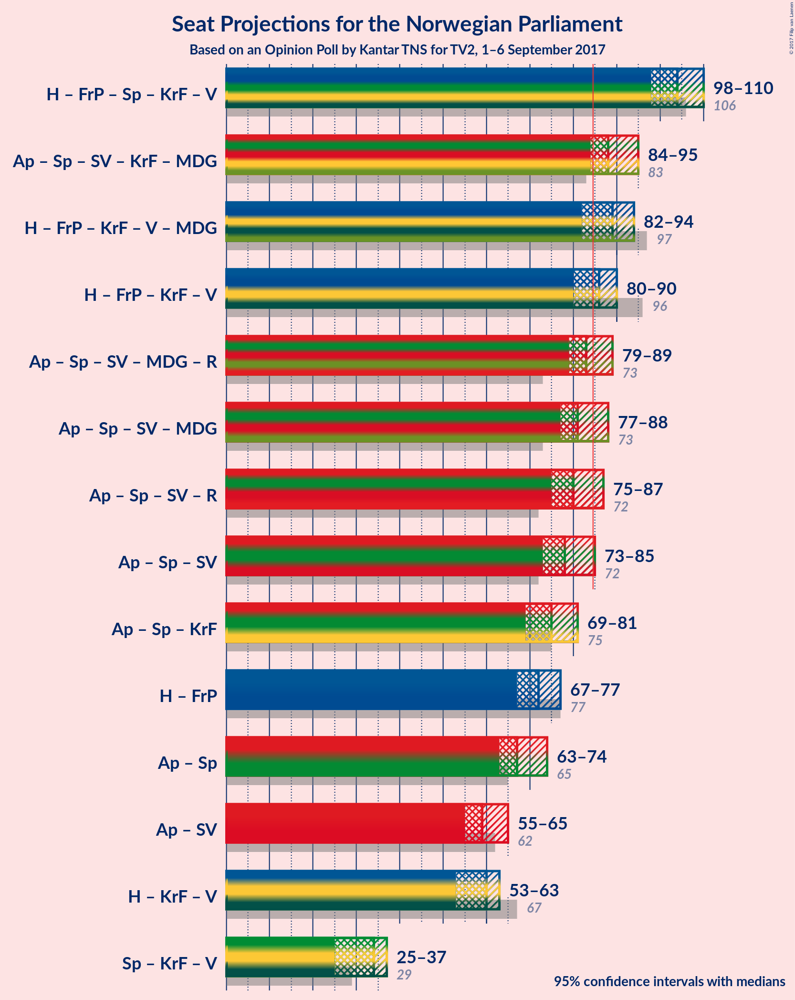

# Opinion Poll by Kantar TNS for TV2, 1–6 September 2017

<a href="#voting-intentions">Voting Intentions</a> | <a href="#seats">Seats</a> | <a href="#coalitions">Coalitions</a> | <a href="#technical-information">Technical Information</a>

## Voting Intentions

### Confidence Intervals

| Party | Last Result | Poll Result | 80% Confidence Interval | 90% Confidence Interval | 95% Confidence Interval | 99% Confidence Interval |
|:-----:|:-----------:|:-----------:|:-----------------------:|:-----------------------:|:-----------------------:|:-----------------------:|
| Arbeiderpartiet | 30.8% | 27.0% | 25.6–28.5% |25.2–28.9% |24.9–29.3% |24.2–30.0% |
| Høyre | 26.8% | 24.8% | 23.5–26.3% |23.1–26.7% |22.8–27.0% |22.1–27.7% |
| Fremskrittspartiet | 16.3% | 14.8% | 13.7–16.0% |13.4–16.3% |13.1–16.6% |12.6–17.2% |
| Senterpartiet | 5.5% | 10.3% | 9.4–11.3% |9.1–11.6% |8.9–11.9% |8.5–12.4% |
| Sosialistisk Venstreparti | 4.1% | 5.7% | 5.0–6.5% |4.8–6.7% |4.6–6.9% |4.3–7.3% |
| Kristelig Folkeparti | 5.6% | 4.5% | 3.9–5.2% |3.7–5.4% |3.6–5.6% |3.3–6.0% |
| Venstre | 5.2% | 4.3% | 3.7–5.0% |3.6–5.2% |3.4–5.4% |3.2–5.8% |
| Miljøpartiet de Grønne | 2.8% | 3.7% | 3.1–4.4% |3.0–4.6% |2.9–4.7% |2.6–5.1% |
| Rødt | 1.1% | 2.9% | 2.4–3.5% |2.3–3.7% |2.1–3.8% |2.0–4.1% |

*Note:* The poll result column reflects the actual value used in the calculations. Published results may vary slightly, and in addition be rounded to fewer digits.

## Seats

### Confidence Intervals

| Party | Last Result | Median | 80% Confidence Interval | 90% Confidence Interval | 95% Confidence Interval | 99% Confidence Interval |
|:-----:|:-----------:|:------:|:-----------------------:|:-----------------------:|:-----------------------:|:-----------------------:|
| <a href="#arbeiderpartiet">Arbeiderpartiet</a> | 55 | 50 | 46–53 |45–53 |45–54 |45–57 |
| <a href="#høyre">Høyre</a> | 48 | 45 | 40–46 |40–48 |39–49 |38–50 |
| <a href="#fremskrittspartiet">Fremskrittspartiet</a> | 29 | 27 | 25–30 |24–31 |23–32 |22–32 |
| <a href="#senterpartiet">Senterpartiet</a> | 10 | 18 | 16–20 |15–21 |15–22 |14–23 |
| <a href="#sosialistisk-venstreparti">Sosialistisk Venstreparti</a> | 7 | 10 | 9–12 |8–12 |8–12 |8–13 |
| <a href="#kristelig-folkeparti">Kristelig Folkeparti</a> | 10 | 8 | 7–9 |2–9 |2–10 |2–11 |
| <a href="#venstre">Venstre</a> | 9 | 8 | 2–9 |2–9 |2–9 |1–10 |
| <a href="#miljøpartiet-de-grønne">Miljøpartiet de Grønne</a> | 1 | 3 | 1–8 |1–8 |1–8 |1–9 |
| <a href="#rødt">Rødt</a> | 0 | 2 | 1–2 |1–2 |1–2 |1–7 |

### Arbeiderpartiet

*For a full overview of the results for this party, see the [Arbeiderpartiet](party-arbeiderpartiet.html) page.*

| Number of Seats | Probability | Accumulated | Special Marks |
|:---------------:|:-----------:|:-----------:|:-------------:|
| 43 | 0.1% | 100% |  |
| 44 | 0.2% | 99.8% |  |
| 45 | 6% | 99.7% |  |
| 46 | 4% | 94% |  |
| 47 | 10% | 90% |  |
| 48 | 7% | 80% |  |
| 49 | 15% | 73% |  |
| 50 | 18% | 58% | Median |
| 51 | 24% | 39% |  |
| 52 | 3% | 15% |  |
| 53 | 9% | 13% |  |
| 54 | 2% | 4% |  |
| 55 | 1.0% | 2% | Last Result |
| 56 | 0.3% | 1.1% |  |
| 57 | 0.7% | 0.7% |  |
| 58 | 0% | 0% |  |

### Høyre

*For a full overview of the results for this party, see the [Høyre](party-hyre.html) page.*

| Number of Seats | Probability | Accumulated | Special Marks |
|:---------------:|:-----------:|:-----------:|:-------------:|
| 37 | 0.1% | 100% |  |
| 38 | 1.0% | 99.9% |  |
| 39 | 2% | 99.0% |  |
| 40 | 8% | 97% |  |
| 41 | 8% | 88% |  |
| 42 | 4% | 80% |  |
| 43 | 7% | 76% |  |
| 44 | 8% | 69% |  |
| 45 | 42% | 61% | Median |
| 46 | 10% | 19% |  |
| 47 | 2% | 9% |  |
| 48 | 3% | 7% | Last Result |
| 49 | 2% | 4% |  |
| 50 | 1.1% | 1.4% |  |
| 51 | 0.2% | 0.3% |  |
| 52 | 0.1% | 0.1% |  |
| 53 | 0% | 0% |  |

### Fremskrittspartiet

*For a full overview of the results for this party, see the [Fremskrittspartiet](party-fremskrittspartiet.html) page.*

| Number of Seats | Probability | Accumulated | Special Marks |
|:---------------:|:-----------:|:-----------:|:-------------:|
| 21 | 0.1% | 100% |  |
| 22 | 0.7% | 99.9% |  |
| 23 | 4% | 99.2% |  |
| 24 | 3% | 95% |  |
| 25 | 9% | 93% |  |
| 26 | 6% | 83% |  |
| 27 | 27% | 77% | Median |
| 28 | 32% | 50% |  |
| 29 | 6% | 17% | Last Result |
| 30 | 5% | 11% |  |
| 31 | 4% | 6% |  |
| 32 | 3% | 3% |  |
| 33 | 0% | 0% |  |

### Senterpartiet

*For a full overview of the results for this party, see the [Senterpartiet](party-senterpartiet.html) page.*

| Number of Seats | Probability | Accumulated | Special Marks |
|:---------------:|:-----------:|:-----------:|:-------------:|
| 10 | 0% | 100% | Last Result |
| 11 | 0% | 100% |  |
| 12 | 0% | 100% |  |
| 13 | 0% | 100% |  |
| 14 | 0.8% | 100% |  |
| 15 | 8% | 99.2% |  |
| 16 | 7% | 91% |  |
| 17 | 14% | 84% |  |
| 18 | 37% | 70% | Median |
| 19 | 16% | 33% |  |
| 20 | 9% | 17% |  |
| 21 | 3% | 8% |  |
| 22 | 4% | 5% |  |
| 23 | 0.5% | 0.8% |  |
| 24 | 0.3% | 0.3% |  |
| 25 | 0% | 0% |  |

### Sosialistisk Venstreparti

*For a full overview of the results for this party, see the [Sosialistisk Venstreparti](party-sosialistiskvenstreparti.html) page.*

| Number of Seats | Probability | Accumulated | Special Marks |
|:---------------:|:-----------:|:-----------:|:-------------:|
| 7 | 0.4% | 100% | Last Result |
| 8 | 6% | 99.5% |  |
| 9 | 23% | 94% |  |
| 10 | 31% | 71% | Median |
| 11 | 16% | 40% |  |
| 12 | 22% | 25% |  |
| 13 | 2% | 2% |  |
| 14 | 0.3% | 0.4% |  |
| 15 | 0.2% | 0.2% |  |
| 16 | 0% | 0% |  |

### Kristelig Folkeparti

*For a full overview of the results for this party, see the [Kristelig Folkeparti](party-kristeligfolkeparti.html) page.*

| Number of Seats | Probability | Accumulated | Special Marks |
|:---------------:|:-----------:|:-----------:|:-------------:|
| 1 | 0.2% | 100% |  |
| 2 | 5% | 99.8% |  |
| 3 | 1.0% | 95% |  |
| 4 | 0% | 93% |  |
| 5 | 0% | 93% |  |
| 6 | 0% | 93% |  |
| 7 | 5% | 93% |  |
| 8 | 45% | 88% | Median |
| 9 | 39% | 43% |  |
| 10 | 3% | 4% | Last Result |
| 11 | 0.7% | 0.7% |  |
| 12 | 0% | 0% |  |

### Venstre

*For a full overview of the results for this party, see the [Venstre](party-venstre.html) page.*

| Number of Seats | Probability | Accumulated | Special Marks |
|:---------------:|:-----------:|:-----------:|:-------------:|
| 1 | 1.2% | 100% |  |
| 2 | 31% | 98.8% |  |
| 3 | 5% | 68% |  |
| 4 | 0% | 63% |  |
| 5 | 0% | 63% |  |
| 6 | 0.5% | 63% |  |
| 7 | 5% | 63% |  |
| 8 | 40% | 57% | Median |
| 9 | 16% | 17% | Last Result |
| 10 | 1.4% | 2% |  |
| 11 | 0.1% | 0.3% |  |
| 12 | 0.1% | 0.1% |  |
| 13 | 0% | 0% |  |

### Miljøpartiet de Grønne

*For a full overview of the results for this party, see the [Miljøpartiet de Grønne](party-miljpartietdegrnne.html) page.*

| Number of Seats | Probability | Accumulated | Special Marks |
|:---------------:|:-----------:|:-----------:|:-------------:|
| 1 | 40% | 100% | Last Result |
| 2 | 6% | 60% |  |
| 3 | 5% | 55% | Median |
| 4 | 17% | 50% |  |
| 5 | 0% | 33% |  |
| 6 | 0.1% | 33% |  |
| 7 | 9% | 33% |  |
| 8 | 23% | 24% |  |
| 9 | 0.7% | 1.0% |  |
| 10 | 0.3% | 0.3% |  |
| 11 | 0% | 0% |  |

### Rødt

*For a full overview of the results for this party, see the [Rødt](party-rdt.html) page.*

| Number of Seats | Probability | Accumulated | Special Marks |
|:---------------:|:-----------:|:-----------:|:-------------:|
| 0 | 0% | 100% | Last Result |
| 1 | 47% | 100% |  |
| 2 | 52% | 53% | Median |
| 3 | 0% | 1.3% |  |
| 4 | 0% | 1.3% |  |
| 5 | 0% | 1.3% |  |
| 6 | 0.3% | 1.3% |  |
| 7 | 0.9% | 1.0% |  |
| 8 | 0.1% | 0.1% |  |
| 9 | 0% | 0% |  |

## Coalitions

### Confidence Intervals

| Coalition | Last Result | Median | Majority? | 80% Confidence Interval | 90% Confidence Interval | 95% Confidence Interval | 99% Confidence Interval |
|:---------:|:-----------:|:------:|:---------:|:-----------------------:|:-----------------------:|:-----------------------:|:-----------------------:|
| Høyre – Fremskrittspartiet – Senterpartiet – Kristelig Folkeparti – Venstre | 106 | 103 | 100% | 100–108 | 98–111 | 97–112 | 96–112 |
| Arbeiderpartiet – Senterpartiet – Sosialistisk Venstreparti – Kristelig Folkeparti – Miljøpartiet de Grønne | 83 | 91 | 93% | 86–94 | 83–94 | 83–96 | 82–98 |
| Høyre – Fremskrittspartiet – Kristelig Folkeparti – Venstre – Miljøpartiet de Grønne | 97 | 90 | 94% | 86–93 | 84–93 | 83–95 | 82–97 |
| Høyre – Fremskrittspartiet – Kristelig Folkeparti – Venstre | 96 | 85 | 52% | 82–89 | 81–92 | 78–92 | 76–93 |
| Arbeiderpartiet – Senterpartiet – Sosialistisk Venstreparti – Miljøpartiet de Grønne – Rødt | 73 | 84 | 48% | 80–87 | 77–88 | 77–91 | 76–93 |
| Arbeiderpartiet – Senterpartiet – Sosialistisk Venstreparti – Miljøpartiet de Grønne | 73 | 82 | 34% | 78–85 | 75–87 | 75–89 | 74–91 |
| Arbeiderpartiet – Senterpartiet – Sosialistisk Venstreparti – Rødt | 72 | 79 | 6% | 76–83 | 76–85 | 74–86 | 72–87 |
| Arbeiderpartiet – Senterpartiet – Sosialistisk Venstreparti | 72 | 78 | 2% | 74–81 | 74–83 | 72–84 | 71–86 |
| Arbeiderpartiet – Senterpartiet – Kristelig Folkeparti | 75 | 76 | 0% | 72–78 | 70–79 | 70–81 | 67–84 |
| Høyre – Fremskrittspartiet | 77 | 72 | 0% | 67–75 | 67–76 | 66–77 | 65–79 |
| Arbeiderpartiet – Senterpartiet | 65 | 68 | 0% | 65–70 | 63–73 | 62–73 | 61–75 |
| Arbeiderpartiet – Sosialistisk Venstreparti | 62 | 60 | 0% | 56–63 | 55–63 | 54–65 | 54–67 |
| Høyre – Kristelig Folkeparti – Venstre | 67 | 58 | 0% | 54–63 | 53–63 | 52–63 | 50–65 |
| Senterpartiet – Kristelig Folkeparti – Venstre | 29 | 32 | 0% | 27–36 | 27–37 | 27–39 | 23–41 |

### Høyre – Fremskrittspartiet – Senterpartiet – Kristelig Folkeparti – Venstre

| Number of Seats | Probability | Accumulated | Special Marks |
|:---------------:|:-----------:|:-----------:|:-------------:|
| 94 | 0.2% | 100% |  |
| 95 | 0.1% | 99.8% |  |
| 96 | 1.2% | 99.7% |  |
| 97 | 3% | 98.6% |  |
| 98 | 2% | 96% |  |
| 99 | 3% | 94% |  |
| 100 | 9% | 91% |  |
| 101 | 22% | 82% |  |
| 102 | 6% | 59% |  |
| 103 | 4% | 53% |  |
| 104 | 12% | 49% |  |
| 105 | 6% | 36% |  |
| 106 | 10% | 30% | Last Result, Median |
| 107 | 2% | 20% |  |
| 108 | 9% | 18% |  |
| 109 | 2% | 9% |  |
| 110 | 1.2% | 7% |  |
| 111 | 3% | 6% |  |
| 112 | 3% | 3% |  |
| 113 | 0% | 0% |  |

### Arbeiderpartiet – Senterpartiet – Sosialistisk Venstreparti – Kristelig Folkeparti – Miljøpartiet de Grønne

| Number of Seats | Probability | Accumulated | Special Marks |
|:---------------:|:-----------:|:-----------:|:-------------:|
| 79 | 0% | 100% |  |
| 80 | 0% | 99.9% |  |
| 81 | 0.3% | 99.9% |  |
| 82 | 0.7% | 99.7% |  |
| 83 | 6% | 98.9% | Last Result |
| 84 | 0.3% | 93% |  |
| 85 | 2% | 93% | Majority |
| 86 | 4% | 91% |  |
| 87 | 19% | 88% |  |
| 88 | 10% | 68% |  |
| 89 | 3% | 58% | Median |
| 90 | 5% | 56% |  |
| 91 | 8% | 50% |  |
| 92 | 12% | 42% |  |
| 93 | 9% | 30% |  |
| 94 | 16% | 21% |  |
| 95 | 0.8% | 4% |  |
| 96 | 2% | 3% |  |
| 97 | 0.4% | 2% |  |
| 98 | 1.4% | 1.5% |  |
| 99 | 0.1% | 0.1% |  |
| 100 | 0% | 0% |  |

### Høyre – Fremskrittspartiet – Kristelig Folkeparti – Venstre – Miljøpartiet de Grønne

| Number of Seats | Probability | Accumulated | Special Marks |
|:---------------:|:-----------:|:-----------:|:-------------:|
| 81 | 0.2% | 100% |  |
| 82 | 2% | 99.8% |  |
| 83 | 0.6% | 98% |  |
| 84 | 3% | 97% |  |
| 85 | 1.2% | 94% | Majority |
| 86 | 3% | 92% |  |
| 87 | 19% | 89% |  |
| 88 | 6% | 70% |  |
| 89 | 9% | 64% |  |
| 90 | 20% | 55% |  |
| 91 | 18% | 35% | Median |
| 92 | 5% | 16% |  |
| 93 | 7% | 12% |  |
| 94 | 0.7% | 4% |  |
| 95 | 1.1% | 4% |  |
| 96 | 1.0% | 2% |  |
| 97 | 1.5% | 2% | Last Result |
| 98 | 0% | 0.1% |  |
| 99 | 0% | 0% |  |

### Høyre – Fremskrittspartiet – Kristelig Folkeparti – Venstre

| Number of Seats | Probability | Accumulated | Special Marks |
|:---------------:|:-----------:|:-----------:|:-------------:|
| 75 | 0% | 100% |  |
| 76 | 0.6% | 99.9% |  |
| 77 | 1.5% | 99.3% |  |
| 78 | 0.6% | 98% |  |
| 79 | 0.6% | 97% |  |
| 80 | 1.3% | 97% |  |
| 81 | 5% | 95% |  |
| 82 | 2% | 90% |  |
| 83 | 33% | 88% |  |
| 84 | 4% | 56% |  |
| 85 | 6% | 52% | Majority |
| 86 | 7% | 46% |  |
| 87 | 3% | 39% |  |
| 88 | 9% | 36% | Median |
| 89 | 17% | 27% |  |
| 90 | 4% | 10% |  |
| 91 | 0.3% | 6% |  |
| 92 | 5% | 6% |  |
| 93 | 0.5% | 0.6% |  |
| 94 | 0.1% | 0.1% |  |
| 95 | 0% | 0% |  |
| 96 | 0% | 0% | Last Result |

### Arbeiderpartiet – Senterpartiet – Sosialistisk Venstreparti – Miljøpartiet de Grønne – Rødt

| Number of Seats | Probability | Accumulated | Special Marks |
|:---------------:|:-----------:|:-----------:|:-------------:|
| 73 | 0% | 100% | Last Result |
| 74 | 0% | 100% |  |
| 75 | 0.1% | 100% |  |
| 76 | 0.5% | 99.9% |  |
| 77 | 5% | 99.4% |  |
| 78 | 0.3% | 94% |  |
| 79 | 4% | 94% |  |
| 80 | 17% | 90% |  |
| 81 | 9% | 73% |  |
| 82 | 3% | 64% |  |
| 83 | 7% | 61% | Median |
| 84 | 6% | 54% |  |
| 85 | 4% | 48% | Majority |
| 86 | 33% | 44% |  |
| 87 | 2% | 12% |  |
| 88 | 5% | 10% |  |
| 89 | 1.3% | 5% |  |
| 90 | 0.6% | 3% |  |
| 91 | 0.6% | 3% |  |
| 92 | 1.5% | 2% |  |
| 93 | 0.6% | 0.7% |  |
| 94 | 0% | 0.1% |  |
| 95 | 0% | 0% |  |

### Arbeiderpartiet – Senterpartiet – Sosialistisk Venstreparti – Miljøpartiet de Grønne

| Number of Seats | Probability | Accumulated | Special Marks |
|:---------------:|:-----------:|:-----------:|:-------------:|
| 73 | 0.1% | 100% | Last Result |
| 74 | 0.4% | 99.9% |  |
| 75 | 5% | 99.4% |  |
| 76 | 0.3% | 94% |  |
| 77 | 2% | 94% |  |
| 78 | 6% | 92% |  |
| 79 | 23% | 86% |  |
| 80 | 3% | 63% |  |
| 81 | 5% | 60% | Median |
| 82 | 6% | 55% |  |
| 83 | 4% | 49% |  |
| 84 | 12% | 45% |  |
| 85 | 24% | 34% | Majority |
| 86 | 4% | 10% |  |
| 87 | 2% | 6% |  |
| 88 | 0.6% | 3% |  |
| 89 | 0.6% | 3% |  |
| 90 | 2% | 2% |  |
| 91 | 0.4% | 0.7% |  |
| 92 | 0.2% | 0.3% |  |
| 93 | 0% | 0% |  |

### Arbeiderpartiet – Senterpartiet – Sosialistisk Venstreparti – Rødt

| Number of Seats | Probability | Accumulated | Special Marks |
|:---------------:|:-----------:|:-----------:|:-------------:|
| 71 | 0% | 100% |  |
| 72 | 1.5% | 99.9% | Last Result |
| 73 | 1.0% | 98% |  |
| 74 | 1.1% | 98% |  |
| 75 | 0.7% | 96% |  |
| 76 | 7% | 96% |  |
| 77 | 5% | 88% |  |
| 78 | 18% | 84% |  |
| 79 | 20% | 65% |  |
| 80 | 9% | 45% | Median |
| 81 | 6% | 36% |  |
| 82 | 19% | 30% |  |
| 83 | 3% | 11% |  |
| 84 | 1.2% | 8% |  |
| 85 | 3% | 6% | Majority |
| 86 | 0.6% | 3% |  |
| 87 | 2% | 2% |  |
| 88 | 0.2% | 0.2% |  |
| 89 | 0% | 0% |  |

### Arbeiderpartiet – Senterpartiet – Sosialistisk Venstreparti

| Number of Seats | Probability | Accumulated | Special Marks |
|:---------------:|:-----------:|:-----------:|:-------------:|
| 68 | 0% | 100% |  |
| 69 | 0% | 99.9% |  |
| 70 | 0% | 99.9% |  |
| 71 | 2% | 99.9% |  |
| 72 | 1.5% | 98% | Last Result |
| 73 | 0.8% | 96% |  |
| 74 | 6% | 95% |  |
| 75 | 4% | 89% |  |
| 76 | 11% | 85% |  |
| 77 | 17% | 74% |  |
| 78 | 20% | 57% | Median |
| 79 | 6% | 36% |  |
| 80 | 4% | 30% |  |
| 81 | 17% | 26% |  |
| 82 | 2% | 9% |  |
| 83 | 3% | 6% |  |
| 84 | 1.1% | 3% |  |
| 85 | 2% | 2% | Majority |
| 86 | 0.6% | 0.6% |  |
| 87 | 0% | 0% |  |

### Arbeiderpartiet – Senterpartiet – Kristelig Folkeparti

| Number of Seats | Probability | Accumulated | Special Marks |
|:---------------:|:-----------:|:-----------:|:-------------:|
| 65 | 0% | 100% |  |
| 66 | 0.1% | 99.9% |  |
| 67 | 0.5% | 99.9% |  |
| 68 | 0.4% | 99.4% |  |
| 69 | 0.7% | 99.1% |  |
| 70 | 5% | 98% |  |
| 71 | 2% | 94% |  |
| 72 | 2% | 91% |  |
| 73 | 6% | 89% |  |
| 74 | 6% | 83% |  |
| 75 | 15% | 77% | Last Result |
| 76 | 22% | 62% | Median |
| 77 | 11% | 39% |  |
| 78 | 20% | 28% |  |
| 79 | 3% | 8% |  |
| 80 | 1.1% | 5% |  |
| 81 | 2% | 3% |  |
| 82 | 0.2% | 1.3% |  |
| 83 | 0.5% | 1.1% |  |
| 84 | 0.6% | 0.6% |  |
| 85 | 0% | 0% | Majority |

### Høyre – Fremskrittspartiet

| Number of Seats | Probability | Accumulated | Special Marks |
|:---------------:|:-----------:|:-----------:|:-------------:|
| 62 | 0.1% | 100% |  |
| 63 | 0% | 99.9% |  |
| 64 | 0.2% | 99.8% |  |
| 65 | 0.6% | 99.7% |  |
| 66 | 3% | 99.1% |  |
| 67 | 14% | 96% |  |
| 68 | 4% | 83% |  |
| 69 | 4% | 79% |  |
| 70 | 4% | 75% |  |
| 71 | 9% | 71% |  |
| 72 | 23% | 62% | Median |
| 73 | 23% | 39% |  |
| 74 | 4% | 16% |  |
| 75 | 5% | 13% |  |
| 76 | 5% | 8% |  |
| 77 | 0.8% | 3% | Last Result |
| 78 | 0.9% | 2% |  |
| 79 | 0.8% | 0.8% |  |
| 80 | 0% | 0.1% |  |
| 81 | 0% | 0% |  |

### Arbeiderpartiet – Senterpartiet

| Number of Seats | Probability | Accumulated | Special Marks |
|:---------------:|:-----------:|:-----------:|:-------------:|
| 61 | 0.7% | 100% |  |
| 62 | 2% | 99.2% |  |
| 63 | 3% | 97% |  |
| 64 | 2% | 94% |  |
| 65 | 7% | 92% | Last Result |
| 66 | 6% | 85% |  |
| 67 | 25% | 78% |  |
| 68 | 16% | 54% | Median |
| 69 | 26% | 38% |  |
| 70 | 2% | 12% |  |
| 71 | 3% | 10% |  |
| 72 | 1.2% | 6% |  |
| 73 | 3% | 5% |  |
| 74 | 0.7% | 2% |  |
| 75 | 1.3% | 2% |  |
| 76 | 0.4% | 0.5% |  |
| 77 | 0% | 0% |  |

### Arbeiderpartiet – Sosialistisk Venstreparti

| Number of Seats | Probability | Accumulated | Special Marks |
|:---------------:|:-----------:|:-----------:|:-------------:|
| 52 | 0.1% | 100% |  |
| 53 | 0.1% | 99.9% |  |
| 54 | 4% | 99.8% |  |
| 55 | 4% | 95% |  |
| 56 | 2% | 92% |  |
| 57 | 7% | 89% |  |
| 58 | 10% | 83% |  |
| 59 | 22% | 73% |  |
| 60 | 10% | 52% | Median |
| 61 | 6% | 42% |  |
| 62 | 6% | 35% | Last Result |
| 63 | 24% | 29% |  |
| 64 | 2% | 5% |  |
| 65 | 2% | 3% |  |
| 66 | 0.6% | 2% |  |
| 67 | 1.0% | 1.1% |  |
| 68 | 0% | 0.1% |  |
| 69 | 0.1% | 0.1% |  |
| 70 | 0% | 0% |  |

### Høyre – Kristelig Folkeparti – Venstre

| Number of Seats | Probability | Accumulated | Special Marks |
|:---------------:|:-----------:|:-----------:|:-------------:|
| 47 | 0.2% | 100% |  |
| 48 | 0.1% | 99.8% |  |
| 49 | 0.2% | 99.7% |  |
| 50 | 0.1% | 99.5% |  |
| 51 | 0.6% | 99.4% |  |
| 52 | 2% | 98.8% |  |
| 53 | 5% | 97% |  |
| 54 | 3% | 92% |  |
| 55 | 11% | 89% |  |
| 56 | 23% | 77% |  |
| 57 | 4% | 54% |  |
| 58 | 3% | 50% |  |
| 59 | 6% | 48% |  |
| 60 | 10% | 42% |  |
| 61 | 15% | 32% | Median |
| 62 | 6% | 17% |  |
| 63 | 11% | 12% |  |
| 64 | 0.5% | 1.1% |  |
| 65 | 0.2% | 0.6% |  |
| 66 | 0.1% | 0.3% |  |
| 67 | 0.2% | 0.2% | Last Result |
| 68 | 0% | 0% |  |

### Senterpartiet – Kristelig Folkeparti – Venstre

| Number of Seats | Probability | Accumulated | Special Marks |
|:---------------:|:-----------:|:-----------:|:-------------:|
| 21 | 0% | 100% |  |
| 22 | 0.2% | 99.9% |  |
| 23 | 0.8% | 99.8% |  |
| 24 | 0.2% | 99.0% |  |
| 25 | 0.3% | 98.8% |  |
| 26 | 0.8% | 98% |  |
| 27 | 8% | 98% |  |
| 28 | 6% | 90% |  |
| 29 | 19% | 84% | Last Result |
| 30 | 2% | 65% |  |
| 31 | 10% | 63% |  |
| 32 | 7% | 53% |  |
| 33 | 3% | 46% |  |
| 34 | 9% | 43% | Median |
| 35 | 17% | 33% |  |
| 36 | 7% | 16% |  |
| 37 | 6% | 9% |  |
| 38 | 0.4% | 3% |  |
| 39 | 0.3% | 3% |  |
| 40 | 0.1% | 2% |  |
| 41 | 2% | 2% |  |
| 42 | 0% | 0% |  |

## Technical Information

### Opinion Poll

+ **Pollster:** Kantar TNS
+ **Media:** TV2
+ **Fieldwork period:** 1–6 September 2017

### Calculations

+ **Sample size:** 1602
+ **Simulations done:** 262,144
+ **Error estimate:** 1.30%

